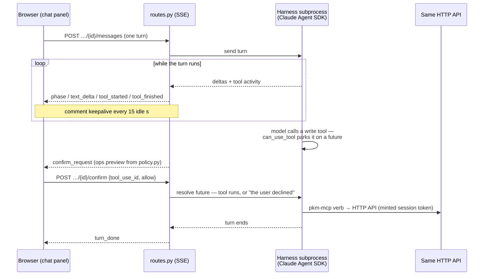
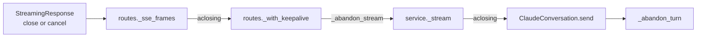

# Embedded assistant and file browser (backend)

Two backend subsystems that sit beside the core API: the in-app LLM assistant
(`pkm/assistant/`), and the content-addressed asset store behind the `/files`
browser (`routes_assets.py`, `assets_core.py`, `pkm/describe/`). Their routes
appear in the API reference table in
[backend.md](backend.md#http-api-reference); the SPA side of both is in
[frontend.md](frontend.md).

## Embedded assistant (`pkm/assistant/`)

The in-app LLM assistant is a **server-side agent harness**, exposed over the
app's first SSE endpoints (`/api/assistant/*`, behind the same
`require_auth`). The harness has no built-in tools, only the twelve `pkm-mcp`
verbs ([cli-and-mcp.md](cli-and-mcp.md#the-mcp-tool-surface)), which loop back
into this same server over HTTP. Assistant writes therefore get the same
validation, conflict handling, journalling and broadcasts as any client.
Design spec:
[`docs/superpowers/specs/2026-07-26-pkm-wn2s-assistant-design.md`](../superpowers/specs/2026-07-26-pkm-wn2s-assistant-design.md);
threat model: [`docs/SECURITY.md`](../SECURITY.md).

| File | Pattern | Role |
|---|---|---|
| `events.py` | Core | The event union routes and the web UI speak (`TextDelta`, `ToolStarted`/`ToolFinished`, `Phase`, `ConfirmRequest`, `TurnDone`, `ErrorEvent`) + `encode_sse()`. Nothing engine-specific leaks upward |
| `policy.py` | Core | The tool gate (seven read verbs auto-allowed, five write verbs confirm-gated), model allowlist (`sonnet` / `opus` / `haiku` / `glm`; `available_models()` drops `glm` when no z.ai key is configured, and `default_model()` picks `glm` when offered, `sonnet` otherwise), tool-activity summaries and write-op previews, and the system prompt |
| `engine.py` | Core | `AgentEngine` / `ConversationHandle` protocols — the seam a second backend (or the test double) plugs into. `send()` is typed as an async generator because the caller closes it |
| `harness_env.py` | Core | `resolve_harness_env()`: requested model + available key → the alias handed to the SDK and the harness subprocess's env (tool loading, provider overrides) |
| `service.py` | Shell | In-memory conversation registry: 3-conversation cap, lazy 15-minute idle reap, per-conversation lock (a second concurrent turn is a 409); `close_all()` runs on app-lifespan shutdown |
| `claude_engine.py` | Shell | The Claude Agent SDK adapter — the only engine today |
| `routes.py` | Shell | The HTTP/SSE endpoints; an engine failure mid-stream is reported in-band as an `error` SSE event, not a broken response. `_with_keepalive()` interleaves a comment frame (`events.SSE_COMMENT`) every `KEEPALIVE_INTERVAL_S` idle seconds |

Conversations are ephemeral: in memory only, with no history table. The engine
is injected into `create_app(config, assistant_engine=...)`; production
defaults to `ClaudeEngine`, while tests and the e2e server inject a fake.

One turn with a confirmed write, end to end:

### Admission is serialized

`create()`'s cap check, eviction and `engine.create_conversation()` call run
under a single `asyncio.Lock`; without it, two concurrent creations could
both observe free capacity before either registered, bypassing the cap or
double-evicting. The lock spans a subprocess spawn, so it is bounded by
`create_timeout` (`CREATE_TIMEOUT_S`, 60s default): a wedged harness fails
that one request instead of wedging every future `create()`. The real hold is
longer than the timeout, because `asyncio.wait_for` waits for the cancelled
task's own cleanup; `CREATE_TIMEOUT_S`'s comment has that arithmetic, and is
the one place that keeps it.

Closing a reaped or evicted conversation's harness runs *after* the lock is
released; the registry pop alone is what enforces the cap, so a hung teardown
blocks only the request that triggered it. That post-lock loop is
cancellation-safe: every queued handle was already popped, nothing else will
retry it, and a cancellation landing mid-`close()` keeps closing the rest of
the queue before being re-raised. Only admission is serialized — sending a
turn, confirming a tool call and deleting a conversation are unaffected.

### Teardown when the client disappears

A tab closed mid-turn, a navigation, or the panel's Stop button all end the
same way: Starlette closes or cancels the response body. Each layer of the SSE
path then closes the next explicitly, rather than dropping it for CPython's
async-generator finalizer to collect.

Finalization would run every `finally` eventually, which is not the same as
running them in order. `_stream` reads `handle.healthy` as it unwinds, and a
dropped handle generator has not run its own cleanup by then, so that read
sees the value from before it. An unacknowledged interrupt would then leave
the conversation in the registry for a later turn to reuse.

`_abandon_stream` cancels *and awaits* the in-flight read before closing the
stream: `aclose()` on a generator with an `__anext__` still in flight raises
"asynchronous generator is already running". It logs failures instead of
raising them, because it runs while a `GeneratorExit` or a cancellation is
already unwinding the caller, and anything raised there would replace the
disconnect and skip the rest of the teardown.

A disconnect also does not arrive once. Starlette runs the response body
inside an anyio cancel scope, and that scope re-cancels every task still
inside it on every loop cycle. A plain `await` during teardown is therefore
cancelled as soon as it starts: `interrupt()` issued, its bounded wait
abandoned, `healthy` left without a verdict. `_wait_out` runs each teardown
step as a task of its own, outside that scope, and waits for it with
`asyncio.wait`, which leaves the task running when our own wait is cut short.
The waiting is capped by `TEARDOWN_TIMEOUT_S`, so a cleanup that never
returns cannot hold the response task, and a core, past that bound; instead
it is left to finish on its own. The entry stays in `_entries` with
`busy=True` until it does: a later turn on that conversation gets a 409 in
the meantime, and `lifespan`'s `close_all()` still closes it on shutdown
regardless.

**`ClaudeConversation._abandon_turn` declines every parked confirm future
first, and only then awaits `interrupt()`** (bounded by
`INTERRUPT_TIMEOUT_S`). The order matters and is easy to get backwards: a
harness sitting in `can_use_tool` cannot acknowledge an interrupt until it
gets its decision, so interrupting first wedges it forever.
`FakeSDKClient.interrupt()` returns instantly, which hides this entirely, so
the regression tests use a subclass whose `interrupt()` never returns. A wait
cut short by a cancellation counts the same as one that timed out, since the
harness is equally uncertain either way.

An unacknowledged interrupt retires the conversation, not just the turn. If
`interrupt()` times out or raises, the subprocess may still be running the
abandoned turn, so `ClaudeConversation` flips `healthy` to `False` and the
conversation must never be handed a later turn. `AssistantService._stream()`
checks `healthy` right after clearing the busy flag — synchronously, so it
cannot race a concurrent admission's reap or evict. It pops the conversation,
and closes the harness only if its own pop removed the entry, so one already
torn down by an explicit `delete()` (the pagehide beacon, say) cannot be
double-closed. The next `send()` for that id gets a plain
`UnknownConversationError` (404).

### How `claude_engine.py` confines the harness

- **One SDK subprocess per conversation**, with `tools=[]` plus a single MCP
  server entry running `python -m pkm.mcp.server`, so the model can only call
  the pkm verbs. `ENABLE_TOOL_SEARCH=false` is required alongside `tools=[]`,
  so the MCP tools load eagerly instead of being deferred behind a
  ToolSearch tool.
- **Provider routing** is decided by `harness_env.resolve_harness_env()`
  before anything is spawned, keyed on `policy.ZAI_MODELS` membership rather
  than a `glm` literal. `model="glm"` runs the same harness against z.ai's
  Anthropic-compatible endpoint, via `ANTHROPIC_BASE_URL` and
  `ANTHROPIC_AUTH_TOKEN` in the subprocess env. The SDK is passed the
  `sonnet` alias: z.ai maps Claude aliases to its plan-default GLM
  server-side, so no GLM version name exists in the code to go stale. The
  token comes from `config.zai_api_key_file` (default `PKM_HOME/zai_key`),
  with `ZAI_API_KEY` as the env fallback; the file wins, like the OpenAI
  key, and is read once at startup. Env is the SDK's token transport, so
  the token is visible in the harness subprocess's environment (and its
  children, including the pkm MCP server) — accepted on a single-user
  deployment. Without a token, `GET /api/assistant/models` omits `glm`, the
  service's `create()` rejects it (400), and the engine refuses it before
  writing the credential file. Claude models are untouched by any of this:
  they keep the machine's subscription login.
- **Auth**: the engine mints a fresh session token (`auth_core.sign_session`)
  into a 0600 temp config file per conversation, passes it to the MCP
  subprocess as `PKM_CLI_CONFIG`, and deletes it on close.
- **Transactional startup**: `create_conversation()` writes that config file,
  then constructs the client and awaits `connect()` inside a
  `try`/`except BaseException` that reuses `ClaudeConversation.close()` for
  cleanup on any exit other than success. The covered exits: the factory
  raising, `connect()` raising, and cancellation delivered into `connect()`
  when admission's `wait_for(create_timeout)` times out on a wedged
  handshake. `close()` tolerates a client that
  never connected, a `disconnect()` that itself raises, and a second
  cancellation landing anywhere in its body; the config-file unlink lives in
  a `finally` because `except Exception` does not catch `BaseException`.
  Startup failure and normal teardown share one code path instead of two.
- **Write confirmation** is the parked-future flow in the diagram above. A
  denial returns "the user declined" to the model instead of erroring the
  turn. Cleanup when the consumer vanishes mid-confirm is
  [Teardown when the client disappears](#teardown-when-the-client-disappears).
- **Silent turns are the norm, not the exception.** Long model reasoning,
  large tool payloads and a parked confirm can all write nothing for minutes,
  so `routes._with_keepalive()` keeps the SSE connection warm with the
  comment frame. Forcing a periodic write also surfaces a client that
  vanished without a clean close, instead of the confirmation prompt being
  written into a dead socket. Thinking *content* is not streamed; instead
  `TurnMapper.map` turns each `content_block_start` into a `phase` event with
  a display label — "reasoning", "preparing `<tool>`", "replying" — which the
  panel's busy line shows with a ticking elapsed clock. Both harnesses
  (Anthropic and z.ai) forward `content_block_start`, with the tool name in
  it, tens of seconds before the assembled tool call arrives.
- **Total SDK silence is a dead network, never honest thinking** — during
  real reasoning the harness emits a steady flow of stream events. When no
  SDK message at all arrives for `STALL_TIMEOUT_S` (5 minutes), the pump
  interrupts the harness (same bounded wait and `healthy` verdict as
  `_abandon_turn`) and reports the stall as an in-band `error`. The deadline
  is suspended while a confirm is parked: that silence is the user's, and a
  slow approval must never kill the turn. The web client has a matching
  guard on its own leg: `streamMessage` errors after 60s with no bytes at
  all, four missed keepalives.
- **Deployment prerequisite**: the SDK bundles its own `claude` binary and
  authenticates with the machine's logged-in Claude subscription. There is
  deliberately no `ANTHROPIC_API_KEY` in the service environment. The `glm`
  model additionally needs the z.ai key file (see Provider routing above).
  See [`deploy/README.md`](../../deploy/README.md).

Testing: no real LLM anywhere in CI. `tests/fake_engine.py` is a scripted
`AgentEngine` double that drives the service and route tests, including a
threaded HTTP confirm round-trip, and the Playwright e2e —
`tests/e2e_serve.py` always wires it in.

## Assets and the file browser

Uploads stream in 1 MiB chunks with a running size cap (413 over
`max_upload_bytes`, default 150 MB), MIME-sniffed from the first chunk
(`mime_sniff.py`). Files are stored content-addressed at
`<assets_dir>/<sha256[:2]>/<sha256>` and deduplicated by digest; the `assets`
row keeps the display filename, MIME and size. Raster images and PDFs serve
inline. Everything else, including SVG, which can script, is forced to
download with `nosniff`.

The upload response's `existing` bool records whether the `assets` row was
already there before this call (a dedup hit) or is brand new. The CLI/MCP
upload workflow keys its failure compensation on it — see
[cli-and-mcp.md](cli-and-mcp.md#shared-write-workflows).

The three management endpoints behind the `/files` browser share
`assets_core.py` for their pure parts:

- **Search** is `LIKE`, not FTS: a personal-scale table, and no
  offline-parity burden. `linked`/`orphan` filtering needs refs for every
  candidate, so that path scans the whole filtered set; `linked=all` computes
  refs only for the returned page.
- **Delete** strips every asset reference token out of block text and removes
  the row, then unlinks the file **after** the commit. A crash then leaves at
  worst an unreferenced file on disk, never a row pointing at a missing file.
  A block left empty *and* childless is deleted outright, but an emptied
  parent is kept: asset deletion must never cascade away real content. Asset
  URLs never produce `refs` rows — only `[[link]]`, `#tag` and `attr::` do —
  so no refs reindex is needed.
- **Selected-asset zip** is form-encoded on purpose, so the web app can drive
  it with a plain `<form method="post">` and let the browser own the
  download. Unknown, malformed, duplicate and missing-on-disk digests are
  skipped rather than erroring, so the zip honestly contains what could be
  exported, and filename collisions get a short sha prefix (`zip_arcnames`).

  The selection's count and total bytes are checked against fixed limits
  (500 assets / 1 GiB, `MAX_EXPORT_ASSET_COUNT` and
  `MAX_EXPORT_TOTAL_BYTES` in `routes_assets.py`) before any archive is
  built. The byte total is summed from the `assets` table's `size` column,
  never by opening a file. Over either limit the request is refused with 413,
  rather than producing a truncated zip.

  Both this route and the whole-graph `/api/export.zip` build their archive in
  a temp directory and stream it back via a `FileResponse` subclass
  (`CleanupFileResponse`) instead of buffering the whole zip in memory. The
  temp directory is removed however the response ends. This is not about an
  ordinary client disconnect: under uvicorn, `send()` silently no-ops once a
  connection drops rather than raising, so the transfer loop still runs to
  completion and stock `FileResponse`'s own `background` task still fires.
  What the subclass guards is a missing or unreadable file at send time
  (`FileResponse.__call__` raises before reaching its `background` line) and,
  as defense in depth, an ASGI server other than uvicorn whose `send()` does
  raise on a dropped connection.

## Image descriptions

Uploaded raster images are captioned by an LLM so their content becomes
findable. A caption is a plain-text transcription of any visible text plus one
or two descriptive sentences, stored in three `assets` columns: `description`,
`described_at` and `describe_error`.

Eligibility is MIME-only: `image/png`, `image/jpeg`, `image/webp` and
`image/gif`. HEIC and SVG are uploadable but not describable. Because
eligibility ignores content, every `image/gif` upload is enqueued regardless of
animation, and an animated gif that OpenAI's vision API rejects surfaces as a
`describe_error` rather than a skip.

### Modules (`pkm/describe/`)

| File | Pattern | Role |
|---|---|---|
| `core.py` | Core | Eligibility (`describe_action`), the OpenAI request payload, response parsing, and status derivation (`described` / `failed` / `pending`) |
| `service.py` | Shell | `DescribeService`: the queue, the worker, and shutdown |
| `openai_client.py` | Shell | The `ImageDescriber` implementation — one `httpx2` POST per image against the OpenAI chat-completions endpoint, with no OpenAI SDK |
| `routes.py` | Shell | The status and scan endpoints (asset search lives in `routes_assets.py`, alongside the other asset routes) |

### The queue

`DescribeService` holds an in-memory `asyncio.Queue`, drained by one
sequential background worker per process. Sequential is the point: it is
rate-limit-friendly rather than fast.

The service also tracks the shas that are queued or mid-attempt in an
`_active` set. `maybe_enqueue` and `scan` both skip a sha already in that set,
so a duplicate upload of the same image, or a scan racing an upload, cannot
queue the same work twice; the worker discards the sha in a `finally`.
`_process` re-reads the row as well, and returns early if a description has
appeared since.

The queue is memory-only. A restart drops whatever was pending, and there is
no persistence or replay on startup. `POST /api/assets/scan` re-enqueues every
asset with `description IS NULL` — add `force=true` to retry rows that
previously failed — and is the recovery path after a restart or an outage.

Passing an `ImageDescriber` to the service transfers ownership of it. Shutdown
uses one retained, cancellation-shielded task that cancels the worker first
and then closes the provider transport exactly once. Every `close()` caller
waits for that shared task, and a caller's own cancellation is re-propagated
only after the owned cleanup finishes. If describer shutdown raises, `app.py`
still attempts assistant conversation cleanup in a `finally`.

### Configuration

The on/off switch is the OpenAI key, resolved in this order:

1. the contents of a key file, by default at `PKM_HOME/openai_key`
2. otherwise the `OPENAI_API_KEY` environment variable, if set

The file wins, so a pkm-specific key — one with its own cost attribution, for
instance — is not shadowed by a general-purpose key in the shell environment.
The default path is the `PKM_HOME` root, a sibling of `data/` rather than
inside it, so the secret never sits alongside servable or exportable content.
It is configurable through the `openai_api_key_file` key in `config.json`,
resolved relative to `config.json` like the other paths. The key file is never
committed and should be mode 600.

`image_descriptions` (bool, default on) and `image_description_model` (default
`gpt-4o-mini`) are the other two `config.json` keys.

A missing key — env and file both absent or empty — or
`image_descriptions: false` degrades every entry point to a no-op
(`DescribeService.enabled = False`) rather than failing uploads.
`GET /api/assets/describe-status` and the `/settings` page surface *why* it is
off.

### Search seam

Descriptions are queryable only through `GET /api/assets/search`, which is
`LIKE` over `description` and `filename` — personal scale, and no
offline-parity burden. They are **not** indexed into `blocks_fts` or
`pages_fts`, and not reachable from `GET /api/search`. Wiring them into the
main FTS index is explicitly deferred; see the epic's scope notes.

## When something looks wrong

Each row is a failure this system has actually produced, and the invariant its
fix installed. The bean has the full investigation.

| Symptom | Cause | Ref |
|---|---|---|
| The assistant never calls any pkm tool; every turn is plain text | with `tools=[]`, the SDK deferred MCP tool discovery behind its own ToolSearch meta-tool unless `ENABLE_TOOL_SEARCH=false` was set | pkm-wn2s |
| A tab closed mid-turn left the conversation in the registry, its harness subprocess and 0600 token file alive, and a later turn was handed that harness | the SSE layer stopped iterating instead of closing the event stream, so the abandon-turn protocol waited on async-generator finalization; the response task's repeated cancellation then cut short the bounded interrupt, leaving `healthy` unset | pkm-f3mo |
| The panel sat at "thinking…" indefinitely on a dead network (7.5 minutes in one outage), with only a manual Stop ending the turn | the SDK's model request has no first-token timeout, and nothing distinguished a stuck request from a thinking model; fixed by the stall watchdog and the client's no-bytes guard | pkm-e9ok |
