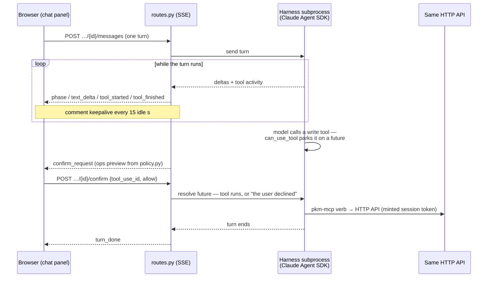
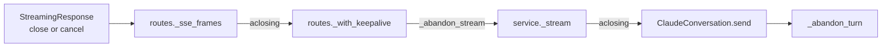

# Embedded assistant (`pkm/assistant/`)

The in-app LLM assistant is a server-side agent harness, exposed over the app's
only SSE endpoints (`/api/assistant/*`, behind the same `require_auth`). The
harness has no built-in tools, only the `pkm-mcp` verbs
([cli-and-mcp.md](cli-and-mcp.md#the-mcp-tool-surface)), which loop back into
this same server over HTTP. Assistant writes therefore get the same validation,
conflict handling, journalling and broadcasts as any client. The routes are in
the API reference table in [backend.md](backend.md#http-api-reference); the chat
panel is in [frontend.md](frontend.md). Design spec:
[`docs/superpowers/specs/2026-07-26-pkm-wn2s-assistant-design.md`](../superpowers/specs/2026-07-26-pkm-wn2s-assistant-design.md);
threat model: [`docs/SECURITY.md`](../SECURITY.md). Failures and their fixes are
indexed by symptom in [troubleshooting.md](../troubleshooting.md).

| File | Pattern | Role |
|---|---|---|
| `events.py` | Core | The event union routes and the web UI speak (`TextDelta`, `ToolStarted`/`ToolFinished`, `Phase`, `ConfirmRequest`, `TurnDone`, `ErrorEvent`) + `encode_sse()`. Nothing engine-specific leaks upward |
| `policy.py` | Core | The tool gate (`READ_TOOLS` auto-allowed, `WRITE_TOOLS` confirm-gated), the model allowlist (`sonnet` / `opus` / `haiku` / `glm`; `available_models()` drops `glm` when no z.ai key is configured, and `default_model()` picks `glm` when offered, `sonnet` otherwise), tool-activity summaries, write-op previews, and the system prompt |
| `engine.py` | Core | `AgentEngine` / `ConversationHandle` protocols — the seam a second backend or the test double plugs into. `send()` is typed as an async generator because the caller closes it |
| `harness_env.py` | Core | `resolve_harness_env()`: requested model + available key → the alias handed to the SDK and the harness subprocess's env |
| `service.py` | Shell | In-memory conversation registry: 3-conversation cap, lazy 15-minute idle reap, per-conversation lock (a second concurrent turn is a 409); `close_all()` runs on app-lifespan shutdown |
| `claude_engine.py` | Shell | The Claude Agent SDK adapter — the only engine today |
| `routes.py` | Shell | The HTTP/SSE endpoints. An engine failure mid-stream is reported in-band as an `error` SSE event rather than a broken response |

Conversations are ephemeral: in memory only, with no history table. The engine
is injected into `create_app(config, assistant_engine=...)`; production defaults
to `ClaudeEngine`, while tests and the e2e server inject a fake.

One turn with a confirmed write, end to end:

## Conversation registry

Admission — the reap, the cap check, eviction and the
`engine.create_conversation()` call — runs under one `asyncio.Lock`. Two
concurrent `create()` calls would otherwise both observe free capacity before
either registered. The lock spans a subprocess spawn, so `asyncio.wait_for`
bounds it by `create_timeout` (`CREATE_TIMEOUT_S`, 60s): a wedged harness fails
that one request instead of wedging every future `create()`. Only admission is
serialized; sending a turn, confirming a tool call and deleting a conversation
are not. Harness teardown for a reaped or evicted conversation runs after the
lock is released, because the registry pop alone enforces the cap, so a hung
`close()` blocks only the request that triggered it.

A tab closed mid-turn, a navigation, or the panel's Stop button all end the same
way: Starlette closes or cancels the response body, and each layer of the SSE
path then closes the next explicitly, rather than leaving it to CPython's
async-generator finalizer.

`_abandon_stream` awaits the in-flight read before `aclose()`, because
`aclose()` on a generator with a live `__anext__` raises, and it logs rather
than raises, because it unwinds inside a `GeneratorExit`. Each teardown step
runs through `_wait_out` as a task of its
own, outside Starlette's cancel scope, waited on with `asyncio.wait` and capped
by `TEARDOWN_TIMEOUT_S` (30s). Past that bound the entry stays in `_entries`
with `busy=True`, a later turn on it gets a 409, and `lifespan`'s `close_all()`
takes it at shutdown.

`ClaudeConversation._abandon_turn` declines every parked confirm future before
it awaits `interrupt()` (bounded by `INTERRUPT_TIMEOUT_S`): a harness sitting in
`can_use_tool` cannot acknowledge an interrupt until it gets its decision. A
wait cut short by a cancellation counts the same as one that timed out, because
the harness's state is unknown in both cases.

**An unacknowledged interrupt retires the whole conversation:**
`ClaudeConversation` flips `healthy` to `False` when `interrupt()` times out or
raises, because the subprocess may still be running the abandoned turn.
`AssistantService._stream()` checks `healthy` right after clearing the busy
flag, synchronously, so it cannot race a concurrent admission's reap or evict.
Pop-then-close is idempotent against an explicit `delete()`, such as the
pagehide beacon, and the next `send()` for that id gets a plain
`UnknownConversationError` (404).

## Harness confinement

What `claude_engine.py` fixes before and around each harness subprocess:

| Concern | Mechanism | Rule |
|---|---|---|
| Tool surface | One SDK subprocess per conversation, with `tools=[]` plus a single MCP server entry running `python -m pkm.mcp.server` | `ENABLE_TOOL_SEARCH=false` is required alongside `tools=[]`, so the MCP tools load eagerly instead of being deferred behind a ToolSearch tool |
| Provider routing | `harness_env.resolve_harness_env()` decides before anything is spawned, keyed on `policy.ZAI_MODELS` membership rather than a `glm` literal | `model="glm"` runs the same harness against z.ai's Anthropic-compatible endpoint (`ZAI_BASE_URL`), via `ANTHROPIC_BASE_URL` and `ANTHROPIC_AUTH_TOKEN` in the subprocess env. The SDK is passed the `ZAI_SDK_MODEL` (`sonnet`) alias: z.ai maps Claude aliases to its plan-default GLM server-side, so no GLM version name exists in the code to go stale |
| Auth | The engine mints a fresh session token (`auth_core.sign_session`) into a 0600 temp config file per conversation, and passes it to the MCP subprocess as `PKM_CLI_CONFIG` | The file is deleted on close. The token is visible in the harness subprocess's environment and its children, including the pkm MCP server — accepted on a single-user deployment |
| Transactional startup | `create_conversation()` writes that config file, then constructs the client and awaits `connect()` inside a `try`/`except BaseException` that reuses `ClaudeConversation.close()` for cleanup on any exit other than success | The config-file unlink lives in a `finally`, because `except Exception` does not catch `BaseException` |
| Write confirmation | The parked-future flow in the diagram above | A denial returns "the user declined" to the model instead of erroring the turn |
| Deployment prerequisite | The SDK bundles its own `claude` binary and authenticates with the machine's logged-in Claude subscription. See [`deploy/README.md`](../../deploy/README.md) | No `ANTHROPIC_API_KEY` is set in the service environment |

The z.ai token comes from `config.zai_api_key_file` (default `PKM_HOME/zai_key`),
with `ZAI_API_KEY` as the env fallback; the file wins, and it is read once at
startup, so rotating it needs a restart. Without a token,
`GET /api/assistant/models` omits `glm`, the service's `create()` rejects it
(400), and the engine refuses it before writing the credential file. Claude
models keep the machine's subscription login.

## Keepalives and the stall watchdog

**Keepalives.** A turn can write nothing for minutes: long model reasoning, a
large tool payload, or a confirm parked on the user. `routes._with_keepalive()`
interleaves a comment frame (`events.SSE_COMMENT`) every `KEEPALIVE_INTERVAL_S`
(15) idle seconds, which keeps the connection warm past NAT and proxy idle
timeouts. The periodic write also detects a client that vanished without a clean
close. Thinking *content* is not streamed; instead `TurnMapper.map` turns each
`content_block_start` into a `phase` event with a display label — "reasoning",
"preparing `<tool>`", "replying" — which the panel's busy line shows with a
ticking elapsed clock. Both harnesses, Anthropic and z.ai, forward
`content_block_start` with the tool name in it.

**Stall watchdog.** Total SDK silence means a dead network; during real
reasoning the harness emits a steady flow of stream events. When no SDK message
arrives for `STALL_TIMEOUT_S` (5 minutes), the pump interrupts the harness, with
the same bounded wait and `healthy` verdict as `_abandon_turn`, and then reports
the stall as an in-band `error`. The interrupt is issued before that error
event, because the error ends the consumer's loop and would cancel the interrupt
mid-flight. The deadline is suspended while a confirm is parked: that silence is
the user's, and a slow approval must never kill the turn. The web client has a
matching guard on its own leg, where `streamMessage` errors after 60s with no
bytes at all, four missed keepalives.

## Testing

No real LLM anywhere in CI. `tests/fake_engine.py` is a scripted `AgentEngine`
double that drives the service and route tests, including a threaded HTTP
confirm round-trip, and the Playwright e2e — `tests/e2e_serve.py` always wires it
in.
