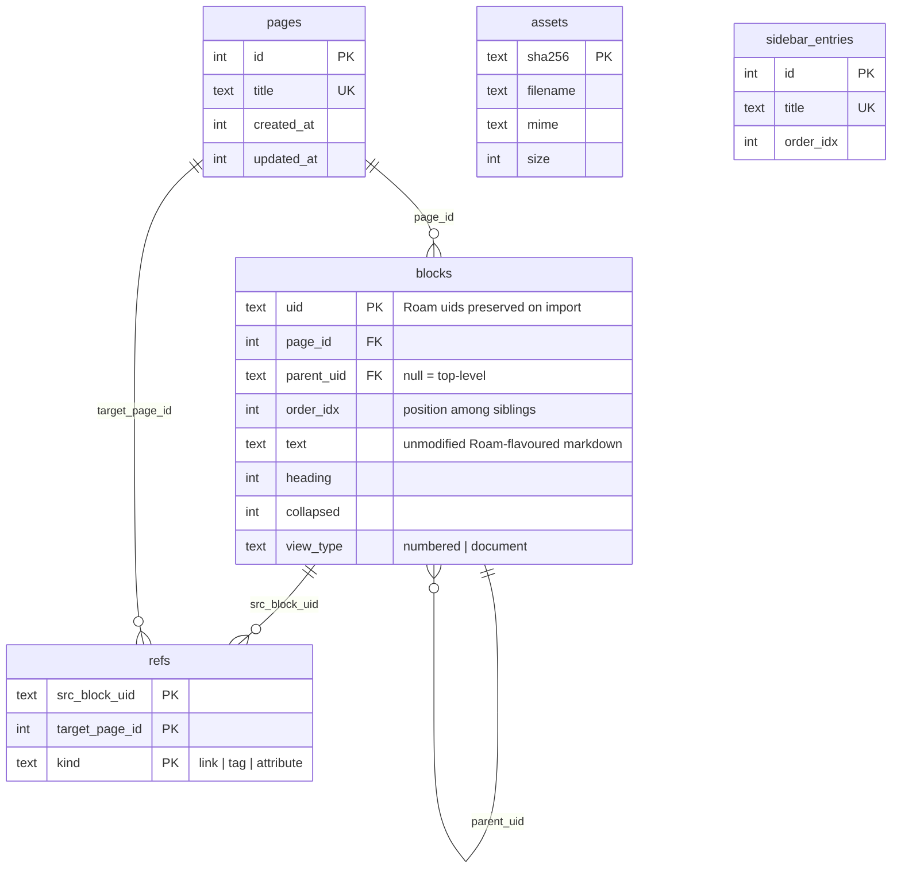
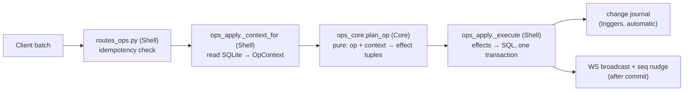
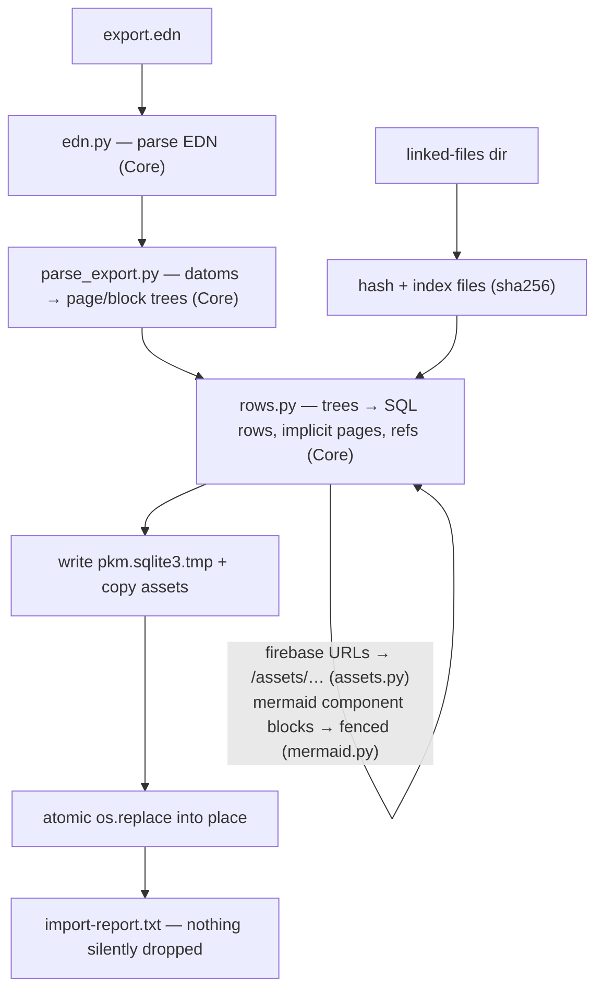

# Backend architecture (server/ + HTTP API)

The backend is a Python 3.12+ FastAPI application over a single SQLite file.
It is the sole authority for the graph: every mutation flows through one
endpoint (`POST /api/ops`), refs and full-text indexes are re-derived inside
the same transaction, and a trigger-based change journal feeds the sync
protocol. There is no ORM and no migration framework — raw `sqlite3` with
replayable DDL.

Start with [overview.md](overview.md) for the system-level picture. The sync
protocol has its own doc: [sync-and-offline.md](sync-and-offline.md).

## Tech stack

| Concern | Choice |
|---|---|
| Language / runtime | Python ≥ 3.12, [uv](https://docs.astral.sh/uv/) for env + deps, hatchling build |
| Web framework | FastAPI (+ Pydantic v2 models, uvicorn, `websockets`) |
| Storage | SQLite (WAL), FTS5 for search — no ORM, raw `sqlite3` |
| HTTP client (CLI/MCP) | httpx2 |
| MCP | `mcp` SDK (FastMCP, stdio) |
| Tests / QA | pytest (95% branch coverage enforced), pyrefly (type check), ruff (lint) |

## Module map

Everything lives under `server/src/pkm/`. Every runtime file declares
`# pattern: Functional Core` (pure logic) or `# pattern: Imperative Shell`
(I/O) near the top — see [overview.md](overview.md#functional-core--imperative-shell)
for the pattern.

```
pkm/
├── schema.py            Core   Single source of DDL: BASE_DDL (replicated to clients)
│                               + SERVER_DDL (journal, idempotency) = DDL
├── refs.py              Core   Ref grammar: [[links]], #tags, attr::, ((refs)), {{embeds}}
├── rename.py            Core   rewrite_title_refs() for page rename/merge
├── todo.py              Core   {{TODO}}/{{DONE}} marker parsing (mirrors web/src/grammar/todo.ts)
├── filenames.py         Core   safe_filename() shared by upload + export
├── edn.py               Core   Minimal EDN parser for Roam exports
├── schema_dump.py       Shell  Generates web/src/replica/baseSchema.gen.ts
├── refs_parity_dump.py  Shell  Generates shared/fixtures/refs_parity.json
│
├── server/              The FastAPI app (details below)
├── importer/            Roam EDN import pipeline
├── export/              Markdown export (markdown.py Core render, writer.py Shell)
├── backup/              Nightly backup job (__main__.py Shell, rotation.py Core)
├── cli/                 `pkm` CLI (main.py Shell; build.py/render.py Core planners)
├── client/              Shared HTTP client (api.py Shell PkmClient, core.py Core)
├── mcp/                 `pkm-mcp` FastMCP stdio server over the same client
└── test_data/           Synthetic fixture graph generator
```

Inside `pkm/server/`:

| File | Pattern | Role |
|---|---|---|
| `app.py` | Shell | App factory `create_app(config)`; runs `init_db()`, mounts routers, serves the SPA |
| `config.py` | Shell | Frozen `Config` loaded from the data dir's `config.json` |
| `db.py` | Shell | `init_db()`/`open_db()`, per-request connection dependency, column migrations |
| `auth.py` / `auth_core.py` | Shell / Core | Login routes + `require_auth`; scrypt password check, HMAC session tokens |
| `routes_pages.py`, `routes_ops.py`, `routes_search.py`, `routes_sidebar.py`, `routes_sync.py`, `routes_assets.py` | Shell | The HTTP surface (table below) |
| `ops_core.py` | Core | Op models + pure `plan_op()` → effect tuples |
| `ops_apply.py` | Shell | Reads SQLite into an `OpContext`, executes planned effects |
| `store.py` | Shell | Reusable page mutations (create/delete/rename/merge); never commits |
| `tree.py`, `backlinks.py`, `daily.py`, `fts.py`, `query.py`, `sync_core.py`, `mime_sniff.py`, `response_models.py` | Core | Pure helpers: tree building, backlink shaping, daily-page titles, FTS queries, `{{[[query]]}}` evaluation, sync windowing, MIME sniffing, Pydantic response models |
| `ws.py` / `notify.py` | Shell | WebSocket hub + broadcast nudges |
| `run.py` / `setup.py` | Shell | `python -m pkm.server.run` entrypoint; `setup` writes `config.json` |
| `openapi_dump.py` / `shim_parity_dump.py` | Shell | Generated-artifact writers (see [Generated artifacts](#generated-artifacts-and-parity-fixtures)) |

## Database

One SQLite file (`pkm.sqlite3`) in the data directory. WAL mode and schema
are applied **once at startup** by `init_db()` (`server/db.py`) — per-request
PRAGMA setup previously caused lock errors. Request handlers get a fresh
connection each (`check_same_thread=False`, `Row` factory, `foreign_keys=ON`,
`recursive_triggers=ON`, `busy_timeout=5000`).

Schema lives in `pkm/schema.py` as two DDL blocks: `BASE_DDL` is the data
model and is **replicated verbatim to browser clients** (via the generated
`baseSchema.gen.ts`); `SERVER_DDL` adds server-only sync machinery and never
leaves the server.



Around that base model:

- **Derived indexes.** `blocks_fts` and `pages_fts` are external-content FTS5
  tables kept in sync by `AFTER INSERT/UPDATE/DELETE` triggers. Block text is
  the only durable data — `refs` and FTS are always rebuilt from it.
  (`blocks_fts` is keyed by implicit rowid, so `VACUUM` would break it.)
- **Server-only tables** (`SERVER_DDL`):
  - `changes(seq AUTOINCREMENT, kind, entity_id, deleted)` — the append-only
    change journal. Populated by **row-level triggers** on
    blocks/pages/sidebar, not by route code, so any new write path is
    automatically journalled. Cascade deletes journal correctly *only*
    because `recursive_triggers=ON`.
  - `applied_batches(batch_id, request_hash, response)` — op idempotency.
  - `sync_meta` — holds a random `db_generation` token; a rebuilt database
    gets a new token and clients rebootstrap.
- **Migrations.** No framework. Additive tables/indexes are replayable
  `IF NOT EXISTS` statements in `schema.py`; additive columns are guarded
  `PRAGMA` checks in `db._ensure_schema_migrations` (currently
  `blocks.view_type`). Client replicas rebootstrap on schema-hash change.

## The write path

`POST /api/ops` is the **only** way anything mutates. Clients send an
`OpBatch` (`client_id`, optional `batch_id`, 1–500 ops) of block-level
operations: `create`, `update_text`, `move`, `delete`, `set_collapsed`,
`set_heading`, `set_view_type`, `create_page`.

The path is the cleanest FCIS example in the repo — a pure planner
sandwiched between two thin shells:



Key mechanics:

- **Ordering.** Siblings hold integer `order_idx`; an insert or move emits a
  `ShiftSiblings` effect (bump every sibling ≥ target index) before placing
  the block. Cross-page moves re-page the whole subtree and touch both pages;
  a parent-chain check prevents cycles.
- **Refs re-derivation.** Every text change emits `ReindexRefs`: delete the
  block's refs, re-extract with `refs.py`, get-or-create referenced pages,
  re-insert.
- **Conflict handling (per-block LWW with preservation).** `update_text`
  carries an optional `base_text_hash` — the sha256 of the text the edit was
  based on (a *text* hash, not a version counter, so structural changes don't
  manufacture conflicts). On mismatch the incoming edit wins but the losing
  text is preserved as a `[[conflict]]` sibling block; an edit to a
  since-deleted block is appended to today's daily page instead of vanishing.
- **Idempotency.** A retried batch (same `batch_id` + identical canonical
  request hash) replays the stored ack with no effects; same id with a
  different payload is a 409. This is what makes offline queue replay safe.
- **Broadcast.** After commit, the WebSocket hub pushes the applied ops and a
  `{type:"seq", seq}` nudge to other clients (see
  [sync-and-offline.md](sync-and-offline.md)).

Page-level mutations (create/delete/rename/merge) live in `store.py` as
composable functions that never commit; routes own the transaction.
`POST /api/page/{title}/rename` rewrites all referencing block text via
`rename.py` and merges (concatenating blocks) when `allow_merge` is set.

## Auth

Deliberately modest, layered under Tailscale (see `docs/SECURITY.md`):

- One shared password, checked with scrypt in constant time
  (`auth_core.py`). `POST /api/login` sets a `pkm_session` cookie —
  HMAC-SHA256-signed `v1.<issued_ms>.<sig>`, httponly, `samesite=lax`,
  1-year expiry.
- Every feature router is declared with
  `dependencies=[Depends(require_auth)]`; public surface is only `GET
  /login`, `POST /api/login`, `GET /healthz`, and the static SPA shell.
- The WebSocket verifies the same cookie and closes unauthenticated
  connections with code 4401.
- The server binds loopback + the Tailscale IP only (default port 8974);
  Tailscale is the real transport boundary.

## HTTP API reference

Authoritative sources: the `routes_*.py` modules and the generated
`web/src/api/openapi.json` (regenerate with `pkm.server.openapi_dump`; the
server test suite fails if it is stale). Response models are Pydantic
classes in `response_models.py`, which is what makes the generated TS types
trustworthy. All endpoints require the session cookie unless marked public.
FastAPI's `/docs` and `/redoc` are disabled.

| Method | Path | Purpose |
|---|---|---|
| POST | `/api/login` *(public)* | Password → signed session cookie |
| GET | `/login` *(public)* | Inline HTML login form |
| GET | `/healthz` *(public)* | Liveness check |
| GET | `/{path}` *(public)* | SPA fallback: serves `web_dist` (index.html no-cache, hashed bundles under `/app-assets/`) |
| GET | `/api/openapi.json` | Live OpenAPI schema |
| **Writes** | | |
| POST | `/api/ops` | **The only write path** — apply an `OpBatch` transactionally |
| **Pages & blocks** | | |
| GET | `/api/page/{title}?bl_offset&bl_limit` | Page tree + paginated backlinks (daily pages auto-created) |
| GET | `/api/block/{uid}` | One block subtree with page context + breadcrumbs |
| GET | `/api/block-refs?uids=` | Resolve `((uid))` references on demand |
| POST | `/api/pages` | Idempotent page create |
| DELETE | `/api/page/{title}` | Delete page + blocks (+ sidebar entry); inbound links remain as text |
| POST | `/api/page/{title}/rename` | Rename and rewrite refs; 409 on collision unless `allow_merge` |
| GET | `/api/unlinked?title` | Unlinked mentions of a title |
| GET | `/api/journal?before&days` | Daily-notes feed (infinite scroll) |
| POST | `/api/journal/cleanup` | Prune empty daily pages (spares today + referenced blocks) |
| GET | `/api/current-work` | Recently edited pages, bucketed by age |
| **Search & queries** | | |
| GET | `/api/search?q` | FTS5 search over pages + blocks |
| GET | `/api/query?expr` | `{{[[query]]}}` evaluation (`and`/`or`/`not` over refs) |
| GET | `/api/titles?q` | Title completion for `[[` / `#` autocomplete |
| GET | `/api/todos?page` | `{{TODO}}` blocks grouped by page |
| **Sidebar** | | |
| GET / POST / PUT / DELETE | `/api/sidebar`… | Pinned pages: list / pin / reorder (permutation-validated) / unpin |
| **Sync** (see [sync-and-offline.md](sync-and-offline.md)) | | |
| GET | `/api/sync/snapshot` | Full graph bootstrap + `seq` + `generation` |
| GET | `/api/sync/changes?since&limit` | Windowed incremental change feed |
| WS | `/api/ws` | Push nudges: applied-op broadcasts + `seq` hints |
| **Assets** | | |
| POST | `/api/assets` | Multipart upload → content-addressed storage |
| GET | `/assets/{sha256}/{filename}` | Serve by digest (immutable cache) |

### Assets

Uploads stream in 1 MiB chunks with a running size cap (413 over
`max_upload_bytes`, default 150 MB), MIME-sniffed from the first chunk
(`mime_sniff.py`). Files are stored content-addressed at
`<assets_dir>/<sha256[:2]>/<sha256>` and deduplicated by digest; the `assets`
row keeps the display filename/MIME/size. Raster images and PDFs serve
inline; everything else (including SVG, which can script) is forced to
download with `nosniff`.

## Importer (Roam EDN → fresh database)

`python -m pkm.importer.run export.edn --files <dir> --out <data-dir>`. Each
run builds a complete new database and atomically swaps it in — re-running is
always safe.



Roam block uids, ordering and timestamps are preserved, so every existing
`((block ref))` and daily-note link keeps resolving.

## Export and backup

- **Markdown export** (`export/writer.py::export_graph`): renders every page
  to `export/pages/<title>.md` and dailies to `export/journal/YYYY-MM-DD.md`
  (`markdown.py` resolves `((refs))` to text), and mirrors assets
  incrementally. Markdown files are rewritten byte-identically when unchanged,
  so the git diff of a nightly export is minimal.
- **Backup job** (`python -m pkm.backup`, nightly via launchd): takes an
  online SQLite `.backup()` snapshot from a read-only connection into
  `backups/sqlite/pkm-YYYY-MM-DD.sqlite3` (pruned by `rotation.py`: newest 14
  dailies + the latest of each month forever), then runs the markdown export
  **from that same snapshot** and git-commits it. The live DB is never opened
  for writing; any failure exits non-zero.

## CLI and MCP server

`pkm` (CLI) and `pkm-mcp` (FastMCP stdio server) are thin shells over the
same HTTP client — they talk to the running server's API, never to SQLite
directly, so they get the same validation, conflict handling, journalling
and broadcasts as the web client.

- `client/api.py::PkmClient` owns all I/O: config at
  `~/.config/pkm-cli/config.json` (session token from `pkm login`, sent as
  the `pkm_session` cookie), HTTP via httpx2. Tests inject an in-process
  FastAPI `TestClient`.
- `cli/build.py` (Core) holds the pure planners: `plan_save` (indented
  outline text → create ops), `plan_batch` (the `pkm batch` command language:
  `create`/`todo`/`update`/`move`/`delete`/`outline`, `as`-aliases,
  matched-or-created `## Heading` parents), `asset_block_text` (MIME → image
  embed / `{{[[pdf]]}}` macro / link). `cli/render.py` (Core) renders API
  payloads to terminal markdown.
- Writes go through `POST /api/ops` with a fresh `batch_id`; `pkm update`
  fetches current text first and rides the `base_text_hash` conflict path.
- The MCP server exposes ten tools (`get_page`, `get_block`, `search`,
  `query`, `backlinks`, `todos`, `save_note`, `update_block`, `batch`,
  `upload_asset`) built from the same planners; reads return markdown
  annotated with `^uid` markers the write tools accept.

## Generated artifacts and parity fixtures

Several artifacts are generated from the server and checked in; **the server
test suite fails if any is stale**, so regenerate and commit them together
with the change that invalidates them:

| Artifact | Generator | Guarded by | Consumed by |
|---|---|---|---|
| `web/src/api/openapi.json` (→ `types.d.ts` via `pnpm gen-types`) | `pkm.server.openapi_dump` | `tests/test_openapi_sync.py` | Web API layer — Pydantic models are the single source of API types |
| `web/src/replica/baseSchema.gen.ts` | `pkm.schema_dump` | `tests/test_schema_artifact.py` | Browser sqlite-wasm replica (BASE_DDL only, never SERVER_DDL) |
| `shared/fixtures/ref_grammar.json` | hand-maintained cases | both parsers' test suites | Pins Python `refs.py` and the TS grammar scanner to identical behaviour |
| `shared/fixtures/refs_parity.json` | `pkm.refs_parity_dump` | `tests/test_refs_parity_fixture.py` | TS extractors replay the exact Python outputs |
| `shared/fixtures/shim_parity.json` | `pkm.server.shim_parity_dump` | `tests/test_shim_parity_fixture.py` | The offline API shim (`web/src/replica/localApi/`) must return byte-identical JSON to the real routes |

## Configuration and entrypoints

`config.json` lives in the data directory (never in git; written mode 0600
by `python -m pkm.server.setup`): `db_file`, `assets_dir`,
`password_salt`/`password_hash`, `session_secret`, `cookie_secure`,
`bind_hosts`, `max_upload_bytes`, optional `web_dist` (unset = API-only
server). `python -m pkm.server.run` serves on port 8974, binding loopback +
the Tailscale IP. `create_app()` always runs `init_db()`, so any entrypoint
(server, tests, artifact dumps) works against a brand-new data dir.

Daily pages are special throughout: titles use Roam's ordinal format
(`July 8th, 2026`, `daily.py`) for import compatibility, they are
auto-created on read, and they cannot be renamed.

## Testing

- `cd server && uv run pytest -q` — ~70 test files, roughly one per module.
  Branch coverage is enforced at 95% (`--cov-fail-under=95` in
  `pyproject.toml`), so new code without tests fails the suite.
- `conftest.py` provides a seeded temp database (fixed 5-page fixture, daily
  page "July 7th, 2026"), an authenticated `TestClient`, and a `PkmClient`
  wired to the in-process app.
- `uv run pyrefly check` (type check; pyright configured as a second
  opinion) and `uv run ruff check` (lint, line length 120).
