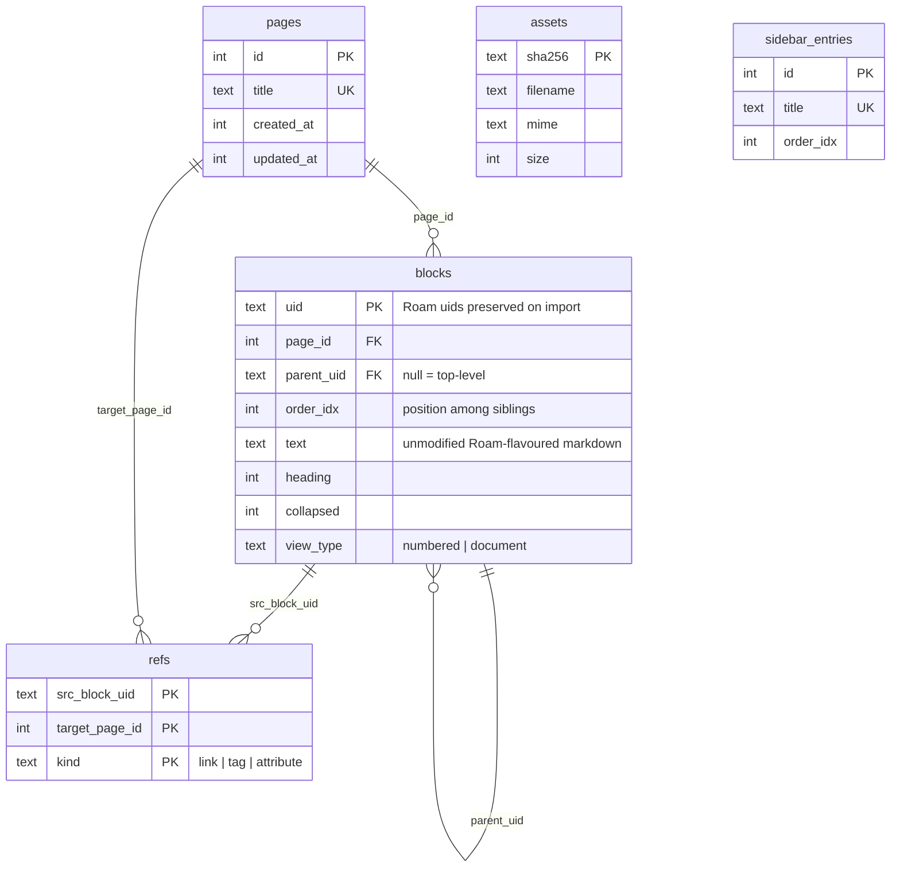
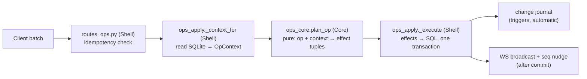
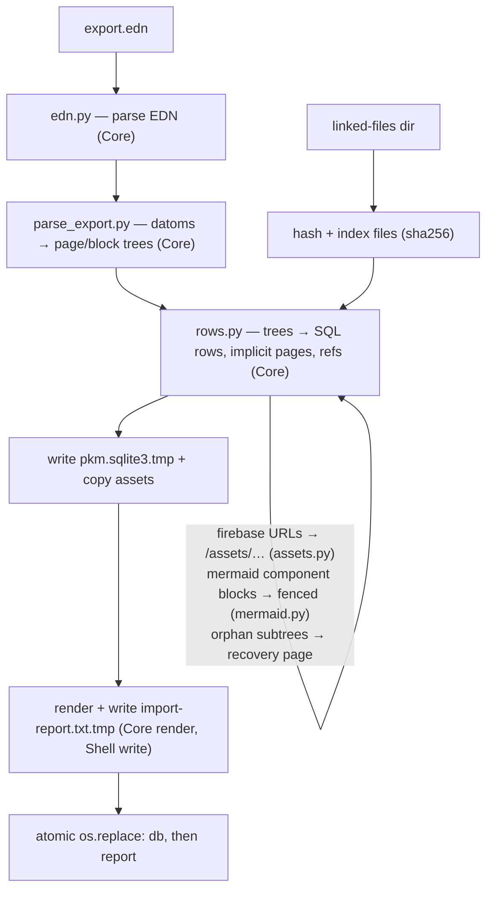

# Backend architecture (server/ + HTTP API)

The backend is a Python 3.12+ FastAPI application over a single SQLite file.
It is the sole authority for the graph: every mutation flows through one
endpoint (`POST /api/ops`), refs and full-text indexes are re-derived inside
the same transaction, and a trigger-based change journal feeds the sync
protocol. There is no ORM and no migration framework — raw `sqlite3` with
replayable DDL.

Start with [overview.md](overview.md) for the system-level picture. The sync
protocol has its own doc: [sync-and-offline.md](sync-and-offline.md).

## Tech stack

| Concern | Choice |
|---|---|
| Language / runtime | Python ≥ 3.12, [uv](https://docs.astral.sh/uv/) for env + deps, hatchling build |
| Web framework | FastAPI (+ Pydantic v2 models, uvicorn, `websockets`) |
| Storage | SQLite (WAL), FTS5 for search — no ORM, raw `sqlite3` |
| HTTP client (CLI/MCP) | httpx2 |
| MCP | `mcp` SDK (FastMCP, stdio) |
| Assistant harness | `claude-agent-sdk` (bundles its own `claude` CLI binary) |
| Tests / QA | pytest (95% branch coverage enforced), pyrefly (type check), ruff (lint) |

## Module map

Everything lives under `server/src/pkm/`. Every runtime file declares
`# pattern: Functional Core` (pure logic) or `# pattern: Imperative Shell`
(I/O) near the top — see [overview.md](overview.md#functional-core--imperative-shell)
for the pattern.

```
pkm/
├── schema.py            Core   Single source of DDL: BASE_DDL (replicated to clients)
│                               + SERVER_DDL (journal, idempotency) = DDL
├── refs.py              Core   Ref grammar: [[links]], #tags, attr::, ((refs)), {{embeds}}
├── rename.py            Core   rewrite_title_refs() for page rename/merge
├── todo.py              Core   {{TODO}}/{{DONE}} marker parsing (mirrors web/src/grammar/todo.ts)
├── filenames.py         Core   safe_filename() shared by upload + export
├── assets_core.py       Core   Asset-browser helpers: reference-token stripping,
│                               MIME categorisation (+ its SQL twin), zip arcnames
├── edn.py               Core   Minimal EDN parser for Roam exports
├── schema_dump.py       Shell  Generates web/src/replica/baseSchema.gen.ts
├── refs_parity_dump.py  Shell  Generates shared/fixtures/refs_parity.json
│
├── server/              The FastAPI app (details below)
├── importer/            Roam EDN import pipeline
├── export/              Markdown export (markdown.py Core render, writer.py Shell)
├── backup/              Nightly backup job (__main__.py Shell, rotation.py Core)
├── cli/                 `pkm` CLI (main.py Shell; build.py/render.py Core planners)
├── client/              Shared HTTP client (api.py Shell PkmClient, core.py Core)
├── mcp/                 `pkm-mcp` FastMCP stdio server over the same client
├── assistant/           Embedded LLM assistant: SSE routes + Claude Agent SDK
│                        harness confined to the pkm MCP tools (details below)
└── test_data/           Synthetic fixture graph generator
```

Inside `pkm/server/`:

| File | Pattern | Role |
|---|---|---|
| `app.py` | Shell | App factory `create_app(config)`; runs `init_db()`, builds the `AssistantService` (engine injectable), mounts routers, serves the SPA |
| `config.py` | Shell | Frozen `Config` loaded from the data dir's `config.json` |
| `db.py` | Shell | `init_db()`/`open_db()`, per-request connection dependency, column migrations |
| `auth.py` / `auth_core.py` / `throttle_core.py` | Shell / Core / Core | Login routes + `require_auth`; scrypt password check, HMAC session tokens; per-source login backoff policy (see [Auth](#auth)) |
| `routes_pages.py`, `routes_ops.py`, `routes_search.py`, `routes_sidebar.py`, `routes_sync.py`, `routes_assets.py`, `routes_export.py` | Shell | The HTTP surface (table below) |
| `ops_core.py` | Core | Op models + pure `plan_op()` → effect tuples |
| `ops_apply.py` | Shell | Reads SQLite into an `OpContext`, executes planned effects |
| `store.py` | Shell | Reusable page mutations (create/delete/rename/merge); never commits |
| `tree.py`, `backlinks.py`, `daily.py`, `fts.py`, `query.py`, `sync_core.py`, `mime_sniff.py`, `response_models.py` | Core | Pure helpers: tree building, backlink shaping, daily-page titles, FTS queries, `{{[[query]]}}` evaluation, sync windowing, MIME sniffing, Pydantic response models |
| `ws.py` / `notify.py` | Shell | WebSocket hub + broadcast nudges |
| `request_log.py` / `logfmt.py` | Shell / Core | The `pkm.access` request log — one line per request, with durations (see [Logging](#logging-and-observability)) |
| `run.py` / `setup.py` | Shell | `python -m pkm.server.run` entrypoint; `setup` writes `config.json` |
| `openapi_dump.py` / `shim_parity_dump.py` | Shell | Generated-artifact writers (see [Generated artifacts](#generated-artifacts-and-parity-fixtures)) |

The embedded assistant is the one HTTP surface *not* in this package: its
routes and service live in the sibling `pkm/assistant/` package
([details below](#embedded-assistant-pkmassistant)); `app.py` constructs
the service and mounts its router alongside the ones above.

## Database

One SQLite file (`pkm.sqlite3`) in the data directory. WAL mode and schema
are applied **once at startup** by `init_db()` (`server/db.py`) — per-request
PRAGMA setup previously caused lock errors. Request handlers get a fresh
connection each (`check_same_thread=False`, `Row` factory, `foreign_keys=ON`,
`recursive_triggers=ON`, `busy_timeout=5000`).

Schema lives in `pkm/schema.py` as two DDL blocks: `BASE_DDL` is the data
model and is **replicated verbatim to browser clients** (via the generated
`baseSchema.gen.ts`); `SERVER_DDL` adds server-only sync machinery and never
leaves the server.


```mermaid
erDiagram
    pages ||--o{ blocks : "page_id"
    blocks ||--o{ blocks : "parent_uid"
    blocks ||--o{ refs : "src_block_uid"
    pages ||--o{ refs : "target_page_id"

    pages {
        int id PK
        text title UK
        int created_at
        int updated_at
    }
    blocks {
        text uid PK "Roam uids preserved on import"
        int page_id FK
        text parent_uid FK "null = top-level"
        int order_idx "position among siblings"
        text text "unmodified Roam-flavoured markdown"
        int heading
        int collapsed
        text view_type "numbered | document"
    }
    refs {
        text src_block_uid PK
        int target_page_id PK
        text kind PK "link | tag | attribute"
    }
    assets {
        text sha256 PK
        text filename
        text mime
        int size
    }
    sidebar_entries {
        int id PK
        text title UK
        int order_idx
    }
```

Around that base model:

- **Derived indexes.** `blocks_fts` and `pages_fts` are external-content FTS5
  tables kept in sync by `AFTER INSERT/UPDATE/DELETE` triggers. Block text is
  the only durable data — `refs` and FTS are always rebuilt from it.
  (`blocks_fts` is keyed by implicit rowid, so `VACUUM` would break it.)
- **Server-only tables** (`SERVER_DDL`):
  - `changes(seq AUTOINCREMENT, kind, entity_id, deleted)` — the append-only
    change journal. Populated by **row-level triggers** on
    blocks/pages/sidebar, not by route code, so any new write path is
    automatically journalled. Cascade deletes journal correctly *only*
    because `recursive_triggers=ON`.
  - `applied_batches(batch_id, request_hash, response)` — op idempotency.
  - `sync_meta` — holds a random `db_generation` token; a rebuilt database
    gets a new token and clients rebootstrap.
- **Migrations.** No framework. Additive tables/indexes are replayable
  `IF NOT EXISTS` statements in `schema.py`; additive columns are guarded
  `PRAGMA` checks in `db._ensure_schema_migrations` (currently
  `blocks.view_type`). Client replicas rebootstrap on schema-hash change.

## The write path

`POST /api/ops` is the **only** way anything mutates. Clients send an
`OpBatch` (`client_id`, optional `batch_id`, 1–500 ops) of block-level
operations: `create`, `update_text`, `move`, `delete`, `set_collapsed`,
`set_heading`, `set_view_type`, `create_page`.

The path is the cleanest FCIS example in the repo — a pure planner
sandwiched between two thin shells:


```mermaid
flowchart LR
    C[Client batch] --> R["routes_ops.py (Shell)<br/>idempotency check"]
    R --> CTX["ops_apply._context_for (Shell)<br/>read SQLite → OpContext"]
    CTX --> P["ops_core.plan_op (Core)<br/>pure: op + context → effect tuples"]
    P --> X["ops_apply._execute (Shell)<br/>effects → SQL, one transaction"]
    X --> J["change journal<br/>(triggers, automatic)"]
    X --> B["WS broadcast + seq nudge<br/>(after commit)"]
```

Key mechanics:

- **Ordering.** Siblings hold integer `order_idx`; an insert or move emits a
  `ShiftSiblings` effect (bump every sibling ≥ target index) before placing
  the block. Cross-page moves re-page the whole subtree and touch both pages;
  a parent-chain check prevents cycles.
- **Refs re-derivation.** Every text change emits `ReindexRefs`: delete the
  block's refs, re-extract with `refs.py`, get-or-create referenced pages,
  re-insert.
- **Conflict handling (per-block LWW with preservation).** `update_text`
  carries an optional `base_text_hash` — the sha256 of the text the edit was
  based on (a *text* hash, not a version counter, so structural changes don't
  manufacture conflicts). On mismatch the incoming edit wins but the losing
  text is preserved as a `[[conflict]]` sibling block; an edit to a
  since-deleted block is appended to today's daily page instead of vanishing.
  The sibling's uid is minted by the server's own generator (`ops_apply.py`),
  independently alphanumeric-first as of pkm-y5yv (see below) — the same
  invariant every uid minter in this project now holds, so the CLI can
  address it without `--`.
- **Idempotency.** A retried batch (same `batch_id` + identical canonical
  request hash) replays the stored ack with no effects; same id with a
  different payload is a 409. This is what makes offline queue replay safe.
- **Broadcast.** After commit, the WebSocket hub pushes the applied ops and a
  `{type:"seq", seq}` nudge to other clients (see
  [sync-and-offline.md](sync-and-offline.md)).

Page-level mutations (create/delete/rename/merge) live in `store.py` as
composable functions that never commit; routes own the transaction.
`POST /api/page/{title}/rename` rewrites all referencing block text via
`rename.py` and merges (concatenating blocks) when `allow_merge` is set.

## Auth

Deliberately modest, layered under Tailscale (see `docs/SECURITY.md`):

- One shared password, checked with scrypt in constant time
  (`auth_core.py`). `POST /api/login` sets a `pkm_session` cookie —
  HMAC-SHA256-signed `v1.<issued_ms>.<sig>`, httponly, `samesite=lax`,
  1-year expiry.
- `LoginThrottle` (`auth.py`, one instance per app on `app.state`) bounds
  the cost of unauthenticated login attempts two ways: a per-source
  exponential backoff (1s, 2s, 4s, ... capped at 30s; a success clears
  it) rejects a throttled attempt *before* scrypt runs, and a
  process-wide semaphore caps concurrent scrypt computations regardless
  of source. A throttled attempt gets the same 401 a wrong password
  gets — including one with the *correct* password — so the only signal
  that distinguishes them is the timing difference between a fast
  reject and a real scrypt computation, which the design accepts.
- Every feature router is declared with
  `dependencies=[Depends(require_auth)]`; public surface is only `GET
  /login`, `POST /api/login`, `GET /healthz`, and the static SPA shell.
- The WebSocket verifies the same cookie and closes unauthenticated
  connections with code 4401.
- The server binds loopback + the Tailscale IP only (default port 8974);
  Tailscale is the real transport boundary.

## HTTP API reference

Authoritative sources: the `routes_*.py` modules and the generated
`web/src/api/openapi.json` (regenerate with `pkm.server.openapi_dump`; the
server test suite fails if it is stale). Response models are Pydantic
classes in `response_models.py`, which is what makes the generated TS types
trustworthy. All endpoints require the session cookie unless marked public.
FastAPI's `/docs` and `/redoc` are disabled.

| Method | Path | Purpose |
|---|---|---|
| POST | `/api/login` *(public)* | Password → signed session cookie |
| GET | `/login` *(public)* | Inline HTML login form |
| GET | `/healthz` *(public)* | Liveness check |
| GET | `/{path}` *(public)* | SPA fallback: serves `web_dist` (index.html no-cache, hashed bundles under `/app-assets/`) |
| GET | `/api/openapi.json` | Live OpenAPI schema |
| **Writes** | | |
| POST | `/api/ops` | **The only write path** — apply an `OpBatch` transactionally |
| **Pages & blocks** | | |
| GET | `/api/page/{title}?bl_offset&bl_limit` | Page tree + paginated backlinks (daily pages auto-created) |
| GET | `/api/block/{uid}` | One block subtree with page context + breadcrumbs |
| GET | `/api/block-refs?uids=` | Resolve `((uid))` references on demand |
| POST | `/api/pages` | Idempotent page create |
| DELETE | `/api/page/{title}` | Delete page + blocks (+ sidebar entry); inbound links remain as text |
| POST | `/api/page/{title}/rename` | Rename and rewrite refs; 409 on collision unless `allow_merge` |
| GET | `/api/unlinked?title` | Unlinked mentions of a title |
| GET | `/api/journal?before&days` | Daily-notes feed (infinite scroll) |
| POST | `/api/journal/cleanup` | Prune empty daily pages (spares today + referenced blocks) |
| GET | `/api/current-work` | Recently edited pages, bucketed by age |
| **Search & queries** | | |
| GET | `/api/search?q` | FTS5 search over pages + blocks |
| GET | `/api/query?expr` | `{{[[query]]}}` evaluation (`and`/`or`/`not` over refs) |
| GET | `/api/titles?q` | Title completion for `[[` / `#` autocomplete |
| GET | `/api/todos?page` | `{{TODO}}` blocks grouped by page |
| **Sidebar** | | |
| GET / POST / PUT / DELETE | `/api/sidebar`… | Pinned pages: list / pin / reorder (permutation-validated) / unpin |
| **Sync** (see [sync-and-offline.md](sync-and-offline.md)) | | |
| GET | `/api/sync/snapshot` | Full graph bootstrap + `seq` + `generation` |
| GET | `/api/sync/changes?since&limit` | Windowed incremental change feed |
| WS | `/api/ws` | Push nudges: applied-op broadcasts + `seq` hints |
| **Assistant** (SSE — see [Embedded assistant](#embedded-assistant-pkmassistant)) | | |
| POST | `/api/assistant/conversations` | Create a conversation (`model`: `sonnet` default / `opus` / `haiku`); 409 over the 3-conversation cap |
| POST | `/api/assistant/conversations/{id}/messages` | Send one user turn → SSE stream of `text_delta` / `tool_started` / `tool_finished` / `confirm_request` / `turn_done` / `error` events; 409 while a turn is in flight |
| POST | `/api/assistant/conversations/{id}/confirm` | Answer a pending write confirmation (`tool_use_id`, `allow`) |
| DELETE | `/api/assistant/conversations/{id}` | Close the conversation and shut down its harness |
| **Assets** | | |
| POST | `/api/assets` | Multipart upload → content-addressed storage |
| GET | `/assets/{sha256}/{filename}` | Serve by digest (immutable cache) |
| GET | `/api/assets/describe-status` | Whether image descriptions are enabled, and why not if disabled |
| POST | `/api/assets/scan?force` | Enqueue undescribed (or, with `force`, previously-failed) eligible images |
| GET | `/api/assets/search?q&limit&offset&type&from_ms&to_ms&linked` | `LIKE` search over asset description + filename, filtered and paginated, with a `total` (backs the `/files` browser) |
| DELETE | `/api/assets/{sha256}` | Delete an asset, stripping its reference tokens from block text |
| POST | `/api/assets/export.zip` | Zip the selected assets (form-encoded `sha256s`, download) |
| **Export** | | |
| GET | `/api/export/page/{title}` | One page rendered to markdown (download) |
| GET | `/api/export.zip` | Whole-graph markdown export, zipped (download) |

### Assets

Uploads stream in 1 MiB chunks with a running size cap (413 over
`max_upload_bytes`, default 150 MB), MIME-sniffed from the first chunk
(`mime_sniff.py`). Files are stored content-addressed at
`<assets_dir>/<sha256[:2]>/<sha256>` and deduplicated by digest; the `assets`
row keeps the display filename/MIME/size. Raster images and PDFs serve
inline; everything else (including SVG, which can script) is forced to
download with `nosniff`.

The three management endpoints behind the `/files` browser (pkm-jdu3) share
`assets_core.py` for their pure parts:

- **Search** is `LIKE`, not FTS — a personal-scale table, and no
  offline-parity burden. `linked`/`orphan` filtering needs refs for every
  candidate, so that path scans the whole filtered set; `linked=all`
  computes refs only for the returned page.
- **Delete** strips every asset reference token out of block text and
  removes the row, then unlinks the file **after** the commit: a crash
  leaves at worst an unreferenced file on disk, never a row pointing at a
  missing file. A block left empty *and* childless is deleted outright, but
  an emptied parent is kept — asset deletion must never cascade away real
  content. Asset URLs never produce `refs` rows (only `[[link]]`, `#tag`,
  `attr::` do), so no refs reindex is needed.
- **Selected-asset zip** is form-encoded on purpose, so the web app can
  drive it with a plain `<form method="post">` and let the browser own the
  download. Unknown, malformed, duplicate and missing-on-disk digests are
  skipped rather than erroring — the zip honestly contains what could be
  exported — and filename collisions get a short sha prefix
  (`zip_arcnames`). Like `/api/export.zip` it builds in RAM, bounded here by
  the user's selection.

## Importer (Roam EDN → fresh database)

`python -m pkm.importer.run export.edn --files <dir> --out <data-dir>`. Each
run builds a complete new database and atomically swaps it in — re-running is
always safe.


```mermaid
flowchart TD
    A["export.edn"] --> B["edn.py — parse EDN (Core)"]
    B --> C["parse_export.py — datoms → page/block trees (Core)"]
    F["linked-files dir"] --> G["hash + index files (sha256)"]
    C --> D["rows.py — trees → SQL rows, implicit pages, refs (Core)"]
    G --> D
    D -- "firebase URLs → /assets/… (assets.py)<br/>mermaid component blocks → fenced (mermaid.py)<br/>orphan subtrees → recovery page" --> D
    D --> E["write pkm.sqlite3.tmp + copy assets"]
    E --> R["render + write import-report.txt.tmp (Core render, Shell write)"]
    R --> H["atomic os.replace: db, then report"]
```

Roam block uids, ordering and timestamps are preserved, so every existing
`((block ref))` and daily-note link keeps resolving. Mermaid conversion
(above) is the one place this could otherwise fail silently — flattening a
component block's descendants into a single fenced block drops their rows
— so both `rows.py` and the one-off `migrate_mermaid_blocks.py` migration
check, before flattening, whether any descendant that would be dropped is
still targeted by an inbound `((uid))` from outside the subtree; if so,
that whole subtree is left as ordinary nested blocks instead (uid/text/
children intact) and the skip is reported (`Rows.mermaid_preserved_refs`,
surfaced in the import report; `migrate_mermaid_blocks.py`'s `Plan.preserved`,
printed by both `--dry-run` and a normal run before any deletion happens).

Blocks with a `:block/uid` and `:block/string` that Roam's export leaves
unreachable from any page (`parse_export.py`'s `Export.orphan_blocks`) are
not dropped: each unreachable subtree's root, with its internal
uid/text/children structure intact, is attached under a deterministic
`"Import recovery: unreachable blocks"` page (`rows.py`'s
`RECOVERY_PAGE_TITLE`, suffixed `" (2)"` etc. on the rare chance a page
already has that title) so every `((block ref))` into one still resolves.
A root is found in two passes: first, any unreached block with no *valid*
parent (a parent entity that itself has `:block/string`, since one that
doesn't fails `is_block` and is never visited at all — its real children
would otherwise vanish right along with it) becomes a root directly, which
also naturally recovers cyclic subtrees hanging off some other root's
descendants; second, anything still unbuilt lives entirely inside a cycle
with no such entry point (`A`'s only pointer is from `B`, `B`'s only
pointer is from `A`, ...), so its parent chain is walked until a node
repeats and that node is rooted instead — never an arbitrary member, since
that could root a non-cycle branch first and later re-attach it a second
time under its real parent (a real `blocks.uid` primary-key collision, not
just a documentation nicety). Only entities with no `:block/string` at all
(`skipped_entities` — no text to reconstruct even from a subtree) are still
just counted, never appearing on the recovery page themselves. The
report is fully rendered and written to a `.tmp` file, and only then is the
database swapped in, followed by the report itself — if any preflight step
(row-building, populating the tmp db, copying assets, rendering the report)
raises, both `.tmp` files are removed and the existing database and report
are left exactly as they were; a report failure can no longer hide behind
an already-published database.

## Export and backup

- **Markdown export** (`export/writer.py::export_graph`): renders every page
  to `export/pages/<title>.md` and dailies to `export/journal/YYYY-MM-DD.md`
  (`markdown.py` resolves `((refs))` to text, one level deep, and keeps
  `{{query: ...}}` macros as the raw command), and mirrors assets
  incrementally. Markdown files are rewritten byte-identically when unchanged,
  so the git diff of a nightly export is minimal. The whole-database export
  is also exposed over HTTP (`routes_export.py`'s `/api/export.zip`,
  pkm-uvqf): the same `export_graph()` into a temp dir, downloaded zipped --
  same backup semantics, unchanged by pkm-kplp below.
- **Single-page export** (`GET /api/export/page/{title}`, `routes_export.py`
  + `export/resolve.py`, pkm-kplp): the end-user download, deliberately a
  *different* rendering mode from the backup path above -- it resolves
  dynamic content to plain text so the download reads like what a reader of
  the live page would see. `((refs))` resolve recursively (not one level,
  and inlined as plain text rather than wrapped in parens); `{{query: ...}}`
  / `{{[[query]]: ...}}` macros execute (via `query.py`'s existing
  `parse_query`/`plan_sql`, the same plan live `/api/query` runs) and render
  as a results list grouped by page. Depth caps mirror the live UI's own
  recursion guards exactly, so nesting behaves identically to the browser:
  `BlockRef.tsx`'s `MAX_DEPTH = 3` for refs, `QueryBlock.tsx`'s
  `MAX_DEPTH = 2` for nested queries. Resolution and rendering are pure
  (`export/resolve.py`, given precomputed uid->text and expr->results maps);
  the route gathers that data with a depth-capped, cycle-safe breadth-first
  fetch (a `visited` set stops a cyclic `((ref))` chain from refetching
  forever -- the caps alone stop it from *rendering* forever). The web UI
  surfaces both exports as "Export as Markdown" (page menu, single page) and
  a whole-database export link (Settings page, pkm-7myl — moved off Help,
  which now hosts only the static keyboard-shortcut doc; Settings is a plain
  growable list of sections for future settings).
- **`extract()` (`refs.py`) is O(n) per call, not O(n²)** (pkm-7myl): the
  attribute regex used to pair a greedy `\s*` with a lazy class that mostly
  overlaps it, which is quadratic to *fail* against a long run with no
  `::` anywhere — exactly what one large fenced code block becomes once
  `_strip_code()` blanks it out. `export_graph()` calls `extract()` (via
  `collect_block_ref_uids`) once per block, so a single pathological block
  in a real graph could make the whole-database export take minutes
  instead of instant — indistinguishable, from the browser, from the
  download simply not working. Leading whitespace is now stripped in
  Python (`str.lstrip()`, linear, no backtracking) before the regex ever
  runs.
- **Backup job** (`python -m pkm.backup`, nightly via launchd): takes an
  online SQLite `.backup()` snapshot from a read-only connection into
  `backups/sqlite/pkm-YYYY-MM-DD.sqlite3` (pruned by `rotation.py`: newest 14
  dailies + the latest of each month forever), then runs the markdown export
  **from that same snapshot** and git-commits it. The live DB is never opened
  for writing; any failure exits non-zero.

## CLI and MCP server

`pkm` (CLI) and `pkm-mcp` (FastMCP stdio server) are thin shells over the
same HTTP client — they talk to the running server's API, never to SQLite
directly, so they get the same validation, conflict handling, journalling
and broadcasts as the web client.

- `client/api.py::PkmClient` owns all I/O: config at
  `~/.config/pkm-cli/config.json` (session token from `pkm login`, sent as
  the `pkm_session` cookie), HTTP via httpx2. Tests inject an in-process
  FastAPI `TestClient`.
- `cli/build.py` (Core) holds the pure planners: `plan_save` (indented
  outline text → create ops), `plan_batch` (the `pkm batch` command language:
  `create`/`todo`/`update`/`move`/`delete`/`outline`, `as`-aliases,
  matched-or-created `## Heading` parents), `plan_update` (a text
  replacement → `update_text` + `set_heading`), `plan_mark` (a task-marker
  change → `update_text` with the marker applied, plus a `base_text_hash`
  guard — deliberately never `set_heading`), `split_heading` (strips
  `#`/`##`/`###` off a line into a heading level 1-3),
  `asset_block_text` (MIME → image embed / `{{[[pdf]]}}` macro / link).
  A `## Heading` parent spec matches on level and text together, first
  in document order if more than one block matches; the in-batch memo
  for headings created earlier in the same batch follows the same
  rule, so a heading resolves to the same parent whether it came from
  the fetched page or from earlier in the batch.
  `cli/render.py` (Core) renders API payloads to terminal markdown.
- Text is the source of truth for a block's heading level on every CLI/MCP
  write: `split_heading` runs in `_Planner.creates` (the one call site every
  create path funnels through) and in `plan_update`, so `## X` is never
  stored as literal text and `render_page`/`render_block`'s `## text` output
  reads back as a heading. Deliberate exclusions: `#Tag` (no space), `#### `
  and deeper (blocks carry levels 1-3), and multi-line text, which stays
  verbatim in one block. The `-D`/`-T`/`mark=` task-marker paths use
  `plan_mark`, not `plan_update`, and never emit `set_heading`: the text
  they read back is already bare, so splitting it would demote a real
  heading.
- The heading round trip is `pkm get`/`get_page`/`get_block` only.
  `render_groups`, `render_backlinks`, and `render_search` (the renderers
  behind `pkm todos`/`query`/`refs`/`search`) print `item['text']` bare,
  because the response models behind them (`GroupItem`, `BacklinkItem`,
  `SearchBlockHit`) never carry a `heading` field — `backlinks.py` and
  `routes_search.py` select only `uid`/`text` (+ `breadcrumbs` for
  backlinks). Copying a heading's text out of one of those verbs into
  `pkm update`/`update_block` therefore demotes it silently. Making that
  round-trip-safe would mean a new response field on three models, new
  query columns in `backlinks.py`/`routes_search.py`, and an
  openapi/gen-types regen — treated as out of proportion to the CLI-only
  papercut it fixes (pkm-aks7), so it stays undone; the gap is documented
  instead.
- Writes go through `POST /api/ops` with a fresh `batch_id`; `pkm update`
  fetches current text first and rides the `base_text_hash` conflict path.
- Every uid minter in this project — `client/api.py::new_uid` (Python
  CLI/MCP client), `server/ops_apply.py::_new_uid` (the conflict-sibling
  uid, server-side), and `web/src/uid.ts::newUid` (the SPA, via
  `uidCore.ts::isAlphanumericByte`) — resamples until the first character
  is alphanumeric (pkm-y5yv). `UID_RE` (`ops_core.py`) itself is unchanged
  and still *accepts* a leading `-`/`_`, so existing blocks whose uid
  predates pkm-y5yv (a Roam import, or a block created by a pre-pkm-y5yv
  web app build) can still have one. A bare uid CLI argument starting with
  `-` is parsed by argparse as an unknown option; `pkm get` and `pkm
  update` take a uid as a plain positional, so addressing one of those
  older uids requires the standard argparse `--` end-of-options marker,
  e.g. `pkm get -- -abc123`; any `-D`/`-T`/etc. flags must come before the
  `--`, since everything after it is positional. Any future tightening of
  `UID_RE` to reject a leading `-`/`_` must apply to newly-minted uids
  only — existing blocks with one already in the database must stay
  addressable by uid for updates/moves, which a naive regex change would
  break (needs its own migration-aware bean).
- A page a write targets that doesn't exist yet is never created via a
  separate request: `PkmClient.get_page_or_placeholder` returns an empty
  placeholder (`{"blocks": []}`) instead, and the shell (`cmd_save`/
  `cmd_batch`/`cmd_upload` in the CLI, `save_note`/`batch`/`upload_asset` in
  the MCP server) prepends a `create_page` op (`build.create_page_ops`) to
  the same `OpBatch` the planned blocks ride in. That keeps the "one atomic
  transaction" contract real: a batch that fails validation after this
  point leaves neither the page nor its blocks behind, since the whole
  batch (including the page's creation) rolls back together (pkm-w80k).
- The MCP server exposes eleven tools — seven reads (`get_page`,
  `get_block`, `search`, `query`, `backlinks`, `todos`, `search_assets`) and
  four writes (`save_note`, `update_block`, `batch`, `upload_asset`) — built
  from the same planners; reads return markdown annotated with `^uid`
  markers the write tools accept. `assistant/policy.py` splits them along
  exactly that read/write line (see below), so adding a tool means deciding
  which tuple it joins.

## Embedded assistant (`pkm/assistant/`)

The in-app LLM assistant (pkm-wn2s) is a **server-side agent harness**
exposed over the app's first SSE endpoints (`/api/assistant/*`, table
above, behind the same `require_auth`). The harness has no built-in tools —
only the eleven `pkm-mcp` verbs, which loop back into this same server over
HTTP, so assistant writes get the same validation, conflict handling,
journalling and broadcasts as any client. Design spec:
[`docs/superpowers/specs/2026-07-26-pkm-wn2s-assistant-design.md`](../superpowers/specs/2026-07-26-pkm-wn2s-assistant-design.md);
threat model: [`docs/SECURITY.md`](../SECURITY.md).

| File | Pattern | Role |
|---|---|---|
| `events.py` | Core | The event union routes and the web UI speak (`TextDelta`, `ToolStarted`/`ToolFinished`, `ConfirmRequest`, `TurnDone`, `ErrorEvent`) + `encode_sse()`. Nothing engine-specific leaks upward |
| `policy.py` | Core | The tool gate (six read verbs auto-allowed, four write verbs confirm-gated), model allowlist (`sonnet` default / `opus` / `haiku`), tool-activity summaries and write-op previews, and the system prompt |
| `engine.py` | Core | `AgentEngine` / `ConversationHandle` protocols — the seam a second backend (or the test double) plugs into |
| `service.py` | Shell | In-memory conversation registry: 3-conversation cap, lazy 15-minute idle reap, per-conversation lock (a second concurrent turn is a 409); `close_all()` runs on app-lifespan shutdown |
| `claude_engine.py` | Shell | The Claude Agent SDK adapter — the only engine today |
| `routes.py` | Shell | The four endpoints; an engine failure mid-stream is reported in-band as an `error` SSE event, not a broken response. `_with_keepalive()` interleaves a comment frame (`events.SSE_COMMENT`) every `KEEPALIVE_INTERVAL_S` idle seconds |

Conversations are ephemeral (in-memory only, no history table). The engine
is injected into `create_app(config, assistant_engine=...)`; production
defaults to `ClaudeEngine`, tests and the e2e server inject a fake.

`create()`'s cap check, eviction, and `engine.create_conversation()` call
all run under a single `asyncio.Lock` (pkm-rovq): without it, two
concurrent creations could both observe free capacity before either
registered, bypassing the cap or double-evicting. That lock spans a
subprocess spawn (the harness connect handshake), so it is bounded by
`create_timeout` (`CREATE_TIMEOUT_S`, 60s default) rather than left
unbounded — a wedged harness fails that one request instead of wedging
every future `create()`. The true worst-case hold is `CREATE_TIMEOUT_S`
*plus* cleanup, not `CREATE_TIMEOUT_S` alone: `asyncio.wait_for` does not
return until the task it cancelled has finished unwinding, so
`create_conversation()`'s own cancellation-triggered cleanup (disconnecting
the partially-connected client, pkm-4zq4) runs to completion first, still
under the lock. That cleanup rides on the SDK transport's own bounded close
(~20s worst case), putting the real ceiling around 80s, not 60s. Closing a
reaped/evicted conversation's harness is
deliberately *not* done under the lock: the entry is popped from the
registry (atomic, so the cap is enforced correctly) and the actual
`close()` runs after the lock is released, so a hung teardown can only ever
block the request that triggered it, never other admissions. That
post-lock teardown loop is itself cancellation-safe: every queued handle
was already popped from the registry, so nothing else will ever retry
closing it, and a cancellation landing while parked in one handle's
`close()` keeps closing the rest of the queue rather than abandoning it —
the first cancellation is re-raised only once every handle has been
attempted, delaying it rather than losing it (pkm-4zq4 final-review fix
wave). Sending a
turn, confirming a tool call, and deleting a conversation are unaffected —
only admission (`create()`) is serialized.

How `claude_engine.py` confines the harness:

- **One SDK subprocess per conversation**, `tools=[]` plus a single MCP
  server entry running `python -m pkm.mcp.server` — the model can only call
  the pkm verbs. `ENABLE_TOOL_SEARCH=false` is load-bearing with
  `tools=[]`: the CLI otherwise defers MCP tools behind a ToolSearch tool,
  making them unreachable (found in the live smoke test, 2026-07-27).
- **Auth**: the engine mints a fresh session token (`auth_core.sign_session`)
  into a 0600 temp config file per conversation, passed to the MCP
  subprocess as `PKM_CLI_CONFIG` and deleted on close.
- **Transactional startup**: `create_conversation()` writes that config file,
  then constructs the client and awaits `connect()` inside a
  `try`/`except BaseException` that reuses `ClaudeConversation.close()` for
  cleanup on any exit other than success (pkm-4zq4). This covers three
  failure shapes the old code left unhandled: the `client_factory` itself
  raising (no client to disconnect, only the config to unlink), `connect()`
  raising after the client exists, and cancellation delivered into the
  awaited `connect()` -- which is exactly what happens when
  `service.create()`'s `wait_for(create_timeout)` times out on a wedged
  handshake. `close()` already tolerates a client that never connected (or
  was never attached), a `disconnect()` call that itself raises, and a
  *second* cancellation landing anywhere in its body (e.g. the request task
  itself being cancelled on top of the `create_timeout` cancellation that
  triggered cleanup) — the config-file unlink lives in a `finally`, not a
  trailing statement a `CancelledError` could skip, precisely because
  `except Exception` does not catch `BaseException` (pkm-4zq4 fix round 1).
  So startup failure and normal teardown share one code path instead of two.
- **Write confirmation**: the SDK's `can_use_tool` hook streams a
  `ConfirmRequest` (with an ops preview from `policy.py`) to the browser
  and blocks the tool call on a future until `POST …/confirm` resolves it.
  A denial returns "the user declined" to the model instead of erroring
  the turn.
- **Dropped-consumer cleanup, in this order**: decline every pending confirm
  future, *then* await `interrupt()` (bounded by `INTERRUPT_TIMEOUT_S`). The
  order is load-bearing and easy to get backwards — a harness sitting in
  `can_use_tool` cannot acknowledge an interrupt until it gets its decision,
  so interrupting first wedges the harness forever (pkm-mbcc). Note that
  `FakeSDKClient.interrupt()` returns instantly, which hides this entirely;
  the regression tests use a subclass whose `interrupt()` never returns.
- **Silent turns are the norm, not the exception**: 80s of model reasoning
  before the first token and 25s serialising a large tool call were both
  measured on 2026-07-30, and a parked confirm writes nothing for as long as
  the user takes. `routes._with_keepalive()` therefore keeps the SSE
  connection warm with a comment frame, which also forces a periodic write so
  a client that vanished without a clean close surfaces promptly instead of
  the confirmation prompt being written into a dead socket. Thinking content
  is deliberately *not* streamed (`TurnMapper.map` forwards only
  `text_delta`); the panel's own "thinking…" line is the liveness signal.
- **Deployment prerequisite**: the SDK bundles its own `claude` binary and
  authenticates with the machine's logged-in Claude subscription — there is
  deliberately no `ANTHROPIC_API_KEY` in the service environment. See
  [`deploy/README.md`](../../deploy/README.md).

Testing: no real LLM anywhere in CI. `tests/fake_engine.py` is a scripted
`AgentEngine` double that drives the service/route tests (including a
threaded HTTP confirm round-trip) and the Playwright e2e —
`tests/e2e_serve.py` always wires it in.

## Image descriptions (pkm-zc0c)

Uploaded raster images (`image/png`, `image/jpeg`, `image/webp`, `image/gif`
— HEIC and SVG are uploadable but not describable) are captioned by an LLM
so their content becomes findable; eligibility is MIME-only, so all
`image/gif` uploads are enqueued regardless of animation, and an animated
gif that OpenAI's vision API rejects surfaces as a `describe_error`, not a
skip. The caption is a plain-text transcription of visible text plus one or
two descriptive sentences, stored in new `assets` columns (`description`,
`described_at`, `describe_error`).

- **`pkm/describe/`**: `core.py` (Core) — eligibility (`describe_action`),
  the OpenAI request payload, response parsing, and status derivation
  (`described` / `failed` / `pending`); `service.py` (Shell) —
  `DescribeService`, an in-memory `asyncio.Queue` drained by one sequential
  background worker per process (deliberately rate-limit-friendly, not
  parallel); `openai_client.py` (Shell) — the `ImageDescriber` implementation,
  a single `httpx2` POST per image against the OpenAI chat-completions
  endpoint (no OpenAI SDK); `routes.py` (Shell) — the status/scan endpoints
  (asset search lives in `routes_assets.py` alongside the other asset routes).
- **Config**: the on/off switch is the OpenAI key, resolved with this
  precedence: the contents of a key file at `PKM_HOME/openai_key` (default —
  note this is the `PKM_HOME` root, a sibling of `data/`, not inside it,
  so the secret never sits alongside servable/exportable content; the path
  is configurable via the `openai_api_key_file` config.json key, resolved
  relative to `config.json` like `db_file`/`assets_dir`), else the
  `OPENAI_API_KEY` env var if set. The key file wins over the env var so a
  pkm-specific key (e.g. for its own cost attribution) isn't shadowed by a
  general-purpose key in the shell environment. The key file is never
  committed and should be mode 600. `image_descriptions` (bool, default on)
  and `image_description_model` (default `gpt-4o-mini`) are the other
  `config.json` keys. Missing key (env and file both absent/empty) or
  `image_descriptions: false` degrades every entry point to a no-op
  (`DescribeService.enabled = False`) rather than failing uploads;
  `GET /api/assets/describe-status` and the `/settings` page surface *why*
  it's off.
- **Queue is in-memory only** — a restart drops whatever was pending. There
  is no persistence or replay on startup; `POST /api/assets/scan` re-enqueues
  every asset with `description IS NULL` (add `force=true` to retry rows that
  previously failed) and is the recovery path after a restart or an outage.
- **v1 search seam**: descriptions are queryable only via
  `GET /api/assets/search` (`LIKE` over `description` + `filename`, personal
  scale, no offline-parity burden) — they are **not** indexed into
  `blocks_fts`/`pages_fts` or reachable from `GET /api/search`. Wiring into
  the main FTS index is explicitly deferred (see the epic's scope notes).

## Generated artifacts and parity fixtures

Several artifacts are generated from the server and checked in; **the server
test suite fails if any is stale**, so regenerate and commit them together
with the change that invalidates them:

| Artifact | Generator | Guarded by | Consumed by |
|---|---|---|---|
| `web/src/api/openapi.json` (→ `types.d.ts` via `pnpm gen-types`) | `pkm.server.openapi_dump` | `tests/test_openapi_sync.py` | Web API layer — Pydantic models are the single source of API types |
| `web/src/replica/baseSchema.gen.ts` | `pkm.schema_dump` | `tests/test_schema_artifact.py` | Browser sqlite-wasm replica (BASE_DDL only, never SERVER_DDL) |
| `shared/fixtures/ref_grammar.json` | hand-maintained cases | both parsers' test suites | Pins Python `refs.py` and the TS grammar scanner to identical behaviour |
| `shared/fixtures/refs_parity.json` | `pkm.refs_parity_dump` | `tests/test_refs_parity_fixture.py` | TS extractors replay the exact Python outputs |
| `shared/fixtures/shim_parity.json` | `pkm.server.shim_parity_dump` | `tests/test_shim_parity_fixture.py` | The offline API shim (`web/src/replica/localApi/`) must return byte-identical JSON to the real routes |

## Configuration and entrypoints

`config.json` lives in the data directory (never in git; written mode 0600
by `python -m pkm.server.setup`): `db_file`, `assets_dir`,
`password_salt`/`password_hash`, `session_secret`, `cookie_secure`,
`bind_hosts`, `max_upload_bytes`, optional `web_dist` (unset = API-only
server). `python -m pkm.server.run` serves on port 8974, binding loopback +
the Tailscale IP. `create_app()` always runs `init_db()`, so any entrypoint
(server, tests, artifact dumps) works against a brand-new data dir.

Daily pages are special throughout: titles use Roam's ordinal format
(`July 8th, 2026`, `daily.py`) for import compatibility, they are
auto-created on read, and they cannot be renamed.

**Page titles are normalised where they are born, and never rejected**
(`refs.normalize_title`, pkm-hjhy). Starlette compiles `{title:path}` to `.*`
without `re.DOTALL`, so a title containing a newline cannot be routed at all:
six such pages existed, appeared in search, and 404'd on every URL naming them
— unopenable and undeletable. Normalisation therefore sits at the creation
paths (`refs.extract()`, so a `[[ref]]` spanning a line break cannot mint one,
and `store.get_or_create_page()`, which every writer funnels through) rather
than at routes that can never match the bad value. Two properties to preserve:

- **Deliberately narrow.** Whitespace is collapsed only when the title holds a
  *control* character; a title with plain spaces is returned byte for byte, so
  existing pages like `Two  Spaces` are not collateral damage.
- **Normalise, never 422.** A permanent rejection wedges an offline client's
  durable op queue — it retries that op forever and every later change queues
  behind it. Anything accepting a title from outside normalises, not validates.

One title is never mintable, though: one that is nothing but whitespace once
normalised (a whitespace-only string passes ops' `page_title` `min_length=1`
check untouched, and — since `normalize_title` only acts on *control*
whitespace, per the narrowness rule above — a plain-spaces-only string like
`"   "` comes back byte for byte, not collapsed to `""` by `normalize_title`
itself). `get_or_create_page()` tests for this with `.strip()`, but —
important, pkm-1rb5 review round 2 — that `.strip()` is used **only** to
decide blankness, never to canonicalise what gets stored or looked up. A
title that is merely *padded* (e.g. `" EvilCorp"`: real content, just a
leading space — production has pages exactly like this, minted back when
refs/ops never stripped) is not blank, and keeps matching itself byte for
byte exactly as it did before this function's blank check existed. An
earlier version of this fix stripped the stored/looked-up title too, which
silently split every such page in two: a ref or op naming the padded title
again missed the exact-match row and minted a fresh, empty page under the
stripped variant instead of reusing the real one. Canonicalising *existing*
padded titles (merging `" EvilCorp"` into `"EvilCorp"`) is a separate,
deliberately-deferred piece of work — it needs a data migration with merge
handling, not a lookup-time change — and is out of scope here.

Unlike a normalised-but-nonempty title, a blank one is permanently
unreachable — no `[[link]]` resolves to it, no route can name it — so
`get_or_create_page()` raises `BlankTitleError` instead of committing it
(pkm-1rb5), and every caller picks its own recovery: the interactive routes
(`POST /api/pages`) turn it into a 422, since a live client can retry with a
real title; `ops_apply.py`'s `_resolve_page()` instead substitutes the fixed
fallback title `"Untitled"` so a `create`/`create_page`/cross-page `move` op
with a blank `page_title` still lands the batch — the "never 422" rule holds
for the ops path specifically, not for every route. If a real page is
already titled `"Untitled"` (a user typed it on purpose), blank-title ops
deposit onto that same page rather than a dedicated sentinel — an accepted
trade-off: the fallback is deliberately an ordinary, addressable title going
through the normal get_or_create path, not a reserved one, so it can collide
with real user content. The broadcast to remote clients (`ops_apply.py`'s
`_broadcast_op()`) is enriched to carry that same resolved `"Untitled"`
title rather than the raw blank one — a remote replica keys its refetch on
the broadcast `page_title`, so relaying the original blank string verbatim
would send it looking for (and minting its own local page under) a title
the server never actually used.

**Ref indexing (not just page creation) needs the same blankness check, but
answers it differently.** `refs.extract()`'s own "drop a blank ref" filter
(`if norm := normalize_title(title)`) reuses the narrow `normalize_title`,
so it has the identical gap: a spaces-only bracket ref like `[[   ]]`
survives it as `Ref(title="   ")`. Both places that resolve an extracted
`Ref` onto a page (`ops_apply.py`'s `ReindexRefs` handling and
`store.py`'s `rewrite_referencing_blocks`, used by rename/merge) go through
`store.index_ref()`, which catches `BlankTitleError` and skips the ref
entirely — no page created, no `refs` row inserted, no fallback. This is
deliberately different from the ops `page_title` fallback: an op needs
*some* page to land its content on, but a ref with a blank-normalizing
title is not a reference at all (same reasoning as `extract()`'s own
docstring), so indexing it onto `"Untitled"` would fabricate a phantom
backlink. Before this fix, the two call sites called `get_or_create_page`
directly, so a spaces-only ref in ordinary block text (typed via the
editor's `[[` autopair, then just spaces) raised `BlankTitleError` with
nothing above it to catch it — an uncaught HTTP 500 on the ops path
(`routes_ops.py` catches only `OpError`) and on rename (which catches only
`sqlite3.IntegrityError`), worse than either the pre-pkm-1rb5 silent
blank-page creation or the 422 pkm-hjhy explicitly forbids on the ops path.

## Logging and observability

There is no metrics stack; the logs are the whole observability story, so they
are shaped to answer the one question that actually gets asked — *"the app was
slow/hung yesterday, what was it doing?"* Stock uvicorn output could not
(pkm-0fx3): no timestamps on any line, and no request durations anywhere.

- **`uvicorn`'s own access log is disabled** in `run.py`, replaced by
  `RequestLogMiddleware` (`server/request_log.py`). It emits one
  `pkm.access` line *after the response body finishes*, so the duration
  covers the whole request including body send:
  `<client> "GET /api/page/Foo?bl_limit=20" 200 4ms`. Status is captured off
  the `http.response.start` message and defaults to 500, so a request that
  dies before responding still logs what the client saw. The line is
  formatted by the pure `logfmt.request_line`.
- **`logfmt.uvicorn_log_config()`** is uvicorn's default dictconfig plus
  timestamps on every formatter, and it explicitly wires the `pkm.access` and
  `pkm.describe` loggers to the stdout handler with `propagate: False`.
  Without that wiring their INFO lines silently vanish (nothing configures
  the root logger). **Any new `pkm.*` logger that should reach production logs
  must be added here** — this is the trap pkm-4z9r was filed for.
- Streams follow uvicorn's convention — lifecycle and errors to stderr,
  access lines to stdout — so launchd's two log files keep their roles.

When measuring a slow request, prefer these durations to client-side timing:
the filter-hang investigation (pkm-0fx3) found ~4 ms server-side, which is
what ruled the server out.

## Testing

- `cd server && uv run pytest -q` — ~70 test files, roughly one per module.
  Branch coverage is enforced at 95% (`--cov-fail-under=95` in
  `pyproject.toml`), so new code without tests fails the suite.
- `conftest.py` provides a seeded temp database (fixed 5-page fixture, daily
  page "July 7th, 2026"), an authenticated `TestClient`, and a `PkmClient`
  wired to the in-process app.
- `uv run pyrefly check` (type check; pyright configured as a second
  opinion) and `uv run ruff check` (lint, line length 120).
