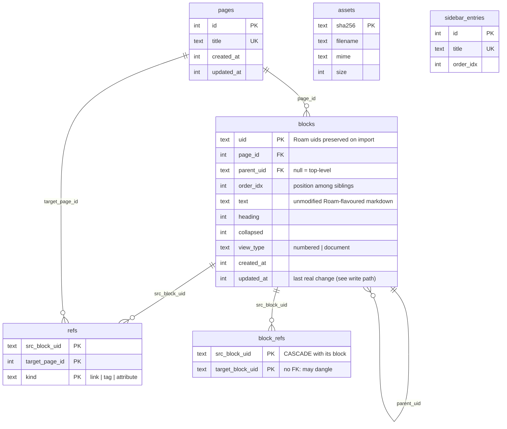
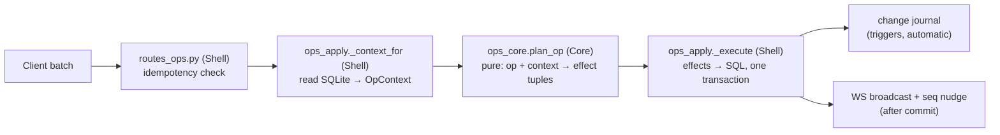

# Backend architecture (server/ + HTTP API)

A Python 3.12+ FastAPI application over a single SQLite file, and the sole
authority for the graph. Block-graph mutations flow through `POST /api/ops`,
other writes use dedicated routes, refs and full-text indexes are re-derived in
the same transaction, and a trigger-based change journal feeds the sync
protocol. No ORM and no migration framework: raw `sqlite3` with replayable DDL.

[overview.md](overview.md) has the system-level picture and the tech stack.
Siblings own the sync protocol ([sync-and-offline.md](sync-and-offline.md)),
the CLI and MCP server ([cli-and-mcp.md](cli-and-mcp.md)), the offline import,
export and backup pipelines
([import-export-and-backup.md](import-export-and-backup.md)), the embedded
assistant ([assistant.md](assistant.md)), and the asset store and `/files`
browser ([files-and-assets.md](files-and-assets.md)).

Failures and their fixes are indexed by symptom in
[troubleshooting.md](../troubleshooting.md).

## Module map

Everything lives under `server/src/pkm/`. Every runtime file declares
`# pattern: Functional Core` (pure logic) or `# pattern: Imperative Shell`
(I/O) near the top — see [overview.md](overview.md#functional-core--imperative-shell)
for the pattern.

```
pkm/
├── schema.py            Core   Single source of DDL: BASE_DDL (replicated to clients)
│                               + SERVER_DDL (journal, idempotency, rewrites) = DDL
├── refs.py              Core   Ref grammar: [[links]], #tags, attr::, ((refs)), {{embeds}}
│                               + title normalization, and the positioned spans (bracket
│                               tree, tags, attribute) the rewriter scans with
├── rename.py            Core   one-pass, opaque-value title-ref rewrite for page rename/merge;
│                               callers pass the normalizer that spells their replacement keys
├── title_migration.py   Core   boundary-space grouping, blockers, survivor plan + digest
├── todo.py              Core   {{TODO}}/{{DONE}} marker parsing (mirrors web/src/grammar/todo.ts)
├── changed.py           Core   /api/changed window parsing (date/ISO bounds, injected
│                               clock+tz) + new/edited classification
├── filenames.py         Core   safe_filename() shared by upload + export
├── planning.py          Core   Plans one write as /api/ops ops: outlines, missing
│                               headings, text updates, task markers
├── batch.py             Core   The `pkm batch` command language: per-command schema
│                               + dispatch onto planning.py
├── render.py            Core   API payloads -> terminal markdown (^uid annotated)
├── assets_core.py       Core   Asset-browser helpers: reference-token stripping,
│                               MIME categorisation (+ its SQL twin), zip arcnames
├── local_docs.py        Core   path containment, disposition and link shapes for /api/local
├── goodlinks.py         Core   href shapes, candidate URLs, search match and the HTML allowlist for /api/goodlinks
├── edn.py               Core   Minimal EDN parser for Roam exports
├── schema_dump.py       Shell  Generates web/src/replica/baseSchema.gen.ts
├── refs_parity_dump.py  Shell  Generates shared/fixtures/refs_parity.json
├── assets_disk.py       Shell  asset_on_disk_needs_repair(): stats/hashes a stored asset
│                               file for assets_core.asset_needs_repair() to judge
│
├── contracts/           Core   The wire contract, depended on by BOTH sides:
│                               ops.py (op models + UID_RE + text_hash),
│                               responses.py (JSON response models),
│                               daily.py (date <-> "July 8th, 2026" titles)
│
├── server/              The FastAPI app (details below)
├── importer/            Roam EDN import pipeline: run.py Shell; preflight.py and
│                        mermaid_preservation.py Core validation/planning
├── export/              Markdown export (markdown.py Core render, writer.py Shell)
├── backup/              Nightly backup job (__main__.py Shell, rotation.py Core)
├── cli/                 `pkm` CLI (main.py Shell: argparse, stdin/stdout, exit codes)
├── client/              Shared HTTP client (api.py Shell PkmClient, core.py Core,
│                        workflows.py Shell: the write workflows CLI+MCP share)
├── mcp/                 `pkm-mcp` FastMCP stdio server over the same client
├── assistant/           Embedded LLM assistant: SSE routes + Claude Agent SDK
│                        harness confined to the pkm MCP tools
├── describe/            Image-description queue + OpenAI vision client
└── test_data/           Synthetic fixture graph generator
```

**Dependency direction.** `cli`/`mcp`/`client` → `contracts` ← `server`, and
`contracts` imports neither side; `pkm.server` owns what acts on the contracts
(`ops_core.plan_op`, `server/daily.py`'s journal-day selection). `planning.py`,
`batch.py` and `render.py` sit at the top level because both shells and
`client/workflows.py` share them. Three tests in
`tests/test_client_contracts.py` parse imports and fail the suite on a
re-crossing.

Inside `pkm/server/`:

| File | Pattern | Role |
|---|---|---|
| `app.py` | Shell | App factory `create_app(config)`: runs `init_db()`, builds the `AssistantService` (engine injectable), mounts routers, serves the SPA |
| `config.py` | Shell | Frozen `Config` loaded from the data dir's `config.json` |
| `db.py` | Shell | `init_db()`/`open_db()`, per-request connection dependency, column migrations |
| `auth.py` / `auth_core.py` / `throttle_core.py` | Shell / Core / Core | Login routes + `require_auth`; scrypt password check, HMAC session tokens; per-source login backoff policy (see [Auth](#auth)) |
| `routes_pages.py`, `routes_ops.py`, `routes_search.py`, `routes_sidebar.py`, `routes_sync.py`, `routes_assets.py`, `routes_local.py`, `routes_goodlinks.py`, `routes_export.py`, `routes_migrations.py` | Shell | The HTTP surface (table below) |
| `goodlinks_gateway.py` | Shell | httpx2 edge to the GoodLinks local API |
| `title_migration.py` / `sync_meta.py` | Shell / Shell | Transaction-owned title inventory/apply; durable activation/generation accessors |
| `ops_core.py` | Core | Pure `plan_op()` → effect tuples, over the op models in `pkm/contracts/ops.py` |
| `ops_apply.py` | Shell | Reads SQLite into an `OpContext`, executes planned effects |
| `store.py` | Shell | Reusable page mutations (create/delete/rename/merge); never commits |
| `query_exec.py` | Shell | Runs a `query.py` plan (`count_matches`, `execute_plan`); owns the filter keeping a `{{query}}` block out of its own results, and the row order, for both plan surfaces (`/api/query`, the resolved page export) |
| `tree.py`, `grouping.py`, `daily.py`, `fts.py`, `query.py`, `sync_core.py`, `mime_sniff.py` | Core | Pure helpers: tree building; `{page_id, page_title, items}` group shaping (`group_by_page`, `group_backlinks`, `group_changed`); journal-day selection + empty-daily test; FTS queries; `{{[[query]]}}` parsing and SQL planning; sync windowing and hydration ordering; MIME sniffing |
| `ws.py` / `notify.py` | Shell | WebSocket hub + broadcast nudges |
| `tempfile_response.py` | Shell | `CleanupFileResponse`: a `FileResponse` whose cleanup callback runs even on a missing file or a send-time error (used by the zip export routes; see [files-and-assets.md](files-and-assets.md)) |
| `request_log.py` / `logfmt.py` | Shell / Core | The `pkm.access` request log — one line per request, with durations (see [Logging](#logging-and-observability)) |
| `run.py` / `setup.py` | Shell | `python -m pkm.server.run` entrypoint; `setup` writes `config.json` |
| `openapi_dump.py` / `shim_parity_dump.py` | Shell | Generated-artifact writers (see [Generated artifacts](#generated-artifacts-and-parity-fixtures)) |

The assistant routes (`pkm/assistant/`) and the image-description status/scan
routes (`pkm/describe/`) are two HTTP surfaces outside this package; `app.py`
constructs their services and mounts their routers alongside these.

## Database

One SQLite file (`pkm.sqlite3`) in the data directory. WAL mode and schema are
applied once at startup by `init_db()` (`server/db.py`), never per request.
Request handlers get a fresh connection each (`check_same_thread=False`, `Row`
factory, `foreign_keys=ON`, `recursive_triggers=ON`, `busy_timeout=5000`).

`pkm/schema.py` holds two DDL blocks. `BASE_DDL` is the data model below, and
is **replicated verbatim to browser clients** via the generated
`baseSchema.gen.ts`. `SERVER_DDL` adds server-only sync machinery and never
leaves the server.


```mermaid
erDiagram
    pages ||--o{ blocks : "page_id"
    blocks ||--o{ blocks : "parent_uid"
    blocks ||--o{ refs : "src_block_uid"
    pages ||--o{ refs : "target_page_id"
    blocks ||--o{ block_refs : "src_block_uid"

    pages {
        int id PK
        text title UK
        int created_at
        int updated_at
    }
    blocks {
        text uid PK "Roam uids preserved on import"
        int page_id FK
        text parent_uid FK "null = top-level"
        int order_idx "position among siblings"
        text text "unmodified Roam-flavoured markdown"
        int heading
        int collapsed
        text view_type "numbered | document"
        int created_at
        int updated_at "last real change (see write path)"
    }
    refs {
        text src_block_uid PK
        int target_page_id PK
        text kind PK "link | tag | attribute"
    }
    block_refs {
        text src_block_uid PK "CASCADE with its block"
        text target_block_uid PK "no FK: may dangle"
    }
    assets {
        text sha256 PK
        text filename
        text mime
        int size
    }
    sidebar_entries {
        int id PK
        text title UK
        int order_idx
    }
```

Around that base model:

- **Derived indexes.** `blocks_fts` and `pages_fts` are external-content FTS5
  tables kept in sync by `AFTER INSERT/UPDATE/DELETE` triggers; `blocks_fts`
  is keyed by implicit rowid, so `VACUUM` would break it. `block_refs` holds
  one row per distinct `((uid))` target a block mentions, backing the count
  badge and `GET /api/block/{uid}/backlinks`. Block text is the only durable
  data — `refs`, `block_refs` and FTS are always rebuilt from it.
- **Server-only tables** (`SERVER_DDL`):
  - `changes(seq AUTOINCREMENT, kind, entity_id, deleted)` — the append-only
    change journal, populated by row-level triggers rather than route code, so
    any new write path is journalled automatically. Cascade deletes journal
    only because `recursive_triggers=ON`.
  - `applied_batches(batch_id, request_hash, response)` — op idempotency.
  - `block_rewrites(uid, base_hash, after_hash, old_title, new_title,
    created_at)` — what a rename, merge or the title migration did to one
    block's text, replayed over a stale `update_text`. Pruned to 30 days on
    every rewrite.
  - `sync_meta` — the random `db_generation` token (a rebuilt database gets a
    new one and clients rebootstrap) and `plain_space_title_canonicalization`,
    the title-activation flag.
- **Schema migrations.** No framework. Additive tables and indexes are
  replayable `IF NOT EXISTS` statements in `schema.py`. Additive columns are
  guarded `PRAGMA` checks in `db._ensure_schema_migrations`, currently
  `blocks.view_type` and the three `assets` description columns. One
  `WHERE created_at IS NULL` backfill runs beside them, giving blocks the Roam
  import left unstamped `MIN(page.created_at, block.updated_at)`. Client
  replicas rebootstrap on a schema-hash change. Startup never runs the title
  migration; that is the operator path below.

## The write path

`POST /api/ops` is the transactional block-operation write path. Clients send
an `OpBatch` (`client_id`, optional `batch_id`, 1–500 ops) of block-level
operations:

| Op | Does |
|---|---|
| `create` | insert a block, optionally creating its page via `page_title` |
| `update_text` | replace a block's text; optional `base_text_hash` rides the conflict path |
| `move` | reposition or reparent; cross-page moves re-page the whole subtree |
| `delete` | remove a block and its subtree |
| `set_heading` | set the block's heading level |
| `set_view_type` | set `numbered` / `document` rendering for the block's children |
| `set_collapsed` | fold or unfold — view state only (see Timestamps below) |
| `create_page` | idempotently ensure a page exists |


```mermaid
flowchart LR
    C[Client batch] --> R["routes_ops.py (Shell)<br/>idempotency check"]
    R --> CTX["ops_apply._context_for (Shell)<br/>read SQLite → OpContext"]
    CTX --> P["ops_core.plan_op (Core)<br/>pure: op + context → effect tuples"]
    P --> X["ops_apply._execute (Shell)<br/>effects → SQL, one transaction"]
    X --> J["change journal<br/>(triggers, automatic)"]
    X --> B["WS broadcast + seq nudge<br/>(after commit)"]
```

Key mechanics:

- **Ordering.** Siblings hold integer `order_idx`. An insert or move emits a
  `ShiftSiblings` effect — bump every sibling ≥ the target index — before
  placing the block. Cross-page moves re-page the whole subtree and touch both
  pages, and a parent-chain check prevents cycles.
- **Refs re-derivation.** Every text change emits `ReindexRefs`, and
  `store.reindex_refs_for_text` is its only implementation, rebuilding `refs`
  and — via `store.reindex_block_refs` — `block_refs` from one parse. The
  rename/merge and title-migration rewrite (`store.rewrite_snapshotted_blocks`)
  calls it on the rewritten text, so neither site can drift from the extractor
  or the schema. It never commits, and `now_ms` stamps only the pages a
  `[[link]]` creates. Two writers skip it: the asset-token strip
  (`routes_assets.py`), safe because asset tokens and `((uid))` are disjoint
  syntaxes, and the one-off mermaid migration script.
- **Timestamps.** Blocks and pages carry `created_at`/`updated_at` in epoch
  milliseconds, seeded on import by `parse_export.py` from each Roam block's
  `:create/time` and `:edit/time`. `blocks.updated_at` answers "when was this
  block last really changed", so `set_collapsed` stamps neither the block nor
  its page, while `update_text`, `move`, `set_heading` and `set_view_type` bump
  both. The trigger-driven change journal is independent of this, so a collapse
  still reaches other clients.
- **Conflicts: per-block last-write-wins, with preservation.** `update_text`
  carries an optional `base_text_hash`, the sha256 of the text the edit was
  based on; a text hash rather than a version counter, so structural changes
  don't manufacture conflicts. On mismatch the incoming edit wins and the
  losing text is preserved as a `[[conflict]]` sibling block, whose uid the
  server mints (`ops_apply.py`) with an alphanumeric first character so the CLI
  can address it without `--` (see
  [cli-and-mcp.md](cli-and-mcp.md#writes-uids-and-missing-pages)). An edit to a
  since-deleted block is appended to today's daily page instead of vanishing.
  `ops_core.replay_title_rewrites` first replays any `block_rewrites` row
  `store.rewrite_snapshotted_blocks` left for that block, so a device that
  never saw a rename cannot win with the old title and re-create the page it
  emptied.
- **Idempotency.** A retried batch — same `batch_id`, identical canonical
  request hash — replays the stored ack with no effects. The same id with a
  different payload is a 409. Offline queue replay depends on it.
- **Broadcast.** After commit, the WebSocket hub pushes the applied ops and a
  `{type:"seq", seq}` nudge to other clients (see
  [sync-and-offline.md](sync-and-offline.md)).

Page-level mutations (create, delete, rename, merge) live in `store.py` as
composable functions that never commit; routes own the transaction.
`POST /api/page/{title}/rename` rewrites all referencing block text via
`rename.py`, and merges by concatenating blocks when `allow_merge` is set.

`rename.py` keeps no copy of the grammar: it locates refs through
`refs.strip_code()`, `refs.bracket_spans()`, `refs.tag_spans()` and
`refs.attribute_title_span()`, so neither module can find a ref the other
missed: an indented `Title::` is a ref to both. What is left in it is which
span wins when refs nest — a replaced title takes its whole `[[..]]` run — and
how to spell the replacement. Its `normalize` argument maps a spelling in the
text onto a replacement key: rename and the title migration take the default
and match the stored title byte for byte, the importer passes
`refs.normalize_title`. The web scanner shares that anchoring convention,
pinned by `web/src/grammar/scan.test.ts` as `"  Key:: v"` starting at offset 2.

Sidebar pinning is a separate write path. `POST /api/sidebar` takes SQLite's
writer reservation with `BEGIN IMMEDIATE` before it checks title uniqueness and
computes the append slot as `max(order_idx) + 1`. A same-title race therefore
becomes HTTP 409, and two concurrent appends cannot land on the same
`order_idx`.

## Title integrity and one-time activation

Title canonicalization (`refs.canonicalize_title`) has two layers, and the
durable `plain_space_title_canonicalization` flag selects the second:

| Flag | `canonicalize_title` does |
|---|---|
| inactive (default) | a control character makes ASCII-whitespace runs collapse to one space and trims their boundary; plain-space padding stays byte-exact, so legacy rows still resolve |
| active | the above, plus stripping leading and trailing U+0020; internal ordinary spaces and NBSP are unchanged |

The flag defaults to `"0"` for every database, and startup never audits or
applies the existing-data migration. Activation is an operator action:
`pkm migrate-titles` to audit, then `pkm migrate-titles --apply DIGEST`
([docs/cli.md](../cli.md#one-time-title-canonicalization)).

`pkm/title_migration.py` is the pure planner. It groups padded titles under a
canonical spelling, picks a survivor and reports `all_space` or
`forbidden_syntax` blockers. Replacement values are opaque —
`rename.rewrite_title_refs_map()` never rescans a mapped value as another
source — and the plan's SHA-256 digest covers the full relevant snapshot, so an
unchanged audit yields a stable digest.
`server/title_migration.py::audit_title_migration()` owns a read transaction it
always rolls back, so the authenticated GET route has no side effects.

Apply requires that 64-lowercase-hex `audit_digest`, takes `BEGIN IMMEDIATE`,
re-inventories under the writer reservation, and refuses a stale digest, either
blocker reason, or an already-active database with HTTP 409. Every change,
through to activation and the `db_generation` rotation, lands in one
transaction, after which the route emits one forced seq frame carrying the real
journal maximum and the new generation. Connected replicas see the generation
mismatch and rebootstrap before replaying pending intent
([sync-and-offline.md](sync-and-offline.md#title-activation-across-online-and-offline-paths)).

Every creation path funnels through `store.get_or_create_page()`, which
consults the flag. After control normalization, page creation and rename reject
any title containing `#`, `[[` or `]]`, and `POST /api/ops` preflights explicit
`page_title` fields and ref-derived titles across the whole batch, so a
violation refuses before any mutation. `PkmClient.get_page`, `get_backlinks`
and `get_page_blocks` normalize control whitespace before building the URL, so
CLI and MCP callers can read a title using the spelling they wrote. Daily pages
use Roam's ordinal format (`July 8th, 2026`, in `daily.py`), are auto-created
on read, and cannot be renamed.

`ops_apply._broadcast_op()` replaces the caller's `page_title` with the stored
one after each `create`, `create_page` or resolved-target `move`, so replicas
receive authoritative title identity
([sync-and-offline.md](sync-and-offline.md#title-activation-across-online-and-offline-paths)).
A missing page row raises there, rolling the owning op transaction back.

### Blank titles

A blank title is permanently unreachable — no `[[link]]` resolves to it and no
route can name it — so `get_or_create_page()` raises `BlankTitleError` instead
of committing one, and each caller picks its recovery:

| Caller | Recovery | Why |
|---|---|---|
| `POST /api/pages` | 422 | a live client can retry with a real title |
| `ops_apply.py`'s `_resolve_page()` (`create`, `create_page`, cross-page `move`) | substitute the fallback title `"Untitled"` | the ops path must never 422 |

`"Untitled"` is an ordinary addressable title, not a reserved sentinel, so
blank-title ops deposit onto a user's real "Untitled" page if one exists — an
accepted trade-off.

A ref whose title normalizes to blank is not a reference and must index
nothing, or `[[   ]]` would fabricate a phantom backlink on "Untitled".
`refs.is_blank_title()` — normalize, then strip — is the one blankness
predicate, called by `refs.extract()`'s bracket branch, and
`web/src/grammar/refs.ts::extractRefs` filters on `r.title.trim() === ""`; the
shared fixture case `skip [[   ]] but keep [[ Valid ]]` pins the pair.
`store.index_ref()` also catches `BlankTitleError` and skips the ref.

## Auth

One shared password behind Tailscale, which is the transport boundary.
`auth_core.py` does the constant-time scrypt check and signs the `pkm_session`
cookie that `POST /api/login` sets (`v1.<issued_ms>.<sig>`);
`docs/SECURITY.md` owns the cookie flags, the threat model and the accepted
limitations.

`LoginThrottle` (`auth.py`, one instance per app on `app.state`) bounds the
cost of unauthenticated attempts two ways: a per-source exponential backoff
(1s doubling to a 30s cap, cleared by success) that rejects before scrypt runs,
and a process-wide semaphore capping concurrent scrypt computations.
`scrypt_slot()`'s acquire is bounded by `SCRYPT_ACQUIRE_TIMEOUT_S` (2s),
because `login()` is a sync route on the shared worker-thread pool that an
unbounded wait would starve. A throttled attempt gets the same 401 as a wrong
password, even with the correct one. Under `tailscale serve` every client
arrives from the proxy address (`request.client.host`), so the per-source
backoff is effectively global.

The public surface is `GET /login`, `POST /api/login`, `GET /healthz` and the
static SPA shell. Every feature router is declared with
`dependencies=[Depends(require_auth)]`, and `/api/ws` runs the same cookie
check. On failure it closes with code 4401 before accepting, which uvicorn
sends as an HTTP 403 handshake refusal; only Starlette's test client sees the
4401. The server binds loopback plus the
Tailscale IP only (default port 8974).

## HTTP API reference

Authoritative sources: the `routes_*.py` modules and the generated
`web/src/api/openapi.json` (see
[Generated artifacts](#generated-artifacts-and-parity-fixtures)). Response
models are Pydantic classes in `pkm/contracts/responses.py`; the generated TS
types derive from them and `PkmClient` validates every response against them,
so a drifting payload fails in the CLI and MCP client too. Every endpoint
requires the session cookie unless marked public, and FastAPI's `/docs` and
`/redoc` are disabled.

| Method | Path | Purpose |
|---|---|---|
| POST | `/api/login` *(public)* | Password → signed session cookie |
| GET | `/login` *(public)* | Inline HTML login form |
| GET | `/healthz` *(public)* | Liveness check |
| GET | `/{path}` *(public)* | SPA fallback: serves `web_dist` (index.html no-cache, hashed bundles under `/app-assets/`) |
| GET | `/api/openapi.json` | Live OpenAPI schema |
| **Writes** | | |
| POST | `/api/ops` | Apply an `OpBatch` transactionally |
| **Pages & blocks** | | |
| GET | `/api/page/{title}?bl_offset&bl_limit` | Page tree + paginated backlinks + `block_ref_counts` (daily pages auto-created). Backlinks and unlinked mentions both skip blocks on the page itself |
| GET | `/api/block/{uid}` | One block subtree with page context + breadcrumbs |
| GET | `/api/block/{uid}/backlinks` | Blocks referencing `((uid))`, grouped like page backlinks (unpaginated) |
| GET | `/api/block-refs?uids=` | Resolve `((uid))` references on demand |
| POST | `/api/pages` | Idempotent page create |
| DELETE | `/api/page/{title}` | Delete page + blocks (+ sidebar entry); inbound links remain as text |
| POST | `/api/page/{title}/rename` | Rename and rewrite refs; 409 on collision unless `allow_merge`. Returns `RenamePageResponse` (`result: "renamed" \| "merged"`, `title`) |
| GET | `/api/unlinked?title` | Unlinked mentions of a title |
| GET | `/api/journal?before&days` | Daily-notes feed (infinite scroll); each day carries its blocks and a linked-references preview, and one `block_ref_counts` map covers all days |
| POST | `/api/journal/cleanup` | Prune empty daily pages (spares today + referenced blocks) |
| GET | `/api/current-work` | Recently edited pages, bucketed by age |
| **Migrations** | | |
| GET | `/api/migrations/title-canonicalization` | Side-effect-free `TitleMigrationAuditPayload`: `active`, digest, grouped survivor/source plans and counts, and blockers whose `reason` is `all_space` or `forbidden_syntax` |
| POST | `/api/migrations/title-canonicalization` | `TitleMigrationApplyRequest.audit_digest` (required 64 lowercase hex) → `TitleMigrationApplyResponse` with digest, applied/retitled/merged/moved/rewritten counts, and new `generation`; 409 on stale, blocked, or already-active databases |
| **Search & queries** | | |
| GET | `/api/search?q` | FTS5 search over pages + blocks |
| GET | `/api/query?expr` | `{{[[query]]}}` evaluation (`and`/`or`/`not` over refs) |
| GET | `/api/titles?q` | Title completion for `[[` / `#` autocomplete |
| GET | `/api/todos?page` | `{{TODO}}` blocks grouped by page |
| GET | `/api/changed?since&until&page&limit` | Blocks whose `updated_at` falls in `[since, until)`, grouped by page in first-touched order; `since`/`until` are each a date or ISO datetime, `until` exclusive and defaulting to now; each item carries `created_at`/`updated_at`/`status` (`new` if `created_at` is in the window, else `edited`); 400 on an unparseable or empty window |
| **Sidebar** | | |
| GET / POST / PUT / DELETE | `/api/sidebar`… | Pinned pages: list / pin / reorder (permutation-validated) / unpin |
| **Sync** (see [sync-and-offline.md](sync-and-offline.md)) | | |
| GET | `/api/sync/snapshot` | Full graph bootstrap + `seq` + `generation` + title-canonicalization activation |
| GET | `/api/sync/changes?since&limit` | Windowed incremental feed with the same generation/activation metadata |
| POST | `/api/client/diagnostics` | A replica's self-report before it rebuilds a corrupt database; logged as one `pkm.sync` WARNING line, nothing written |
| WS | `/api/ws` | Push nudges: applied-op broadcasts + real `seq` hints; title generation rotation adds `force:true,generation` without fabricating a cursor |
| **Assistant** (SSE — see [assistant.md](assistant.md)) | | |
| GET | `/api/assistant/models` | Models the picker may offer + the default; `glm` appears only when a z.ai key is configured |
| POST | `/api/assistant/conversations` | Create a conversation (`model`: `sonnet` / `opus` / `haiku` / `glm`, defaulting to `glm` when offered, else `sonnet`); 400 for a model not offered, 409 over the 3-conversation cap |
| POST | `/api/assistant/conversations/{id}` | Beacon cleanup close (`navigator.sendBeacon`): delete the conversation, shut down its harness, and return `AssistantAck` |
| POST | `/api/assistant/conversations/{id}/messages` | Send one user turn → SSE stream of `text_delta` / `tool_started` / `tool_finished` / `phase` / `confirm_request` / `turn_done` / `error` events; 409 while a turn is in flight |
| POST | `/api/assistant/conversations/{id}/confirm` | Answer a pending write confirmation (`tool_use_id`, `allow`) |
| DELETE | `/api/assistant/conversations/{id}` | Close the conversation and shut down its harness |
| **Assets** (see [files-and-assets.md](files-and-assets.md)) | | |
| POST | `/api/assets` | Multipart upload → content-addressed storage |
| GET | `/assets/{sha256}/{filename}` | Serve by digest (immutable cache) |
| GET | `/api/assets/describe-status` | Whether image descriptions are enabled, and why not if disabled |
| POST | `/api/assets/scan?force` | Enqueue undescribed (or, with `force`, previously-failed) eligible images |
| GET | `/api/assets/search?q&limit&offset&type&from_ms&to_ms&linked` | `LIKE` search over asset description + filename, filtered and paginated, with a `total` (backs the `/files` browser) |
| DELETE | `/api/assets/{sha256}` | Delete an asset, stripping its reference tokens from block text |
| POST | `/api/assets/export.zip` | Zip the selected assets (form-encoded `sha256s`, download) |
| **Local documents** (`routes_local.py`) | | |
| GET | `/api/local/check` | Every `/api/local/` href in block text, classified `ok` / `missing` / `evicted` / `invalid` against disk; `enabled: false` when `local_docs_root` is unset |
| GET | `/api/local/{path}` | Serve one regular file under `local_docs_root` (inline for PDF/image extensions, attachment otherwise, `nosniff`); 404 for anything outside the root, missing, or not a regular file; 503 + `Retry-After` for an iCloud-evicted file |
| **GoodLinks copies** (`routes_goodlinks.py`, see [goodlinks.md](goodlinks.md)) | | |
| POST | `/api/goodlinks/resolve` | Resolve a URL to a GoodLinks link (exact, query-stripped, trailing-slash-toggled, single search hit); with `save` true, save it read-marked when absent |
| GET | `/api/goodlinks/check` | Every `/api/goodlinks/` href in block text, `ok` / `missing` / `invalid` against the library; `enabled: false` without an API token |
| GET | `/api/goodlinks/{link_id}` | Metadata plus allowlist-sanitised reader HTML, `no-store`; empty `html` when GoodLinks knows the link but holds no reader copy; 404 for a bad id or unknown link, 503 when GoodLinks is not running or refuses the token |
| **Export** (see [import-export-and-backup.md](import-export-and-backup.md)) | | |
| GET | `/api/export/page/{title}` | One page rendered to markdown (download) |
| GET | `/api/export.zip` | Whole-graph markdown export, zipped (download) |

### Local documents

`/api/local/{path}` is the only route that reads outside the data directory.
`local_docs.clean_relative` rejects an absolute path, a `.` or `..` segment, a
NUL or a backslash, and `is_within` re-checks the *resolved* candidate against
the resolved root. Every rejection is a 404, never a 403, so the response never
confirms what exists. `/api/local/check` starts from a raw href in block text
rather than an already-decoded path parameter, so it goes through
`resolve_relative`, which unquotes exactly once.

`_is_evicted` in `routes_local.py` is the single source of truth for iCloud
eviction, which shows up on disk as an `.icloud` stub beside a missing file.
The file route answers 503 with `Retry-After` after a best-effort
`brctl download`; `/api/local/check` reports `evicted` rather than `missing`.
`/api/local/check` is registered ahead of the `/api/local/{path}` catch-all, so
the literal `check` segment resolves to the audit route.

### Breadcrumbs and recursive traversal

`routes_pages.py::_fetch_ancestors` builds the breadcrumb trail behind
`GET /api/block/{uid}` and, via `grouping.py`, every backlink group. It walks
parents with a recursive CTE that terminates on a visited path: the CTE carries
`path` as `,uid,uid,…,`, and the recursive arm keeps a row only while
`instr(a.path, ',' || b.uid || ',') = 0`. The trail is never truncated, and a
parent cycle — which the write path forbids but a hand-edited database can
still hold — stops at the repeat. Commas make the `instr` test exact: `UID_RE`
is `^[a-zA-Z0-9_-]{6,32}$`, so no uid can contain one.

Both replica mirrors of this traversal use the identical guard — see
[sync-and-offline.md](sync-and-offline.md). Change all three together, so an
offline read and a server read return the same trail.

## Generated artifacts and parity fixtures

Several artifacts are generated from the server and checked in, and **the
server test suite fails if any is stale**. Regenerate and commit them together
with the change that invalidates them.

| Artifact | Generator | Guarded by | Consumed by |
|---|---|---|---|
| `web/src/api/openapi.json` (→ `types.d.ts` via `pnpm gen-types`) | `pkm.server.openapi_dump` | `tests/test_openapi_sync.py` | Web API layer — Pydantic models are the single source of API types |
| `web/src/replica/baseSchema.gen.ts` | `pkm.schema_dump` | `tests/test_schema_artifact.py` | Browser sqlite-wasm replica (BASE_DDL only, never SERVER_DDL) |
| `shared/fixtures/ref_grammar.json` | hand-maintained cases | both parsers' test suites | Pins Python `refs.py` and the TS grammar scanner to identical behaviour |
| `shared/fixtures/title_syntax.json` | hand-maintained cases | `tests/test_refs.py` | Pins `refs.title_syntax_reason` and the replica's `titleSyntaxReason` to the same verdicts (`web/src/replica/titles.test.ts`, `localApi/router.test.ts`) |
| `shared/fixtures/refs_parity.json` | `pkm.refs_parity_dump` | `tests/test_refs_parity_fixture.py` | TS extractors replay the exact Python outputs |
| `shared/fixtures/shim_parity.json` | `pkm.server.shim_parity_dump` | `tests/test_shim_parity_fixture.py` | The offline API shim (`web/src/replica/localApi/`) must return byte-identical JSON to the real routes |

## Configuration and entrypoints

`config.json` lives in the data directory. It is never in git, and
`python -m pkm.server.setup` writes it mode 0600.

| Key | Required | Meaning |
|---|---|---|
| `db_file` | yes | SQLite database path |
| `assets_dir` | yes | Content-addressed asset store |
| `password_salt`, `password_hash` | yes | scrypt password check (hex) |
| `session_secret` | yes | HMAC key for session cookies (hex) |
| `cookie_secure` | no (default true) | `Secure` flag on the session cookie |
| `web_dist` | no | Built SPA directory; unset means an API-only server |
| `bind_hosts` | no (default `["127.0.0.1"]`) | Interfaces to listen on |
| `max_upload_bytes` | no (default 150 MB) | Upload size cap |
| `image_descriptions` | no (default true) | Master switch for image captions |
| `image_description_model` | no (default `gpt-4o-mini`) | Vision model |
| `openai_api_key_file` | no (default `../openai_key`) | Key file for image captions |
| `local_docs_root` | no | Read-only document tree served under `/api/local/`; unset disables the feature |
| `goodlinks_api_key_file` | no (default `../goodlinks_key`) | GoodLinks API token; `GOODLINKS_API_KEY` env is the fallback; with neither set, the feature is disabled: every route 404s except `check`, which reports `enabled: false` |
| `goodlinks_api_url` | no (default `http://localhost:9428/api/v1`) | Where the GoodLinks app listens |

Every path key resolves relative to `config.json`'s own directory, so the data
directory can move as a unit. `python -m pkm.server.run` is the entrypoint,
serving port 8974 on `bind_hosts`. `create_app()` always runs `init_db()`, so
every entrypoint — server, tests, artifact dumps — works against a brand-new
data directory.

## Logging and observability

There is no metrics stack. The logs answer one question: what was the server
doing when it was slow? `logfmt.uvicorn_log_config()` is uvicorn's default
dictconfig plus timestamps on every formatter, and it wires the three streams
below, so launchd's two log files keep their usual roles.

| Logger | Stream | Line |
|---|---|---|
| `pkm.access` | stdout | One pre-formatted `logfmt.request_line` per request, emitted by `RequestLogMiddleware` (`server/request_log.py`) after the response body finishes, so the duration covers body send |
| `pkm`, and every `pkm.*` child | stderr, INFO | Children — `pkm.assets`, `pkm.assistant`, `pkm.describe`, any future addition — inherit the parent's handler, level and format by propagation, with no entry of their own |
| uvicorn lifecycle and errors | stderr | uvicorn's own output; its access log is disabled in `run.py` |

      <client> "GET /api/page/Foo?bl_limit=20" 200 4ms

`RequestLogMiddleware` captures status off the `http.response.start` message
and defaults to 500, so a request that dies before responding still logs what
the client saw. Nothing configures the root logger, so a `pkm.*` logger with no
configured ancestor emits nothing;
`test_every_declared_pkm_logger_has_an_effective_info_handler` in
`test_request_log.py` enumerates every declared `pkm.*` logger and asserts it
resolves to a real handler.

When measuring a slow request, prefer these durations to client-side timing.

## Testing

- `cd server && uv run pytest -q` — roughly one test file per module, with
  branch coverage enforced at 95% (`--cov-fail-under=95` in `pyproject.toml`).
- `conftest.py` provides a seeded temp database (a fixed 5-page fixture, with
  daily page "July 7th, 2026"), an authenticated `TestClient`, and a
  `PkmClient` wired to the in-process app.
- `uv run pyrefly check` type-checks (pyright is configured as a second
  opinion) and `uv run ruff check` lints, at line length 120.
