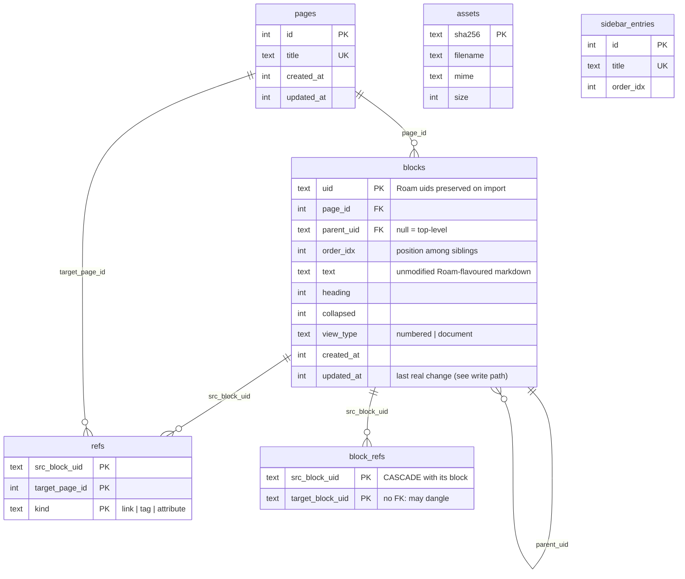
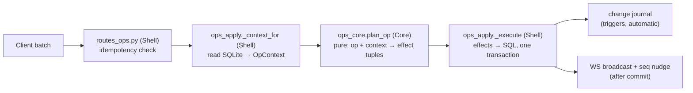
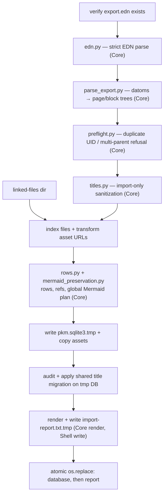

# Backend architecture (server/ + HTTP API)

The backend is a Python 3.12+ FastAPI application over a single SQLite file.
It is the sole authority for the graph. Block-graph mutations flow through
`POST /api/ops`, other writes use dedicated routes, refs and full-text indexes
are re-derived inside the same transaction, and a trigger-based change journal
feeds the sync protocol. There is no ORM and no migration framework: raw
`sqlite3` with replayable DDL.

Start with [overview.md](overview.md) for the system-level picture and the
tech stack. Siblings own the rest: the sync protocol
([sync-and-offline.md](sync-and-offline.md)), the CLI and MCP server
([cli-and-mcp.md](cli-and-mcp.md)), and the embedded assistant, asset store
and `/files` browser ([assistant-and-files.md](assistant-and-files.md)).

## Module map

Everything lives under `server/src/pkm/`. Every runtime file declares
`# pattern: Functional Core` (pure logic) or `# pattern: Imperative Shell`
(I/O) near the top — see [overview.md](overview.md#functional-core--imperative-shell)
for the pattern.

```
pkm/
├── schema.py            Core   Single source of DDL: BASE_DDL (replicated to clients)
│                               + SERVER_DDL (journal, idempotency) = DDL
├── refs.py              Core   Ref grammar: [[links]], #tags, attr::, ((refs)), {{embeds}}
├── rename.py            Core   one-pass, opaque-value title-ref rewrite for page rename/merge
├── title_migration.py   Core   boundary-space grouping, blockers, survivor plan + digest
├── todo.py              Core   {{TODO}}/{{DONE}} marker parsing (mirrors web/src/grammar/todo.ts)
├── filenames.py         Core   safe_filename() shared by upload + export
├── assets_core.py       Core   Asset-browser helpers: reference-token stripping,
│                               MIME categorisation (+ its SQL twin), zip arcnames
├── edn.py               Core   Minimal EDN parser for Roam exports
├── schema_dump.py       Shell  Generates web/src/replica/baseSchema.gen.ts
├── refs_parity_dump.py  Shell  Generates shared/fixtures/refs_parity.json
│
├── contracts/           Core   The wire contract, depended on by BOTH sides:
│                               ops.py (op models + UID_RE + text_hash),
│                               responses.py (JSON response models),
│                               daily.py (date <-> "July 8th, 2026" titles)
│
├── server/              The FastAPI app (details below)
├── importer/            Roam EDN import pipeline: run.py Shell; preflight.py and
│                        mermaid_preservation.py Core validation/planning
├── export/              Markdown export (markdown.py Core render, writer.py Shell)
├── backup/              Nightly backup job (__main__.py Shell, rotation.py Core)
├── cli/                 `pkm` CLI (main.py Shell; build.py/render.py Core planners)
├── client/              Shared HTTP client (api.py Shell PkmClient, core.py Core,
│                        workflows.py Shell: the write workflows CLI+MCP share)
├── mcp/                 `pkm-mcp` FastMCP stdio server over the same client
├── assistant/           Embedded LLM assistant: SSE routes + Claude Agent SDK
│                        harness confined to the pkm MCP tools
├── describe/            Image-description queue + OpenAI vision client
└── test_data/           Synthetic fixture graph generator
```

**Dependency direction.** `cli`/`mcp`/`client` → `contracts` ← `server`, and
`contracts` imports neither side. The op models, the uid regex and the
daily-title spelling are transport contracts, not server internals, so they
live in `pkm/contracts/`; `pkm.server` still owns everything that acts on
them (`ops_core.plan_op`, `server/daily.py`'s journal-day selection). Two
tests in `tests/test_client_contracts.py` enforce the direction by parsing
imports, so a re-crossing fails the suite rather than review.

Inside `pkm/server/`:

| File | Pattern | Role |
|---|---|---|
| `app.py` | Shell | App factory `create_app(config)`; runs `init_db()`, builds the `AssistantService` (engine injectable), mounts routers, serves the SPA |
| `config.py` | Shell | Frozen `Config` loaded from the data dir's `config.json` |
| `db.py` | Shell | `init_db()`/`open_db()`, per-request connection dependency, column migrations |
| `auth.py` / `auth_core.py` / `throttle_core.py` | Shell / Core / Core | Login routes + `require_auth`; scrypt password check, HMAC session tokens; per-source login backoff policy (see [Auth](#auth)) |
| `routes_pages.py`, `routes_ops.py`, `routes_search.py`, `routes_sidebar.py`, `routes_sync.py`, `routes_assets.py`, `routes_export.py`, `routes_migrations.py` | Shell | The HTTP surface (table below), including the authenticated title-canonicalization audit/apply operator route |
| `title_migration.py` / `sync_meta.py` | Shell / Shell | Transaction-owned title inventory/apply and durable activation/generation accessors |
| `ops_core.py` | Core | Pure `plan_op()` → effect tuples, over the op models in `pkm/contracts/ops.py` |
| `ops_apply.py` | Shell | Reads SQLite into an `OpContext`, executes planned effects |
| `store.py` | Shell | Reusable page mutations (create/delete/rename/merge); never commits |
| `tree.py`, `backlinks.py`, `daily.py`, `fts.py`, `query.py`, `sync_core.py`, `mime_sniff.py` | Core | Pure helpers: tree building, backlink shaping, journal-day selection + empty-daily test, FTS queries, `{{[[query]]}}` evaluation, sync windowing and hydration ordering, MIME sniffing |
| `ws.py` / `notify.py` | Shell | WebSocket hub + broadcast nudges |
| `tempfile_response.py` | Shell | `CleanupFileResponse`: a `FileResponse` whose cleanup callback runs even on a missing/unreadable file or a send-time error, not only after a completed transfer (used by the zip export routes; see [assistant-and-files.md](assistant-and-files.md#assets-and-the-file-browser)) |
| `request_log.py` / `logfmt.py` | Shell / Core | The `pkm.access` request log — one line per request, with durations (see [Logging](#logging-and-observability)) |
| `run.py` / `setup.py` | Shell | `python -m pkm.server.run` entrypoint; `setup` writes `config.json` |
| `openapi_dump.py` / `shim_parity_dump.py` | Shell | Generated-artifact writers (see [Generated artifacts](#generated-artifacts-and-parity-fixtures)) |

Two HTTP surfaces live outside this package: the assistant routes
(`pkm/assistant/`) and the image-description status/scan routes
(`pkm/describe/`). `app.py` constructs their services and mounts their routers
alongside the ones above; both subsystems are described in
[assistant-and-files.md](assistant-and-files.md).

## Database

One SQLite file (`pkm.sqlite3`) in the data directory. WAL mode and schema
are applied **once at startup** by `init_db()` (`server/db.py`), not
per-request: per-connection WAL/DDL setup racing an in-flight transaction is
a far larger, un-retriable source of lock errors than genuine writer
contention. Request handlers get a fresh connection each (`check_same_thread=False`, `Row` factory, `foreign_keys=ON`,
`recursive_triggers=ON`, `busy_timeout=5000`).

Schema lives in `pkm/schema.py` as two DDL blocks. `BASE_DDL` is the data
model, and is **replicated verbatim to browser clients** via the generated
`baseSchema.gen.ts`. `SERVER_DDL` adds server-only sync machinery and never
leaves the server.


```mermaid
erDiagram
    pages ||--o{ blocks : "page_id"
    blocks ||--o{ blocks : "parent_uid"
    blocks ||--o{ refs : "src_block_uid"
    pages ||--o{ refs : "target_page_id"
    blocks ||--o{ block_refs : "src_block_uid"

    pages {
        int id PK
        text title UK
        int created_at
        int updated_at
    }
    blocks {
        text uid PK "Roam uids preserved on import"
        int page_id FK
        text parent_uid FK "null = top-level"
        int order_idx "position among siblings"
        text text "unmodified Roam-flavoured markdown"
        int heading
        int collapsed
        text view_type "numbered | document"
        int created_at
        int updated_at "last real change (see write path)"
    }
    refs {
        text src_block_uid PK
        int target_page_id PK
        text kind PK "link | tag | attribute"
    }
    block_refs {
        text src_block_uid PK "CASCADE with its block"
        text target_block_uid PK "no FK: may dangle"
    }
    assets {
        text sha256 PK
        text filename
        text mime
        int size
    }
    sidebar_entries {
        int id PK
        text title UK
        int order_idx
    }
```

Around that base model:

- **Derived indexes.** `blocks_fts` and `pages_fts` are external-content FTS5
  tables kept in sync by `AFTER INSERT/UPDATE/DELETE` triggers; `blocks_fts`
  is keyed by implicit rowid, so `VACUUM` would break it. Block text is the
  only durable data — `refs`, `block_refs` and FTS are always rebuilt from
  it. `block_refs` is the block-level analogue of `refs`: one row per
  distinct `((uid))` target a block mentions, backing the count badge and
  `GET /api/block/{uid}/backlinks`. Its target has no FK because an
  unresolved `((uid))` is legal; a dangling row never matches a count.
  A one-time `sync_meta`-guarded backfill in `db.py::init_db` indexed
  pre-existing text (pkm-d31f); the write path owns all rows since.
- **Server-only tables** (`SERVER_DDL`):
  - `changes(seq AUTOINCREMENT, kind, entity_id, deleted)` — the append-only
    change journal. Populated by **row-level triggers** on
    blocks/pages/sidebar, not by route code, so any new write path is
    journalled automatically. Cascade deletes journal correctly only because
    `recursive_triggers=ON`.
  - `applied_batches(batch_id, request_hash, response)` — op idempotency.
  - `sync_meta` — durable server sync and title metadata. Today it holds the
    random `db_generation` token (a rebuilt database gets a new one and
    clients rebootstrap) plus `plain_space_title_canonicalization`, the
    rollout flag for stripping leading and trailing plain spaces from
    canonicalized page titles.
- **Schema migrations.** No framework. Additive tables and indexes are
  replayable `IF NOT EXISTS` statements in `schema.py`; additive columns are
  guarded `PRAGMA` checks in `db._ensure_schema_migrations` (currently
  `blocks.view_type` and the three `assets` description columns). One *data*
  backfill runs alongside them: blocks the Roam import left with a NULL
  `created_at` (old blocks carrying no `:create/time`) take
  `MIN(page.created_at, block.updated_at)`, so a filled-in `created_at` can
  never postdate the block's own last edit. It is a plain
  `WHERE created_at IS NULL` update — re-running is a no-op — and it fires the
  block triggers, so replicas pick the values up through ordinary sync.
  Client replicas rebootstrap on a schema-hash change.
  This startup work does **not** run the existing-data title migration; title
  activation is the explicit audited operator path described below.

## The write path

`POST /api/ops` is the transactional block-operation write path. Clients send
an `OpBatch` (`client_id`, optional `batch_id`, 1–500 ops) of block-level
operations:

| Op | Does |
|---|---|
| `create` | insert a block, optionally creating its page via `page_title` |
| `update_text` | replace a block's text; optional `base_text_hash` rides the conflict path |
| `move` | reposition or reparent; cross-page moves re-page the whole subtree |
| `delete` | remove a block and its subtree |
| `set_heading` | set the block's heading level |
| `set_view_type` | set `numbered` / `document` rendering for the block's children |
| `set_collapsed` | fold or unfold — view state only (see Timestamps below) |
| `create_page` | idempotently ensure a page exists |

The path is the clearest FCIS example in the repo: a pure planner between two
thin shells.


```mermaid
flowchart LR
    C[Client batch] --> R["routes_ops.py (Shell)<br/>idempotency check"]
    R --> CTX["ops_apply._context_for (Shell)<br/>read SQLite → OpContext"]
    CTX --> P["ops_core.plan_op (Core)<br/>pure: op + context → effect tuples"]
    P --> X["ops_apply._execute (Shell)<br/>effects → SQL, one transaction"]
    X --> J["change journal<br/>(triggers, automatic)"]
    X --> B["WS broadcast + seq nudge<br/>(after commit)"]
```

Key mechanics:

- **Ordering.** Siblings hold integer `order_idx`. An insert or move emits a
  `ShiftSiblings` effect — bump every sibling ≥ the target index — before
  placing the block. Cross-page moves re-page the whole subtree and touch
  both pages, and a parent-chain check prevents cycles.
- **Refs re-derivation.** Every text change emits `ReindexRefs`: delete the
  block's refs, re-extract with `refs.py`, get-or-create referenced pages,
  re-insert. The same handler re-derives `block_refs`
  (`store.reindex_block_refs`), as does the rename rewrite. The asset-token
  strip (`routes_assets.py`) and the one-off mermaid migration script rewrite
  text without re-deriving either index — the strip is safe because asset
  tokens and `((uid))` are disjoint syntaxes.
- **Timestamps: what counts as a change.** Blocks and pages both carry
  `created_at`/`updated_at` in epoch milliseconds, and the block-level values
  are genuine all the way back to the import — `parse_export.py` copies each
  Roam block's `:create/time` and `:edit/time`. `blocks.updated_at` is meant
  to answer "when was this block last really changed". `set_collapsed`
  therefore stamps neither the block's `updated_at` nor its page's:
  collapsing a subtree is a view-state toggle, frequent enough that counting
  it would drown the signal and churn the recently-changed page ordering.
  `update_text`, `move`,
  `set_heading` and `set_view_type` all do bump both. The change journal is
  trigger-driven and independent of this — a collapse still journals its block
  row, so the toggle still reaches other clients.
- **Conflict handling: per-block last-write-wins, with preservation.**
  `update_text` carries an optional `base_text_hash`, the sha256 of the text
  the edit was based on. It is a *text* hash rather than a version counter,
  so structural changes don't manufacture conflicts. On mismatch the incoming
  edit wins, and the losing text is preserved as a `[[conflict]]` sibling
  block. An edit to a since-deleted block is appended to today's daily page
  instead of vanishing. The sibling's uid comes from the server's own
  generator (`ops_apply.py`), which mints an alphanumeric first character like
  every other uid minter in the project, so the CLI can address it without
  `--` (see the uid note in
  [cli-and-mcp.md](cli-and-mcp.md#writes-uids-and-missing-pages)).
- **Idempotency.** A retried batch — same `batch_id`, identical canonical
  request hash — replays the stored ack with no effects. The same id with a
  different payload is a 409. This is what makes offline queue replay safe.
- **Broadcast.** After commit, the WebSocket hub pushes the applied ops and a
  `{type:"seq", seq}` nudge to other clients (see
  [sync-and-offline.md](sync-and-offline.md)).

Page-level mutations (create, delete, rename, merge) live in `store.py` as
composable functions that never commit; routes own the transaction.
`POST /api/page/{title}/rename` rewrites all referencing block text via
`rename.py`, and merges by concatenating blocks when `allow_merge` is set.

Sidebar pinning is a separate write path. `POST /api/sidebar` takes SQLite's
writer reservation with `BEGIN IMMEDIATE` before it checks title uniqueness
and computes the append slot as `max(order_idx) + 1`. A same-title race
therefore becomes HTTP 409, and two distinct concurrent appends cannot land
on the same `order_idx`. That serialization is transactional, not a
schema-level uniqueness constraint on `sidebar_entries.order_idx`.

## Title integrity and one-time activation

Title canonicalization (`refs.canonicalize_title`) has two layers. Control
whitespace is always normalized: a control character makes ASCII-whitespace
runs collapse to one space and trims their boundary. Leading and trailing
ordinary U+0020 is stripped only once the durable
`plain_space_title_canonicalization` flag is active; until then plain-space
padded titles stay byte-exact, so legacy rows still resolve. Activation adds
boundary stripping and nothing else — internal ordinary spaces and NBSP are
unchanged.

The flag defaults to `"0"` for existing and new databases alike, and startup
never audits or applies the existing-data migration. Activating a deployment
is a deliberate operator action: `pkm migrate-titles` to audit, review the
result, then `pkm migrate-titles --apply DIGEST`
([docs/cli.md](../cli.md#one-time-title-canonicalization)). A deploy or a
restart alone cannot change title identity.

The operator path splits along FCIS lines. `pkm/title_migration.py` is the
pure planner: it groups padded titles under their canonical spelling, picks a
survivor (an existing clean twin, else the lowest padded page id), counts
affected blocks, refs and sidebar entries, and reports `all_space` and
`forbidden_syntax` blockers. Replacement values are opaque —
`rename.rewrite_title_refs_map()` never rescans a mapped value as another
source — and the plan's SHA-256 digest covers the full relevant snapshot, so
an unchanged audit yields a stable digest.
`server/title_migration.py::audit_title_migration()` owns a read transaction
it always rolls back; the authenticated GET route
(`TitleMigrationAuditPayload`) has no side effects.

Apply requires that 64-lowercase-hex `audit_digest`, takes `BEGIN IMMEDIATE`,
re-inventories under the writer reservation, and refuses a stale digest,
either blocker reason, or an already-active database with HTTP 409. It then
retitles, merges, moves blocks and rewrites snapshotted inbound refs in
stable order, activates boundary-space canonicalization, and rotates
`db_generation` — all in one transaction, so any error rolls every change
back before it can become visible. The rotation is part of activation, not
bookkeeping: connected replicas see the generation mismatch, reject that
payload without partially accepting its cursor or activation state, and
rebootstrap before replaying pending intent
([sync-and-offline.md](sync-and-offline.md#title-activation-across-online-and-offline-paths)).
After commit the route emits one forced seq frame carrying the real journal
maximum and the new generation.

### Online title boundaries

Every creation path funnels through `store.get_or_create_page()`, which
consults the activation flag. After control normalization, page creation and
rename reject any title containing `#`, `[[` or `]]`. `POST /api/ops`
preflights both explicit `page_title` fields and ref-derived titles across
the complete batch, so a violation refuses before any mutation. CLI and MCP
writes share that op path; the page and unlinked read routes, and
single-page export, use the same activation-aware canonicalization.
`PkmClient.get_page`, `get_backlinks` and `get_page_blocks` normalize control
whitespace before constructing the URL, so CLI and MCP callers can read a
title using the spelling they wrote. Browser offline reads and creates mirror
this gate rather than activating ahead of the server.

Daily pages are special throughout. Their titles use Roam's ordinal format
(`July 8th, 2026`, in `daily.py`) for import compatibility, they are
auto-created on read, and they cannot be renamed.

### Blank titles

A blank title is permanently unreachable — no `[[link]]` resolves to it and
no route can name it — so `get_or_create_page()` raises `BlankTitleError`
instead of committing one, and each caller picks its recovery:

| Caller | Recovery | Why |
|---|---|---|
| `POST /api/pages` | 422 | a live client can retry with a real title |
| `ops_apply.py`'s `_resolve_page()` (`create`, `create_page`, cross-page `move`) | substitute the fallback title `"Untitled"` | the ops path specifically must never 422 — see the write path |

`"Untitled"` is an ordinary addressable title through the normal
get-or-create path, not a reserved sentinel, so blank-title ops deposit onto
a user's real "Untitled" page if one exists — an accepted trade-off.

### Broadcasts carry authoritative title identity

After each `create`, `create_page`, or `move` with a resolved page target,
`ops_apply._broadcast_op()` reads the applied page row and replaces the
caller's `page_title` with that stored title — covering the `"Untitled"`
fallback, control-whitespace normalization, and post-activation boundary-space
stripping. A same-page move with no `page_title` stays null.

If that row lookup ever violates its normally unreachable invariant, broadcast
assembly raises and the owning op transaction rolls back rather than emit caller
spelling. What a replica does with the stored title it receives is covered in
[sync-and-offline.md](sync-and-offline.md#title-activation-across-online-and-offline-paths).

### Blank refs are dropped by the extractor

A ref whose title normalizes to blank is not a reference at all, so it must
index *nothing* — the opposite of the ops fallback: resolving `[[   ]]` onto
`"Untitled"` would fabricate a phantom backlink. The check lives in the pure
extractors on both sides: `refs.is_blank_title()` — normalize, then strip —
is the one blankness predicate, called by `refs.extract()`'s bracket branch;
`web/src/grammar/refs.ts::extractRefs` filters on `r.title.trim() === ""`.
The shared fixtures pin the pair with the case
`skip [[   ]] but keep [[ Valid ]]`: blank-once-stripped is dropped, while
the padded-but-nonblank ` Valid ` is kept byte-exact.

`store.index_ref()` also catches `BlankTitleError` and skips the ref —
defense in depth at the store boundary. Both places that resolve an extracted
`Ref` onto a page route through it (`ops_apply.py`'s `ReindexRefs` handling
and `store.py`'s `rewrite_referencing_blocks`) rather than calling
`get_or_create_page()` directly, because nothing above them catches
`BlankTitleError` (symptom table).

## Auth

Modest by design, layered under Tailscale (see `docs/SECURITY.md`):

- One shared password, checked with scrypt in constant time
  (`auth_core.py`). `POST /api/login` sets a `pkm_session` cookie:
  HMAC-SHA256-signed `v1.<issued_ms>.<sig>`, httponly, `samesite=lax`,
  1-year expiry.
- `LoginThrottle` (`auth.py`, one instance per app on `app.state`) bounds the
  cost of unauthenticated login attempts two ways: a per-source exponential
  backoff (1s doubling to a 30s cap, cleared by success) that rejects before
  scrypt runs, and a process-wide semaphore capping concurrent scrypt
  computations. A throttled attempt gets the same 401 as a wrong password —
  even with the *correct* password — leaving only a timing difference, which
  the design accepts.

  The semaphore acquire (`scrypt_slot()`) is bounded by
  `SCRYPT_ACQUIRE_TIMEOUT_S` (2s), and that timeout, not the backoff, is the
  real defence against a concurrency flood: `login()` is a sync route on the
  shared worker-thread pool, so an unbounded wait there could starve the pool
  and freeze the whole app. In production `tailscale serve` proxies every
  client from one address (`request.client.host` is always the proxy), so
  the per-source backoff is effectively global —
  one wrong password throttles everyone for that window.
- Every feature router is declared with
  `dependencies=[Depends(require_auth)]`. The public surface is only
  `GET /login`, `POST /api/login`, `GET /healthz`, and the static SPA shell.
- The WebSocket verifies the same cookie and closes unauthenticated
  connections with code 4401.
- The server binds loopback plus the Tailscale IP only (default port 8974).
  Tailscale is the real transport boundary.

## HTTP API reference

Authoritative sources: the `routes_*.py` modules and the generated
`web/src/api/openapi.json` (regenerate with `pkm.server.openapi_dump`; the
server test suite fails if it is stale). Response models are Pydantic classes
in `pkm/contracts/responses.py`. That is what makes the generated TS types
trustworthy, and — since `PkmClient` validates every response with the same
classes — what makes a drifting payload fail loudly in the CLI/MCP client
too. All endpoints require the session cookie unless marked public. FastAPI's
`/docs` and `/redoc` are disabled.

| Method | Path | Purpose |
|---|---|---|
| POST | `/api/login` *(public)* | Password → signed session cookie |
| GET | `/login` *(public)* | Inline HTML login form |
| GET | `/healthz` *(public)* | Liveness check |
| GET | `/{path}` *(public)* | SPA fallback: serves `web_dist` (index.html no-cache, hashed bundles under `/app-assets/`) |
| GET | `/api/openapi.json` | Live OpenAPI schema |
| **Writes** | | |
| POST | `/api/ops` | Transactional block-operation write path — apply an `OpBatch` transactionally |
| **Pages & blocks** | | |
| GET | `/api/page/{title}?bl_offset&bl_limit` | Page tree + paginated backlinks + `block_ref_counts` (daily pages auto-created) |
| GET | `/api/block/{uid}` | One block subtree with page context + breadcrumbs |
| GET | `/api/block/{uid}/backlinks` | Blocks referencing `((uid))`, grouped like page backlinks (unpaginated) |
| GET | `/api/block-refs?uids=` | Resolve `((uid))` references on demand |
| POST | `/api/pages` | Idempotent page create |
| DELETE | `/api/page/{title}` | Delete page + blocks (+ sidebar entry); inbound links remain as text |
| POST | `/api/page/{title}/rename` | Rename and rewrite refs; 409 on collision unless `allow_merge`. Returns `RenamePageResponse` (`result: "renamed" \| "merged"`, `title`) |
| GET | `/api/unlinked?title` | Unlinked mentions of a title |
| GET | `/api/journal?before&days` | Daily-notes feed (infinite scroll); one `block_ref_counts` map covers all days |
| POST | `/api/journal/cleanup` | Prune empty daily pages (spares today + referenced blocks) |
| GET | `/api/current-work` | Recently edited pages, bucketed by age |
| **Migrations** | | |
| GET | `/api/migrations/title-canonicalization` | Side-effect-free `TitleMigrationAuditPayload`: `active`, digest, grouped survivor/source plans and counts, and blockers whose `reason` is `all_space` or `forbidden_syntax` |
| POST | `/api/migrations/title-canonicalization` | `TitleMigrationApplyRequest.audit_digest` (required 64 lowercase hex) → `TitleMigrationApplyResponse` with digest, applied/retitled/merged/moved/rewritten counts, and new `generation`; 409 on stale, blocked, or already-active databases |
| **Search & queries** | | |
| GET | `/api/search?q` | FTS5 search over pages + blocks |
| GET | `/api/query?expr` | `{{[[query]]}}` evaluation (`and`/`or`/`not` over refs) |
| GET | `/api/titles?q` | Title completion for `[[` / `#` autocomplete |
| GET | `/api/todos?page` | `{{TODO}}` blocks grouped by page |
| **Sidebar** | | |
| GET / POST / PUT / DELETE | `/api/sidebar`… | Pinned pages: list / pin / reorder (permutation-validated) / unpin |
| **Sync** (see [sync-and-offline.md](sync-and-offline.md)) | | |
| GET | `/api/sync/snapshot` | Full graph bootstrap + `seq` + `generation` + title-canonicalization activation |
| GET | `/api/sync/changes?since&limit` | Windowed incremental feed with the same generation/activation metadata |
| WS | `/api/ws` | Push nudges: applied-op broadcasts + real `seq` hints; title generation rotation adds `force:true,generation` without fabricating a cursor |
| **Assistant** (SSE — see [assistant-and-files.md](assistant-and-files.md#embedded-assistant-pkmassistant)) | | |
| POST | `/api/assistant/conversations` | Create a conversation (`model`: `sonnet` default / `opus` / `haiku`); 409 over the 3-conversation cap |
| POST | `/api/assistant/conversations/{id}` | Beacon cleanup close (`navigator.sendBeacon`): delete the conversation, shut down its harness, and return `AssistantAck` |
| POST | `/api/assistant/conversations/{id}/messages` | Send one user turn → SSE stream of `text_delta` / `tool_started` / `tool_finished` / `confirm_request` / `turn_done` / `error` events; 409 while a turn is in flight |
| POST | `/api/assistant/conversations/{id}/confirm` | Answer a pending write confirmation (`tool_use_id`, `allow`) |
| DELETE | `/api/assistant/conversations/{id}` | Close the conversation and shut down its harness |
| **Assets** (see [assistant-and-files.md](assistant-and-files.md#assets-and-the-file-browser)) | | |
| POST | `/api/assets` | Multipart upload → content-addressed storage |
| GET | `/assets/{sha256}/{filename}` | Serve by digest (immutable cache) |
| GET | `/api/assets/describe-status` | Whether image descriptions are enabled, and why not if disabled |
| POST | `/api/assets/scan?force` | Enqueue undescribed (or, with `force`, previously-failed) eligible images |
| GET | `/api/assets/search?q&limit&offset&type&from_ms&to_ms&linked` | `LIKE` search over asset description + filename, filtered and paginated, with a `total` (backs the `/files` browser) |
| DELETE | `/api/assets/{sha256}` | Delete an asset, stripping its reference tokens from block text |
| POST | `/api/assets/export.zip` | Zip the selected assets (form-encoded `sha256s`, download) |
| **Export** | | |
| GET | `/api/export/page/{title}` | One page rendered to markdown (download) |
| GET | `/api/export.zip` | Whole-graph markdown export, zipped (download) |

### Breadcrumbs and recursive traversal

`routes_pages.py::_fetch_ancestors` builds the breadcrumb trail behind
`GET /api/block/{uid}` and, via `backlinks.py`, every backlink group. It walks
parents with a recursive CTE. Its termination condition is a **visited path,
not a depth limit**: the CTE carries `path` as `,uid,uid,…,`, and the
recursive arm keeps a row only while `instr(a.path, ',' || b.uid || ',') = 0`.

That shape is *complete*: no user-visible output in this project truncates
silently, so the trail must reach however many levels a page actually has.
It is also *cycle-safe*: a parent cycle, which the write path forbids but a
corrupted or hand-edited database can still hold, stops at the repeat instead
of recursing until SQLite gives up.

The comma delimiters are what make the `instr` test exact. `UID_RE` is
`^[a-zA-Z0-9_-]{6,32}$`, so no uid can contain a comma, and `,abc,` cannot
match a fragment of a neighbouring uid.

Both replica mirrors of this traversal use the identical guard — see
[sync-and-offline.md](sync-and-offline.md). When editing any of the three,
change them together: the whole point is that an offline read and a server
read return the same trail.

## Generated artifacts and parity fixtures

Several artifacts are generated from the server and checked in, and **the
server test suite fails if any is stale**. Regenerate and commit them together
with the change that invalidates them.

| Artifact | Generator | Guarded by | Consumed by |
|---|---|---|---|
| `web/src/api/openapi.json` (→ `types.d.ts` via `pnpm gen-types`) | `pkm.server.openapi_dump` | `tests/test_openapi_sync.py` | Web API layer — Pydantic models are the single source of API types |
| `web/src/replica/baseSchema.gen.ts` | `pkm.schema_dump` | `tests/test_schema_artifact.py` | Browser sqlite-wasm replica (BASE_DDL only, never SERVER_DDL) |
| `shared/fixtures/ref_grammar.json` | hand-maintained cases | both parsers' test suites | Pins Python `refs.py` and the TS grammar scanner to identical behaviour |
| `shared/fixtures/refs_parity.json` | `pkm.refs_parity_dump` | `tests/test_refs_parity_fixture.py` | TS extractors replay the exact Python outputs |
| `shared/fixtures/shim_parity.json` | `pkm.server.shim_parity_dump` | `tests/test_shim_parity_fixture.py` | The offline API shim (`web/src/replica/localApi/`) must return byte-identical JSON to the real routes |

## Export and backup

### Markdown export

`export/writer.py::export_graph` renders every page to
`export/pages/<title>.md` and dailies to `export/journal/YYYY-MM-DD.md`.
`markdown.py` resolves `((refs))` to text one level deep and keeps
`{{query: ...}}` macros as the raw command. Assets are mirrored
incrementally.

It calls `refs.extract()` once per block (`collect_block_ref_uids`), so
`extract()` must stay linear: it strips leading whitespace in Python before
its attribute regex runs, and the regex then never backtracks against a long
`::`-free run — which is what a large fenced code block becomes once
`_strip_code()` blanks it. One pathological block would otherwise turn the
instant whole-database export into minutes (symptom table, pkm-7myl).

A previously-exported asset's mere presence at its content-addressed path is
never trusted. It is verified against the `assets` row's known size and sha256
(`assets_core.asset_needs_repair` — a cheap stat first, a full hash only once
the size matches) before being hardlinked into the new tree. A mismatch is
re-copied from the live store instead. A truncated or corrupted file from a
past export therefore doesn't survive forever. A successful fresh transfer
increments only `assets_copied`; a successful corrupt replacement increments
only `assets_repaired`. If the repair source is itself missing, no transfer
happens: the asset is dropped from this export with a `pkm.export` warning and
its own `assets_missing_source_on_repair` count, rather than disappearing into
the ordinary "missing asset" case. Successful assets publication drops the
corrupt residue, so that warning is normally a one-run event; a failure after
the warning but before publication may leave the old corrupt tree active and
repeat the warning next run.

The export directory has one writer. Before writing `.gitignore`, rendering,
creating this run's staging tree, or publishing a last-good subtree, each run
sweeps abandoned `.export-staging-*` entries. Matching symlinks are unlinked
without following their targets; real directories are removed recursively.
Disappearance during cleanup counts as success, while every other error aborts
the run. The single-writer invariant needs neither a lock nor an age
heuristic.

Markdown files are rewritten byte-identically when unchanged, so the git diff
of a nightly export is minimal. Rendering and asset copying happen into a
scratch `.export-staging-*` directory beside the live one, and the previous
`pages/`, `journal/` and `assets/` are replaced only once a full new export is
ready, via `_publish_dir`'s atomic directory rename. A rendering, disk or
asset-copy failure *before publishing starts* therefore leaves the last
known-good export byte-identical. It is the same "stage, then swap" shape as
the database/report publish above, applied to a directory tree instead of a
file.

Publishing itself is three separate atomic renames, one per subtree, not one
transaction. A failure partway through — journal's publish erroring after
pages' has landed, say — leaves a genuine mixed old/new state for that run,
which the next successful run heals. Nothing is corrupted or lost in between:
the not-yet-published subtree's old content survives under `<name>.stale`
until superseded, and the raised exception stops the nightly job from ever
git-committing that mixed state.

The whole-database export is also exposed over HTTP as `routes_export.py`'s
`/api/export.zip`: the same `export_graph()` into a temp dir, downloaded
zipped, with the same backup semantics.

### Single-page export

`GET /api/export/page/{title}` (`routes_export.py` + `export/resolve.py`) is
the end-user download. It is deliberately a *different* rendering mode from
the backup path above: it resolves dynamic content to plain text, so the
download reads like what a reader of the live page would see.

- `((refs))` resolve recursively, not one level, and are inlined as plain text
  rather than wrapped in parens.
- `{{query: ...}}` and `{{[[query]]: ...}}` macros execute — via `query.py`'s
  `parse_query`/`plan_sql`, the same plan live `/api/query` runs — and render
  as a results list grouped by page.
- Depth caps mirror the live UI's own recursion guards exactly, so nesting
  behaves identically to the browser: `BlockRef.tsx`'s `MAX_DEPTH = 3` for
  refs, `QueryBlock.tsx`'s `MAX_DEPTH = 2` for nested queries.

Resolution and rendering are pure (`export/resolve.py`, given precomputed
uid→text and expr→results maps). The route gathers that data with a
depth-capped, cycle-safe breadth-first fetch, where a `visited` set stops a
cyclic `((ref))` chain from refetching forever; the caps alone only stop it
from *rendering* forever.

The web UI surfaces both exports as "Export as Markdown" in the page menu for
a single page, and a whole-database export link on the Settings page. Settings
is a plain growable list of sections; Help now hosts only the static
keyboard-shortcut doc.

### Backup job

`python -m pkm.backup`, run nightly via launchd, takes an online SQLite
`.backup()` snapshot from a read-only connection into
`backups/sqlite/pkm-YYYY-MM-DD.sqlite3`. `rotation.py` prunes it to the newest
14 dailies plus the latest of each month, kept forever. It then runs the
markdown export **from that same snapshot** and git-commits it. Its success
line renders the complete export-count dictionary, including `assets_copied`,
`assets_repaired` and `assets_missing_source_on_repair`. The live database is
never opened for writing, and any failure exits non-zero.

## Importer (Roam EDN → fresh database)

`python -m pkm.importer.run export.edn --files <dir> --out <data-dir>`. Each
run builds a complete new database and atomically swaps it in, so re-running
is always safe.


```mermaid
flowchart TD
    A["verify export.edn exists"] --> B["edn.py — strict EDN parse (Core)"]
    B --> C["parse_export.py — datoms → page/block trees (Core)"]
    C --> P["preflight.py — duplicate UID / multi-parent refusal (Core)"]
    P --> T["titles.py — import-only sanitization (Core)"]
    F["linked-files dir"] --> G["index files + transform asset URLs"]
    T --> G
    G --> D["rows.py + mermaid_preservation.py<br/>rows, refs, global Mermaid plan (Core)"]
    D --> E["write pkm.sqlite3.tmp + copy assets"]
    E --> M["audit + apply shared title migration on tmp DB"]
    M --> R["render + write import-report.txt.tmp (Core render, Shell write)"]
    R --> H["atomic os.replace: database, then report"]
```

Stage notes — each one a behaviour a change could break:

- **Strict EDN parse.** Malformed input exits 2 with
  `error: malformed export at offset N: DETAIL`; the EDN-unsupported solidus
  escape `\/` stays invalid rather than being accepted for JSON/Logseq
  compatibility.
- **Structural preflight before any output work.** `preflight.py` refuses
  duplicate block UIDs and any block reached through multiple parents,
  reporting deterministic, sorted locations.
- **Title sanitization.** `importer/titles.py` strips balanced `[[`/`]]` and
  `#` markers from every title and rewrites refs; collisions merge in stable
  source order, preferring an already-clean spelling as survivor. Malformed
  markers, or a title made blank, refuse the run.
- **Fresh imports start post-title-migration.** Before publishing, the
  importer runs the same `audit_title_migration()` /
  `apply_title_migration()` shell as the operator route against the temp
  database, so `plain_space_title_canonicalization` arrives active and
  padded twins are merged through the normal rewrite path. A blocker refuses
  the run and leaves the published database untouched.
- **Uids, ordering and timestamps survive import** (`parse_export.py` copies
  each block's `:create/time` and `:edit/time`), so every existing
  `((block ref))` and daily-note link keeps resolving.
- **Mermaid flattening cannot eat referenced blocks.** Flattening a
  component's descendants into one fenced block drops their rows.
  `mermaid_preservation.py` therefore keeps any component with an inbound
  `((uid))` into its subtree — and every candidate ancestor containing one —
  as ordinary nested blocks. Fresh imports and the one-off
  `migrate_mermaid_blocks.py` migration share that core, and both report
  what they preserved (`Rows.mermaid_preserved_refs`; migration
  `Plan.preserved`).
- **Unreachable blocks are recovered, not dropped.** Every subtree Roam's
  export leaves unreachable from a page (`parse_export.py`'s
  `Export.orphan_blocks`, including fully cyclic ones) is attached intact
  under a deterministic `"Import recovery: unreachable blocks"` page
  (`rows.py`'s `RECOVERY_PAGE_TITLE`), so `((block ref))`s into it still
  resolve. Only entities with no `:block/string` at all
  (`skipped_entities`) are merely counted.
- **Asset copying trusts nothing already on disk.** An existing
  content-addressed destination is verified against the source's size and
  sha256 and rewritten atomically on mismatch — the same
  `assets_core.asset_needs_repair` check the export writer uses (see
  [Markdown export](#markdown-export)).
- **Publication is two ordered atomic replaces** — database first, then
  report. A failure before the first leaves the published pair untouched; a
  failure between them is repaired by the next successful run, and stale
  temps (`pkm.sqlite3.tmp`, `import-report.txt.tmp`) are swept at the start
  of the next build.

## Configuration and entrypoints

`config.json` lives in the data directory. It is never in git, and
`python -m pkm.server.setup` writes it mode 0600.

| Key | Required | Meaning |
|---|---|---|
| `db_file` | yes | SQLite database path |
| `assets_dir` | yes | Content-addressed asset store |
| `password_salt`, `password_hash` | yes | scrypt password check (hex) |
| `session_secret` | yes | HMAC key for session cookies (hex) |
| `cookie_secure` | no (default true) | `Secure` flag on the session cookie |
| `web_dist` | no | Built SPA directory; unset means an API-only server |
| `bind_hosts` | no (default `["127.0.0.1"]`) | Interfaces to listen on |
| `max_upload_bytes` | no (default 150 MB) | Upload size cap |
| `image_descriptions` | no (default true) | Master switch for image captions |
| `image_description_model` | no (default `gpt-4o-mini`) | Vision model |
| `openai_api_key_file` | no (default `../openai_key`) | Key file for image captions |

Every path key is resolved relative to `config.json`'s own directory, so the
data directory can move as a unit.

`python -m pkm.server.run` is the entrypoint. It serves on port 8974 and binds
loopback plus the machine's Tailscale IP, taken from `bind_hosts`.
`create_app()` always runs `init_db()`, so every entrypoint — server, tests,
artifact dumps — works against a brand-new data directory.

## Logging and observability

There is no metrics stack. The logs are the whole observability story, so they
are shaped to answer the one question that actually gets asked: *"the app was
slow or hung yesterday, what was it doing?"* Stock uvicorn output could not
answer it — no timestamps on any line, and no request durations anywhere.

- **`uvicorn`'s own access log is disabled** in `run.py`, replaced by
  `RequestLogMiddleware` (`server/request_log.py`). It emits one `pkm.access`
  line *after the response body finishes*, so the duration covers the whole
  request including body send:

      <client> "GET /api/page/Foo?bl_limit=20" 200 4ms

  Status is captured off the `http.response.start` message and defaults to
  500, so a request that dies before responding still logs what the client
  saw. The line is formatted by the pure `logfmt.request_line`.
- **`logfmt.uvicorn_log_config()`** is uvicorn's default dictconfig plus
  timestamps on every formatter, and it wires a **parent `pkm` logger** to the
  default (stderr) handler at INFO. Every `pkm.*` child — `pkm.assets`,
  `pkm.assistant`, `pkm.describe`, and any future addition — inherits that
  handler, level and format by propagation, with no entry of its own.

  Without a configured ancestor, a child's INFO lines vanish, because nothing
  configures the root logger. The parent-logger policy is what stops a new
  `pkm.*` logger from needing its own individual fix.
  `test_every_declared_pkm_logger_has_an_effective_info_handler` in
  `test_request_log.py` enumerates every `pkm.*` logger declared in the
  codebase and asserts it resolves to a real handler, so the next new logger
  cannot repeat the drift.
- **`pkm.access` keeps an explicit override**, the only one left. Its lines are
  pre-formatted request summaries (`request_line`), not level-prefixed
  lifecycle messages, and they go to stdout like uvicorn's own access log did.
  Streams otherwise follow uvicorn's convention — lifecycle and errors to
  stderr, access lines to stdout — so launchd's two log files keep their roles.

When measuring a slow request, prefer these durations to client-side timing.
The filter-hang investigation found ~4 ms server-side, which is what ruled the
server out.

## When something looks wrong

Each row is a failure this system has actually produced, and the invariant
its fix installed. The bean has the full investigation.

| Symptom | Cause | Ref |
|---|---|---|
| A server refactor breaks the CLI/MCP client with no compile-time warning | client-side code imported `pkm.server.ops_core`/`pkm.server.daily` directly instead of the shared `pkm/contracts/` models | test_client_contracts.py |
| Request handlers hit a database-locked error under concurrent startup | per-connection WAL/DDL setup raced an in-flight transaction; schema setup now runs once in `init_db()`, never per request | — |
| A breadcrumb trail or backlink group truncates at 100 levels on a deeply nested page | `_fetch_ancestors`'s CTE guarded on `depth < 100` instead of a visited-path check | pkm-8kw2 |
| A whole-database export takes minutes instead of being instant, on one large fenced code block | the attribute regex paired a greedy `\s*` with an overlapping lazy class, quadratic to *fail* against a long `::`-free run | pkm-7myl |
| A spaces-only `[[   ]]` ref typed in the editor 500s the whole write, or crashes a rename | `get_or_create_page()` raised `BlankTitleError` with nothing above it to catch it; `routes_ops.py` catches only `OpError`, rename only `sqlite3.IntegrityError` | test_blank_titles.py |
| A newly added `pkm.*` logger's INFO lines never appear in the server log | nothing configured that logger's ancestor before the parent-logger policy existed; each addition needed its own individual fix | pkm-5g3d |

## Testing

- `cd server && uv run pytest -q` — ~70 test files, roughly one per module.
  Branch coverage is enforced at 95% (`--cov-fail-under=95` in
  `pyproject.toml`), so new code without tests fails the suite.
- `conftest.py` provides a seeded temp database (a fixed 5-page fixture, with
  daily page "July 7th, 2026"), an authenticated `TestClient`, and a
  `PkmClient` wired to the in-process app.
- `uv run pyrefly check` type-checks (pyright is configured as a second
  opinion) and `uv run ruff check` lints, at line length 120.
