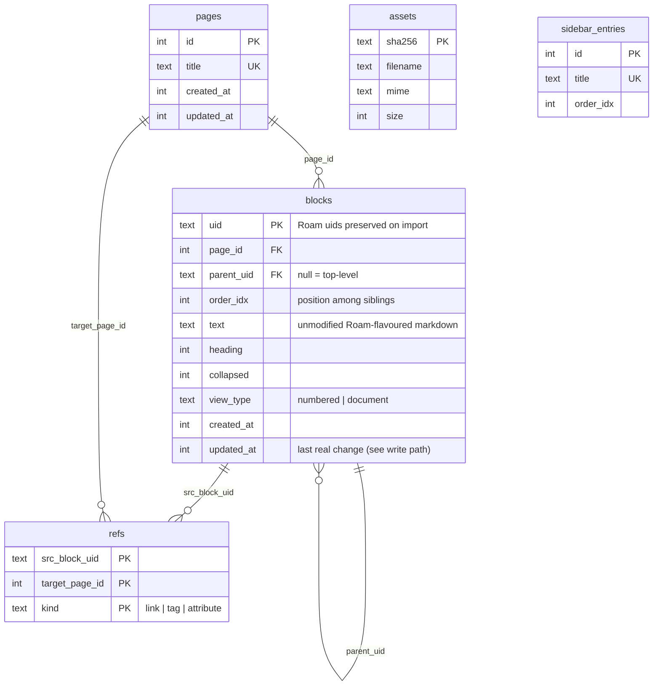
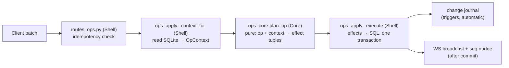
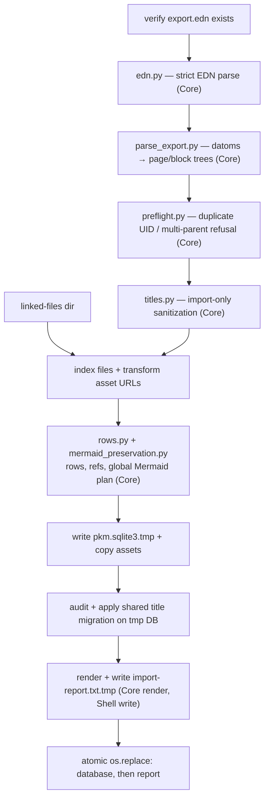

# Backend architecture (server/ + HTTP API)

The backend is a Python 3.12+ FastAPI application over a single SQLite file.
It is the sole authority for the graph. Block-graph mutations flow through
`POST /api/ops`, other writes use dedicated routes, refs and full-text indexes
are re-derived inside the same transaction, and a trigger-based change journal
feeds the sync protocol. There is no ORM and no migration framework: raw
`sqlite3` with replayable DDL.

Start with [overview.md](overview.md) for the system-level picture. The sync
protocol has its own doc: [sync-and-offline.md](sync-and-offline.md).

## Tech stack

| Concern | Choice |
|---|---|
| Language / runtime | Python ≥ 3.12, [uv](https://docs.astral.sh/uv/) for env + deps, hatchling build |
| Web framework | FastAPI (+ Pydantic v2 models, uvicorn, `websockets`) |
| Storage | SQLite (WAL), FTS5 for search — no ORM, raw `sqlite3` |
| HTTP client (CLI/MCP) | httpx2 |
| MCP | `mcp` SDK (FastMCP, stdio) |
| Assistant harness | `claude-agent-sdk` (bundles its own `claude` CLI binary) |
| Tests / QA | pytest (95% branch coverage enforced), pyrefly (type check), ruff (lint) |

## Module map

Everything lives under `server/src/pkm/`. Every runtime file declares
`# pattern: Functional Core` (pure logic) or `# pattern: Imperative Shell`
(I/O) near the top — see [overview.md](overview.md#functional-core--imperative-shell)
for the pattern.

```
pkm/
├── schema.py            Core   Single source of DDL: BASE_DDL (replicated to clients)
│                               + SERVER_DDL (journal, idempotency) = DDL
├── refs.py              Core   Ref grammar: [[links]], #tags, attr::, ((refs)), {{embeds}}
├── rename.py            Core   one-pass, opaque-value title-ref rewrite for page rename/merge
├── title_migration.py   Core   boundary-space grouping, blockers, survivor plan + digest
├── todo.py              Core   {{TODO}}/{{DONE}} marker parsing (mirrors web/src/grammar/todo.ts)
├── filenames.py         Core   safe_filename() shared by upload + export
├── assets_core.py       Core   Asset-browser helpers: reference-token stripping,
│                               MIME categorisation (+ its SQL twin), zip arcnames
├── edn.py               Core   Minimal EDN parser for Roam exports
├── schema_dump.py       Shell  Generates web/src/replica/baseSchema.gen.ts
├── refs_parity_dump.py  Shell  Generates shared/fixtures/refs_parity.json
│
├── contracts/           Core   The wire contract, depended on by BOTH sides:
│                               ops.py (op models + UID_RE + text_hash),
│                               responses.py (JSON response models),
│                               daily.py (date <-> "July 8th, 2026" titles)
│
├── server/              The FastAPI app (details below)
├── importer/            Roam EDN import pipeline: run.py Shell; preflight.py and
│                        mermaid_preservation.py Core validation/planning
├── export/              Markdown export (markdown.py Core render, writer.py Shell)
├── backup/              Nightly backup job (__main__.py Shell, rotation.py Core)
├── cli/                 `pkm` CLI (main.py Shell; build.py/render.py Core planners)
├── client/              Shared HTTP client (api.py Shell PkmClient, core.py Core,
│                        workflows.py Shell: the write workflows CLI+MCP share)
├── mcp/                 `pkm-mcp` FastMCP stdio server over the same client
├── assistant/           Embedded LLM assistant: SSE routes + Claude Agent SDK
│                        harness confined to the pkm MCP tools (details below)
└── test_data/           Synthetic fixture graph generator
```

**Dependency direction.** `cli`/`mcp`/`client` → `contracts` ← `server`, and
`contracts` imports neither side. Client-side code used to import
`pkm.server.ops_core` and `pkm.server.daily` for the op models, the uid regex
and the daily-title spelling, which made a client compile against server
internals. Those shapes are transport contracts, not server internals, so
they moved to `pkm/contracts/`. `pkm.server` still owns everything that acts
on them (`ops_core.plan_op`, `server/daily.py`'s journal-day selection). Two
tests in `tests/test_client_contracts.py` enforce the direction by parsing
imports, so a re-crossing fails the suite rather than review.

Inside `pkm/server/`:

| File | Pattern | Role |
|---|---|---|
| `app.py` | Shell | App factory `create_app(config)`; runs `init_db()`, builds the `AssistantService` (engine injectable), mounts routers, serves the SPA |
| `config.py` | Shell | Frozen `Config` loaded from the data dir's `config.json` |
| `db.py` | Shell | `init_db()`/`open_db()`, per-request connection dependency, column migrations |
| `auth.py` / `auth_core.py` / `throttle_core.py` | Shell / Core / Core | Login routes + `require_auth`; scrypt password check, HMAC session tokens; per-source login backoff policy (see [Auth](#auth)) |
| `routes_pages.py`, `routes_ops.py`, `routes_search.py`, `routes_sidebar.py`, `routes_sync.py`, `routes_assets.py`, `routes_export.py`, `routes_migrations.py` | Shell | The HTTP surface (table below), including the authenticated title-canonicalization audit/apply operator route |
| `title_migration.py` / `sync_meta.py` | Shell / Shell | Transaction-owned title inventory/apply and durable activation/generation accessors |
| `ops_core.py` | Core | Pure `plan_op()` → effect tuples, over the op models in `pkm/contracts/ops.py` |
| `ops_apply.py` | Shell | Reads SQLite into an `OpContext`, executes planned effects |
| `store.py` | Shell | Reusable page mutations (create/delete/rename/merge); never commits |
| `tree.py`, `backlinks.py`, `daily.py`, `fts.py`, `query.py`, `sync_core.py`, `mime_sniff.py` | Core | Pure helpers: tree building, backlink shaping, journal-day selection + empty-daily test, FTS queries, `{{[[query]]}}` evaluation, sync windowing and hydration ordering, MIME sniffing |
| `ws.py` / `notify.py` | Shell | WebSocket hub + broadcast nudges |
| `tempfile_response.py` | Shell | `CleanupFileResponse`: a `FileResponse` whose cleanup callback runs even on a missing/unreadable file or a send-time error, not only after a completed transfer (used by the zip export routes; see [Assets](#assets)) |
| `request_log.py` / `logfmt.py` | Shell / Core | The `pkm.access` request log — one line per request, with durations (see [Logging](#logging-and-observability)) |
| `run.py` / `setup.py` | Shell | `python -m pkm.server.run` entrypoint; `setup` writes `config.json` |
| `openapi_dump.py` / `shim_parity_dump.py` | Shell | Generated-artifact writers (see [Generated artifacts](#generated-artifacts-and-parity-fixtures)) |

The embedded assistant is the one HTTP surface *not* in this package. Its
routes and service live in the sibling `pkm/assistant/` package
([details below](#embedded-assistant-pkmassistant)); `app.py` constructs the
service and mounts its router alongside the ones above.

## Database

One SQLite file (`pkm.sqlite3`) in the data directory. WAL mode and schema
are applied **once at startup** by `init_db()` (`server/db.py`); per-request
PRAGMA setup used to cause lock errors. Request handlers get a fresh
connection each (`check_same_thread=False`, `Row` factory, `foreign_keys=ON`,
`recursive_triggers=ON`, `busy_timeout=5000`).

Schema lives in `pkm/schema.py` as two DDL blocks. `BASE_DDL` is the data
model, and is **replicated verbatim to browser clients** via the generated
`baseSchema.gen.ts`. `SERVER_DDL` adds server-only sync machinery and never
leaves the server.


```mermaid
erDiagram
    pages ||--o{ blocks : "page_id"
    blocks ||--o{ blocks : "parent_uid"
    blocks ||--o{ refs : "src_block_uid"
    pages ||--o{ refs : "target_page_id"

    pages {
        int id PK
        text title UK
        int created_at
        int updated_at
    }
    blocks {
        text uid PK "Roam uids preserved on import"
        int page_id FK
        text parent_uid FK "null = top-level"
        int order_idx "position among siblings"
        text text "unmodified Roam-flavoured markdown"
        int heading
        int collapsed
        text view_type "numbered | document"
        int created_at
        int updated_at "last real change (see write path)"
    }
    refs {
        text src_block_uid PK
        int target_page_id PK
        text kind PK "link | tag | attribute"
    }
    assets {
        text sha256 PK
        text filename
        text mime
        int size
    }
    sidebar_entries {
        int id PK
        text title UK
        int order_idx
    }
```

Around that base model:

- **Derived indexes.** `blocks_fts` and `pages_fts` are external-content FTS5
  tables kept in sync by `AFTER INSERT/UPDATE/DELETE` triggers. Block text is
  the only durable data; `refs` and FTS are always rebuilt from it.
  (`blocks_fts` is keyed by implicit rowid, so `VACUUM` would break it.)
- **Server-only tables** (`SERVER_DDL`):
  - `changes(seq AUTOINCREMENT, kind, entity_id, deleted)` — the append-only
    change journal. Populated by **row-level triggers** on
    blocks/pages/sidebar, not by route code, so any new write path is
    journalled automatically. Cascade deletes journal correctly only because
    `recursive_triggers=ON`.
  - `applied_batches(batch_id, request_hash, response)` — op idempotency.
  - `sync_meta` — durable server sync and title metadata. Today it holds the
    random `db_generation` token (a rebuilt database gets a new one and
    clients rebootstrap) plus `plain_space_title_canonicalization`, the
    rollout flag for stripping leading and trailing plain spaces from
    canonicalized page titles.
- **Schema migrations.** No framework. Additive tables and indexes are
  replayable `IF NOT EXISTS` statements in `schema.py`; additive columns are
  guarded `PRAGMA` checks in `db._ensure_schema_migrations` (currently
  `blocks.view_type` and the three `assets` description columns). One *data*
  backfill runs alongside them: blocks the Roam import left with a NULL
  `created_at` (old blocks carrying no `:create/time`) take
  `MIN(page.created_at, block.updated_at)`, so a filled-in `created_at` can
  never postdate the block's own last edit. It is a plain
  `WHERE created_at IS NULL` update — re-running is a no-op — and it fires the
  block triggers, so replicas pick the values up through ordinary sync.
  Client replicas rebootstrap on a schema-hash change.
  This startup work does **not** run the existing-data title migration; title
  activation is the explicit audited operator path described below.

## The write path

`POST /api/ops` is the transactional block-operation write path. Clients send
an `OpBatch` (`client_id`, optional `batch_id`, 1–500 ops) of block-level
operations: `create`, `update_text`, `move`, `delete`, `set_collapsed`,
`set_heading`, `set_view_type`, `create_page`.

The path is the clearest FCIS example in the repo: a pure planner between two
thin shells.


```mermaid
flowchart LR
    C[Client batch] --> R["routes_ops.py (Shell)<br/>idempotency check"]
    R --> CTX["ops_apply._context_for (Shell)<br/>read SQLite → OpContext"]
    CTX --> P["ops_core.plan_op (Core)<br/>pure: op + context → effect tuples"]
    P --> X["ops_apply._execute (Shell)<br/>effects → SQL, one transaction"]
    X --> J["change journal<br/>(triggers, automatic)"]
    X --> B["WS broadcast + seq nudge<br/>(after commit)"]
```

Key mechanics:

- **Ordering.** Siblings hold integer `order_idx`. An insert or move emits a
  `ShiftSiblings` effect — bump every sibling ≥ the target index — before
  placing the block. Cross-page moves re-page the whole subtree and touch
  both pages, and a parent-chain check prevents cycles.
- **Refs re-derivation.** Every text change emits `ReindexRefs`: delete the
  block's refs, re-extract with `refs.py`, get-or-create referenced pages,
  re-insert.
- **Timestamps: what counts as a change.** Blocks and pages both carry
  `created_at`/`updated_at` in epoch milliseconds, and the block-level values
  are genuine all the way back to the import — `parse_export.py` copies each
  Roam block's `:create/time` and `:edit/time`. `blocks.updated_at` is meant
  to answer "when was this block last really changed", so `set_collapsed`
  stamps neither the block's `updated_at` nor its page's: collapsing a subtree
  is a view-state toggle, frequent enough that counting it would drown the
  signal and churn the recently-changed page ordering. `update_text`, `move`,
  `set_heading` and `set_view_type` all do bump both. The change journal is
  trigger-driven and independent of this — a collapse still journals its block
  row, so the toggle still reaches other clients.
- **Conflict handling: per-block last-write-wins, with preservation.**
  `update_text` carries an optional `base_text_hash`, the sha256 of the text
  the edit was based on. It is a *text* hash rather than a version counter,
  so structural changes don't manufacture conflicts. On mismatch the incoming
  edit wins, and the losing text is preserved as a `[[conflict]]` sibling
  block. An edit to a since-deleted block is appended to today's daily page
  instead of vanishing. The sibling's uid comes from the server's own
  generator (`ops_apply.py`), which mints an alphanumeric first character like
  every other uid minter in the project, so the CLI can address it without
  `--` (see the uid note under [CLI and MCP](#cli-and-mcp-server)).
- **Idempotency.** A retried batch — same `batch_id`, identical canonical
  request hash — replays the stored ack with no effects. The same id with a
  different payload is a 409. This is what makes offline queue replay safe.
- **Broadcast.** After commit, the WebSocket hub pushes the applied ops and a
  `{type:"seq", seq}` nudge to other clients (see
  [sync-and-offline.md](sync-and-offline.md)).

Page-level mutations (create, delete, rename, merge) live in `store.py` as
composable functions that never commit; routes own the transaction.
`POST /api/page/{title}/rename` rewrites all referencing block text via
`rename.py`, and merges by concatenating blocks when `allow_merge` is set.

Sidebar pinning is a separate write path. `POST /api/sidebar` takes SQLite's
writer reservation with `BEGIN IMMEDIATE` before it checks title uniqueness
and computes the append slot as `max(order_idx) + 1`. A same-title race
therefore becomes HTTP 409, and two distinct concurrent appends cannot land
on the same `order_idx`. That serialization is transactional, not a
schema-level uniqueness constraint on `sidebar_entries.order_idx`.

## Auth

Modest by design, layered under Tailscale (see `docs/SECURITY.md`):

- One shared password, checked with scrypt in constant time
  (`auth_core.py`). `POST /api/login` sets a `pkm_session` cookie:
  HMAC-SHA256-signed `v1.<issued_ms>.<sig>`, httponly, `samesite=lax`,
  1-year expiry.
- `LoginThrottle` (`auth.py`, one instance per app on `app.state`) bounds the
  cost of unauthenticated login attempts two ways. A per-source exponential
  backoff (1s, 2s, 4s, … capped at 30s, cleared by a success) rejects a
  throttled attempt *before* scrypt runs. A process-wide semaphore caps
  concurrent scrypt computations regardless of source.

  A throttled attempt gets the same 401 as a wrong password, including an
  attempt with the *correct* password. The only signal distinguishing them is
  the timing difference between a fast reject and a real scrypt computation,
  which the design accepts.

  Acquiring that semaphore slot (`scrypt_slot()`) is bounded by a timeout
  (`SCRYPT_ACQUIRE_TIMEOUT_S`, 2s) rather than an unbounded wait. `login()`
  is a sync route, so it runs on the same shared worker-thread pool as every
  other sync route; blocking indefinitely on a full semaphore would let
  enough concurrent connections to `/api/login` — which cost nothing while
  queued — starve that pool and freeze the whole app, not just login. A
  timed-out acquire fails into the same uniform 401. Per-source backoff
  cannot defend against this on its own, because it only engages after a
  failure is recorded, which requires having got a slot and run a password
  check first. The timeout is what actually bounds it.

  In production the server sits behind `tailscale serve`, so
  `request.client.host` is the proxy's address for every request and all
  clients collapse into one throttle bucket. The per-source backoff is
  therefore effectively *global* there: one wrong password from anyone
  throttles everyone, including a subsequent correct-password login, for that
  backoff window. The global semaphore plus its 2s acquire timeout, not
  per-source isolation, is the real defense against a concurrency flood in
  the deployed setup.
- Every feature router is declared with
  `dependencies=[Depends(require_auth)]`. The public surface is only
  `GET /login`, `POST /api/login`, `GET /healthz`, and the static SPA shell.
- The WebSocket verifies the same cookie and closes unauthenticated
  connections with code 4401.
- The server binds loopback plus the Tailscale IP only (default port 8974).
  Tailscale is the real transport boundary.

## HTTP API reference

Authoritative sources: the `routes_*.py` modules and the generated
`web/src/api/openapi.json` (regenerate with `pkm.server.openapi_dump`; the
server test suite fails if it is stale). Response models are Pydantic classes
in `pkm/contracts/responses.py`. That is what makes the generated TS types
trustworthy, and — since `PkmClient` validates every response with the same
classes — what makes a drifting payload fail loudly in the CLI/MCP client
too. All endpoints require the session cookie unless marked public. FastAPI's
`/docs` and `/redoc` are disabled.

| Method | Path | Purpose |
|---|---|---|
| POST | `/api/login` *(public)* | Password → signed session cookie |
| GET | `/login` *(public)* | Inline HTML login form |
| GET | `/healthz` *(public)* | Liveness check |
| GET | `/{path}` *(public)* | SPA fallback: serves `web_dist` (index.html no-cache, hashed bundles under `/app-assets/`) |
| GET | `/api/openapi.json` | Live OpenAPI schema |
| **Writes** | | |
| POST | `/api/ops` | Transactional block-operation write path — apply an `OpBatch` transactionally |
| **Pages & blocks** | | |
| GET | `/api/page/{title}?bl_offset&bl_limit` | Page tree + paginated backlinks (daily pages auto-created) |
| GET | `/api/block/{uid}` | One block subtree with page context + breadcrumbs |
| GET | `/api/block-refs?uids=` | Resolve `((uid))` references on demand |
| POST | `/api/pages` | Idempotent page create |
| DELETE | `/api/page/{title}` | Delete page + blocks (+ sidebar entry); inbound links remain as text |
| POST | `/api/page/{title}/rename` | Rename and rewrite refs; 409 on collision unless `allow_merge`. Returns `RenamePageResponse` (`result: "renamed" \| "merged"`, `title`) |
| GET | `/api/unlinked?title` | Unlinked mentions of a title |
| GET | `/api/journal?before&days` | Daily-notes feed (infinite scroll) |
| POST | `/api/journal/cleanup` | Prune empty daily pages (spares today + referenced blocks) |
| GET | `/api/current-work` | Recently edited pages, bucketed by age |
| **Migrations** | | |
| GET | `/api/migrations/title-canonicalization` | Side-effect-free `TitleMigrationAuditPayload`: `active`, digest, grouped survivor/source plans and counts, and blockers whose `reason` is `all_space` or `forbidden_syntax` |
| POST | `/api/migrations/title-canonicalization` | `TitleMigrationApplyRequest.audit_digest` (required 64 lowercase hex) → `TitleMigrationApplyResponse` with digest, applied/retitled/merged/moved/rewritten counts, and new `generation`; 409 on stale, blocked, or already-active databases |
| **Search & queries** | | |
| GET | `/api/search?q` | FTS5 search over pages + blocks |
| GET | `/api/query?expr` | `{{[[query]]}}` evaluation (`and`/`or`/`not` over refs) |
| GET | `/api/titles?q` | Title completion for `[[` / `#` autocomplete |
| GET | `/api/todos?page` | `{{TODO}}` blocks grouped by page |
| **Sidebar** | | |
| GET / POST / PUT / DELETE | `/api/sidebar`… | Pinned pages: list / pin / reorder (permutation-validated) / unpin |
| **Sync** (see [sync-and-offline.md](sync-and-offline.md)) | | |
| GET | `/api/sync/snapshot` | Full graph bootstrap + `seq` + `generation` + title-canonicalization activation |
| GET | `/api/sync/changes?since&limit` | Windowed incremental feed with the same generation/activation metadata |
| WS | `/api/ws` | Push nudges: applied-op broadcasts + real `seq` hints; title generation rotation adds `force:true,generation` without fabricating a cursor |
| **Assistant** (SSE — see [Embedded assistant](#embedded-assistant-pkmassistant)) | | |
| POST | `/api/assistant/conversations` | Create a conversation (`model`: `sonnet` default / `opus` / `haiku`); 409 over the 3-conversation cap |
| POST | `/api/assistant/conversations/{id}` | Beacon cleanup close (`navigator.sendBeacon`): delete the conversation, shut down its harness, and return `AssistantAck` |
| POST | `/api/assistant/conversations/{id}/messages` | Send one user turn → SSE stream of `text_delta` / `tool_started` / `tool_finished` / `confirm_request` / `turn_done` / `error` events; 409 while a turn is in flight |
| POST | `/api/assistant/conversations/{id}/confirm` | Answer a pending write confirmation (`tool_use_id`, `allow`) |
| DELETE | `/api/assistant/conversations/{id}` | Close the conversation and shut down its harness |
| **Assets** | | |
| POST | `/api/assets` | Multipart upload → content-addressed storage |
| GET | `/assets/{sha256}/{filename}` | Serve by digest (immutable cache) |
| GET | `/api/assets/describe-status` | Whether image descriptions are enabled, and why not if disabled |
| POST | `/api/assets/scan?force` | Enqueue undescribed (or, with `force`, previously-failed) eligible images |
| GET | `/api/assets/search?q&limit&offset&type&from_ms&to_ms&linked` | `LIKE` search over asset description + filename, filtered and paginated, with a `total` (backs the `/files` browser) |
| DELETE | `/api/assets/{sha256}` | Delete an asset, stripping its reference tokens from block text |
| POST | `/api/assets/export.zip` | Zip the selected assets (form-encoded `sha256s`, download) |
| **Export** | | |
| GET | `/api/export/page/{title}` | One page rendered to markdown (download) |
| GET | `/api/export.zip` | Whole-graph markdown export, zipped (download) |

### Breadcrumbs and recursive traversal

`routes_pages.py::_fetch_ancestors` builds the breadcrumb trail behind
`GET /api/block/{uid}` and, via `backlinks.py`, every backlink group. It walks
parents with a recursive CTE, and its termination condition is a **visited
path, not a depth limit**: the CTE carries `path` as `,uid,uid,…,` and the
recursive arm keeps a row only while `instr(a.path, ',' || b.uid || ',') = 0`.

That shape matters in two directions, and both were previously wrong in the
same statement. It is *complete*: the old `depth < 100` guard truncated a
breadcrumb trail at 100 levels, which is a wrong answer rather than a slow
one, and no user-visible output in this project truncates silently. And it is
*cycle-safe*: a parent cycle, which the write path forbids but a corrupted or
hand-edited database can still hold, would otherwise recurse until SQLite gave
up.

The comma delimiters are what make the `instr` test exact. `UID_RE` is
`^[a-zA-Z0-9_-]{6,32}$`, so no uid can contain a comma, and `,abc,` cannot
match a fragment of a neighbouring uid.

Both replica mirrors of this traversal use the identical guard — see
[sync-and-offline.md](sync-and-offline.md). When editing any of the three,
change them together: the whole point is that an offline read and a server
read return the same trail.

### Assets

Uploads stream in 1 MiB chunks with a running size cap (413 over
`max_upload_bytes`, default 150 MB), MIME-sniffed from the first chunk
(`mime_sniff.py`). Files are stored content-addressed at
`<assets_dir>/<sha256[:2]>/<sha256>` and deduplicated by digest; the `assets`
row keeps the display filename, MIME and size. Raster images and PDFs serve
inline. Everything else, including SVG, which can script, is forced to
download with `nosniff`.

The upload response's `existing` bool records whether the `assets` row was
already there before this call (a dedup hit) or is brand new. The CLI's
`pkm upload` and the MCP `upload_asset` tool resolve and validate the
destination page and parent *before* calling `POST /api/assets`. If the
follow-up `/api/ops` write that links the asset then fails, they compensate
with `DELETE /api/assets/{sha256}` only when `existing` was `false`. Deleting
on a dedup hit would be wrong: the sha may already be referenced by other
blocks that have nothing to do with this call's failed write.

The three management endpoints behind the `/files` browser share
`assets_core.py` for their pure parts:

- **Search** is `LIKE`, not FTS: a personal-scale table, and no
  offline-parity burden. `linked`/`orphan` filtering needs refs for every
  candidate, so that path scans the whole filtered set; `linked=all` computes
  refs only for the returned page.
- **Delete** strips every asset reference token out of block text and removes
  the row, then unlinks the file **after** the commit. A crash then leaves at
  worst an unreferenced file on disk, never a row pointing at a missing file.
  A block left empty *and* childless is deleted outright, but an emptied
  parent is kept: asset deletion must never cascade away real content. Asset
  URLs never produce `refs` rows — only `[[link]]`, `#tag` and `attr::` do —
  so no refs reindex is needed.
- **Selected-asset zip** is form-encoded on purpose, so the web app can drive
  it with a plain `<form method="post">` and let the browser own the
  download. Unknown, malformed, duplicate and missing-on-disk digests are
  skipped rather than erroring, so the zip honestly contains what could be
  exported, and filename collisions get a short sha prefix (`zip_arcnames`).

  The selection's count and total bytes — summed from the `assets` table's
  `size` column, never by opening a file — are checked against fixed limits
  (500 assets / 1 GiB, `MAX_EXPORT_ASSET_COUNT` and
  `MAX_EXPORT_TOTAL_BYTES` in `routes_assets.py`) before any archive is
  built. Over either limit the request is refused with 413, rather than
  producing a truncated zip.

  Both this route and the whole-graph `/api/export.zip` build their archive in
  a temp directory and stream it back via a `FileResponse` subclass
  (`CleanupFileResponse`) instead of buffering the whole zip in memory. The
  temp directory is removed however the response ends. This is not about an
  ordinary client disconnect: under uvicorn, `send()` silently no-ops once a
  connection drops rather than raising, so the transfer loop still runs to
  completion and stock `FileResponse`'s own `background` task still fires.
  What the subclass guards is a missing or unreadable file at send time
  (`FileResponse.__call__` raises before reaching its `background` line) and,
  as defense in depth, an ASGI server other than uvicorn whose `send()` does
  raise on a dropped connection.

## Importer (Roam EDN → fresh database)

`python -m pkm.importer.run export.edn --files <dir> --out <data-dir>`. Each
run builds a complete new database and atomically swaps it in, so re-running
is always safe.

Asset copying (the "copy assets" step below) never trusts an existing
content-addressed destination just because it is present. It verifies against
the freshly-indexed source's size and sha256
(`assets_core.asset_needs_repair`, shared with the export writer's own
verify-then-hardlink check), and rewrites a mismatch atomically — temp file
plus `os.replace` — from the linked-files source, the same path used for a
brand-new hash.


```mermaid
flowchart TD
    A["verify export.edn exists"] --> B["edn.py — strict EDN parse (Core)"]
    B --> C["parse_export.py — datoms → page/block trees (Core)"]
    C --> P["preflight.py — duplicate UID / multi-parent refusal (Core)"]
    P --> T["titles.py — import-only sanitization (Core)"]
    F["linked-files dir"] --> G["index files + transform asset URLs"]
    T --> G
    G --> D["rows.py + mermaid_preservation.py<br/>rows, refs, global Mermaid plan (Core)"]
    D --> E["write pkm.sqlite3.tmp + copy assets"]
    E --> M["audit + apply shared title migration on tmp DB"]
    M --> R["render + write import-report.txt.tmp (Core render, Shell write)"]
    R --> H["atomic os.replace: database, then report"]
```

The EDN parser is strict. Malformed input returns exit 2 with
`error: malformed export at offset N: DETAIL`, where `N` is a zero-based
Python character offset. The EDN-unsupported solidus escape `\/` stays
invalid, rather than being accepted for JSON/Logseq compatibility.

`parse_export()` then builds the transport-neutral trees. Before title
sanitization, linked-file indexing, output-directory creation, SQLite, assets
or report work, `preflight.py` traverses every page and orphan subtree and
refuses duplicate block UIDs, or one block entity reached through multiple
parents. It selects the lexicographically first offending UID and reports all
sorted structural locations, so the diagnostic is deterministic.

Only after structural preflight, and still before linked-file indexing and
row construction, `importer/titles.py` recursively removes balanced `[[`/`]]`
markers and `#` markers from every explicit and ref-derived title, rewrites
refs with the resulting map, and merges collisions in stable source order,
preferring an already-clean spelling as survivor. The report lists each
changed spelling, all its locations, and whether it merged. Malformed marker
syntax, or a result made blank by sanitization, refuses the run before the
output directory is created.

Before either `os.replace`, the importer also runs the same shared
`audit_title_migration()` / `apply_title_migration()` shell the operator
route uses, against the temporary database it just built. Fresh imports
therefore start on the post-migration title rule
(`sync_meta.plain_space_title_canonicalization = '1'`), and any imported
clean/padded twins are merged through the normal stable block/ref rewrite path
before the swap. If that audit finds a blocker, the importer refuses the run,
prints the friendly title-migration error, deletes the temp database, and
leaves the already-published database and report untouched.

Roam block uids, ordering and timestamps are preserved, so every existing
`((block ref))` and daily-note link keeps resolving. Mermaid conversion is
the one place that could otherwise break quietly, because flattening a
component block's descendants into a single fenced block drops their rows.
Both fresh row derivation and the one-off `migrate_mermaid_blocks.py`
migration gather every candidate and call the same `mermaid_preservation.py`
core before flattening.

A candidate is directly protected when an inbound `((uid))` from outside its
subtree targets a descendant. Protection then reaches a fixed point by
protecting every candidate ancestor that contains a protected component,
which stops an outer flatten from deleting a nested component that was kept.
Protected components remain ordinary nested blocks, with uid, text and
children intact. Reports are keyed by descendant UID, deduplicate that
descendant across components, and union and sort source UIDs
(`Rows.mermaid_preserved_refs` in the import report; migration
`Plan.preserved`, printed by `--dry-run` and by a normal run before
deletion). The migration prints no preserved section when the plan has no such
rows.

Blocks with a `:block/uid` and `:block/string` that Roam's export leaves
unreachable from any page (`parse_export.py`'s `Export.orphan_blocks`) are not
dropped. Each unreachable subtree's root, with its internal uid/text/children
structure intact, is attached under a deterministic
`"Import recovery: unreachable blocks"` page (`rows.py`'s
`RECOVERY_PAGE_TITLE`, suffixed `" (2)"` and so on if a page already has that
title), so every `((block ref))` into one still resolves.

A root is found in two passes:

1. Any unreached block with no *valid* parent becomes a root directly. A
   parent is valid only if that entity itself has `:block/string`; one that
   doesn't fails `is_block` and is never visited at all, so its real children
   would otherwise vanish along with it. This pass also recovers cyclic
   subtrees hanging off some other root's descendants.
2. Anything still unbuilt lives entirely inside a cycle with no such entry
   point (`A`'s only pointer is from `B`, `B`'s only pointer is from `A`, …).
   Its parent chain is walked until a node repeats, and that node is rooted.
   Rooting an arbitrary member instead could root a non-cycle branch first and
   later re-attach it a second time under its real parent, which is a real
   `blocks.uid` primary-key collision, not just a documentation nicety.

Only entities with no `:block/string` at all (`skipped_entities`, with no
text to reconstruct even from a subtree) are just counted, and never appear
on the recovery page. Implicit-page counting happens after orphan rows have
been walked, so pages referenced only by orphan text are included, and the
recovery page itself is subtracted from the implicit total.

Temporary-file cleanup follows stage boundaries rather than one universal
rule:

- The importer removes a stale `pkm.sqlite3.tmp` at the start of a new output
  build, so an early database-build or asset-copy failure may leave that
  self-healing temp in place. `import-report.txt.tmp` does not exist yet at
  that point.
- Once report rendering, writing or publication begins, any exception removes
  both remaining named temps. A report render/write failure, or a failure of
  the first (database) `os.replace`, therefore leaves the published database
  and report unchanged.
- Publication is two ordered atomic replacements — database first, report
  second — not one transaction across both files. If the second replace
  fails, the new database may already be published while the old report
  remains; the next successful run repairs the pair.

## Export and backup

### Markdown export

`export/writer.py::export_graph` renders every page to
`export/pages/<title>.md` and dailies to `export/journal/YYYY-MM-DD.md`.
`markdown.py` resolves `((refs))` to text one level deep and keeps
`{{query: ...}}` macros as the raw command. Assets are mirrored
incrementally.

A previously-exported asset's mere presence at its content-addressed path is
never trusted. It is verified against the `assets` row's known size and sha256
(`assets_core.asset_needs_repair` — a cheap stat first, a full hash only once
the size matches) before being hardlinked into the new tree, and a mismatch is
re-copied from the live store instead. A truncated or corrupted file from a
past export therefore doesn't survive forever. A successful fresh transfer
increments only `assets_copied`; a successful corrupt replacement increments
only `assets_repaired`. If the repair source is itself missing, no transfer
happens: the asset is dropped from this export with a `pkm.export` warning and
its own `assets_missing_source_on_repair` count, rather than disappearing into
the ordinary "missing asset" case. Successful assets publication drops the
corrupt residue, so that warning is normally a one-run event; a failure after
the warning but before publication may leave the old corrupt tree active and
repeat the warning next run.

The export directory has one writer. Before writing `.gitignore`, rendering,
creating this run's staging tree, or publishing a last-good subtree, each run
sweeps abandoned `.export-staging-*` entries. Matching symlinks are unlinked
without following their targets; real directories are removed recursively.
Disappearance during cleanup counts as success, while every other error aborts
the run. The single-writer invariant needs neither a lock nor an age
heuristic.

Markdown files are rewritten byte-identically when unchanged, so the git diff
of a nightly export is minimal. Rendering and asset copying happen into a
scratch `.export-staging-*` directory beside the live one, and the previous
`pages/`, `journal/` and `assets/` are replaced only once a full new export is
ready, via `_publish_dir`'s atomic directory rename. A rendering, disk or
asset-copy failure *before publishing starts* therefore leaves the last
known-good export byte-identical. It is the same "stage, then swap" shape as
the database/report publish above, applied to a directory tree instead of a
file.

Publishing itself is three separate atomic renames, one per subtree, not one
transaction. A failure partway through — journal's publish erroring after
pages' has landed, say — leaves a genuine mixed old/new state for that run,
which the next successful run heals. Nothing is corrupted or lost in between:
the not-yet-published subtree's old content survives under `<name>.stale`
until superseded, and the raised exception stops the nightly job from ever
git-committing that mixed state.

The whole-database export is also exposed over HTTP as `routes_export.py`'s
`/api/export.zip`: the same `export_graph()` into a temp dir, downloaded
zipped, with the same backup semantics.

### Single-page export

`GET /api/export/page/{title}` (`routes_export.py` + `export/resolve.py`) is
the end-user download, and deliberately a *different* rendering mode from the
backup path above: it resolves dynamic content to plain text, so the download
reads like what a reader of the live page would see.

- `((refs))` resolve recursively, not one level, and are inlined as plain text
  rather than wrapped in parens.
- `{{query: ...}}` and `{{[[query]]: ...}}` macros execute — via `query.py`'s
  `parse_query`/`plan_sql`, the same plan live `/api/query` runs — and render
  as a results list grouped by page.
- Depth caps mirror the live UI's own recursion guards exactly, so nesting
  behaves identically to the browser: `BlockRef.tsx`'s `MAX_DEPTH = 3` for
  refs, `QueryBlock.tsx`'s `MAX_DEPTH = 2` for nested queries.

Resolution and rendering are pure (`export/resolve.py`, given precomputed
uid→text and expr→results maps). The route gathers that data with a
depth-capped, cycle-safe breadth-first fetch, where a `visited` set stops a
cyclic `((ref))` chain from refetching forever; the caps alone only stop it
from *rendering* forever.

The web UI surfaces both exports as "Export as Markdown" in the page menu for
a single page, and a whole-database export link on the Settings page. Settings
is a plain growable list of sections; Help now hosts only the static
keyboard-shortcut doc.

### Why `extract()` is O(n) per call

`refs.py`'s `extract()` used to be quadratic in one case. The attribute regex
paired a greedy `\s*` with a lazy class that mostly overlapped it, which is
quadratic to *fail* against a long run containing no `::` — exactly what one
large fenced code block becomes once `_strip_code()` blanks it out.
`export_graph()` calls `extract()` once per block, via
`collect_block_ref_uids`, so a single pathological block in a real graph could
make the whole-database export take minutes instead of being instant, which
from the browser is indistinguishable from the download not working. Leading
whitespace is now stripped in Python (`str.lstrip()`, linear, no backtracking)
before the regex runs.

### Backup job

`python -m pkm.backup`, run nightly via launchd, takes an online SQLite
`.backup()` snapshot from a read-only connection into
`backups/sqlite/pkm-YYYY-MM-DD.sqlite3`. `rotation.py` prunes it to the newest
14 dailies plus the latest of each month, kept forever. It then runs the
markdown export **from that same snapshot** and git-commits it. Its success
line renders the complete export-count dictionary, including `assets_copied`,
`assets_repaired` and `assets_missing_source_on_repair`. The live database is
never opened for writing, and any failure exits non-zero.

## CLI and MCP server

`pkm` (CLI) and `pkm-mcp` (FastMCP stdio server) are thin shells over the same
HTTP client. They talk to the running server's API, never to SQLite directly,
so they get the same validation, conflict handling, journalling and broadcasts
as the web client. The user-facing reference is [docs/cli.md](../cli.md).

### The shared client

`client/api.py::PkmClient` owns all I/O: config at
`~/.config/pkm-cli/config.json` (session token from `pkm login`, sent as the
`pkm_session` cookie), HTTP via httpx2. Tests inject an in-process FastAPI
`TestClient`.

Every method returns a validated `pkm/contracts/responses.py` model, never a
bare dict, so the planners and renderers downstream read typed attributes and
a field that drifts is a pyrefly error rather than a `KeyError` in front of
the user. A 2xx body that doesn't satisfy its model raises
`ResponseSchemaError` — an `ApiError`, so the CLI still exits 1 with one line
on stderr — naming the endpoint and the offending field path. *Unknown extra*
fields are ignored on purpose, so a newer server stays usable from an older
CLI. These are full models rather than TypedDicts precisely because the
runtime validation is the point: a TypedDict would type the read without ever
detecting the drift.

### Shared write workflows

`client/workflows.py` (Shell) holds the write workflows the CLI and MCP server
both perform: `save_blocks`, `edit_block`, `apply_batch`, `upload_and_link`,
and the `default_page_title` rule (today's daily note). They were duplicated
line-for-line in both shells, which is how a fix could land in one and not the
other. The ordering invariants below — validate before any I/O, resolve the
parent before uploading, page creation inside the same batch — now live in one
place. Presentation stays split: these return values (the created ops, an
applied count) and each shell phrases them, the CLI by printing and the MCP
tools by returning strings.

### Pure planners

`cli/build.py` (Core) holds the planners:

- `plan_save` — indented outline text → create ops
- `plan_batch` — the `pkm batch` command language (`create`, `todo`,
  `update`, `move`, `delete`, `outline`, `as`-aliases, matched-or-created
  `## Heading` parents)
- `plan_update` — a text replacement → `update_text` + `set_heading`
- `plan_mark` — a task-marker change → `update_text` with the marker applied,
  plus a `base_text_hash` guard, and deliberately never `set_heading`
- `split_heading` — strips `#`/`##`/`###` off a line into a heading level 1-3
- `asset_block_text` — MIME → image embed / `{{[[pdf]]}}` macro / link

A `## Heading` parent spec matches on level and text together, taking the
first block in document order if more than one matches. The in-batch memo for
headings created earlier in the same batch follows the same rule, so a heading
resolves to the same parent whether it came from the fetched page or from
earlier in the batch.

`cli/render.py` (Core) renders API payloads to terminal markdown.

Batch bodies are validated before anything else happens. `validate_batch`
parses the whole envelope against a discriminated-union command schema, with
strict (`extra="forbid"`) params models per command, and reports the first bad
item as one `BuildError` naming that item's index and the specific problem.
Both `cli/main.py`'s `cmd_batch` and `mcp/server.py`'s `batch()` call it
immediately after decoding the JSON body, so a malformed batch never triggers
a page fetch or any page/asset creation. Checks that a schema cannot express —
an unknown `{{alias}}`, a page that was not fetched, a move target heading
that does not exist — stay in the planner.

### Section selection

`pkm get --section SPEC` (`render.py::select_section`) has two modes, and the
spec's own syntax decides which applies, rather than a flag.

A *marked* spec (`## Notes`, one space after one to three `#`) selects the
first block in document order whose heading level **and** text both match. That
is the same level-and-text rule `--parent` uses, so the two specs cannot
disagree about which `Notes` they mean.

A *bare* spec (`Notes`) selects the first block with that exact text at any
level, including a plain non-heading block. This is the lenient form, kept for
callers that don't know or care how a section is marked up. Before the two
modes were separated, the marker was stripped and both forms behaved as bare,
so `--section "## Notes"` could return an H3 or a plain block.

Blank-vs-heading is the only leniency: text still matches exactly. A miss
raises `RenderError` listing the page's headings *with* their level markers, so
the error text tells you which spelling to ask for next. The `{1,3}` bound on
the marker matches the app's whole heading domain (`HEADING_COMMANDS` in
`web/src/outline/slashCommands.ts` offers h1–h3 only), so a `####` spec is read
as bare text, which still finds the block by exact text whatever its level.

### Headings are text

Text is the source of truth for a block's heading level on every CLI/MCP
write. `split_heading` runs in `_Planner.creates` — the one call site every
create path funnels through — and in `plan_update`. So `## X` is never stored
as literal text, and `render_page`/`render_block`'s `## text` output reads back
as a heading.

Deliberate exclusions: `#Tag` (no space), `#### ` and deeper (blocks carry
levels 1-3), and multi-line text, which stays verbatim in one block. The
`-D`/`-T`/`mark=` task-marker paths use `plan_mark`, not `plan_update`, and
never emit `set_heading`: the text they read back is already bare, so splitting
it would demote a real heading.

The heading round trip is `pkm get`/`get_page`/`get_block` only.
`render_groups`, `render_backlinks` and `render_search` — the renderers behind
`pkm todos`, `query`, `refs` and `search` — print `item.text` bare, because
the response models behind them (`GroupItem`, `BacklinkItem`,
`SearchBlockHit`) carry no `heading` field: `backlinks.py` and
`routes_search.py` select only `uid` and `text`, plus `breadcrumbs` for
backlinks. Copying a heading's text out of one of those verbs into
`pkm update`/`update_block` therefore demotes it silently. Making that
round-trip-safe would mean a new response field on three models, new query
columns in `backlinks.py`/`routes_search.py`, and an openapi/gen-types regen,
which was judged out of proportion to the CLI-only papercut it fixes. The gap
is documented instead of fixed.

### Writes, uids and missing pages

Writes go through `POST /api/ops` with a fresh `batch_id`. `pkm update` fetches
the current text first and rides the `base_text_hash` conflict path.

Every uid minter in this project resamples until the first character is
alphanumeric: `client/api.py::new_uid` (Python CLI/MCP client),
`server/ops_apply.py::_new_uid` (the conflict-sibling uid) and
`web/src/uid.ts::newUid` (the SPA, via `uidCore.ts::isAlphanumericByte`).

`UID_RE` (`contracts/ops.py`) itself still *accepts* a leading `-` or `_`, so
existing blocks can have one: a Roam import, or a block created by an older
web build. A bare uid CLI argument starting with `-` is parsed by argparse as
an unknown option. `pkm get` and `pkm update` take a uid as a plain
positional, so addressing one of those older uids needs the standard argparse
`--` end-of-options marker, e.g. `pkm get -- -abc123`; any `-D`/`-T` flags must
come before the `--`, since everything after it is positional. Any future
tightening of `UID_RE` to reject a leading `-`/`_` must apply to newly-minted
uids only. Existing blocks that already hold one must stay addressable by uid
for updates and moves, which a naive regex change would break, so that change
needs its own migration-aware work item.

A page a write targets that doesn't exist yet is never created by a separate
request. `PkmClient.get_page_blocks` returns `([], True)` — an empty block list
plus a "missing" flag — and the shared workflow (`save_blocks`, `apply_batch`,
`upload_and_link` in `client/workflows.py`) prepends a `create_page` op
(`build.create_page_ops`) to the same `OpBatch` the planned blocks ride in.
Blocks are all a planner needs, and the only part of a page payload a missing
page can honestly stand in for — there is no id or timestamp to invent — which
is why the method hands back blocks rather than a synthesized payload. That
keeps the "one atomic transaction" contract real: a batch that fails validation
after this point leaves neither the page nor its blocks behind, because the
whole batch, page creation included, rolls back together.

`get_page_blocks` looks up `refs.normalize_title(title)`, not `title`
verbatim. A page whose title held control whitespace is only ever stored, and
addressable, under its normalized spelling, so a caller still holding the
pre-normalization string — a second save to the same page, say — would
otherwise get a false "missing". It would then plan its next write against an
empty page, prepending fresh content and re-creating any `## Heading` parent
the first write already made. The `create_page`/`create` ops built from that
call still carry the caller's original, un-normalized `title` for
`page_title`, which is fine: the server normalizes it again at the same
`get_or_create_page` choke point and lands on the identical row either way.

`PkmClient.get_backlinks`, used by the CLI's `refs` command and the MCP
`backlinks` tool, loops `GET /api/page`'s `bl_offset`/`bl_limit` pagination
until every group is fetched, rather than rendering just the first page. The
route caps a single response at 100 groups, but the CLI/MCP wording promises
the complete backlink list, and no user-visible output in this project
truncates silently. The aggregate `Backlinks.limit` is the first response's
observed, server-clamped page size, or 0 only if no response established one;
it is never the final number of groups synthesized as a fake request limit.

The route sorts backlink sources by `(updated_at DESC, title)`, which is
stable across `get_backlinks`'s sequential requests only if no source page's
`updated_at` changes mid-fetch — a concurrent write from another CLI/MCP
process, for instance. A rank shift across a page boundary produces a
duplicate page_id, a total short of what the server reported, or both.
`_fetch_backlinks_once` detects either symptom, and `get_backlinks` restarts
the whole fetch from offset 0, bounded by `_BACKLINK_MAX_ATTEMPTS`. It raises
rather than ever returning a possibly skipped or duplicated set. `get_page`
itself, used for a page's own content, is unchanged and still returns one page
of backlinks alongside the blocks.

### The MCP tool surface

The MCP server exposes eleven tools: seven reads (`get_page`, `get_block`,
`search`, `query`, `backlinks`, `todos`, `search_assets`) and four writes
(`save_note`, `update_block`, `batch`, `upload_asset`), built from the same
planners. Reads return markdown annotated with `^uid` markers that the write
tools accept. `assistant/policy.py` splits them along exactly that read/write
line (see below), so adding a tool means deciding which tuple it joins.

## Embedded assistant (`pkm/assistant/`)

The in-app LLM assistant is a **server-side agent harness**, exposed over the
app's first SSE endpoints (`/api/assistant/*`, table above, behind the same
`require_auth`). The harness has no built-in tools, only the eleven `pkm-mcp`
verbs, which loop back into this same server over HTTP. Assistant writes
therefore get the same validation, conflict handling, journalling and
broadcasts as any client. Design spec:
[`docs/superpowers/specs/2026-07-26-pkm-wn2s-assistant-design.md`](../superpowers/specs/2026-07-26-pkm-wn2s-assistant-design.md);
threat model: [`docs/SECURITY.md`](../SECURITY.md).

| File | Pattern | Role |
|---|---|---|
| `events.py` | Core | The event union routes and the web UI speak (`TextDelta`, `ToolStarted`/`ToolFinished`, `ConfirmRequest`, `TurnDone`, `ErrorEvent`) + `encode_sse()`. Nothing engine-specific leaks upward |
| `policy.py` | Core | The tool gate (seven read verbs auto-allowed, four write verbs confirm-gated), model allowlist (`sonnet` default / `opus` / `haiku`), tool-activity summaries and write-op previews, and the system prompt |
| `engine.py` | Core | `AgentEngine` / `ConversationHandle` protocols — the seam a second backend (or the test double) plugs into |
| `service.py` | Shell | In-memory conversation registry: 3-conversation cap, lazy 15-minute idle reap, per-conversation lock (a second concurrent turn is a 409); `close_all()` runs on app-lifespan shutdown |
| `claude_engine.py` | Shell | The Claude Agent SDK adapter — the only engine today |
| `routes.py` | Shell | The four endpoints; an engine failure mid-stream is reported in-band as an `error` SSE event, not a broken response. `_with_keepalive()` interleaves a comment frame (`events.SSE_COMMENT`) every `KEEPALIVE_INTERVAL_S` idle seconds |

Conversations are ephemeral: in memory only, with no history table. The engine
is injected into `create_app(config, assistant_engine=...)`; production
defaults to `ClaudeEngine`, while tests and the e2e server inject a fake.

### Admission is serialized

`create()`'s cap check, eviction, and `engine.create_conversation()` call all
run under a single `asyncio.Lock`. Without it, two concurrent creations could
both observe free capacity before either registered, bypassing the cap or
double-evicting.

That lock spans a subprocess spawn (the harness connect handshake), so it is
bounded by `create_timeout` (`CREATE_TIMEOUT_S`, 60s default) rather than left
unbounded: a wedged harness fails that one request instead of wedging every
future `create()`. The true worst-case hold is `CREATE_TIMEOUT_S` *plus*
cleanup, not `CREATE_TIMEOUT_S` alone. `asyncio.wait_for` does not return until
the task it cancelled has finished unwinding, so `create_conversation()`'s own
cancellation-triggered cleanup — disconnecting the partially-connected client —
runs to completion first, still under the lock. That cleanup rides on the SDK
transport's own bounded close, about 20s worst case, which puts the real
ceiling near 80s.

Closing a reaped or evicted conversation's harness is deliberately *not* done
under the lock. The entry is popped from the registry, which is atomic and so
enforces the cap correctly, and the actual `close()` runs after the lock is
released. A hung teardown can then only block the request that triggered it,
never other admissions.

That post-lock teardown loop is itself cancellation-safe. Every queued handle
was already popped from the registry, so nothing else will ever retry closing
it, and a cancellation landing while parked in one handle's `close()` keeps
closing the rest of the queue rather than abandoning it. The first
cancellation is re-raised only once every handle has been attempted, which
delays it rather than losing it.

Sending a turn, confirming a tool call and deleting a conversation are
unaffected: only admission (`create()`) is serialized.

### How `claude_engine.py` confines the harness

- **One SDK subprocess per conversation**, with `tools=[]` plus a single MCP
  server entry running `python -m pkm.mcp.server`, so the model can only call
  the pkm verbs. `ENABLE_TOOL_SEARCH=false` is required alongside `tools=[]`:
  the CLI otherwise defers MCP tools behind a ToolSearch tool, which makes
  them unreachable. (Found in a live smoke test, 2026-07-27.)
- **Auth**: the engine mints a fresh session token (`auth_core.sign_session`)
  into a 0600 temp config file per conversation, passes it to the MCP
  subprocess as `PKM_CLI_CONFIG`, and deletes it on close.
- **Transactional startup**: `create_conversation()` writes that config file,
  then constructs the client and awaits `connect()` inside a
  `try`/`except BaseException` that reuses `ClaudeConversation.close()` for
  cleanup on any exit other than success. That covers three failure shapes the
  old code left unhandled: the `client_factory` itself raising (no client to
  disconnect, only the config to unlink), `connect()` raising after the client
  exists, and cancellation delivered into the awaited `connect()`, which is
  what happens when `service.create()`'s `wait_for(create_timeout)` times out
  on a wedged handshake.

  `close()` already tolerates a client that never connected or was never
  attached, a `disconnect()` call that itself raises, and a *second*
  cancellation landing anywhere in its body — for instance the request task
  being cancelled on top of the `create_timeout` cancellation that triggered
  cleanup. The config-file unlink lives in a `finally` rather than a trailing
  statement a `CancelledError` could skip, precisely because `except Exception`
  does not catch `BaseException`. Startup failure and normal teardown share one
  code path instead of two.
- **Write confirmation**: the SDK's `can_use_tool` hook streams a
  `ConfirmRequest`, with an ops preview from `policy.py`, to the browser and
  blocks the tool call on a future until `POST …/confirm` resolves it. A denial
  returns "the user declined" to the model instead of erroring the turn.
- **Dropped-consumer cleanup, in this order**: decline every pending confirm
  future, *then* await `interrupt()` (bounded by `INTERRUPT_TIMEOUT_S`). The
  order matters and is easy to get backwards. A harness sitting in
  `can_use_tool` cannot acknowledge an interrupt until it gets its decision, so
  interrupting first wedges the harness forever. `FakeSDKClient.interrupt()`
  returns instantly, which hides this entirely, so the regression tests use a
  subclass whose `interrupt()` never returns.
- **An unacknowledged interrupt retires the conversation, not just the turn.**
  If `interrupt()` times out or raises, `ClaudeConversation` flips its `healthy`
  flag to `False`: the subprocess may still be running the abandoned turn, so
  its state is uncertain and it must never be handed a later turn.
  `AssistantService._stream()` checks `healthy` after every turn and, if it has
  gone false, pops the conversation out of `_entries` and closes the harness
  there instead of just clearing `busy`. The next `send()` for that id gets a
  plain `UnknownConversationError` (404), the same as any other unknown
  conversation.

  That check runs synchronously right after the busy flag is cleared, with no
  `await` in between, so it cannot race a concurrent admission's reap/evict
  (both skip busy entries). It also closes the handle only if its own pop is
  what removed the entry, so it cannot double-close one that a concurrent
  explicit `delete()` — the pagehide beacon, say — already tore down.
- **Silent turns are the norm, not the exception.** 80s of model reasoning
  before the first token, and 25s serialising a large tool call, were both
  measured on 2026-07-30, and a parked confirm writes nothing for as long as
  the user takes. `routes._with_keepalive()` therefore keeps the SSE connection
  warm with a comment frame. That also forces a periodic write, so a client
  that vanished without a clean close surfaces promptly instead of the
  confirmation prompt being written into a dead socket. Thinking content is
  deliberately *not* streamed (`TurnMapper.map` forwards only `text_delta`);
  the panel's own "thinking…" line is the liveness signal.
- **Deployment prerequisite**: the SDK bundles its own `claude` binary and
  authenticates with the machine's logged-in Claude subscription. There is
  deliberately no `ANTHROPIC_API_KEY` in the service environment. See
  [`deploy/README.md`](../../deploy/README.md).

Testing: no real LLM anywhere in CI. `tests/fake_engine.py` is a scripted
`AgentEngine` double that drives the service and route tests, including a
threaded HTTP confirm round-trip, and the Playwright e2e —
`tests/e2e_serve.py` always wires it in.

## Image descriptions

Uploaded raster images are captioned by an LLM so their content becomes
findable. A caption is a plain-text transcription of any visible text plus one
or two descriptive sentences, stored in three `assets` columns: `description`,
`described_at` and `describe_error`.

Eligibility is MIME-only: `image/png`, `image/jpeg`, `image/webp` and
`image/gif`. HEIC and SVG are uploadable but not describable. Because
eligibility ignores content, every `image/gif` upload is enqueued regardless of
animation, and an animated gif that OpenAI's vision API rejects surfaces as a
`describe_error` rather than a skip.

### Modules (`pkm/describe/`)

| File | Pattern | Role |
|---|---|---|
| `core.py` | Core | Eligibility (`describe_action`), the OpenAI request payload, response parsing, and status derivation (`described` / `failed` / `pending`) |
| `service.py` | Shell | `DescribeService`: the queue, the worker, and shutdown |
| `openai_client.py` | Shell | The `ImageDescriber` implementation — one `httpx2` POST per image against the OpenAI chat-completions endpoint, with no OpenAI SDK |
| `routes.py` | Shell | The status and scan endpoints (asset search lives in `routes_assets.py`, alongside the other asset routes) |

### The queue

`DescribeService` holds an in-memory `asyncio.Queue`, drained by one
sequential background worker per process. Sequential is the point: it is
rate-limit-friendly rather than fast.

The service also tracks the shas that are queued or mid-attempt in an
`_active` set. `maybe_enqueue` and `scan` both skip a sha already in that set,
so a duplicate upload of the same image, or a scan racing an upload, cannot
queue the same work twice; the worker discards the sha in a `finally`.
`_process` re-reads the row as well, and returns early if a description has
appeared since.

The queue is memory-only. A restart drops whatever was pending, and there is
no persistence or replay on startup. `POST /api/assets/scan` re-enqueues every
asset with `description IS NULL` — add `force=true` to retry rows that
previously failed — and is the recovery path after a restart or an outage.

Passing an `ImageDescriber` to the service transfers ownership of it. Shutdown
uses one retained, cancellation-shielded task that cancels the worker first
and then closes the provider transport exactly once. Every `close()` caller
waits for that shared task, and a caller's own cancellation is re-propagated
only after the owned cleanup finishes. If describer shutdown raises, `app.py`
still attempts assistant conversation cleanup in a `finally`.

### Configuration

The on/off switch is the OpenAI key, resolved in this order:

1. the contents of a key file, by default at `PKM_HOME/openai_key`
2. otherwise the `OPENAI_API_KEY` environment variable, if set

The file wins, so a pkm-specific key — one with its own cost attribution, for
instance — is not shadowed by a general-purpose key in the shell environment.
The default path is the `PKM_HOME` root, a sibling of `data/` rather than
inside it, so the secret never sits alongside servable or exportable content.
It is configurable through the `openai_api_key_file` key in `config.json`,
resolved relative to `config.json` like the other paths. The key file is never
committed and should be mode 600.

`image_descriptions` (bool, default on) and `image_description_model` (default
`gpt-4o-mini`) are the other two `config.json` keys.

A missing key — env and file both absent or empty — or
`image_descriptions: false` degrades every entry point to a no-op
(`DescribeService.enabled = False`) rather than failing uploads.
`GET /api/assets/describe-status` and the `/settings` page surface *why* it is
off.

### Search seam

Descriptions are queryable only through `GET /api/assets/search`, which is
`LIKE` over `description` and `filename` — personal scale, and no
offline-parity burden. They are **not** indexed into `blocks_fts` or
`pages_fts`, and not reachable from `GET /api/search`. Wiring them into the
main FTS index is explicitly deferred; see the epic's scope notes.

## Generated artifacts and parity fixtures

Several artifacts are generated from the server and checked in, and **the
server test suite fails if any is stale**. Regenerate and commit them together
with the change that invalidates them.

| Artifact | Generator | Guarded by | Consumed by |
|---|---|---|---|
| `web/src/api/openapi.json` (→ `types.d.ts` via `pnpm gen-types`) | `pkm.server.openapi_dump` | `tests/test_openapi_sync.py` | Web API layer — Pydantic models are the single source of API types |
| `web/src/replica/baseSchema.gen.ts` | `pkm.schema_dump` | `tests/test_schema_artifact.py` | Browser sqlite-wasm replica (BASE_DDL only, never SERVER_DDL) |
| `shared/fixtures/ref_grammar.json` | hand-maintained cases | both parsers' test suites | Pins Python `refs.py` and the TS grammar scanner to identical behaviour |
| `shared/fixtures/refs_parity.json` | `pkm.refs_parity_dump` | `tests/test_refs_parity_fixture.py` | TS extractors replay the exact Python outputs |
| `shared/fixtures/shim_parity.json` | `pkm.server.shim_parity_dump` | `tests/test_shim_parity_fixture.py` | The offline API shim (`web/src/replica/localApi/`) must return byte-identical JSON to the real routes |

## Configuration and entrypoints

`config.json` lives in the data directory. It is never in git, and
`python -m pkm.server.setup` writes it mode 0600.

| Key | Required | Meaning |
|---|---|---|
| `db_file` | yes | SQLite database path |
| `assets_dir` | yes | Content-addressed asset store |
| `password_salt`, `password_hash` | yes | scrypt password check (hex) |
| `session_secret` | yes | HMAC key for session cookies (hex) |
| `cookie_secure` | no (default true) | `Secure` flag on the session cookie |
| `web_dist` | no | Built SPA directory; unset means an API-only server |
| `bind_hosts` | no (default `["127.0.0.1"]`) | Interfaces to listen on |
| `max_upload_bytes` | no (default 150 MB) | Upload size cap |
| `image_descriptions` | no (default true) | Master switch for image captions |
| `image_description_model` | no (default `gpt-4o-mini`) | Vision model |
| `openai_api_key_file` | no (default `../openai_key`) | Key file for image captions |

Every path key is resolved relative to `config.json`'s own directory, so the
data directory can move as a unit.

`python -m pkm.server.run` is the entrypoint. It serves on port 8974 and binds
loopback plus the machine's Tailscale IP, taken from `bind_hosts`.
`create_app()` always runs `init_db()`, so every entrypoint — server, tests,
artifact dumps — works against a brand-new data directory.

Daily pages are special throughout. Their titles use Roam's ordinal format
(`July 8th, 2026`, in `daily.py`) for import compatibility, they are
auto-created on read, and they cannot be renamed.

## Title integrity and one-time activation

Title canonicalization (`refs.canonicalize_title`) has two layers. Control
whitespace is always normalized. Leading and trailing ordinary U+0020 is
removed only once the durable `plain_space_title_canonicalization` flag is
active.

A control character makes ASCII-whitespace runs collapse to one space and
trims their boundary. Titles containing only ordinary spaces stay byte-exact
while the flag is inactive, so legacy padded rows still resolve. Activation
adds boundary-U+0020 stripping and nothing else: internal ordinary spaces and
NBSP are unchanged.

The flag defaults to `"0"`, for an existing database and a newly initialized
one alike. `create_app()`/`init_db()` replay schema setup at startup, but never
audit or apply the existing-data migration. Activating an existing deployment,
production included, is a deliberate later operator action: run
`pkm migrate-titles` against an explicitly configured target, review the
result, then pass its digest to `pkm migrate-titles --apply DIGEST` (the
procedure is in [docs/cli.md](../cli.md#one-time-title-canonicalization)). A
deploy or a restart alone cannot change title identity.

The operator path is split along FCIS boundaries:

- `pkm/title_migration.py` is the pure, deterministic planner. It normalizes
  control whitespace and removes boundary ordinary U+0020 only, groups padded
  titles by that canonical spelling, chooses an existing clean twin as
  survivor when there is one and otherwise the lowest padded page id, lists
  source pages in stable id order, counts affected blocks, inbound refs and
  sidebar entries, and reports `all_space` and `forbidden_syntax` blockers.

  Replacement values are opaque: `rename.rewrite_title_refs_map()` inserts
  each mapped value once and never rescans it as another source. The plan's
  SHA-256 digest covers the active state plus the exact relevant page, block,
  ref, sidebar, group, blocker and replacement snapshots, so repeated
  unchanged audits produce a stable digest.
- `server/title_migration.py::audit_title_migration()` owns a read
  transaction and always rolls it back. The authenticated GET route exposes
  concrete `TitleMigrationAuditPayload`, group and page models, and has no side
  effects.
- Apply requires a 64-lowercase-hex `audit_digest`, takes `BEGIN IMMEDIATE`,
  and re-inventories under that writer reservation. It refuses a stale digest,
  either blocker reason, or an already-active database, with HTTP 409. It then
  retitles or merges in stable order, moves blocks, rewrites each snapshotted
  inbound block and rebuilds its refs, reconciles sidebar identities, activates
  boundary-space canonicalization, and rotates `db_generation` — all in one
  transaction. Any error or interruption rolls every row and metadata change
  back before it can become visible. After commit the route emits one forced
  seq frame carrying the real journal maximum and the new generation, then
  returns the applied counts plus that generation.

The generation rotation is part of activation, not bookkeeping. Connected
browser replicas see a generation mismatch, reject that changes payload without
partially accepting its cursor or activation state, and rebootstrap from a
snapshot before replaying pending intent. See
[sync-and-offline.md](sync-and-offline.md#title-activation-across-online-and-offline-paths).

### Online title boundaries

Every creation path funnels through `store.get_or_create_page()`, which
consults the activation flag. After control normalization, normal page creation
and rename reject any title containing `#`, `[[` or `]]`.

`POST /api/ops` preflights both explicit `page_title` fields and ref-derived
titles across the complete batch, so a violation refuses before any page,
block, ref, journal or idempotency mutation. CLI and MCP writes share that op
path. The page and unlinked read routes use the same activation-aware
canonicalization, as does single-page export.

`PkmClient.get_page`, `get_backlinks` and `get_page_blocks` normalize control
whitespace before constructing the URL, so CLI and MCP callers can read a title
using the spelling they originally wrote; the server adds boundary-space
stripping once active. Browser offline reads and creates mirror this gate
rather than activating ahead of the server.

### Blank titles

A normalized-but-nonempty title is fine. A blank one is permanently
unreachable: no `[[link]]` resolves to it, and no route can name it. So
`get_or_create_page()` raises `BlankTitleError` instead of committing it, and
each caller picks its own recovery:

- The interactive route `POST /api/pages` turns it into a 422, since a live
  client can retry with a real title.
- `ops_apply.py`'s `_resolve_page()` substitutes the fixed fallback title
  `"Untitled"`, so a `create`, `create_page` or cross-page `move` op with a
  blank `page_title` still lands the batch. The "never 422" rule holds for the
  ops path specifically, not for every route.

If a real page is already titled `"Untitled"` — a user typed it on purpose —
blank-title ops deposit onto that same page rather than a dedicated sentinel.
That is an accepted trade-off: the fallback is an ordinary, addressable title
going through the normal get-or-create path, not a reserved one, so it can
collide with real user content.

### Broadcasts carry authoritative title identity

After each `create`, `create_page`, or `move` with a resolved page target,
`ops_apply._broadcast_op()` reads the applied page row and replaces the
caller's `page_title` with that stored title. This covers the `"Untitled"`
fallback, control-whitespace normalization, and post-activation boundary-space
stripping. A same-page move with no `page_title` stays null.

If an applied-page row lookup ever violates its normally unreachable
invariant, broadcast assembly raises and the owning op transaction rolls back,
rather than emitting caller spelling. Remote replicas therefore refetch the
page the server actually mutated, instead of keying local state by a raw caller
spelling the server did not store.

### Blank refs are dropped by the extractor

Ref indexing needs the same blankness check as page creation, and the check is
made in the pure extractor on both sides. `refs.is_blank_title()` — normalize,
then strip — is the one blankness predicate, and `refs.extract()`'s bracket
branch calls it. So `[[]]`, `[[\n]]` *and* the plain-spaces `[[   ]]` are all
dropped before anything downstream sees a `Ref`.
`web/src/grammar/refs.ts::extractRefs` filters on `r.title.trim() === ""` for
the same reason.

The shared fixtures pin the pair together: `shared/fixtures/ref_grammar.json`
and `shared/fixtures/refs_parity.json` both carry
`skip [[   ]] but keep [[ Valid ]]`. That is the case distinguishing "blank
once stripped", which is dropped, from "padded but nonblank", which is kept
byte-exact as ` Valid ` — a nonblank padded title must never be trimmed
without saying so. The other two branches need no change: an attribute name is
`.strip()`ed before normalizing, and hashtag titles cannot hold whitespace at
all.

`store.index_ref()` still catches `BlankTitleError` and skips the ref
entirely: no page created, no `refs` row inserted, no fallback. That catch is
now defense in depth at the store boundary rather than the only guard. Both
places that resolve an extracted `Ref` onto a page go through it —
`ops_apply.py`'s `ReindexRefs` handling, and `store.py`'s
`rewrite_referencing_blocks`, used by rename and merge.

Keep it. The intended behaviour on a blank title is to index *nothing*, which
is the opposite of the ops `page_title` fallback. An op needs *some* page to
land its content on, but a ref whose title normalizes to blank is not a
reference at all, so resolving it onto `"Untitled"` would fabricate a phantom
backlink. Before this, the two call sites called `get_or_create_page`
directly, so a spaces-only ref in ordinary block text — typed via the editor's
`[[` autopair, then just spaces — raised `BlankTitleError` with nothing above
it to catch it. That was an uncaught HTTP 500 on the ops path
(`routes_ops.py` catches only `OpError`) and on rename (which catches only
`sqlite3.IntegrityError`): worse than either the silent blank-page creation
before it, or the 422 the ops path forbids.

## Logging and observability

There is no metrics stack. The logs are the whole observability story, so they
are shaped to answer the one question that actually gets asked: *"the app was
slow or hung yesterday, what was it doing?"* Stock uvicorn output could not
answer it — no timestamps on any line, and no request durations anywhere.

- **`uvicorn`'s own access log is disabled** in `run.py`, replaced by
  `RequestLogMiddleware` (`server/request_log.py`). It emits one `pkm.access`
  line *after the response body finishes*, so the duration covers the whole
  request including body send:

      <client> "GET /api/page/Foo?bl_limit=20" 200 4ms

  Status is captured off the `http.response.start` message and defaults to
  500, so a request that dies before responding still logs what the client
  saw. The line is formatted by the pure `logfmt.request_line`.
- **`logfmt.uvicorn_log_config()`** is uvicorn's default dictconfig plus
  timestamps on every formatter, and it wires a **parent `pkm` logger** to the
  default (stderr) handler at INFO. Every `pkm.*` child — `pkm.assets`,
  `pkm.assistant`, `pkm.describe`, and any future addition — inherits that
  handler, level and format by propagation, with no entry of its own.

  Without a configured ancestor, a child's INFO lines vanish, because nothing
  configures the root logger. That bit `pkm.describe` once, and was fixed by
  adding it individually; then it bit `pkm.assets` and `pkm.assistant` the same
  way, until the parent-logger policy replaced the per-logger allowlist.
  `test_every_declared_pkm_logger_has_an_effective_info_handler` in
  `test_request_log.py` enumerates every `pkm.*` logger declared in the
  codebase and asserts it resolves to a real handler, so the next new logger
  cannot repeat the drift.
- **`pkm.access` keeps an explicit override**, the only one left. Its lines are
  pre-formatted request summaries (`request_line`), not level-prefixed
  lifecycle messages, and they go to stdout like uvicorn's own access log did.
  Streams otherwise follow uvicorn's convention — lifecycle and errors to
  stderr, access lines to stdout — so launchd's two log files keep their roles.

When measuring a slow request, prefer these durations to client-side timing.
The filter-hang investigation found ~4 ms server-side, which is what ruled the
server out.

## Testing

- `cd server && uv run pytest -q` — ~70 test files, roughly one per module.
  Branch coverage is enforced at 95% (`--cov-fail-under=95` in
  `pyproject.toml`), so new code without tests fails the suite.
- `conftest.py` provides a seeded temp database (a fixed 5-page fixture, with
  daily page "July 7th, 2026"), an authenticated `TestClient`, and a
  `PkmClient` wired to the in-process app.
- `uv run pyrefly check` type-checks (pyright is configured as a second
  opinion) and `uv run ruff check` lints, at line length 120.
