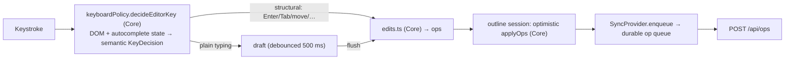

# Frontend: the outline editor (`web/src/outline/`)

This doc covers the outline engine: the per-title sessions that own a block
tree, and the editor that mutates one. [frontend.md](frontend.md) holds the
SPA's module map, views, chrome and the state layers around it. Failures and
their fixes are indexed by symptom in
[troubleshooting.md](../troubleshooting.md).

## Per-title outline sessions

`outline/outlineSessions.ts` is the block tree's home. A module-level
`Map<title, Session>` external store hands every view of a title one
ref-counted session, sharing a flushed tree and a monotonic revision. Exactly
one view holds the **editor lease** and the others render read-only, so the
same page in the main pane and the sidebar cannot double-edit.

The session tracks causality between optimistic writes and authoritative
reads. A fetched payload carries a `ReadToken` and is adopted only if it is
the newest request, the revision is unchanged, and no relevant write ticket is
unsettled. Otherwise it is retained and reconsidered after settlement. The
pure reducer behind it is `outlineState.ts::transitionOutline`.

Two machines the sessions drive sit beside that module rather than in it.
`parentReadElection.ts` decides which surface starts a title's next
full-payload parent read, and what a waiter is told when no read will ever
arrive. `repairEpochs.ts` runs the post-settlement repair pass described in
[sync-and-offline.md](sync-and-offline.md#what-the-queue-and-the-ui-do-with-it).
Each reaches its sessions through one interface — `ParentReadHost`,
`RepairTarget` — so both can be exercised without a session registry.
`outlineSessions.ts` keeps the registry, the editor lease, loader election and
read causality.

### Driving a session from a view

The two single-page surfaces share one implementation of the read lifecycle:
`outline/useOutlinePageLoad.ts`, used by `PageView` and
`EditableSidebarPanel`. The hook owns one outstanding generation per mount,
the parent readiness promise a `"parent"` read publishes through, the
authoritative loader and parent read controller registered on the session, and
the cleanup order at unmount. It returns `{payload, error, reload}`. The two
surfaces differ only in presentation and in where they scroll.

Both must also mount `BlockRefProvider`, not the bare
`BlockRefContext.Provider`, around the content they render from that payload.
`reload("resync")` is how `PageView` answers a `resyncSeq` bump. The sidebar
does not subscribe to resync.

The Journal is the third surface showing editable outlines, and does not use
the hook: it loads many days in one batched `/api/journal` request and
delivers each day's blocks through its own capture-ticket path.

### Loader election

A session also starts reads nobody asked it for: after a write settles, when a
remote cross-page move names a uid it does not hold, and once per session in a
repair epoch. Those go through a loader the surfaces register on it, and
several surfaces of one title are usually mounted at once — a page and its
`EditablePage` child, a journal day and its child. `LOADER_PRECEDENCE`
(`outlineSessions.ts`) picks between them by kind:

| Kind | Registered by | Missing-page policy it applies |
|---|---|---|
| `page` | `useOutlinePageLoad` | the policy its surface was constructed with |
| `day` | `Journal` | `substituteMissingDay` |
| `editable` | `useOutline`, so every mounted `EditablePage` | `substituteMissingDaily` |

The highest kind in that order wins, and the newest registration within a
kind, so a remounted surface replaces its predecessor. Mount order must not
decide which fetch a session performs.

### Missing-page policy

What a *failed* read means is a policy decision rather than something each
surface reimplements. The pure
`outline/missingPage.ts::substituteMissingDaily` turns a 404 on a daily title
into an empty editable page, because a daily nobody has written to yet is not
an error anywhere it is displayed. The server auto-creates only today's daily;
the first edit creates every other one's row. Every other missing page stays
an error. `substituteMissingDay` is the same rule for a title `/api/journal`
already named as a day, where the date check is redundant.

Both the view's own read and its registered loader apply the policy through
`outline/loadOutlineBlocks.ts`, because the loader is what repair epochs and
settlement reads hit.

### Replay

A repair epoch adopts the server's tree and then reapplies every write still
unsettled for that title, so each tracked write carries a **replay**: the
batch's own ops, or the `OutlineReplayAction` metadata captured through
`attachOutlineReplay` by the UI that did the local tree surgery.
Drag-and-drop supplies the moved subtree, which no wire op describes. Two
paths announce a write to a session: `applyLocal` for an edit made here, and
the delivery registry for one whose scope names this title. Both must state
the replay, because a write announced without one loses its edit at the next
repair.

### Applying ops

The block tree is the generated `BlockNode` shape (recursive
`{uid, text, children[], order_idx, heading, collapsed, view_type}`). All
mutations go through the pure `applyOps` (`outline/tree.ts`), which mirrors
the server's op semantics — the same ops drive the screen, the replica, and
the server.

`applyOpsWithChange` is that same application plus a verdict on whether
anything moved: `changed: false` means the returned tree is `blocksEqual` to
the input, and a batch naming no uid this tree holds is skipped before the
clone. Only a batch that changed something advances `transitionOutline`'s
`revision`, which is the field a re-render and a dispatched read's
adoptability key on. A stamp counts as a change, since `update_text` bumps
`updated_at` whether or not the text differs, mirroring the server's
`UpdateText`. A tree that arrives whole — a drag-and-drop result, a server
read — has no ops to ask, so those paths reach the same verdict by comparing
structurally with `blocksEqual`.

## The editor

**Textarea-based, not contenteditable.** Only the focused block is a live,
auto-growing `<textarea>` holding raw markdown; every other block is rendered
HTML (`EditableBlockTree` → `EditableBlock` → `BlockInput`, the last of these
its own file). This is the central performance decision: a 500-block page is
one textarea plus cheap static HTML. Phones get a bottom `Composer`
(append-to-daily-note) instead of full outline editing.

A keystroke batch re-renders every row, so each row's decisions have to be
constant-time. The one that is not naturally: a table macro block shows its
raw editable rows while focus sits anywhere inside it. `EditableBlockTree`
walks `ancestorChain(blocks, focus.uid)` once at the root and passes the set
down as `focusChain`, so the row-level test is a lookup instead of a walk of
that row's own subtree.

A `{{toc}}` block is the one row that must see past its own node: it lists the
page's heading blocks, nested by nearest heading ancestor (`tocEntries`,
Core). `EditableBlockTree` publishes its `blocks` through `RootBlocksContext`
and only `TocBlock` reads it, so no other row's memo is disturbed. Nothing is
stored; the list is re-derived on every render. Entries are router links to
`#<uid>`, consumed by `useScrollFlashTarget` in `PageView` alone, so in the
journal or a sidebar panel they do not scroll. Unlike a table, a toc's
children stay ordinary rows.

Rows with incoming `((uid))` references carry a count badge (`RefCountBadge`,
between the text and the stamp cell). The counts arrive as `block_ref_counts`
on the page/journal payloads and reach the tree as the `refCounts` prop —
PageView and Journal pass it; sidebar panels stay bare, like `stamps`.
Clicking the badge opens `BlockRefBacklinksPopover`, which fetches
`GET /api/block/{uid}/backlinks` at open. The list is live truth while the
badge count is payload-fresh, with no reconciliation between them. The popover
renders through `BacklinkGroupList`, the one renderer for backlink-group
markup, shared with `BacklinksSection` and the `/files` refs popover.
Navigation is read-only-safe, so the badge and popover render in `fallback`
trees too. Chrome, clamping and dismissal come from the shared `Popover`
shell.

### Which way the editor's dependencies point

Everything the UI can ask the editor to do is the `OutlineHandlers` port in
`outline/handlers.ts` — about thirty named callbacks (focus, draft,
split/indent/move, selection, upload, paste, undo). `useOutline` implements
it; `EditableBlockTree`, `EditableBlock` and `BlockInput` only call it. The
port lives in `outline/` rather than in a component, so the engine never
imports a type from UI code.

No component holds block-tree state. The most any of them owns is
`BlockInput`'s *draft* of one block's text, plus the transient popup offsets
around it. `outline/useBlockDraft.ts` tracks the value, its dirty flag, IME
composition, adoption of committed text over a clean draft, and caret
restoration after a programmatic value swap. It also auto-grows the textarea.
CSS `field-sizing: content` does this natively where supported. Elsewhere, a
JS fallback resets the height to `auto` only when
`textareaHeight.ts::mayHaveShrunk` says the content might be shorter, and
writes the measured height only when it changed.

### Rules an edit must not break

| Rule | What breaks without it |
|---|---|
| Anything that mutates a block's text programmatically rides the draft/key-edit path | poking the tree directly leaves the textarea's draft to overwrite the change at the next flush |
| A growing text selection escalates to a block selection at the block's edge, whether the caret is collapsed or a text selection can no longer grow within the block | it falls through to the boundary-arrow block-navigation branch, which drops the selection and jumps focus |
| Every mutating selection branch gates on `!readOnly` — indent/outdent (Tab/Shift-Tab), move (Shift+Cmd+Arrow), delete (Backspace/Delete) | `useOutline`'s handlers do not re-check editability, so this gate is the only one; creating, extending and copying a selection need no gate |
| A gated key resolves to `"none"`, which the shell leaves uncancelled rather than calling `preventDefault` | a read-only Tab stops moving focus out of the tree |
| Authoritative text lands on the tree even for the focused block, while the textarea keeps the local draft | per-block last-write-wins is what keeps the client consistent with the server's model |
| `/upload` gives up the block before it opens the picker: the pick strips the trigger, calls `onBlurBlock`, then clicks the tree-owned file input | the path would depend on the native file dialog blurring the textarea, which is browser behaviour; `onFiles` leaves focus alone on completion so the uploaded asset renders at once |
| `preventDefault` and `dataTransfer.dropEffect` stay synchronous in every `dragover` handler | HTML5 drag-and-drop honours them only inside the handler, so a deferred call leaves the drop refused; both are unconditional, which is sound because `allowedDepths` never returns empty |
| `set_collapsed` must not stamp | `opBumpsUpdatedAt` (`outline/blockStamps.ts`) is the single statement that collapsing is a view toggle rather than a change; `transitionOutline` uses it to choose which uids to stamp, and `replica/localOps.test.ts` asserts the replica's own writes agree op-for-op, so the displayed date and the stored date cannot drift apart |

### Drafts and commit points

Plain typing debounces into a draft (`TEXT_DEBOUNCE_MS` = 500 ms in
`useOutline.ts`). Structural edits, blur, undo, tab-hide, and in-editor
navigation (`onFlushDraft`) flush it first. Drafts are *flush-held* while the
caret sits inside a half-typed `[[ref` or `#tag` token, so autosave cannot
create a page from a partial title.

A flush-held draft has no armed timer, which makes navigation a commit point.
An ordinary debounced draft survives an unmount: nothing cancels the pending
`setTimeout`, so it still fires and flushes after the outline is gone. A held
draft's only exits are the explicit commit points above, and React delivers no
blur for a node it removes. Each navigation trigger needs its own defence:

| Trigger | Defence |
|---|---|
| Navigation the editor never sees: App's global `Ctrl-Shift-D` chord, browser back/forward | `useOutline` flushes on unmount, enqueuing into the durable op queue after the outline's session handle is already released. The effect is unmount-only: the callback is held in a ref, not a dep. Nothing is left to render into, and durability is the queue's job |
| Navigation the editor starts itself: `Ctrl-O`/`Ctrl-Shift-O` over a `[[ref]]` (`ensureRefPageThenOpen`) | Calls `handlers.onFlushDraft()` before `POST /api/pages` and the navigation. The flush is what creates the ref's page row through the normal ops path |

Clicking a rendered ref is unaffected: only unfocused blocks render links, so
reaching one blurs the textarea first. Tab hide, close and reload are covered
by the `visibilitychange` flush.

### Keyboard policy

`decideEditorKey` (a focused block's textarea) and `decideSelectionKey` (a
multi-block selection, keyed by the tree container since there is no textarea)
are pure functions returning a semantic decision that
`EditableBlockTree.onKeyDown` and `BlockInput` execute. All DOM effects stay
in the shell. New shortcuts are added to one of these two functions —
Cmd-letter wraps go in `decideEditorKey`'s `META_WRAP_EDITS` table — never as
ad-hoc event handlers. The full shortcut list is owned by
[keyboard.md](../keyboard.md). App-global chords fire while a block is being
edited, so a new editor key must not collide with one.

### Autocomplete

`outline/useAutocomplete.ts` holds the open completion context and the
highlighted row for both the outline editor's `BlockInput` and the phone
`Composer`, so the popup is shared state. The pure detection and staleness
rules are in `outline/autocomplete.ts`. Which keys the popup may claim is
`keyboardPolicy.autocompleteKeyAction` — unmodified Arrow/Enter/Tab/Escape
only, so Cmd/Ctrl/Shift/Alt chords stay with the platform and the editor.

No action ever uses a remembered caret. Context is detected on input, but
clicks and selection-only caret moves fire no input event. Every action path
(keydown, click, mouse pick) goes through `resolve(textarea)`, which
re-derives the context from the live selection, closes the popup when it no
longer matches, and returns the caret to splice at. A stale popup therefore
claims nothing: Enter stays a split, Tab stays an indent, and a completion
cannot land at the offset the caret has left.

The live caret is `selectionEnd`, both when a key-edit re-detects the context
and inside `resolve`. Wrapping a selection in `[[` keeps the inner text
selected, and that text is the query; `selectionStart` would read as an empty
query. For a collapsed caret the two offsets are the same.

`resolve` must not be called from `keyup`. Both editors place the caret after
a key-edit inside a `requestAnimationFrame`, and keyup always lands inside
that window, where every context looks stale.

### Paste

Plain Cmd-V is always left native: it inserts text into the textarea and
nothing else. `Shift-Cmd-V` *arms* an outline paste. `paste.ts` (Core) parses
the clipboard into a forest by comparing indent widths ordinally with a stack
— 2-space, 4-space and tab clipboards all work unconfigured — and plans the
whole splice as one op batch.

The arm exists because `ClipboardEvent` carries no modifier state. The chord
is recorded in a ref on keydown, without `preventDefault`, or the browser's
own paste would never fire. The next `paste` event consumes it, and also
requires the clipboard to have structure. One arm serves exactly one paste.

### Slash commands

Slash commands dispatch to block-type, heading and query constructors; the
full command list is in [keyboard.md](../keyboard.md#slash-commands). `/date`
opens `DatePickerPopup` over the month grid computed by the pure
`outline/calendar.ts` (Monday-first, whole weeks, adjacent-month days marked).
Command labels are lowercase by convention, and
`help/slashCommandsDocumented.test.ts` fails if a new command isn't documented
there. `/upload`'s blur ordering is a rule of its own, above.

### The bullet and the block menu

The `.bullet` span in `EditableBlockTree` is the block menu's only keyboard
route. It carries `role="button"`, `tabIndex={0}`,
`aria-label="Open block menu"`, `aria-haspopup`, `aria-expanded`, and an
`onKeyDown` for Enter / Space / ContextMenu / Shift-F10 alongside its click,
contextmenu and drag handlers. Every `onOpenMenu` call site is on that span,
and `keyboardPolicy` has no menu shortcut, so removing its tab stop removes
keyboard access to Copy block reference and the view modes entirely. Its focus
styling is constrained too — see
[styling.md](styling.md#focus-and-interactive-affordances).

In `EditableBlockTree` fallback mode (`fallback=true`), bullets are inert
spans with no role, tab stop, menu, focus, upload, selection or drag handlers,
and chevrons are disabled. The same renderer therefore displays the live
shared outline without a second editing implementation.

### Drag and drop

`useDropZone` coalesces `dragover`, running the boundary and indicator
geometry at most once per animation frame and measuring each candidate row's
rectangle at most once per drag. Each cached rect is kept against its row's
uid and re-measured when that index comes to mean a different row, because
rows move under a drag. `cacheIsUsable` (`dnd/dropGeometry.ts`, Core) states
when a cache may be reused at all. A scroll throws the cache away rather than
shifting it, because the cached tops are viewport-relative like the `clientY`
they are compared against. A drop resolves the last *processed* candidate
rather than the drop event's own coordinates, so a block lands where the
indicator line was drawn.

## Journal day references

Journal days render their own linked references inline
(`JournalDayReferences`), hidden when a day has none. This reuses
`BacklinksSection` rather than adding a second renderer. The references arrive
with the day, in `/api/journal`'s payload. Paging past the preview is still a
page read, but that is a click rather than a scroll.

A day already on screen keeps the reference list it first rendered:
`BacklinksSection` snapshots `initial` into state, and a resync replaces the
day objects in place under stable keys, so a day's new references appear on
the next mount rather than in the running scroll. The "day has none" gate is
live, since `JournalDayReferences` re-reads `total_pages` on every render.

Nothing unmounts a loaded day: no virtualisation, no eviction. Whatever a day
costs — a mounted outline, a `useDismiss` listener, a paint — is paid for the
life of the session (perf scenarios `I` and `J`).
