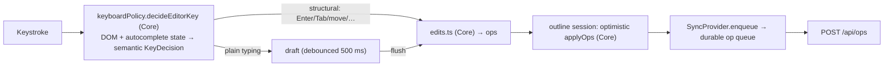

# Frontend: the outline editor (`web/src/outline/`)

This doc covers the outline engine: the per-title sessions that own a block
tree, and the editor that mutates one. [frontend.md](frontend.md) holds the
SPA's module map, views, chrome and the state layers around it. Failures and
their fixes are indexed by symptom in
[troubleshooting.md](../troubleshooting.md).

## Per-title outline sessions

`outline/outlineSessions.ts` is the block tree's home. A module-level
`Map<title, Session>` external store hands every view of a title one
ref-counted session, sharing a flushed tree and a monotonic revision. One view
holds the **editor lease** and the others render read-only, so the same page in
the main pane and the sidebar cannot double-edit.

The session also tracks causality between optimistic writes and authoritative
reads: a fetched payload carries a `ReadToken` and is adopted only if it is the
newest request, the revision is unchanged, and no relevant write ticket is
unsettled. The pure reducer is `outlineState.ts::transitionOutline`.

Two machines sit beside that module, each reaching its sessions through one
interface so it can be exercised without a session registry.
`parentReadElection.ts` (`ParentReadHost`) elects the surface that starts a
title's next full-payload parent read. `repairEpochs.ts` (`RepairTarget`) runs
the post-settlement repair pass described in
[sync-and-offline.md](sync-and-offline.md#what-the-queue-and-the-ui-do-with-it).

### Driving a session from a view

`outline/useOutlinePageLoad.ts` is the one read lifecycle for both single-page
surfaces, `PageView` and `EditableSidebarPanel`. It owns the outstanding
generation per mount, the parent readiness promise a `"parent"` read publishes
through, the loader and parent read controller registered on the session, and
the unmount cleanup order, and returns `{payload, error, reload}`. Both
surfaces must wrap their content in `BlockRefProvider`, not the bare
`BlockRefContext.Provider`. `PageView` answers a `resyncSeq` bump with
`reload("resync")`; the sidebar does not subscribe to resync.

The Journal is the third editable surface and bypasses the hook: it loads many
days in one batched `/api/journal` request and delivers each day's blocks
through its own capture-ticket path.

### Loader election

A session also starts reads nobody asked it for: after a write settles, when a
remote cross-page move names a uid it does not hold, and once per session in a
repair epoch. Several surfaces of one title are usually mounted at once, so
`LOADER_PRECEDENCE` (`outlineSessions.ts`) ranks the loaders they register. The
highest kind wins, and the newest registration within a kind; mount order must
not decide which fetch a session performs.

| Kind | Registered by | Missing-page policy it applies |
|---|---|---|
| `page` | `useOutlinePageLoad` | the policy its surface was constructed with |
| `day` | `Journal` | `substituteMissingDay` |
| `editable` | `useOutline`, so every mounted `EditablePage` | `substituteMissingDaily` |

### Missing-page policy

The pure `outline/missingPage.ts::substituteMissingDaily` turns a 404 on a
daily title into an empty editable page, since the server auto-creates only
today's daily and the first edit creates every other one's row.
`substituteMissingDay` is the same rule for a title `/api/journal` has already
named as a day. Every other missing page stays an error. A view's own read and
its registered loader both apply the policy through
`outline/loadOutlineBlocks.ts`.

### Replay

A repair epoch adopts the server's tree and reapplies every write still
unsettled for that title, so each tracked write carries a **replay**: the
batch's own ops, or the `OutlineReplayAction` metadata captured through
`attachOutlineReplay` by the UI that did the local tree surgery. Drag-and-drop
supplies the moved subtree, which no wire op describes. Both paths that
announce a write to a session, `applyLocal` and the delivery registry, must
state the replay, or the write loses its edit at the next repair.

### Applying ops

The block tree is the generated `BlockNode` shape (recursive
`{uid, text, children[], order_idx, heading, collapsed, view_type}`). All
mutations go through the pure `applyOps` (`outline/tree.ts`), which mirrors the
server's op semantics; the same ops drive the screen, the replica and the
server.

`applyOpsWithChange` adds a verdict: `changed: false` means the result is
`blocksEqual` to the input, and only a changed batch advances
`transitionOutline`'s `revision`, the key a re-render and a dispatched read's
adoptability use. A stamp counts as a change, since `update_text` bumps
`updated_at` whether or not the text differs, mirroring the server's
`UpdateText`.

## The editor

**Only the focused block is editable.** It is a live, auto-growing `<textarea>`
holding raw markdown; every other block is rendered HTML (`EditableBlockTree` →
`EditableBlock` → `BlockInput`, the last of these its own file). No
`contenteditable` anywhere, so a 500-block page is one textarea plus static
HTML. Phones get a bottom `Composer` (append-to-daily-note) instead of full
outline editing.

A keystroke batch re-renders every row, so a row's decisions must be
constant-time. `EditableBlockTree` walks `ancestorChain(blocks, focus.uid)`
once at the root and passes `focusChain` down, so a table macro block tests
whether focus sits inside it with a lookup rather than a subtree walk.

A `{{toc}}` block (`tocEntries`, Core) is the one row that must see past its
own node. `EditableBlockTree` publishes its `blocks` through
`RootBlocksContext` and only `TocBlock` reads it, so no other row's memo is
disturbed. Entries link to `#<uid>`, which only `useScrollFlashTarget` in
`PageView` consumes.

Rows with incoming `((uid))` references carry `RefCountBadge` between the text
and the stamp cell, fed by `block_ref_counts` on the page/journal payloads
through the `refCounts` prop; sidebar panels stay bare, like `stamps`. The
badge opens `BlockRefBacklinksPopover`
([frontend.md](frontend.md#popovers-and-menus)), which fetches
`GET /api/block/{uid}/backlinks` at open, so the list is live truth while the
count is payload-fresh. It renders through `BacklinkGroupList`. Badge and
popover are read-only-safe, so both render in `fallback` trees.

### Which way the editor's dependencies point

Everything the UI can ask the editor to do is the `OutlineHandlers` port in
`outline/handlers.ts` — about thirty named callbacks (focus, draft,
split/indent/move, selection, upload, paste, undo). `useOutline` implements it;
`EditableBlockTree`, `EditableBlock` and `BlockInput` only call it. The port
lives in `outline/`, so the engine never imports a type from UI code.

No component holds block-tree state. The most any owns is `BlockInput`'s draft
of one block's text, which `outline/useBlockDraft.ts` tracks along with IME
composition and caret restoration. It also auto-grows the textarea: CSS
`field-sizing: content` where supported, otherwise a JS fallback that resets
the height to `auto` only when `textareaHeight.ts::mayHaveShrunk` says the
content might be shorter.

### Rules an edit must not break

| Rule | What breaks without it |
|---|---|
| Anything that mutates a block's text programmatically rides the draft/key-edit path | the textarea's draft overwrites a tree-direct change at the next flush |
| A growing text selection escalates to a block selection at the block's edge, whether the caret is collapsed or the text selection can no longer grow | it falls through to boundary-arrow block navigation, which drops the selection and jumps focus |
| Every mutating selection branch gates on `!readOnly` — indent/outdent (Tab/Shift-Tab), move (Shift+Cmd+Arrow), delete (Backspace/Delete) | `useOutline`'s handlers do not re-check editability, so this is the only gate; creating, extending and copying a selection need none |
| A gated key resolves to `"none"`, which the shell leaves uncancelled rather than calling `preventDefault` | a read-only Tab stops moving focus out of the tree |
| Authoritative text lands on the tree even for the focused block, while the textarea keeps the local draft | per-block last-write-wins is what keeps the client consistent with the server's model |
| `/upload` gives up the block before opening the picker: the pick strips the trigger, calls `onBlurBlock`, then clicks the tree-owned file input | otherwise the blur depends on the native file dialog; `onFiles` leaves focus alone on completion, so the uploaded asset renders at once |
| `preventDefault` and `dataTransfer.dropEffect` stay synchronous in every `dragover` handler | HTML5 drag-and-drop honours them only inside the handler, so a deferred call leaves the drop refused; both are unconditional, which `allowedDepths` never returning empty makes sound |
| `set_collapsed` must not stamp | `opBumpsUpdatedAt` (`outline/blockStamps.ts`) is the single statement that collapsing is a view toggle; `transitionOutline` uses it to choose which uids to stamp, and `replica/localOps.test.ts` pins the replica to it |

### Drafts and commit points

Plain typing debounces into a draft (`TEXT_DEBOUNCE_MS` = 500 ms in
`useOutline.ts`); structural edits, blur, undo, tab-hide and in-editor
navigation (`onFlushDraft`) flush it first. A draft is flush-held while the
caret sits inside a half-typed `[[ref` or `#tag` token, so autosave cannot
create a page from a partial title.

A debounced draft survives an unmount, because nothing cancels the pending
`setTimeout`. A held draft has no armed timer, and React delivers no blur for a
node it removes, so each navigation trigger needs its own defence:

| Trigger | Defence |
|---|---|
| Navigation the editor never sees: App's global `Ctrl-Shift-D` chord, browser back/forward | `useOutline` flushes on unmount, enqueuing into the durable op queue after the session handle is released. The effect is unmount-only: the callback is held in a ref, not a dep |
| Navigation the editor starts itself: `Ctrl-O`/`Ctrl-Shift-O` over a `[[ref]]` (`ensureRefPageThenOpen`) | calls `handlers.onFlushDraft()` before `POST /api/pages` and the navigation; the flush is what creates the ref's page row through the normal ops path |

Clicking a rendered ref is unaffected: only unfocused blocks render links, so
reaching one blurs the textarea first. Tab hide, close and reload are covered
by the `visibilitychange` flush.

### Keyboard policy

`decideEditorKey` (a focused block's textarea) and `decideSelectionKey` (a
multi-block selection, keyed by the tree container since there is no textarea)
are pure functions returning a semantic decision that
`EditableBlockTree.onKeyDown` and `BlockInput` execute; all DOM effects stay in
the shell. New shortcuts go into one of those two functions, Cmd-letter wraps
into `decideEditorKey`'s `META_WRAP_EDITS` table, never into ad-hoc event
handlers. [keyboard.md](../keyboard.md) owns the shortcut list. App-global
chords fire while a block is being edited, so a new editor key must not collide
with one.

### Autocomplete

`outline/useAutocomplete.ts` holds the open completion context and the
highlighted row for both `BlockInput` and the phone `Composer`, so the popup is
shared state; the pure detection and staleness rules are
`outline/autocomplete.ts`. `keyboardPolicy.autocompleteKeyAction` decides which
keys the popup may claim: unmodified Arrow/Enter/Tab/Escape only, so
Cmd/Ctrl/Shift/Alt chords stay with the platform and the editor.

No action ever uses a remembered caret. Clicks and selection-only caret moves
fire no input event, so every action path goes through `resolve(textarea)`,
which re-derives the context from the live selection and returns the caret to
splice at. The live caret is `selectionEnd`, since `[[` wrapped around a
selection leaves the query selected and `selectionStart` would read it as
empty. `resolve` must not be called from `keyup`, which lands inside the
`requestAnimationFrame` both editors place the caret in, where every context
looks stale.

### Paste

Plain Cmd-V is left native. `Shift-Cmd-V` arms an outline paste, which
`paste.ts` (Core) plans as one op batch, parsing the clipboard into a forest by
comparing indent widths ordinally with a stack. 2-space, 4-space and tab
clipboards all work unconfigured.

The arm exists because `ClipboardEvent` carries no modifier state. The chord is
recorded in a ref on keydown without `preventDefault`, or the browser's own
paste would never fire. The next `paste` event consumes it, and serves one
paste.

### Slash commands

Slash commands dispatch to block-type, heading and query constructors;
[keyboard.md](../keyboard.md#slash-commands) has the list. `/date` opens
`DatePickerPopup` over the month grid computed by the pure
`outline/calendar.ts`. Labels are lowercase by convention, and
`help/slashCommandsDocumented.test.ts` fails if a new command isn't documented
there. `/upload`'s blur ordering is a rule of its own, above. `/goodlinks`
follows `/upload`'s blur-first shape and hands off to
`useOutline.onGoodlinks`; see [goodlinks.md](goodlinks.md).

### The bullet and the block menu

The `.bullet` span in `EditableBlockTree` is the block menu's only keyboard
route. It carries `role="button"`, `tabIndex={0}`,
`aria-label="Open block menu"`, `aria-haspopup`, `aria-expanded` and an
`onKeyDown` for Enter / Space / ContextMenu / Shift-F10. Every `onOpenMenu`
call site is on that span and `keyboardPolicy` has no menu shortcut, so
removing its tab stop removes keyboard access to Copy block reference and the
view modes. Its focus styling is constrained too — see
[styling.md](styling.md#focus-and-interactive-affordances).

With `fallback=true`, bullets are inert spans with no role, tab stop, menu,
focus, upload, selection or drag handlers, and chevrons are disabled, so one
renderer serves the live shared outline too.

### Drag and drop

`useDropZone` coalesces `dragover` into one geometry pass per animation frame
and measures each candidate row's rectangle at most once per drag. Rows move
under a drag, so `cacheIsUsable` (`dnd/dropGeometry.ts`, Core) states when a
cached rect may be reused: it is keyed by row uid, and a scroll discards the
cache rather than shifting it, since cached tops are viewport-relative like the
`clientY` they are compared against. A drop resolves the last processed
candidate rather than the drop event's own coordinates, so a block lands where
the indicator line was drawn.

## Journal day references

Journal days render their linked references inline (`JournalDayReferences`,
reusing `BacklinksSection`), hidden when a day has none. They arrive with the
day in `/api/journal`'s payload; paging past the preview is a page read, but
that is a click rather than a scroll.

A day already on screen keeps the list it first rendered, because
`BacklinksSection` snapshots `initial` into state and a resync replaces the day
objects in place under stable keys. The "day has none" gate is live, since
`JournalDayReferences` re-reads `total_pages` on every render.

Nothing unmounts a loaded day: no virtualisation, no eviction. A mounted
outline, its `useDismiss` listener and its paint are paid for the life of the
session (perf scenarios `I` and `J`).
