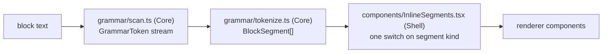

# Rendering pipeline (read path)

Block text is raw Roam-flavoured markdown; this doc follows it to the DOM. The
SPA's modules, routes, state layers and API layer are in
[frontend.md](frontend.md), and the editor that produces the text is in
[frontend-editor.md](frontend-editor.md). Failures are indexed by symptom in
[troubleshooting.md](../troubleshooting.md).

## The pipeline

`scan.ts` is the single grammar authority on the client for `[[...]]` pairs,
fences, inline code and TODO markers. Ref extraction (`grammar/refs.ts`,
`replica/refs.ts`), caret lookup (`outline/refAtCaret.ts`), TODO toggling and
slash commands adapt its token stream rather than scanning privately.
`shared/fixtures/ref_grammar.json` pins it to the Python parser in
`server/src/pkm/refs.py`; both sides' tests replay the fixture.

`tokenize.ts` adds the grammar the scanner does not model: markdown links and
images, bare-URL autolinking (including bare `/assets/<sha256>/`), emphasis,
`{{query}}` and `{{pdf}}` macros, `$$` math, and line breaks.

## Segment dispatch

`InlineSegments.tsx`'s `Segment` is one switch over a `BlockSegment`'s `kind`,
and the only place a segment becomes a component.

| Segment kind | Renders as |
|---|---|
| `text`, `linebreak`, `inline-code` | the text, ` `, `<code class="inline-code">` |
| `bold` / `italic` / `strike` / `highlight` | `<strong>` / `<em>` / `<s>` / `<mark>` around a nested `InlineSegments` |
| `page-ref` | `PageLink`; `attribute` wraps the same link in `span.attribute` |
| `block-ref` | `BlockRef` |
| `image` | `AssetImage` |
| `asset-link` | `AssetLink` |
| `math` | `MathSpan` |
| `code-block` | `MermaidDiagram` when `lang` is `mermaid`, else `CodeBlock` |
| `query` | `QueryBlock` |
| `todo` | `TodoCheckbox` |
| `pdf-embed`, `link` | `GoodlinksLink` when `isGoodlinksHref` (see [goodlinks.md](goodlinks.md)); else `PdfEmbed` when `isPdfHref`; else `BlueskyEmbed` for a Bluesky post URL; else an `<a target="_blank">` when `isSafeHref`; else plain text |

A `depth` prop rides the recursive cases: `BlockRef` renders the raw `((uid))`
at its `MAX_DEPTH` of 3, and `QueryBlock` stops at 2.

`EditableBlockTree` resolves two block-level shapes before this dispatch:
`{{toc}}` through `TocBlock` (`isTocMacro`, `tocEntries.ts`) and a table macro
through `roamTableRows`. Both render only while the row is unfocused, since
focus turns a block back into its source text.

## Lazy renderers and their caches

KaTeX, beautiful-mermaid, stock mermaid, pdf.js and highlight.js each load
behind a cached module-level `import()` promise, so Vite emits each as its own
chunk. A rejected promise is cleared, so one failed fetch cannot wedge every
later render. The service worker precaches every emitted `.js`/`.mjs`
(`globPatterns` in `vite.config.ts`), so lazy chunks resolve offline.

| Cache | Keyed on | Module | Limit |
|---|---|---|---|
| tokenized segments | raw block text | `tokenizeBlock` (`grammar/tokenize.ts`) | `TOKENIZE_CACHE_LIMIT` |
| highlighted HTML | `(lang, code)` | `cachedHighlight` (`CodeBlock.tsx`) | `HIGHLIGHT_CACHE_LIMIT` |
| rendered SVG | `(effectiveTheme, code)` | `MermaidDiagram.tsx` | `MERMAID_CACHE_LIMIT` |
| rendered HTML | `(display, tex)` | `MathSpan.tsx` | `MATH_CACHE_LIMIT` |

Each is a `Map` cleared in full at its limit (2000) rather than evicted
LRU-style; `renderCache.ts`'s `createBoundedCache` is that shape. `CodeBlock`'s
is two-level (lang to code to HTML), since no printable character is a safe
delimiter inside `code`. The mermaid and math caches are read before the dynamic
import, and only successful renders are cached.

Highlighted HTML, KaTeX HTML and mermaid SVG reach the DOM through
`dangerouslySetInnerHTML`; all three are library output, never raw block text.

## Resolving `((uid))` texts

A `((uid))` reaches its text through two channels, and `useBlockRefText` is the
one way to read either.

| Channel | Source | Carrier | Wakes |
|---|---|---|---|
| payload | a page or journal payload's `block_ref_texts`, plus a nested `BacklinksSection`'s overlay | `BlockRefContext` | every consumer, when a payload changes |
| fetched | `BlockRefProvider`'s on-demand `GET /api/block-refs` | `blockRefStore.ts` | only the uids a batch resolved |

The payload wins where both have the uid. The store is a uid-keyed `Map` with
per-uid listener sets read through `useSyncExternalStore`, so a resolved batch
wakes only its own refs. Requests from one render pass batch into a single call,
chunked at the server's 50-uid cap. `claimRequest` is the fetch-once guard, and
retains claims only for uids the server could not resolve.

## Mermaid

Diagrams render through beautiful-mermaid first (ELK layout; the chunk is named
by the `beautifulMermaid.ts` re-export barrel), falling back silently to stock
mermaid on any failure. That fallback must stay: it carries gantt, pie, mindmap
and the other families beautiful-mermaid lacks. Both failing gives the
raw-source error block. `mermaidTheme.ts` maps the design tokens onto both
theming surfaces (`beautifulMermaidOptions`, base-theme `themeVariables`);
beautiful-mermaid re-renders on a theme flip (`useEffectiveTheme`), the stock
fallback keeps its initialize-time snapshot. Every render goes out with its
instance's own id, and only the cached copy is normalised to
`MERMAID_CACHE_RENDER_ID`, which `withRenderId` swaps back on every read.

## PDF embeds and the viewer

`InlineSegments.isPdfHref` decides which links become the in-app `PdfEmbed`.

| `.pdf` href | Renders as |
|---|---|
| under `/assets/`, no query string | inline `PdfEmbed`, auto-loading |
| under `/api/local/`, no query string | deferred `PdfEmbed` (`isDeferredPdfHref`): a link plus an Open button, importing and fetching nothing until clicked |
| any, with a query string | a plain link; the query signals a download intent |

Deferral keeps a page of `Local copy::` papers from parsing dozens of PDFs on
render and pulling each one from iCloud on the host. A 503 from a file the host
has not pulled becomes "Not downloaded on the host." through
`pdfViewerCore.failureNote`.

`PdfViewer` guards its load/reset race with a generation counter: a new `href`
resets `doc`, `failure`, `expanded` and `currentPage` and bumps the counter
synchronously during render, and every load callback checks its captured
generation before writing state. A reset effect would be too late, since a
`Document` child can call `onLoadSuccess` first. The viewer mounts only pages
the intersection observer reports near the viewport plus `MOUNT_RADIUS` either
side (`mountedPageWindow`). An unmounted page keeps its `rendered` entry
(`retainPages`) and a `placeholderHeight` slot, since a zero-height slot would
collapse the scrollbar. The inline `.pdf-frame` is layout-contained, a rule
[styling.md](styling.md) owns, so nothing `position: fixed` may render inside
it; the fullscreen overlay portals to `document.body`.

GoodLinks copies take a different route: an `<iframe sandbox>` reader,
described in [goodlinks.md](goodlinks.md).

## Link safety and lazy loading

`isSafeHref` admits `http(s):`, `mailto:` and single-slash site-relative hrefs
only. It rejects control characters outright, since browsers strip tab, CR and
LF before parsing a URL. A second leading `/` or `\` is rejected too, blocking
protocol-relative escapes. Stock mermaid runs in `securityLevel` strict.

`AssetImage`, the `/files` grid and `BlueskyEmbed`'s cross-origin iframe all
carry `loading="lazy"`; without it a page of Bluesky embeds opens one scripted
document per embed on mount. `BlueskyEmbed` sizes itself from the embed page's
`postMessage`.
