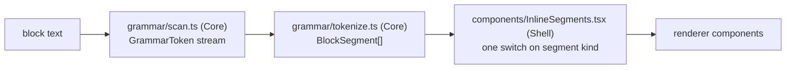

# Rendering pipeline (read path)

Block text is raw Roam-flavoured markdown. This doc follows it to the DOM:
the scanner, the tokenizer, the component dispatch, the lazy renderers and
their caches, `((uid))` resolution, mermaid and PDF. The SPA's modules,
routes, state layers and API layer are in [frontend.md](frontend.md); the
editor that produces the text is in
[frontend-editor.md](frontend-editor.md). Failures and their fixes are
indexed by symptom in [troubleshooting.md](../troubleshooting.md).

## The pipeline

Two pure stages feed a component dispatcher:

`scan.ts` is the single grammar authority on the client. It matches
`[[...]]` pairs with an explicit stack, and blanks fences and inline code
before any reference or TODO recognition. `tokenize.ts`, ref extraction
(`grammar/refs.ts`, `replica/refs.ts`), caret lookup
(`outline/refAtCaret.ts`), TODO toggling and slash commands are thin
adapters over that one token stream rather than private scans. It is pinned
to the Python parser in `server/src/pkm/refs.py` by
`shared/fixtures/ref_grammar.json`, which both sides' tests replay.

`tokenize.ts` adds only the grammar the scanner does not model: markdown
links and images, bare-URL autolinking (including bare `/assets/<sha256>/`
URLs), emphasis, `{{query}}` and `{{pdf}}` macros, `$$` math, and line
breaks.

## Segment dispatch

`InlineSegments.tsx`'s `Segment` is one switch over a `BlockSegment`'s
`kind`, and the only place a segment becomes a component.

| Segment kind | Renders as |
|---|---|
| `text`, `linebreak`, `inline-code` | the text, ` `, `<code class="inline-code">` |
| `bold` / `italic` / `strike` / `highlight` | `<strong>` / `<em>` / `<s>` / `<mark>` around a nested `InlineSegments` |
| `page-ref` | `PageLink`; `attribute` wraps the same link in `span.attribute` |
| `block-ref` | `BlockRef` |
| `image` | `AssetImage` |
| `asset-link` | `AssetLink` |
| `math` | `MathSpan` |
| `code-block` | `MermaidDiagram` when `lang` is `mermaid`, else `CodeBlock` |
| `query` | `QueryBlock` |
| `todo` | `TodoCheckbox` |
| `pdf-embed`, `link` | `PdfEmbed` when `isPdfHref`; else `BlueskyEmbed` for a Bluesky post URL; else an `<a target="_blank">` when `isSafeHref`; else plain text |

A `depth` prop rides through the recursive cases. `BlockRef` renders the
raw `((uid))` once `depth` reaches its `MAX_DEPTH` of 3, and `QueryBlock`
stops at 2, so mutually-embedded blocks and a self-matching query cannot
recurse forever.

Two block-level shapes are resolved before this dispatch sees them.
`EditableBlockTree` renders a `{{toc}}` block through `TocBlock`
(`isTocMacro`, `tocEntries.ts`) and a table macro through `roamTableRows`.
Both render only while the row is not focused, since focusing a block turns
it back into its source text. A toc stores nothing: `tocEntries` walks the
live tree on every render, so a heading edit shows up in the list at once.

## Lazy renderers and their caches

KaTeX, beautiful-mermaid, stock mermaid, pdf.js and highlight.js each load
behind a cached module-level `import()` promise, so Vite splits them into
chunks a page without that syntax never fetches. A rejected promise is
cleared, so one failed chunk fetch cannot wedge every later render. The
service worker precaches every emitted `.js`/`.mjs` (`globPatterns` in
`vite.config.ts`), so the lazy chunks still resolve offline.

| Cache | Keyed on | Module | Limit |
|---|---|---|---|
| tokenized segments | raw block text | `tokenizeBlock` (`grammar/tokenize.ts`) | `TOKENIZE_CACHE_LIMIT` |
| highlighted HTML | `(lang, code)` | `cachedHighlight` (`CodeBlock.tsx`) | `HIGHLIGHT_CACHE_LIMIT` |
| rendered SVG | `(effectiveTheme, code)` | `MermaidDiagram.tsx` | `MERMAID_CACHE_LIMIT` |
| rendered HTML | `(display, tex)` | `MathSpan.tsx` | `MATH_CACHE_LIMIT` |

Each holds a `Map` cleared in full at its limit (2000) rather than evicting
LRU-style; `renderCache.ts`'s `createBoundedCache` is that shape for the two
newest callers. The mermaid and math caches are consulted before the
renderer's dynamic import is called. A remount of a diagram or expression
already seen, navigating away and back, resolves without awaiting a chunk.
Only successful renders are cached, so a chunk-load blip is retried on the
next mount instead of wedged in place.

`CodeBlock`'s cache is a two-level `Map` (lang to code to HTML). A joined
key would need a delimiter that can never appear in `code`, and no printable
character qualifies.

Highlighted HTML, KaTeX HTML and mermaid SVG all reach the DOM through
`dangerouslySetInnerHTML`. Each is library-generated markup; raw block text
never crosses that boundary.

## Resolving `((uid))` texts

A `((uid))` reaches its text through two channels, and `useBlockRefText` is
the one way to read either.

| Channel | Source | Carrier | Wakes |
|---|---|---|---|
| payload | a page or journal payload's `block_ref_texts`, plus a nested `BacklinksSection`'s overlay | `BlockRefContext` | every consumer, when a payload changes |
| fetched | `BlockRefProvider`'s on-demand `GET /api/block-refs` | `blockRefStore.ts` | only the uids a batch resolved |

The payload wins where both have the uid. The store is a uid-keyed `Map`
with per-uid listener sets, read through `useSyncExternalStore`, so a
resolved batch re-renders the refs it resolved rather than every `((uid))`
on the page. Requests made in one render pass are batched into a single
call, chunked at the server's 50-uid cap. `claimRequest` is the fetch-once
guard, and it retains claims only for uids the server could not resolve,
since a ref holding a text stops asking.

## Mermaid

Diagrams render through beautiful-mermaid first (ELK layout; the chunk is
named by the `beautifulMermaid.ts` re-export barrel). Any render failure
falls back silently to stock mermaid. That fallback keeps gantt, pie,
mindmap and the other families beautiful-mermaid lacks working, so the
second renderer must stay. Both failing gives the raw-source error block.

`mermaidTheme.ts` maps the design tokens onto each renderer's theming
surface (`beautifulMermaidOptions` and base-theme `themeVariables`). The
beautiful-mermaid path re-resolves tokens and re-renders on a theme flip
(`useEffectiveTheme`); the stock fallback keeps its initialize-time
snapshot.

Every render goes out with that instance's own render id. Only the copy
that is cached is normalised to the fixed `MERMAID_CACHE_RENDER_ID`, and
`withRenderId` substitutes the instance's real id back on every read from
state, hit or miss alike.

## PDF embeds and the viewer

`InlineSegments.isPdfHref` decides which links get the in-app `PdfEmbed`
instead of a plain link: a path with no query string, under `/assets/` or
`/api/local/`, ending in `.pdf`. A query string signals a download intent.

Local documents (`/api/local/`) get the embed in its **deferred** form, per
`isDeferredPdfHref`: the plain link plus an Open button, importing and
fetching nothing until clicked. A page listing dozens of `Local copy::`
papers would otherwise download and parse every one on render, and trigger
an iCloud download on the host for each evicted file. Uploaded `/assets/`
PDFs keep the inline auto-load. A local document the host has not yet
pulled from iCloud fails with a 503, which `pdfViewerCore.failureNote`
turns into "Not downloaded on the host." instead of the generic message.

`PdfViewer` guards its load/reset race with a generation counter. A new
`href` resets `doc`, `failure`, `expanded` and `currentPage` and bumps the
counter synchronously during render, and every load callback compares its
captured generation before writing state. An effect would be too late:
effects fire child-before-parent, so a `Document` child that resolves
synchronously can call `onLoadSuccess` before the parent's reset effect
runs.

The inline `.pdf-frame` is layout-contained, a rule
[styling.md](styling.md) owns. Nothing `position: fixed` may render inside
the frame; the fullscreen overlay portals to `document.body`.

`PdfViewer` mounts a window of pages rather than a growing set: the
intersection observer's near-the-viewport pages plus `MOUNT_RADIUS` either
side (`mountedPageWindow`), so scrolling a long document end to end does
not hold every rasterized canvas at once. An unmounted page leaves
`rendered` too (`retainPages`), and its slot falls back to a
`placeholderHeight` estimate; a zero-height slot would collapse the
scrollbar. The observer accumulates near-ness in a ref, because a callback
carries only the pages whose intersection changed, and an empty near set
reads as "no callback yet" rather than as a scroll position.

## Link safety and lazy loading

`isSafeHref` admits `http(s):`, `mailto:` and single-slash site-relative
hrefs only. It rejects control characters outright: browsers strip tab, CR
and LF before parsing a URL, which defeats a prefix check. A second leading
`/` or `\` is rejected too, blocking protocol-relative escapes.
Stock mermaid additionally runs in `securityLevel` strict.

Every remote element inline content can emit carries `loading="lazy"`:
`AssetImage`, the `/files` grid, and `BlueskyEmbed`'s cross-origin iframe.
A page of Bluesky embeds would otherwise open one document per embed on
mount, each running the embed page's own scripts. `BlueskyEmbed` still
learns its height from the embed page's `postMessage` once the iframe does
load.
