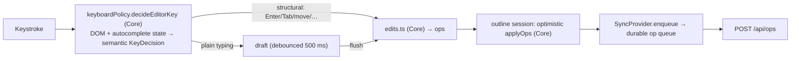
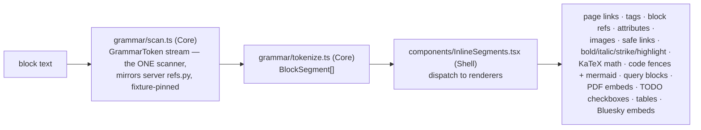

# Frontend architecture (web/)

The frontend is a React 18 + Vite single-page app: an offline-capable,
real-time-synced Roam-style outliner. Two things shape almost every file:

1. **FCIS is machine-enforced.** Every runtime module declares
   `// pattern: Functional Core` or `// pattern: Imperative Shell`;
   `pnpm check:fcis` (`web/tooling/fcis.mjs`) fails if a Core module imports
   a Shell. Most subsystems are a pure state machine ("core") plus a thin
   React/worker/fetch "shell" that gathers inputs, dispatches, and runs the
   returned effects.
2. **The server is the source of truth for shapes.** API types are generated
   from the server's OpenAPI schema, the replica schema is generated from
   the server's DDL, and the Roam-markdown grammar is pinned to the Python
   parser by shared fixtures.

See [overview.md](overview.md) for the system picture and
[sync-and-offline.md](sync-and-offline.md) for the sync engine and replica in
depth — this doc covers them only from the UI side.

## Tech stack

| Concern | Choice |
|---|---|
| UI | React 18.3, react-router-dom 6.30 (v7 future flags), TypeScript 5.9 |
| Build | Vite 6, `vite-plugin-pwa` (Workbox service worker), pnpm (overrides in `pnpm-workspace.yaml` — pnpm 11 ignores `package.json` overrides) |
| Offline | `@sqlite.org/sqlite-wasm` (replica in a Web Worker on the OPFS SAHPool VFS) |
| Rendering extras (all lazy-loaded) | KaTeX (math), Mermaid (diagrams), react-pdf/pdf.js (PDF viewer), highlight.js (code) |
| Tests | Vitest + jsdom (enforced coverage), Playwright e2e, Testing Library, type-aware ESLint |
| API types | `openapi-typescript` via `pnpm gen-types` |

## Module map (`web/src/`)

```
main.tsx / App.tsx     Shell   Entry + top-level tree: SyncProvider > DndProvider >
                               SidebarContext > (left nav, TopBar, routes, sidebar stack)
api/                   client.ts (fetch wrapper + offline gateway), generated
                       openapi.json + types.d.ts, type-only re-exports (ops.ts, payloads.ts)
views/                 Journal (daily notes, `/`), PageView (`/page/*`),
                       CurrentWork (`/current-work`); EditablePage = one editable
                       outline, reused by main pane and sidebar panels
outline/               The editor engine.
                       Cores: outlineState.ts (the reducer), keyboardPolicy.ts,
                       edits.ts, tree.ts (applyOps — mirrors server ops_apply),
                       keyEdits.ts, slashCommands.ts, autocomplete.ts,
                       refAtCaret.ts, blockSelection.ts, history.ts
                       Shells: useOutline.ts (the hook), outlineSessions.ts
                       (per-title shared store), undoManager.ts
grammar/               Roam-markdown parsing: scan.ts (the shared scanner,
                       mirrors server refs.py), tokenize.ts (render tokens),
                       refs.ts, todo.ts, snippet.ts
components/            ~40 files: inline rendering (InlineSegments, MathSpan,
                       MermaidDiagram, PdfEmbed/PdfViewer, QueryBlock, BlockRef,
                       PageLink, AssetImage, CodeBlock, BlueskyEmbed, roamTable…)
                       + chrome (TopBar, SidebarNav/Panel, SearchBar,
                       OfflineIndicator, Composer, BacklinksSection, BlockMenu…)
sync/                  SyncProvider.tsx (global context), socket.ts (WS),
                       opQueue.ts (+ pure queueState.ts), replicaSync.ts,
                       syncState.ts (pure editability/health FSM), assets.ts
replica/               The offline engine: worker.ts + workerHandlers.ts,
                       rpc.ts/client.ts (typed RPC), baseSchema.gen.ts
                       (generated from server DDL), clientSchema.ts,
                       queue.ts, apply.ts, reconcile.ts, recoveryGate.ts,
                       localApi/ (offline read shims), localOps.ts
dnd/                   Drag-and-drop context + drop zones
styles.css             All styling (plain CSS, design tokens)
```

## Views and navigation

Routes: `/` → Journal (infinite scroll of daily pages), `/page/*` → PageView,
`/current-work` → recently edited pages. The right-hand sidebar is a
session-only **stack**: shift-clicking any page link or ref pushes a
`SidebarPanel` onto it. The left nav holds pinned pages (server-persisted
via `/api/sidebar`) and the theme toggle. Global keys: `Ctrl+Shift+D` jumps
to today's daily note, `Cmd/Ctrl+/` toggles the sidebar.

Both the main pane and a sidebar panel can show *the same page at the same
time* — a fact that drives the outline-session design below.

## State management

There is no Redux/Zustand; state lives in three layers:

1. **Server payloads per view** — components fetch with `apiFetch` and hold
   results in local state, refetching when told to.
2. **`SyncProvider`** (`sync/SyncProvider.tsx`) — one global context:
   connection status, editability, pending-op count, delivery-health
   `problem`, `enqueue()`, and `resyncSeq` — a counter bumped whenever
   server state may have diverged (reconnect after a gap, repair finished).
   Views subscribe via `useResync(fn)` and refetch on each bump.
3. **Per-title outline sessions** (`outline/outlineSessions.ts`) — the block
   tree's home and the most intricate module in the app. A module-level
   `Map<title, Session>` external store hands every view of a title one
   ref-counted session sharing a flushed tree and a monotonic revision.
   Exactly one view holds the **editor lease** (others render read-only), so
   the same page in main pane + sidebar can't double-edit. The session
   tracks causality between optimistic writes and authoritative reads: a
   fetched payload carries a `ReadToken` and is adopted only if it's the
   newest request, the revision is unchanged, and no relevant write ticket
   is unsettled — otherwise it's retained and reconsidered after settlement.
   The pure reducer behind it is `outlineState.ts::transitionOutline`.

The block tree itself is the generated `BlockNode` shape (recursive
`{uid, text, children[], order_idx, heading, collapsed, view_type}`). All
mutations go through the pure `applyOps` (`outline/tree.ts`), which mirrors
the server's op semantics — the same ops drive the screen, the replica, and
the server.

## The editor

**Textarea-based, not contenteditable.** Only the focused block is a live,
auto-growing `<textarea>` holding raw markdown; every other block is
rendered HTML (`EditableBlockTree` → `EditableBlock` → `BlockInput`). This
is the load-bearing performance decision: a 500-block page is one textarea
plus cheap static HTML.



Editing mechanics worth knowing before touching `outline/`:

- **Draft vs key-edit paths.** Plain typing debounces into a draft
  (`TEXT_DEBOUNCE_MS` = 500 ms); structural edits, blur, undo, and tab-hide
  flush the draft first. Drafts are *flush-held* while the caret sits inside
  a half-typed `[[ref` or `#tag` token, so autosave can't create a page from
  a partial title. Anything that mutates text programmatically must ride
  this draft/key-edit path, not poke the tree directly.
- **Keyboard policy is a pure function.** `decideEditorKey` returns a
  semantic decision the shell executes — new shortcuts are added in the
  policy (and its table-driven `META_WRAP_EDITS` for Cmd-letter wraps), not
  as ad-hoc event handlers. Current surface includes Cmd-K link, Cmd-B/I,
  Cmd-Enter TODO cycle, Ctrl+Alt+0–3 headings, Tab/Shift-Tab indent
  (multi-block aware), Alt-Arrow / Shift-Cmd-Arrow moves, Shift-Arrow
  multi-block selection, slash commands, and Cmd-Z / Shift-Cmd-Z undo/redo
  (`history.ts` + `undoManager.ts`).
- **Remote edits vs local draft**: authoritative text lands on the tree even
  for the focused block, but the textarea keeps the local draft — per-block
  last-write-wins, consistent with the server's model.
- Phones get a bottom **Composer** (append-to-daily-note) instead of full
  outline editing.

## Rendering pipeline (read path)

Block text is raw Roam-flavoured markdown; rendering is a two-stage pure
pipeline feeding a component dispatcher:



- `scan.ts` is the single grammar authority on the client (balanced
  `[[...]]` via an explicit stack, code spans blanked first); `tokenize.ts`,
  ref extraction, TODO detection, autocomplete and slash commands are all
  thin adapters over it. It's pinned to the Python parser by
  `shared/fixtures/ref_grammar.json`.
- Heavy renderers (KaTeX, Mermaid, pdf.js, highlight.js) are lazy-loaded
  behind cached module-level `import()` promises so they stay out of the
  eager bundle; their budgeted chunks are still precached so they work
  offline.
- Link hrefs are sanitized (`isSafeHref` rejects `javascript:` and
  protocol-relative URLs); Mermaid runs in strict mode.

## Sync and offline (UI-side summary)

The full protocol is in [sync-and-offline.md](sync-and-offline.md). What a
frontend contributor needs day-to-day:

- Edits are optimistic: apply to the outline session, enqueue to a durable
  queue (`pending_ops` rows in the replica DB), deliver FIFO to
  `POST /api/ops`. A `WriteTicket` distinguishes *persisted locally*
  (`settled`) from *acknowledged by server* (`delivered`).
- `api/client.ts::apiFetch` installs an **offline gateway**: when the socket
  is down (or a live fetch throws), reads route to
  `replica/localApi/router.ts` — TypeScript ports of the server's read
  routes returning identical JSON (pinned by `shared/fixtures/shim_parity.json`).
  Unshimmed routes throw `OfflineError`, and their UI says "online only".
- Pages created offline get negative ids, remapped by
  `replica/reconcile.ts` when the authoritative row arrives.
- The service worker (Workbox, configured in `vite.config.ts`) precaches the
  app shell + sqlite wasm + pdf.js worker + core KaTeX fonts, runtime-caches
  `/assets/` (CacheFirst, 400-entry LRU), and never caches `/api`.

## API layer

`apiFetch<T>` handles JSON, 401 → `/login` redirect, and the offline
gateway. Types come from the generated `api/types.d.ts` (`pnpm gen-types`
over `api/openapi.json`, which the server generates); `api/ops.ts` and
`api/payloads.ts` are type-only re-exports. **Never hand-write API types** —
regenerate when the server changes (the server test suite fails on stale
artifacts).

## Styling and theming

Plain CSS in a single `src/styles.css` — no framework, no CSS-in-JS. Design
tokens are custom properties on `:root`: a color system
(`--color-bg/-surface/-text*/-accent/-link/-tag/…`), a three-step radius
scale (`--radius-control/-card/-panel`), and `--hljs-*` code tokens.
Theming is three-way: light default, OS dark via
`@media (prefers-color-scheme: dark)` (works with zero JS), and an explicit
`data-theme` override stamped on `<html>` by `useTheme.ts` (system → light →
dark cycle, persisted to localStorage).

## Testing and quality gates

`pnpm verify` runs the gates in cost order:
**typecheck → lint → check:fcis → test:coverage → budget-enforced build →
Playwright e2e against that build.**

- **Unit** (Vitest + jsdom): co-located `*.test.ts(x)`;
  `src/test-setup.ts` stubs WebSocket/matchMedia/localStorage. Coverage is
  enforced (statements 95 / branches 91 / functions 89 / lines 95), with
  workers and generated files excluded. The pure cores are the point of the
  FCIS split: they test with no React/DOM/fetch/worker/SQLite mocks.
- **E2E** (Playwright, `web/e2e/`): editing, backlinks, math, rename, undo,
  embeds, images, PDF, and two offline specs. The harness is strict: any
  HTTP 5xx fails the run (`fixtures.ts`), and a server-side exception fails
  teardown. `e2e/server-state.ts::waitForServerText` polls the server's copy
  of a page — the reliable way to wait for a write before a reload. The
  server is launched by `playwright.config.ts` (`server/tests/e2e_serve.py`,
  port `E2E_PORT`, default 8975).
- **Lint** (flat, type-aware ESLint): deliberately only two rule families —
  React Hooks correctness and promise/error safety (`no-floating-promises`,
  `no-misused-promises`, `only-throw-error`, unknown catch variables). Zero
  `eslint-disable` comments exist in `web/src`.
- **Budgets** (`web/tooling/budgets.json` + `viteBudgetPlugin.ts`): the
  build fails if the eager entry, largest asset, total output, service-worker
  precache, or the per-library owned bytes (mermaid/pdfjs/katex chunk
  families, attributed by Rollup module reachability) exceed their caps.
  Growing the bundle is an explicit, reviewed decision.

## Build notes (`vite.config.ts`)

The dev server proxies `/api` (with WebSocket), `/assets` and `/login` to
the backend (`PKM_API_PORT`, default 8974) — run the server alongside
`pnpm dev`. `@sqlite.org/sqlite-wasm` must stay in `optimizeDeps.exclude`
(its wasm URL resolution breaks under dep-optimization). Hashed bundles are
emitted under `app-assets/`; the PWA plugin uses `autoUpdate` with
`clientsClaim`/`skipWaiting` and a navigate-fallback denylist for
`/api|/assets|/login`.
