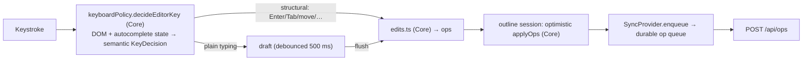
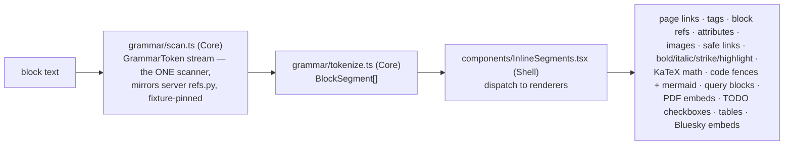

# Frontend architecture (web/)

The frontend is a React 18 + Vite single-page app: an offline-capable,
real-time-synced Roam-style outliner. Two things shape almost every file:

1. **FCIS is machine-enforced.** Every runtime module declares
   `// pattern: Functional Core` or `// pattern: Imperative Shell`;
   `pnpm check:fcis` (`web/tooling/fcis.mjs`) fails if a Core module imports
   a Shell. Most subsystems are a pure state machine ("core") plus a thin
   React/worker/fetch "shell" that gathers inputs, dispatches, and runs the
   returned effects.
2. **The server is the source of truth for shapes.** API types are generated
   from the server's OpenAPI schema, the replica schema is generated from
   the server's DDL, and the Roam-markdown grammar is pinned to the Python
   parser by shared fixtures.

See [overview.md](overview.md) for the system picture and
[sync-and-offline.md](sync-and-offline.md) for the sync engine and replica in
depth — this doc covers them only from the UI side.

## Tech stack

| Concern | Choice |
|---|---|
| UI | React 18.3, react-router-dom 6.30 (v7 future flags), TypeScript 5.9 |
| Build | Vite 6, `vite-plugin-pwa` (Workbox service worker), pnpm (overrides in `pnpm-workspace.yaml` — pnpm 11 ignores `package.json` overrides) |
| Offline | `@sqlite.org/sqlite-wasm` (replica in a Web Worker on the OPFS SAHPool VFS) |
| Rendering extras (all lazy-loaded) | KaTeX (math), Mermaid (diagrams), react-pdf/pdf.js (PDF viewer), highlight.js (code) |
| Tests | Vitest + jsdom (enforced coverage), Playwright e2e, Testing Library, type-aware ESLint |
| API types | `openapi-typescript` via `pnpm gen-types` |

## Module map (`web/src/`)

```
main.tsx / App.tsx     Shell   Entry + top-level tree: SyncProvider > DndProvider >
                               SidebarContext > (left nav, TopBar, routes, sidebar stack)
api/                   client.ts (fetch wrapper + offline gateway),
                       typedClient.ts (path/method-aware wrapper over it),
                       generated openapi.json + types.d.ts, type-only
                       re-exports (ops.ts, payloads.ts)
assistant/             The embedded-assistant chat panel (Cmd/Ctrl+J).
                       Core: sse.ts (incremental SSE frame parser).
                       Shells: client.ts (fetch/stream over /api/assistant/*),
                       useAssistant.ts (chat state), AssistantPanel.tsx
views/                 Journal (daily notes, `/`), PageView (`/page/*`),
                       CurrentWork (`/current-work`), Files (`/files`, + pure
                       filesCore.ts), Settings (`/settings`), Help (`/help`);
                       EditablePage = one editable outline, reused by main pane
                       and sidebar panels
outline/               The editor engine.
                       Cores: outlineState.ts (the reducer), keyboardPolicy.ts,
                       edits.ts, tree.ts (applyOps — mirrors server ops_apply),
                       keyEdits.ts, slashCommands.ts, autocomplete.ts,
                       refAtCaret.ts, blockSelection.ts, history.ts,
                       paste.ts (outline paste), calendar.ts (/date month grid)
                       Shells: useOutline.ts (the hook), outlineSessions.ts
                       (per-title shared store), undoManager.ts
grammar/               Roam-markdown parsing: scan.ts (the shared scanner,
                       mirrors server refs.py), tokenize.ts (render tokens),
                       refs.ts, todo.ts, snippet.ts
components/            ~40 files: inline rendering (InlineSegments, MathSpan,
                       MermaidDiagram, PdfEmbed/PdfViewer, QueryBlock, BlockRef,
                       PageLink, AssetImage, CodeBlock, BlueskyEmbed, roamTable…)
                       + chrome (TopBar, SidebarNav/Panel, SearchBar,
                       OfflineIndicator, Composer, BacklinksSection,
                       JournalDayReferences, BlockMenu, DatePickerPopup…)
sync/                  SyncProvider.tsx (global context), socket.ts (WS),
                       opQueue.ts (+ pure queueState.ts), replicaSync.ts,
                       syncState.ts (pure editability/health FSM), assets.ts
replica/               The offline engine: worker.ts + workerHandlers.ts,
                       rpc.ts/client.ts (typed RPC), baseSchema.gen.ts
                       (generated from server DDL), clientSchema.ts,
                       queue.ts, apply.ts, reconcile.ts, recoveryGate.ts,
                       openRetry.ts (OPFS open contention),
                       localApi/ (offline read shims), localOps.ts
dnd/                   Drag-and-drop context + drop zones
styles.css             All styling (plain CSS, design tokens)
```

## Views and navigation

Routes: `/` → Journal (infinite scroll of daily pages), `/page/*` → PageView,
`/current-work` → recently edited pages, `/files` → the asset browser,
`/settings` → whole-database export and future settings, `/help` → the static
keyboard-shortcut doc, `*` → NotFound. The right-hand sidebar is a
session-only **stack**: shift-clicking any page link or ref pushes a
`SidebarPanel` onto it. The left nav holds pinned pages (server-persisted
via `/api/sidebar`), then a rule-fenced block of app destinations —
Assistant, Files, Settings — and the theme toggle. Global keys:
`Ctrl+Shift+D` jumps to today's daily note, `Cmd/Ctrl+/` toggles the
sidebar, `Cmd/Ctrl+J` toggles the assistant panel.

`/files` (pkm-jdu3) is a plain table over `/api/assets/search` with
filters (text, type, date range, linked/orphan), offset pagination and
multi-select for delete and zip export. Its pure half (`views/filesCore.ts`)
owns the query-string building, MIME categorisation, size formatting,
confirm-text composition and the reference token a user can copy into a
block; the shell owns fetching, selection state and the download. The zip
export is submitted as a throwaway hidden `<form method="post">` rather than
a fetch, so the browser owns the download rather than the SPA buffering it.
Journal days additionally render their own linked references inline
(`JournalDayReferences`, pkm-vvta), lazily per day and hidden when a day has
none, reusing `BacklinksSection` rather than a second renderer.

Both the main pane and a sidebar panel can show *the same page at the same
time* — a fact that drives the outline-session design below.

## State management

There is no Redux/Zustand; state lives in three layers:

1. **Server payloads per view** — components fetch with `apiFetch` and hold
   results in local state, refetching when told to.
2. **`SyncProvider`** (`sync/SyncProvider.tsx`) — one global context:
   connection status, editability, pending-op count, delivery-health
   `problem`, `enqueue()`, and `resyncSeq` — a counter bumped whenever
   server state may have diverged (reconnect after a gap, repair finished).
   Views subscribe via `useResync(fn)` and refetch on each bump.
3. **Per-title outline sessions** (`outline/outlineSessions.ts`) — the block
   tree's home and the most intricate module in the app. A module-level
   `Map<title, Session>` external store hands every view of a title one
   ref-counted session sharing a flushed tree and a monotonic revision.
   Exactly one view holds the **editor lease** (others render read-only), so
   the same page in main pane + sidebar can't double-edit. The session
   tracks causality between optimistic writes and authoritative reads: a
   fetched payload carries a `ReadToken` and is adopted only if it's the
   newest request, the revision is unchanged, and no relevant write ticket
   is unsettled — otherwise it's retained and reconsidered after settlement.
   The pure reducer behind it is `outlineState.ts::transitionOutline`.

The block tree itself is the generated `BlockNode` shape (recursive
`{uid, text, children[], order_idx, heading, collapsed, view_type}`). All
mutations go through the pure `applyOps` (`outline/tree.ts`), which mirrors
the server's op semantics — the same ops drive the screen, the replica, and
the server.

## The editor

**Textarea-based, not contenteditable.** Only the focused block is a live,
auto-growing `<textarea>` holding raw markdown; every other block is
rendered HTML (`EditableBlockTree` → `EditableBlock` → `BlockInput`). This
is the load-bearing performance decision: a 500-block page is one textarea
plus cheap static HTML.


```mermaid
flowchart LR
    K[Keystroke] --> KP["keyboardPolicy.decideEditorKey (Core)<br/>DOM + autocomplete state → semantic KeyDecision"]
    KP -->|structural: Enter/Tab/move/…| OPS["edits.ts (Core) → ops"]
    KP -->|plain typing| D["draft (debounced 500 ms)"]
    D -->|flush| OPS
    OPS --> S["outline session: optimistic applyOps (Core)"]
    S --> Q["SyncProvider.enqueue → durable op queue"]
    Q --> API["POST /api/ops"]
```

Editing mechanics worth knowing before touching `outline/`:

- **Draft vs key-edit paths.** Plain typing debounces into a draft
  (`TEXT_DEBOUNCE_MS` = 500 ms); structural edits, blur, undo, tab-hide, and
  in-editor navigation (`onFlushDraft`) flush the draft first. Drafts are
  *flush-held* while the caret sits inside a half-typed `[[ref` or `#tag`
  token, so autosave can't create a page from a partial title. Anything that
  mutates text programmatically must ride this draft/key-edit path, not poke
  the tree directly.
- **A flush-held draft has no timer, so navigation is a commit point.** An
  ordinary debounced draft is safe across an unmount: nothing cancels the
  pending `setTimeout`, so it still fires and flushes after the outline is
  gone. A *held* draft has no armed timer at all — its only exits are the
  explicit commit points above — and React delivers no blur for a node it
  removes. Two defences, both needed:
  - `useOutline` flushes on unmount, which covers navigation the editor never
    sees: App's global `Ctrl-Shift-D` chord, browser back/forward (pkm-mvdx).
    It is deliberately unmount-only (the callback is held in a ref, not a
    dep) and enqueues into the durable op queue after the outline's session
    handle is already released — there is nothing left to render into, and
    durability is the queue's job anyway.
  - Anything *inside* the editor that navigates away under its own steam
    flushes first, explicitly: `Ctrl-O`/`Ctrl-Shift-O` over a `[[ref]]`
    (`ensureRefPageThenOpen`) calls `handlers.onFlushDraft()` before both
    `POST /api/pages` and the navigation. That order matters — the flush is
    what creates the ref's page row through the normal ops path, so the
    unmount defence alone would leave it racing (pkm-hhbc; it silently
    emptied two real blocks in production before it was fixed).

  Clicking a rendered ref is *not* affected: only the unfocused blocks render
  links, so reaching one blurs the textarea first. Tab hide/close/reload is
  covered by the `visibilitychange` flush.
- **Keyboard policy is a pure function.** `decideEditorKey` returns a
  semantic decision the shell executes — new shortcuts are added in the
  policy (and its table-driven `META_WRAP_EDITS` for Cmd-letter wraps), not
  as ad-hoc event handlers. Current surface includes Cmd-K link, Cmd-B/I,
  Cmd-Enter TODO cycle, Ctrl+Alt+0–3 headings, Tab/Shift-Tab indent
  (multi-block aware), Alt-Arrow / Shift-Cmd-Arrow moves, Shift-Arrow
  multi-block selection, slash commands, and Cmd-Z / Shift-Cmd-Z undo/redo
  (`history.ts` + `undoManager.ts`).

  A multi-block *selection* is keyed elsewhere: with no focused textarea the
  tree container itself takes focus and `EditableBlockTree.onKeyDown` owns the
  chain (extend / move / indent / copy / clear / delete). The split invariant
  there is that **creating, extending and copying a selection are
  read-only-safe, while every mutating branch is gated on `!readOnly`** — Tab,
  Shift+Cmd+Arrow and Backspace/Delete (pkm-rckh; the delete gate was missing,
  so a selection made while editable could still be destroyed after sync
  turned the outline read-only). `useOutline`'s handlers do not re-check
  editability, so the gate has to be here.

- **Paste is opt-in structural, and the modifier is captured on keydown.**
  Plain Cmd-V is always left native — it inserts text into the textarea and
  nothing else (pkm-fwa2). `Shift-Cmd-V` *arms* an outline paste: `paste.ts`
  (Core) parses the clipboard into a forest by comparing indent widths
  ordinally with a stack (2-space, 4-space and tab clipboards all work
  unconfigured) and plans the whole splice as one op batch. The arm exists
  because `ClipboardEvent` carries no modifier state, so the chord is
  recorded in a ref on keydown — deliberately *without* `preventDefault`, or
  the browser's own paste would never fire — and consumed by the next
  `paste` event, which also requires the clipboard to actually have
  structure. One arm serves exactly one paste. E2E tests must arm via a
  synthetic keydown: pressing the real chord pastes whatever is on CI's
  clipboard.
- **Slash commands** cover block types (`/todo`, `/table`, code fences,
  `/mermaid`), headings, queries, `/upload`, and date links — `/today` and
  `/tomorrow` insert `[[Ordinal Date]]` links directly, while `/date` opens
  `DatePickerPopup` over the month grid computed by the pure `calendar.ts`
  (Monday-first, whole weeks, adjacent-month days marked). Labels are
  lowercase by convention, and `slashCommandsDocumented.test.ts` fails if a
  new command isn't documented in `docs/keyboard.md`.
- **Remote edits vs local draft**: authoritative text lands on the tree even
  for the focused block, but the textarea keeps the local draft — per-block
  last-write-wins, consistent with the server's model.
- **The bullet is a button, and the block menu's only keyboard route.** The
  `.bullet` span in `EditableBlockTree` carries `role="button"`,
  `tabIndex={0}`, `aria-label="Open block menu"`, `aria-haspopup`,
  `aria-expanded`, and an `onKeyDown` for Enter / Space / ContextMenu /
  Shift-F10 alongside its click, contextmenu and drag handlers. Every
  `onOpenMenu` call site is on that span and `keyboardPolicy` has no menu
  shortcut, so removing its tab stop removes keyboard access to Copy block
  reference and the view modes entirely. Its focus styling is constrained
  too — see *Focus and interactive affordances* below. The read-only
  `BlockTree` bullet is a plain `aria-hidden` span with no handlers: not
  focusable, by design.
- Phones get a bottom **Composer** (append-to-daily-note) instead of full
  outline editing.

## Rendering pipeline (read path)

Block text is raw Roam-flavoured markdown; rendering is a two-stage pure
pipeline feeding a component dispatcher:


```mermaid
flowchart LR
    T["block text"] --> SC["grammar/scan.ts (Core)<br/>GrammarToken stream — the ONE scanner,<br/>mirrors server refs.py, fixture-pinned"]
    SC --> TK["grammar/tokenize.ts (Core)<br/>BlockSegment[]"]
    TK --> IS["components/InlineSegments.tsx (Shell)<br/>dispatch to renderers"]
    IS --> R["page links · tags · block refs · attributes ·<br/>images · safe links · bold/italic/strike/highlight ·<br/>KaTeX math · code fences + mermaid · query blocks ·<br/>PDF embeds · TODO checkboxes · tables · Bluesky embeds"]
```

- `scan.ts` is the single grammar authority on the client (balanced
  `[[...]]` via an explicit stack, code spans blanked first); `tokenize.ts`,
  ref extraction, TODO detection, autocomplete and slash commands are all
  thin adapters over it. It's pinned to the Python parser by
  `shared/fixtures/ref_grammar.json`.
- Heavy renderers (KaTeX, Mermaid, pdf.js, highlight.js) are lazy-loaded
  behind cached module-level `import()` promises so they stay out of the
  eager bundle; their budgeted chunks are still precached so they work
  offline.
- Link hrefs are sanitized (`isSafeHref` rejects `javascript:` and
  protocol-relative URLs); Mermaid runs in strict mode.

## Sync and offline (UI-side summary)

The full protocol is in [sync-and-offline.md](sync-and-offline.md). What a
frontend contributor needs day-to-day:

- Edits are optimistic: apply to the outline session, enqueue to a durable
  queue (`pending_ops` rows in the replica DB), deliver FIFO to
  `POST /api/ops`. A `WriteTicket` distinguishes *persisted locally*
  (`settled`) from *acknowledged by server* (`delivered`).
- `api/client.ts::apiFetch` installs an **offline gateway**: when the socket
  is down (or a live fetch throws), reads route to
  `replica/localApi/router.ts` — TypeScript ports of the server's read
  routes returning identical JSON (pinned by `shared/fixtures/shim_parity.json`).
  Unshimmed routes throw `OfflineError`, and their UI says "online only".
- Pages created offline get negative ids, remapped by
  `replica/reconcile.ts` when the authoritative row arrives.
- The service worker (Workbox, configured in `vite.config.ts`) precaches the
  app shell + sqlite wasm + pdf.js worker + core KaTeX fonts, runtime-caches
  `/assets/` (CacheFirst, 400-entry LRU), and never caches `/api`.

## The assistant panel

`src/assistant/` is the UI for the server-side LLM assistant (the agent
itself runs on the server — see
[backend.md](backend.md#embedded-assistant-pkmassistant)): a floating chat
panel toggled with `Cmd/Ctrl+J` (Esc closes) or the "Assistant" sidebar
entry.

- The conversation is created lazily on the first message; the model
  dropdown (`sonnet` default / `opus` / `haiku`) locks once it exists.
  "New chat" deletes the server-side conversation and resets. Conversations
  are ephemeral — a reload loses them.
  "New chat" is safe mid-turn: each turn carries a generation counter, and
  `newChat` bumps it before clearing state, so the superseded turn's SSE
  events and finalizers are dropped instead of refilling the fresh transcript,
  resetting its status or re-raising its confirm card (pkm-6ts2). It then
  aborts and awaits that turn before `DELETE`ing the conversation, and a
  conversation whose creation resolved after the bump is closed rather than
  adopted. Abort-controller cleanup is identity-checked, so a newer turn stays
  stoppable.
- A turn streams over SSE: `client.ts::streamMessage` POSTs the message and
  feeds the response body through `sse.ts` (a pure incremental frame
  parser) into `useAssistant.ts`, which folds events into chat items —
  `text_delta` appends to the running assistant bubble,
  `tool_started`/`tool_finished` render tool-activity lines
  ("searching …"), and `confirm_request` shows an Allow/Deny card with the
  write's ops preview (the tool call is held server-side until answered).
  `sse.ts` drops any frame whose `event:` name is not one of the six known
  types, which is what makes the server's keepalive comment frames (sent
  every 15 idle seconds, pkm-mbcc) invisible here — keep it that way.
- `streamMessage` bypasses `apiFetch` (which consumes the body as JSON) but
  replicates its 401 handling; the other calls use `apiFetch`. The
  assistant is online-only — `/api/assistant/*` has no offline shim.

## API layer

`apiFetch<T>` handles JSON, 401 → `/login` redirect, and the offline
gateway. Types come from the generated `api/types.d.ts` (`pnpm gen-types`
over `api/openapi.json`, which the server generates); `api/ops.ts` and
`api/payloads.ts` are type-only re-exports. **Never hand-write API types** —
regenerate when the server changes (the server test suite fails on stale
artifacts).

`api/typedClient.ts` (`apiGet`/`apiPost`/`apiPut`/`apiDelete`) is a typing
layer over `apiFetch`, not a second transport: it builds the same URL and
calls `apiFetch`, so the offline gateway and error behaviour are identical.
The difference is that it takes the **OpenAPI path template**, not a built
URL — `apiGet("/api/page/{title}", { path: { title } })` — which lets the
generated `paths` table decide the path/query parameters, the JSON request
body, and the response type. `apiFetch<T>` cannot do that: `T` is whatever
the caller names, so an obsolete caller type or a wrong body typechecks.
Prefer the typed client for new call sites; the remaining `apiFetch<T>`
callers are a mechanical conversion still to be done (pkm-60bf). Path
parameters are encoded per segment because `{title:path}` routes carry
namespace titles whose slashes must survive; every other path parameter is
slash-free by construction. Compile-time drift probes live in
`api/typedClient.test.ts` — an expected-error directive that stops erroring
fails the build, so the probes cannot rot.

## Styling and theming

Plain CSS in a single `src/styles.css` — no framework, no CSS-in-JS. Design
tokens are custom properties on `:root`: a color system
(`--color-bg/-surface/-text*/-accent/-link/-tag/…`), a five-step radius
scale, and `--hljs-*` code tokens. The radius steps are assigned by *role*,
not by size, and the comments in `styles.css` are the contract:
`--radius-pill` (999px — buttons, ghost icon buttons, search fields),
`--radius-field` (7px — text inputs, selects, textareas), `--radius-control`
(4px — inline code, block rows, badges, thumbs), `--radius-card` (6px —
embedded content), `--radius-panel` (8px — floating menus, dropdowns, the
main pane).
Theming is three-way: light default, OS dark via
`@media (prefers-color-scheme: dark)` (works with zero JS), and an explicit
`data-theme` override stamped on `<html>` by `useTheme.ts` (system → light →
dark cycle, persisted to localStorage). `color-scheme` is declared per theme:
without it Chrome paints `select` and date widgets light whatever the CSS
says.

### Two control families

Buttons and fields are styled by named class, and there is deliberately **no
bare `input`/`select` element rule** (pkm-mrru, pkm-0wg9): a new control opts
in by name rather than silently inheriting a look — or silently getting none.

- **Buttons** are pills (`--radius-pill`): `.btn-secondary` (bordered,
  `--color-bg-subtle`, hover to `--color-selected-bg`), `.btn-danger` (filled
  `--color-error-fill`), and the quiet-until-hovered chrome trio
  (`.top-bar-menu-button`, `.sidebar-toggle-button`, `.help-button`) whose
  transparent border keeps hover from shifting layout. `.btn-secondary`
  carries its own padding — before pkm-mrru it had none, so bare call sites
  silently rendered at UA metrics. The left nav is the exception to look out
  for: its `.nav-link` class covers both `<a>` and `<button>` (see below).
- **Fields** are `.input-control` (text inputs, selects, textareas) and
  `.search-field` / `.search-field-input` — the latter is the top-bar search
  look, extracted so `/files`' search is literally the same field as `Cmd-U`
  rather than a lookalike. The resting fill is `--color-bg-subtle`, lifting to
  `--color-bg-surface` on focus; per-call-site rules add geometry only. The one
  colour exception is the left nav's `Add page…` input, which sits *on*
  `--color-bg-subtle` (`.left-nav`'s own background) and so takes the surface
  fill at rest — otherwise only its border would separate it from the nav. Its
  focus is then carried by the border colour and the ring alone.

`--color-error-fill` is a **fill-only** token, separate from the error text
colour: reusing one red for both made dark-theme Delete buttons read as
coral. Two colour tokens for two jobs.

### Focus and interactive affordances

One ring, everywhere a control can be focused:

```css
:focus-visible { outline: 2px solid var(--color-link); outline-offset: 1px; }
```

Declared **per component, next to that component's own rule** rather than as
one grouped selector list — locality beats brevity in a single 1000-line
stylesheet, and the grouped-rule alternative also trips `ruleFor` (below).
Resolved colours are `#c25a28` light / `#e8935a` dark. Every control uses
`outline-offset: 1px`; the one deviation is `.asset-image-trigger` at 2px, to
clear an embedded image's rounded corner.

Three deliberate exceptions, all commented in `styles.css` so an audit
doesn't "fix" them:

- `.top-bar-search-input` sets `outline: none` — its 220px→320px width growth
  is the focus affordance.
- `DatePickerPopup`'s buttons get no ring: the popup is mouse-only by design
  (every element `preventDefault`s on mousedown so the block textarea keeps
  focus), and Tab inside a block indents, so a ring there is unreachable.
  `styles.test.ts` asserts its *absence*.
- `.bullet` uses the standard ring but for a second reason beyond the palette
  clash: the bullet is a 5px dot inside a `4px solid transparent` border, and
  `.bullet.closed` signals *collapsed with hidden children* by colouring that
  border. Chrome's default ring hugs the dot the same way, so an unstyled
  focused bullet reads as a collapsed block. Any future restyling here must
  stay distinguishable from `.closed`.

Four traps when working on this:

- **Auditing the stylesheet alone is not enough.** `.nav-link` is applied to
  both the `<a>` destinations and the `<button>` controls in the left nav, and
  those are the app's first eight tab stops — a class-by-class read of
  `styles.css` looking for `<button>` selectors misses it completely. Drive
  the running app instead: `press Tab` in a loop and read
  `document.activeElement.className` plus
  `getComputedStyle(el).outlineColor`; computed style reflects
  `:focus-visible`, and CDP's synthetic Tab does establish keyboard modality.
- **Ordinary content anchors deliberately keep the UA ring.** `a.page-link`,
  external links and the `.page-title > a` heading link were considered and
  declined (pkm-9lwx): the ring is only ever seen by tabbing through prose,
  while at the block line-height a 2px offset ring collides with the line
  above and repeats per line box on a wrapped link.
- **An off-screen drawer is still in the tab order.** The phone nav
  (`@media (max-width: 600px)`) used `transform: translateX(-100%)` alone, so
  the closed drawer's links and buttons stayed tabbable — as the *first* tab
  stops on the page (pkm-rwwp). It now also sets `visibility: hidden`, with
  `.left-nav.open` restoring `visible` and `visibility` in the transition so
  the slide-out is still seen. Both declarations are scoped to that media
  query: at wider widths the nav is permanent and `navOpen` means nothing.
  The hamburger carries `aria-expanded` / `aria-controls="left-nav"`, and
  closing the drawer moves focus back to it — guarded on the drawer's previous
  state, since every `NavLink` calls `setNavOpen(false)` on every click and
  the hamburger is `display: none` above the breakpoint.
- **A heading with an `onClick` is a mouse-only control.** Page-title renaming
  and the Unlinked references collapse were both `onClick` on a non-focusable
  `<h1>`/`<h2>` (pkm-l4z8). Both now wrap their label in a real `<button>`
  *inside* the heading — `.page-title-edit` and `.section-toggle`, chrome-free
  classes that inherit the heading's type (`font: inherit` plus explicit
  `letter-spacing: inherit` / `text-transform: inherit`, which `font` does not
  carry) and take the standard ring. The collapsible one owns `aria-expanded`
  and marks its chevron `aria-hidden`. `BacklinksSection`'s `.filter-toggle`
  is the same in-heading pattern where a visible button *is* wanted. Both
  triggers need `display: block; width: 100%` — an inline-block button sizes
  to its chevron-plus-label content, not the header's full width, so without
  it a click anywhere else in the header row (the old `<h2 onClick>`'s whole
  hit area) silently does nothing; `styles.test.ts` asserts both properties
  on `.section-toggle` for this reason, matching `.page-title-edit`.
  `.page-title-edit` must stay named by its content (the title), never a
  fixed `aria-label`: accname computes the enclosing `<h1>`'s name by
  walking its children, and a child with its own explicit name contributes
  *that* name to the walk instead of its text — a fixed `aria-label` on this
  button silently renames the page's `<h1>` in every real browser (verified
  in Chromium; jsdom's accname implementation does not reproduce this, so a
  unit test cannot catch it). An arbitrary title can still contain a word
  like "Cancel" or "Merge" that collides with an unrelated dialog's
  same-named button in a test — deterministic, not the machine-load flakes
  elsewhere in this suite — but that is fixed by scoping the colliding query
  to its dialog (`getByRole("alertdialog").getByRole("button", …)`), not by
  renaming the product control.

**Control boundary contrast is a known, measured deviation from WCAG 1.4.11**
(pkm-xqir). `.btn-secondary`'s border is 1.30:1 against a panel surface in
dark and 1.29:1 in light; 3:1 would need a control-border token near
`#6e7a88` dark / `#959ea4` light, i.e. a visibly grey outline on every button
and input in both themes. That was judged to cost more than it buys. The full
ratio table is in the pkm-xqir bean — start from it rather than re-deriving.

Two other stylesheet invariants that are easy to break silently:

- **Embedded images cap at two-thirds of the text column** (`.asset-image` /
  `.asset-image-trigger`, both `max-width: 67%`). An external URL renders as a
  bare `` while an uploaded `/assets/` image is wrapped in the expansion
  trigger, so both boxes carry the cap and the outermost decides — which is
  why the inner image resets to `max-width: 100%`. Without that reset the two
  caps multiply to 4/9. The phone override back to full width
  (`@media (max-width: 600px)`) must stay *after* those rules: a media query
  adds no specificity, so source order is what wins.
- **The left nav's rules get their space from flexbox, not padding.**
  `.left-nav` has an 8px flex `gap`, so a separator like `.nav-section-start`
  declares only `padding-top` below itself (12px = the free 8px above plus
  `.nav-link`'s own 4px), keeping the text equidistant from the rule.

`styles.test.ts` guards these as text-level drift assertions against the raw
stylesheet. Its `ruleFor(selector)` builds an **unanchored** regex and returns
the first match, so a selector appearing as the non-first member of a grouped
rule silently returns the *group's* body: use `rulesFor` (joins every matching
rule) for classes styled in more than one place, and `mediaRulesFor(query,
selector)` for anything inside an `@media` block — `ruleFor` stops at the
first `}`, which inside a media block is the end of its first nested rule.

## Testing and quality gates

`pnpm verify` runs the gates in cost order:
**typecheck → lint → check:fcis → test:coverage → budget-enforced build →
Playwright e2e against that build.**

- **Unit** (Vitest + jsdom): co-located `*.test.ts(x)`;
  `src/test-setup.ts` stubs WebSocket/matchMedia/localStorage. Coverage is
  enforced (statements 95 / branches 91 / functions 89 / lines 95), with
  workers and generated files excluded. The pure cores are the point of the
  FCIS split: they test with no React/DOM/fetch/worker/SQLite mocks.
- **E2E** (Playwright, `web/e2e/`): ~23 specs — editing, backlinks, math,
  rename, undo, embeds, images, PDF, outline paste, slash dates, journal
  references, the assistant, the `/files` browser, and two offline specs.
  The harness is strict: any
  HTTP 5xx fails the run (`fixtures.ts`), and a server-side exception fails
  teardown. `e2e/server-state.ts::waitForServerText` polls the server's copy
  of a page — the reliable way to wait for a write before a reload. The
  server is launched by `playwright.config.ts` (`server/tests/e2e_serve.py`,
  port `E2E_PORT`, default 8975).
- **Lint** (flat, type-aware ESLint): deliberately only two rule families —
  React Hooks correctness and promise/error safety (`no-floating-promises`,
  `no-misused-promises`, `only-throw-error`, unknown catch variables). Zero
  `eslint-disable` comments exist in `web/src`.
- **Budgets** (`web/tooling/budgets.json` + `viteBudgetPlugin.ts`): the
  build fails if the eager entry, largest asset, total output, service-worker
  precache, or the per-library owned bytes (mermaid/pdfjs/katex chunk
  families, attributed by Rollup module reachability) exceed their caps.
  Growing the bundle is an explicit, reviewed decision.

## Build notes (`vite.config.ts`)

The dev server proxies `/api` (with WebSocket), `/assets` and `/login` to
the backend (`PKM_API_PORT`, default 8974) — run the server alongside
`pnpm dev`. `@sqlite.org/sqlite-wasm` must stay in `optimizeDeps.exclude`
(its wasm URL resolution breaks under dep-optimization). Hashed bundles are
emitted under `app-assets/`; the PWA plugin uses `autoUpdate` with
`clientsClaim`/`skipWaiting` and a navigate-fallback denylist for
`/api|/assets|/login`.
