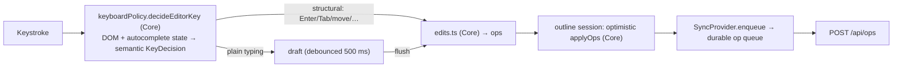
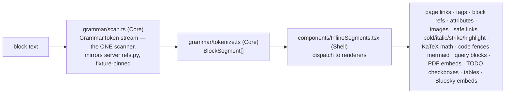

# Frontend architecture (web/)

The frontend is a React 18 + Vite single-page app: an offline-capable,
real-time-synced Roam-style outliner. Two things shape almost every file:

1. **FCIS is machine-enforced.** Every runtime module declares
   `// pattern: Functional Core` or `// pattern: Imperative Shell`;
   `pnpm check:fcis` (`web/tooling/fcis.mjs`) fails if a Core module imports
   a Shell. Most subsystems are a pure state machine ("core") plus a thin
   React/worker/fetch "shell" that gathers inputs, dispatches, and runs the
   returned effects.
2. **The server is the source of truth for shapes.** API types are generated
   from the server's OpenAPI schema, the replica schema is generated from
   the server's DDL, and the Roam-markdown grammar is pinned to the Python
   parser by shared fixtures.

See [overview.md](overview.md) for the system picture and
[sync-and-offline.md](sync-and-offline.md) for the sync engine and replica in
depth — this doc covers them only from the UI side.

## Tech stack

| Concern | Choice |
|---|---|
| UI | React 18.3, react-router-dom 6.30 (v7 future flags), TypeScript 5.9 |
| Build | Vite 6, `vite-plugin-pwa` (Workbox service worker), pnpm (overrides in `pnpm-workspace.yaml` — pnpm 11 ignores `package.json` overrides) |
| Offline | `@sqlite.org/sqlite-wasm` (replica in a Web Worker on the OPFS SAHPool VFS) |
| Rendering extras (all lazy-loaded) | KaTeX (math), Mermaid (diagrams), react-pdf/pdf.js (PDF viewer), highlight.js (code) |
| Tests | Vitest + jsdom (enforced coverage), Playwright e2e, Testing Library, type-aware ESLint |
| API types | `openapi-typescript` via `pnpm gen-types` |

## Module map (`web/src/`)

```
main.tsx / App.tsx     Shell   Entry + top-level tree: SyncProvider > DndProvider >
                               SidebarContext > BlockStampsContext > (left nav,
                               TopBar, routes, sidebar stack)
routeMeta.ts           Core    Route paths + top-bar label/browser-title table, one
                               entry per static route; TopBar, App.tsx's routing,
                               and useRouteTitle.ts (Shell, the single title effect)
                               all consume it, so /page/* and the not-found
                               catch-all are the only routes without a fixed label
blockStampsPref.ts     Core    "Show timestamps" preference (localStorage key +
                               guard + toggle); useBlockStampsPref.ts (Shell)
                               owns the single instance, shared through
                               BlockStampsContext so TopBar's checkmark and
                               PageView's column cannot disagree
api/                   client.ts (fetch wrapper + offline gateway),
                       typedClient.ts (path/method-aware wrapper over it),
                       generated openapi.json + types.d.ts, type-only
                       re-exports (ops.ts, payloads.ts)
assistant/             The embedded-assistant chat panel (Cmd/Ctrl+J).
                       Core: sse.ts (incremental SSE frame parser).
                       Shells: client.ts (fetch/stream over /api/assistant/*),
                       useAssistant.ts (chat state), AssistantPanel.tsx
views/                 Journal (daily notes, `/`), PageView (`/page/*`),
                       CurrentWork (`/current-work`), Files (`/files`, + pure
                       filesCore.ts), Settings (`/settings`), Help (`/help`);
                       EditablePage = one editable outline, reused by main pane
                       and sidebar panels
outline/               The editor engine. It owns its own contract: handlers.ts
                       declares OutlineHandlers, the command port useOutline
                       implements and the components call, so the dependency
                       runs UI → engine.
                       Cores: outlineState.ts (the reducer), keyboardPolicy.ts,
                       edits.ts, tree.ts (applyOps — mirrors server ops_apply),
                       keyEdits.ts, slashCommands.ts, autocomplete.ts,
                       refAtCaret.ts, blockSelection.ts, history.ts,
                       paste.ts (outline paste), calendar.ts (/date month grid),
                       missingPage.ts (the missing-page policy),
                       blockStamps.ts (margin-column dates, age bands, and
                       which ops count as a change)
                       Shells: useOutline.ts (the hook), outlineSessions.ts
                       (per-title shared store), useOutlinePageLoad.ts (the
                       shared page-load controller), undoManager.ts,
                       useAutocomplete.ts (the popup's shared state),
                       useBlockDraft.ts (the focused block's draft session)
grammar/               Roam-markdown parsing: scan.ts (the shared scanner,
                       mirrors server refs.py), tokenize.ts (render tokens),
                       refs.ts, todo.ts, snippet.ts
components/            ~45 files: the editor's own views (EditableBlockTree =
                       the read-side tree + selection keyboard, BlockInput =
                       the focused block's textarea), inline rendering
                       (InlineSegments, MathSpan, QueryBlock, BlockRef,
                       MermaidDiagram, PdfEmbed/PdfViewer,
                       PageLink, AssetImage, CodeBlock, BlueskyEmbed, roamTable…)
                       + chrome (TopBar, SidebarNav/Panel, SearchBar,
                       OfflineIndicator, Composer, BacklinksSection,
                       JournalDayReferences, BlockMenu, DatePickerPopup…)
sync/                  SyncProvider.tsx (global context), socket.ts (WS),
                       opQueue.ts (+ pure queueState.ts), replicaSync.ts,
                       syncState.ts (pure editability/health FSM), assets.ts
replica/               The offline engine: worker.ts + workerHandlers.ts,
                       rpc.ts/client.ts (typed RPC), baseSchema.gen.ts
                       (generated from server DDL), clientSchema.ts,
                       queue.ts, apply.ts, reconcile.ts, recoveryGate.ts,
                       openRetry.ts (OPFS open contention), titles.ts
                       (pure title canonicalization), localApi/ (offline read
                       shims), localOps.ts
dnd/                   Drag-and-drop context + drop zones
styles.css             All styling (plain CSS, design tokens)
```

## Views and navigation

There are seven routes:

| Route | View |
|---|---|
| `/` | Journal — an infinite scroll of daily pages |
| `/page/*` | PageView — one page |
| `/current-work` | Recently edited pages |
| `/files` | The asset browser |
| `/settings` | Whole-database export, and future settings |
| `/help` | The static keyboard-shortcut doc |
| `*` | NotFound |

### One table for route metadata

`routeMeta.ts` holds the path, top-bar label and browser title for every
static route. Three places read it: `App.tsx`'s `<Routes>` and `NavLink`s,
TopBar's label and page-action-menu gating, and `useRouteTitle.ts` — the
single route-aware `document.title` effect, called once from `App`. A route
therefore cannot end up labelled in one place and not another, which is how
`/files` and `/settings` once shipped with no top-bar label.

`routeMetaFor` strips trailing slashes from non-root static paths before
lookup, so a hand-typed `/files/` or `/settings/` still gets the canonical
label and title. `/page/*` and the not-found catch-all are the two routes
with no entry: `/page/*` is dynamic, so `PageView.tsx` sets its own title
once the page's title has loaded, which the pathname alone cannot give it.

### Navigation chrome

The left nav holds the pinned pages (server-persisted through `/api/sidebar`),
then a rule-fenced block of app destinations — Assistant, Files, Settings —
and the theme toggle.

The right-hand sidebar is a session-only **stack**: shift-clicking any page
link or ref pushes a `SidebarPanel` onto it.

Three global keys: `Ctrl+Shift+D` jumps to today's daily note, `Cmd/Ctrl+/`
toggles the sidebar, `Cmd/Ctrl+J` toggles the assistant panel.

The main pane and a sidebar panel can show *the same page at the same time*.
That fact drives the outline-session design below.

### The `/files` browser

`/files` is a plain table over `/api/assets/search`, with filters (text, type,
date range, linked/orphan), offset pagination, and multi-select for delete and
zip export.

Pagination has two guards. A synchronous single-flight lock, alongside the
disabled button state, stops a double click issuing two page requests; a
generation guard discards responses that a filter change has made stale.

`PdfViewer` uses the same generation idea for a different race. When `href`
changes it resets `doc`/`failed`/`expanded`/`currentPage` and bumps a counter
**synchronously during render**, not in an effect, and every load callback
compares the generation it captured against the current one before writing
state. An effect would be too late: effects fire child-before-parent, so a
`Document` child that resolves synchronously can call `onLoadSuccess` before
the parent's reset effect runs.

Its pure half, `views/filesCore.ts`, owns the typed query-object building,
MIME categorisation, size formatting, confirm-text composition, and the
reference token a user can copy into a block. `typedClient` serializes the
query; the shell owns fetching, selection state and the download.

The zip export is submitted as a throwaway hidden `<form method="post">`
rather than a fetch, so the browser owns the download instead of the SPA
buffering it.

### Journal day references

Journal days render their own linked references inline
(`JournalDayReferences`), lazily per day, hidden when a day has none. This
reuses `BacklinksSection` rather than adding a second renderer.

## State management

There is no Redux/Zustand; state lives in three layers:

1. **Server payloads per view** — components fetch JSON through the typed
   client (`apiGet`/`apiPost`/`apiPut`/`apiDelete`) and hold results in
   local state, refetching when told to.
2. **`SyncProvider`** (`sync/SyncProvider.tsx`) — one global context:
   connection status, editability, pending-op count, delivery-health
   `problem`, `enqueue()`, and `resyncSeq` — a counter bumped whenever
   server state may have diverged (reconnect after a gap, repair finished).
   Views subscribe via `useResync(fn)` and refetch on each bump.
3. **Per-title outline sessions** (`outline/outlineSessions.ts`) — the block
   tree's home, and the most intricate module in the app. A module-level
   `Map<title, Session>` external store hands every view of a title one
   ref-counted session, sharing a flushed tree and a monotonic revision.
   Exactly one view holds the **editor lease** and the others render
   read-only, so the same page in the main pane and the sidebar cannot
   double-edit. The session also tracks causality between optimistic writes
   and authoritative reads: a fetched payload carries a `ReadToken` and is
   adopted only if it is the newest request, the revision is unchanged, and
   no relevant write ticket is unsettled. Otherwise it is retained and
   reconsidered after settlement. The pure reducer behind it is
   `outlineState.ts::transitionOutline`.

Driving a session correctly from a view is subtle, so the two **single-page**
surfaces share one implementation of it: `outline/useOutlinePageLoad.ts`,
used by `PageView` and `EditableSidebarPanel`. The hook owns the whole read
lifecycle — one outstanding generation per mount, the parent readiness
promise a `"parent"` read publishes through, the authoritative loader and
parent read controller registered on the session, and the cleanup order at
unmount — and returns just `{payload, error, reload}`. The two surfaces
differ only in presentation and in where they scroll. A second copy of this
controller is how they silently drifted apart before.

The Journal is the third surface showing editable outlines, and does not use
the hook: it loads many days in one batched `/api/journal` request and
delivers each day's blocks through its own capture-ticket path.

What a *failed* read means is a policy decision, not something each surface
reimplements. The pure `outline/missingPage.ts::substituteMissingDaily` turns
a 404 on a daily title into an empty editable page, because a daily nobody
has written to yet is not an error anywhere it is displayed. (The server
auto-creates only today's; the first edit creates the row.) Every other
missing page stays an error. `reload("resync")` is how `PageView` answers a
`resyncSeq` bump; the sidebar does not subscribe to resync.

The block tree itself is the generated `BlockNode` shape (recursive
`{uid, text, children[], order_idx, heading, collapsed, view_type}`). All
mutations go through the pure `applyOps` (`outline/tree.ts`), which mirrors
the server's op semantics — the same ops drive the screen, the replica, and
the server.

## The editor

**Textarea-based, not contenteditable.** Only the focused block is a live,
auto-growing `<textarea>` holding raw markdown; every other block is
rendered HTML (`EditableBlockTree` → `EditableBlock` → `BlockInput`, the last
of these its own file). This is the central performance decision: a 500-block
page is one textarea plus cheap static HTML.

**Which way the editor's dependencies point.** Everything the UI can ask the
editor to do is the `OutlineHandlers` port in `outline/handlers.ts` — about
thirty named callbacks (focus, draft, split/indent/move, selection, upload,
paste, undo). `useOutline` implements it; `EditableBlockTree`,
`EditableBlock` and `BlockInput` only call it. The port lives in `outline/`
on purpose: it used to be declared in `EditableBlockTree.tsx`, which made the
engine import a type from a component. It stays a plain callback interface
rather than a command union plus dispatcher, because every member is already
a distinct, individually-typed operation — a union would add a second name
and a switch case per member without removing one.

No component holds block-tree state. The most any of them owns is
`BlockInput`'s *draft* of one block's text (`outline/useBlockDraft.ts`: the
value, its dirty flag, IME composition, adoption of committed text over a
clean draft, and caret restoration after a programmatic value swap) plus the
transient popup offsets around it.


```mermaid
flowchart LR
    K[Keystroke] --> KP["keyboardPolicy.decideEditorKey (Core)<br/>DOM + autocomplete state → semantic KeyDecision"]
    KP -->|structural: Enter/Tab/move/…| OPS["edits.ts (Core) → ops"]
    KP -->|plain typing| D["draft (debounced 500 ms)"]
    D -->|flush| OPS
    OPS --> S["outline session: optimistic applyOps (Core)"]
    S --> Q["SyncProvider.enqueue → durable op queue"]
    Q --> API["POST /api/ops"]
```

Editing mechanics to know before touching `outline/`:

- **Draft vs key-edit paths.** Plain typing debounces into a draft
  (`TEXT_DEBOUNCE_MS` = 500 ms). Structural edits, blur, undo, tab-hide, and
  in-editor navigation (`onFlushDraft`) flush the draft first. Drafts are
  *flush-held* while the caret sits inside a half-typed `[[ref` or `#tag`
  token, so autosave cannot create a page from a partial title. Anything that
  mutates text programmatically must ride this draft/key-edit path, and must
  not poke the tree directly.
- **A flush-held draft has no timer, so navigation is a commit point.** An
  ordinary debounced draft survives an unmount: nothing cancels the pending
  `setTimeout`, so it still fires and flushes after the outline is gone. A
  *held* draft has no armed timer at all — its only exits are the explicit
  commit points above — and React delivers no blur for a node it removes. Two
  defences, both needed:
  - `useOutline` flushes on unmount, which covers navigation the editor never
    sees: App's global `Ctrl-Shift-D` chord, and browser back/forward. It is
    unmount-only on purpose (the callback is held in a ref, not a dep) and
    enqueues into the durable op queue after the outline's session handle is
    already released. There is nothing left to render into, and durability is
    the queue's job anyway.
  - Anything *inside* the editor that navigates away under its own steam
    flushes first, explicitly. `Ctrl-O`/`Ctrl-Shift-O` over a `[[ref]]`
    (`ensureRefPageThenOpen`) calls `handlers.onFlushDraft()` before both
    `POST /api/pages` and the navigation. That order matters: the flush is
    what creates the ref's page row through the normal ops path, so the
    unmount defence alone would leave it racing. This one emptied two real
    blocks in production before it was fixed.

  Clicking a rendered ref is not affected: only unfocused blocks render
  links, so reaching one blurs the textarea first. Tab hide, close and reload
  are covered by the `visibilitychange` flush.
- **Keyboard policy is a pure function.** `decideEditorKey` returns a
  semantic decision the shell executes. New shortcuts are added in the policy
  (and its table-driven `META_WRAP_EDITS` for Cmd-letter wraps), not as
  ad-hoc event handlers. The current surface: Cmd-K link, Cmd-B/I, Cmd-Enter
  TODO cycle, Ctrl+Alt+0–3 headings, Tab/Shift-Tab indent (multi-block
  aware), Alt-Arrow and Shift-Cmd-Arrow moves, Shift-Arrow multi-block
  selection, slash commands, and Cmd-Z / Shift-Cmd-Z undo/redo (`history.ts`
  + `undoManager.ts`).

  A multi-block *selection* is keyed by the second policy function,
  `decideSelectionKey`. With no focused textarea the tree container itself
  takes focus, and `EditableBlockTree.onKeyDown` executes what the policy
  decides: extend, move, indent, copy, clear or delete. The split there is
  that **creating, extending and copying a selection are read-only-safe,
  while every mutating branch is gated on `!readOnly`** — Tab, Shift+Cmd+Arrow
  and Backspace/Delete. The delete gate was once missing, so a selection made
  while editable could still be destroyed after sync turned the outline
  read-only. `useOutline`'s handlers do not re-check editability, so the gate
  has to be in the policy.

  A gated key resolves to `"none"`, which the shell leaves **uncancelled**:
  no `preventDefault`, so a read-only Tab still moves focus out of the tree
  the way the platform intends. That is why "did nothing" and "was not
  handled" are the same decision here.
- **The autocomplete popup is shared state, and its caret is read live.**
  `outline/useAutocomplete.ts` holds the open completion context and the
  highlighted row for both the outline editor's `BlockInput` and the phone
  `Composer`. The pure detection and staleness rules are in
  `outline/autocomplete.ts`, and which keys the popup may claim is
  `keyboardPolicy.autocompleteKeyAction` — unmodified Arrow/Enter/Tab/Escape
  only, so Cmd/Ctrl/Shift/Alt chords stay with the platform and the editor.

  The invariant to protect: **no action ever uses a remembered caret.**
  Context is detected on input, but clicks and selection-only caret moves
  fire no input event. So every action path (keydown, click, mouse pick) goes
  through `resolve(textarea)`, which re-derives the context from the live
  selection, closes the popup when it no longer matches, and returns the
  caret to splice at. A stale popup therefore claims nothing: Enter stays a
  split, Tab stays an indent, and a completion cannot land at the offset the
  caret has left.

  `resolve` must not be called from `keyup`. Both editors place the caret
  after a key-edit inside a `requestAnimationFrame`, and keyup always lands
  inside that window, where every context looks stale.
- **Paste is opt-in structural, and the modifier is captured on keydown.**
  Plain Cmd-V is always left native: it inserts text into the textarea and
  nothing else. `Shift-Cmd-V` *arms* an outline paste. `paste.ts` (Core)
  parses the clipboard into a forest by comparing indent widths ordinally
  with a stack — 2-space, 4-space and tab clipboards all work unconfigured —
  and plans the whole splice as one op batch.

  The arm exists because `ClipboardEvent` carries no modifier state. The
  chord is recorded in a ref on keydown, without `preventDefault` (or the
  browser's own paste would never fire), and consumed by the next `paste`
  event, which also requires the clipboard to actually have structure. One
  arm serves exactly one paste. E2E tests must arm via a synthetic keydown:
  pressing the real chord pastes whatever is on CI's clipboard.
- **Slash commands** cover block types (`/todo`, `/table`, code fences,
  `/mermaid`), headings, queries, `/upload`, and date links. `/today` and
  `/tomorrow` insert `[[Ordinal Date]]` links directly, while `/date` opens
  `DatePickerPopup` over the month grid computed by the pure `calendar.ts`
  (Monday-first, whole weeks, adjacent-month days marked). Labels are
  lowercase by convention, and `slashCommandsDocumented.test.ts` fails if a
  new command isn't documented in `docs/keyboard.md`.
- **Remote edits vs local draft.** Authoritative text lands on the tree even
  for the focused block, but the textarea keeps the local draft — per-block
  last-write-wins, consistent with the server's model.
- **The bullet is a button, and the block menu's only keyboard route.** The
  `.bullet` span in `EditableBlockTree` carries `role="button"`,
  `tabIndex={0}`, `aria-label="Open block menu"`, `aria-haspopup`,
  `aria-expanded`, and an `onKeyDown` for Enter / Space / ContextMenu /
  Shift-F10 alongside its click, contextmenu and drag handlers. Every
  `onOpenMenu` call site is on that span, and `keyboardPolicy` has no menu
  shortcut, so removing its tab stop removes keyboard access to Copy block
  reference and the view modes entirely. Its focus styling is constrained
  too — see *Focus and interactive affordances* below.

  In `EditableBlockTree` fallback mode (`fallback=true`), bullets are inert
  spans with no role, tab stop, menu, focus, upload, selection or drag
  handlers, and chevrons are disabled. The same renderer therefore displays
  the live shared outline without a second editing implementation.
- Phones get a bottom **Composer** (append-to-daily-note) instead of full
  outline editing.

**The stamp cell lives inside `.block-row`.** It is the row's last flex child,
after `.block-text` or, when the block is focused, after `BlockInput`'s
textarea. Both facts are load-bearing: `.block-children` indents from the left
only, so every row in a page already shares a right edge and the cells form a
true column at any nesting depth; and because the cell is a sibling of the
textarea rather than of the row, focusing a block cannot shift it. The flag
reaches it as a **prop** from `PageView` alone — `EditableBlockTree` must never
read `BlockStampsContext` itself, or the journal scroll and sidebar panels
would grow the column too.

**`set_collapsed` must not stamp.** `opBumpsUpdatedAt` (outline/blockStamps.ts)
is the single statement of pkm-r7k8's rule that collapsing is a view toggle,
not a change. `transitionOutline` uses it to decide which uids to stamp, and a
test in `replica/localOps.test.ts` asserts the replica's own writes agree
op-for-op — so the displayed date and the stored date cannot drift apart.

## Rendering pipeline (read path)

Block text is raw Roam-flavoured markdown; rendering is a two-stage pure
pipeline feeding a component dispatcher:


```mermaid
flowchart LR
    T["block text"] --> SC["grammar/scan.ts (Core)<br/>GrammarToken stream — the ONE scanner,<br/>mirrors server refs.py, fixture-pinned"]
    SC --> TK["grammar/tokenize.ts (Core)<br/>BlockSegment[]"]
    TK --> IS["components/InlineSegments.tsx (Shell)<br/>dispatch to renderers"]
    IS --> R["page links · tags · block refs · attributes ·<br/>images · safe links · bold/italic/strike/highlight ·<br/>KaTeX math · code fences + mermaid · query blocks ·<br/>PDF embeds · TODO checkboxes · tables · Bluesky embeds"]
```

- `scan.ts` is the single grammar authority on the client: balanced `[[...]]`
  via an explicit stack, code spans blanked first. `tokenize.ts`, ref
  extraction, TODO detection, autocomplete and slash commands are all thin
  adapters over it. It is pinned to the Python parser by
  `shared/fixtures/ref_grammar.json`.
- Heavy renderers (KaTeX, Mermaid, pdf.js, highlight.js) are lazy-loaded
  behind cached module-level `import()` promises, so they stay out of the
  eager bundle. Their budgeted chunks are still precached, so they work
  offline.
- Link hrefs are sanitized (`isSafeHref` rejects `javascript:` and
  protocol-relative URLs); Mermaid runs in strict mode.

## Sync and offline (UI-side summary)

The full protocol is in [sync-and-offline.md](sync-and-offline.md). What a
frontend contributor needs day-to-day:

- Edits are optimistic: apply to the outline session, enqueue to a durable
  queue (`pending_ops` rows in the replica DB), deliver FIFO to
  `POST /api/ops`. A `WriteTicket` distinguishes *persisted locally*
  (`settled`) from *acknowledged by server* (`delivered`).
- `api/client.ts::apiFetch` installs an **offline gateway**: when the socket
  is down, or a live fetch throws, reads route to
  `replica/localApi/router.ts` — TypeScript ports of the server's read routes
  returning identical JSON (pinned by `shared/fixtures/shim_parity.json`).
  Unshimmed routes throw `OfflineError`, and their UI says "online only".
- Pages created offline get negative ids, remapped by
  `replica/reconcile.ts` when the authoritative row arrives. When title
  canonicalization activates, the same shell canonicalizes or merges padded
  negative-id pages before pending replay, preserving their blocks, refs and
  unchanged wire operations without leaving divergent padded pages.
- The service worker (Workbox, configured in `vite.config.ts`) precaches the
  app shell, sqlite wasm, the pdf.js worker and core KaTeX fonts,
  runtime-caches `/assets/` (CacheFirst, 400-entry LRU), and never caches
  `/api`.

## The assistant panel

`src/assistant/` is the UI for the server-side LLM assistant; the agent
itself runs on the server (see
[backend.md](backend.md#embedded-assistant-pkmassistant)). It is a floating
chat panel, toggled with `Cmd/Ctrl+J` (Esc closes) or the "Assistant" sidebar
entry.

- The conversation is created lazily on the first message. The model dropdown
  (`sonnet` default / `opus` / `haiku`) locks once it exists. "New chat"
  deletes the server-side conversation and resets. Conversations are
  ephemeral: a reload loses them.
- "New chat" is safe mid-turn. Each turn carries a generation counter, and
  `newChat` bumps it before clearing state, so a superseded turn's SSE events
  and finalizers are dropped instead of refilling the fresh transcript,
  resetting its status, or re-raising its confirm card. It then aborts and
  awaits that turn before `DELETE`ing the conversation, and a conversation
  whose creation resolves after the bump is closed rather than adopted.
  Abort-controller cleanup is identity-checked, so a newer turn stays
  stoppable.
- A turn streams over SSE. `client.ts::streamMessage` POSTs the message and
  feeds the response body through `sse.ts` (a pure incremental frame parser)
  into `useAssistant.ts`, which folds events into chat items: `text_delta`
  appends to the running assistant bubble, `tool_started`/`tool_finished`
  render tool-activity lines ("searching …"), and `confirm_request` shows an
  Allow/Deny card with the write's ops preview. The tool call is held
  server-side until answered.
- `sse.ts` drops any frame whose `event:` name is not one of the six known
  types. That is what makes the server's keepalive comment frames, sent every
  15 idle seconds, invisible here. Keep it that way.
- `streamMessage` bypasses `apiFetch` (which consumes the body as JSON) but
  replicates its 401 handling; the other assistant JSON calls use the typed
  client helpers. The assistant is online-only — `/api/assistant/*` has no
  offline shim.

## API layer

`apiFetch<T>` handles JSON, the 401 → `/login` redirect, and the offline
gateway. Types come from the generated `api/types.d.ts` (`pnpm gen-types`
over `api/openapi.json`, which the server generates); `api/ops.ts` and
`api/payloads.ts` are type-only re-exports. **Never hand-write API types** —
regenerate when the server changes, since the server test suite fails on
stale artifacts.

Concrete JSON requests must use `api/typedClient.ts`'s `apiGet`/`apiPost`/
`apiPut`/`apiDelete`. ESLint enforces that boundary with
`no-restricted-imports`: production and tooling code cannot import `apiFetch`
from `api/client` except at raw transport seams.

The typed client is a typing layer over `apiFetch`, not a second transport.
It builds the same URL and calls `apiFetch`, so the offline gateway and error
behaviour are identical. The difference is that it takes the **OpenAPI path
template** rather than a built URL:

    apiGet("/api/page/{title}", { path: { title } })

That lets the generated `paths` table decide the path and query parameters,
the JSON request body, and the response type. `apiFetch<T>`
cannot do that: `T` is whatever the caller names, so an obsolete caller type
or a wrong body still typechecks.

Three raw `apiFetch` exceptions exist: the typed-client implementation
itself, multipart upload in `sync/assets.ts`, and `SyncProvider.tsx`'s
`replicaSync` injection seam (`fetchJson: apiFetch`). `SyncProvider` is
allowed for that transport injection only; it does not issue a concrete JSON
request at the import site.

Path parameters are encoded per segment, because `{title:path}` routes carry
namespace titles whose slashes must survive; every other path parameter is
slash-free by construction. Compile-time drift probes live in
`api/typedClient.test.ts` — an expected-error directive that stops erroring
fails the build, so the probes cannot rot.

## Styling and theming

Plain CSS in a single `src/styles.css` — no framework, no CSS-in-JS. Design
tokens are custom properties on `:root`: a color system
(`--color-bg/-surface/-text*/-accent/-link/-tag/…`), a five-step radius
scale, and `--hljs-*` code tokens.

The radius steps are assigned by *role*, not by size, and the comments in
`styles.css` are the contract:

| Token | Size | Used for |
|---|---|---|
| `--radius-pill` | 999px | buttons, ghost icon buttons, search fields |
| `--radius-field` | 7px | text inputs, selects, textareas |
| `--radius-control` | 4px | inline code, block rows, badges, thumbs |
| `--radius-card` | 6px | embedded content |
| `--radius-panel` | 8px | floating menus, dropdowns, the main pane |

Block stamps (pkm-4ler) add four band tokens — `--color-stamp-week`,
`-month`, `-year`, `-older` — declared in all three theme blocks. They run
warm-for-fresh to a barely-there cool tint for old, deliberately: the
strongest colour then lands on the rare recent rows, and a page of entirely
old material reads as almost untinted. They are solid fills, not alpha, so a
band stays predictable over `.block-row:hover` and `.block-row.focused`.
`.block-stamp` is the control class; below the 600px breakpoint the whole
column is `display: none`.

Theming is three-way: light by default, OS dark via
`@media (prefers-color-scheme: dark)` (which works with zero JS), and an
explicit `data-theme` override stamped on `<html>` by `useTheme.ts`
(system → light → dark cycle, persisted to localStorage). `color-scheme` is
declared per theme; without it Chrome paints `select` and date widgets light
whatever the CSS says.

### Two control families

Buttons and fields are styled by named class, and there is deliberately **no
bare `input`/`select` element rule**: a new control opts in by name rather
than silently inheriting a look, or silently getting none.

- **Buttons** are pills (`--radius-pill`): `.btn-secondary` (bordered,
  `--color-bg-subtle`, hover to `--color-selected-bg`), `.btn-danger` (filled
  `--color-error-fill`), and the quiet-until-hovered chrome trio
  (`.top-bar-menu-button`, `.sidebar-toggle-button`, `.help-button`) whose
  transparent border keeps hover from shifting layout. `.btn-secondary`
  carries its own padding; it once had none, so bare call sites rendered at
  UA metrics.

  The danger family mirrors the same disabled treatment:
  `.btn-danger:hover:not(:disabled)` suppresses hover feedback once
  busy/disabled, and `.btn-danger:disabled` uses the same 0.35 opacity and
  default cursor as `.btn-secondary:disabled`. The left nav is the exception
  to watch for: its `.nav-link` class covers both `<a>` and `<button>` (see
  below).
- **Fields** are `.input-control` (text inputs, selects, textareas) and
  `.search-field` / `.search-field-input`. The latter is the top-bar search
  look, extracted so `/files`' search is literally the same field as `Cmd-U`
  rather than a lookalike. The resting fill is `--color-bg-subtle`, lifting
  to `--color-bg-surface` on focus; per-call-site rules add geometry only.

  Shared supporting and status copy in Files and Settings uses
  `p.settings-note`. The `p` qualifier keeps `.settings-section p`
  specificity, so the later shared rule can set the muted colour and tighter
  top margin without undoing Settings' paragraph reset.

  The one colour exception is the left nav's `Add page…` input. It sits *on*
  `--color-bg-subtle` (`.left-nav`'s own background), so it takes the surface
  fill at rest; otherwise only its border would separate it from the nav. Its
  focus is then carried by the border colour and the ring alone.

`--color-error-fill` is a **fill-only** token, separate from the error text
colour. Reusing one red for both made dark-theme Delete buttons read as
coral: two colour tokens for two jobs.

### Confirmations

Every confirmation prompt goes through `useConfirm`
(`web/src/components/ConfirmDialog.tsx`), which returns
`{ confirm(message, options?): Promise<boolean>, dialog: ReactNode }`. There are
no `window.confirm` call sites left in `web/src`, and new ones must not appear:
iPadOS Safari has suppressed `window.confirm` in standalone (installed PWA)
mode, which silently turns a guarded destructive action into either a no-op or
an unguarded one depending on what it returns.

The cost of the hook is that the owning component must render `dialog`
somewhere in its tree, or `confirm()`'s promise never settles and the action
hangs instead of prompting. Hooks that expose a confirm-backed handler
therefore re-export `dialog` to their caller — `useOutline` does this for the
large-selection delete prompt, and `EditablePage` renders it.

Because the prompt is now asynchronous where `window.confirm` blocked the main
thread, remote sync batches can land while a dialog is open. Handlers must
re-derive what they act on after the await rather than closing over uids
captured before it.

### Focus and interactive affordances

One ring, everywhere a control can be focused:

```css
:focus-visible { outline: 2px solid var(--color-link); outline-offset: 1px; }
```

It is declared **per component, next to that component's own rule**, rather
than as one grouped selector list. Locality beats brevity in a single
1000-line stylesheet, and the grouped-rule alternative also trips `ruleFor`
(below). Resolved colours are `#c25a28` light and `#e8935a` dark. Every
control uses `outline-offset: 1px`; the one deviation is
`.asset-image-trigger` at 2px, to clear an embedded image's rounded corner.

Three deliberate exceptions, all commented in `styles.css` so an audit
doesn't "fix" them:

- `.top-bar-search-input` sets `outline: none` — its 220px→320px width growth
  is the focus affordance. That growth is desktop-only: below the 600px phone
  breakpoint the field must shrink instead of overflow (`.search-field`'s
  `min-width: 0`), so growth stops being a usable focus cue and the
  `@media (max-width: 600px)` block re-enables the ring there.
- `DatePickerPopup`'s buttons get no ring. The popup is mouse-only by design
  (every element `preventDefault`s on mousedown so the block textarea keeps
  focus), and Tab inside a block indents, so a ring there is unreachable.
  `styles.test.ts` asserts its *absence*.
- `.bullet` uses the standard ring, for a second reason beyond the palette
  clash. The bullet is a 5px dot inside a `4px solid transparent` border, and
  `.bullet.closed` signals *collapsed with hidden children* by colouring that
  border. Chrome's default ring hugs the dot the same way, so an unstyled
  focused bullet reads as a collapsed block. Any future restyling here must
  stay distinguishable from `.closed`.

Four traps when working on this:

- **Auditing the stylesheet alone is not enough.** `.nav-link` is applied to
  both the `<a>` destinations and the `<button>` controls in the left nav,
  and those are the app's first eight tab stops. A class-by-class read of
  `styles.css` looking for `<button>` selectors misses it completely. Drive
  the running app instead: `press Tab` in a loop and read
  `document.activeElement.className` plus
  `getComputedStyle(el).outlineColor`. Computed style reflects
  `:focus-visible`, and CDP's synthetic Tab does establish keyboard modality.
- **Ordinary content anchors deliberately keep the UA ring.** `a.page-link`,
  external links and the `.page-title > a` heading link were considered and
  declined: the ring is only ever seen by tabbing through prose, while at the
  block line-height a 2px offset ring collides with the line above and
  repeats per line box on a wrapped link.
- **An off-screen drawer is still in the tab order.** The phone nav
  (`@media (max-width: 600px)`) once used `transform: translateX(-100%)`
  alone, so the closed drawer's links and buttons stayed tabbable — as the
  *first* tab stops on the page. It now also sets `visibility: hidden`, with
  `.left-nav.open` restoring `visible`, and `visibility` in the transition so
  the slide-out is still seen. Both declarations are scoped to that media
  query: at wider widths the nav is permanent and `navOpen` means nothing.
  The hamburger carries `aria-expanded` and `aria-controls="left-nav"`, and
  closing the drawer moves focus back to it — guarded on the drawer's
  previous state, since every `NavLink` calls `setNavOpen(false)` on every
  click and the hamburger is `display: none` above the breakpoint.
- **A heading with an `onClick` cannot be reached from the keyboard.** Page
  title renaming and the Unlinked references collapse were both `onClick` on
  a non-focusable `<h1>`/`<h2>`. Both now wrap their label in a real
  `<button>` *inside* the heading: `.page-title-edit` and `.section-toggle`,
  chrome-free classes that inherit the heading's type and take the standard
  ring. `BacklinksSection`'s `.filter-toggle` is the same in-heading pattern,
  where a visible button *is* wanted. Three details make this work:

  - **Inheriting the type takes three declarations, not one.**
    `font: inherit`, plus an explicit `letter-spacing: inherit` and
    `text-transform: inherit`, which the `font` shorthand does not carry.
  - **Both triggers need `display: block; width: 100%`.** An inline-block
    button sizes to its chevron-plus-label content, not the header's full
    width, so a click anywhere else in the header row — the old
    `<h2 onClick>`'s whole hit area — would silently do nothing.
    `styles.test.ts` asserts both properties on `.section-toggle`, matching
    `.page-title-edit`. The collapsible trigger also owns `aria-expanded` and
    marks its chevron `aria-hidden`.
  - **`.page-title-edit` must stay named by its content**, the title, and
    never by a fixed `aria-label`. Accname computes the enclosing `<h1>`'s
    name by walking its children, and a child with its own explicit name
    contributes *that* name to the walk instead of its text. A fixed
    `aria-label` on this button therefore renames the page's `<h1>` in every
    real browser. (Verified in Chromium; jsdom's accname implementation does
    not reproduce it, so a unit test cannot catch it.) An arbitrary title can
    still contain a word like "Cancel" or "Merge" that collides with an
    unrelated dialog's same-named button in a test. That is deterministic,
    not one of this suite's machine-load flakes, and the fix is to scope the
    colliding query to its dialog — `getByRole("alertdialog")` then
    `.getByRole("button", …)` — rather than to rename the product control.

**Control boundary contrast is a known, measured deviation from WCAG 1.4.11.**
`.btn-secondary`'s border is 1.30:1 against a panel surface in dark and
1.29:1 in light. Reaching 3:1 would need a control-border token near
`#6e7a88` dark / `#959ea4` light, i.e. a visibly grey outline on every button
and input in both themes, which was judged to cost more than it buys.

Two other stylesheet invariants that are easy to break without noticing:

- **Embedded images cap at two-thirds of the text column** (`.asset-image`
  and `.asset-image-trigger`, both `max-width: 67%`). An external URL renders
  as a bare ``, while an uploaded `/assets/` image is wrapped in the
  expansion trigger, so both boxes carry the cap and the outermost one
  decides. That is why the inner image resets to `max-width: 100%`: without
  the reset the two caps multiply to 4/9. The phone override back to full
  width (`@media (max-width: 600px)`) must stay *after* those rules, because
  a media query adds no specificity and source order is what wins.
- **The left nav's rules get their space from flexbox, not padding.**
  `.left-nav` has an 8px flex `gap`, so a separator like `.nav-section-start`
  declares only `padding-top` below itself — 12px, being the free 8px above
  plus `.nav-link`'s own 4px — which keeps the text equidistant from the
  rule.

`styles.test.ts` guards these as text-level drift assertions against the raw
stylesheet. Its `ruleFor(selector)` builds an **unanchored** regex and
returns the first match, so a selector appearing as the non-first member of a
grouped rule silently returns the *group's* body. Use `rulesFor`, which joins
every matching rule, for classes styled in more than one place, and
`mediaRulesFor(query, selector)` for anything inside an `@media` block —
`ruleFor` stops at the first `}`, which inside a media block is the end of
its first nested rule.

## Testing and quality gates

`pnpm verify` runs the gates in cost order:
**typecheck → lint → check:fcis → test:coverage → budget-enforced build →
Playwright e2e against that build.**

- **Unit** (Vitest + jsdom): co-located `*.test.ts(x)`;
  `src/test-setup.ts` stubs WebSocket/matchMedia/localStorage. Coverage is
  enforced (statements 95 / branches 91 / functions 89 / lines 95), with
  workers and generated files excluded. The pure cores are the payoff of the
  FCIS split: they test with no React, DOM, fetch, worker or SQLite mocks.
- **E2E** (Playwright, `web/e2e/`): ~23 specs — editing, backlinks, math,
  rename, undo, embeds, images, PDF, outline paste, slash dates, journal
  references, the assistant, the `/files` browser, and two offline specs.
  The harness is strict: any HTTP 5xx fails the run (`fixtures.ts`), and a
  server-side exception fails teardown. `e2e/server-state.ts::waitForServerText`
  polls the server's copy of a page, which is the reliable way to wait for a
  write before a reload. The server is launched by `playwright.config.ts`
  (`server/tests/e2e_serve.py`, port `E2E_PORT`, default 8975).
- **Lint** (flat, type-aware ESLint): only two rule families, on purpose —
  React Hooks correctness, and promise/error safety
  (`no-floating-promises`, `no-misused-promises`, `only-throw-error`, unknown
  catch variables). There are zero `eslint-disable` comments in `web/src`.
- **Budgets** (`web/tooling/budgets.json` + `viteBudgetPlugin.ts`): the build
  fails if the eager entry, largest asset, total output, service-worker
  precache, or the per-library owned bytes (mermaid/pdfjs/katex chunk
  families, attributed by Rollup module reachability) exceed their caps.
  Growing the bundle is an explicit, reviewed decision.

## Build notes (`vite.config.ts`)

The dev server proxies `/api` (with WebSocket), `/assets` and `/login` to
the backend (`PKM_API_PORT`, default 8974), so run the server alongside
`pnpm dev`. `@sqlite.org/sqlite-wasm` must stay in `optimizeDeps.exclude`,
because its wasm URL resolution breaks under dep-optimization. Hashed bundles
are emitted under `app-assets/`. The PWA plugin uses `autoUpdate` with
`clientsClaim`/`skipWaiting` and a navigate-fallback denylist for
`/api|/assets|/login`.
