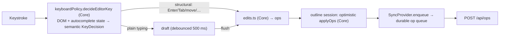
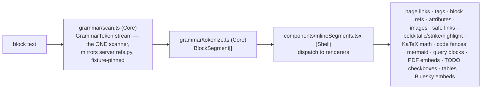

# Frontend architecture (web/)

The frontend is a React 18 + Vite single-page app: an offline-capable,
real-time-synced Roam-style outliner. Two things shape almost every file:

1. **FCIS is machine-enforced.** Every runtime module declares
   `// pattern: Functional Core` or `// pattern: Imperative Shell`;
   `pnpm check:fcis` (`web/tooling/fcis.mjs`) fails if a Core module imports
   a Shell. Most subsystems are a pure state machine ("core") plus a thin
   React/worker/fetch "shell" that gathers inputs, dispatches, and runs the
   returned effects.
2. **The server is the source of truth for shapes.** API types are generated
   from the server's OpenAPI schema, the replica schema is generated from
   the server's DDL, and the Roam-markdown grammar is pinned to the Python
   parser by shared fixtures.

See [overview.md](overview.md) for the system picture and
[sync-and-offline.md](sync-and-offline.md) for the sync engine and replica in
depth — this doc covers them only from the UI side.

## Tech stack

| Concern | Choice |
|---|---|
| UI | React 18.3, react-router-dom 6.30 (v7 future flags), TypeScript 5.9 |
| Build | Vite 6, `vite-plugin-pwa` (Workbox service worker), pnpm (overrides in `pnpm-workspace.yaml` — pnpm 11 ignores `package.json` overrides) |
| Offline | `@sqlite.org/sqlite-wasm` (replica in a Web Worker on the OPFS SAHPool VFS) |
| Rendering extras (all lazy-loaded) | KaTeX (math), Mermaid (diagrams), react-pdf/pdf.js (PDF viewer), highlight.js (code) |
| Tests | Vitest + jsdom (enforced coverage), Playwright e2e, Testing Library, type-aware ESLint |
| API types | `openapi-typescript` via `pnpm gen-types` |

## Module map (`web/src/`)

```
web/src/
├── main.tsx / App.tsx        Shell        Entry; provider nesting (SyncProvider > Dnd >
│                                          Sidebar > BlockStamps); routes; the single
│                                          window keydown listener for the global chords
├── routeMeta.ts              Core         Path / top-bar label / browser title per
│                                          static route (see Views and navigation)
├── useRouteTitle.ts          Shell        The one route-aware document.title effect
├── blockStampsPref.ts        Core         Block-timestamps preference: key, guard, toggle
├── useBlockStampsPref.ts     Shell        Owns the single instance behind BlockStampsContext
├── uid.ts / uidCore.ts       Shell/Core   uid minting; the alphanumeric-first rule
├── theme.ts / useTheme.ts    Core/Shell   Theme cycle; data-theme stamping
├── styles.css                —            All styling — owned by styling.md
│
├── api/                      The typed HTTP layer (see API layer)
│   ├── client.ts             Shell        apiFetch: JSON, 401 → /login, offline gateway
│   ├── typedClient.ts        Shell        apiGet/apiPost/…, typed by the OpenAPI paths
│   └── openapi.json, types.d.ts (generated); ops.ts, payloads.ts (type-only re-exports)
│
├── grammar/                  Roam-markdown parsing (see Rendering pipeline)
│   ├── scan.ts               Core         THE scanner; mirrors server refs.py,
│   │                                      fixture-pinned
│   ├── tokenize.ts           Core         Token stream → BlockSegment[] for rendering
│   └── refs.ts, todo.ts, snippet.ts, markdown.ts, linkReference.ts — Core adapters
│
├── outline/                  The editor engine (see The editor)
│   ├── handlers.ts           —            OutlineHandlers, the command port (types only)
│   ├── outlineState.ts       Core         transitionOutline — the session reducer
│   ├── tree.ts               Core         applyOps; mirrors the server's op semantics
│   ├── edits.ts / keyEdits.ts  Core       Structural and in-block edit planning
│   ├── keyboardPolicy.ts     Core         Keystroke → semantic KeyDecision
│   ├── autocomplete.ts / refAtCaret.ts  Core  Completion contexts; live-caret rules
│   ├── slashCommands.ts / calendar.ts   Core  Slash commands; the /date month grid
│   ├── blockSelection.ts / history.ts / paste.ts / dnd.ts  Core  Selection, undo
│   │                                      history, outline paste, drag planning
│   ├── blockStamps.ts        Core         Stamp bands; which ops count as a change
│   ├── baseTextHash.ts       Core         Stamps update_text ops at build time
│   ├── missingPage.ts        Core         The missing-page policy (see State management)
│   ├── useOutline.ts         Shell        Implements OutlineHandlers
│   ├── outlineSessions.ts    Shell        Per-title shared sessions (see State management)
│   ├── useOutlinePageLoad.ts Shell        The shared single-page load controller
│   ├── useBlockDraft.ts      Shell        The focused block's draft session
│   ├── useAutocomplete.ts    Shell        The popup's shared state
│   ├── undoManager.ts        Shell        Undo/redo dispatch; re-stamps hashes at replay
│   └── caretDisplayLine.ts   Shell        Caret geometry reads
│
├── components/               ~45 Shell files: the editor's views (EditableBlockTree,
│   │                         BlockInput), inline renderers (InlineSegments, MathSpan,
│   │                         QueryBlock, BlockRef, MermaidDiagram, PdfViewer, CodeBlock,
│   │                         roamTable…) and chrome (TopBar, SidebarNav/Panel, SearchBar,
│   │                         OfflineIndicator, Composer, BacklinksSection, BacklinkGroupList,
│   │                         BlockRefBacklinksPopover, BlockMenu, DatePickerPopup…)
│   └── pure halves           Core         Beside their component: pdfViewerCore,
│                                          roamTableRows, backlinkFilter, groups, bluesky…
│
├── views/                    One Shell file per route (see Views and navigation);
│   │                         EditablePage = one editable outline, shared by the main
│   │                         pane and sidebar panels
│   ├── FileCardPopovers.tsx  Shell        /files card popovers: refs, description
│   └── filesCore.ts          Core         /files queries, MIME buckets, confirm text
│
├── assistant/                The chat panel UI (see The assistant panel)
│   ├── sse.ts                Core         Incremental SSE frame parser
│   └── client.ts / useAssistant.ts / AssistantPanel.tsx — Shell: stream, state, panel
│
├── sync/                     Delivery + connectivity (see sync-and-offline.md)
│   ├── SyncProvider.tsx      Shell        The global context; reconnect ordering
│   ├── opQueue.ts            Shell        Durable-queue driver (+ queueState.ts Core)
│   ├── replicaSync.ts        Shell        Cursor pull loop
│   ├── socket.ts             Shell        WebSocket + reconnect
│   ├── syncState.ts          Core         Editability/health FSM
│   └── assets.ts             Shell        Multipart upload
│
├── replica/                  The offline engine (see sync-and-offline.md)
│   ├── worker.ts / workerHandlers.ts  Shell  The worker; db()'s latched open
│   ├── rpc.ts / client.ts    Shell        Typed RPC over the worker port
│   ├── queue.ts / apply.ts / reconcile.ts / recoveryGate.ts  Shell  Pending ops, feed
│   │                                      apply, negative-id remap, recovery FIFO
│   ├── localApi/             Shell        Offline read shims: the routes' exact JSON
│   ├── localOps.ts           Shell        Optimistic apply (server timestamp rules)
│   ├── errors.ts             Core         The availability taxonomy
│   ├── openRetry.ts / poolCapacity.ts  Core  OPFS open policy
│   ├── titles.ts             Core         Title canonicalization
│   └── baseSchema.gen.ts     —            Generated from the server's BASE_DDL
│
├── dnd/                      Shell        Drag-and-drop context + drop zones
└── contexts.ts, sidebar.ts, paths.ts, router.ts, help/ — small shared modules
```

## Views and navigation

There are seven routes:

| Route | View |
|---|---|
| `/` | Journal — an infinite scroll of daily pages |
| `/page/*` | PageView — one page |
| `/current-work` | Recently edited pages |
| `/files` | The asset browser |
| `/settings` | Whole-database export, and future settings |
| `/help` | The static keyboard-shortcut doc |
| `*` | NotFound |

### One table for route metadata

`routeMeta.ts` holds the path, top-bar label and browser title for every
static route. Three places read it: `App.tsx`'s `<Routes>` and `NavLink`s,
TopBar's label and page-action-menu gating, and `useRouteTitle.ts` — the
single route-aware `document.title` effect, called once from `App`. A route
therefore cannot end up labelled in one place and not another, which is how
`/files` and `/settings` once shipped with no top-bar label.

`routeMetaFor` strips trailing slashes from non-root static paths before
lookup, so a hand-typed `/files/` or `/settings/` still gets the canonical
label and title. `/page/*` and the not-found catch-all are the two routes
with no entry: `/page/*` is dynamic, so `PageView.tsx` sets its own title
once the page's title has loaded, which the pathname alone cannot give it.

### Navigation chrome

The left nav holds the pinned pages (server-persisted through `/api/sidebar`),
then a rule-fenced block of app destinations — Assistant, Files, Settings —
and the theme toggle.

The right-hand sidebar is a session-only **stack**: shift-clicking any page
link or ref pushes a `SidebarPanel` onto it.

**No link in the left nav may leave shift-click to the browser.** react-router
ignores modified clicks (`shouldProcessLinkClick` bails on `shiftKey`), so a
bare `NavLink` hands the shift-click to the browser instead of opening the
sidebar. Both nav link components therefore handle it, and new nav links must
use one of them rather than `NavLink` directly:

- `NavPageLink` — destinations that *are* pages (the pinned entries, TODO):
  opens the page in the sidebar, same contract as `PageLink` inline.
- `NavRouteLink` — destinations that aren't (Daily Notes, Current Work, Files,
  Settings): swallows the click and does nothing. A panel renders a page *by
  title* and no page sits behind these routes, so there is nothing better to
  offer; it also leaves `onNavigate` unfired, so a phone drawer stays open
  rather than closing onto nothing.

Four global keys, all in one `window` keydown listener in `App.tsx`:
`Ctrl+Shift+D` jumps to today's daily note, `Cmd/Ctrl+/` toggles the sidebar,
`Cmd/Ctrl+J` toggles the assistant panel, and `Ctrl+Shift+T` toggles the
block-stamp column.

- **The Ctrl+Shift family exists because the Cmd forms never arrive.** macOS
  reserves `Ctrl+Cmd+D` for dictionary lookup, and the browser owns `Cmd+T`
  (new tab) and `Shift+Cmd+T` (reopen closed tab). In each case the page
  receives no keydown at all, so no handler can claim the chord. `Ctrl+Shift`
  is the fallback both of these landed on; plain `Ctrl+letter` is not
  available either, since `docs/keyboard.md` leaves the emacs-style bindings
  to the browser. Both Ctrl+Shift chords carry a `!e.metaKey` guard so adding
  Cmd doesn't also fire them.
- **No test can tell you a chord is swallowed.** jsdom and Playwright both
  deliver a synthetic keydown the real OS or browser would have eaten, so a
  green suite says nothing about whether a new global chord reaches the page.
  Confirm one by pressing it in the running app before merging. `Ctrl+Cmd+D`
  shipped and had to be replaced for exactly this reason.
- **These chords fire while a block is being edited**, because `BlockInput`
  does not `stopPropagation` on keydown and the listener is on `window`.
  Adding a propagation guard to the editor would silently break all four; the
  `App.test.tsx` coverage fires `Ctrl+Shift+T` on the textarea rather than on
  `window` to catch that.

`Ctrl+Shift+T`'s target is `blockStampsPref`, one global setting rather than a
per-page one. It stays live off page routes too: pressing it on `/files`
takes effect on the next page opened, even though the page menu only offers
the item on `/page/*`.

The main pane and a sidebar panel can show *the same page at the same time*.
That fact drives the outline-session design below.

### The `/files` browser

`/files` is a plain table over `/api/assets/search`, with filters (text over
filename and description, type, date range, linked/orphan), offset pagination,
and multi-select for delete and zip export.

Cards are interactive. An image thumb expands in the shared
`ImageOverlay` (extracted from `AssetImage`). The refs and described/failed
status badges open popovers (`views/FileCardPopovers.tsx`): the refs popover
fetches block text through `GET /api/block-refs` — chunked at its 50-uid cap
by `filesCore.refUidChunks` — and renders through `BacklinkGroupList`, the
same single renderer the backlinks surfaces use. Media inside popover rows
renders inert (`InertMediaContext`), so the whole row stays a click target.
`orphan` and `pending` badges stay inert spans.

Pagination has two guards. A synchronous single-flight lock, alongside the
disabled button state, stops a double click issuing two page requests; a
generation guard discards responses that a filter change has made stale.

Its pure half, `views/filesCore.ts`, owns the typed query-object building,
MIME categorisation, size formatting, confirm-text composition, the
reference token a user can copy into a block, and the ref grouping behind
the refs popover (`refGroups`, `refUidChunks`). `typedClient` serializes the
query; the shell owns fetching, selection state and the download.

The zip export is submitted as a throwaway hidden `<form method="post">`
rather than a fetch, so the browser owns the download instead of the SPA
buffering it.

### Journal day references

Journal days render their own linked references inline
(`JournalDayReferences`), lazily per day, hidden when a day has none. This
reuses `BacklinksSection` rather than adding a second renderer.

## State management

There is no Redux/Zustand; state lives in three layers:

1. **Server payloads per view** — components fetch JSON through the typed
   client (`apiGet`/`apiPost`/`apiPut`/`apiDelete`) and hold results in
   local state, refetching when told to.
2. **`SyncProvider`** (`sync/SyncProvider.tsx`) — one global context:
   connection status, editability, pending-op count, delivery-health
   `problem`, `enqueue()`, and `resyncSeq` — a counter bumped whenever
   server state may have diverged (reconnect after a gap, repair finished).
   Views subscribe via `useResync(fn)` and refetch on each bump.
3. **Per-title outline sessions** (`outline/outlineSessions.ts`) — the block
   tree's home, and the most intricate module in the app. A module-level
   `Map<title, Session>` external store hands every view of a title one
   ref-counted session, sharing a flushed tree and a monotonic revision.
   Exactly one view holds the **editor lease** and the others render
   read-only, so the same page in the main pane and the sidebar cannot
   double-edit. The session also tracks causality between optimistic writes
   and authoritative reads: a fetched payload carries a `ReadToken` and is
   adopted only if it is the newest request, the revision is unchanged, and
   no relevant write ticket is unsettled. Otherwise it is retained and
   reconsidered after settlement. The pure reducer behind it is
   `outlineState.ts::transitionOutline`.

Driving a session correctly from a view is subtle, so the two **single-page**
surfaces share one implementation of it: `outline/useOutlinePageLoad.ts`,
used by `PageView` and `EditableSidebarPanel`. The hook owns the whole read
lifecycle: one outstanding generation per mount, the parent readiness promise
a `"parent"` read publishes through, the authoritative loader and parent read
controller registered on the session, and the cleanup order at unmount. It
returns just `{payload, error, reload}`. The two surfaces
differ only in presentation and in where they scroll. A second copy of this
controller is how they silently drifted apart before.

The Journal is the third surface showing editable outlines, and does not use
the hook: it loads many days in one batched `/api/journal` request and
delivers each day's blocks through its own capture-ticket path.

What a *failed* read means is a policy decision, not something each surface
reimplements. The pure `outline/missingPage.ts::substituteMissingDaily` turns
a 404 on a daily title into an empty editable page, because a daily nobody
has written to yet is not an error anywhere it is displayed. The server
auto-creates only today's daily; the first edit creates every other one's
row. Every other missing page stays an error. `reload("resync")` is how `PageView` answers a
`resyncSeq` bump; the sidebar does not subscribe to resync.

The block tree itself is the generated `BlockNode` shape (recursive
`{uid, text, children[], order_idx, heading, collapsed, view_type}`). All
mutations go through the pure `applyOps` (`outline/tree.ts`), which mirrors
the server's op semantics — the same ops drive the screen, the replica, and
the server.

## The editor

**Textarea-based, not contenteditable.** Only the focused block is a live,
auto-growing `<textarea>` holding raw markdown; every other block is
rendered HTML (`EditableBlockTree` → `EditableBlock` → `BlockInput`, the last
of these its own file). This is the central performance decision: a 500-block
page is one textarea plus cheap static HTML.

Rows with incoming `((uid))` references carry a count badge
(`RefCountBadge`, between the text and the stamp cell). The counts arrive as
`block_ref_counts` on the page/journal payloads and reach the tree as the
`refCounts` prop — PageView and Journal pass it; sidebar panels stay bare,
like `stamps`. Clicking the badge opens `BlockRefBacklinksPopover`, which
fetches `GET /api/block/{uid}/backlinks` at open — the list is live truth
while the badge count is payload-fresh, with no reconciliation between them.
The popover renders through `BacklinkGroupList`, the one renderer for
backlink-group markup, shared with `BacklinksSection` and the `/files` refs
popover. Navigation is
read-only-safe, so the badge and popover render in `fallback` trees too.
After render the popover measures itself and clamps its fixed position into
the viewport (`popoverPosition.ts`) — the badge anchors at the right end of
its row, and an overflowing `position: fixed` element grows no scrollbar to
recover it.

**Which way the editor's dependencies point.** Everything the UI can ask the
editor to do is the `OutlineHandlers` port in `outline/handlers.ts` — about
thirty named callbacks (focus, draft, split/indent/move, selection, upload,
paste, undo). `useOutline` implements it; `EditableBlockTree`,
`EditableBlock` and `BlockInput` only call it. The port lives in `outline/`,
not in a component, so the engine never imports a type from UI code. It stays
a plain callback interface
rather than a command union plus dispatcher, because every member is already
a distinct, individually-typed operation — a union would add a second name
and a switch case per member without removing one.

No component holds block-tree state. The most any of them owns is
`BlockInput`'s *draft* of one block's text, plus the transient popup offsets
around it. `outline/useBlockDraft.ts` tracks the value, its dirty flag, IME
composition, adoption of committed text over a clean draft, and caret
restoration after a programmatic value swap.


```mermaid
flowchart LR
    K[Keystroke] --> KP["keyboardPolicy.decideEditorKey (Core)<br/>DOM + autocomplete state → semantic KeyDecision"]
    KP -->|structural: Enter/Tab/move/…| OPS["edits.ts (Core) → ops"]
    KP -->|plain typing| D["draft (debounced 500 ms)"]
    D -->|flush| OPS
    OPS --> S["outline session: optimistic applyOps (Core)"]
    S --> Q["SyncProvider.enqueue → durable op queue"]
    Q --> API["POST /api/ops"]
```

Editing mechanics to know before touching `outline/`:

- **Draft vs key-edit paths.** Plain typing debounces into a draft
  (`TEXT_DEBOUNCE_MS` = 500 ms). Structural edits, blur, undo, tab-hide, and
  in-editor navigation (`onFlushDraft`) flush the draft first. Drafts are
  *flush-held* while the caret sits inside a half-typed `[[ref` or `#tag`
  token, so autosave cannot create a page from a partial title. Anything that
  mutates text programmatically must ride this draft/key-edit path, and must
  not poke the tree directly.
- **A flush-held draft has no timer, so navigation is a commit point.** An
  ordinary debounced draft survives an unmount: nothing cancels the pending
  `setTimeout`, so it still fires and flushes after the outline is gone. A
  *held* draft has no armed timer at all — its only exits are the explicit
  commit points above — and React delivers no blur for a node it removes.
  Two defences are needed, one per navigation trigger:

  | Trigger | Defence |
  |---|---|
  | Navigation the editor never sees: App's global `Ctrl-Shift-D` chord, browser back/forward | `useOutline` flushes on unmount — unmount-only on purpose (the callback is held in a ref, not a dep), enqueuing into the durable op queue after the outline's session handle is already released. Nothing is left to render into, and durability is the queue's job anyway |
  | Navigation the editor starts itself: `Ctrl-O`/`Ctrl-Shift-O` over a `[[ref]]` (`ensureRefPageThenOpen`) | Calls `handlers.onFlushDraft()` explicitly, before both `POST /api/pages` and the navigation — the flush is what creates the ref's page row through the normal ops path, so the unmount defence alone would race it |

  Clicking a rendered ref is not affected: only unfocused blocks render
  links, so reaching one blurs the textarea first. Tab hide, close and reload
  are covered by the `visibilitychange` flush.
- **Keyboard policy is a pure function.** `decideEditorKey` (a focused
  block's textarea) and `decideSelectionKey` (a multi-block selection, keyed
  by the tree container since there is no textarea) each return a semantic
  decision that `EditableBlockTree.onKeyDown` and `BlockInput` execute. All
  DOM effects stay in the shell. New shortcuts are added to one of these two
  functions — Cmd-letter wraps go in `decideEditorKey`'s `META_WRAP_EDITS`
  table — never as ad-hoc event handlers. The full shortcut list is owned by
  [keyboard.md](../keyboard.md).
- **A growing text selection escalates to a block selection at the block's
  edge**, whether the caret is collapsed or a text selection can no longer
  grow within the block. It must never fall through to the boundary-arrow
  block-navigation branch instead, which would silently drop the selection.
- **Creating, extending and copying a selection are read-only-safe; every
  mutating branch is gated on `!readOnly`** — indent/outdent (Tab/Shift-Tab),
  move (Shift+Cmd+Arrow), and delete (Backspace/Delete). `useOutline`'s
  handlers do not re-check editability, so this gate is the only one. A
  gated key resolves to `"none"`, which the
  shell leaves **uncancelled** rather than calling `preventDefault`, so a
  read-only Tab still moves focus out of the tree the way the platform
  intends.
- **The autocomplete popup is shared state, and its caret is read live.**
  `outline/useAutocomplete.ts` holds the open completion context and the
  highlighted row for both the outline editor's `BlockInput` and the phone
  `Composer`. The pure detection and staleness rules are in
  `outline/autocomplete.ts`, and which keys the popup may claim is
  `keyboardPolicy.autocompleteKeyAction` — unmodified Arrow/Enter/Tab/Escape
  only, so Cmd/Ctrl/Shift/Alt chords stay with the platform and the editor.

  The invariant to protect: **no action ever uses a remembered caret.**
  Context is detected on input, but clicks and selection-only caret moves
  fire no input event. So every action path (keydown, click, mouse pick) goes
  through `resolve(textarea)`, which re-derives the context from the live
  selection, closes the popup when it no longer matches, and returns the
  caret to splice at. A stale popup therefore claims nothing: Enter stays a
  split, Tab stays an indent, and a completion cannot land at the offset the
  caret has left.

  `resolve` must not be called from `keyup`. Both editors place the caret
  after a key-edit inside a `requestAnimationFrame`, and keyup always lands
  inside that window, where every context looks stale.
- **Paste is opt-in structural, and the modifier is captured on keydown.**
  Plain Cmd-V is always left native: it inserts text into the textarea and
  nothing else. `Shift-Cmd-V` *arms* an outline paste. `paste.ts` (Core)
  parses the clipboard into a forest by comparing indent widths ordinally
  with a stack — 2-space, 4-space and tab clipboards all work unconfigured —
  and plans the whole splice as one op batch.

  The arm exists because `ClipboardEvent` carries no modifier state. The
  chord is recorded in a ref on keydown, without `preventDefault` (or the
  browser's own paste would never fire), and consumed by the next `paste`
  event, which also requires the clipboard to actually have structure. One
  arm serves exactly one paste. E2E tests must arm via a synthetic keydown:
  pressing the real chord pastes whatever is on CI's clipboard.
- **Slash commands** dispatch to block-type, heading and query constructors;
  the full command list is in
  [keyboard.md](../keyboard.md#slash-commands). `/date` opens
  `DatePickerPopup` over the month grid computed by the pure `calendar.ts`
  (Monday-first, whole weeks, adjacent-month days marked). Command labels are
  lowercase by convention, and `slashCommandsDocumented.test.ts` fails if a
  new command isn't documented there.
- **Remote edits vs local draft.** Authoritative text lands on the tree even
  for the focused block, but the textarea keeps the local draft — per-block
  last-write-wins, consistent with the server's model.
- **The bullet is a button, and the block menu's only keyboard route.** The
  `.bullet` span in `EditableBlockTree` carries `role="button"`,
  `tabIndex={0}`, `aria-label="Open block menu"`, `aria-haspopup`,
  `aria-expanded`, and an `onKeyDown` for Enter / Space / ContextMenu /
  Shift-F10 alongside its click, contextmenu and drag handlers. Every
  `onOpenMenu` call site is on that span, and `keyboardPolicy` has no menu
  shortcut, so removing its tab stop removes keyboard access to Copy block
  reference and the view modes entirely. Its focus styling is constrained
  too — see
  [styling.md](styling.md#focus-and-interactive-affordances).

  In `EditableBlockTree` fallback mode (`fallback=true`), bullets are inert
  spans with no role, tab stop, menu, focus, upload, selection or drag
  handlers, and chevrons are disabled. The same renderer therefore displays
  the live shared outline without a second editing implementation.
- Phones get a bottom **Composer** (append-to-daily-note) instead of full
  outline editing.

**`set_collapsed` must not stamp.** `opBumpsUpdatedAt` (outline/blockStamps.ts)
is the single statement of the rule that collapsing is a view toggle,
not a change. `transitionOutline` uses it to decide which uids to stamp, and a
test in `replica/localOps.test.ts` asserts the replica's own writes agree
op-for-op — so the displayed date and the stored date cannot drift apart.

## Rendering pipeline (read path)

Block text is raw Roam-flavoured markdown; rendering is a two-stage pure
pipeline feeding a component dispatcher:


```mermaid
flowchart LR
    T["block text"] --> SC["grammar/scan.ts (Core)<br/>GrammarToken stream — the ONE scanner,<br/>mirrors server refs.py, fixture-pinned"]
    SC --> TK["grammar/tokenize.ts (Core)<br/>BlockSegment[]"]
    TK --> IS["components/InlineSegments.tsx (Shell)<br/>dispatch to renderers"]
    IS --> R["page links · tags · block refs · attributes ·<br/>images · safe links · bold/italic/strike/highlight ·<br/>KaTeX math · code fences + mermaid · query blocks ·<br/>PDF embeds · TODO checkboxes · tables · Bluesky embeds"]
```

- `scan.ts` is the single grammar authority on the client: balanced `[[...]]`
  via an explicit stack, code spans blanked first. `tokenize.ts`, ref
  extraction, TODO detection, autocomplete and slash commands are all thin
  adapters over it. It is pinned to the Python parser by
  `shared/fixtures/ref_grammar.json`.
- Heavy renderers (KaTeX, Mermaid, pdf.js, highlight.js) are lazy-loaded
  behind cached module-level `import()` promises, so they stay out of the
  eager bundle. Their budgeted chunks are still precached, so they work
  offline.
- Link hrefs are sanitized (`isSafeHref` rejects `javascript:` and
  protocol-relative URLs); Mermaid runs in strict mode.
- `PdfViewer` guards its load/reset race with a generation counter. When
  `href` changes it resets `doc`/`failed`/`expanded`/`currentPage` and bumps
  the counter **synchronously during render**, not in an effect, and every
  load callback compares its captured generation before writing state. An
  effect would be too late: effects fire child-before-parent, so a `Document`
  child that resolves synchronously can call `onLoadSuccess` before the
  parent's reset effect runs.

## Sync and offline (UI-side summary)

The full protocol is in [sync-and-offline.md](sync-and-offline.md). What a
frontend contributor needs day-to-day:

- Edits are optimistic: apply to the outline session, enqueue to a durable
  queue (`pending_ops` rows in the replica DB), deliver FIFO to
  `POST /api/ops`. A `WriteTicket` distinguishes *persisted locally*
  (`settled`) from *acknowledged by server* (`delivered`).
- `api/client.ts::apiFetch` installs an **offline gateway**: when the socket
  is down, or a live fetch throws, reads route to
  `replica/localApi/router.ts` — TypeScript ports of the server's read routes
  returning identical JSON (pinned by `shared/fixtures/shim_parity.json`).
  Unshimmed routes throw `OfflineError`, and their UI says "online only".
- Pages created offline get negative ids, remapped by
  `replica/reconcile.ts` when the authoritative row arrives. When title
  canonicalization activates, the same shell canonicalizes or merges padded
  negative-id pages before pending replay, preserving their blocks, refs and
  unchanged wire operations without leaving divergent padded pages.
- `OfflineIndicator` renders both connectivity state and every *delivery
  problem* `SyncProvider` raises (rejected batch, failed poison marking or
  discovery, replica unavailable). The banner copy is deliberate — several
  wordings encode what is and is not true of the user's unsent work — so it is
  documented with the mechanisms that decide it, in
  [sync-and-offline.md](sync-and-offline.md#the-replica-and-its-recovery-invariants),
  not here. Change the copy there too.
- The service worker (Workbox, configured in `vite.config.ts`) precaches the
  app shell, sqlite wasm, the pdf.js worker and core KaTeX fonts,
  runtime-caches `/assets/` (CacheFirst, 400-entry LRU), and never caches
  `/api`.

## The assistant panel

`src/assistant/` is the UI for the server-side LLM assistant; the agent
itself runs on the server (see
[assistant-and-files.md](assistant-and-files.md#embedded-assistant-pkmassistant)). It is a floating
chat panel, toggled with `Cmd/Ctrl+J` (Esc closes) or the "Assistant" sidebar
entry.

- The conversation is created lazily on the first message. The model dropdown
  (`sonnet` default / `opus` / `haiku`) locks once it exists. "New chat"
  deletes the server-side conversation and resets. Conversations are
  ephemeral: a reload loses them.
- "New chat" is safe mid-turn. Each turn carries a generation counter, and
  `newChat` bumps it before clearing state, so a superseded turn's SSE events
  and finalizers are dropped instead of refilling the fresh transcript,
  resetting its status, or re-raising its confirm card. It then aborts and
  awaits that turn before `DELETE`ing the conversation, and a conversation
  whose creation resolves after the bump is closed rather than adopted.
  Abort-controller cleanup is identity-checked, so a newer turn stays
  stoppable.
- A turn streams over SSE. `client.ts::streamMessage` POSTs the message and
  feeds the response body through `sse.ts` (a pure incremental frame parser)
  into `useAssistant.ts`, which folds events into chat items: `text_delta`
  appends to the running assistant bubble, `tool_started`/`tool_finished`
  render tool-activity lines ("searching …"), and `confirm_request` shows an
  Allow/Deny card with the write's ops preview. The tool call is held
  server-side until answered.
- `sse.ts` drops any frame whose `event:` name is not one of the six known
  types. That is what makes the server's keepalive comment frames, sent every
  15 idle seconds, invisible here. Keep it that way.
- `streamMessage` bypasses `apiFetch` (which consumes the body as JSON) but
  replicates its 401 handling; the other assistant JSON calls use the typed
  client helpers. The assistant is online-only — `/api/assistant/*` has no
  offline shim.

## API layer

`apiFetch<T>` handles JSON, the 401 → `/login` redirect, and the offline
gateway. Types come from the generated `api/types.d.ts` (`pnpm gen-types`
over `api/openapi.json`, which the server generates); `api/ops.ts` and
`api/payloads.ts` are type-only re-exports. **Never hand-write API types** —
regenerate when the server changes, since the server test suite fails on
stale artifacts.

Concrete JSON requests must use `api/typedClient.ts`'s `apiGet`/`apiPost`/
`apiPut`/`apiDelete`. ESLint enforces that boundary with
`no-restricted-imports`: production and tooling code cannot import `apiFetch`
from `api/client` except at raw transport seams.

The typed client is a typing layer over `apiFetch`, not a second transport.
It builds the same URL and calls `apiFetch`, so the offline gateway and error
behaviour are identical. The difference is that it takes the **OpenAPI path
template** rather than a built URL:

    apiGet("/api/page/{title}", { path: { title } })

That lets the generated `paths` table decide the path and query parameters,
the JSON request body, and the response type. `apiFetch<T>`
cannot do that: `T` is whatever the caller names, so an obsolete caller type
or a wrong body still typechecks.

Three raw `apiFetch` exceptions exist: the typed-client implementation
itself, multipart upload in `sync/assets.ts`, and `SyncProvider.tsx`'s
`replicaSync` injection seam (`fetchJson: apiFetch`). `SyncProvider` is
allowed for that transport injection only; it does not issue a concrete JSON
request at the import site.

Path parameters are encoded per segment, because `{title:path}` routes carry
namespace titles whose slashes must survive; every other path parameter is
slash-free by construction. Compile-time drift probes live in
`api/typedClient.test.ts` — an expected-error directive that stops erroring
fails the build, so the probes cannot rot.

## Styling

Plain CSS in a single `src/styles.css` — no framework, no CSS-in-JS.
The design tokens, control families, confirmation pattern and
focus/affordance invariants are owned by [styling.md](styling.md), which
also carries their symptom table. A new control opts into a named class
there; nothing inherits a look silently.

## When something looks wrong

Each row is a failure this system has actually produced, and the invariant
its fix installed. The bean has the full investigation.

| Symptom | Cause | Ref |
|---|---|---|
| Shift-clicking a left-nav page link opens a second browser window instead of the sidebar | a bare `NavLink` let the browser's own shift-click run, since react-router ignores modified clicks; every left-nav link must go through `NavPageLink` or `NavRouteLink` | pkm-10ah |
| Navigating to a freshly created `[[ref]]` with Ctrl-O/Ctrl-Shift-O leaves the source block empty, its typed text gone | the unmount-only draft flush raced `POST /api/pages`; `ensureRefPageThenOpen` must flush the draft explicitly before creating the page and navigating | pkm-hhbc |
| Shift-Up/Down with a text selection active at a block's edge collapses the selection and jumps focus to the neighboring block | the boundary-arrow branch excluded Meta/Ctrl/Alt but not Shift, so a growing selection fell through to block navigation instead of escalating to a block selection | pkm-jgtn |
| A multi-block selection made while editable stays deletable after the outline switches to read-only | Backspace/Delete invoked `onDeleteBlockSelection()` unconditionally; every mutating selection branch must gate on `!readOnly` | pkm-rckh |
| The references popover renders clipped off the right window edge, and no scrollbar appears to reach it | its fixed position applied the badge anchor verbatim; the popover must clamp its measured rect into the viewport (`popoverPosition.ts`) | pkm-7iv7 |

## Testing and quality gates

`pnpm verify` runs the gates in cost order:
**typecheck → lint → check:fcis → test:coverage → budget-enforced build →
Playwright e2e against that build.**

- **Unit** (Vitest + jsdom): co-located `*.test.ts(x)`;
  `src/test-setup.ts` stubs WebSocket/matchMedia/localStorage. Coverage is
  enforced (statements 95 / branches 91 / functions 89 / lines 95), with
  workers and generated files excluded. The pure cores are the payoff of the
  FCIS split: they test with no React, DOM, fetch, worker or SQLite mocks.
- **E2E** (Playwright, `web/e2e/`): ~27 specs — editing, backlinks, math,
  rename, undo, embeds, images, PDF, outline paste, slash dates, journal
  references, the assistant, the `/files` browser, and two offline specs.
  The harness is strict: any HTTP 5xx fails the run (`fixtures.ts`), and a
  server-side exception fails teardown. `e2e/server-state.ts::waitForServerText`
  polls the server's copy of a page, which is the reliable way to wait for a
  write before a reload. The server is launched by `playwright.config.ts`
  (`server/tests/e2e_serve.py`, port `E2E_PORT`, default 8975).
- **Lint** (flat, type-aware ESLint): only two rule families, on purpose —
  React Hooks correctness, and promise/error safety
  (`no-floating-promises`, `no-misused-promises`, `only-throw-error`, unknown
  catch variables). There are zero `eslint-disable` comments in `web/src`.
- **Budgets** (`web/tooling/budgets.json` + `viteBudgetPlugin.ts`): the build
  fails if the eager entry, largest asset, total output, service-worker
  precache, or the per-library owned bytes (mermaid/pdfjs/katex chunk
  families, attributed by Rollup module reachability) exceed their caps.
  Growing the bundle is an explicit, reviewed decision.

## Build notes (`vite.config.ts`)

The dev server proxies `/api` (with WebSocket), `/assets` and `/login` to
the backend (`PKM_API_PORT`, default 8974), so run the server alongside
`pnpm dev`. `@sqlite.org/sqlite-wasm` must stay in `optimizeDeps.exclude`,
because its wasm URL resolution breaks under dep-optimization. Hashed bundles
are emitted under `app-assets/`. The PWA plugin uses `autoUpdate` with
`clientsClaim`/`skipWaiting` and a navigate-fallback denylist for
`/api|/assets|/login`.
