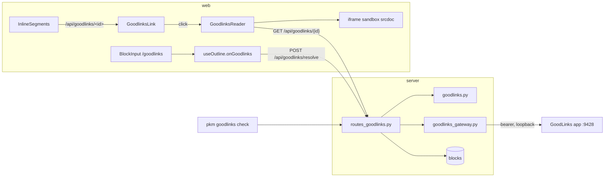

# GoodLinks copies

Archived web pages live in GoodLinks, Arthur's read-later app. A block notes
the copy with an ordinary markdown link whose href the app recognises:

    Local copy:: [Goodlinks](/api/goodlinks/<32-hex id>)

The renderer keys on the href — the `/api/goodlinks/` prefix plus a 32-hex
GoodLinks link id — never on the link text, so an inline
`([copy in Goodlinks](/api/goodlinks/<32-hex id>))` opens the same reader as
a `Local copy::` attribute.

## Why a proxy

GoodLinks' local API listens on `localhost:9428`, the host Mac's loopback
interface only. The iPad reaches it the way it reaches `/api/local/`: through
the server, which holds the bearer token and forwards requests via
`goodlinks_gateway.py`. That means the GoodLinks app itself must be running
on the host for any of this to work; when it is not, `GoodlinksGateway`
raises `GoodlinksUnavailable` and every route answers 503. A GoodLinks 404 on
a read (an unknown link) passes through as an ordinary 404; a GoodLinks 4xx
on a save is a distinct case, `GoodlinksRejected`, carrying its text.

When no API key is configured at all, `app.state.goodlinks` is `None` and
`get_goodlinks` turns every route except `check` into a 404. A client has no
way to tell "feature disabled" apart from "link not found" — by design,
since nothing about a page's rendering should depend on whether the operator
has wired up GoodLinks.

## Routes

| Method | Path | Behaviour |
|---|---|---|
| POST | `/api/goodlinks/resolve` | Resolve a URL to a GoodLinks link; with `save: true`, save it (read-marked) when nothing matched |
| GET | `/api/goodlinks/check` | Every `/api/goodlinks/` href in block text, `ok` / `missing` / `invalid` against the library; `enabled: false` without an API token |
| GET | `/api/goodlinks/{link_id}` | Metadata plus allowlist-sanitised reader HTML, `no-store`; 404 for a bad id or unknown link, 503 when GoodLinks is not running |

`resolve` tries, in order: the URL exactly, the URL with its query string and
fragment stripped (`candidate_urls`), then a GoodLinks search against the
stripped form. A search result only counts when exactly one hit's URL equals
a candidate or extends it with a `?` or `#` remainder (`search_match`); two
hits is ambiguity and a miss, not a guess. Only once all three fail, and only
when the caller asked for it with `save: true`, does resolve save the page —
always read-marked. Lookup and search always run before save, so an existing
link's read date is never bumped by opening a page that is already archived.

## Two barriers for third-party HTML

`GET /api/goodlinks/{link_id}` is the only route that returns HTML the
application did not write itself: GoodLinks' own reader-view extraction of
the page. Two independent barriers stand between that HTML and the browser.

The server reduces it with `sanitize_article` (`goodlinks.py`, via `nh3`) to
an explicit tag and attribute allowlist — headings, lists, tables, `a`,
`img`, basic inline formatting — with a `"*": set()` entry that closes off
`nh3`'s default generic attributes (`lang`, `title`, `dir`, …), so nothing
survives that isn't named for its specific tag. `url_relative="deny"` drops
any relative or protocol-relative URL along with its attribute; a relative
URL inside a `srcdoc` iframe would resolve against the app's own origin, so
this is not cosmetic. In practice it means article images and links must be
absolute `http`/`https` URLs, or they disappear. Every surviving anchor gets
`target="_blank"` and `rel="noopener noreferrer"`.

The web reader then renders that already-sanitised HTML only inside
`<iframe sandbox="allow-popups allow-popups-to-escape-sandbox" srcdoc>`
(`goodlinksReaderDoc.ts`). It is the one place third-party HTML reaches the
DOM at all — the app's other uses of `dangerouslySetInnerHTML` (Mermaid,
KaTeX, syntax-highlighted code) render markup the app generated itself, not
content from an external source. Even HTML that slipped the server allowlist
would run no script and have no access to the app's origin or cookies inside
that sandbox.

Neither barrier may be widened for convenience: a tag or attribute that is
not listed is meant to disappear. Article images still load from their
original hosts; the article's text is archived by GoodLinks, but its images
are not. Opening a copy therefore reveals the reader's IP to those hosts,
the same as opening the article in GoodLinks itself.

## The reader

`GoodlinksReader` portals a full-screen overlay to `document.body`, like
`ImageOverlay`, and shares `ImageOverlay`'s dismissal behaviour through
`useOverlayDismiss`: a `window` Escape listener in the capture phase, Tab
pinned to the Close button, body scroll locked while open, and focus
returned to the button that opened it on close. `GoodlinksLink` keeps the
`onClose` callback it passes to the reader stable across re-renders
(`useCallback`), so the shared hook does not tear down and re-run
mid-session, which would bounce focus.

The bar shows the article title (or "Saved article" while loading or on
error), a link to the original URL, and the saved date, once the fetch
succeeds. On any failure the bar has no URL to show — the original URL only
ever arrives together with the sanitised HTML, in the same response — so
only a note and a working Close button are guaranteed.

| State | Shown |
|---|---|
| loading | "Loading…" |
| ok | the sanitised article inside the sandboxed iframe |
| error, GoodLinks not running (503) | "Goodlinks is not running on the Mac" |
| error, link no longer in GoodLinks (404) | "No longer in Goodlinks" |
| error, no response reached the server (status 0, e.g. offline) | "Needs the server" |
| error, anything else | "Couldn't load this article." |

## The /goodlinks command

`/goodlinks` follows `/upload`'s shape: `BlockInput.pick` strips the trigger,
records the cursor offset, and blurs the block before doing any network
work, flushing the draft the way `/upload` does. `useOutline.onGoodlinks`
then looks for a URL with `goodlinksCandidates`, checking this block's own
text, its parent, and its previous sibling in that order, and takes the
first match; no URL anywhere in those three gives the notice "No URL
nearby". It calls `POST /api/goodlinks/resolve` with `save: true` and
splices `Local copy:: [Goodlinks](/api/goodlinks/<32-hex id>)` in at the
recorded offset through `spliceUploadedMarkdown`, the same draft splice
`/upload` uses, refocusing the block only if it still owns focus.

Notices render in the page-level status slot beside the upload error
(`.editor-notice`, `role="status"`, with its own Dismiss button), not
attached to the block itself. The text is "Saved to Goodlinks" when the link
was just created, or a failure note from `goodlinksNotice`. That text is
independent of the reader's: `goodlinksNotice(503)` is "Goodlinks is not
running", `goodlinksNotice(422)` is "Goodlinks refused the URL" (a GoodLinks
save rejection), `goodlinksNotice(404)` is "Not in Goodlinks", `0` is
"Couldn't reach the server", and anything else is "Couldn't reach
Goodlinks". The command always resolves with `save: true`, so a plain 404
"not in Goodlinks" from resolve is normally never seen through this path —
only a caller that resolves without saving would see it.

## Failure table

| Case | Server | Reader | `/goodlinks` |
|---|---|---|---|
| Feature not configured (no API key) | every route 404 except `check`, which answers `enabled: false` | "No longer in Goodlinks" | "Not in Goodlinks" |
| GoodLinks app not running | 503, `"Goodlinks is not running on the host"` | "Goodlinks is not running on the Mac" | "Goodlinks is not running" |
| Link no longer in GoodLinks | 404 | "No longer in Goodlinks" | "Not in Goodlinks" |
| GoodLinks rejects a save | 422 with its own text | — (the reader never saves) | "Goodlinks refused the URL" |
| Resolve misses with `save: false` | 404 | — | not reachable through the command, which always saves |
| No response reaches the server (e.g. the iPad replica has no route for this) | — | "Needs the server" | "Couldn't reach the server" |

Every reader error state keeps Close working; every `/goodlinks` failure
still leaves the block and cursor untouched.

## Configuration and operations

`goodlinks_api_key_file` (default `../goodlinks_key`, relative to
`config.json`) holds the GoodLinks API token; `GOODLINKS_API_KEY` is the
environment fallback when the file is absent. `goodlinks_api_url` (default
`http://localhost:9428/api/v1`) is where the GoodLinks app listens. Neither
setting is required — an unconfigured token disables the feature rather than
failing startup.

`pkm goodlinks check` audits every `/api/goodlinks/` href in block text
against the GoodLinks library, the same shape as `pkm local check`: exit `0`
clean, `1` for problems found (including the case where GoodLinks is closed
on the host, which surfaces as the 503 turning into a CLI error), `2` when no
API token is configured.

The e2e suite (`web/e2e/goodlinks.spec.ts`) runs against
`server/tests/fake_goodlinks_server.py`, a minimal stand-in implementing
exactly the endpoints `goodlinks_gateway.py` calls: `GET /links` (by `url`
or `search`), `POST /links`, `GET /links/{id}` and `GET /links/{id}/content`.
It is seeded with one article whose HTML includes a `<script>` tag, so the
spec can assert the tag never reaches the rendered page.
