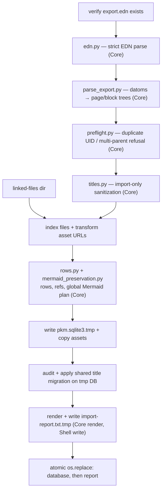

# Import, export and backup

The offline pipelines either side of the live server. `pkm.importer` builds a
complete database from a Roam EDN export, `pkm.export` renders a database back
out to markdown, and `pkm.backup` takes the nightly snapshot that the export
runs against. None of them is on a request path; two of them are also reachable
over HTTP as downloads.

The server, its write path and its API surface are in
[backend.md](backend.md). Failures and their fixes are indexed by symptom in
[troubleshooting.md](../troubleshooting.md).

## Importer (Roam EDN → fresh database)

`python -m pkm.importer.run export.edn --files <dir> --out <data-dir>`. Each
run builds a complete new database and atomically swaps it in, so re-running is
always safe.

Stage notes:

- **EDN parse.** Malformed input exits 2 with
  `error: malformed export at offset N: DETAIL`. The EDN-unsupported solidus
  escape `\/` stays invalid rather than being accepted for JSON/Logseq
  compatibility.
- **Preflight.** `preflight.py` refuses duplicate block UIDs and any block
  reached through multiple parents, reporting deterministic, sorted locations,
  before any output work happens.
- **Title sanitization.** `importer/titles.py` strips balanced `[[`/`]]` and
  `#` markers from every title and rewrites refs; collisions merge in stable
  source order, preferring an already-clean spelling as survivor. Malformed
  markers, or a title made blank, refuse the run.
- **Title migration.** Before publishing, the importer runs the same
  `audit_title_migration()` / `apply_title_migration()` shell as the operator
  route against the temp database, so `plain_space_title_canonicalization`
  arrives active and padded twins are merged through the normal rewrite path.
  A blocker refuses the run and leaves the published database untouched.
- **Timestamps.** `parse_export.py` copies each block's `:create/time` and
  `:edit/time`, and uids and sibling ordering survive the import, so every
  existing `((block ref))` and daily-note link keeps resolving.
- **Mermaid flattening.** Flattening a component's descendants into one fenced
  block drops their rows, so `mermaid_preservation.py` keeps any component with
  an inbound `((uid))` into its subtree — and every candidate ancestor
  containing one — as ordinary nested blocks. Fresh imports and the one-off
  `migrate_mermaid_blocks.py` migration share that core, and both report what
  they preserved (`Rows.mermaid_preserved_refs`; migration `Plan.preserved`).
- **Orphan blocks.** Every subtree Roam's export leaves unreachable from a page
  (`parse_export.py`'s `Export.orphan_blocks`, including fully cyclic ones) is
  attached intact under a deterministic
  `"Import recovery: unreachable blocks"` page (`rows.py`'s
  `RECOVERY_PAGE_TITLE`), so `((block ref))`s into it still resolve. Entities
  with no `:block/string` at all (`skipped_entities`) are counted.
- **Asset copying.** An existing content-addressed destination is verified
  against the source's size and sha256 and rewritten atomically on mismatch,
  through the same `assets_disk.asset_on_disk_needs_repair` check the export
  writer uses (see [Markdown export](#markdown-export)). The phase touches no
  database, so it runs inside the row-writing connection's lifetime rather than
  between two connections. `audit_title_migration` and `apply_title_migration`
  both refuse a connection that is already in a transaction, and the `commit()`
  before the copies is the only thing ending the implicit one the inserts
  opened.
- **Publication.** Two ordered atomic replaces, database first, then report. A
  failure before the first leaves the published pair untouched; a failure
  between them is repaired by the next successful run, and stale temps
  (`pkm.sqlite3.tmp`, `import-report.txt.tmp`) are swept at the start of the
  next build.

## Markdown export

`export/writer.py::export_graph` renders every page to
`export/pages/<title>.md` and dailies to `export/journal/YYYY-MM-DD.md`.
`markdown.py` resolves `((refs))` to text one level deep and keeps
`{{query: ...}}` macros as the raw command. Assets are mirrored incrementally.

It calls `refs.extract()` once per block (`collect_block_ref_uids`), so
`extract()` must stay linear. `extract()` strips leading whitespace in Python
before its attribute regex runs, and that regex never backtracks against a long
`::`-free run. A large fenced code block becomes exactly such a run once
`_strip_code()` blanks it.

An existing asset at its content-addressed path is verified against the
`assets` row's size and sha256 before being hardlinked into the new tree.
`assets_disk.asset_on_disk_needs_repair` does a cheap stat first and reads the
bytes for a full hash only once the size matches, then
`assets_core.asset_needs_repair` rules on the pair. The importer's asset copy
calls the same function, so neither side can drift out of that order. A
mismatch is re-copied from the live store.

| Outcome | Counter |
|---|---|
| fresh transfer succeeded | `assets_copied` |
| corrupt destination replaced | `assets_repaired` |
| repair source itself missing (asset dropped, `pkm.export` warning) | `assets_missing_source_on_repair` |

The export directory has one writer: each run sweeps abandoned
`.export-staging-*` entries before it writes `.gitignore` or anything else, so
no lock or age heuristic is needed. Matching symlinks are unlinked without
following their targets.

Markdown files are rewritten byte-identically when unchanged, so the git diff
of a nightly export is minimal. Rendering and asset copying happen into a
scratch `.export-staging-*` directory beside the live one, and the previous
`pages/`, `journal/` and `assets/` are replaced only once a full new export is
ready, via `_publish_dir`'s atomic directory rename. A rendering, disk or
asset-copy failure before publishing starts therefore leaves the last
known-good export byte-identical.

Publishing is three atomic renames, one per subtree, so a failure partway
through leaves a mixed old/new tree that the next successful run heals. The
not-yet-published subtree's old content survives under `<name>.stale`, and the
raised exception stops the nightly job git-committing the mixed state.

`routes_export.py`'s `/api/export.zip` runs the same `export_graph()` into a
temp directory and serves it zipped.

## Single-page export

`GET /api/export/page/{title}` (`routes_export.py` + `export/resolve.py`) is
the end-user download. It renders differently from the backup path: dynamic
content resolves to plain text, so the download reads like what a reader of the
live page would see.

- `((refs))` resolve recursively, not one level, and are inlined as plain text
  rather than wrapped in parens.
- `{{query: ...}}` and `{{[[query]]: ...}}` macros execute and render as a
  results list grouped by page. The path is the one live `/api/query` takes:
  `query.py`'s `parse_query`/`plan_sql`, then `query_exec.execute_plan`. Only
  the result shape differs: the export's own immutable types name pages by
  title alone.
- Depth caps match the live UI: `BlockRef.tsx`'s `MAX_DEPTH = 3` for refs,
  `QueryBlock.tsx`'s `MAX_DEPTH = 2` for nested queries.

Resolution and rendering are pure (`export/resolve.py`, given precomputed
uid→text and expr→results maps). The route gathers that data with a
depth-capped, cycle-safe breadth-first fetch, where a `visited` set stops a
cyclic `((ref))` chain from refetching forever; the caps alone only stop it
from *rendering* forever.

## Backup job

`python -m pkm.backup`, run nightly via launchd, takes an online SQLite
`.backup()` snapshot from a read-only connection into
`backups/sqlite/pkm-YYYY-MM-DD.sqlite3`. `rotation.py` prunes it to the newest
14 dailies plus the latest of each month, kept forever. It then runs the
markdown export from that same snapshot and git-commits it. Its success line
renders the complete export-count dictionary, including `assets_copied`,
`assets_repaired` and `assets_missing_source_on_repair`. The live database is
never opened for writing, and any failure exits non-zero.
