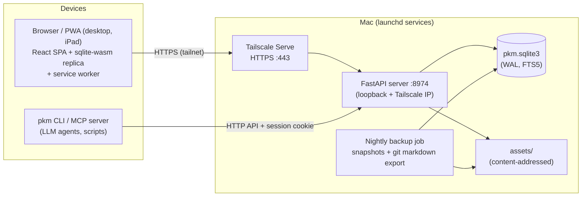

# PKM architecture overview

PKM is a single-user, self-hosted replacement for Roam Research: an
outliner-style notes app with daily notes, `[[page links]]`, backlinks,
full-text search, block references and locally hosted assets. It runs on a
Mac, is reached over Tailscale from other devices, and works fully offline
as an installable PWA.

This directory is the "get up to speed" layer. It describes the system as it
is; the *why* (trade-offs, rejected alternatives, per-feature designs) lives
in [`docs/design.md`](../design.md) and the specs under
[`docs/superpowers/specs/`](../superpowers/specs/).

| Doc | Covers |
|---|---|
| this file | System context, tech stack, repo layout, cross-cutting patterns, key decisions, deployment |
| [backend.md](backend.md) | FastAPI server: modules, database, write path, HTTP API reference, importer, backup, CLI/MCP |
| [frontend.md](frontend.md) | React SPA: modules, editor, rendering pipeline, state, styling, testing |
| [sync-and-offline.md](sync-and-offline.md) | The sync protocol and offline architecture, end to end |

## System context



One server process, one SQLite file, one assets directory. Every client —
browser, CLI, MCP — speaks the same HTTP API with the same session-cookie
auth, and every mutation goes through the single `POST /api/ops` write path.

## Core idea

**Server-authoritative, block-granular, no CRDTs.** The server's SQLite is
the single source of truth. Browsers apply edits optimistically and send
batches of block-level ops; a trigger-based change journal plus a client
cursor handles down-sync; a WebSocket only nudges. Per-block last-write-wins
(with losing text preserved as `[[conflict]]` blocks) is enough for one
person. Offline is a cache, not a fork: a sqlite-wasm replica plus a durable
op queue in each browser.

Two architectures were rejected up front — client-side graph with op-log
sync (Roam's own: you end up owning a sync protocol and its data-loss
modes) and markdown-files-plus-index (Obsidian-style: files fight stable
block uids). Portability comes instead from a nightly plain-markdown export.

## Repository layout

```
server/   Python backend: FastAPI app, SQLite storage, Roam EDN importer,
          markdown export, nightly backup, `pkm` CLI + MCP server
web/      TypeScript frontend: React + Vite SPA, sqlite-wasm offline replica,
          service worker, Vitest unit tests, Playwright e2e
shared/   Parity fixtures pinning the Python and TS parsers/APIs to
          identical behaviour (ref grammar, offline-shim JSON)
deploy/   launchd + Tailscale Serve deployment scripts for a Mac
docs/     design.md, this directory, per-feature specs and plans, SECURITY.md
.beans/   Issue tracker (beans) — one markdown file per work item
```

## Tech stack

| Layer | Choices |
|---|---|
| Backend | Python ≥ 3.12, FastAPI, Pydantic v2, raw `sqlite3` (WAL + FTS5, no ORM), uvicorn, `uv` |
| Frontend | TypeScript, React, Vite, sqlite-wasm (OPFS) replica, Workbox service worker, KaTeX, Mermaid, pdf.js |
| API contract | Pydantic models → OpenAPI → generated TS types (`pnpm gen-types`) — the block model cannot drift |
| Agent access | `pkm` CLI + MCP stdio server over the same HTTP API |
| QA | pytest (95% branch coverage enforced), pyrefly, ruff; Vitest (enforced coverage), tsc, ESLint, Playwright e2e, FCIS checker, bundle-size budgets |
| Ops | launchd services, Tailscale Serve (HTTPS), nightly backup: rotated SQLite snapshots + git-committed markdown export |

## Cross-cutting patterns

### Functional Core / Imperative Shell

The whole codebase follows FCIS: pure logic (op planning, ref extraction,
query evaluation, tree building, state transitions) lives in Functional Core
files; I/O (routes, SQLite, WebSocket, workers, React effects) lives in thin
Imperative Shell files that gather inputs, call the core, and persist
results. Every runtime file declares its role in a header comment:

```
# pattern: Functional Core        (Python)
// pattern: Imperative Shell      (TypeScript)
```

On the web side the boundary is **machine-checked**: `pnpm check:fcis`
(`web/tooling/fcis.mjs`) walks the import graph and fails on any
Functional-Core → Shell edge (type-only imports excepted). On the server it
is convention plus review. The canonical example is the write path: a pure
planner (`ops_core.plan_op`) between two thin shells (see
[backend.md](backend.md#the-write-path)).

Rules and the escape hatches (`Mixed (needs refactoring)` etc.) are in
`CLAUDE.md`; invoke the `howto-functional-vs-imperative` skill for
structural work.

### One grammar, two languages, pinned by fixtures

Roam-flavoured markdown (`[[links]]`, `#tags`, `Attr::`, `((block refs))`,
`{{[[query]]}}`, `{{TODO}}`) is parsed on both sides: `server/src/pkm/refs.py`
(the reference implementation, feeding the `refs` table) and
`web/src/grammar/scan.ts` (feeding rendering, autocomplete and the replica).
Fixtures in `shared/fixtures/` (`ref_grammar.json`, `refs_parity.json`) are
replayed by both test suites, so the two parsers cannot drift. The same
technique pins the offline API shim to the real routes
(`shim_parity.json` — byte-identical JSON) and the replica schema to the
server's DDL (`baseSchema.gen.ts`). **These artifacts are generated and
checked in; regenerating them is part of any change that touches them** —
the server test suite fails on staleness.

### Generated API types

The server's Pydantic response models generate `web/src/api/openapi.json`
and from it `web/src/api/types.d.ts`. Server route/model changes therefore
require regenerating both (`pkm.server.openapi_dump`, `pnpm gen-types`) and
committing them with the change.

## Load-bearing decisions

Condensed from [`docs/design.md`](../design.md), which has the full list and
links to the specs:

- **Block text is stored unmodified** (literal Roam-flavoured markdown).
  The `refs` table and FTS index are derived and rebuilt on every change —
  the durable data is always plain text.
- **Roam compatibility where it keeps links working**: block uids survive
  import; daily pages keep Roam's ordinal title format (`July 8th, 2026`).
- **Assets are content-addressed** (sha256, deduplicated) on the filesystem,
  not in SQLite; backup is one DB file plus one append-only directory.
- **Rendering, not the server, is the scale constraint** (targets: 50k pages
  / 500k blocks). The UI never renders unbounded lists — backlinks paginate,
  unlinked refs compute on demand, the journal loads a few days at a time.
- **Auth is layered, deliberately not internet-grade**: Tailscale is the
  transport boundary; a single password + signed session cookie guards
  against other LAN devices. Never expose the server publicly — see
  [`docs/SECURITY.md`](../SECURITY.md) (which also lists the known
  hardening gaps, e.g. no login rate-limiting).
- **The replica is a cache; the queue is the user's intent.** Degraded beats
  data loss at every decision point — see
  [sync-and-offline.md](sync-and-offline.md).
- **Sync stays debuggable**: an append-only journal in the same SQLite file,
  a generation token, and idempotent batch ids — no vector clocks.

## Deployment and operations (summary)

Production is launchd services on a Mac under `$PKM_HOME`
(default `~/.config/pkm`): `app/` (git checkout), `data/` (config.json,
pkm.sqlite3, assets/), `backups/`, `logs/`. Tailscale Serve terminates HTTPS
and proxies to the server on `127.0.0.1:8974`; the server also binds the
machine's Tailscale IP for direct API clients. The backup service runs
nightly at 03:30.

- `deploy/install.sh` — idempotent first install (renders plists, bootstraps
  services, configures Tailscale Serve).
- `deploy/update.sh` — deploy: `git pull --ff-only`, `uv sync`,
  `pnpm build`, kickstart the server service. It refuses to run outside
  `$PKM_HOME/app` — always deploy from the installed checkout, not a dev
  tree.
- `deploy/smoke.sh` — post-deploy verification, including a *real* WebSocket
  upgrade (TestClient suites pass even when real WS upgrades fail).
- Restore = stop service, copy a snapshot from `backups/sqlite/` over
  `data/pkm.sqlite3`, restart, smoke-test.

Full procedures: [`deploy/README.md`](../../deploy/README.md).

## Development workflow

- Work is tracked in **beans** (`.beans/`, `beans` CLI) — run `beans prime`
  at session start. Feature work happens on branches in worktrees (parallel
  sessions share this repo); merges use `--no-ff`; push after committing.
- Verification gates before claiming work done:
  `cd server && uv run pytest -q && uv run pyrefly check && uv run ruff check`
  and `cd web && pnpm verify` (typecheck → lint → FCIS check → unit
  coverage → budget-enforced build → Playwright against that build).
- `CLAUDE.md` is the contract for agents working in this repo; per-feature
  designs go in `docs/superpowers/specs/`, plans in
  `docs/superpowers/plans/`.
