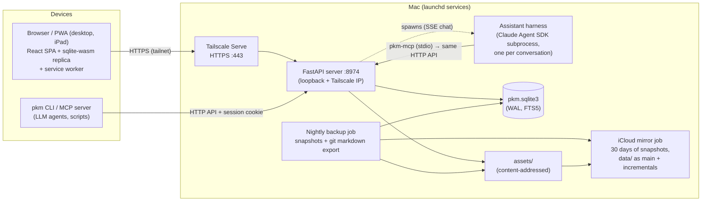

# PKM architecture overview

PKM is a single-user, self-hosted replacement for Roam Research: an
outliner-style notes app with daily notes, `[[page links]]`, backlinks,
full-text search, block references and locally hosted assets. It runs on a
Mac, is reached over Tailscale from other devices, and works fully offline
as an installable PWA.

This directory is the "get up to speed" layer. It describes the system as it
is; the *why* (trade-offs, rejected alternatives, per-feature designs) lives
in [`docs/design.md`](../design.md) and the specs under
[`docs/superpowers/specs/`](../superpowers/specs/).

| Doc | Covers |
|---|---|
| this file | System context, the core idea, tech stack, cross-cutting patterns, deployment and development |
| [backend.md](backend.md) | FastAPI server: module map, database, write path, title integrity, auth, HTTP API reference, generated artifacts, config, logging |
| [import-export-and-backup.md](import-export-and-backup.md) | Roam EDN importer, markdown export, single-page export, the nightly backup job |
| [cli-and-mcp.md](cli-and-mcp.md) | The `pkm` CLI and `pkm-mcp` server: shared HTTP client, write workflows, planners |
| [assistant.md](assistant.md) | The embedded LLM harness |
| [files-and-assets.md](files-and-assets.md) | The content-addressed asset store, the `/files` browser, image descriptions |
| [frontend.md](frontend.md) | React SPA: tech stack, module map, views and navigation, state layers, API layer, assistant panel, testing, build |
| [frontend-editor.md](frontend-editor.md) | Per-title outline sessions, the editor, keyboard policy, drag and drop, journal day refs |
| [frontend-rendering.md](frontend-rendering.md) | The rendering pipeline, `scan.ts` authority, caches, block-ref resolution, mermaid, PDF |
| [goodlinks.md](goodlinks.md) | GoodLinks copies: the proxy routes, resolve-or-save, the sanitised reader, the /goodlinks command |
| [styling.md](styling.md) | Design tokens and theming, control families, confirmations, focus invariants |
| [sync-and-offline.md](sync-and-offline.md) | The sync protocol and offline architecture, end to end |
| [troubleshooting.md](../troubleshooting.md) | Known failures indexed by symptom, each with its cause and the section that owns it |

## System context


```mermaid
flowchart LR
    subgraph Devices
        A["Browser / PWA (desktop, iPad)<br/>React SPA + sqlite-wasm replica<br/>+ service worker"]
        CLI["pkm CLI / MCP server<br/>(LLM agents, scripts)"]
    end

    subgraph Mac["Mac (launchd services)"]
        TS["Tailscale Serve<br/>HTTPS :443"]
        S["FastAPI server :8974<br/>(loopback + Tailscale IP)"]
        AI["Assistant harness<br/>(Claude Agent SDK subprocess,<br/>one per conversation)"]
        DB[("pkm.sqlite3<br/>(WAL, FTS5)")]
        AS["assets/<br/>(content-addressed)"]
        BK["Nightly backup job<br/>snapshots + git markdown export"]
        IC["iCloud mirror job<br/>30 days of snapshots,<br/>data/ as main + incrementals"]
    end

    A -- "HTTPS (tailnet)" --> TS --> S
    CLI -- "HTTP API + session cookie" --> S
    S -. "spawns (SSE chat)" .-> AI
    AI -- "pkm-mcp (stdio) → same HTTP API" --> S
    S --> DB
    S --> AS
    BK --> DB
    BK --> IC
    AS --> IC
    BK --> AS
```

One server process, one SQLite file, one assets directory. Browser, CLI and
MCP all speak the same HTTP API with the same session-cookie auth. Block
content changes go through `POST /api/ops`
([the write path](backend.md#the-write-path)); pages, the sidebar and assets
have their own routes ([API reference](backend.md#http-api-reference)).
The embedded LLM assistant is another client. The server spawns a harness subprocess per chat
conversation, confined to the
[`pkm-mcp` tools](cli-and-mcp.md#the-mcp-tool-surface), and those tools loop
back into the same API.

## Core idea

**Server-authoritative, block-granular, no CRDTs.** The server's SQLite is the
single source of truth. Browsers apply edits optimistically and send batches of
block-level ops. A trigger-based change journal plus a client cursor handles
down-sync, and a WebSocket only nudges. Per-block last-write-wins, with losing
text preserved as `[[conflict]]` blocks, is enough for one person. Offline is a
cache of that state: a sqlite-wasm replica plus a durable op queue in each
browser. Portability comes from a nightly plain-markdown export.
[sync-and-offline.md](sync-and-offline.md) has the protocol end to end.

## Tech stack

| Layer | Choices |
|---|---|
| Backend | Python ≥ 3.12, FastAPI, Pydantic v2, raw `sqlite3` (WAL + FTS5, no ORM), uvicorn + `websockets`, `uv` (hatchling build) |
| Frontend | Versions in [frontend.md](frontend.md#tech-stack) |
| Agent access | `pkm` CLI + `pkm-mcp` stdio server (httpx2; FastMCP from the `mcp` SDK) over the same HTTP API |
| Embedded assistant | Claude Agent SDK harness, server-side, confined to the `pkm-mcp` tools; SSE streaming chat in the SPA |
| Ops | launchd services, Tailscale Serve (HTTPS), nightly backup: rotated SQLite snapshots + git-committed markdown export |

## Cross-cutting patterns

### Functional Core / Imperative Shell

The whole codebase follows FCIS. Pure logic — op planning, ref extraction,
query evaluation, tree building, state transitions — lives in Functional Core
files. I/O — routes, SQLite, WebSocket, workers, React effects — lives in thin
Imperative Shell files that gather inputs, call the core, and persist results.
Every runtime file declares its role in a header comment:

```
# pattern: Functional Core        (Python)
// pattern: Imperative Shell      (TypeScript)
```

On the web side the boundary is machine-checked: `pnpm check:fcis`
(`web/tooling/fcis.mjs`) walks the import graph and fails on any
Functional-Core → Shell edge, type-only imports excepted. On the server it is
convention plus review. The write path is the clearest case: a pure planner
(`ops_core.plan_op`) between two thin shells (see
[backend.md](backend.md#the-write-path)).

Rules and the escape hatches (`Mixed (needs refactoring)` etc.) are in
`AGENTS.md`; invoke the `howto-functional-vs-imperative` skill for structural
work.

### One grammar, two languages, pinned by fixtures

Roam-flavoured markdown (`[[links]]`, `#tags`, `Attr::`, `((block refs))`,
`{{[[query]]}}`, `{{TODO}}`) is parsed on both sides: `server/src/pkm/refs.py`
(the reference implementation, feeding the `refs` table) and
`web/src/grammar/scan.ts` (feeding rendering, autocomplete and the replica).
Fixtures in `shared/fixtures/` are replayed by both test suites, so the two
parsers cannot drift. The same technique pins the offline API shim to the real
routes and the replica schema to the server's DDL. The server's Pydantic
response models likewise generate the TypeScript API types (`pnpm gen-types`).
Each of those artifacts is generated and checked in.
[backend.md](backend.md#generated-artifacts-and-parity-fixtures) names the
generator, the test that fails when one goes stale, and the consumer.

## Deployment and development

Production is launchd services on a Mac under `$PKM_HOME`
(default `~/.config/pkm`): `app/` (git checkout), `data/` (config.json,
pkm.sqlite3, assets/), `backups/`, `logs/`. Tailscale Serve terminates HTTPS
and proxies to the server on `127.0.0.1:8974`. The server also binds the
machine's Tailscale IP for direct API clients. The backup service runs nightly
at 03:30; at 04:30 `deploy/icloud_backup.py` mirrors the snapshots and `data/`
into iCloud Drive.

- `deploy/install.sh` — idempotent first install: renders plists, bootstraps
  services, configures Tailscale Serve.
- `deploy/update.sh` — deploy: `git pull --ff-only`, `uv sync`, `pnpm build`,
  kickstart the server service. It refuses to run outside `$PKM_HOME/app`
  unless `PKM_UPDATE_FORCE=1` is set, so a deploy runs against the installed
  checkout rather than a dev tree.
- `deploy/smoke.sh` — post-deploy verification. It does a real WebSocket
  upgrade, which TestClient suites cannot exercise.

Full procedures: [`deploy/README.md`](../../deploy/README.md).

Development work is tracked in beans (`.beans/`, `beans` CLI); run
`beans prime` at session start. Feature work happens on branches in worktrees,
since parallel sessions share this repo, and merges use `--no-ff`. Two
verification gates run before work is claimed done:

- `cd server && uv run pytest -q && uv run pyrefly check && uv run ruff check`
- `cd web && pnpm verify` — typecheck → lint → FCIS check → unit coverage →
  budget-enforced build → Playwright against that build.

`AGENTS.md` is the contract for agents working in this repo. Per-feature
designs go in `docs/superpowers/specs/` and plans in
`docs/superpowers/plans/`.
