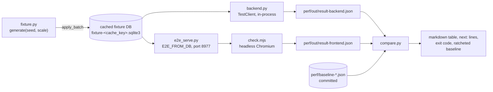
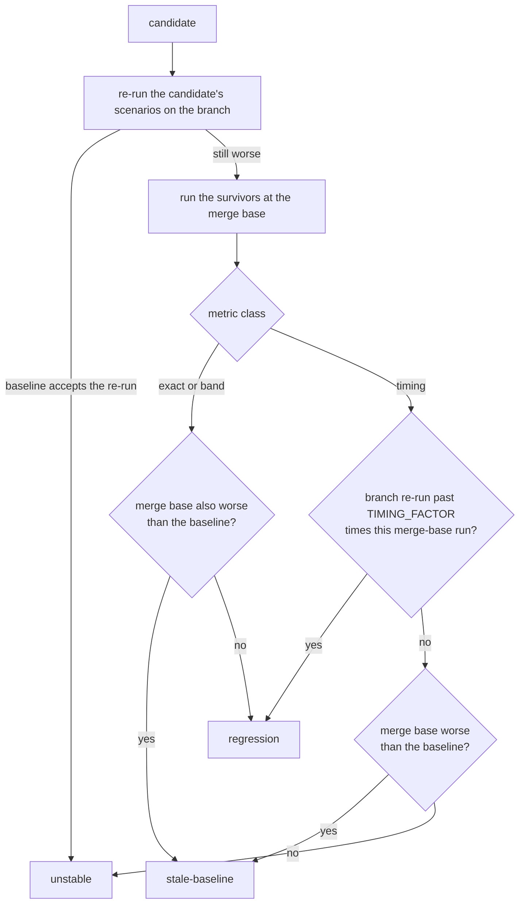

# Performance checks

`perf/check.sh` is the performance regression gate. It measures fixed backend
and frontend scenarios against a synthetic prod-shaped database and compares
them with baselines committed in `perf/`. It runs locally as part of
verification; it is not CI, a git hook, or part of `pytest` or `pnpm verify`.

What to do with each verdict is in [`AGENTS.md` § Testing](../../AGENTS.md#testing).
The rationale and rejected alternatives are in the
[design spec](../superpowers/specs/2026-09-26-perf-regression-checks-design.md).
Known failures of the gate itself are in
[troubleshooting.md](../troubleshooting.md#performance-checks).

## Pipeline

`run.py` orchestrates. With no side named (`auto`), it picks sides from
`git diff` against the merge base with `main`, plus untracked files.

| Path changed | Side |
|---|---|
| `server/…` | backend |
| `web/…`, except `web/e2e/` and `*.md` | frontend |

The frontend side runs `pnpm build` once per invocation, so it always
measures the working tree's SPA.

| Module | Pattern | Role |
|---|---|---|
| `perf/check.sh` | script | wrapper: `TZ=Europe/London`, `python -m perfcheck.run` |
| `server/tooling/perfcheck/run.py` | Imperative Shell | sides, runners, confirmation, merge-base worktrees, baseline writes |
| `run_core.py` | Functional Core | `sides_for`, `frontend_letters`, `exit_code`, `next_steps`, `stale_entries` |
| `compare.py` | Functional Core | `compare`, `confirm`, `bootstrap`, `incomparable_reason`, `render_table` |
| `fixture.py` | Functional Core | pure `generate(seed, scale)`: op batches, assets, sidebar, `Landmarks` |
| `build.py` | Imperative Shell | fixture DB build, `cache_key`, `fixture_hash`, `cache_lock`, pruning |
| `backend.py` + `trace.py` + `sqlplan.py` | Shell + Shell + Core | backend scenarios, per-request SQL tracing, plan-row classification |
| `server/tests/e2e_serve.py` | Imperative Shell | the Playwright server, with perf env options |
| `web/tooling/perf/check.mjs` + `harness.mjs` | script | frontend scenarios; helpers shared with the investigation harness |

## Metric classes

Every metric carries a class, declared by the check that produced it.
Compare never infers a class, so a reclassification is a reviewed code change.

| Class | Means | Candidate when | Improvement ratchets to |
|---|---|---|---|
| `exact` | identical on every run of a commit | the value rises | the new value |
| `band` | scheduler-dependent but bounded; stored as `min`..`max` | the value exceeds `max` | a lower `min`; `max` stays |
| `timing` | wall time in ms | the value passes `TIMING_FACTOR` times the baseline | the new value, only once it beats the baseline by the same factor |

A band only widens downward, and a timing ratchets only on a large gain.
Either rule stops one lucky run from narrowing the baseline until an ordinary
run is flagged. Only `--bootstrap` lowers a band's `max`.

**A baseline is rewritten only by a passing check.** Improvements and newly
recorded metrics wait in `Comparison.new_baseline` until the whole side
passes, and the output says so.

## Verdicts

`compare()` gives each changed metric a kind; `confirm()` turns each
candidate into an outcome. The table's `verdict` column shows the outcome
when there is one, otherwise the kind.

| Verdict | Condition | Fails the check | Then |
|---|---|---|---|
| `improvement` | better than the baseline, by the class's rule | no | commit the rewritten baseline |
| `new` | scenario or metric absent from the baseline | no | commit the rewritten baseline |
| `lost` | baseline scenario or metric missing from the result | yes, without confirmation | `--bootstrap` |
| `reclassified` | metric's class differs from the baseline's | yes, without confirmation | `--bootstrap` |
| `regression` | candidate that survives confirmation | yes | the diff along the regressed path |
| `unstable` | candidate the re-run does not reproduce | yes | a bean against the harness |
| `stale-baseline` | candidate the merge base shows too | yes | `--rebaseline` |

Before comparing, `incomparable_reason()` refuses a result whose
`fixture_hash` or `env` differs from the baseline's. The refusal names the
difference and suggests `--rebaseline`.

| Exit | When |
|---|---|
| 0 | every side passes; improvements and new metrics included |
| 1 | any failing verdict, a missing baseline, an incomparable result, or an unstable `--bootstrap` |
| 2 | a run failed: `PerfRunError`, `CacheLockTimeout`, or a failed subprocess (a scenario error, an `UnstableCountError`) |

## Confirmation

A candidate is reported as a regression only after a re-run on the branch
and a run at the merge base.

A timing moves with machine load, and the re-run shares the first run's
load. So a reproduced timing is judged against the merge-base run from the
same confirmation, not against the stored baseline. A metric missing from the
merge-base run counts as a regression.

On the frontend, a re-run takes every scenario in each candidate's browser
context group (`_CONTEXT_GROUPS` in `run_core.py`). Counts were recorded in
that company, so running one scenario alone could change them. The result is
filtered back to the scenarios asked for.

**A merge-base run measures the base's product with the branch's harness.**

| Comes from the branch | Comes from the merge base |
|---|---|
| `perfcheck` (`PYTHONPATH` = the branch's `server/tooling`) | the `pkm` package (`uv run --project <worktree>/server --with time-machine`) |
| `e2e_serve.py` and `check.mjs` | `web/dist`, built once per worktree |
| Chromium, from the branch's Playwright | Python and SQLite, from the worktree's venv |

So the gate works at a merge base older than the tooling. The base's SPA
must still emit the `pkm:replica-ready` mark (`replicaSync.ts`), or the
frontend run times out waiting for it. A harness change on the branch moves
the merge-base run as well, so it reads as `stale-baseline`, not
`regression`.

## Recording a baseline

`--bootstrap` records a baseline from `--runs` runs (default 5, at least 2)
of the working tree. `--rebaseline` does the same in the merge-base worktree.

| Class | Recorded as | Unstable when |
|---|---|---|
| `exact` | the shared value | the runs disagree |
| `band` | `min`..`max` of the runs | never |
| `timing` | the median | never |

A metric missing from any run is also unstable. Any unstable metric means no
baseline is written.

## Backend check

`backend.py` runs each scenario in-process through a `TestClient` against a
private copy of the cached fixture. `Tracer.get_db` replaces the `get_db`
dependency, so it sees every connection a request opens.

Each scenario runs twice with the tracer and progress handler on, and the
two counts must agree; otherwise `UnstableCountError` fails the run. Then it
runs once as warm-up and `repeats` times uninstrumented for the timing. A
write scenario gets a fresh copy of the fixture before every call. Reads see
the shared copy, so every read scenario must come before the first write in
`scenarios()`.

| Metric | Class | Measures |
|---|---|---|
| `statements` | exact | top-level SQL statements the request ran |
| `trigger_statements` | exact | nested statements (trace lines starting `--`): trigger bodies and FTS5's internal queries |
| `vm_steps_k` | exact | progress-handler ticks, one per `PROGRESS_N` SQLite VM instructions |
| `bytes` | exact | response body length |
| `full_scans` | exact | `SCAN <table>` rows with no `USING` in `EXPLAIN QUERY PLAN` of each distinct traced statement |
| `median_ms` | timing | median of the uninstrumented calls |

`full_scans` counts only real tables. `sqlplan.aliases` resolves `FROM t a`
aliases, and CTEs and FTS virtual tables are excluded. A traced statement
that `EXPLAIN QUERY PLAN` cannot plan fails the run, rather than counting
as zero.

The scenarios target `Landmarks` from the fixture (`BIG_PAGE`, `HUBS`, a
popular ref target) and its planted search terms (`COMMON_TERM`, `RARE_TERM`,
`PREFIX_TERM`, `PHRASE`).

| Area | Scenarios |
|---|---|
| Pages | `page/big`, `page/hub`, `page/hub-deep` (backlinks at an offset), `page/journal-day` |
| Journal | `journal/head`, `journal/before` |
| Blocks and links | `block/get`, `block/backlinks`, `block-refs/30`, `unlinked/hub` |
| Search | `search/common`, `search/rare`, `search/prefix`, `search/phrase`, `search/many-hits`, `search/title`, `titles/prefix`, `titles/infix`, `assets/search`, `assets/range` |
| Lists | `todos/all`, `changed/week`, `query/and-not`, `sidebar` |
| Sync | `sync/snapshot`, `sync/changes-mid` |
| Writes | `ops/edit-1`, `ops/paste-50`, `ops/move-subtree`, `rename/hub` |

## Frontend check

`run.py` starts `e2e_serve.py` on port 8977 with the cached fixture, then runs
`check.mjs`. Each browser context group gets one Playwright context.

| Group | Context | Why |
|---|---|---|
| `HW` | fresh, not logged in | H must load into an empty replica; W is the next navigation, warm |
| `ABFI` | logged in, no React hook | the hook walks the fiber tree on every commit and would distort idle and typing |
| `JKS` | logged in, `react-commits.js` installed | these scenarios count React commits |

| Scenario | Does | exact | band | timing |
|---|---|---|---|---|
| `H/cold` | log in, wait for `pkm:replica-ready`, settle | `requests`, `api_bytes`, `snapshot_requests`, `changes_requests` | | `replica_ready_ms` |
| `W/warm` | open the big page with replica and service worker warm | `requests`, `changes_requests`, `snapshot_requests` | | `first_outline_ms` |
| `A/idle-big`, `B/idle-journal` | sit idle for `IDLE_MS` on the big page / journal | `ws_opens` | `timers_armed`, `fetches`, `long_tasks` | |
| `F/typing` | type `TYPED` into an ordinary big-page block; one debounced save | `mut_outside`, `api_requests` | `forced_layouts` | |
| `I/journal-scroll` | wheel-scroll the journal | `days_loaded`, `journal_requests`, `page_requests` | | |
| `J/journal-typing` | type into the first journal day with a fixed number of days mounted | `days_mounted` | `react_commits`, `rendered_fibers` | |
| `K/drag-top`, `K/drag-bottom` | dispatch synthetic `dragover`s across the drop zone | `not_prevented` | `react_commits`, `forced_layouts` | `handler_ms` |
| `S/search-common`, `S/search-rare` | type a term in the top-bar search, time the last key, open a hit | `search_requests`, `fetches` | `react_commits` | `results_ms` |

The counters come from `instrument.js` (`window.__perf`), `harness.mjs`'s
`attachCounters` (requests per path), CDP `Performance.getMetrics`
(`LayoutCount`) and `react-commits.js` (`window.__react`). The
[harness README](../../web/tooling/perf/README.md) describes those payloads
and why K's drag is synthetic.

`handler_ms` sums the handler time over every `dragover`, because one handler
is too close to the clock's resolution. `results_ms` runs from the last key's
`keydown` to the render of that term's results.

## Determinism

A count that differs between two runs of one commit says nothing about the
code. Each uncontrolled input has a harness control.

| Input | Control | Where |
|---|---|---|
| Wall clock, backend | `time_machine.travel(FROZEN_NOW, tick=False)`; fixture dates are relative to `FROZEN_NOW` | `backend.py`, `fixture.py` |
| Wall clock, fixture server | `E2E_FROZEN_NOW`: `time_machine.travel` starting at `FROZEN_NOW`, with the clock running | `e2e_serve.py` |
| Wall clock, browser | Playwright `ctx.clock.install` at `PERF_FROZEN_NOW`, flowing; `timezoneId` Europe/London; `assertFrozenClock` and `assertNewestJournalDay` guard it | `check.mjs` |
| Timezone | `TZ=Europe/London` for every process | `check.sh`, `run.py` |
| The fake clock's `performance` stub | `MARKS` records `performance.mark` calls into `window.__marks`; `REAL_NOW` keeps the real `performance.now` as `window.__realNow`; resource sizes come from a `PerformanceObserver` | `check.mjs` |
| Background services, backend | `TestClient` without `with`, so the lifespan (describe worker) never starts; `DescribeService` built disabled; API key files point nowhere | `backend.py` |
| First-request setup | one warm-up call excluded from the timing; counts taken twice and compared | `backend.py` |
| Accumulating writes | a fresh fixture copy per backend write; the fixture server copies the DB into a temp dir; S opens a real hit rather than the `Create page` row | `backend.py`, `e2e_serve.py`, `check.mjs` |
| Late network follow-ups | `settle()` waits until no request has been in flight for `QUIET_MS`, since Playwright's `networkidle` fires once per navigation | `check.mjs` |
| Trailing React commits after a click | `reactQuiet()` waits for `REACT_QUIET_MS` without a commit before counting | `check.mjs` |
| A save's WS nudge racing its HTTP ack | `pinSaveOrder()` holds `/api/ops` and `/api/sync/changes` responses so the nudge's pull always goes first | `check.mjs` |
| Typing speed against debounces | F and J type at a pace that keeps re-arming the text debounce, so one save; S types slower than `SearchBar`'s debounce, so one search per key | `check.mjs` |
| Scenario order within a context | re-runs take the whole context group | `run_core.py` |
| Viewport and headless rendering | fixed viewport, headless Chromium | `check.mjs` |

What no control removes is classed `band` or `timing`.

## Comparability and the fixture

`fixture.py` is pure, so the same `(seed, scale)` gives the same op batches.
`build.py` applies them through `ops_apply.apply_batch`, the function behind
`POST /api/ops`. Triggers fill `blocks_fts` and `changes`, and the product's
Python fills `refs` and `block_refs`, as in prod.

Two keys, on purpose:

| Key | Hashes | Decides |
|---|---|---|
| `cache_key` | `fixture.py` source, `pkm.schema.DDL`, every `.py` under the imported `pkm` package, seed and scale | when the cached DB is rebuilt |
| `fixture_hash` | `fixture.py` source only | whether a result and a baseline are comparable |

The product source is in `cache_key` because the write path fills derived
tables in Python. A product change must therefore rebuild the fixture. It
stays out of `fixture_hash`, so a schema or query change is measured against
the baseline rather than excused from it. A merge-base run hashes the base's
product, so it gets its own cached DB. `build.py` itself is not hashed;
after changing it, delete the cached fixture.

`env` holds what else changes numbers across machines or upgrades.

| Side | `env` keys |
|---|---|
| backend | `python`, `sqlite` |
| frontend | `chromium` |

The frontend result records `node` as a top-level field for information,
since node only drives Playwright.

## Extending the gate

| Change | What the check then reports | Then run |
|---|---|---|
| Add a backend scenario (`scenarios()` in `backend.py`; `writes=True` for a write, placed after the reads) | `new` | the check; commit the rewritten baseline |
| Add a frontend scenario (a function and letter in `check.mjs`, its context group in `main()`, the default `--only` list, and `_CONTEXT_GROUPS`) | `new` | the check; commit the rewritten baseline |
| Change a metric's class | `reclassified` | `--bootstrap` |
| Remove a scenario or metric | `lost` | `--bootstrap` |
| Change how a check measures, moving counts | `stale-baseline` (the merge-base run uses the new harness) | `--rebaseline` |
| Edit `fixture.py` | both sides refuse: `fixture_hash` differs | `--rebaseline` on each side |

`frontend_letters` drops a letter missing from `_CONTEXT_GROUPS`. A scenario
left out of it is never re-run, so every candidate on it confirms as
`unstable`.

## Shared state

The cache dir, the merge-base worktrees and port 8977 are shared by every
worktree and session on the machine. Each is touched only under its
`cache_lock`, an exclusive `flock` in the cache dir. A waiting check says
which lock it waits on and gives up with `CacheLockTimeout` after
`LOCK_WAIT_S`. The OS releases a lock whose holder died.

| State | Location | Lock | Pruned |
|---|---|---|---|
| Fixture DBs | `${PKM_PERF_CACHE:-~/.cache/pkm-perf}/fixture-<cache_key>.sqlite3` | `cache.lock` | unused for `UNUSED_FOR_S` (each use touches the mtime) |
| Temp builds | `tmp*.sqlite3*` in the cache dir | `cache.lock` | older than `ORPHAN_AFTER_S` |
| Merge-base worktrees | `worktrees/<sha12>/` in the cache dir, with `.perf-used` and `.perf-built` markers | `worktrees.lock` | `.perf-used` older than `UNUSED_FOR_S`: `git worktree remove --force`, then `git worktree prune` |
| Fixture server on 8977 | `FRONTEND_PORT` in `run.py` | `frontend.lock` | stopped at the end of each frontend run |
| Results and server logs | `perf/out/` (gitignored): `result-*.json`, `fixture-server.log`, `fixture-server-errors.log` | none | overwritten each run |
| Baselines | `perf/baseline-backend.json`, `perf/baseline-frontend.json` | none | committed |

The backend check opens the cached fixture read-only and immutable, and
writes only to private copies. Both checks write their result file through a
temp file and rename, so a failed run never leaves a partial result.

The fixture server never falls back to 8974 (prod) or 8975 (`pnpm e2e`). The
port is checked under `frontend.lock` right before the server starts. The
server echoes the run's `E2E_INSTANCE` token in an `X-E2E-Instance` header on
`/healthz`, and any other answer fails the run. The server runs in its own
process group: stopping it sends SIGTERM, then SIGKILL to the group after
`STOP_TIMEOUT_S`. When the frontend run fails, the tails of both server logs
are printed.

`e2e_serve.py`'s perf options leave `pnpm e2e` unchanged when unset.

| Env var | Effect |
|---|---|
| `E2E_FROM_DB` | copy this DB into the temp data dir instead of creating an empty one |
| `E2E_FROZEN_NOW` | run the server inside `time_machine.travel` from this datetime |
| `E2E_WEB_DIST` | serve this `web/dist` (a merge-base build) |
| `E2E_SERVER_LOG` | log unhandled exceptions here, not `web/e2e/.server.log` |
| `E2E_INSTANCE` | the token echoed on `/healthz` |
