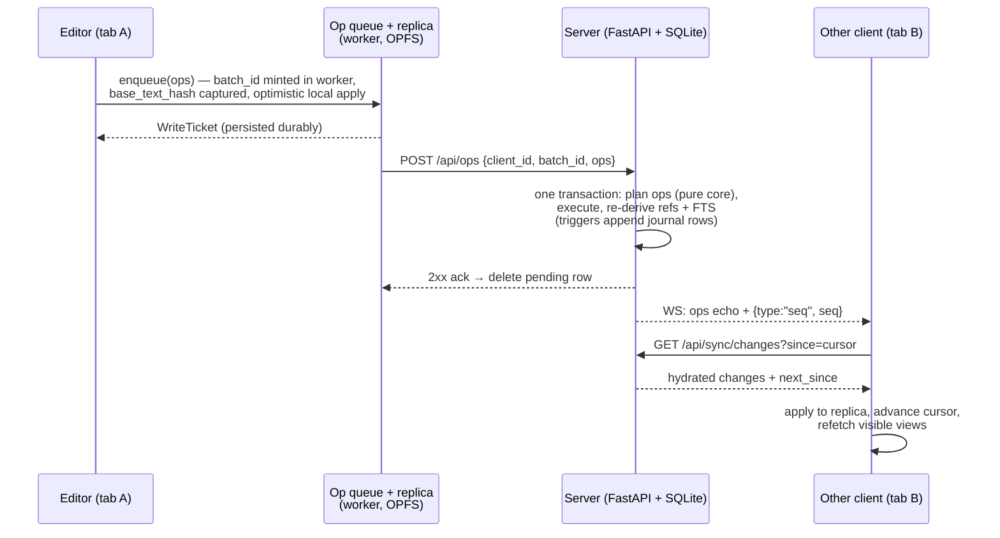
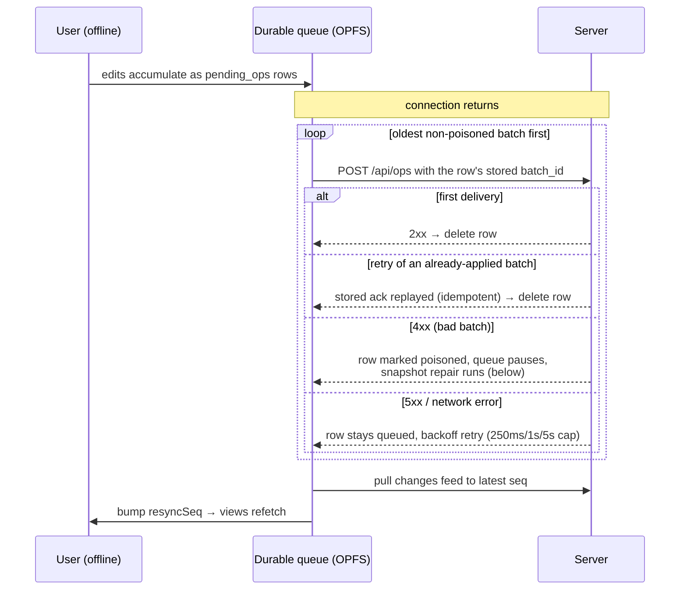

# Sync and offline architecture

This doc describes the full path an edit takes — from a keystroke, through
the browser's durable queue and replica, to the server and back out to other
clients — and how the system behaves offline. It spans both codebases; see
[backend.md](backend.md) and [frontend.md](frontend.md) for the module maps.

The authoritative design (with rejected alternatives) is
[`docs/superpowers/specs/2026-07-12-offline-editing-design.md`](../superpowers/specs/2026-07-12-offline-editing-design.md).

## The model in one paragraph

**Server-authoritative, no CRDTs.** SQLite on the server is the single
source of truth; clients apply edits optimistically and send op batches to
`POST /api/ops`. Down-sync is *pull-based*: an append-only change journal
(populated by SQLite triggers) gives every change a monotonic `seq`, clients
keep a cursor, and `GET /api/sync/changes?since=` returns everything after
it. The WebSocket only *nudges* — it announces new seqs and echoes applied
batches, but correctness never depends on receiving a frame. Offline is a
cache, not a fork: each browser holds a sqlite-wasm replica plus a durable
queue of unacknowledged batches; batch ids make replays idempotent, and
per-block last-write-wins with `[[conflict]]` preservation resolves
collisions at push time.

## Key pieces

| Piece | Where | Role |
|---|---|---|
| Change journal | `server/src/pkm/schema.py` (`changes` table), triggers | Every row mutation gets a `seq`; populated by row-level triggers, so *any* write path is journalled automatically |
| Windowed feed | `server/.../routes_sync.py`, `sync_core.py` | `changes?since=` dedupes a window of raw journal rows; `snapshot` bootstraps |
| Generation token | `sync_meta.db_generation` | Random token minted per database; a rebuilt DB (importer swap) changes it, forcing clients to rebootstrap |
| Idempotent writes | `routes_ops.py`, `applied_batches` table | Same `batch_id` + same payload hash → replay stored ack; different payload → 409 |
| WS hub | `server/.../ws.py`, `notify.py` | Post-commit push of `{type:"seq",seq}` + applied-op echoes; 1 s send timeout, stalled clients dropped |
| Replica | `web/src/replica/` (worker, OPFS) | sqlite-wasm copy of the graph (BASE_DDL only) in a worker on the OPFS SAHPool VFS |
| Op queue | `web/src/sync/opQueue.ts`, `web/src/replica/queue.ts` | Durable `pending_ops` rows in the replica DB; optimistic local apply; drain-on-reconnect |
| Sync orchestration | `web/src/sync/SyncProvider.tsx`, `replicaSync.ts` | Connect/reconnect ordering, cursor pull loop, recovery, view refetch (`resyncSeq`) |
| Offline API shim | `web/src/replica/localApi/` | Serves the read API's exact JSON shapes from the replica when offline (pinned byte-identical by `shared/fixtures/shim_parity.json`) |

## An online edit, end to end

Two things are deliberate here:

- **The HTTP response body is ignored.** Success is the 2xx; the client's
  own state comes from the follow-up changes pull, the same path every other
  client uses. There is one way state flows down, not two.
- **Incoming WS op echoes are not written to the replica.** A tab drops its
  own echoes (matching `client_id`) and uses others only to update live
  views; the authoritative apply is always the cursor pull that the `seq`
  nudge triggers. A lost frame therefore costs latency, never correctness.

## The changes feed

`GET /api/sync/changes?since=<cursor>` (`routes_sync.py`, windowing in
`sync_core.dedupe_window`) reads a window of **raw journal rows** inside one
read transaction:

- `next_since` advances to the last raw row *scanned*, not the last distinct
  entity — so an entity whose older row shares a window with someone else's
  newer row can't be skipped.
- Within the window, `(kind, entity_id)` pairs are deduped in insertion
  order, then hydrated: blocks ship with their refs, plus any "dependency
  pages" those refs target, so a window boundary can't deliver a block whose
  target page the client has never seen. Entities that no longer exist ship
  as tombstones.
- The client loops `pull → apply → cursor = next_since` until
  `next_since >= latest_seq` (`web/src/sync/replicaSync.ts`; the cursor
  persists in the replica's `sync_client_meta` table).

Two signals force a full re-bootstrap from `GET /api/sync/snapshot`:
`reset: true` (the client's cursor is ahead of the journal — the DB was
rebuilt) or a changed `generation` token. Both mean "this is a different
database; your cursor is meaningless".

## Offline editing and reconnect

While disconnected, reads and search are served from the replica through the
local API shim, and edits keep enqueueing durably (each op optimistically
applied to the replica under a per-op SAVEPOINT; `base_text_hash` — the
sha256 of the text the edit was based on — is captured *before* the apply).
The header shows "Offline — N changes pending".

The reconnect ordering in `SyncProvider` is fixed: **drain the queue first,
then pull, then refetch views** — so the pull observes the server state that
already includes this client's own offline edits.

Conflict resolution happens entirely server-side at push time
(`ops_core.plan_op`), per block:

| Situation | Outcome |
|---|---|
| `hash(current) == base_text_hash` | Clean apply |
| Incoming text equals current | No-op |
| Hashes differ (concurrent edit) | Incoming wins; the overwritten text is preserved as a `[[conflict]] …` sibling block right after the winner |
| Block was deleted meanwhile | Edit appended to **today's daily page** as `[[conflict]] (original block deleted) …` |
| No hash sent (legacy/CLI callers) | Unconditional last-write-wins |

Nothing is silently discarded; conflict blocks are ordinary blocks, so they
arrive at every client via the normal feed and are findable via search and
the `[[conflict]]` page's backlinks.

## The replica and its recovery invariants

The replica is a real SQLite database (sqlite-wasm) running in a dedicated
worker on the OPFS SAHPool VFS — one file, `/pkm-replica.sqlite3`, holding
both the graph copy (the server's `BASE_DDL`, replicated via the generated
`web/src/replica/baseSchema.gen.ts`) and the client-only tables
(`pending_ops`, `sync_client_meta`).

The guiding invariant: **the replica is a cache; the queue is the user's
intent.** A snapshot can always be re-fetched; an unflushed pending op
cannot. Consequences (`web/src/replica/client.ts`, `recoveryGate.ts`,
`web/src/sync/opQueue.ts`):

- Optimistic local application is best-effort — an op that can't apply
  locally is skipped, never dropped from the queue.
- Every database-mutating RPC passes through a worker-owned FIFO recovery
  gate. Recovery fingerprints the durable pending rows before starting and
  re-checks them immediately before the destructive step, aborting
  non-destructively if they changed — no acknowledged enqueue can be erased.
- After every snapshot or feed window, pending batches are re-applied on top
  (`reapplyPending`), so later edits don't capture stale base hashes.
- A rejected batch (4xx) is marked *poisoned* and delivery pauses;
  `SyncProvider` runs an authoritative snapshot repair that reapplies the
  non-poisoned batches, drops the poisoned row, and resumes — failure stays
  visible with a Retry.

Three distinct triggers cause a rebootstrap, all funnelled through the same
recovery coordinator:

| Trigger | Detected by | Kind |
|---|---|---|
| App deploy changed the client schema | `SCHEMA_VERSION` = sha256(base + client DDL) vs stored value | `reset` (rebuild file) |
| Server DB rebuilt (importer swap) | `generation` token mismatch in any feed payload | `rebase` (flush queue, re-snapshot) |
| Cursor ahead of journal | `reset: true` from the feed | `rebase` |

## Ancillary details

- **Socket** (`web/src/sync/socket.ts`): fixed 2 s reconnect interval (no
  backoff), 30 s ping keepalive. `resyncSeq` — a React counter bumped on
  reconnect-after-gap or repair — is what makes visible views refetch; it is
  separate from the replica's persisted cursor.
- **Connectivity vs delivery health are reported independently**: the app
  can be online but with delivery blocked (poisoned batch), and the UI says
  which.
- **Online-only features** degrade explicitly rather than queueing: asset
  upload, sidebar edits, page deletion, and `{{[[query]]}}` blocks say
  "online only" when offline.
- **Service worker**: precaches the app shell (so a cold offline start
  boots) and keeps a bounded runtime cache of recently viewed assets;
  Mermaid's chunk family is deliberately precached so diagrams render
  offline (enforced by a build budget + an offline Playwright test).
- **`pkm` CLI / MCP writes** ride the same path: fresh `batch_id` per
  command, `base_text_hash` on updates — so agent edits get the same
  idempotency and conflict preservation as browser edits.

## Why it's debuggable

Everything stateful is inspectable SQLite: the journal is rows in the server
DB, the queue is rows in the replica DB, and the only moving parts are a
cursor, a generation token, and content hashes. There are no vector clocks
and no merge machinery; every failure mode reduces to "pull the feed again"
or "re-snapshot and replay the queue".
