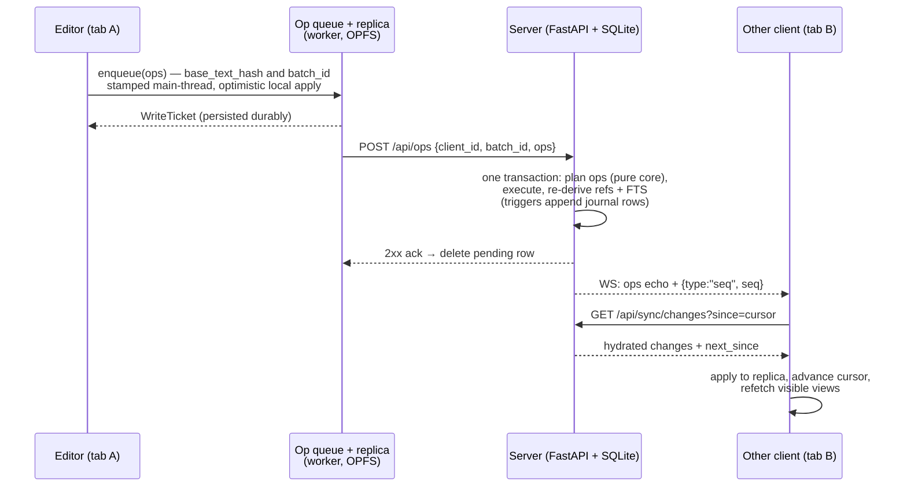
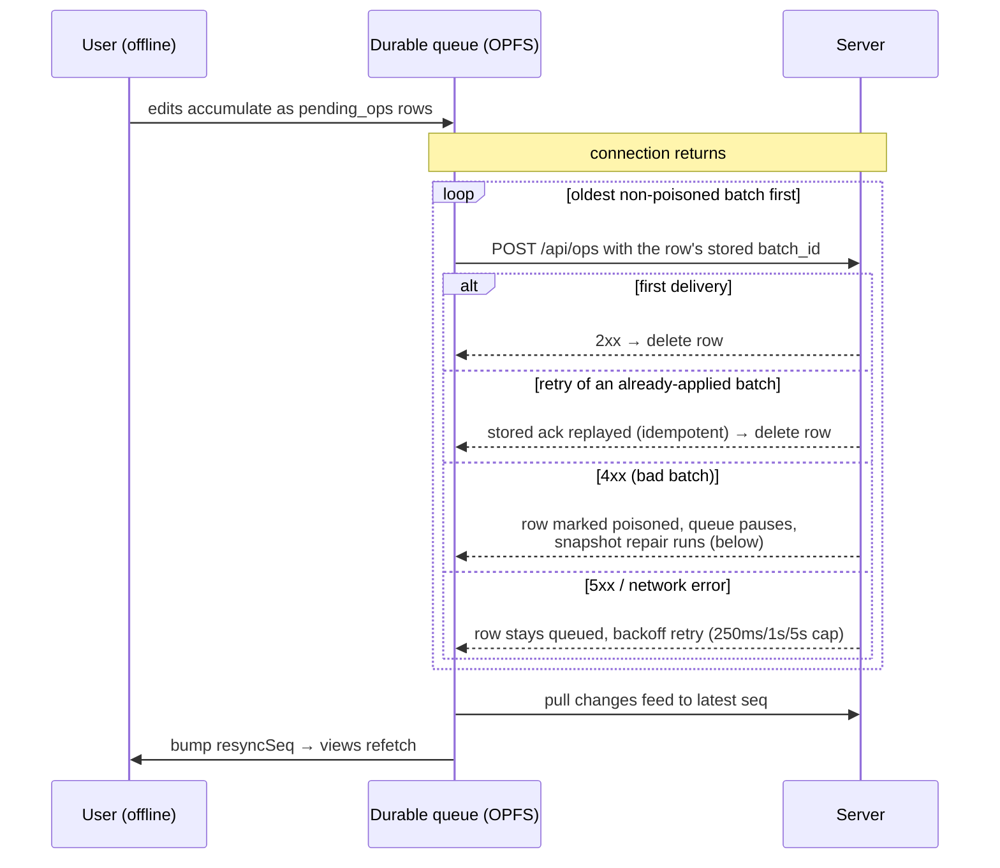
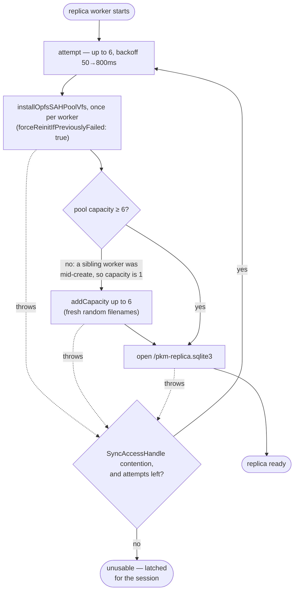
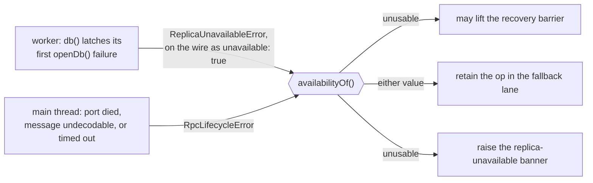

# Sync and offline architecture

This doc follows the full path an edit takes: from a keystroke, through the
browser's durable queue and replica, to the server, and back out to other
clients. It also covers how the system behaves offline. It spans both
codebases; [backend.md](backend.md) and [frontend.md](frontend.md) have the
module maps. The last section is a symptom-to-cause index for when something
looks wrong.

The authoritative design, with the rejected alternatives, is
[`docs/superpowers/specs/2026-07-12-offline-editing-design.md`](../superpowers/specs/2026-07-12-offline-editing-design.md).

## The model in one paragraph

**Server-authoritative, no CRDTs.** SQLite on the server is the single source
of truth. Clients apply edits optimistically and send op batches to
`POST /api/ops`. Down-sync is *pull-based*: an append-only change journal,
populated by SQLite triggers, gives every change a monotonic `seq`; clients
keep a cursor, and `GET /api/sync/changes?since=` returns everything after
it. The WebSocket only *nudges*. It announces real journal seqs, can force a
pull for committed metadata-only generation changes, and echoes applied
batches, but correctness never depends on receiving a frame. Offline is a
cache, not a fork: each browser holds a sqlite-wasm replica plus a durable
queue of unacknowledged batches. Batch ids make replays idempotent, and
per-block last-write-wins with `[[conflict]]` preservation resolves
collisions at push time.

## Key pieces

| Piece | Where | Role |
|---|---|---|
| Change journal | `server/src/pkm/schema.py` (`changes` table), triggers | Every row mutation gets a `seq`; populated by row-level triggers, so *any* write path is journalled automatically |
| Windowed feed | `server/.../routes_sync.py`, `sync_core.py` | `changes?since=` dedupes a window of raw journal rows; `snapshot` bootstraps |
| Sync metadata | `sync_meta` (`db_generation`, `plain_space_title_canonicalization`) | Durable server-only switches: the generation token forces client rebootstrap after importer swaps, and the title-canonicalization flag gates stripping leading/trailing plain spaces |
| Idempotent writes | `routes_ops.py`, `applied_batches` table | Same `batch_id` + same payload hash → replay stored ack; different payload → 409; `ops` is capped at 500 per batch (`contracts/ops.py`) |
| WS hub | `server/.../ws.py`, `notify.py` | Post-commit push of `{type:"seq",seq}`; metadata-only generation rotation adds `force:true,generation`; applied-op echoes; 1 s send timeout, stalled clients dropped |
| Replica | `web/src/replica/` (worker, OPFS) | sqlite-wasm copy of the graph (BASE_DDL only) in a worker on the OPFS SAHPool VFS |
| Op queue | `web/src/sync/opQueue.ts`, `web/src/replica/queue.ts` | Durable `pending_ops` rows in the replica DB; optimistic local apply; drain-on-reconnect |
| Sync orchestration | `web/src/sync/SyncProvider.tsx`, `useSocketLifecycle.ts`, `reconnectFlow.ts`, `replicaSync.ts` | Connect/reconnect ordering, cursor pull loop, recovery, view refetch (`resyncSeq`) |
| Offline API shim | `web/src/replica/localApi/` | Serves the read API's exact JSON shapes from the replica when offline (pinned byte-identical by `shared/fixtures/shim_parity.json`, and statically by the generated return types described below) |

## An online edit, end to end

```mermaid
sequenceDiagram
    participant U as Editor (tab A)
    participant Q as Op queue + replica<br/>(worker, OPFS)
    participant S as Server (FastAPI + SQLite)
    participant B as Other client (tab B)

    U->>Q: enqueue(ops) — base_text_hash and batch_id<br/>stamped main-thread, optimistic local apply
    Q-->>U: WriteTicket (persisted durably)
    Q->>S: POST /api/ops {client_id, batch_id, ops}
    S->>S: one transaction: plan ops (pure core),<br/>execute, re-derive refs + FTS<br/>(triggers append journal rows)
    S-->>Q: 2xx ack → delete pending row
    S-->>B: WS: ops echo + {type:"seq", seq}
    B->>S: GET /api/sync/changes?since=cursor
    S-->>B: hydrated changes + next_since
    B->>B: apply to replica, advance cursor,<br/>refetch visible views
```

Two choices in that flow are not obvious:

- **The HTTP response body is ignored.** Success is the 2xx. The client's own
  state comes from the follow-up changes pull, the same path every other
  client uses. State flows down one way, not two.
- **Incoming WS op echoes are not written to the replica.** A tab drops its
  own echoes, matched by `client_id`, and uses other tabs' echoes only to
  update live views. The authoritative apply is always the cursor pull that
  the `seq` nudge triggers. A lost frame therefore costs latency, never
  correctness.

## The changes feed

`GET /api/sync/changes?since=<cursor>` (`routes_sync.py`, windowing in
`sync_core.dedupe_window`) reads a window of **raw journal rows** inside one
read transaction:

- `next_since` advances to the last raw row *scanned*, not the last distinct
  entity. Otherwise an entity whose older row shares a window with someone
  else's newer row could be skipped.
- Within the window, `(kind, entity_id)` pairs are deduped in insertion
  order, then hydrated. Hydration reads current state, so a stale journal row
  can name a parent or page whose own journal rows lie beyond the window.
  Blocks therefore ship with every row they depend on: their refs, the pages
  those refs target, the block's own page, and the transitive `parent_uid`
  chain (`_with_parent_closure`, cycle-safe). Without the closure the
  replica's window COMMIT fails its deferred FK check and the cursor wedges.
  Entities that no longer exist ship as tombstones; a dependency block that
  no longer exists is simply absent — never a tombstone, since its own
  journal row produces one in its own window. `block_refs` rows are **never
  shipped**: their targets are uids needing no id resolution, and the
  parity-pinned extractor lets each side derive them from block text
  instead (see
  [Offline editing and reconnect](#offline-editing-and-reconnect)).
- Hydration is batched, not per-id. `sync_core.chunk_ids` splits the window's
  ids into groups of at most 500, under SQLite's historic 999-parameter cap.
  `hydrate_in_order` then restores the caller's order and drops ids nothing was
  found for. That is what reproduces the old per-id loop's ordering and its
  "missing row → tombstone" semantics. Both helpers are pure; the queries stay
  in `routes_sync.py`.
- The client loops `pull → apply → cursor = next_since` until
  `next_since >= latest_seq` (`web/src/sync/replicaSync.ts`). The cursor
  persists in the replica's `sync_client_meta` table.

Two signals force a full re-bootstrap from `GET /api/sync/snapshot`:
`reset: true` (the client's cursor is ahead of the journal, so the database
was rebuilt) or a changed `generation` token. Both mean "this is a different
database; your cursor is meaningless".

## Post-commit nudges

Three tables have change-journal triggers in `schema.py`'s `SERVER_DDL`:
`blocks`, `pages` and `sidebar_entries`. **Every route whose commit touches one
of them must send a WS `{type:"seq", seq}` nudge immediately after that commit**,
so connected replicas know to pull the new window. A committed metadata or
generation change that may leave `changes.seq` unchanged sends the same frame
with `force:true` and the new `generation`; `seq` is always the actual journal
maximum, never a synthetic future value. Nudges are a latency optimization,
never a correctness dependency (see "An online edit, end to end" above).

`notify.py` provides `commit_and_nudge_threadpool` for sync-def routes (hopping
back to the event loop via `anyio.from_thread.run`), so those have one line to
remember instead of two; async routes call `db.commit()` then
`await nudge(request, db)`. Routes whose commit and nudge cannot be adjacent
call them separately — `delete_asset` unlinks the file in between,
`POST /api/ops` broadcasts its applied-op echo. Nudging unconditionally is
harmless even when nothing changed; `cleanup_journal` alone guards its nudge on
`deleted` being non-empty, because it runs on every journal page load and a
no-op run never advances `changes.seq`.

Nothing enforces this in the type system, so
`server/tests/test_journal_advancing_contract.py` enumerates every
journal-advancing route and asserts each one emits a nudge. **A route that
starts writing to `blocks`, `pages` or `sidebar_entries` needs a case added
there, or it ships with a silent gap** — which is how `/api/journal/cleanup`
came to delete pages and advance `changes.seq` for years without ever nudging.

Asset routes are a partial exception, not a blanket one. The `assets` table has
no trigger, so `upload_asset` correctly sends nothing. `delete_asset` is
different. When the deleted asset has referencing blocks, it strips the reference
token from each one and either `UPDATE`s or `DELETE`s the block
(`routes_assets.py` ~184-188). That is a `blocks` write, so it advances
`changes.seq` and the nudge is required; the contract test covers that scenario.
Only the orphan-delete branch touches `assets` alone.

### Hub fan-out: concurrent, per-client ordered

`Hub.broadcast()` (`ws.py`) hands each frame to a small bounded per-client queue
(`QUEUE_SIZE`) and returns without waiting on any network send. Each connection
has its own drain task, the sole consumer of that client's queue, sending one
frame at a time via `send_json` under a `SEND_TIMEOUT`.

That buys two properties. Fan-out is concurrent across clients: one stalled
client no longer adds its timeout to everyone else's delivery, or to the write
path that called `broadcast()`. And delivery to any single client stays in
`broadcast()` call order, because a single-consumer FIFO cannot reorder itself.

A client is disconnected outright if its queue fills or a send exceeds
`SEND_TIMEOUT`. It is never buffered without bound or waited on again. Both
thresholds are tuned for a flaky link rather than a LAN. Since sends moved to
per-client drain tasks, a backlogged client costs the server only its queued
nudges and one drain task, while a drop costs that client a full reconnect,
changes pull and `resyncSeq` refetch.
**Disconnecting must also close the socket**, best-effort with errors swallowed.
The connection can still be alive at the transport level after the Hub gives up
on it, and without a real close the client's `onclose` never fires. It would
then sit wedged until a tab reload, instead of reconnecting and resyncing from
its cursor — which is the correctness mechanism, whether or not nudges arrive.

This is sized for one user with a handful of replicas. Nothing caps total
connections, because the per-client queue bound and the send timeout already
bound the cost that matters at this scale.

## Offline editing and reconnect

While disconnected, reads and search are served from the replica through the
local API shim, and edits keep enqueueing durably, each applied optimistically
under its own SAVEPOINT. The header shows "Offline — N changes pending".

`base_text_hash` is the sha256 of the text the edit was based on, and it is on
the op before that apply. The editor stamps it while building the batch
(`outline/baseTextHash.ts`), walking the batch in order against the tree it was
planned from, so op N leaves the text that op N+1's hash matches. The worker
fills it in from `currentText` only when it is still `undefined`.

Undo history records **unstamped** ops, on purpose. A hash taken when the entry
was recorded is stale by replay time, and a stale hash forks a spurious
`[[conflict]]` sibling against the user's own later edit. So
`undoManager.dispatch` stamps against the tree as it is at replay time.

The optimistic apply must reproduce the server's *timestamp* rules, not just its
row contents. `localOps.ts` mirrors the server by leaving `blocks.updated_at` and
`pages.updated_at` alone for `set_collapsed` (see
[backend.md](backend.md#the-write-path)); every real change stamps both. If only
one side excluded collapse, a collapse made offline would reorder the replica's
recently-changed lists, then silently un-reorder them on the next resync.

The two derived-index tables are mirrored to different depths, and that is on
purpose. `refs` rows arrive hydrated in the feed, because their target is a page
id only the server mints, so `apply.ts` writes what the payload says.
`localOps.ts` derives `refs` itself only for its own optimistic writes,
resolving titles to negative local page ids that `reconcile.ts` remaps later.
`block_refs` never ships, so both replica paths derive it, and both go through
`reindexBlockRefs` (`replica/blockRefs.ts`) — the counterpart of the server's
`store.reindex_refs_for_text` (see
[backend.md](backend.md#the-write-path)). Neither composition opens a
transaction: the caller already owns one, and the delete and re-insert must
land together.

Two invariants inside the shim are easy to break:

- **Every response builder declares a generated return type** (`PagePayload`,
  `JournalPayload`, `SearchPayload`, …). A server-side field rename the shim does
  not follow then fails `pnpm typecheck`, rather than surfacing as a wrong-shaped
  payload the first time a user goes offline.

  What this does not cover: `ReplicaDb.select<T>` **asserts** its type argument
  (`selectObjects(...) as T[]`) and cannot check a row against a type. A builder
  passing a generated model straight to `select<T>` would look annotated while
  checking nothing. So every query names a *local row* type and maps into a
  checked object literal, `rows.map((row): PageMeta => ({ … }))`. That map and
  the envelope are what the compiler verifies. A renamed *column* is still a
  runtime failure, and that is what `shim_parity.json`'s recorded values catch.
- **Both recursive tree walks are uncapped and cycle-safe**, not depth-limited:
  `localApi/tree.ts`'s ancestor CTE (breadcrumb trails) and
  `localOps.ts::subtreeUids` (subtree enumeration for an optimistic delete or
  move). Each carries a `path` column of `,uid,uid,…,` and recurses only while
  `instr(path, ',' || b.uid || ',') = 0`. A trail or subtree is therefore
  complete however deep it goes, and a parent cycle in a damaged replica stops at
  the repeat.

  Both mirror the server's `_fetch_ancestors` (see
  [backend.md](backend.md#breadcrumbs-and-recursive-traversal)). The mirroring is
  the point: a breadcrumb read offline must return the same trail as online, so
  all three statements change together or not at all.

```mermaid
sequenceDiagram
    participant U as User (offline)
    participant Q as Durable queue (OPFS)
    participant S as Server

    U->>Q: edits accumulate as pending_ops rows
    Note over Q,S: connection returns
    loop oldest non-poisoned batch first
        Q->>S: POST /api/ops with the row's stored batch_id
        alt first delivery
            S-->>Q: 2xx → delete row
        else retry of an already-applied batch
            S-->>Q: stored ack replayed (idempotent) → delete row
        else 4xx (bad batch)
            S-->>Q: row marked poisoned, queue pauses,<br/>snapshot repair runs (below)
        else 5xx / network error
            S-->>Q: row stays queued, backoff retry (250ms/1s/5s cap)
        end
    end
    Q->>S: pull changes feed to latest seq
    Q->>U: bump resyncSeq → views refetch
```

The reconnect ordering in `reconnectFlow.ts` is fixed: **drain the queue first,
then pull, then refetch views.** The pull then observes server state that
already includes this client's own offline edits. One completion is shared by
both entrants: a socket reconnect, and the queue's drain observer, which is
what finishes a reconnect whose first drain was blocked and whose retry later
got through. Whether the last step runs at all depends on the catch-up having
moved local data (`resyncSeq`, below); the order never varies.

Conflict resolution happens entirely server-side at push time
(`ops_core.plan_op`), per block:

| Situation | Outcome |
|---|---|
| `hash(current) == base_text_hash` | Clean apply |
| Incoming text equals current | No-op |
| Hashes differ (concurrent edit) | Incoming wins; the overwritten text is preserved as a `[[conflict]] …` sibling block right after the winner |
| Block was deleted meanwhile | Edit appended to **today's daily page** as `[[conflict]] (original block deleted) …` |
| No hash sent (legacy/CLI callers) | Unconditional last-write-wins |

Nothing is discarded. Conflict blocks are ordinary blocks, so they reach
every client through the normal feed, and they are findable through search
and the `[[conflict]]` page's backlinks.

## Title activation across online and offline paths

Titles are canonicalized at both sides' I/O boundaries, and one server-owned
flag — `plain_space_title_canonicalization`, carried in every snapshot and
changes payload beside `generation` — decides how far. It is a rollout switch,
not a client preference: normal server startup never changes it and never runs
the padded-title data migration. An explicit audited apply sets the flag and
rotates the generation in one transaction, and fresh importer databases run that
same audit/apply path before publication, so they arrive active.

| State | Online server/API | Offline replica |
|---|---|---|
| Always | Normalize control whitespace in title creation and page/unlinked read lookup; after normalization reject `#`, `[[`, and `]]` in normal writes | `canonicalizeTitle` applies the same normalization to local creation and reads; local writes use the same forbidden-syntax predicate |
| Inactive | Preserve leading/trailing ordinary U+0020 exactly, allowing legacy padded rows to resolve to themselves | Persist `"0"`; preserve boundary ordinary spaces and keep queued wire operations unchanged |
| Active | Strip only boundary U+0020 on creation/read; keep internal ordinary spaces and NBSP exact | Persist `"1"`; strip boundary U+0020 before local page lookup/creation and optimistic replay |

Forbidden syntax is caught before anything is applied. `findOpTitleViolation()`
checks every explicit page target and ref-derived title in the batch, and refuses
the whole gesture on `#`, `[[` or `]]` before any optimistic mutation.
`enqueueBatch()` repeats the check before its transaction, so no `pending_ops` row
or partial optimistic state is persisted either. The offline `POST /api/pages`
shim returns 422 before creating its negative page.

Snapshot and feed payloads are not user writes. They are always accepted, because
rejecting one would wedge the client's queue.

Two orderings matter:

- **The replica persists the flag in the same transaction as the payload that
  carried it.** It does so before reconciling and replaying pending batches.
  After activation it canonicalizes negative-id pages created under the old rule:
  their blocks and refs move onto a canonical authoritative page if the accepted
  feed has one, otherwise the page is retitled in place. Only then does it replay
  the durable wire ops, unchanged, under the new rule. No padded-page residue and
  no optimistic user state is lost.
- **A client that sees the new generation returns `needs-bootstrap` before
  touching its cursor, generation or activation metadata.** The snapshot then
  installs graph and metadata together. After commit, the apply route sends one
  forced frame:
  `{type:"seq", seq:<actual journal max>, force:true, generation:<new token>}`.
  The force bit makes a client pull even when that seq equals its cursor. It
  never fabricates or advances the cursor, so the next ordinary higher-seq frame
  still arrives. If the frame is lost, the reconnect pull and the feed's
  generation check get there anyway.

Applied-op echoes carry the *stored* title, not the caller's spelling, for
`create`, `create_page` and moves with a resolved page target. That includes the
blank-title fallback, control normalization and boundary stripping. Same-page
moves with no `page_title` stay null. If the row cannot be loaded, broadcast
assembly fails closed: the op transaction rolls back rather than send caller
spelling.

## The replica and its recovery invariants

The replica is a real SQLite database (sqlite-wasm) in a dedicated worker on
the OPFS SAHPool VFS. One file, `/pkm-replica.sqlite3`, holds both the graph
copy (the server's `BASE_DDL`, replicated via the generated
`web/src/replica/baseSchema.gen.ts`) and the client-only tables
(`pending_ops`, `sync_client_meta`).

**The replica is a cache; the queue is the user's intent.** A snapshot can
always be re-fetched; an unflushed pending op cannot. Everything below follows
from that (`web/src/replica/client.ts`, `recoveryGate.ts`,
`web/src/sync/opQueue.ts`):

- Optimistic local application is best-effort. An op that cannot apply
  locally is skipped, never dropped from the queue.
- Every database-mutating RPC passes through a worker-owned FIFO recovery
  gate. Recovery fingerprints the durable pending rows before starting and
  re-checks them immediately before the destructive step, aborting
  non-destructively if they changed. No acknowledged enqueue can be erased.
- After every snapshot or feed window, pending batches are re-applied on top
  (`reapplyPending`), so later edits don't capture stale base hashes. A batch
  that would introduce an FK violation is rolled back to its savepoint like
  any other no-longer-applicable batch. The guard diffs
  `PRAGMA foreign_key_check` around each batch; enforcement pragmas do not
  affect that check, so it also covers the reset rebuild that runs under
  `foreign_keys=OFF`.
- A rejected batch (4xx) is marked *poisoned* and delivery pauses.
  `SyncProvider` then runs an authoritative snapshot repair: reapply the
  non-poisoned batches, drop the poisoned row, resume. Failure stays visible,
  with a Retry.

### When the replica cannot be opened

This is a storage problem, not a sync problem, and it happens when a replica
worker *starts* — never mid-sync. Both failure paths are races between an
outgoing worker and its replacement, and both fixes are pure policy modules
(`replica/openRetry.ts`, `replica/poolCapacity.ts`).

```mermaid
flowchart TD
    W([replica worker starts])
    B["attempt — up to 6, backoff 50→800ms"]
    I["installOpfsSAHPoolVfs, once per worker<br/>(forceReinitIfPreviouslyFailed: true)"]
    C{"pool capacity ≥ 6?"}
    A["addCapacity up to 6<br/>(fresh random filenames)"]
    O["open /pkm-replica.sqlite3"]
    R{"SyncAccessHandle contention,<br/>and attempts left?"}
    OK([replica ready])
    X(["unusable — latched<br/>for the session"])
    W --> B --> I --> C
    C -->|"no: a sibling worker was<br/>mid-create, so capacity is 1"| A --> O
    C -->|yes| O
    O --> OK
    I -.->|throws| R
    A -.->|throws| R
    O -.->|throws| R
    R -->|yes| B
    R -->|no| X
```

The retry wraps the whole sequence, not just the install, and absorbs only errors
that look like handle contention. A persistent failure therefore fails fast into
online-only instead of stalling startup. Two things the shapes do not show:

- **The retry only retries because of the install option.** sqlite-wasm memoises
  `installOpfsSAHPoolVfs` per VFS name, and by default it re-awaits a cached
  *rejection* forever. Each retry then replays the first error instantly, without
  touching OPFS. Drop `forceReinitIfPreviouslyFailed` from
  `SAH_POOL_INSTALL_OPTIONS` and the backoff can never see the handles released.
- **A pool too small to write opens perfectly.** Every file SQLite opens claims a
  slot: the database, its rollback journal, any temp file. At capacity one, reads
  work and every write transaction fails with `SQLITE_CANTOPEN` for the life of
  the worker, while the VFS swallows its own "SAH pool is full" message. Nothing
  grows the pool later, so the top-up to `MIN_POOL_CAPACITY` must happen before
  the database is opened.

### Availability: two values, one owner

Startup must decide the replica is viable before it can protect the replica's
contents. `SyncProvider`'s startup effect pauses the queue on the recovery barrier
and holds it until `queue.retryPoisonMarks()` and `replica.poisonedBatches()`
have run. Both are replica RPCs, so both reject when the pool can never be
opened. Something has to make that rejection lift the barrier instead of
dead-ending startup behind it.

**The worker owns the answer and latches it until `close()`.** `db()` in
`workerHandlers.ts` is `dbPromise ??= deps.openDb()`. It wraps the first failure
in a `ReplicaUnavailableError` and stores it, and every later handler call
replays that same object — including an `init()` that would now succeed. Only
`close()` re-arms it. Nothing else may clear it, because lifting the barrier
kicks off a drain, and draining against a freshly-reopened, unexamined database
is what the barrier exists to prevent.

```mermaid
flowchart LR
    D["worker: db() latches its<br/>first openDb() failure"]
    P["main thread: port died,<br/>message undecodable, or timed out"]
    AV{{"availabilityOf()"}}
    D -->|"ReplicaUnavailableError,<br/>on the wire as unavailable: true"| AV
    P -->|"RpcLifecycleError"| AV
    AV -->|"unusable"| L1["may lift the recovery barrier"]
    AV -->|"either value"| L2["retain the op in the fallback lane"]
    AV -->|"unusable"| L3["raise the replica-unavailable banner"]
```

`ReplicaAvailability` has two values because its consumers need different
evidence:

| Value | Evidence | Keep the op? | May lift the barrier? |
|---|---|---|---|
| `unusable` | the worker's own `openDb()` failed, so there is no database | yes | **yes** |
| `unreachable` | the RPC broke (`worker-error`, `message-error`, `disposed`, `timeout`), so we could not ask | yes | **no** |

Lifting the barrier claims there is no poison table left to protect. "We could
not ask" is not a weaker version of that claim; it is no claim at all.

Only `unusable` crosses the wire, as a boolean in `rpc.ts`'s
`{message, rejected, unavailable}` — the worker's own failed open is the only
thing it can report about itself. `availabilityOf()` (`replica/errors.ts`) is the
single place where that boolean and the client-side `RpcLifecycleError` become
one type. `isSessionFatal()` answers a different question: may a consumer latch
this state? Everything except a bare timeout, which fails one request and leaves
the client usable.

### What the queue and the UI do with it

A failed replica RPC means "could not persist locally right now", the same as
any other local write failure. **`opQueue` keeps the op unless the replica
rejected the op itself.**

The rule is a blocklist with one entry: `ReplicaError.rejected`, an op the
server would refuse too, such as unsupported reference title syntax. It is not
a check on the availability type, and must not become one. A starved pool's
`SQLITE_CANTOPEN` is neither `unusable` nor `unreachable`, so a type check would
let it reach `onDesync`. That repair wipes the active outline back to the
server's edit-less state and detaches the editor mid-keystroke.

The repair itself is the outline repair epoch (`outline/repairEpochs.ts`):
every live outline re-reads the server's tree and rebases its still-unsettled
writes onto it (see [frontend.md](frontend.md#state-management)). The epoch is
a fixed point rather than a single pass, so an outline whose tree moved while
its own read was in flight is read again. Delivery resumes from the epoch's
`onStable` callback, which is what stops a batch being posted against a tree
the repair has not settled.

Kept ops join an ordered **in-memory fallback lane**. The ordinary drain
delivers them, under the same connectivity, backoff and recovery-barrier policy
as durable rows. There is no storage-full mode, and no signal to build one from:
the opfs-sahpool VFS catches `SyncAccessHandle.write()`'s `QuotaExceededError`,
stores it privately and returns `SQLITE_IOERR`. An exhausted disk therefore
arrives as a bare "disk I/O error", like any other write failure.

Once `noteReplicaFailure` latches `unavailable` from session-fatal evidence, the
drain stops calling `nextBatch()`/`markPoisoned()` and delivers only the lane.
Without that, a reconnect could never resume delivery: a drain that keeps
calling a dead replica never returns `"drained"`.

**The user is told, rather than the session degrading silently.** Startup raises
a `replica-unavailable` problem and `OfflineIndicator` renders "Working online
only — offline editing is unavailable for now." A second sentence follows, and it
changes with connectivity, because what is true changes with connectivity:

| State | Second sentence | Why |
|---|---|---|
| Connected | "Your changes are still being saved to the server." | This problem is only ever raised for an `unusable` replica, never a `rejected` op, so the queue retains every write |
| Offline, work pending | a warning that N unsent changes exist only in memory and a reload or closed tab discards them | They live only in the fallback lane. `useUnloadGuard` interrupts a reload where `beforeunload` is honoured, which an iOS standalone PWA does not |
| Offline, clean queue | none — the first sentence stands alone | Nothing to promise and nothing to lose |

The action is **Reload**, not Retry, and it confirms first when ops are pending.
The failed open is latched for the session. By the time the banner shows, the
queue has already delivered online, so reopening mid-session could flush a
previous session's stale durable queue on top of those writes. A fresh page load
gets a fresh worker and runs poison discovery in the right order.

**One case still holds the gate, on purpose.** Retained mark intents live in
`localStorage`, not the replica, so they survive an unopenable database. If
`retryPoisonMarks()` fails while intents exist, a rejected batch is *known* to
exist and cannot be repaired. Delivering past it would post ahead of a batch the
server already refused. So that path keeps its barrier and its "Saving
rejected-change recovery failed: …" Retry banner.

That banner also offers **Discard rejected change** (`Sync.discardProblem()`),
because the intent clears only after a successful `markPoisoned` — a profile
whose replica never opens would otherwise boot wedged forever. Discard drops the
retained intents and rejoins startup, so an unopenable replica falls into the
online-only fallback above. Giving up on marking is safe: if the replica later
opens, the unmarked batch redelivers, the server rejects it again, and the
normal poison → repair flow handles it then.

This is the one place where the queue's own policy holds accepted edits in memory
while the socket is up. An online-only session that loses connectivity ends up
looking the same, with lane ops and no durable queue to put them in. The
difference matters when reading a report of lost edits: the first clears by
lifting the barrier, the second only by reconnecting before the tab closes.

**Known gap:** nothing surfaces a replica that opens and then fails
every write. `availabilityOf` returns `null` for it, so no banner shows and
editing stays enabled. That is right in itself — the ops still reach the server —
but the user keeps producing writes that live only in memory. A banner for it
was considered and dropped: telling these failures from the single transient one
that self-heals needs a threshold nothing can validate. The unload guard covers
the loss instead, whatever caused it.

### The in-memory fallback lane

The lane matches the durable path's policy *and* its payload. `base_text_hash` is
stamped on the main thread when the op is built (`outline/baseTextHash.ts`), so it
is on the op before the lane sees it; the worker's fill-in-when-`undefined` only
supplements that. Stamping inside the worker alone meant ops that never reached
the database — every op in an online-only session — arrived without a hash, and
the server fell back to plain last-write-wins.

**The lane preserves order.** Each entry records how many durable batches were
queued ahead of it, and posts only once every one of those is terminal: delivered,
or poisoned and so never deliverable. A kept op cannot overtake an older batch,
and a batch persisted after it waits its turn.

The count-down is keyed to the batch, and must stay that way. A rejected batch
whose poison mark failed is still deliverable, so an outside resume can hand it
out for a second rejection. Counting it twice would drop the count below the
batches genuinely ahead.

Two things can still delay an entry past a newer batch: a `pendingCount` that was
already stale when the entry was appended, and batches a rebase flushed away. Both
fix themselves the same way. An empty durable queue clears every count, which is
also what stops the lane waiting forever on a predecessor that will never arrive.

An entry's `batch_id` is minted in `opQueue.enqueue` *before* the persist RPC,
and a retained entry keeps it. If the worker persisted the row but the reply was
lost, the durable row and the lane copy therefore share one id, and whichever
delivers second lands on the server's `applied_batches` replay instead of a
create-collision 400. A retry re-POSTs an identical payload for the same reason.
Every entry counts towards "N changes pending". It is kept until it is delivered,
until the server rejects it with a 4xx, or until the queue is disposed. That 4xx
is the only discard the queue makes on its own; it raises the repair barrier and
calls `onDesync`.

A reload destroys the lane, so `useUnloadGuard` interrupts one. It arms from
`onUnsentInMemory`, the lane's own length, and never from "N changes pending":
that total includes durable rows, which a reload finds again, so arming from it
would interrupt an offline reload that loses nothing. The listener attaches only
while the lane is non-empty, because a permanently attached `beforeunload`
handler opts the page out of the back/forward cache. It is a desktop protection:
`beforeunload` is unreliable in an iOS standalone PWA, the same context that
suppresses `window.confirm`, which is why `OfflineIndicator`'s own Reload
confirm stays.

### Rebootstrap triggers

Four conditions cause a rebootstrap on their own:

| Trigger | Detected by | Kind |
|---|---|---|
| App deploy changed the client schema | `SCHEMA_VERSION` = sha256(base + client DDL) vs stored value | `reset` (rebuild file) |
| Server DB rebuilt or title activation rotated generation | `generation` token mismatch in any feed payload; a forced WS frame makes metadata-only rotation pull immediately | `rebase` (flush queue, re-snapshot) |
| Cursor ahead of journal | `reset: true` from the feed | `rebase` |
| Window cannot commit: deferred FK check fails (dependency-incomplete feed, e.g. an older server) | `applyChanges` catches the FK failure at COMMIT and returns `needs-bootstrap` | `rebase` |

Two more rebootstraps happen on request: the authoritative repair of a poisoned
batch, and the user's own Reset local data.

`runRecovery` (`web/src/sync/replicaSync.ts`) is the single lifecycle behind every
one of them — pause delivery, take the worker lease, flush pending batches, fetch a
snapshot, commit, release the barrier. Entrants differ only in the
`RecoveryOptions` they pass, so a lease-handling fix lands once:

| Option | schema / feed recovery | poison repair | manual reset |
|---|---|---|---|
| `flush` | `"preemptible"`: abandon the run if a poison mark claims recovery mid-flush | `"skip"`: never post later valid rows ahead of a batch the server refused | `"blocking"`: a failed flush raises `ResetBlockedError` and keeps the database |
| `resume` | yes | no: `SyncProvider` resumes after deleting the durable row | yes |
| `reportReplicaFailure` | yes, mode `recovery-failed` | no, the repair banner owns the report | no, the reset banner owns the report |
| `awaitInFlightPull` | no | yes | yes |
| `forceReadyOnSuccess` | no | no | yes: mode `ready`, pulls re-enabled |

A pull that already passed the pending-id guard must finish before the database
is torn down. Its stale window would otherwise apply after the fresh snapshot
and move the cursor backwards. Recovery reached from `pullLoop` is the one
entrant that must keep `awaitInFlightPull` false, because it would await the
pull it is part of.

Resume and lease abort live in the shared `catch`/`finally`. A run that throws
releases both, including one a poison mark preempted mid-flush; a poison repair
that succeeds keeps delivery paused, and the provider resumes it.

## Ancillary details

- **Socket** (`web/src/sync/socket.ts`): reconnects on an exponential backoff
  (`reconnectBackoff.ts` — 2 s doubling to a 30 s cap), with a 30 s ping
  keepalive. The backoff counter resets only on proof the link is real — the
  first frame received, or the socket staying open past `STABLE_MS` (5 s) —
  not on the handshake completing, so a server that accepts and then
  immediately closes still backs off instead of being hammered at the base
  interval. Nothing is scheduled while `document.hidden`: the due attempt is
  held and started when the tab becomes visible, or when `window` fires
  `online`. The `online` path is rate-limited to the delay the schedule would
  have used, because a flapping link fires it repeatedly and a hidden tab has
  no timer to hold it back. Either short-circuit only ever cuts a wait short,
  so neither can open a second socket over a live one. A tab hidden for
  `RESUME_STALE_MS` (30 s) or more may have had its socket frozen by the OS
  (iPadOS/Safari `freeze`); on return to visibility, a socket still reporting
  `OPEN` after that long a gap is closed on the spot so the normal
  onclose/reconnect path replaces it, rather than trusting a socket that may
  never call again.
- **`resyncSeq`** is the React counter that makes visible views refetch,
  separate from the replica's persisted cursor. A repair bumps it
  unconditionally. A reconnect bumps it only when its catch-up moved local
  data, which `replicaSync.appliedVersion()` counts: a changes window that
  advanced the cursor, a snapshot bootstrap, or a recovery rebuild. A blip with
  an empty queue and nothing on the server therefore costs one changes pull and
  no refetch. Two callers skip that comparison because it cannot answer for
  them. A session with no usable replica has no cursor to compare, so
  `appliedVersion()` returns null and every reconnect refetches. A first
  connect flushing a previous page load's leftovers passes
  `begin({ viewsAreStale: true })`: its views read the server before any of
  this session's catch-up ran, and the mount-time `start()` may already have
  absorbed the flush. The same first-connect gate also fires on an empty
  durable queue when `replicaSync.hasStarted()` is still false — an offline
  cold start whose mount-time bootstrap attempt failed — so the replica isn't
  left un-bootstrapped until a reload once connectivity returns (pkm-8k2c).
- **Connectivity and delivery health are reported independently.** The app
  can be online with delivery blocked by a poisoned batch, and the UI says
  which.
- **Online-only features** degrade explicitly rather than queueing: asset
  upload, sidebar edits, page deletion and `{{[[query]]}}` blocks say "online
  only" when offline. The `/files` browser and the LLM assistant are online-only
  wholesale — neither `/api/assets/*` nor `/api/assistant/*` has an offline shim.
  Both sit outside sync: the assistant reaches the graph server-side through the
  API, not through the replica.
- **Service worker**: precaches the app shell, so a cold offline start boots, and
  keeps a bounded runtime cache of recently viewed assets. Mermaid's chunk family
  is precached too, so diagrams render offline. A build budget and an offline
  Playwright test enforce it.
- **`pkm` CLI and MCP writes** ride the same path: a fresh `batch_id` per
  command, and `base_text_hash` on updates. Agent edits get the same
  idempotency and conflict preservation as browser edits.

## When something looks wrong

Each row is a failure this system has actually produced, and the invariant its
fix installed. The bean has the full investigation.

| Symptom | Cause | Ref |
|---|---|---|
| A flapping link refetches every mounted view after each 2 s blip | `resyncSeq` was bumped after any successful reconnect, whether or not the catch-up found anything to apply | pkm-5fak |
| Every retry of the OPFS open fails instantly with the same error | the memoised-rejection trap: `forceReinitIfPreviouslyFailed` was dropped | pkm-wi25 |
| Reads work; every edit fails `SQLITE_CANTOPEN` | the pool installed at capacity 1 and the top-up is missing or ran too late | pkm-ndcu |
| "Server rejected a change" and the outline reverts, but the server is healthy | a *local* storage failure reached `onDesync`. Retention was once a whitelist matched on error message; the blocklist on `rejected` is what makes an unrecognised storage failure retain by default | pkm-c9hp, pkm-s7af |
| After reconnect, durable delivery never resumes and the drain never reports `"drained"` | the drain kept calling a dead replica. Its "no repeated OPFS open" premise holds only because of the worker's latch — do not "fix" this by re-arming the DB | pkm-9x6u |
| Startup wedges: edits accepted, nothing delivered, socket up | the recovery barrier was held on an RPC that could never answer, and the lane was never drained | pkm-bjae |
| Unsent edits vanish on reload in an online-only session | the lane is their only home. `useUnloadGuard` interrupts the reload, but an iOS standalone PWA ignores `beforeunload`, so on iPad the banner's own Reload confirm is the only warning | pkm-bjae, pkm-0htf |
| "Server rejected a change (HTTP 400)" on reconnect, a `create` of a uid that already exists | a lost enqueue reply once split one batch into two ids — the worker minted the durable row's id, the lane copy got a fresh one, and the replay dedup never matched. The id is now minted main-thread and shared | pkm-ybgt |
| A profile stays wedged across sessions after a rejected batch | the retained mark intent in `localStorage` clears only after a successful `markPoisoned`, which an unopenable replica can never do. The banner's "Discard rejected change" releases it | pkm-tu5k |
| Two tabs; one tab's `update_text` overwrote the other's with no `[[conflict]]` sibling | the op carried no `base_text_hash`, so the server took its legacy branch and plain last-write-wins | pkm-4ubd |
| A collapse made offline reorders recently-changed lists, then un-reorders on resync | one side stamped `updated_at` for `set_collapsed` and the other did not | pkm-r7k8 |
| A breadcrumb read offline differs from the same read online; descendants orphaned after an offline delete or cross-page move | a depth cap on the replica's recursive walks (both were `depth < 100`) | — |
| A deleted page keeps showing in replicas until some unrelated edit | a journal-advancing route committed without nudging; add it to `test_journal_advancing_contract.py` | — |
| "Local sync is stuck: … FOREIGN KEY constraint failed", and Reset local data churns | a changes window shipped a block whose `parent_uid` or `page_id` no window had delivered, or `reapplyPending` re-created a pending block under a row the feed removed — deferred FKs surface both only at COMMIT, past the savepoints | pkm-qvlx |
| Tempted to add a read-only "storage full" mode | there is no signal to trigger it: the VFS reports `SQLITE_IOERR`. A `quota` flag existed for years that nothing in `web/src` could set | pkm-avag |
| Offline for ~30 s shows "Local sync is stuck … Reset local data" instead of plain Offline | `OfflineError` (status 0, thrown when the offline gateway has no local route for a request) extends `ApiError`, so it passed the stall classifier's `instanceof ApiError` check like a real server rejection | pkm-gw5r |
| A first-ever offline load with an empty op queue never bootstraps; views stay empty until a manual reload | the first-connect gate looked at pending-op count alone, so a mount-time bootstrap that failed for being offline was never retried once connectivity returned | pkm-8k2c |

## Why it's debuggable

Everything stateful is inspectable SQLite. The journal is rows in the server
database; the queue is rows in the replica database. The only moving parts
are a cursor, a generation token, the title-canonicalization flag, and
content hashes. There are no vector clocks and no merge machinery, and every
failure mode reduces to "pull the feed again" or "re-snapshot and replay the
queue".
