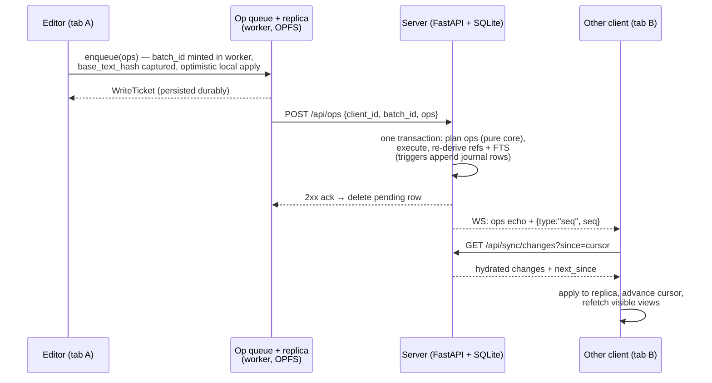
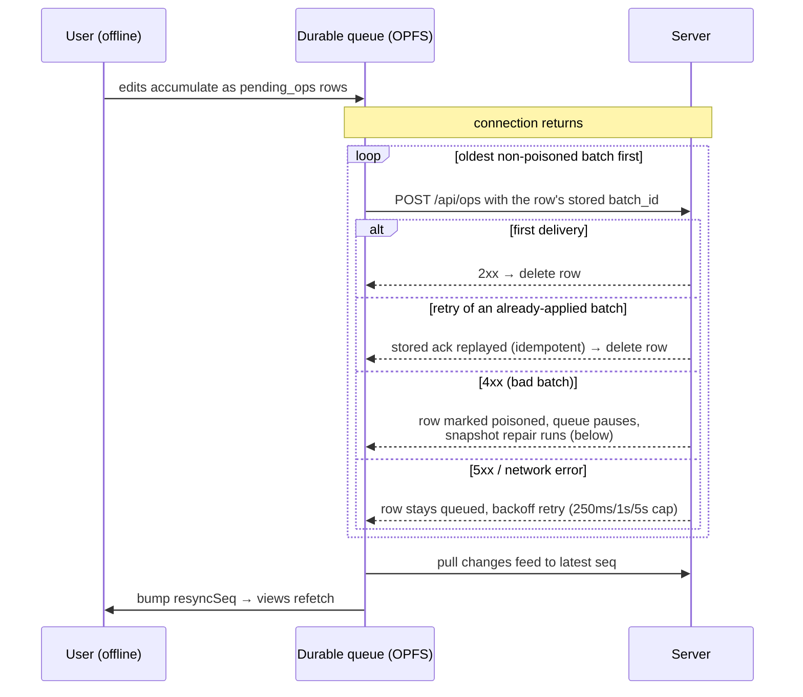

# Sync and offline architecture

This doc follows the full path an edit takes: from a keystroke, through the
browser's durable queue and replica, to the server, and back out to other
clients. It also covers how the system behaves offline. It spans both
codebases; [backend.md](backend.md) and [frontend.md](frontend.md) have the
module maps.

The authoritative design, with the rejected alternatives, is
[`docs/superpowers/specs/2026-07-12-offline-editing-design.md`](../superpowers/specs/2026-07-12-offline-editing-design.md).

## The model in one paragraph

**Server-authoritative, no CRDTs.** SQLite on the server is the single source
of truth. Clients apply edits optimistically and send op batches to
`POST /api/ops`. Down-sync is *pull-based*: an append-only change journal,
populated by SQLite triggers, gives every change a monotonic `seq`; clients
keep a cursor, and `GET /api/sync/changes?since=` returns everything after
it. The WebSocket only *nudges*. It announces real journal seqs, can force a
pull for committed metadata-only generation changes, and echoes applied
batches, but correctness never depends on receiving a frame. Offline is a
cache, not a fork: each browser holds a sqlite-wasm replica plus a durable
queue of unacknowledged batches. Batch ids make replays idempotent, and
per-block last-write-wins with `[[conflict]]` preservation resolves
collisions at push time.

## Key pieces

| Piece | Where | Role |
|---|---|---|
| Change journal | `server/src/pkm/schema.py` (`changes` table), triggers | Every row mutation gets a `seq`; populated by row-level triggers, so *any* write path is journalled automatically |
| Windowed feed | `server/.../routes_sync.py`, `sync_core.py` | `changes?since=` dedupes a window of raw journal rows; `snapshot` bootstraps |
| Sync metadata | `sync_meta` (`db_generation`, `plain_space_title_canonicalization`) | Durable server-only switches: the generation token forces client rebootstrap after importer swaps, and the title-canonicalization flag gates stripping leading/trailing plain spaces |
| Idempotent writes | `routes_ops.py`, `applied_batches` table | Same `batch_id` + same payload hash → replay stored ack; different payload → 409 |
| WS hub | `server/.../ws.py`, `notify.py` | Post-commit push of `{type:"seq",seq}`; metadata-only generation rotation adds `force:true,generation`; applied-op echoes; 1 s send timeout, stalled clients dropped |
| Replica | `web/src/replica/` (worker, OPFS) | sqlite-wasm copy of the graph (BASE_DDL only) in a worker on the OPFS SAHPool VFS |
| Op queue | `web/src/sync/opQueue.ts`, `web/src/replica/queue.ts` | Durable `pending_ops` rows in the replica DB; optimistic local apply; drain-on-reconnect |
| Sync orchestration | `web/src/sync/SyncProvider.tsx`, `replicaSync.ts` | Connect/reconnect ordering, cursor pull loop, recovery, view refetch (`resyncSeq`) |
| Offline API shim | `web/src/replica/localApi/` | Serves the read API's exact JSON shapes from the replica when offline (pinned byte-identical by `shared/fixtures/shim_parity.json`, and statically by the generated return types described below) |

## An online edit, end to end

```mermaid
sequenceDiagram
    participant U as Editor (tab A)
    participant Q as Op queue + replica<br/>(worker, OPFS)
    participant S as Server (FastAPI + SQLite)
    participant B as Other client (tab B)

    U->>Q: enqueue(ops) — batch_id minted in worker,<br/>base_text_hash captured, optimistic local apply
    Q-->>U: WriteTicket (persisted durably)
    Q->>S: POST /api/ops {client_id, batch_id, ops}
    S->>S: one transaction: plan ops (pure core),<br/>execute, re-derive refs + FTS<br/>(triggers append journal rows)
    S-->>Q: 2xx ack → delete pending row
    S-->>B: WS: ops echo + {type:"seq", seq}
    B->>S: GET /api/sync/changes?since=cursor
    S-->>B: hydrated changes + next_since
    B->>B: apply to replica, advance cursor,<br/>refetch visible views
```

Two choices here are worth spelling out:

- **The HTTP response body is ignored.** Success is the 2xx. The client's own
  state comes from the follow-up changes pull, the same path every other
  client uses. State flows down one way, not two.
- **Incoming WS op echoes are not written to the replica.** A tab drops its
  own echoes, matched by `client_id`, and uses other tabs' echoes only to
  update live views. The authoritative apply is always the cursor pull that
  the `seq` nudge triggers. A lost frame therefore costs latency, never
  correctness.

## The changes feed

`GET /api/sync/changes?since=<cursor>` (`routes_sync.py`, windowing in
`sync_core.dedupe_window`) reads a window of **raw journal rows** inside one
read transaction:

- `next_since` advances to the last raw row *scanned*, not the last distinct
  entity. Otherwise an entity whose older row shares a window with someone
  else's newer row could be skipped.
- Within the window, `(kind, entity_id)` pairs are deduped in insertion
  order, then hydrated. Blocks ship with their refs, plus any "dependency
  pages" those refs target, so a window boundary cannot deliver a block whose
  target page the client has never seen. Entities that no longer exist ship
  as tombstones.
- Hydration is batched, not per-id. `sync_core.chunk_ids` splits the window's
  ids into groups of at most 500 — comfortably under SQLite's historic
  999-parameter cap — so blocks, refs, pages and sidebar entries each cost a
  chunk-bounded number of `WHERE x IN (...)` statements instead of two per id.
  `sync_core.hydrate_in_order` then puts the id-keyed results back into the
  caller's original order and drops ids nothing was found for, which is what
  reproduces the old per-id loop's ordering and its "missing row → tombstone"
  semantics. Both helpers are pure; the queries and dict-building stay in
  `routes_sync.py`. Response shapes are unchanged.
- The client loops `pull → apply → cursor = next_since` until
  `next_since >= latest_seq` (`web/src/sync/replicaSync.ts`). The cursor
  persists in the replica's `sync_client_meta` table.

Two signals force a full re-bootstrap from `GET /api/sync/snapshot`:
`reset: true` (the client's cursor is ahead of the journal, so the database
was rebuilt) or a changed `generation` token. Both mean "this is a different
database; your cursor is meaningless".

## Title activation across online and offline paths

Snapshot and changes payloads both carry the required
`plain_space_title_canonicalization` boolean alongside `generation`. This is a
server-owned rollout switch, not a client preference. Normal server startup
does not change it, so an unactivated database stays inactive, and startup
never runs the padded-title data migration. A later explicit audited apply
sets the flag and rotates the server generation in the same transaction.
Fresh importer databases run that same audit/apply path against their
temporary database before publication, so they arrive active.

Server and replica make the same decision at their I/O boundaries:

| State | Online server/API | Offline replica |
|---|---|---|
| Always | Normalize control whitespace in title creation and page/unlinked read lookup; after normalization reject `#`, `[[`, and `]]` in normal writes | `canonicalizeTitle` applies the same normalization to local creation and reads; local writes use the same forbidden-syntax predicate |
| Inactive | Preserve leading/trailing ordinary U+0020 exactly, allowing legacy padded rows to resolve to themselves | Persist `"0"`; preserve boundary ordinary spaces and keep queued wire operations unchanged |
| Active | Strip only boundary U+0020 on creation/read; keep internal ordinary spaces and NBSP exact | Persist `"1"`; strip boundary U+0020 before local page lookup/creation and optimistic replay |

Before applying anything locally, `findOpTitleViolation()` checks every
explicit page target and ref-derived title in the whole op batch. A `#`, `[[`
or `]]` violation refuses the whole gesture before any optimistic mutation.
`enqueueBatch()` repeats that check before its transaction, so no
`pending_ops` row or partial optimistic state is persisted either. The
offline `POST /api/pages` shim returns 422 before creating its negative page
or queueing a `create_page` op. Authoritative snapshot and feed payloads are
not user writes, and remain accepted.

The replica persists the accepted flag in `sync_client_meta` in the same
transaction as the accepted payload, **before** reconciling and replaying
pending optimistic batches. That order matters. After activation the replica
first canonicalizes negative-id pages created under the inactive rule: their
blocks and refs move onto a canonical authoritative page from the accepted
feed if one exists, and otherwise the negative page is retitled in place.
Only then does it replay the unchanged durable wire operations under the new
rule. Neither padded-page residue nor optimistic user state is lost.

Activation's generation rotation forces a full rebootstrap. A client that
receives the first post-migration changes payload sees the new generation and
returns `needs-bootstrap` **before** touching its cursor, generation or
activation metadata. The snapshot then installs the canonical server graph
and metadata together, and replays pending intent. The apply route sends one
forced seq frame after commit:

    {type:"seq", seq:<actual journal max>, force:true, generation:<new token>}

A current client pulls even when that real seq equals its cursor, finds the
generation mismatch, and reboots immediately. The force bit never changes or
fabricates the cursor, so the next ordinary higher-seq frame is still
observable. If that best-effort frame is lost, the reconnect pull plus the
feed's generation check are still the correctness mechanism.

Applied-op echoes also carry authoritative stored titles. For `create`,
`create_page` and moves with a resolved page target, the caller's spelling is
replaced with the title of the page row the server actually changed —
including the blank-title fallback, control normalization, and boundary
stripping when active. Same-page moves with no `page_title` stay null. If
that authoritative row cannot be loaded, broadcast assembly fails closed: the
op transaction rolls back rather than sending caller spelling. Other tabs
therefore refetch the authoritative page key, while still relying on the
journal pull for state.

## Post-commit nudges

Three tables have change-journal triggers in `schema.py`'s `SERVER_DDL`:
`blocks`, `pages` and `sidebar_entries`. Every route whose commit touches one
of them must send a WS `{type:"seq", seq}` nudge immediately after that
commit, so connected replicas know to pull the new window. A committed
metadata or generation change that may leave `changes.seq` unchanged must
send the same frame with `force:true` and the new `generation`; `seq` is
still the actual journal maximum, never a synthetic future value. Nudges are
a latency optimization, never a correctness dependency (see "An online edit,
end to end" above).

`notify.py` provides `commit_and_nudge_threadpool` for sync-def routes,
hopping back to the event loop via `anyio.from_thread.run`, so such a route
has one line to remember instead of two. Async routes call `db.commit()` then
`await nudge(request, db)` directly. Routes whose commit and nudge cannot be
adjacent call `db.commit()` and `nudge`/`nudge_threadpool` separately:
`delete_asset` commits before best-effort unlinking of the file, and
`POST /api/ops` broadcasts the applied-op echo between the commit and the seq
nudge. Most routes nudge unconditionally after every commit, which is
harmless even when nothing changed. `cleanup_journal` is the one exception:
it guards the nudge on `deleted` being non-empty, because it runs on every
journal page load and a no-op run — the common case — never advances
`changes.seq`.

Nothing enforces this automatically. A new route that writes to a journalled
table without calling one of these helpers is a silent gap. That is how
`/api/journal/cleanup` came to delete pages and advance `changes.seq` for
years without ever nudging: replicas kept showing deleted daily pages until
an unrelated mutation happened to nudge them.
`server/tests/test_journal_advancing_contract.py` enumerates every
journal-advancing route and asserts each one emits a seq nudge. A route that
starts writing to `blocks`, `pages` or `sidebar_entries` needs a case added
there, or it ships with the same gap.

Asset routes are a partial exception, not a blanket one. The `assets` table
has no change-journal trigger, so `upload_asset`, which writes only `assets`,
correctly sends no nudge. `delete_asset` is different. When the deleted asset
has referencing blocks, it strips the reference token from each one and
either `UPDATE`s or `DELETE`s the block (`routes_assets.py` ~184-188), which
is a `blocks` write and does advance `changes.seq`. In that branch the nudge
is required, exactly like every other journal-advancing route, which is why
`delete_asset` is listed in `test_journal_advancing_contract.py` with a
referencing-block scenario. Only the orphan-delete branch — no referencing
blocks, so the commit touches `assets` alone — sends a nudge that changes
nothing.

### Hub fan-out: concurrent, per-client ordered

`Hub.broadcast()` (`ws.py`) hands each frame to a small bounded per-client
queue (`QUEUE_SIZE`) and returns without waiting on any client's network
send. Each connection has its own drain task, the sole consumer of that
client's queue, sending one frame at a time with a `SEND_TIMEOUT`-bounded
`send_json`.

That gives two properties at once. Fan-out across clients is fully
concurrent: a stalled client no longer adds its timeout to every other
client's delivery, or to the write path that called `broadcast()`. (The
previous sequential await-with-timeout loop meant N stalled clients cost N
seconds.) And delivery to any one client stays strictly in `broadcast()`
call order, because a single-consumer FIFO queue cannot reorder its own
items.

A client is disconnected outright, never buffered without bound or waited on
further, if its queue fills up or a send does not complete within
`SEND_TIMEOUT`. Disconnecting also closes the socket, best-effort with errors
swallowed. The connection can still be alive at the transport level even
though the Hub has given up on it, and without an actual close the web
client's `onclose` handler never fires — so it would sit wedged until a tab
reload instead of reconnecting and resyncing from its cursor, which is the
correctness mechanism here regardless of nudge delivery.

This is sized for a single-user server with a handful of connected replicas,
not for many concurrent connections. There is no separate cap on total
connection count, because the per-client queue bound and the send timeout
already bound the cost that matters at this scale.

## Offline editing and reconnect

While disconnected, reads and search are served from the replica through the
local API shim, and edits keep enqueueing durably. Each op is optimistically
applied to the replica under its own SAVEPOINT, and `base_text_hash` — the
sha256 of the text the edit was based on — is captured *before* that apply.
The header shows "Offline — N changes pending".

That optimistic apply must reproduce the server's timestamp rules, not just
its row contents: `localOps.ts` mirrors the server in leaving both
`blocks.updated_at` and `pages.updated_at` alone for `set_collapsed` (see
[backend.md](backend.md#the-write-path)), while every real change stamps
both. If only one side excluded collapse, a collapse made offline would
reorder the replica's recently-changed lists and then silently un-reorder them
on the next resync.

Every shim response builder declares a **generated** return type
(`PagePayload`, `JournalPayload`, `SearchPayload`, …) rather than `unknown`.
A server-side field rename the shim does not follow therefore fails
`pnpm typecheck`, instead of surfacing as a wrong-shaped payload the first
time a user goes offline. `shim_parity.json` pins recorded *values* for a
handful of requests; the return types pin the *shape* of every builder,
including branches no fixture exercises. `localApi/payloadTypes.test.ts`
guards the declarations themselves against being widened back.

What that does and does not cover is easy to lose sight of.
`ReplicaDb.select<T>` **asserts** its type argument
(`selectObjects(...) as T[]`); it cannot check a database row against a type.
A builder that passed a generated model straight to `select<T>` would look
annotated while checking nothing. So every query feeding a response names a
*local row* type and maps into a checked object literal —
`rows.map((row): PageMeta => ({ … }))`. That map, plus the payload envelope
the builder returns, is what the compiler verifies. What stays unchecked is
the row type against the real SQL: a renamed *column* is still a runtime
failure, which is what `shim_parity.json` is for.

Two replica reads walk the block tree recursively, and both are **uncapped
and cycle-safe** rather than depth-limited: `localApi/tree.ts`'s ancestor
CTE, which builds the breadcrumb trails the shim's payloads carry, and
`localOps.ts::subtreeUids`, which enumerates a subtree for an optimistic
delete or move. Each carries a `path` column of `,uid,uid,…,` and recurses
only while `instr(path, ',' || b.uid || ',') = 0`. A trail or subtree is
therefore complete however deep it goes, and a parent cycle in a damaged
replica terminates at the repeat instead of running away.

This mirrors the server's `_fetch_ancestors` exactly — see
[backend.md](backend.md#breadcrumbs-and-recursive-traversal) — and the
mirroring is the requirement: a breadcrumb read offline must return the same
trail as the same read online, so all three statements change together or not
at all. Both replica reads previously stopped at `depth < 100`. On the read
path that truncated a breadcrumb trail without saying so. On the write path
it was worse: `subtreeUids` under-reported a subtree, so an optimistic
`delete` left descendants below depth 100 in the replica with their parent
gone, and a cross-page `move` left them holding the old `page_id`. The
replica then disagreed with the server about which page owned them until the
next full resync.

```mermaid
sequenceDiagram
    participant U as User (offline)
    participant Q as Durable queue (OPFS)
    participant S as Server

    U->>Q: edits accumulate as pending_ops rows
    Note over Q,S: connection returns
    loop oldest non-poisoned batch first
        Q->>S: POST /api/ops with the row's stored batch_id
        alt first delivery
            S-->>Q: 2xx → delete row
        else retry of an already-applied batch
            S-->>Q: stored ack replayed (idempotent) → delete row
        else 4xx (bad batch)
            S-->>Q: row marked poisoned, queue pauses,<br/>snapshot repair runs (below)
        else 5xx / network error
            S-->>Q: row stays queued, backoff retry (250ms/1s/5s cap)
        end
    end
    Q->>S: pull changes feed to latest seq
    Q->>U: bump resyncSeq → views refetch
```

The reconnect ordering in `SyncProvider` is fixed: **drain the queue first,
then pull, then refetch views.** The pull then observes server state that
already includes this client's own offline edits.

Conflict resolution happens entirely server-side at push time
(`ops_core.plan_op`), per block:

| Situation | Outcome |
|---|---|
| `hash(current) == base_text_hash` | Clean apply |
| Incoming text equals current | No-op |
| Hashes differ (concurrent edit) | Incoming wins; the overwritten text is preserved as a `[[conflict]] …` sibling block right after the winner |
| Block was deleted meanwhile | Edit appended to **today's daily page** as `[[conflict]] (original block deleted) …` |
| No hash sent (legacy/CLI callers) | Unconditional last-write-wins |

Nothing is discarded. Conflict blocks are ordinary blocks, so they reach
every client through the normal feed, and they are findable through search
and the `[[conflict]]` page's backlinks.

## The replica and its recovery invariants

The replica is a real SQLite database (sqlite-wasm) in a dedicated worker on
the OPFS SAHPool VFS. One file, `/pkm-replica.sqlite3`, holds both the graph
copy (the server's `BASE_DDL`, replicated via the generated
`web/src/replica/baseSchema.gen.ts`) and the client-only tables
(`pending_ops`, `sync_client_meta`).

The guiding invariant: **the replica is a cache; the queue is the user's
intent.** A snapshot can always be re-fetched; an unflushed pending op
cannot. What follows from that (`web/src/replica/client.ts`,
`recoveryGate.ts`, `web/src/sync/opQueue.ts`):

- Optimistic local application is best-effort. An op that cannot apply
  locally is skipped, never dropped from the queue.
- Every database-mutating RPC passes through a worker-owned FIFO recovery
  gate. Recovery fingerprints the durable pending rows before starting and
  re-checks them immediately before the destructive step, aborting
  non-destructively if they changed. No acknowledged enqueue can be erased.
- After every snapshot or feed window, pending batches are re-applied on top
  (`reapplyPending`), so later edits don't capture stale base hashes.
- A rejected batch (4xx) is marked *poisoned* and delivery pauses.
  `SyncProvider` then runs an authoritative snapshot repair: reapply the
  non-poisoned batches, drop the poisoned row, resume. Failure stays visible,
  with a Retry.

### Opening the replica can fail, and that is a storage problem, not a sync problem

Two failures happen when a replica worker starts, not during sync. Both are
races between an outgoing worker and its replacement, and both fixes live in
pure policy modules: `replica/openRetry.ts` and `replica/poolCapacity.ts`.

**The open can throw.** The SAHPool VFS takes an exclusive
`SyncAccessHandle` per pooled file, and an OPFS file backs only one open
handle at a time. On a page reload — a user pressing F5, or Playwright
navigating with a full document load — the fresh replica worker calls
`installOpfsSAHPoolVfs` before the terminating worker has released its
handles, and sqlite-wasm throws "Access Handles cannot be created if there is
another open Access Handle". The fix is a bounded retry around the open.

That retry only retries because of one install option. sqlite-wasm memoises
`installOpfsSAHPoolVfs` per VFS name and by default re-awaits — and so
rethrows — a cached *rejection* forever; every retry then replays the first
error instantly without touching OPFS, and the backoff can never observe the
handles being released. `SAH_POOL_INSTALL_OPTIONS` in `openRetry.ts` therefore
passes `forceReinitIfPreviouslyFailed: true`, which sqlite-wasm documents for
exactly this case. Dropping that flag makes a single contention failure
permanent for the life of the worker (pkm-wi25), costing the local cache and
offline reads for that session. It is no longer silent data loss: per the
paragraph below, startup now falls back to online-only rather than holding its
recovery barrier.

**The open can also succeed with a pool too small to write.** The SAHPool
VFS is a fixed pool of pre-opened OPFS files, and *every* file SQLite opens
claims a slot: the database, its rollback journal, any temp file.
`installOpfsSAHPoolVfs` sizes the pool from whatever it finds in its opaque
directory, and falls back to the default capacity of 6 only when it finds
nothing. A worker that enumerates that directory while a sibling worker is
still creating the pool files can therefore come up with a capacity of one.
The database file takes the only slot, and every write transaction then fails
with `SQLITE_CANTOPEN` for the life of that worker, since nothing grows the
pool afterwards. The VFS swallows its own "SAH pool is full" message, and
reads keep working, so the damage is invisible until the first edit. The fix
is to top the pool up to `MIN_POOL_CAPACITY` immediately after the install,
before the database is opened. `addCapacity` creates fresh randomly-named
files, so it never contends with handles the outgoing worker still holds.

**Either failure can hit an enqueue**, and `opQueue` treats both like quota
exhaustion. "Cannot persist locally right now" is not a server rejection, so
firing `onDesync` is the wrong answer: its authoritative repair would wipe
the active outline back to the edit-less server state and detach the editor
mid-keystroke. Instead the ops join an **ordered in-memory fallback lane**
and are delivered by the ordinary drain, under the same connectivity, backoff
and recovery-barrier policy as durable rows.

**Startup must decide the replica is viable before it protects the replica's
contents.** `SyncProvider`'s mount effect pauses the queue on the recovery
barrier and holds it until `queue.retryPoisonMarks()` and
`replica.poisonedBatches()` have run — both replica RPCs. When the pool can
never be opened, `poisonedBatches()` rejects, and for a long time that
dead-ended startup with the barrier still held: the fallback lane was never
drained, the editor kept accepting edits, and a reload or closed tab lost them
(pkm-bjae). The online-only degradation that should have covered this
(`init()` returning `ok: false`) was unreachable, because `init()` runs inside
`start()` — the *last* thing startup does.

So discovery failure now probes viability before concluding anything:
`init()` is the one call that reports "no openable database" as a value rather
than an exception. If it says the replica is not viable, startup calls
`replicaSync.markUnavailable()` — committing the session to online-only, the
same state as `ok: false` — and lifts the barrier, so the lane drains to the
server. `markUnavailable()` exists rather than a second `start()` for a
specific reason: were a later `init()` to succeed, the session would resume
delivery with poison discovery *skipped*, which is the exact ordering hazard
the barrier exists to prevent.

**One case deliberately still holds the gate.** Retained mark intents live in
`localStorage`, not the replica, so they survive an unopenable database. When
`retryPoisonMarks()` fails with intents present, a rejected batch is *known* to
exist and cannot be repaired; delivering past it would post ahead of a batch
the server already refused. That path keeps its barrier and its "Checking
rejected changes failed: …" Retry banner, and it is the remaining case where
accepted edits can sit undelivered in memory.

The lane preserves order. Each entry records how many durable batches were
queued ahead of it, and is posted only once each of those has reached a
terminal state: delivered, or poisoned and therefore never deliverable. That
count-down is keyed to the batch and must stay so: a rejected batch whose
durable poison mark failed is still deliverable, so an outside resume can hand
it out for a second rejection, and counting it twice would drop the count below
the batches genuinely ahead of the entry. A retained op cannot overtake an
older batch, and a batch persisted after it waits its turn. Two things can
still delay an entry past a newer batch, and
both self-correct: a `pendingCount` that was already stale when the entry was
appended, and batches a rebase flushed away. Both reconcile the same way —
observing an empty durable queue clears every count, which is also what stops
the lane waiting forever on a predecessor that will never arrive.

An entry's `batch_id` is minted once, so a retry re-POSTs a byte-identical
payload. It counts towards "N changes pending". It is retained until it is
delivered, until the server rejects it with a 4xx (the one discard the queue
makes on its own, which raises the repair barrier and calls `onDesync`), or
until the queue is disposed. Before this lane existed, these ops were POSTed
inline from `enqueue()`, which offline meant they were neither persisted nor
retryable.

One diagnostic note, because it cost a misdirected investigation once. The
symptom of a misclassified storage error is a **"Server rejected a change"**
banner, which reads like a server-side rejection or a `resyncSeq` bug. When
that banner appears, check the storage layer first. The classifier is a
whitelist that denies nothing, so any *new* local-storage error shape
reintroduces the wipe: extend the classifier rather than adding another
symptom fix.

### Rebootstrap triggers

Three triggers cause a rebootstrap, all funnelled through the same recovery
coordinator:

| Trigger | Detected by | Kind |
|---|---|---|
| App deploy changed the client schema | `SCHEMA_VERSION` = sha256(base + client DDL) vs stored value | `reset` (rebuild file) |
| Server DB rebuilt or title activation rotated generation | `generation` token mismatch in any feed payload; a forced WS frame makes metadata-only rotation pull immediately | `rebase` (flush queue, re-snapshot) |
| Cursor ahead of journal | `reset: true` from the feed | `rebase` |

## Ancillary details

- **Socket** (`web/src/sync/socket.ts`): fixed 2 s reconnect interval, no
  backoff, with a 30 s ping keepalive. `resyncSeq` — a React counter bumped
  on reconnect-after-gap or repair — is what makes visible views refetch. It
  is separate from the replica's persisted cursor.
- **Connectivity and delivery health are reported independently.** The app
  can be online with delivery blocked by a poisoned batch, and the UI says
  which.
- **Online-only features** degrade explicitly rather than queueing: asset
  upload, sidebar edits, page deletion and `{{[[query]]}}` blocks say "online
  only" when offline. The `/files` browser and the LLM assistant are
  online-only wholesale. Neither `/api/assets/*` nor `/api/assistant/*` has
  an offline shim, and both are orthogonal to sync — the assistant reaches
  the graph server-side, through the API, not through the replica.
- **Service worker**: precaches the app shell, so a cold offline start boots,
  and keeps a bounded runtime cache of recently viewed assets. Mermaid's
  chunk family is precached on purpose so diagrams render offline, enforced
  by a build budget and an offline Playwright test.
- **`pkm` CLI and MCP writes** ride the same path: a fresh `batch_id` per
  command, and `base_text_hash` on updates. Agent edits get the same
  idempotency and conflict preservation as browser edits.

## Why it's debuggable

Everything stateful is inspectable SQLite. The journal is rows in the server
database; the queue is rows in the replica database. The only moving parts
are a cursor, a generation token, the title-canonicalization flag, and
content hashes. There are no vector clocks and no merge machinery, and every
failure mode reduces to "pull the feed again" or "re-snapshot and replay the
queue".
