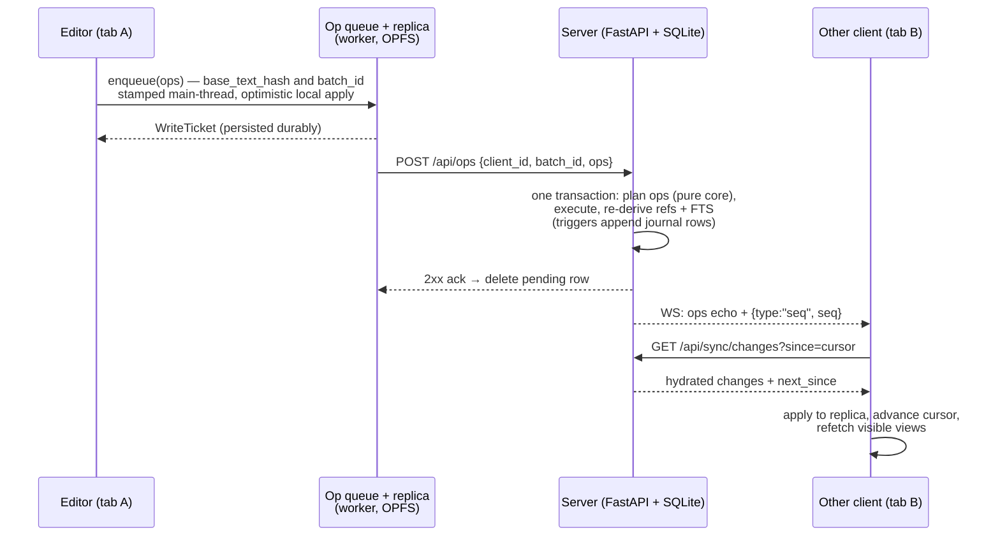
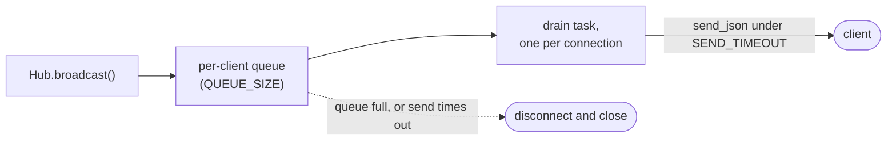
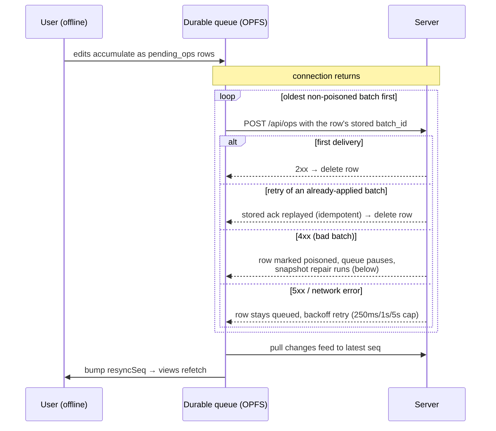

# Sync and offline architecture

This doc follows an edit from a keystroke, through the browser's durable queue
and replica, to the server, and back out to other clients. Module maps are in
[backend.md](backend.md) and [frontend.md](frontend.md); failures are indexed by
symptom in [troubleshooting.md](../troubleshooting.md); the design and its
rejected alternatives are in
[`docs/superpowers/specs/2026-07-12-offline-editing-design.md`](../superpowers/specs/2026-07-12-offline-editing-design.md).

## The model in one paragraph

**Server-authoritative, no CRDTs.** SQLite on the server is the single source
of truth. Clients apply edits optimistically and send op batches to
`POST /api/ops`. Down-sync is pull-based: SQLite triggers populate an
append-only change journal that gives every change a monotonic `seq`, and
`GET /api/sync/changes?since=` returns everything after a client's cursor. The
WebSocket only nudges — real journal seqs, a `force` bit for metadata-only
generation changes, applied-batch echoes — and correctness never depends on
receiving a frame. Offline is a cache, not a fork: each browser holds a
sqlite-wasm replica and a durable queue of unacknowledged batches. Batch ids
make replays idempotent, and per-block last-write-wins with `[[conflict]]`
preservation resolves collisions at push time.

## Key pieces

| Piece | Where | Role |
|---|---|---|
| Change journal | `server/src/pkm/schema.py` (`changes` table), triggers | Row-level triggers give every mutation a `seq`, so any write path is journalled |
| Windowed feed | `server/.../routes_sync.py`, `sync_core.py` | `changes?since=` dedupes a window of raw journal rows; `snapshot` bootstraps |
| Sync metadata | `sync_meta` (`db_generation`, `plain_space_title_canonicalization`) | Server-only switches: the generation token forces client rebootstrap; the flag gates boundary-space stripping |
| Idempotent writes | `routes_ops.py`, `applied_batches` table | Same `batch_id` + same payload hash → replay stored ack; different payload → 409; `ops` capped at 500 per batch (`contracts/ops.py`) |
| WS hub | `server/.../ws.py`, `notify.py` | Post-commit `{type:"seq",seq}`; generation rotation adds `force:true,generation`; applied-op echoes; drops a client at `QUEUE_SIZE` (64) or a `SEND_TIMEOUT` (10 s) send |
| Replica | `web/src/replica/` (worker, OPFS) | sqlite-wasm copy of the graph (BASE_DDL only) on the OPFS SAHPool VFS |
| Op queue | `web/src/sync/opQueue.ts`, `web/src/replica/queue.ts` | Durable `pending_ops` rows; optimistic local apply; drain-on-reconnect |
| Sync orchestration | `web/src/sync/SyncProvider.tsx`, `useSocketLifecycle.ts`, `reconnectFlow.ts`, `replicaSync.ts` | Connect/reconnect ordering, cursor pull loop, recovery, view refetch (`resyncSeq`) |
| Offline API shim | `web/src/replica/localApi/` | Serves the read API's JSON shapes from the replica, pinned by `shared/fixtures/shim_parity.json` and by generated return types |

## An online edit, end to end

```mermaid
sequenceDiagram
    participant U as Editor (tab A)
    participant Q as Op queue + replica<br/>(worker, OPFS)
    participant S as Server (FastAPI + SQLite)
    participant B as Other client (tab B)

    U->>Q: enqueue(ops) — base_text_hash and batch_id<br/>stamped main-thread, optimistic local apply
    Q-->>U: WriteTicket (persisted durably)
    Q->>S: POST /api/ops {client_id, batch_id, ops}
    S->>S: one transaction: plan ops (pure core),<br/>execute, re-derive refs + FTS<br/>(triggers append journal rows)
    S-->>Q: 2xx ack → delete pending row
    S-->>B: WS: ops echo + {type:"seq", seq}
    B->>S: GET /api/sync/changes?since=cursor
    S-->>B: hydrated changes + next_since
    B->>B: apply to replica, advance cursor,<br/>refetch visible views
```

The HTTP response body is ignored; success is the 2xx, and the client's own
state arrives through the same changes pull every other client uses. State flows
down one way. Incoming WS op echoes are never written to the replica: a tab
drops its own, matched by `client_id`, and uses other tabs' only to update live
views.

## The changes feed

`GET /api/sync/changes?since=<cursor>` (`routes_sync.py`, windowing in
`sync_core.dedupe_window`) reads a window of raw journal rows in one read
transaction:

- `next_since` advances to the last raw row *scanned*, not the last distinct
  entity, because an entity's older row can share a window with someone else's
  newer row.
- `(kind, entity_id)` pairs dedupe in insertion order and hydrate from current
  state, so blocks ship with every row they depend on: their refs, the pages
  those refs target, the block's own page, and the transitive `parent_uid` chain
  (`_with_parent_closure`, cycle-safe). A missing dependency fails the replica's
  deferred FK check at COMMIT. Entities that no longer exist ship as tombstones;
  a dependency block that no longer exists is absent instead.
- `block_refs` never ships; both sides derive it from block text through the
  parity-pinned extractor (see
  [Offline editing and reconnect](#offline-editing-and-reconnect)).
- Hydration is batched through the pure `sync_core.chunk_ids` (groups of at most
  500, under SQLite's historic 999-parameter cap) and `hydrate_in_order`; the
  queries stay in `routes_sync.py`.
- The client loops `pull → apply → cursor = next_since` until
  `next_since >= latest_seq` (`web/src/sync/replicaSync.ts`), persisting the
  cursor in the replica's `sync_client_meta` table.
- `applyWindow` (`web/src/replica/apply.ts`) applies a window in one
  transaction: tombstones, then pages, blocks and sidebar. The UNIQUE `title`
  columns are why tombstones lead; deferred FKs make the order irrelevant for
  references. Titles two rows swapped are parked under a placeholder
  (`parkTakenTitles`) and restored by their own upserts, and a row still parked
  afterwards returns `needs-bootstrap`. Any other failure throws out of
  `applyWindow`, and `replicaSync` decides about a repeat (see
  [Rebootstrap triggers](#rebootstrap-triggers)).

## Post-commit nudges

Three tables have change-journal triggers in `schema.py`'s `SERVER_DDL`:
`blocks`, `pages` and `sidebar_entries`. **Every route whose commit touches one
of them must send a WS `{type:"seq", seq}` nudge immediately after that
commit**. A committed metadata or generation change that may leave `changes.seq`
unchanged sends the same frame with `force:true` and the new `generation`. `seq`
is always the actual journal maximum.

`notify.py`'s `commit_and_nudge_threadpool` does both for sync-def routes via
`anyio.from_thread.run`; async routes call `db.commit()` then
`await nudge(request, db)`. `delete_asset` calls them separately, unlinking the
file in between, as does `POST /api/ops` around its applied-op echo. It has to
nudge at all because `strip_asset_tokens` (`routes_assets.py`) rewrites or
deletes every referencing block; `upload_asset` sends nothing, the `assets`
table having no trigger. `cleanup_journal` guards its nudge on `deleted` being
non-empty, since it runs on every journal page load.

Nothing enforces this in the type system, so
`server/tests/test_journal_advancing_contract.py` enumerates every
journal-advancing route and asserts a nudge.

### Hub fan-out

```mermaid
flowchart LR
    B["Hub.broadcast()"] --> Q["per-client queue<br/>(QUEUE_SIZE)"]
    Q --> D["drain task,<br/>one per connection"]
    D -->|"send_json under SEND_TIMEOUT"| C([client])
    Q -.->|"queue full, or send times out"| X([disconnect and close])
```

`Hub.broadcast()` (`ws.py`) hands each frame to the client's queue and returns
without awaiting the `send_json`, so one stalled client costs no other and never
blocks the write path; a single-consumer FIFO keeps one client's delivery in
`broadcast()` call order. Disconnecting must also close the socket, best-effort
with errors swallowed: the transport can still be alive after the Hub gives up,
and without a real close `onclose` never fires and the client never reconnects
to resync from its cursor. Nothing caps total connections.

## Offline editing and reconnect

While disconnected, reads and search come from the replica through the local API
shim, and edits keep enqueueing durably, each applied optimistically under its
own SAVEPOINT. The header shows "Offline — N changes pending".

`base_text_hash` is the sha256 of the text the edit was based on, stamped while
the editor builds the batch (`outline/baseTextHash.ts`) against the tree it was
planned from, so op N leaves the text op N+1's hash matches. The worker fills it
from `currentText` only when it is still `undefined`. Undo history records
unstamped ops and `undoManager.dispatch` stamps at replay time, because an
entry-time hash is stale and forks a spurious `[[conflict]]` sibling.

The optimistic apply mirrors the server's timestamp rules as well as its row
contents: `localOps.ts` leaves `blocks.updated_at` and `pages.updated_at` alone
for `set_collapsed` (see [backend.md](backend.md#the-write-path)).

`refs` rows arrive hydrated, their target being a page id only the server mints,
so `apply.ts` writes what the payload says. `localOps.ts` derives `refs` itself
only for its own optimistic writes, resolving titles to negative local page ids
that `reconcile.ts` remaps later. `block_refs` never ships, so both replica
paths derive it through `reindexBlockRefs` (`replica/blockRefs.ts`), the
counterpart of the server's `store.reindex_refs_for_text`. Neither opens a
transaction, the caller owning one and the delete and re-insert having to land
together.

The shim holds two invariants:

- Every response builder declares a generated return type (`PagePayload`,
  `JournalPayload`, `SearchPayload`, …), so an unfollowed server-side field
  rename fails `pnpm typecheck` instead of surfacing offline.
  `ReplicaDb.select<T>` only asserts its type argument
  (`selectObjects(...) as T[]`), so each query maps rows into a checked object
  literal; a renamed *column* stays a runtime failure that
  `shim_parity.json`'s recorded values catch.
- `localApi/tree.ts`'s ancestor CTE and `localOps.ts::subtreeUids` are uncapped
  and cycle-safe, each carrying a `path` column of `,uid,uid,…,` and recursing
  only while `instr(path, ',' || b.uid || ',') = 0`. Both mirror the server's
  `_fetch_ancestors` (see
  [backend.md](backend.md#breadcrumbs-and-recursive-traversal)), and all three
  change together.

```mermaid
sequenceDiagram
    participant U as User (offline)
    participant Q as Durable queue (OPFS)
    participant S as Server

    U->>Q: edits accumulate as pending_ops rows
    Note over Q,S: connection returns
    loop oldest non-poisoned batch first
        Q->>S: POST /api/ops with the row's stored batch_id
        alt first delivery
            S-->>Q: 2xx → delete row
        else retry of an already-applied batch
            S-->>Q: stored ack replayed (idempotent) → delete row
        else 4xx (bad batch)
            S-->>Q: row marked poisoned, queue pauses,<br/>snapshot repair runs (below)
        else 5xx / network error
            S-->>Q: row stays queued, backoff retry (250ms/1s/5s cap)
        end
    end
    Q->>S: pull changes feed to latest seq
    Q->>U: bump resyncSeq → views refetch
```

Reconnect ordering in `reconnectFlow.ts` is fixed: **drain the queue first, then
pull, then refetch views**, so the pull observes server state that already
includes this client's offline edits. A socket reconnect and the queue's drain
observer share one completion, which is what finishes a reconnect whose first
drain was blocked.

Conflict resolution happens server-side at push time (`ops_core.plan_op`), per
block:

| Situation | Outcome |
|---|---|
| `base_text_hash` matches a pre-rename snapshot of this block | The rename or merge is replayed over the incoming text, which then meets the rows below as an edit of the rewritten text |
| `hash(current) == base_text_hash` | Clean apply |
| Incoming text equals current | No-op |
| Hashes differ (concurrent edit) | Incoming wins; the overwritten text is preserved as a `[[conflict]] …` sibling block right after the winner |
| Block was deleted meanwhile | Edit appended to today's daily page as `[[conflict]] (original block deleted) …` |
| No hash sent (legacy/CLI callers) | Unconditional last-write-wins |

Nothing is discarded: conflict blocks are ordinary blocks, so they reach every
client through the feed and are findable through search and the `[[conflict]]`
page's backlinks. The first row's replay stops a device that never saw a rename
from carrying the old title back, from records in the server-only
`block_rewrites` table.

## Title activation across online and offline paths

Titles are canonicalized at both sides' I/O boundaries, and one server-owned
flag — `plain_space_title_canonicalization`, carried in every snapshot and
changes payload beside `generation` — decides how far. Normal server startup
never changes it and never runs the padded-title data migration; an explicit
audited apply sets the flag and rotates the generation in one transaction, and
fresh importer databases run that same path before publication.

| State | Online server/API | Offline replica |
|---|---|---|
| Always | Normalize control whitespace in title creation and page/unlinked read lookup; after normalization reject `#`, `[[`, and `]]` in normal writes | `canonicalizeTitle` applies the same normalization to local creation and reads; local writes use the same forbidden-syntax predicate |
| Inactive | Preserve leading/trailing ordinary U+0020 exactly, allowing legacy padded rows to resolve to themselves | Persist `"0"`; preserve boundary ordinary spaces and keep queued wire operations unchanged |
| Active | Strip only boundary U+0020 on creation/read; keep internal ordinary spaces and NBSP exact | Persist `"1"`; strip boundary U+0020 before local page lookup/creation and optimistic replay |

`findOpTitleViolation()` checks every explicit page target and ref-derived title
in a batch, and refuses the whole gesture on `#`, `[[` or `]]` before any
optimistic mutation. `enqueueBatch()` repeats the check before its transaction,
so no `pending_ops` row is persisted either, and the offline `POST /api/pages`
shim returns 422. Snapshot and feed payloads are always accepted, because
rejecting one would wedge the client's queue.

The replica persists the flag in the same transaction as the payload that
carried it, before reconciling and replaying pending batches. Activation then
canonicalizes negative-id pages created under the old rule: their blocks and
refs move onto a canonical authoritative page if the accepted feed has one,
otherwise the page is retitled in place. Only then are the durable wire ops
replayed, unchanged, under the new rule. A client that sees a new generation
returns `needs-bootstrap` before touching its cursor, generation or activation
metadata.

The apply route sends one forced frame, `{type:"seq", seq:<actual journal max>,
force:true, generation:<new token>}`; the force bit makes a client pull even
when that seq equals its cursor, and it never advances the cursor. Applied-op
echoes carry the stored title, not the caller's spelling, for `create`,
`create_page` and moves with a resolved page target, a same-page move with no
`page_title` staying null. If the row cannot be loaded, broadcast assembly fails
closed and the op transaction rolls back.

## The replica and its recovery invariants

One file, `/pkm-replica.sqlite3`, in a dedicated worker on the OPFS SAHPool VFS,
holds both the graph copy (the server's `BASE_DDL`, replicated via the generated
`web/src/replica/baseSchema.gen.ts`) and the client-only tables `pending_ops`
and `sync_client_meta`.

**The replica is a cache; the queue is the user's intent.** A snapshot can
always be re-fetched; an unflushed pending op cannot. The rest follows
(`web/src/replica/client.ts`, `recoveryGate.ts`, `web/src/sync/opQueue.ts`):

- Optimistic local application is best-effort: an op that cannot apply locally
  is skipped, never dropped from the queue.
- Every database-mutating RPC passes through a worker-owned FIFO recovery gate.
  Recovery fingerprints the durable pending rows before starting and re-checks
  them immediately before the destructive step, aborting non-destructively if
  they changed.
- `reapplyPending` re-applies pending batches on top of every snapshot and feed
  window, so later edits don't capture stale base hashes. Its guard diffs
  `PRAGMA foreign_key_check` around each batch and rolls a violating one back to
  its savepoint; enforcement pragmas don't affect that check, so it covers the
  reset rebuild under `foreign_keys=OFF` too.
- A rejected batch (4xx) is marked *poisoned* and delivery pauses.
  `SyncProvider` then runs an authoritative snapshot repair: reapply the
  non-poisoned batches, drop the poisoned row, resume.

### When the replica cannot be opened

Both failure paths are races between an outgoing worker and its replacement, and
both happen only as a worker starts. The policies are pure modules
(`replica/openRetry.ts`, `replica/poolCapacity.ts`).

```mermaid
flowchart TD
    W([replica worker starts])
    B["attempt — up to 6, backoff 50→800ms"]
    I["installOpfsSAHPoolVfs, once per worker<br/>(forceReinitIfPreviouslyFailed: true)"]
    C{"pool capacity ≥ 6?"}
    A["addCapacity up to 6<br/>(fresh random filenames)"]
    O["open /pkm-replica.sqlite3"]
    R{"SyncAccessHandle contention,<br/>and attempts left?"}
    OK([replica ready])
    X(["unusable — latched<br/>for the session"])
    W --> B --> I --> C
    C -->|"no: a sibling worker was<br/>mid-create, so capacity is 1"| A --> O
    C -->|yes| O
    O --> OK
    I -.->|throws| R
    A -.->|throws| R
    O -.->|throws| R
    R -->|yes| B
    R -->|no| X
```

`forceReinitIfPreviouslyFailed` must stay in `SAH_POOL_INSTALL_OPTIONS`, because
sqlite-wasm memoises `installOpfsSAHPoolVfs` per VFS name and otherwise
re-awaits the cached rejection. The top-up to `MIN_POOL_CAPACITY` must run
before the open, because nothing grows the pool later and every file SQLite
opens claims a slot.

### Availability: two values, one owner

**The worker owns the answer and latches it until `close()`.** `db()` in
`workerHandlers.ts` is `dbPromise ??= deps.openDb()`: it wraps the first failure
in a `ReplicaUnavailableError` and replays that same object from every later
handler call, including an `init()` that would now succeed. Only `close()`
re-arms it, because lifting the barrier starts a drain against a
freshly-reopened, unexamined database.

`ReplicaAvailability` has two values because its consumers need different
evidence:

| Value | Evidence | Keep the op? | May lift the barrier? |
|---|---|---|---|
| `unusable` | the worker's own `openDb()` failed, so there is no database: a `ReplicaUnavailableError`, on the wire as `unavailable: true` | yes | yes |
| `unreachable` | the RPC broke (`worker-error`, `message-error`, `disposed`, `timeout`), so we could not ask: an `RpcLifecycleError` on the main thread | yes | no |

`unreachable` may not lift the barrier: no answer is not evidence that nothing
is poisoned. Only `unusable` crosses the wire, as a boolean in `rpc.ts`'s
`{message, rejected, unavailable}`, and `availabilityOf()` (`replica/errors.ts`)
is where that boolean and the client-side `RpcLifecycleError` become one type.
`isSessionFatal()` answers whether a consumer may latch the state, and says yes
to everything but a bare timeout.

### What the queue and the UI do with it

A failed replica RPC means "could not persist locally right now", the same as
any other local write failure. **`opQueue` keeps the op unless the replica
rejected the op itself.** The rule is a blocklist with one entry,
`ReplicaError.rejected`, not a check on the availability type: a starved pool's
`SQLITE_CANTOPEN` is neither `unusable` nor `unreachable`, so a type check would
let it reach `onDesync`, whose repair wipes the active outline back to the
server's edit-less state. That repair is the outline repair epoch
(`outline/repairEpochs.ts`), owned by
[frontend-editor.md](frontend-editor.md#per-title-outline-sessions); delivery
resumes from its `onStable` callback.

Kept ops join an ordered in-memory fallback lane, drained under the same
connectivity, backoff and recovery-barrier policy as durable rows. Once
`noteReplicaFailure` latches `unavailable` from session-fatal evidence, the
drain stops calling `nextBatch()`/`markPoisoned()` and delivers only the lane.
Startup raises a `replica-unavailable` problem and `OfflineIndicator` renders
"Working online only — offline editing is unavailable for now."

| State | Second sentence | Why |
|---|---|---|
| Connected | "Your changes are still being saved to the server." | Raised only for an `unusable` replica, never a `rejected` op, so the queue retains every write |
| Offline, work pending | a warning that N unsent changes exist only in memory and a reload or closed tab discards them | They live only in the fallback lane, and `useUnloadGuard` interrupts a reload only where `beforeunload` is honoured, which an iOS standalone PWA does not |
| Offline, clean queue | none — the first sentence stands alone | Nothing to promise and nothing to lose |

Its action is Reload, not Retry, and it confirms first when ops are pending, the
failed open being latched for the session.

Retained mark intents live in `localStorage`, not the replica, so they survive
an unopenable database. A `retryPoisonMarks()` that fails while intents exist
keeps its barrier and a "Saving rejected-change recovery failed: …" Retry
banner. That banner also offers "Discard rejected change"
(`Sync.discardProblem()`), which drops the intents and rejoins startup, since an
intent otherwise clears only after a successful `markPoisoned`.

**Known gap:** nothing surfaces a replica that opens and then fails every write.
`availabilityOf` returns `null` for it, so no banner shows, editing stays
enabled, and the user keeps producing writes that live only in memory.

### The in-memory fallback lane

The lane matches the durable path's policy and its payload. Order is preserved:
each entry records a `pendingCount` of the durable batches queued ahead of it
and posts only once every one is terminal, delivered or poisoned, and an empty
durable queue clears every count.

An entry's `batch_id` is minted in `opQueue.enqueue` *before* the persist RPC,
and a retained entry keeps it. A durable row and its lane copy therefore share
one id, and whichever delivers second lands on the server's `applied_batches`
replay instead of a create-collision 400. Every entry counts towards "N changes
pending" and is kept until delivered, rejected with a 4xx, or the queue is
disposed. That 4xx is the only discard the queue makes on its own; it raises the
repair barrier and calls `onDesync`.

A reload destroys the lane, so `useUnloadGuard` interrupts one. It arms from
`onUnsentInMemory`, the lane's own length, never from "N changes pending", whose
total includes durable rows a reload finds again. The `beforeunload` listener
attaches only while the lane is non-empty, a permanent one opting the page out
of the back/forward cache. It is a desktop protection: an iOS standalone PWA
honours neither `beforeunload` nor `window.confirm`.

### Rebootstrap triggers

Seven conditions cause a rebootstrap from `GET /api/sync/snapshot` on their own:

| Trigger | Detected by | Kind |
|---|---|---|
| App deploy changed the client schema | `SCHEMA_VERSION` = sha256(base + client DDL) vs stored value | `reset` (rebuild file) |
| Server DB rebuilt or title activation rotated generation | `generation` token mismatch in any feed payload; a forced WS frame makes metadata-only rotation pull immediately | `rebase` (flush queue, re-snapshot) |
| Cursor ahead of journal | `reset: true` from the feed | `rebase` |
| Window cannot commit: deferred FK check fails (dependency-incomplete feed, e.g. an older server) | `applyChanges` catches the FK failure at COMMIT and returns `needs-bootstrap` | `rebase` |
| A local page or sidebar row holds a title this window gives to another id, and the window neither retitles nor tombstones that row | a row still parked by `parkTakenTitles` after the upserts throws `StaleTitleHolderError`, and `applyChanges` returns `needs-bootstrap` | `rebase` |
| The replica reports corruption (`SQLITE_CORRUPT`, or FTS5's `SQLITE_CORRUPT_VTAB`) applying a window or a rebase snapshot | `isCorruptionError` in `pullLoop` and `recover`, once per session; `replica.diagnostics()` (quick_check, FTS `integrity-check`, row counts, cursor) is posted to `POST /api/client/diagnostics` first | `reset`: a rebase would replay the snapshot through the same FTS triggers over the same corrupt index |
| A window keeps failing for any other reason — a NOT NULL or CHECK violation, a bug in an upsert | `WINDOW_STRIKES` failures of one cursor with one message in `pullLoop`; `isWindowFailure` counts only a `ReplicaError` that is neither corruption nor an availability verdict, so transport failures never count. Posted with `replica.diagnostics()` under kind `window-unappliable`, once per session | `rebase`: nothing says the schema or the FTS index is bad, and a rebase keeps the pending queue's rows |

Two more rebootstraps happen on request: the authoritative repair of a poisoned
batch, and the user's own Reset local data.

`runRecovery` (`web/src/sync/replicaSync.ts`) is the single lifecycle behind all
of them — pause delivery, take the worker lease, flush pending batches, fetch a
snapshot, commit, release the barrier. Entrants differ only in the
`RecoveryOptions` they pass:

| Option | schema / feed recovery | poison repair | manual reset |
|---|---|---|---|
| `flush` | `"preemptible"`: abandon the run if a poison mark claims recovery mid-flush | `"skip"`: never post later valid rows ahead of a batch the server refused | `"blocking"`: a failed flush raises `ResetBlockedError` and keeps the database |
| `resume` | yes | no: `SyncProvider` resumes after deleting the durable row | yes |
| `reportReplicaFailure` | yes, mode `recovery-failed` | no, the repair banner owns the report | no, the reset banner owns the report |
| `awaitInFlightPull` | no | yes | yes |
| `forceReadyOnSuccess` | no | no | yes: mode `ready`, pulls re-enabled |

A pull past the pending-id guard must finish before the database is torn down,
or its stale window applies after the fresh snapshot and moves the cursor
backwards. Recovery reached from `pullLoop` is the one entrant that keeps
`awaitInFlightPull` false, because it would await the pull it is part of. Resume
and lease abort live in the shared `catch`/`finally`.

## Ancillary details

- **Socket** (`web/src/sync/socket.ts`): exponential reconnect backoff
  (`reconnectBackoff.ts` — 2 s doubling to a 30 s cap) and a 30 s ping
  keepalive. The counter resets only on proof the link is real: the first frame
  received, or the socket staying open past `STABLE_MS` (5 s). Attempts are held
  while `document.hidden` and started on visibility or on `window`'s `online`
  event, rate-limited to the delay the schedule would have used. On return to
  visibility after `RESUME_STALE_MS` (30 s), a socket still reporting `OPEN` is
  closed on the spot, the OS having possibly frozen it (iPadOS/Safari `freeze`).
- **`resyncSeq`** is the React counter that makes visible views refetch,
  separate from the replica's persisted cursor. A repair bumps it
  unconditionally; a reconnect bumps it only when its catch-up moved local data,
  which `replicaSync.appliedVersion()` counts. Two callers skip that comparison:
  a session with no usable replica, where `appliedVersion()` returns null and
  every reconnect refetches, and a first connect flushing a previous page load's
  leftovers, which passes `begin({ viewsAreStale: true })`. That first-connect
  gate also fires on an empty durable queue while `replicaSync.hasStarted()` is
  still false, an offline cold start whose mount-time bootstrap failed.
- Connectivity and delivery health are reported independently: the app can be
  online with delivery blocked by a poisoned batch.
- **Online-only features** degrade explicitly rather than queueing:

  | Surface | Offline behaviour | Why |
  |---|---|---|
  | Asset upload, sidebar edits, page deletion, `{{[[query]]}}` blocks | say "online only" | no offline write path |
  | `/files` browser | unavailable | `/api/assets/*` has no offline shim |
  | LLM assistant | unavailable | `/api/assistant/*` has no offline shim; the assistant reaches the graph server-side through the API, not through the replica |
  | A `Local copy::` PDF (`/api/local/*`) | the in-app viewer still renders, its fetch fails, and it falls back to a note plus a plain download anchor | unlike `/assets/`, `/api/local/*` is never runtime-cached by the service worker |
  | A GoodLinks copy (`/api/goodlinks/*`) | the reader opens and shows "Needs the server" | GoodLinks content is online-only; the replica shim has no route for it |

- **Service worker**: precaches the app shell, so a cold offline start boots, and
  keeps a bounded runtime cache of recently viewed assets. The precache glob
  covers every built `.js`/`.mjs` chunk; its named special cases are the sqlite
  wasm binary, the pdf.js worker and the core KaTeX faces. A build budget and an
  offline Playwright test enforce it.
- **`pkm` CLI and MCP writes** ride the same path: a fresh `batch_id` per
  command, and `base_text_hash` on updates.
