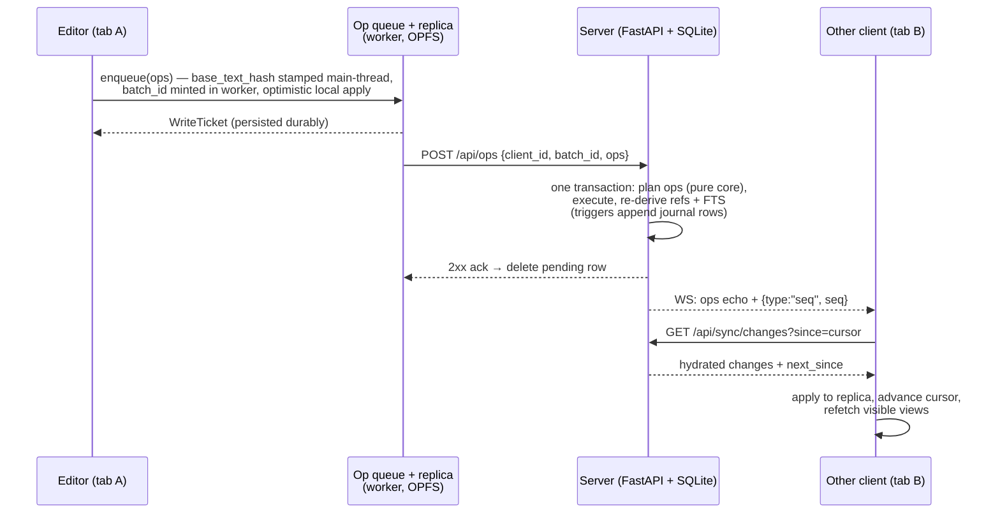
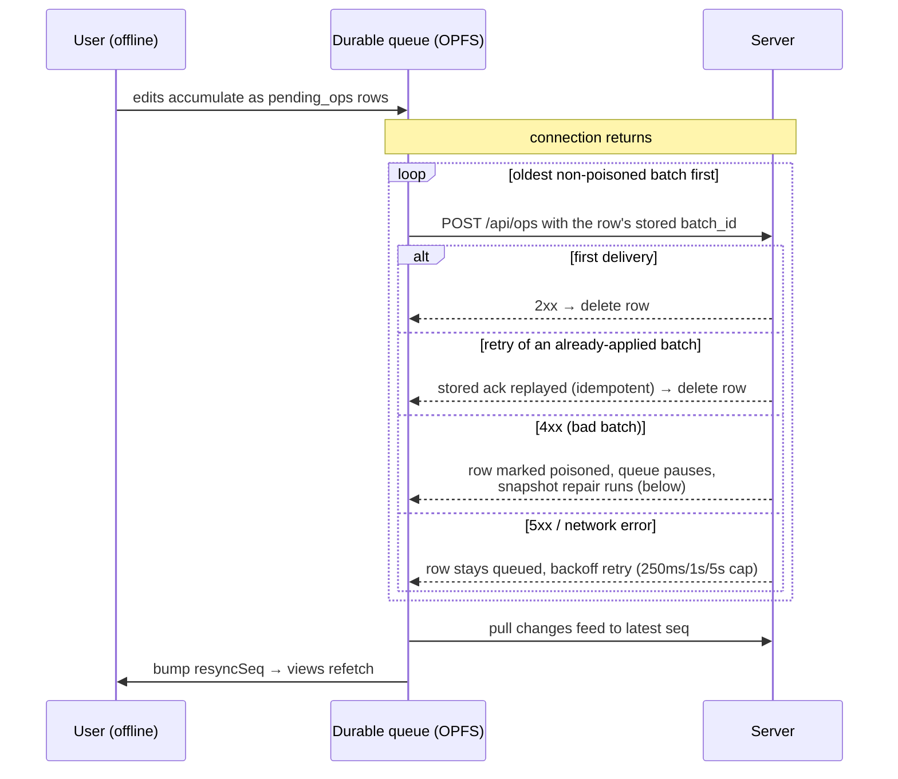
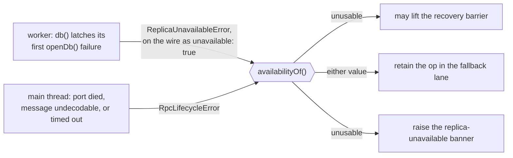

# Sync and offline architecture

This doc follows the full path an edit takes: from a keystroke, through the
browser's durable queue and replica, to the server, and back out to other
clients. It also covers how the system behaves offline. It spans both
codebases; [backend.md](backend.md) and [frontend.md](frontend.md) have the
module maps. The last section is a symptom-to-cause index for when something
looks wrong.

The authoritative design, with the rejected alternatives, is
[`docs/superpowers/specs/2026-07-12-offline-editing-design.md`](../superpowers/specs/2026-07-12-offline-editing-design.md).

## The model in one paragraph

**Server-authoritative, no CRDTs.** SQLite on the server is the single source
of truth. Clients apply edits optimistically and send op batches to
`POST /api/ops`. Down-sync is *pull-based*: an append-only change journal,
populated by SQLite triggers, gives every change a monotonic `seq`; clients
keep a cursor, and `GET /api/sync/changes?since=` returns everything after
it. The WebSocket only *nudges*. It announces real journal seqs, can force a
pull for committed metadata-only generation changes, and echoes applied
batches, but correctness never depends on receiving a frame. Offline is a
cache, not a fork: each browser holds a sqlite-wasm replica plus a durable
queue of unacknowledged batches. Batch ids make replays idempotent, and
per-block last-write-wins with `[[conflict]]` preservation resolves
collisions at push time.

## Key pieces

| Piece | Where | Role |
|---|---|---|
| Change journal | `server/src/pkm/schema.py` (`changes` table), triggers | Every row mutation gets a `seq`; populated by row-level triggers, so *any* write path is journalled automatically |
| Windowed feed | `server/.../routes_sync.py`, `sync_core.py` | `changes?since=` dedupes a window of raw journal rows; `snapshot` bootstraps |
| Sync metadata | `sync_meta` (`db_generation`, `plain_space_title_canonicalization`) | Durable server-only switches: the generation token forces client rebootstrap after importer swaps, and the title-canonicalization flag gates stripping leading/trailing plain spaces |
| Idempotent writes | `routes_ops.py`, `applied_batches` table | Same `batch_id` + same payload hash → replay stored ack; different payload → 409 |
| WS hub | `server/.../ws.py`, `notify.py` | Post-commit push of `{type:"seq",seq}`; metadata-only generation rotation adds `force:true,generation`; applied-op echoes; 1 s send timeout, stalled clients dropped |
| Replica | `web/src/replica/` (worker, OPFS) | sqlite-wasm copy of the graph (BASE_DDL only) in a worker on the OPFS SAHPool VFS |
| Op queue | `web/src/sync/opQueue.ts`, `web/src/replica/queue.ts` | Durable `pending_ops` rows in the replica DB; optimistic local apply; drain-on-reconnect |
| Sync orchestration | `web/src/sync/SyncProvider.tsx`, `replicaSync.ts` | Connect/reconnect ordering, cursor pull loop, recovery, view refetch (`resyncSeq`) |
| Offline API shim | `web/src/replica/localApi/` | Serves the read API's exact JSON shapes from the replica when offline (pinned byte-identical by `shared/fixtures/shim_parity.json`, and statically by the generated return types described below) |

## An online edit, end to end

```mermaid
sequenceDiagram
    participant U as Editor (tab A)
    participant Q as Op queue + replica<br/>(worker, OPFS)
    participant S as Server (FastAPI + SQLite)
    participant B as Other client (tab B)

    U->>Q: enqueue(ops) — base_text_hash stamped main-thread,<br/>batch_id minted in worker, optimistic local apply
    Q-->>U: WriteTicket (persisted durably)
    Q->>S: POST /api/ops {client_id, batch_id, ops}
    S->>S: one transaction: plan ops (pure core),<br/>execute, re-derive refs + FTS<br/>(triggers append journal rows)
    S-->>Q: 2xx ack → delete pending row
    S-->>B: WS: ops echo + {type:"seq", seq}
    B->>S: GET /api/sync/changes?since=cursor
    S-->>B: hydrated changes + next_since
    B->>B: apply to replica, advance cursor,<br/>refetch visible views
```

Two choices here are worth spelling out:

- **The HTTP response body is ignored.** Success is the 2xx. The client's own
  state comes from the follow-up changes pull, the same path every other
  client uses. State flows down one way, not two.
- **Incoming WS op echoes are not written to the replica.** A tab drops its
  own echoes, matched by `client_id`, and uses other tabs' echoes only to
  update live views. The authoritative apply is always the cursor pull that
  the `seq` nudge triggers. A lost frame therefore costs latency, never
  correctness.

## The changes feed

`GET /api/sync/changes?since=<cursor>` (`routes_sync.py`, windowing in
`sync_core.dedupe_window`) reads a window of **raw journal rows** inside one
read transaction:

- `next_since` advances to the last raw row *scanned*, not the last distinct
  entity. Otherwise an entity whose older row shares a window with someone
  else's newer row could be skipped.
- Within the window, `(kind, entity_id)` pairs are deduped in insertion
  order, then hydrated. Blocks ship with their refs, plus any "dependency
  pages" those refs target, so a window boundary cannot deliver a block whose
  target page the client has never seen. Entities that no longer exist ship
  as tombstones.
- Hydration is batched, not per-id. `sync_core.chunk_ids` splits the window's
  ids into groups of at most 500 — under SQLite's historic 999-parameter cap —
  and `hydrate_in_order` puts the id-keyed results back into the caller's order
  and drops ids nothing was found for, reproducing the old per-id loop's
  ordering and its "missing row → tombstone" semantics. Both helpers are pure;
  the queries stay in `routes_sync.py`.
- The client loops `pull → apply → cursor = next_since` until
  `next_since >= latest_seq` (`web/src/sync/replicaSync.ts`). The cursor
  persists in the replica's `sync_client_meta` table.

Two signals force a full re-bootstrap from `GET /api/sync/snapshot`:
`reset: true` (the client's cursor is ahead of the journal, so the database
was rebuilt) or a changed `generation` token. Both mean "this is a different
database; your cursor is meaningless".

## Title activation across online and offline paths

Titles are canonicalized at both sides' I/O boundaries, and one server-owned
flag — `plain_space_title_canonicalization`, carried in every snapshot and
changes payload beside `generation` — decides how far. It is a rollout switch,
not a client preference: normal server startup never changes it and never runs
the padded-title data migration. An explicit audited apply sets the flag and
rotates the generation in one transaction, and fresh importer databases run that
same audit/apply path before publication, so they arrive active.

| State | Online server/API | Offline replica |
|---|---|---|
| Always | Normalize control whitespace in title creation and page/unlinked read lookup; after normalization reject `#`, `[[`, and `]]` in normal writes | `canonicalizeTitle` applies the same normalization to local creation and reads; local writes use the same forbidden-syntax predicate |
| Inactive | Preserve leading/trailing ordinary U+0020 exactly, allowing legacy padded rows to resolve to themselves | Persist `"0"`; preserve boundary ordinary spaces and keep queued wire operations unchanged |
| Active | Strip only boundary U+0020 on creation/read; keep internal ordinary spaces and NBSP exact | Persist `"1"`; strip boundary U+0020 before local page lookup/creation and optimistic replay |

Forbidden syntax is caught before anything is applied. `findOpTitleViolation()`
checks every explicit page target and ref-derived title in the whole batch and
refuses the gesture on `#`, `[[` or `]]` before any optimistic mutation;
`enqueueBatch()` repeats the check before its transaction, so no `pending_ops`
row or partial optimistic state is persisted either. The offline
`POST /api/pages` shim returns 422 before creating its negative page.
Authoritative snapshot and feed payloads are not user writes and are always
accepted — rejecting one would wedge the client's queue.

Two orderings carry the weight here:

- **The replica persists the flag in the same transaction as the payload that
  carried it, and before reconciling and replaying pending batches.** After
  activation it first canonicalizes negative-id pages created under the inactive
  rule — moving their blocks and refs onto a canonical authoritative page from
  the accepted feed if one exists, otherwise retitling in place — and only then
  replays the unchanged durable wire ops under the new rule. Neither padded-page
  residue nor optimistic user state is lost.
- **A client seeing the new generation returns `needs-bootstrap` before touching
  its cursor, generation or activation metadata**, and the snapshot then installs
  graph and metadata together. Activation's apply route sends one forced frame
  after commit,
  `{type:"seq", seq:<actual journal max>, force:true, generation:<new token>}`:
  the force bit makes a client pull even when that seq equals its cursor, and
  never fabricates or advances the cursor, so the next ordinary higher-seq frame
  is still observable. If the frame is lost, the reconnect pull and the feed's
  generation check still get there.

Applied-op echoes carry the authoritative *stored* title rather than the
caller's spelling, for `create`, `create_page` and moves with a resolved page
target — blank-title fallback, control normalization and boundary stripping
included. Same-page moves with no `page_title` stay null. If that row cannot be
loaded, broadcast assembly fails closed: the op transaction rolls back rather
than sending caller spelling.

## Post-commit nudges

Three tables have change-journal triggers in `schema.py`'s `SERVER_DDL`:
`blocks`, `pages` and `sidebar_entries`. **Every route whose commit touches one
of them must send a WS `{type:"seq", seq}` nudge immediately after that commit**,
so connected replicas know to pull the new window. A committed metadata or
generation change that may leave `changes.seq` unchanged sends the same frame
with `force:true` and the new `generation`; `seq` is always the actual journal
maximum, never a synthetic future value. Nudges are a latency optimization,
never a correctness dependency (see "An online edit, end to end" above).

`notify.py` provides `commit_and_nudge_threadpool` for sync-def routes (hopping
back to the event loop via `anyio.from_thread.run`), so those have one line to
remember instead of two; async routes call `db.commit()` then
`await nudge(request, db)`. Routes whose commit and nudge cannot be adjacent
call them separately — `delete_asset` unlinks the file in between,
`POST /api/ops` broadcasts its applied-op echo. Nudging unconditionally is
harmless even when nothing changed; `cleanup_journal` alone guards its nudge on
`deleted` being non-empty, because it runs on every journal page load and a
no-op run never advances `changes.seq`.

Nothing enforces this in the type system, so
`server/tests/test_journal_advancing_contract.py` enumerates every
journal-advancing route and asserts each one emits a nudge. **A route that
starts writing to `blocks`, `pages` or `sidebar_entries` needs a case added
there, or it ships with a silent gap** — which is how `/api/journal/cleanup`
came to delete pages and advance `changes.seq` for years without ever nudging.

Asset routes are a partial exception, not a blanket one. The `assets` table has
no trigger, so `upload_asset` correctly sends nothing. `delete_asset` is
different: when the deleted asset has referencing blocks it strips the reference
token from each one and either `UPDATE`s or `DELETE`s the block
(`routes_assets.py` ~184-188), which is a `blocks` write that does advance
`changes.seq`, so the nudge is required there and the contract test covers that
scenario. Only the orphan-delete branch touches `assets` alone.

### Hub fan-out: concurrent, per-client ordered

`Hub.broadcast()` (`ws.py`) hands each frame to a small bounded per-client queue
(`QUEUE_SIZE`) and returns without waiting on any client's network send. Each
connection has its own drain task, the sole consumer of that client's queue,
sending one frame at a time with a `SEND_TIMEOUT`-bounded `send_json`. That
gives two properties at once: fan-out across clients is fully concurrent (the
previous sequential await-with-timeout loop meant N stalled clients cost N
seconds, charged to the write path that called `broadcast()`), and delivery to
any one client stays strictly in `broadcast()` call order, because a
single-consumer FIFO cannot reorder its own items.

A client whose queue fills or whose send exceeds `SEND_TIMEOUT` is disconnected
outright, never buffered without bound or waited on further. **Disconnecting
must also close the socket** (best-effort, errors swallowed): the connection can
still be alive at the transport level even though the Hub has given up on it,
and without an actual close the client's `onclose` never fires — so it would sit
wedged until a tab reload instead of reconnecting and resyncing from its cursor,
which is the correctness mechanism here regardless of nudge delivery.

This is sized for a single-user server with a handful of connected replicas.
There is no separate cap on total connection count, because the per-client queue
bound and the send timeout already bound the cost that matters at this scale.

## Offline editing and reconnect

While disconnected, reads and search are served from the replica through the
local API shim, and edits keep enqueueing durably, each applied optimistically
under its own SAVEPOINT. The header shows "Offline — N changes pending".

`base_text_hash` — the sha256 of the text the edit was based on — is on the op
before that apply. The editor stamps it when it builds the batch
(`outline/baseTextHash.ts`, walking the batch in order against the tree the
batch was planned from, so op N leaves the text op N+1's hash matches); the
worker fills it in from `currentText` only when it is still `undefined`.
Undo history deliberately records **unstamped** ops — a hash taken when the
entry was recorded is stale by the time it is replayed, and a stale hash would
fork a spurious `[[conflict]]` sibling against the user's own later edit — so
`undoManager.dispatch` stamps against the tree as it is at replay time.

The optimistic apply must reproduce the server's *timestamp* rules, not just its
row contents. `localOps.ts` mirrors the server in leaving both
`blocks.updated_at` and `pages.updated_at` alone for `set_collapsed` (see
[backend.md](backend.md#the-write-path)), while every real change stamps both.
If only one side excluded collapse, a collapse made offline would reorder the
replica's recently-changed lists and then silently un-reorder them on the next
resync.

Two invariants inside the shim are easy to break without noticing:

- **Every response builder declares a generated return type** (`PagePayload`,
  `JournalPayload`, `SearchPayload`, …), so a server-side field rename the shim
  does not follow fails `pnpm typecheck` rather than surfacing as a wrong-shaped
  payload the first time a user goes offline. The subtlety is that
  `ReplicaDb.select<T>` **asserts** its type argument
  (`selectObjects(...) as T[]`) and cannot check a row against a type, so a
  builder passing a generated model straight to `select<T>` would look annotated
  while checking nothing. Every query therefore names a *local row* type and
  maps into a checked object literal — `rows.map((row): PageMeta => ({ … }))` —
  and that map plus the envelope is what the compiler verifies. A renamed
  *column* is still a runtime failure, which is what `shim_parity.json`'s
  recorded values are for.
- **Both recursive tree walks are uncapped and cycle-safe**, not depth-limited:
  `localApi/tree.ts`'s ancestor CTE (breadcrumb trails) and
  `localOps.ts::subtreeUids` (subtree enumeration for an optimistic delete or
  move). Each carries a `path` column of `,uid,uid,…,` and recurses only while
  `instr(path, ',' || b.uid || ',') = 0`, so a trail or subtree is complete
  however deep it goes and a parent cycle in a damaged replica terminates at the
  repeat. Both mirror the server's `_fetch_ancestors` (see
  [backend.md](backend.md#breadcrumbs-and-recursive-traversal)), and the
  mirroring *is* the requirement — a breadcrumb read offline must return the same
  trail as online — so all three statements change together or not at all.

```mermaid
sequenceDiagram
    participant U as User (offline)
    participant Q as Durable queue (OPFS)
    participant S as Server

    U->>Q: edits accumulate as pending_ops rows
    Note over Q,S: connection returns
    loop oldest non-poisoned batch first
        Q->>S: POST /api/ops with the row's stored batch_id
        alt first delivery
            S-->>Q: 2xx → delete row
        else retry of an already-applied batch
            S-->>Q: stored ack replayed (idempotent) → delete row
        else 4xx (bad batch)
            S-->>Q: row marked poisoned, queue pauses,<br/>snapshot repair runs (below)
        else 5xx / network error
            S-->>Q: row stays queued, backoff retry (250ms/1s/5s cap)
        end
    end
    Q->>S: pull changes feed to latest seq
    Q->>U: bump resyncSeq → views refetch
```

The reconnect ordering in `SyncProvider` is fixed: **drain the queue first,
then pull, then refetch views.** The pull then observes server state that
already includes this client's own offline edits.

Conflict resolution happens entirely server-side at push time
(`ops_core.plan_op`), per block:

| Situation | Outcome |
|---|---|
| `hash(current) == base_text_hash` | Clean apply |
| Incoming text equals current | No-op |
| Hashes differ (concurrent edit) | Incoming wins; the overwritten text is preserved as a `[[conflict]] …` sibling block right after the winner |
| Block was deleted meanwhile | Edit appended to **today's daily page** as `[[conflict]] (original block deleted) …` |
| No hash sent (legacy/CLI callers) | Unconditional last-write-wins |

Nothing is discarded. Conflict blocks are ordinary blocks, so they reach
every client through the normal feed, and they are findable through search
and the `[[conflict]]` page's backlinks.

## The replica and its recovery invariants

The replica is a real SQLite database (sqlite-wasm) in a dedicated worker on
the OPFS SAHPool VFS. One file, `/pkm-replica.sqlite3`, holds both the graph
copy (the server's `BASE_DDL`, replicated via the generated
`web/src/replica/baseSchema.gen.ts`) and the client-only tables
(`pending_ops`, `sync_client_meta`).

**The replica is a cache; the queue is the user's intent.** A snapshot can
always be re-fetched; an unflushed pending op cannot. Everything below follows
from that (`web/src/replica/client.ts`, `recoveryGate.ts`,
`web/src/sync/opQueue.ts`):

- Optimistic local application is best-effort. An op that cannot apply
  locally is skipped, never dropped from the queue.
- Every database-mutating RPC passes through a worker-owned FIFO recovery
  gate. Recovery fingerprints the durable pending rows before starting and
  re-checks them immediately before the destructive step, aborting
  non-destructively if they changed. No acknowledged enqueue can be erased.
- After every snapshot or feed window, pending batches are re-applied on top
  (`reapplyPending`), so later edits don't capture stale base hashes.
- A rejected batch (4xx) is marked *poisoned* and delivery pauses.
  `SyncProvider` then runs an authoritative snapshot repair: reapply the
  non-poisoned batches, drop the poisoned row, resume. Failure stays visible,
  with a Retry.

### When the replica cannot be opened

This is a storage problem, not a sync problem, and it happens when a replica
worker *starts* — never mid-sync. Both failure paths are races between an
outgoing worker and its replacement, and both fixes are pure policy modules
(`replica/openRetry.ts`, `replica/poolCapacity.ts`).

```mermaid
flowchart TD
    W([replica worker starts])
    B["attempt — up to 6, backoff 50→800ms"]
    I["installOpfsSAHPoolVfs, once per worker<br/>(forceReinitIfPreviouslyFailed: true)"]
    C{"pool capacity ≥ 6?"}
    A["addCapacity up to 6<br/>(fresh random filenames)"]
    O["open /pkm-replica.sqlite3"]
    R{"SyncAccessHandle contention,<br/>and attempts left?"}
    OK([replica ready])
    X(["unusable — latched<br/>for the session"])
    W --> B --> I --> C
    C -->|"no: a sibling worker was<br/>mid-create, so capacity is 1"| A --> O
    C -->|yes| O
    O --> OK
    I -.->|throws| R
    A -.->|throws| R
    O -.->|throws| R
    R -->|yes| B
    R -->|no| X
```

The retry wraps the whole sequence, not just the install — and only absorbs
errors that look like handle contention, so a persistent failure fails fast into
online-only rather than stalling startup. Two things in that path are invisible
from the shapes:

- **The retry only retries because of the install option.** sqlite-wasm
  memoises `installOpfsSAHPoolVfs` per VFS name and by default re-awaits — so
  rethrows — a cached *rejection* forever, replaying the first error instantly
  without ever touching OPFS. Drop `forceReinitIfPreviouslyFailed` from
  `SAH_POOL_INSTALL_OPTIONS` and the backoff can never observe the handles being
  released.
- **A pool too small to write opens perfectly.** Every file SQLite opens claims
  a slot — the database, its rollback journal, any temp file — so a capacity of
  one leaves reads working while every write transaction fails with
  `SQLITE_CANTOPEN` for the life of the worker, the VFS swallowing its own "SAH
  pool is full" message. Nothing grows the pool afterwards, which is why the
  top-up to `MIN_POOL_CAPACITY` has to happen before the database is opened.

### Availability: two values, one owner

Startup has to decide the replica is viable *before* it can protect the
replica's contents: `SyncProvider`'s mount effect pauses the queue on the
recovery barrier and holds it until `queue.retryPoisonMarks()` and
`replica.poisonedBatches()` have run, both of which are replica RPCs. When the
pool can never be opened, those reject — and the availability fact exists so
that such a rejection does not dead-end startup with the barrier still held.

**The worker owns the fact and latches it until `close()`.** `db()` in
`workerHandlers.ts` is `dbPromise ??= deps.openDb()`; the first failure is
wrapped in a `ReplicaUnavailableError` and stored, and every later handler call
— including an `init()` that would now succeed — replays that same object. Only
`close()` re-arms it. Nothing else may clear it: lifting the barrier kicks a
drain, and a drain against a freshly-reopened, unexamined database is precisely
what the barrier exists to prevent.

```mermaid
flowchart LR
    D["worker: db() latches its<br/>first openDb() failure"]
    P["main thread: port died,<br/>message undecodable, or timed out"]
    AV{{"availabilityOf()"}}
    D -->|"ReplicaUnavailableError,<br/>on the wire as unavailable: true"| AV
    P -->|"RpcLifecycleError"| AV
    AV -->|"unusable"| L1["may lift the recovery barrier"]
    AV -->|"either value"| L2["retain the op in the fallback lane"]
    AV -->|"unusable"| L3["raise the replica-unavailable banner"]
```

`ReplicaAvailability` is two-valued because its consumers need different
strengths of evidence:

| Value | Evidence | Retain the op? | May lift the barrier? |
|---|---|---|---|
| `unusable` | the worker's own `openDb()` failed: there is definitively no database | yes | **yes** |
| `unreachable` | the RPC itself broke (`worker-error`, `message-error`, `disposed`, `timeout`): we could not *ask* | yes | **no** |

Lifting the barrier asserts there is no poison table left to protect, and "we
could not ask" is the absence of that assertion, not a weaker form of it. Only
`unusable` crosses the wire, as a plain boolean in `rpc.ts`'s
`{message, rejected, unavailable}`, because the worker's own failed open is the
only thing it can assert about itself; `availabilityOf()` (`replica/errors.ts`)
is the one place that boolean and the client-side `RpcLifecycleError` become a
single two-valued type. `isSessionFatal()` answers the separate question of
whether a consumer may *latch* the state: everything except a bare timeout,
which rejects one request and leaves the client usable.

### What the queue and the UI do with it

`opQueue` treats a failed replica RPC as "could not persist locally right now",
which is what it does with every local write failure, and **retains the op
unless the replica rejected the op itself.** That rule is a one-item blocklist
on `ReplicaError.rejected` — an op the server would refuse too, e.g. unsupported
reference title syntax — and deliberately *not* a check on the availability
type: a starved pool's `SQLITE_CANTOPEN` is neither `unusable` nor
`unreachable`, so a type check would fall through to `onDesync`, whose
authoritative repair wipes the active outline back to the edit-less server state
and detaches the editor mid-keystroke.

Retained ops join an ordered **in-memory fallback lane** and are delivered by
the ordinary drain, under the same connectivity, backoff and recovery-barrier
policy as durable rows. There is no storage-full mode, and no signal to build
one from: the opfs-sahpool VFS catches `SyncAccessHandle.write()`'s
`QuotaExceededError`, stores it privately and returns `SQLITE_IOERR`, so an
exhausted disk arrives as a bare "disk I/O error" like any other write failure.

Once `noteReplicaFailure` latches `unavailable` from session-fatal evidence, the
drain stops calling `nextBatch()`/`markPoisoned()` and delivers only the lane —
which is what lets a socket reconnect resume delivery at all, since a drain that
keeps calling a dead replica never returns `"drained"`.

**The user is told, rather than the session degrading silently.** Startup raises
a `replica-unavailable` problem and `OfflineIndicator` renders "Working online
only — offline editing is unavailable for now.", followed by a second sentence
that turns on connectivity, because the truth does:

| State | Second sentence | Why |
|---|---|---|
| Connected | "Your changes are still being saved to the server." | This problem is only ever raised for an `unusable` replica, never a `rejected` op, so the queue retains every write |
| Offline, work pending | a warning that N unsent changes exist only in memory and a reload or closed tab discards them | They live only in the fallback lane, and there is no `beforeunload` anywhere in `web/src` |
| Offline, clean queue | none — the first sentence stands alone | Nothing to promise and nothing to lose |

The action is **Reload**, not Retry, and it confirms first when ops are pending.
The failed open is latched for the session, and by the time the banner shows the
queue has already delivered online — so reopening mid-session could flush a
previous session's stale durable queue on top of those writes. A fresh page load
gets a fresh worker and runs poison discovery in the correct order.

**One case deliberately still holds the gate.** Retained mark intents live in
`localStorage`, not the replica, so they survive an unopenable database. When
`retryPoisonMarks()` fails with intents present, a rejected batch is *known* to
exist and cannot be repaired, and delivering past it would post ahead of a batch
the server already refused — so that path keeps its barrier and its "Checking
rejected changes failed: …" Retry banner. It is the one place where *the queue's
own policy* holds accepted edits in memory while the socket is up; an
online-only session that merely loses connectivity gets there too, by having
lane ops and no durable queue to put them in. Reading a report of lost edits,
the first resolves by clearing the barrier and the second only by reconnecting
before the tab closes.

**Known gap (pkm-0htf):** a replica that *opens* and then fails every write is
surfaced nowhere. `availabilityOf` returns `null` for it, so no banner shows and
editing stays enabled — correctly, since the ops do reach the server, but the
user goes on producing writes that live only in memory.

### The in-memory fallback lane

The lane matches the durable path's policy *and* its payload. `base_text_hash`
is stamped on the main thread at op-construction time
(`outline/baseTextHash.ts`), so it is on the op before the lane ever sees it,
and the worker's fill-in-when-`undefined` supplements that rather than owning
it. Stamping only inside the worker meant ops that never reached the database —
every op in an online-only session — arrived at the server without a hash, and
the server returned early into plain last-write-wins.

**The lane preserves order.** Each entry records how many durable batches were
queued ahead of it and posts only once each of those is terminal — delivered, or
poisoned and therefore never deliverable — so a retained op cannot overtake an
older batch and a batch persisted after it waits its turn. The count-down is
keyed to the batch and must stay so: a rejected batch whose poison mark failed
is still deliverable, so an outside resume can hand it out for a second
rejection, and counting it twice would drop the count below the batches
genuinely ahead. An entry can still be delayed past a newer batch by a
`pendingCount` that was stale when it was appended, or by batches a rebase
flushed away; both self-correct, because observing an empty durable queue clears
every count — which is also what stops the lane waiting forever on a predecessor
that will never arrive.

An entry's `batch_id` is minted once, so a retry re-POSTs a byte-identical
payload. Every entry counts towards "N changes pending", and is retained until
it is delivered, until the server rejects it with a 4xx (the one discard the
queue makes on its own, which raises the repair barrier and calls `onDesync`),
or until the queue is disposed.

### Rebootstrap triggers

Three triggers cause a rebootstrap, all funnelled through the same recovery
coordinator:

| Trigger | Detected by | Kind |
|---|---|---|
| App deploy changed the client schema | `SCHEMA_VERSION` = sha256(base + client DDL) vs stored value | `reset` (rebuild file) |
| Server DB rebuilt or title activation rotated generation | `generation` token mismatch in any feed payload; a forced WS frame makes metadata-only rotation pull immediately | `rebase` (flush queue, re-snapshot) |
| Cursor ahead of journal | `reset: true` from the feed | `rebase` |

## Ancillary details

- **Socket** (`web/src/sync/socket.ts`): fixed 2 s reconnect interval, no
  backoff, with a 30 s ping keepalive. `resyncSeq` — a React counter bumped
  on reconnect-after-gap or repair — is what makes visible views refetch. It
  is separate from the replica's persisted cursor.
- **Connectivity and delivery health are reported independently.** The app
  can be online with delivery blocked by a poisoned batch, and the UI says
  which.
- **Online-only features** degrade explicitly rather than queueing: asset
  upload, sidebar edits, page deletion and `{{[[query]]}}` blocks say "online
  only" when offline. The `/files` browser and the LLM assistant are
  online-only wholesale. Neither `/api/assets/*` nor `/api/assistant/*` has
  an offline shim, and both are orthogonal to sync — the assistant reaches
  the graph server-side, through the API, not through the replica.
- **Service worker**: precaches the app shell, so a cold offline start boots,
  and keeps a bounded runtime cache of recently viewed assets. Mermaid's
  chunk family is precached on purpose so diagrams render offline, enforced
  by a build budget and an offline Playwright test.
- **`pkm` CLI and MCP writes** ride the same path: a fresh `batch_id` per
  command, and `base_text_hash` on updates. Agent edits get the same
  idempotency and conflict preservation as browser edits.

## When something looks wrong

Each row is a failure this system has actually produced, and the invariant its
fix installed. The bean has the full investigation.

| Symptom | Cause | Ref |
|---|---|---|
| Every retry of the OPFS open fails instantly with the same error | the memoised-rejection trap: `forceReinitIfPreviouslyFailed` was dropped | pkm-wi25 |
| Reads work; every edit fails `SQLITE_CANTOPEN` | the pool installed at capacity 1 and the top-up is missing or ran too late | pkm-ndcu |
| "Server rejected a change" and the outline reverts, but the server is healthy | a *local* storage failure reached `onDesync`. Retention was once a whitelist matched on error message; the blocklist on `rejected` is what makes an unrecognised storage failure retain by default | pkm-c9hp, pkm-s7af |
| After reconnect, durable delivery never resumes and the drain never reports `"drained"` | the drain kept calling a dead replica. Its "no repeated OPFS open" premise holds only because of the worker's latch — do not "fix" this by re-arming the DB | pkm-9x6u |
| Startup wedges: edits accepted, nothing delivered, socket up | the recovery barrier was held on an RPC that could never answer, and the lane was never drained | pkm-bjae |
| Unsent edits vanish on reload in an online-only session | the lane is their only home, and there is no `beforeunload`; the banner warns, the browser's own controls do not | pkm-bjae, pkm-tu5k |
| A profile stays wedged across sessions after a rejected batch | the retained mark intent in `localStorage` clears only after a successful `markPoisoned`, which an unopenable replica can never do. Open by design | pkm-tu5k |
| Two tabs; one tab's `update_text` overwrote the other's with no `[[conflict]]` sibling | the op carried no `base_text_hash`, so the server took its legacy branch and plain last-write-wins | pkm-4ubd |
| A collapse made offline reorders recently-changed lists, then un-reorders on resync | one side stamped `updated_at` for `set_collapsed` and the other did not | pkm-r7k8 |
| A breadcrumb read offline differs from the same read online; descendants orphaned after an offline delete or cross-page move | a depth cap on the replica's recursive walks (both were `depth < 100`) | — |
| A deleted page keeps showing in replicas until some unrelated edit | a journal-advancing route committed without nudging; add it to `test_journal_advancing_contract.py` | — |
| Tempted to add a read-only "storage full" mode | there is no signal to trigger it: the VFS reports `SQLITE_IOERR`. A `quota` flag existed for years that nothing in `web/src` could set | pkm-avag |

## Why it's debuggable

Everything stateful is inspectable SQLite. The journal is rows in the server
database; the queue is rows in the replica database. The only moving parts
are a cursor, a generation token, the title-canonicalization flag, and
content hashes. There are no vector clocks and no merge machinery, and every
failure mode reduces to "pull the feed again" or "re-snapshot and replay the
queue".
