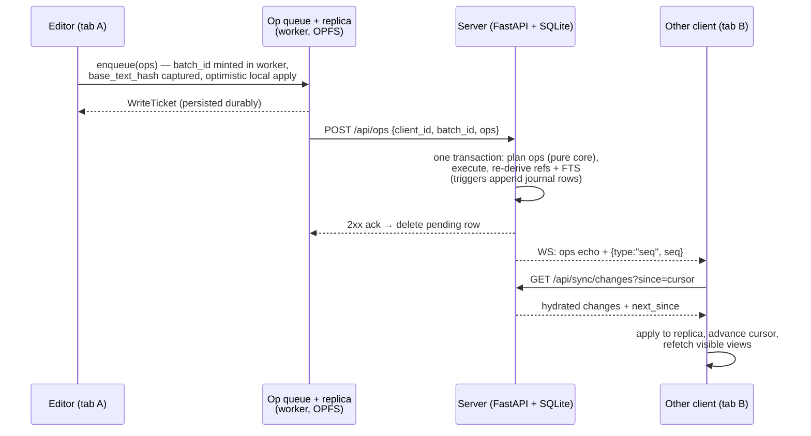
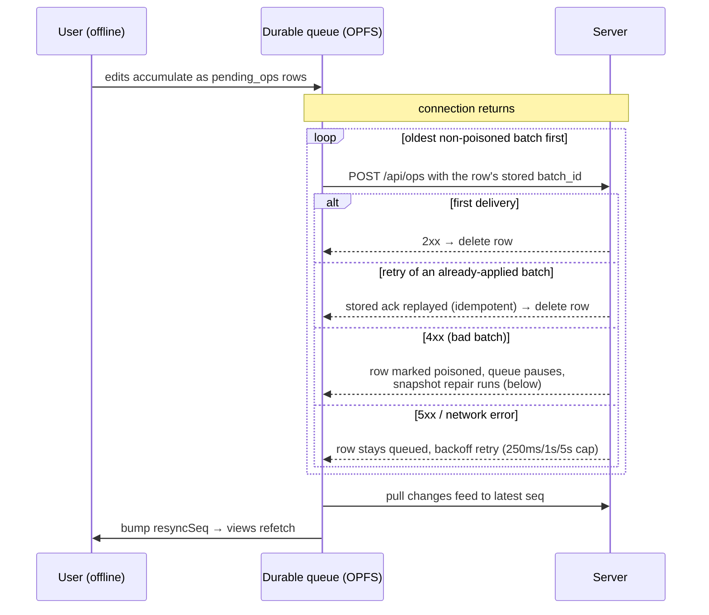

# Sync and offline architecture

This doc describes the full path an edit takes — from a keystroke, through
the browser's durable queue and replica, to the server and back out to other
clients — and how the system behaves offline. It spans both codebases; see
[backend.md](backend.md) and [frontend.md](frontend.md) for the module maps.

The authoritative design (with rejected alternatives) is
[`docs/superpowers/specs/2026-07-12-offline-editing-design.md`](../superpowers/specs/2026-07-12-offline-editing-design.md).

## The model in one paragraph

**Server-authoritative, no CRDTs.** SQLite on the server is the single
source of truth; clients apply edits optimistically and send op batches to
`POST /api/ops`. Down-sync is *pull-based*: an append-only change journal
(populated by SQLite triggers) gives every change a monotonic `seq`, clients
keep a cursor, and `GET /api/sync/changes?since=` returns everything after
it. The WebSocket only *nudges* — it announces real journal seqs, can force a
pull for committed metadata-only generation changes, and echoes applied
batches, but correctness never depends on receiving a frame. Offline is a
cache, not a fork: each browser holds a sqlite-wasm replica plus a durable
queue of unacknowledged batches; batch ids make replays idempotent, and
per-block last-write-wins with `[[conflict]]` preservation resolves
collisions at push time.

## Key pieces

| Piece | Where | Role |
|---|---|---|
| Change journal | `server/src/pkm/schema.py` (`changes` table), triggers | Every row mutation gets a `seq`; populated by row-level triggers, so *any* write path is journalled automatically |
| Windowed feed | `server/.../routes_sync.py`, `sync_core.py` | `changes?since=` dedupes a window of raw journal rows; `snapshot` bootstraps |
| Sync metadata | `sync_meta` (`db_generation`, `plain_space_title_canonicalization`) | Durable server-only switches: the generation token forces client rebootstrap after importer swaps, and the title-canonicalization flag gates stripping leading/trailing plain spaces |
| Idempotent writes | `routes_ops.py`, `applied_batches` table | Same `batch_id` + same payload hash → replay stored ack; different payload → 409 |
| WS hub | `server/.../ws.py`, `notify.py` | Post-commit push of `{type:"seq",seq}`; metadata-only generation rotation adds `force:true,generation`; applied-op echoes; 1 s send timeout, stalled clients dropped |
| Replica | `web/src/replica/` (worker, OPFS) | sqlite-wasm copy of the graph (BASE_DDL only) in a worker on the OPFS SAHPool VFS |
| Op queue | `web/src/sync/opQueue.ts`, `web/src/replica/queue.ts` | Durable `pending_ops` rows in the replica DB; optimistic local apply; drain-on-reconnect |
| Sync orchestration | `web/src/sync/SyncProvider.tsx`, `replicaSync.ts` | Connect/reconnect ordering, cursor pull loop, recovery, view refetch (`resyncSeq`) |
| Offline API shim | `web/src/replica/localApi/` | Serves the read API's exact JSON shapes from the replica when offline (pinned byte-identical by `shared/fixtures/shim_parity.json`, and statically by the generated return types described below) |

## An online edit, end to end

```mermaid
sequenceDiagram
    participant U as Editor (tab A)
    participant Q as Op queue + replica<br/>(worker, OPFS)
    participant S as Server (FastAPI + SQLite)
    participant B as Other client (tab B)

    U->>Q: enqueue(ops) — batch_id minted in worker,<br/>base_text_hash captured, optimistic local apply
    Q-->>U: WriteTicket (persisted durably)
    Q->>S: POST /api/ops {client_id, batch_id, ops}
    S->>S: one transaction: plan ops (pure core),<br/>execute, re-derive refs + FTS<br/>(triggers append journal rows)
    S-->>Q: 2xx ack → delete pending row
    S-->>B: WS: ops echo + {type:"seq", seq}
    B->>S: GET /api/sync/changes?since=cursor
    S-->>B: hydrated changes + next_since
    B->>B: apply to replica, advance cursor,<br/>refetch visible views
```

Two things are deliberate here:

- **The HTTP response body is ignored.** Success is the 2xx; the client's
  own state comes from the follow-up changes pull, the same path every other
  client uses. There is one way state flows down, not two.
- **Incoming WS op echoes are not written to the replica.** A tab drops its
  own echoes (matching `client_id`) and uses others only to update live
  views; the authoritative apply is always the cursor pull that the `seq`
  nudge triggers. A lost frame therefore costs latency, never correctness.

## The changes feed

`GET /api/sync/changes?since=<cursor>` (`routes_sync.py`, windowing in
`sync_core.dedupe_window`) reads a window of **raw journal rows** inside one
read transaction:

- `next_since` advances to the last raw row *scanned*, not the last distinct
  entity — so an entity whose older row shares a window with someone else's
  newer row can't be skipped.
- Within the window, `(kind, entity_id)` pairs are deduped in insertion
  order, then hydrated: blocks ship with their refs, plus any "dependency
  pages" those refs target, so a window boundary can't deliver a block whose
  target page the client has never seen. Entities that no longer exist ship
  as tombstones.
- The client loops `pull → apply → cursor = next_since` until
  `next_since >= latest_seq` (`web/src/sync/replicaSync.ts`; the cursor
  persists in the replica's `sync_client_meta` table).

Two signals force a full re-bootstrap from `GET /api/sync/snapshot`:
`reset: true` (the client's cursor is ahead of the journal — the DB was
rebuilt) or a changed `generation` token. Both mean "this is a different
database; your cursor is meaningless".

## Title activation across online and offline paths

Snapshot and changes payloads both carry the required
`plain_space_title_canonicalization` boolean alongside `generation`. This is a
server-owned rollout switch, not a client preference: normal server startup
does not change it, so an unactivated database stays inactive, and startup
never runs the padded-title data migration. A later explicit audited apply
sets the flag and rotates the server generation in the same transaction.
Fresh importer databases reuse
that audit/apply path on their temporary database before publication, so they
arrive active rather than waiting for startup.

The server and replica deliberately make the same decision at their I/O
boundaries:

| State | Online server/API | Offline replica |
|---|---|---|
| Always | Normalize control whitespace in title creation and page/unlinked read lookup; after normalization reject `#`, `[[`, and `]]` in normal writes | `canonicalizeTitle` applies the same normalization to local creation and reads; local writes use the same forbidden-syntax predicate |
| Inactive | Preserve leading/trailing ordinary U+0020 exactly, allowing legacy padded rows to resolve to themselves | Persist `"0"`; preserve boundary ordinary spaces and keep queued wire operations unchanged |
| Active | Strip only boundary U+0020 on creation/read; keep internal ordinary spaces and NBSP exact | Persist `"1"`; strip boundary U+0020 before local page lookup/creation and optimistic replay |

Before normal local application, `findOpTitleViolation()` preflights every
explicit page target and ref-derived title in the complete op batch. A `#`,
`[[`, or `]]` violation therefore refuses the whole gesture before optimistic
mutation. `enqueueBatch()` repeats that preflight before its transaction, so no
`pending_ops` row or partial optimistic state is persisted. The offline
`POST /api/pages` shim returns 422 before creating its negative page or queued
`create_page` op. Authoritative snapshot/feed payloads are not user writes and
remain accepted.

The replica persists an accepted flag in `sync_client_meta` in the same
transaction as the accepted payload, **before** reconciling and replaying
pending optimistic batches. That order is load-bearing: after activation it
first canonicalizes negative-id pages created under the inactive rule. It
remaps their blocks and refs onto a canonical authoritative page from the
accepted feed when one exists, or retitles the negative page in place
otherwise. It then replays the unchanged durable wire operations under the
new rule, so neither padded-page residue nor optimistic user state is lost.

Activation's generation rotation intentionally forces a full rebootstrap. A
client that receives the first post-migration changes payload sees the new
generation and returns `needs-bootstrap` **before** mutating cursor,
generation, or activation metadata; the snapshot then installs the canonical
server graph and metadata together and replays pending intent. The apply
route sends one forced seq frame after commit:
`{type:"seq", seq:<actual journal max>, force:true, generation:<new token>}`.
A current client pulls even when that real seq equals its cursor, discovers
the generation mismatch, and reboots immediately. The force bit never changes
or fabricates the cursor, so the next ordinary higher-seq frame remains
observable. Reconnect pull plus the feed's generation check remain the
correctness mechanism if the best-effort frame is lost.

Applied-op echoes also use authoritative stored titles: create, create-page,
and moves with a resolved page target replace the caller spelling with the
title of the page row the server actually changed (blank fallback, control
normalization, and active boundary stripping included). Same-page moves with
no `page_title` remain null. If that authoritative row cannot be loaded,
broadcast assembly fails closed and the op transaction rolls back rather than
sending caller spelling. Other tabs therefore refetch the authoritative page
key while still relying on the journal pull for state.

## Post-commit nudges

Every route whose commit touches a changes-journaled table (`blocks`,
`pages`, or `sidebar_entries` — the three with triggers in `schema.py`
`SERVER_DDL`) must send a WS `{type:"seq", seq}` nudge immediately after
that commit, so connected replicas know to pull the new window. A committed
metadata/generation change that may leave `changes.seq` unchanged must send
the same frame with `force:true` and the new `generation`; `seq` is still the
actual journal maximum, never a synthetic future value. Nudges are
a latency optimization, never a correctness dependency — see "An online
edit, end to end" above). `notify.py` provides `commit_and_nudge_threadpool`
for sync-def routes (hopping back to the event loop via
`anyio.from_thread.run`) so a route has one line to remember instead of
two; async routes call `db.commit()` then `await nudge(request, db)`
directly. Routes whose commit and
nudge can't be adjacent — `delete_asset` commits before best-effort
unlinking the file, and `POST /api/ops` broadcasts the applied-op echo
between the commit and the seq nudge — call `db.commit()` and
`nudge`/`nudge_threadpool` separately instead. Most routes nudge
unconditionally after every commit (harmless even when nothing changed);
`cleanup_journal` is the one exception, guarding the nudge on `deleted`
being non-empty, because it runs on every journal page load and a no-op
run (the common case) never advances `changes.seq`.

Nothing enforces this automatically: a new route that writes to a
journaled table without calling one of these helpers is a silent gap, the
kind that let `/api/journal/cleanup` (bean pkm-getl) delete pages and
advance `changes.seq` for years without ever nudging — replicas kept
showing deleted daily pages until an unrelated mutation happened to nudge
them. `server/tests/test_journal_advancing_contract.py` enumerates every
journal-advancing route and asserts each one emits a seq nudge; a route
that starts writing to `blocks`/`pages`/`sidebar_entries` needs a case
added there, or it ships with the same silent gap.

Asset routes are a partial, not blanket, exception: `assets` itself has no
changes-journal trigger, so `upload_asset` (writes only `assets`) correctly
sends no nudge. `delete_asset` is different — when the deleted asset has
referencing blocks, it strips the reference token from each one and either
`UPDATE`s or `DELETE`s the block (`routes_assets.py` ~184-188), which *is*
a `blocks` write and does advance `changes.seq`. In that branch the nudge
is load-bearing, exactly like every other journal-advancing route, not
incidental surplus — `delete_asset` is listed in
`test_journal_advancing_contract.py` with a referencing-block scenario for
this reason. Only the orphan-delete branch (no referencing blocks, so the
commit touches `assets` alone) sends a nudge that changes nothing.

### Hub fan-out: concurrent, per-client ordered (pkm-nn57)

`Hub.broadcast()` (`ws.py`) hands each frame to a small bounded
per-client queue (`QUEUE_SIZE`) and returns without waiting on any
client's network send. Each connection has its own "drain" task that is
the sole consumer of that client's queue, sending one frame at a time
with a `SEND_TIMEOUT`-bounded `send_json`. This gives two properties at
once: fan-out across clients is fully concurrent (a stalled client no
longer adds its timeout to every other client's delivery, or to the
write path that called `broadcast()` — previously a sequential
await-with-timeout loop meant N stalled clients cost N seconds), while
delivery to any one client stays strictly in the order `broadcast()` was
called, because a single-consumer FIFO queue can't reorder its own
items. A client is disconnected outright — never buffered without bound
or waited on further — if its queue fills up (it isn't draining fast
enough) or a send doesn't complete within `SEND_TIMEOUT`. Disconnecting
also closes the socket (best-effort, errors swallowed): the connection
can still be alive at the transport level even though the Hub has given
up on it, and without an actual close the web client's `onclose` handler
never fires, so it would otherwise sit wedged until a tab reload instead
of reconnecting and resyncing from its cursor — which is the correctness
mechanism here regardless of nudge delivery (see above). This is
proportionate for a single-user server with a handful of connected
replicas, not a design
meant to scale to many concurrent connections — there is deliberately no
separate cap on total connection count, since the per-client queue bound
and send timeout already bound the cost that matters at this scale.

## Offline editing and reconnect

While disconnected, reads and search are served from the replica through the
local API shim, and edits keep enqueueing durably (each op optimistically
applied to the replica under a per-op SAVEPOINT; `base_text_hash` — the
sha256 of the text the edit was based on — is captured *before* the apply).
The header shows "Offline — N changes pending".

Every shim response builder declares a **generated** return type (`PagePayload`,
`JournalPayload`, `SearchPayload`, …) rather than `unknown` (pkm-60bf), so a
server-side field rename the shim does not follow fails `pnpm typecheck`
instead of surfacing as a wrong-shaped payload the first time a user goes
offline. `shim_parity.json` pins recorded *values* for a handful of requests;
the return types pin the *shape* of every builder, including branches no
fixture exercises. `localApi/payloadTypes.test.ts` guards the declarations
themselves against being widened back.

Being precise about what that does and does not cover, because the difference
is easy to lose: `ReplicaDb.select<T>` **asserts** its type argument
(`selectObjects(...) as T[]`) — it cannot check a database row against a type.
So a builder that passed a generated model straight to `select<T>` would look
annotated while checking nothing. Every query that feeds a response therefore
names a *local row* type and maps into a checked object literal
(`rows.map((row): PageMeta => ({ … }))`); that map, plus the payload envelope
the builder returns, is what the compiler actually verifies. What remains
unchecked is the row type against the real SQL — a renamed *column* is still a
runtime failure, which is what `shim_parity.json` is for.

```mermaid
sequenceDiagram
    participant U as User (offline)
    participant Q as Durable queue (OPFS)
    participant S as Server

    U->>Q: edits accumulate as pending_ops rows
    Note over Q,S: connection returns
    loop oldest non-poisoned batch first
        Q->>S: POST /api/ops with the row's stored batch_id
        alt first delivery
            S-->>Q: 2xx → delete row
        else retry of an already-applied batch
            S-->>Q: stored ack replayed (idempotent) → delete row
        else 4xx (bad batch)
            S-->>Q: row marked poisoned, queue pauses,<br/>snapshot repair runs (below)
        else 5xx / network error
            S-->>Q: row stays queued, backoff retry (250ms/1s/5s cap)
        end
    end
    Q->>S: pull changes feed to latest seq
    Q->>U: bump resyncSeq → views refetch
```

The reconnect ordering in `SyncProvider` is fixed: **drain the queue first,
then pull, then refetch views** — so the pull observes the server state that
already includes this client's own offline edits.

Conflict resolution happens entirely server-side at push time
(`ops_core.plan_op`), per block:

| Situation | Outcome |
|---|---|
| `hash(current) == base_text_hash` | Clean apply |
| Incoming text equals current | No-op |
| Hashes differ (concurrent edit) | Incoming wins; the overwritten text is preserved as a `[[conflict]] …` sibling block right after the winner |
| Block was deleted meanwhile | Edit appended to **today's daily page** as `[[conflict]] (original block deleted) …` |
| No hash sent (legacy/CLI callers) | Unconditional last-write-wins |

Nothing is silently discarded; conflict blocks are ordinary blocks, so they
arrive at every client via the normal feed and are findable via search and
the `[[conflict]]` page's backlinks.

## The replica and its recovery invariants

The replica is a real SQLite database (sqlite-wasm) running in a dedicated
worker on the OPFS SAHPool VFS — one file, `/pkm-replica.sqlite3`, holding
both the graph copy (the server's `BASE_DDL`, replicated via the generated
`web/src/replica/baseSchema.gen.ts`) and the client-only tables
(`pending_ops`, `sync_client_meta`).

The guiding invariant: **the replica is a cache; the queue is the user's
intent.** A snapshot can always be re-fetched; an unflushed pending op
cannot. Consequences (`web/src/replica/client.ts`, `recoveryGate.ts`,
`web/src/sync/opQueue.ts`):

- Optimistic local application is best-effort — an op that can't apply
  locally is skipped, never dropped from the queue.
- Every database-mutating RPC passes through a worker-owned FIFO recovery
  gate. Recovery fingerprints the durable pending rows before starting and
  re-checks them immediately before the destructive step, aborting
  non-destructively if they changed — no acknowledged enqueue can be erased.
- After every snapshot or feed window, pending batches are re-applied on top
  (`reapplyPending`), so later edits don't capture stale base hashes.
- A rejected batch (4xx) is marked *poisoned* and delivery pauses;
  `SyncProvider` runs an authoritative snapshot repair that reapplies the
  non-poisoned batches, drops the poisoned row, and resumes — failure stays
  visible with a Retry.

**Opening the replica can transiently fail, and that is not a sync problem**
(`replica/openRetry.ts`, pkm-c9hp). The SAHPool VFS takes an exclusive
`SyncAccessHandle` per pooled file, and a given OPFS file backs only *one*
open handle at a time. On a page reload — a user's F5, or Playwright
navigating with a full document load — the fresh replica worker calls
`installOpfsSAHPoolVfs` before the terminating worker has released its
handles, and sqlite-wasm throws "Access Handles cannot be created if there is
another open Access Handle". The fix is a bounded retry around the open, in a
pure policy module.

The same race has a second, quieter outcome: the install can *succeed* with a
pool too small to write (`replica/poolCapacity.ts`, pkm-ndcu). The SAHPool
VFS is a fixed pool of pre-opened OPFS files and **every** file SQLite opens
claims a slot — the database, its rollback journal, any temp file.
`installOpfsSAHPoolVfs` sizes the pool from whatever it finds in its opaque
directory and only falls back to the default capacity of 6 when it finds
*nothing*, so a worker that enumerates that directory while a sibling worker
is still creating the pool files can come up with a capacity of one. The
database file then takes the only slot and every write transaction fails —
for the life of that worker, since nothing grows the pool afterwards — with
`SQLITE_CANTOPEN` (the VFS swallows its own "SAH pool is full" message).
Reads keep working, so the damage is invisible until the first edit. The fix
is to top the pool up to `MIN_POOL_CAPACITY` immediately after the install,
before the database is opened; `addCapacity` creates fresh randomly-named
files, so it never contends with handles the outgoing worker still holds.

Both failures can hit an *enqueue*, and there `opQueue` treats them like quota
exhaustion: "cannot persist locally right now" is not a server rejection, so
firing `onDesync` — whose authoritative repair would wipe the active outline
back to the edit-less server state and detach the editor mid-keystroke — is
the wrong answer. Instead the ops join an **ordered in-memory fallback lane**
(pkm-49eh) and are delivered by the ordinary drain, so they stay under the
same connectivity, backoff and recovery-barrier policy as durable rows. Each
entry records how many durable batches were queued ahead of it and is posted
only once each of those has reached a terminal state — delivered, or poisoned
and therefore never deliverable — so a retained op does not overtake an older
batch, and a batch persisted after it waits its turn. Two things can still
delay an entry past a newer batch, and both self-correct: a `pendingCount`
that was already stale when the entry was appended, and batches a rebase
flushed away. The reconciliation for both is that observing an empty durable
queue clears every count, which is also what stops the lane waiting forever on
a predecessor that will never arrive. An entry's `batch_id` is minted once so a
retry re-POSTs a byte-identical payload; it counts towards "N changes
pending"; and it is retained until it is delivered, the server rejects it with
a 4xx (the one discard the queue makes on its own, which raises the repair
barrier and calls `onDesync`), or the queue is disposed. Before pkm-49eh these
ops were POSTed inline from `enqueue()`, which offline meant they were neither
persisted nor retryable. Worth knowing because the pre-fix symptom of the
*classification* half was a **"Server rejected a change"** banner, which reads
like a server-side rejection or a `resyncSeq` bug and cost a misdirected
investigation: when that banner appears, check the storage layer first. The
classifier is a deny-nothing whitelist, so any *new* local-storage error shape
reintroduces the wipe — extend it rather than adding another symptom fix.

Three distinct triggers cause a rebootstrap, all funnelled through the same
recovery coordinator:

| Trigger | Detected by | Kind |
|---|---|---|
| App deploy changed the client schema | `SCHEMA_VERSION` = sha256(base + client DDL) vs stored value | `reset` (rebuild file) |
| Server DB rebuilt or title activation rotated generation | `generation` token mismatch in any feed payload; a forced WS frame makes metadata-only rotation pull immediately | `rebase` (flush queue, re-snapshot) |
| Cursor ahead of journal | `reset: true` from the feed | `rebase` |

## Ancillary details

- **Socket** (`web/src/sync/socket.ts`): fixed 2 s reconnect interval (no
  backoff), 30 s ping keepalive. `resyncSeq` — a React counter bumped on
  reconnect-after-gap or repair — is what makes visible views refetch; it is
  separate from the replica's persisted cursor.
- **Connectivity vs delivery health are reported independently**: the app
  can be online but with delivery blocked (poisoned batch), and the UI says
  which.
- **Online-only features** degrade explicitly rather than queueing: asset
  upload, sidebar edits, page deletion, and `{{[[query]]}}` blocks say
  "online only" when offline. The `/files` browser and the LLM assistant are
  online-only wholesale — neither `/api/assets/*` nor `/api/assistant/*` has
  an offline shim, and both are orthogonal to sync (the assistant reaches the
  graph server-side, through the API, not through the replica).
- **Service worker**: precaches the app shell (so a cold offline start
  boots) and keeps a bounded runtime cache of recently viewed assets;
  Mermaid's chunk family is deliberately precached so diagrams render
  offline (enforced by a build budget + an offline Playwright test).
- **`pkm` CLI / MCP writes** ride the same path: fresh `batch_id` per
  command, `base_text_hash` on updates — so agent edits get the same
  idempotency and conflict preservation as browser edits.

## Why it's debuggable

Everything stateful is inspectable SQLite: the journal is rows in the server
DB, the queue is rows in the replica DB, and the only moving parts are a
cursor, a generation token, the title-canonicalization activation flag, and
content hashes. There are no vector clocks
and no merge machinery; every failure mode reduces to "pull the feed again"
or "re-snapshot and replay the queue".
