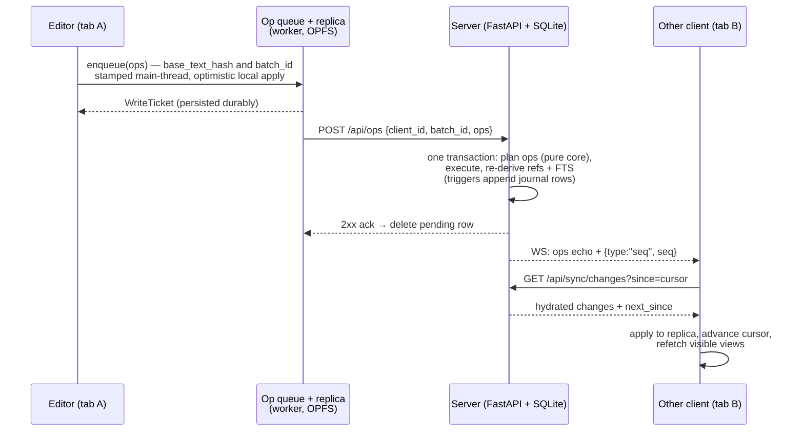
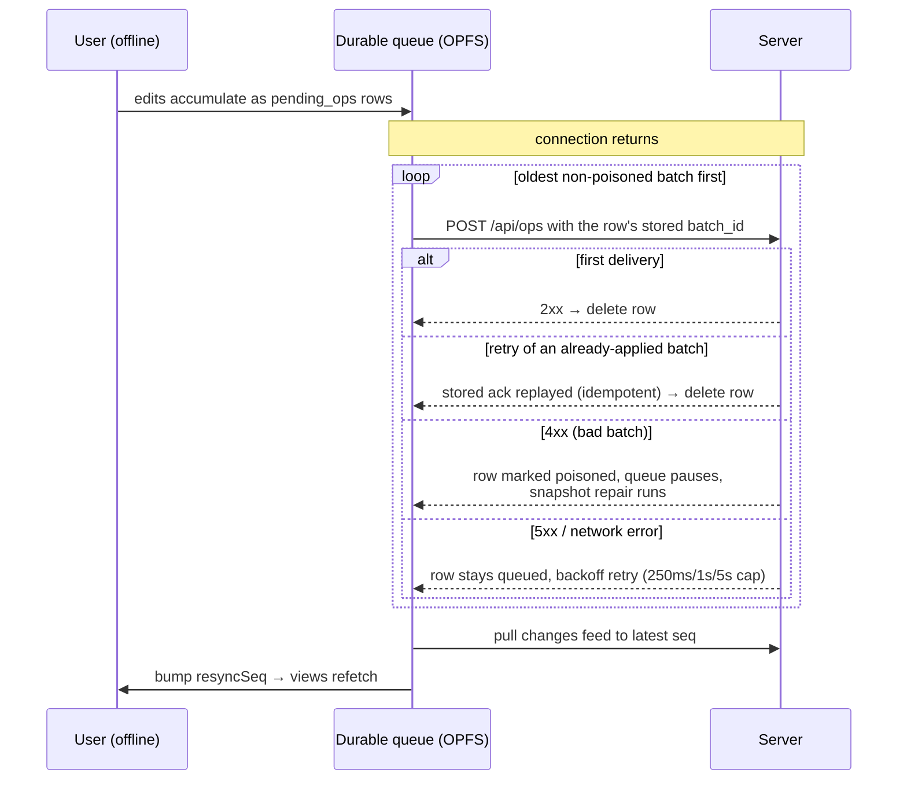

# Sync and offline architecture

This doc follows an edit from a keystroke, through the browser's durable queue
and replica, to the server, and back out to other clients. What each guard does
when part of that path fails is in
[sync-recovery.md](sync-recovery.md). Module maps are in
[backend.md](backend.md) and [frontend.md](frontend.md); failures are indexed by
symptom in [troubleshooting.md](../troubleshooting.md); the design and its
rejected alternatives are in
[`docs/superpowers/specs/2026-07-12-offline-editing-design.md`](../superpowers/specs/2026-07-12-offline-editing-design.md).

## The model in one paragraph

**Server-authoritative, no CRDTs.** SQLite on the server is the single source
of truth. Clients apply edits optimistically and send op batches to
`POST /api/ops`. Down-sync is pull-based: SQLite triggers populate an
append-only change journal that gives every change a monotonic `seq`, and
`GET /api/sync/changes?since=` returns everything after a client's cursor. The
WebSocket only nudges — real journal seqs, a `force` bit for metadata-only
generation changes, applied-batch echoes — and correctness never depends on
receiving a frame. Offline is a cache, not a fork: each browser holds a
sqlite-wasm replica and a durable queue of unacknowledged batches. Batch ids
make replays idempotent, and per-block last-write-wins with `[[conflict]]`
preservation resolves collisions at push time.

## Key pieces

| Piece | Where | Role |
|---|---|---|
| Change journal | `server/src/pkm/schema.py` (`changes` table), triggers | Row-level triggers give every mutation a `seq`, so any write path is journalled |
| Windowed feed | `server/.../routes_sync.py`, `sync_core.py` | `changes?since=` dedupes a window of raw journal rows; `snapshot` bootstraps |
| Sync metadata | `sync_meta` (`db_generation`, `plain_space_title_canonicalization`) | Server-only switches: the generation token forces client rebootstrap; the flag gates boundary-space stripping |
| Idempotent writes | `routes_ops.py`, `applied_batches` table | Same `batch_id` + same payload hash → replay stored ack; different payload → 409; `ops` capped at 500 per batch (`server/src/pkm/contracts/ops.py`) |
| WS hub | `server/.../ws.py`, `notify.py` | Post-commit `{type:"seq",seq}`; generation rotation adds `force:true,generation`; applied-op echoes; drops a client at `QUEUE_SIZE` (64) or a `SEND_TIMEOUT` (10 s) send |
| Replica | `web/src/replica/` (worker, OPFS) | sqlite-wasm copy of the graph (BASE_DDL only) on the OPFS SAHPool VFS |
| Op queue | `web/src/sync/opQueue.ts`, `web/src/replica/queue.ts` | Durable `pending_ops` rows; optimistic local apply; drain-on-reconnect |
| Sync orchestration | `web/src/sync/SyncProvider.tsx`, `useSocketLifecycle.ts`, `reconnectFlow.ts`, `replicaSync.ts` | Connect/reconnect ordering, cursor pull loop, recovery, view refetch (`resyncSeq`) |
| Offline API shim | `web/src/replica/localApi/` | Serves the read API's JSON shapes from the replica, pinned by `shared/fixtures/shim_parity.json` and by generated return types |

## An online edit, end to end

```mermaid
sequenceDiagram
    participant U as Editor (tab A)
    participant Q as Op queue + replica<br/>(worker, OPFS)
    participant S as Server (FastAPI + SQLite)
    participant B as Other client (tab B)

    U->>Q: enqueue(ops) — base_text_hash and batch_id<br/>stamped main-thread, optimistic local apply
    Q-->>U: WriteTicket (persisted durably)
    Q->>S: POST /api/ops {client_id, batch_id, ops}
    S->>S: one transaction: plan ops (pure core),<br/>execute, re-derive refs + FTS<br/>(triggers append journal rows)
    S-->>Q: 2xx ack → delete pending row
    S-->>B: WS: ops echo + {type:"seq", seq}
    B->>S: GET /api/sync/changes?since=cursor
    S-->>B: hydrated changes + next_since
    B->>B: apply to replica, advance cursor,<br/>refetch visible views
```

Success is the 2xx, and the client's own state arrives through the same changes
pull every other client uses. The client reads two ack fields. `seq` goes to
the pending-row delete, so a pull already in flight can accept its window (see
[sync-recovery.md § Windows and the pending queue](sync-recovery.md#windows-and-the-pending-queue)).
`skipped` matters only to a tab with no replica, which refetches its views
when the list is non-empty (see the `resyncSeq` note below).
State flows down one way. Incoming WS op echoes are never written to the
replica: a tab drops its own, matched by `client_id`, and uses other tabs' only
to update live views.

## The changes feed

`GET /api/sync/changes?since=<cursor>` (`routes_sync.py`, windowing in
`sync_core.dedupe_window`) reads a window of raw journal rows in one read
transaction:

- `next_since` advances to the last raw row *scanned*, not the last distinct
  entity, because an entity's older row can share a window with someone else's
  newer row.
- `(kind, entity_id)` pairs dedupe in insertion order and hydrate from current
  state, so blocks ship with every row they depend on: their refs, the pages
  those refs target, the block's own page, and the transitive `parent_uid` chain
  (`_with_parent_closure`, cycle-safe). A missing dependency fails the replica's
  deferred FK check at COMMIT. Entities that no longer exist ship as tombstones;
  a dependency block that no longer exists is absent instead.
- `block_refs` never ships; both sides derive it from block text through the
  parity-pinned extractor (see
  [Offline editing and reconnect](#offline-editing-and-reconnect)).
- Hydration is batched through the pure `sync_core.chunk_ids` (groups of at most
  500, under SQLite's historic 999-parameter cap) and `hydrate_in_order`; the
  queries stay in `routes_sync.py`.
- The client loops `pull → apply → cursor = next_since` until
  `next_since >= latest_seq` (`web/src/sync/replicaSync.ts`), persisting the
  cursor in the replica's `sync_client_meta` table.
- `applyWindow` (`web/src/replica/apply.ts`) applies a window in one
  transaction: tombstones, then pages, blocks and sidebar. The UNIQUE `title`
  columns are why tombstones lead; deferred FKs make the order irrelevant for
  references. Titles two rows swapped are parked under a placeholder
  (`parkTakenTitles`) and restored by their own upserts. A window that cannot
  apply returns `needs-bootstrap` or throws, and
  [sync-recovery.md § Rebootstrap triggers](sync-recovery.md#rebootstrap-triggers)
  says what follows.

## Post-commit nudges

Three tables have change-journal triggers in `schema.py`'s `SERVER_DDL`:
`blocks`, `pages` and `sidebar_entries`. **Every route whose commit touches one
of them must send a WS `{type:"seq", seq}` nudge immediately after that
commit**. A committed metadata or generation change that may leave `changes.seq`
unchanged sends the same frame with `force:true` and the new `generation`. `seq`
is always the actual journal maximum.

`notify.py`'s `commit_and_nudge_threadpool` does both for sync-def routes via
`anyio.from_thread.run`; async routes call `db.commit()` then
`await nudge(request, db)`. `delete_asset` calls them separately, unlinking the
file in between, as does `POST /api/ops` around its applied-op echo.
`delete_asset` has to nudge at all because `strip_asset_tokens`
(`pkm/assets_core.py`) rewrites or deletes every referencing block;
`upload_asset` sends nothing, the `assets` table having no trigger.
`cleanup_journal` guards its nudge on `deleted` being non-empty, since it runs
on every journal page load.

Nothing enforces this in the type system, so
`server/tests/test_journal_advancing_contract.py` enumerates every
journal-advancing route and asserts a nudge.

### Hub fan-out

```mermaid
flowchart LR
    B["Hub.broadcast()"] --> Q["per-client queue<br/>(QUEUE_SIZE)"]
    Q --> D["drain task,<br/>one per connection"]
    D -->|"send_json under SEND_TIMEOUT"| C([client])
    Q -.->|"queue full, or send times out"| X([disconnect and close])
```

`Hub.broadcast()` (`ws.py`) hands each frame to the client's queue and returns
without awaiting the `send_json`, so one stalled client costs no other and never
blocks the write path. A single-consumer FIFO keeps one client's delivery in
`broadcast()` call order. Disconnecting must also close the socket, best-effort
with errors swallowed. The transport can still be alive after the Hub gives up,
and without a real close `onclose` never fires and the client never reconnects
to resync from its cursor. Nothing caps total connections.

## Offline editing and reconnect

While disconnected, reads and search come from the replica through the local API
shim, and edits keep enqueueing durably, each applied optimistically under its
own SAVEPOINT. The header shows "Offline — N changes pending".

`base_text_hash` is the sha256 of the text the edit was based on. The editor
stamps it while building the batch (`outline/baseTextHash.ts`), against the
tree the batch was planned from, so op N leaves the text op N+1's hash matches.
The same pass stamps `page_title`, the block's page, which labels the
daily-note conflict header if the block is gone by the time the op lands. The
worker (`replica/queue.ts`) fills the hash from `currentText` only when it is
still `undefined`, and fills a missing `page_title` only alongside a hash it
fills. Undo history records unstamped ops and `undoManager.dispatch` stamps at
replay time, because an entry-time hash is stale and lands a spurious
`[[conflict]]` entry.

The optimistic apply mirrors the server's timestamp rules as well as its row
contents: `localOps.ts` leaves `blocks.updated_at` and `pages.updated_at` alone
for `set_collapsed` (see [backend.md](backend.md#the-write-path)). It also
skips the ops the server skips: those on a missing block or parent, and a move
that would make a cycle. A create under a live parent lands on that parent's
page. `missingTarget.ts` makes the skip decision, and
`shared/fixtures/missing_targets.json` pins it to `ops_core.classify_missing_target`.
Why a replay must agree with the server is in
[sync-recovery.md § Ops on blocks the server no longer has](sync-recovery.md#ops-on-blocks-the-server-no-longer-has).

`refs` rows arrive hydrated, their target being a page id only the server mints,
so `apply.ts` writes what the payload says. `localOps.ts` derives `refs` itself
only for its own optimistic writes, resolving titles to negative local page ids
that `reconcile.ts` remaps later. `block_refs` never ships, so both replica
paths derive it through `reindexBlockRefs` (`replica/blockRefs.ts`), the
counterpart of the server's `store.reindex_refs_for_text`. Neither opens a
transaction: the caller owns one, because the delete and re-insert must land
together.

The shim holds two invariants:

- Every response builder declares a generated return type (`PagePayload`,
  `JournalPayload`, `SearchPayload`, …), so an unfollowed server-side field
  rename fails `pnpm typecheck` instead of surfacing offline.
  `ReplicaDb.select<T>` only asserts its type argument
  (`selectObjects(...) as T[]`), so each query maps rows into a checked object
  literal; a renamed *column* stays a runtime failure that
  `shim_parity.json`'s recorded values catch.
- `localApi/tree.ts`'s ancestor CTE and `localOps.ts::subtreeUids` are uncapped
  and cycle-safe, each carrying a `path` column of `,uid,uid,…,` and recursing
  only while `instr(path, ',' || b.uid || ',') = 0`. Both mirror the server's
  `_fetch_ancestors` (see
  [backend.md](backend.md#breadcrumbs-and-recursive-traversal)), and all three
  change together.

### The reconnect drain

```mermaid
sequenceDiagram
    participant U as User (offline)
    participant Q as Durable queue (OPFS)
    participant S as Server

    U->>Q: edits accumulate as pending_ops rows
    Note over Q,S: connection returns
    loop oldest non-poisoned batch first
        Q->>S: POST /api/ops with the row's stored batch_id
        alt first delivery
            S-->>Q: 2xx → delete row
        else retry of an already-applied batch
            S-->>Q: stored ack replayed (idempotent) → delete row
        else 4xx (bad batch)
            S-->>Q: row marked poisoned, queue pauses,<br/>snapshot repair runs
        else 5xx / network error
            S-->>Q: row stays queued, backoff retry (250ms/1s/5s cap)
        end
    end
    Q->>S: pull changes feed to latest seq
    Q->>U: bump resyncSeq → views refetch
```

Reconnect ordering in `reconnectFlow.ts` is fixed: **drain the queue first, then
pull, then refetch views**, so the pull observes server state that already
includes this client's offline edits. A socket reconnect and the queue's drain
observer share one completion, which is what finishes a reconnect whose first
drain was blocked. The 4xx branch's repair is in
[sync-recovery.md § A batch the server rejects](sync-recovery.md#a-batch-the-server-rejects).

### Conflicts at push time

Conflict resolution happens server-side at push time (`ops_core.plan_op`), per
block:

| Situation | Outcome |
|---|---|
| `base_text_hash` matches a pre-rename snapshot of this block | The rename or merge is replayed over the incoming text, which then meets the rows below as an edit of the rewritten text |
| `hash(current) == base_text_hash` | Clean apply |
| Incoming text equals current | No-op |
| Hashes differ (concurrent edit) | Incoming wins; the overwritten text lands under a `[[conflict]]` header block on today's daily page |
| Block was deleted meanwhile (hash sent or not) | Edit lands the same way, under a `[[conflict]] … — edit to a block the server no longer has` header labelled from the op's `page_title` |
| No hash sent, block exists (legacy/CLI callers) | Unconditional last-write-wins |
| Structural op on a block or parent the server no longer has | Skipped or a no-op, with a daily-note entry wherever something was lost; the batch still acks 200 |
| Create or move under a parent another device moved to another page | Follows the parent onto its current page |
| Move that another device's move made a cycle | Skipped with a daily-note entry; the batch still acks 200 |

The header forms, the daily-page grouping and the per-op tables for missing
targets and concurrent structure edits are in
[backend.md § The write path](backend.md#the-write-path).
Nothing is discarded: conflict blocks are ordinary blocks, so they reach every
client through the feed and are findable through search and the `[[conflict]]`
page's backlinks. The first row's replay, from records in the server-only
`block_rewrites` table, stops a device that never saw a rename from carrying
the old title back. A missing target never rejects its batch, so another
device's delete cannot poison the queue; how the replica then drops its
optimistic ghost is in
[sync-recovery.md § Ops on blocks the server no longer has](sync-recovery.md#ops-on-blocks-the-server-no-longer-has).
Another device's move cannot poison it either
([sync-recovery.md § Ops another device's tree edit overtook](sync-recovery.md#ops-another-devices-tree-edit-overtook)).

## Title activation across online and offline paths

Titles are canonicalized at both sides' I/O boundaries, and one server-owned
flag — `plain_space_title_canonicalization`, carried in every snapshot and
changes payload beside `generation` — decides how far. Normal server startup
never changes it and never runs the padded-title data migration. An explicit
audited apply sets the flag and rotates the generation in one transaction, and
fresh importer databases run that same path before publication.

| State | Online server/API | Offline replica |
|---|---|---|
| Always | Normalize control whitespace in title creation and page/unlinked read lookup; after normalization reject `#`, `[[`, and `]]` in normal writes | `canonicalizeTitle` applies the same normalization to local creation and reads; local writes use the same forbidden-syntax predicate |
| Inactive | Preserve leading/trailing ordinary U+0020 exactly, allowing legacy padded rows to resolve to themselves | Persist `"0"`; preserve boundary ordinary spaces and keep queued wire operations unchanged |
| Active | Strip only boundary U+0020 on creation/read; keep internal ordinary spaces and NBSP exact | Persist `"1"`; strip boundary U+0020 before local page lookup/creation and optimistic replay |

`findOpTitleViolation()` checks every explicit page target and ref-derived title
in a batch, and refuses the whole gesture on `#`, `[[` or `]]` before any
optimistic mutation. `enqueueBatch()` repeats the check before its transaction,
so no `pending_ops` row is persisted either, and the offline `POST /api/pages`
shim returns 422. Snapshot and feed payloads are always accepted, because
rejecting one would wedge the client's queue.

The replica persists the flag in the same transaction as the payload that
carried it, before reconciling and replaying pending batches. Activation then
canonicalizes negative-id pages created under the old rule: their blocks and
refs move onto a canonical authoritative page if the accepted feed has one,
otherwise the page is retitled in place. Only then are the durable wire ops
replayed, unchanged, under the new rule. A client that sees a new generation
returns `needs-bootstrap` before touching its cursor, generation or activation
metadata.

The apply route sends one forced frame, `{type:"seq", seq:<actual journal max>,
force:true, generation:<new token>}`. The force bit makes a client pull even
when that seq equals its cursor, and it never advances the cursor. Applied-op
echoes carry the stored title, not the caller's spelling, for `create`,
`create_page` and moves with a resolved page target; a same-page move with no
`page_title` stays null. An `update_text` echo carries the caller's
`page_title` hint unresolved, so no consumer may treat it as the block's page.
If the row cannot be loaded, broadcast assembly fails closed and the op
transaction rolls back.

## The replica

One file, `/pkm-replica.sqlite3`, in a dedicated worker on the OPFS SAHPool VFS,
holds both the graph copy (the server's `BASE_DDL`, replicated via the generated
`web/src/replica/baseSchema.gen.ts`) and the client-only tables `pending_ops`
and `sync_client_meta`.

**The replica is a cache; the queue is the user's intent.** A snapshot can
always be re-fetched; an unflushed pending op cannot. Every guard in
[sync-recovery.md](sync-recovery.md) follows from that:

| Consequence | Owning section |
|---|---|
| A failed local write keeps the op; only a replica rejection of the op itself drops it | [A local write fails](sync-recovery.md#a-local-write-fails) |
| An op that cannot apply locally is skipped by the optimistic apply, never dropped from the queue | [Recovery never erases intent](sync-recovery.md#recovery-never-erases-intent) |
| Recovery re-checks the durable pending rows before its destructive step | [Recovery never erases intent](sync-recovery.md#recovery-never-erases-intent) |
| Pending batches are re-applied on top of every snapshot and feed window | [Recovery never erases intent](sync-recovery.md#recovery-never-erases-intent) |
| A server-rejected batch pauses delivery until a snapshot repair drops it | [A batch the server rejects](sync-recovery.md#a-batch-the-server-rejects) |

## Ancillary details

- **Socket** (`web/src/sync/socket.ts`): exponential reconnect backoff
  (`reconnectBackoff.ts` — 2 s doubling to a 30 s cap) and a 30 s ping
  keepalive. The counter resets only on proof the link is real: the first frame
  received, or the socket staying open past `STABLE_MS` (5 s). Attempts are held
  while `document.hidden` and started on visibility or on `window`'s `online`
  event, rate-limited to the delay the schedule would have used. On return to
  visibility after `RESUME_STALE_MS` (30 s), a socket still reporting `OPEN` is
  closed on the spot, because the OS may have frozen it (iPadOS/Safari
  `freeze`).
- **`resyncSeq`** is the React counter that makes visible views refetch,
  separate from the replica's persisted cursor. A repair bumps it
  unconditionally; a reconnect bumps it only when its catch-up moved local data,
  which `replicaSync.appliedVersion()` counts. Two callers skip that comparison.
  A session with no usable replica has `appliedVersion()` return null, so every
  reconnect refetches. A first connect flushing a previous page load's
  leftovers passes `begin({ viewsAreStale: true })`. That first-connect gate
  also fires on an empty durable queue while `replicaSync.hasStarted()` is
  still false, an offline cold start whose mount-time bootstrap failed. A tab
  with no replica also bumps it when an ack lists skipped ops, because no feed
  will tombstone the ghost block
  ([sync-recovery.md](sync-recovery.md#ops-on-blocks-the-server-no-longer-has)).
- Connectivity and delivery health are reported independently: the app can be
  online with delivery blocked by a poisoned batch.
- **Online-only features** degrade explicitly rather than queueing:

  | Surface | Offline behaviour | Why |
  |---|---|---|
  | Asset upload, sidebar edits, page deletion, `{{[[query]]}}` blocks | say "online only" | no offline write path |
  | `/files` browser | unavailable | `/api/assets/*` has no offline shim |
  | LLM assistant | unavailable | `/api/assistant/*` has no offline shim; the assistant reaches the graph server-side through the API, not through the replica |
  | A `Local copy::` PDF (`/api/local/*`) | the in-app viewer still renders, its fetch fails, and it falls back to a note plus a plain download anchor | unlike `/assets/`, `/api/local/*` is never runtime-cached by the service worker |
  | A GoodLinks copy (`/api/goodlinks/*`) | the reader opens and shows "Needs the server" | GoodLinks content is online-only; the replica shim has no route for it |

- **Service worker**: precaches the app shell, so a cold offline start boots, and
  keeps a bounded runtime cache of recently viewed assets. The precache glob
  covers every built `.js`/`.mjs` chunk; its named special cases are the sqlite
  wasm binary, the pdf.js worker and the core KaTeX faces. A build budget and an
  offline Playwright test enforce it.
- **`pkm` CLI and MCP writes** ride the same path: a fresh `batch_id` per
  command, and `base_text_hash` on updates.
