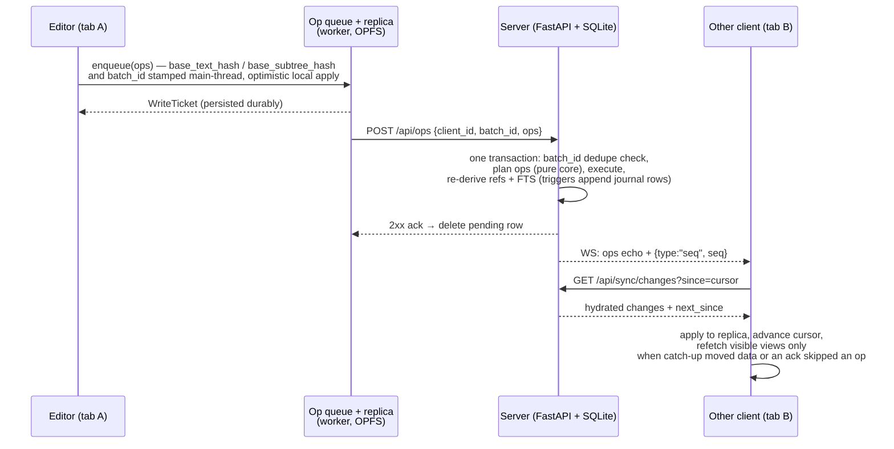
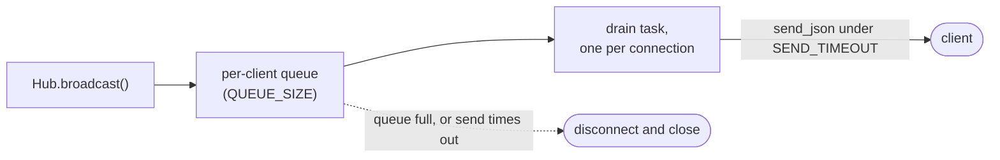
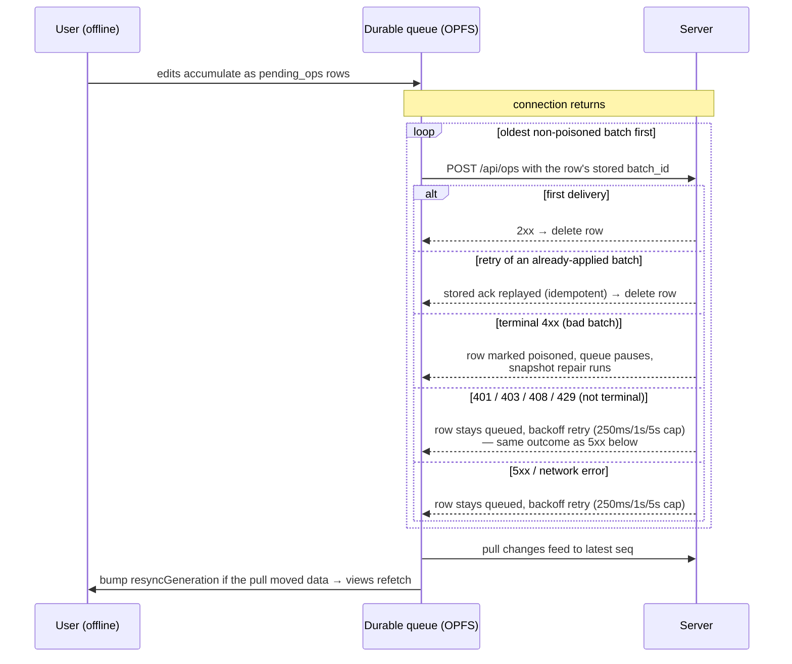

# Sync and offline architecture

This doc follows an edit from a keystroke, through the browser's durable queue
and replica, to the server, and back out to other clients. What each guard does
when part of that path fails is in
[sync-recovery.md](sync-recovery.md). Module maps are in
[backend.md](backend.md) and [frontend.md](frontend.md); failures are indexed by
symptom in [troubleshooting.md](../troubleshooting.md); the design and its
rejected alternatives are in
[`docs/superpowers/specs/2026-07-12-offline-editing-design.md`](../superpowers/specs/2026-07-12-offline-editing-design.md).

## The model in one paragraph

**Server-authoritative, no CRDTs.** SQLite on the server is the single source
of truth. Clients apply edits optimistically and send op batches to
`POST /api/ops`. Down-sync is pull-based: SQLite triggers populate an
append-only change journal that gives every change a monotonic `seq`, and
`GET /api/sync/changes?since=` returns everything after a client's cursor. The
WebSocket only nudges — real journal seqs, a `force` bit for metadata-only
generation changes, applied-batch echoes — and correctness never depends on
receiving a frame. Offline is a cache, not a fork: each browser holds a
sqlite-wasm replica and a durable queue of unacknowledged batches. Batch ids
make replays idempotent, and per-block last-write-wins with `[[conflict]]`
preservation resolves collisions at push time.

## Key pieces

| Piece | Where | Role |
|---|---|---|
| Change journal | `server/src/pkm/schema.py` (`changes` table), triggers | Row-level triggers give every mutation a `seq`, so any write path is journalled |
| Windowed feed | `server/.../routes_sync.py`, `sync_core.py` | `changes?since=` dedupes a window of raw journal rows; `snapshot` bootstraps |
| Sync metadata | `sync_meta` (`db_generation`, `plain_space_title_canonicalization`) | Server-only switches: the generation token forces client rebootstrap; the flag gates boundary-space stripping |
| Idempotent writes | `routes_ops.py`, `applied_batches` table | Same `batch_id` + same payload hash → replay stored ack; different payload → 409; `ops` capped at 500 per batch (`server/src/pkm/contracts/ops.py`) |
| WS hub | `server/.../ws.py`, `notify.py` | Post-commit `{type:"seq",seq}`; generation rotation adds `force:true,generation`; applied-op echoes; drops a client at `QUEUE_SIZE` (64) or a `SEND_TIMEOUT` (10 s) send |
| Replica | `web/src/replica/` (worker, OPFS) | sqlite-wasm copy of the graph (BASE_DDL only) on the OPFS SAHPool VFS |
| Op queue | `web/src/sync/opQueue.ts`, `web/src/replica/queue.ts` | Durable `pending_ops` rows; optimistic local apply; drain-on-reconnect. Its pure rules: lane ordering in `outbox.ts`, poison-mark intents in `poisonIntents.ts` (stored by `poisonIntentStore.ts`) |
| Sync orchestration | `web/src/sync/SyncProvider.tsx`, `clientRuntime.ts`, `useSocketLifecycle.ts`, `reconnectFlow.ts`, `replicaSync.ts` | Connect/reconnect ordering, cursor pull loop, recovery, view refetch (`resyncGeneration`). `clientRuntime.ts` holds the startup poison gate and the poison repair, without React. `syncFailures.ts` classifies pull failures |
| Offline API shim | `web/src/replica/localApi/` | Serves the read API's JSON shapes from the replica, pinned by `shared/fixtures/shim_parity.json` and by generated return types |

`createOpQueue(replica, deps?)` takes no callbacks. The optional `OpQueueDeps`
(`post`, `clientId`, `poisonStore`, `newBatchId`) exist for tests and the
property harness; the app passes none. Every `OpQueue` signal
(`onDesync`, `onDrain`, `onSkipped`, `onPending`, `onPoison`, …) and
`ReplicaSync.onSkipped` is a listener built with `listeners<T>()`
(`sync/listeners.ts`), so a throwing listener never reaches the emitter or
the other listeners. `SyncProvider` and `useSocketLifecycle` subscribe in
effects, after the commit that built the queue. No event can arrive before
them, because every emission follows at least one `await`. So no queue
method may emit synchronously; `opQueue.replica.test.ts` pins that for
`enqueue`, `drain`, `setOnline`, `pause` and `resume`.

## An online edit, end to end

```mermaid
sequenceDiagram
    participant U as Editor (tab A)
    participant Q as Op queue + replica<br/>(worker, OPFS)
    participant S as Server (FastAPI + SQLite)
    participant B as Other client (tab B)

    U->>Q: enqueue(ops) — base_text_hash / base_subtree_hash<br/>and batch_id stamped main-thread, optimistic local apply
    Q-->>U: WriteTicket (persisted durably)
    Q->>S: POST /api/ops {client_id, batch_id, ops}
    S->>S: one transaction: batch_id dedupe check,<br/>plan ops (pure core), execute,<br/>re-derive refs + FTS (triggers append journal rows)
    S-->>Q: 2xx ack → delete pending row
    S-->>B: WS: ops echo + {type:"seq", seq}
    B->>S: GET /api/sync/changes?since=cursor
    S-->>B: hydrated changes + next_since
    B->>B: apply to replica, advance cursor,<br/>refetch visible views only<br/>when catch-up moved data or an ack skipped an op
```

Success is the 2xx, and the client's own state arrives through the same changes
pull every other client uses. The client reads the ack's `seq` and
`skipped`. `seq` goes to the pending-row delete, so a pull already in flight can accept its window (see
[sync-recovery.md § Windows and the pending queue](sync-recovery.md#windows-and-the-pending-queue)).
A non-empty `skipped` bumps `resyncGeneration` regardless of replica state (see
[When views refetch](#when-views-refetch)): a replica-backed tab's own feed
tombstones the row, but nothing else refetches the view for it.
State flows down one way. Incoming WS op echoes are never written to the
replica: a tab drops its own, matched by `client_id`, and uses other tabs' only
to update live views.

## The changes feed

`GET /api/sync/changes?since=<cursor>` (`routes_sync.py`, windowing in
`sync_core.dedupe_window`) reads a window of raw journal rows in one read
transaction:

- `next_since` advances to the last raw row *scanned*, not the last distinct
  entity, because an entity's older row can share a window with someone else's
  newer row.
- `(kind, entity_id)` pairs dedupe in insertion order and hydrate from current
  state, so blocks ship with every row they depend on: their refs, the pages
  those refs target, the block's own page, and the transitive `parent_uid` chain
  (`_with_parent_closure`, cycle-safe). A missing dependency fails the replica's
  deferred FK check at COMMIT. A dependency block that no longer exists is
  absent from the payload.
- `sync_core.tombstone_entities` picks the tombstones. A page or sidebar entry
  absent from current state ships as one. So does a `page` or `sidebar` id
  (`REUSABLE_ID_KINDS`) with a delete row in the window, even when a live row
  holds it. Both ids are an `INTEGER PRIMARY KEY` without `AUTOINCREMENT`.
  SQLite gives the next insert max(id)+1, so deleting the highest id frees it
  for reuse, and presence does not prove the row is the same entity.
  That reused id ships as tombstone plus live row. The replica's page cascade
  removes the page's blocks and refs before the upserts, so the window also
  ships every current block on the page or with a ref to it. That makes the
  page whole again by the window's COMMIT, not only once later windows arrive.
  A block delivered onto the page earlier and moved off since is still cascaded
  away, and returns with its own later row. A block present now ships live: a
  uid recreated by undo is the same block. A block absent now ships as a
  tombstone only from the window that holds its delete row (see the apply
  order below).
- `block_refs` never ships; both sides derive it from block text through the
  parity-pinned extractor (see
  [Offline editing and reconnect](#offline-editing-and-reconnect)).
- Hydration is batched through the pure `sync_core.chunk_ids` (groups of at most
  500, under SQLite's historic 999-parameter cap) and `hydrate_in_order`; the
  queries stay in `routes_sync.py`.
- The client loops `pull → apply → cursor = next_since` until
  `next_since >= latest_seq` (`web/src/sync/replicaSync.ts`), persisting the
  cursor in the replica's `sync_client_meta` table.
- Each pull also names the head of its pending queue (`pending=` batch ids). The
  window answers which of them it already holds in `applied_batches`. The
  replica drops those rows instead of replaying them over their own echo (see
  [sync-recovery.md § A payload that already holds a pending batch](sync-recovery.md#a-payload-that-already-holds-a-pending-batch)).
- `applyWindow` (`web/src/replica/apply.ts`) applies a window in one
  transaction, in the order of the table below. Titles two rows swapped are
  parked under a placeholder (`parkTakenTitles`) and restored by their own
  upserts. `parkTakenTitles` and
  `assertNoParkedTitles` take the id type as a type parameter and the table
  name as a type depending on it (`TitledTableFor<Id>`). A plain
  `"pages" | "sidebar_entries"` union could not stop a pages call being
  passed the sidebar table, or a sidebar id array; the dependent type does. A
  window that cannot apply returns `needs-bootstrap` or throws, and
  [sync-recovery.md § Rebootstrap triggers](sync-recovery.md#rebootstrap-triggers)
  says what follows.
- Each tombstone `kind` (`EntityKind`: `block`, `page` or `sidebar`) dispatches
  through its own `if`/`else if` branch to the table it deletes from; the
  final `else` is an unrecognised kind, which deletes nothing and logs,
  behind a `const x: never = tomb.kind` exhaustiveness check. It must never
  default to one of the three deletes -- an older replica meeting a kind a
  newer server added would otherwise destroy an unrelated row. The one TEXT
  `entity_id` is minted into `BlockUid`, `PageId` or `SidebarEntryId` per
  branch, never before the dispatch picks the kind.

| Step in `applyWindow` | Why it sits there |
|---|---|
| 1. `dropAppliedPending`, `pruneReplayBatches` | A batch this window names settles in this window (see [sync-recovery.md](sync-recovery.md#a-payload-that-already-holds-a-pending-batch)). |
| 2. `rewind("pending")`, every window | Pending batches' effects come off before the server's rows land, so step 9 replays them as a first apply ([the replay log](sync-recovery.md#the-replay-log)). |
| 3. Page and sidebar tombstones | The UNIQUE `title` columns: a row that gave its title up by being deleted must go before the row that took the title. A reused page id's cascade clears the old page before the new one lands. |
| 4. Page upserts | `reconcilePage` remaps local page ids, replay-log keys and targets included. |
| 5. Block upserts | Deferred FKs make their order irrelevant for references. |
| 6. `dropWindowRecords` for every block uid the window ships live or owes a tombstone (including one an earlier window deferred), and every page it ships | The server's row supersedes the local one, so an acked batch's record on it has nothing left to restore. |
| 7. Block tombstones, in the window at the journal head only | The moves out land before the local cascade runs (below). |
| 8. `rewind("all")`, at the head window only | Settles the records acked batches left. After 6, so records the window made redundant are gone. |
| 9. Sidebar upserts, cursor, deferred-tombstone record, plain-space flag, `reconcileActivationPageTitles`, then `replayPending` | The queue replays over the window's final rows, each batch as a first apply at its enqueue time. |
| 10. `dropStrandedLocalPages` | Deletes a negative-id page no block, ref, `replay_log` record or today's daily title names. At the head window only (an acked `create_page` batch no longer names its page, and the server's may ship in a later window). After 9, since a replay re-makes the pages it needs. |

A block tombstone cascades the replica's local subtree, so it must not reach
a block the server kept. The kept block may be a descendant that moved along
with a moved-out ancestor. Its own row never changed, so only the ancestor's
row ships, and nothing would re-ship the descendant once the cascade took it.
**Block tombstones therefore wait for the window at the journal head:**

| Window | What happens to block tombstones | Where |
|---|---|---|
| Any | The feed ships a block's tombstone only in the window that holds its delete row. The server journals a delete row for every block it deletes, cascaded rows included | `sync_core.tombstone_entities` |
| Short of the head (`next_since < latest_seq`) | Applies none. Records them in `sync_client_meta` under `deferred_block_tombstones`, with the cursor it writes, in the same transaction. A block a later window ships live (an undo recreated it) leaves the record | `applyWindow` |
| At the head | Applies every recorded tombstone and its own, after its upserts, and clears the record. A record whose cursor is not the current one is void: code without this rule moved the cursor past it and cascaded per window itself | `applyWindow` |
| Snapshot | Clears the record | `applySnapshot` |

A moved-out ancestor can be deleted in a later window. Take D > A > K > L. A
moves to the top level, D is deleted, K moves to the top level, and A is
deleted. The server ends with K > L. A's move row ships nothing, because A is
absent now. Cascading D's tombstone in its own window would take the replica's
stale D > A > K > L, and L's row never changes to ship again. After the pending
rewind and the head window's upserts, every block the server still has is
placed by its own row or sits under an unchanged chain of blocks the server
also kept. No surviving block is then under a deleted one, so the cascade is
the one-window case.
`test_sync_block_tombstone_window.py` models this rule over windows of one
and two rows.

Between windows, deleted blocks stay visible and editable. An edit to one lands
as a conflict entry, as an edit to a block deleted elsewhere always does.

The cascade never meets a pending batch's effects, because `rewind("pending")`
took them off before the window's writes. A pending move of a kept block under
a deleted one has been undone, so the block is back in its server place when
the cascade runs. A block a pending batch created under a deleted one is gone
too. `replayPending` then skips both ops, as the server skips them. An acked
op that did the same has had its echo by the head window: the server journals
a skipped move's subtree live.

A page cascade can run before the upserts because a block leaves a page only
by a write to its own row: a move rewrites `page_id` on every block of the
subtree.

## Post-commit nudges

The change-journal triggers in `schema.py`'s `SERVER_DDL` sit on `blocks`,
`pages` and `sidebar_entries`. **Every route whose commit touches a journalled
table must send a WS `{type:"seq", seq}` nudge immediately after that
commit**. A committed metadata or generation change that may leave `changes.seq`
unchanged sends the same frame with `force:true` and the new `generation`. `seq`
is always the actual journal maximum.

`notify.py`'s `commit_and_nudge_threadpool` does both for sync-def routes via
`anyio.from_thread.run`; async routes call `db.commit()` then
`await nudge(request, db)`. `delete_asset` calls them separately, unlinking the
file in between, as does `POST /api/ops` around its applied-op echo.
`delete_asset` has to nudge at all because `strip_asset_tokens`
(`pkm/assets_core.py`) rewrites or deletes every referencing block;
`upload_asset` sends nothing, the `assets` table having no trigger.
`cleanup_journal` guards its nudge on `deleted` being non-empty, since it runs
on every journal page load.

Nothing enforces this in the type system, so
`server/tests/test_journal_advancing_contract.py` enumerates every
journal-advancing route and asserts a nudge.

### Hub fan-out

```mermaid
flowchart LR
    B["Hub.broadcast()"] --> Q["per-client queue<br/>(QUEUE_SIZE)"]
    Q --> D["drain task,<br/>one per connection"]
    D -->|"send_json under SEND_TIMEOUT"| C([client])
    Q -.->|"queue full, or send times out"| X([disconnect and close])
```

`Hub.broadcast()` (`ws.py`) hands each frame to the client's queue and returns
without awaiting the `send_json`, so one stalled client costs no other and never
blocks the write path. A single-consumer FIFO keeps one client's delivery in
`broadcast()` call order. Disconnecting must also close the socket, best-effort
with errors swallowed. The transport can still be alive after the Hub gives up,
and without a real close `onclose` never fires and the client never reconnects
to resync from its cursor. Nothing caps total connections.

## Offline editing and reconnect

While disconnected, reads and search come from the replica through the local API
shim, and edits keep enqueueing durably, each applied optimistically under its
own SAVEPOINT. The header shows "Offline — N changes pending".

`base_text_hash` is the sha256 of the text the edit was based on, and a
`delete`'s `base_subtree_hash` is the hash of the subtree it removes. Both are
typed `Sha256Hex` and minted only by `text_hash` / `subtree_hash`
(`sha256Hex` / `subtreeHash` on the web). The editor
stamps both while building the batch (`outline/baseTextHash.ts`), against the
tree the batch was planned from, so op N leaves the text op N+1's hash matches.
The same pass stamps `page_title`, the block's page, which labels the
daily-note conflict header if the block is gone by the time the op lands. The
worker (`replica/queue.ts`) fills either hash from the replica
(`currentText`, `currentSubtreePairs`) only when it is still `undefined`, and
fills a missing `page_title` only alongside a text hash it fills. Undo history
records unstamped ops and `undoManager.dispatch` stamps at replay time,
because an entry-time hash is stale and lands a spurious `[[conflict]]` entry.

The journal seq (`changes.seq`) is typed `SyncSeq` on both sides, the same
`brand()`/x-brand path as `Sha256Hex` (see
[backend.md § HTTP API reference](backend.md#http-api-reference) and
[frontend.md § API layer](frontend.md#api-layer)): `ChangesPayload.next_since`/
`latest_seq`, `SnapshotPayload.seq` and `OpsAck.seq` all carry it, and the WS
nudge frame's `seq` (`server/.../notify.py SeqFrame`, `sync/socket.ts WsSeq`)
is narrowed to it by hand, since WS messages sit outside OpenAPI. The
replica's own `pending_ops` row id is `PendingRowId` instead — web-only,
never on the wire, and not stable across a reset or a file replacement
(`AUTOINCREMENT` restarts): `PendingBatch`, `AckedBatch` and `PoisonedBatch`
(`replica/client.ts`) all name the pair `id`/`batch_id`, so a value built
from one shape needs no translation to flow into another. The worker RPC
surface (`ReplicaRpc` in `client.ts`) names every method's payload and
result in these same branded types, so `createReplica` and `workerHandlers.ts`'s
`buildHandlers` compile against one shared map. `rpc.ts`'s `serveRpc` is still
the one place that takes the wire data on trust, since structured clone
carries the runtime values, not the brands.

`OpBatch.client_id` and `OpBatch.batch_id` are branded too, as `ClientId` and
`BatchId`, so the two bare uid strings sitting side by side in one request
body can never swap. Both are minted by `newUid()` (web's per-tab `clientId`,
`sync/opQueue.ts`) or `crypto.randomUUID()` (the worker's `newBatchId`,
`replica/workerHandlers.ts`), and by `uuid4().hex` on the CLI/MCP side
(`client/workflows.py _batch_id`). `BatchId` carries into `PendingBatch`,
`AckedBatch` and `PoisonedBatch` too, since `batch_id` is also the replay-dedup
key the `pending_ops` row and `applied_batches` store it under.

The optimistic apply mirrors the server's timestamp rules as well as its row
contents: `localOps.ts` leaves `blocks.updated_at` and `pages.updated_at` alone
for `set_collapsed` (see [backend.md](backend.md#the-write-path)). It also
skips the ops the server skips: those on a missing block or parent, and a move
that would make a cycle. `missingTarget.ts` makes the skip decision, and
`placementFor` (`replica/placement.ts`) decides where a create or move lands,
or keeps it in place on a replay. `shared/fixtures/missing_targets.json` pins
both to the server: its `cases` to `ops_core.classify_skip`, its
`placement_cases` to `ops_apply`. The cross-side table is
[sync-recovery.md § Ops another device's tree edit overtook](sync-recovery.md#ops-another-devices-tree-edit-overtook).
Why a replay must agree with the server is in
[sync-recovery.md § Ops on blocks the server no longer has](sync-recovery.md#ops-on-blocks-the-server-no-longer-has).

`refs` rows arrive hydrated, their target being a page id only the server mints,
so `apply.ts` writes what the payload says. `localOps.ts` derives `refs` itself
only for its own optimistic writes, resolving titles to negative local page ids
-- still a `PageId`, the sign alone carrying "not yet reconciled" -- that
`reconcile.ts`'s `remapLocalPage` remaps later. `block_refs` never ships, so both replica
paths derive it through `reindexBlockRefs` (`replica/blockRefs.ts`), the
counterpart of the server's `store.reindex_refs_for_text`. Neither opens a
transaction: the caller owns one, because the delete and re-insert must land
together.

The shim holds these invariants:

- Every response builder declares a generated return type (`PagePayload`,
  `JournalPayload`, `SearchPayload`, …), so an unfollowed server-side field
  rename fails `pnpm typecheck` instead of surfacing offline.
  `ReplicaDb.select<T>` only asserts its type argument
  (`selectObjects(...) as T[]`), so each query maps rows into a checked object
  literal; a renamed *column* stays a runtime failure that
  `shim_parity.json`'s recorded values catch.
- Every recursive walk in the replica (`localApi/tree.ts`'s ancestor CTE,
  `localOps.ts::parentChain` and `subtreeUids`) is uncapped, cycle-safe and a
  copy of one server walk. The pairs and their shared guard are tabled in
  [backend.md § Breadcrumbs and recursive traversal](backend.md#breadcrumbs-and-recursive-traversal);
  each pair changes together.

### The reconnect drain

```mermaid
sequenceDiagram
    participant U as User (offline)
    participant Q as Durable queue (OPFS)
    participant S as Server

    U->>Q: edits accumulate as pending_ops rows
    Note over Q,S: connection returns
    loop oldest non-poisoned batch first
        Q->>S: POST /api/ops with the row's stored batch_id
        alt first delivery
            S-->>Q: 2xx → delete row
        else retry of an already-applied batch
            S-->>Q: stored ack replayed (idempotent) → delete row
        else terminal 4xx (bad batch)
            S-->>Q: row marked poisoned, queue pauses,<br/>snapshot repair runs
        else 401 / 403 / 408 / 429 (not terminal)
            S-->>Q: row stays queued, backoff retry (250ms/1s/5s cap)<br/>— same outcome as 5xx below
        else 5xx / network error
            S-->>Q: row stays queued, backoff retry (250ms/1s/5s cap)
        end
    end
    Q->>S: pull changes feed to latest seq
    Q->>U: bump resyncGeneration if the pull moved data → views refetch
```

Reconnect ordering in `reconnectFlow.ts` is fixed: **drain the queue first, then
pull, then refetch views**, so the pull observes server state that already
includes this client's offline edits. A socket reconnect and the queue's
`onDrain` listener (`reconnect.observeDrain`) share one completion, which is
what finishes a reconnect whose first drain was blocked. Before its drain, a
connect retries a rejected-batch repair whose last attempt failed
(`retryFailedRepair`: the client runtime's poison repair, then
`legacyRepair.ts`'s lane-batch repair), because either repair's barrier would
block the drain. The terminal-4xx
branch's repair, and which statuses count as terminal (`isTerminalRejection`),
are in
[sync-recovery.md § A batch the server rejects](sync-recovery.md#a-batch-the-server-rejects).

### When views refetch

`resyncGeneration` is the React counter that makes visible views refetch,
separate from the replica's persisted cursor and named for what it is, not
`SyncSeq`: it never carries a journal seq, only a count of bumps. Views
subscribe through `useResyncGeneration()`
and read through the guarded read every trigger shares, not the outline
repair epoch, so pending edits elsewhere on a page survive a bump. Every bump
comes from one of these:

| Trigger | Bumps when | Where |
|---|---|---|
| A reconnect completes | its catch-up moved local data, which `replicaSync.appliedVersion()` counts | `reconnectFlow.ts` |
| A reconnect with no usable replica | always: `appliedVersion()` returns null, which counts as moved | `reconnectFlow.ts` |
| A first connect | only when it passes `begin({ viewsAreStale: true })`: the durable queue holds a previous page load's rows, or `replicaSync.hasStarted()` is still false because an offline cold start's bootstrap failed | `useSocketLifecycle.ts` |
| An ack lists skipped ops | always, whatever the replica state | `opQueue.ts`, `replicaSync.ts`, `ops-skipped`; [sync-recovery.md § Ops on blocks the server no longer has](sync-recovery.md#ops-on-blocks-the-server-no-longer-has) |
| A repair or reset succeeds | always | `syncState.ts`; [sync-recovery.md § A batch the server rejects](sync-recovery.md#a-batch-the-server-rejects) |
| The replica turns ready while the socket is not connected | always: views that read before it was ready refetch through the shim | `syncState.ts`, `mode-ready-check` |

A first connect with nothing left over bumps nothing, because its views have
just read the server. With leftovers, `viewsAreStale` skips the cursor
comparison: the mount-time catch-up may already have absorbed the flush,
leaving the comparison nothing to report.

### Conflicts at push time

Conflict resolution happens server-side at push time (`ops_core.plan_op`), per
block. For a hashed `update_text` on a live block, the first four rows are
checked in this order (`ops_core.classify_text_edit`). In particular, an
incoming text identical to the current text is always a no-op, even with a
stale `base_text_hash`, rather than a conflict:

| Situation | Outcome |
|---|---|
| `base_text_hash` matches a pre-rename snapshot of this block | The rename or merge is replayed over the incoming text, which then meets the rows below as an edit of the rewritten text |
| Incoming text equals current | No-op, whatever the hash |
| `hash(current) == base_text_hash` | Clean apply |
| Hashes differ (concurrent edit) | Incoming wins; the overwritten text lands under a `[[conflict]]` header block on today's daily page |
| Block was deleted meanwhile (hash sent or not) | Edit lands the same way, under a `[[conflict]] … — edit to a block the server no longer has` header labelled from the op's `page_title` |
| No hash sent, block exists (legacy/CLI callers) | Unconditional last-write-wins |
| Structural op on a block or parent the server no longer has | Skipped or a no-op, with a daily-note entry wherever something was lost; the batch still acks 200 |
| Create or move under a parent another device moved to another page | Follows the parent onto its current page |
| Move that another device's move made a cycle | Skipped with a daily-note entry; the batch still acks 200 |
| `delete` whose subtree another device changed since this one last saw it | The delete wins; the server's texts for the subtree land nested under a `[[conflict]] … — deleted while edited elsewhere` header |

The subtree hash is the sha256 of one `{uid} {text_hash(text)}` line per block
in the subtree, sorted by uid and joined by newlines, and
`shared/fixtures/subtree_hash.json` pins `subtree_hash` and `subtreeHash` to it.
The header forms and the daily-page grouping are in
[backend.md § Conflicts](backend.md#conflicts); the per-op tables are in
[§ Missing targets](backend.md#missing-targets) and
[§ Concurrent structure edits](backend.md#concurrent-structure-edits).
An editor flush hashes the text the user typed over
([frontend-editor.md § Drafts and commit points](frontend-editor.md#drafts-and-commit-points)).
So two concurrent edits from the same base keep both texts whichever arrives
first: the later one wins and the earlier one becomes the conflict copy.
A conflict copy is never discarded: conflict blocks are ordinary blocks, so
they reach every client through the feed and are findable through search and
the `[[conflict]]` page's backlinks. The first row's replay, from records in the server-only
`block_rewrites` table, stops a device that never saw a rename from carrying
the old title back. A missing target never rejects its batch, so another
device's delete cannot poison the queue; how the replica then drops its
optimistic ghost is in
[sync-recovery.md § Ops on blocks the server no longer has](sync-recovery.md#ops-on-blocks-the-server-no-longer-has).
Another device's move cannot poison it either
([sync-recovery.md § Ops another device's tree edit overtook](sync-recovery.md#ops-another-devices-tree-edit-overtook)).

## Title activation across online and offline paths

Titles are canonicalized at both sides' I/O boundaries, and one server-owned
flag — `plain_space_title_canonicalization`, carried in every snapshot and
changes payload beside `generation` — decides how far. Normal server startup
never changes it and never runs the padded-title data migration. An explicit
audited apply sets the flag and rotates the generation in one transaction, and
fresh importer databases run that same path before publication.

| State | Online server/API | Offline replica |
|---|---|---|
| Always | Normalize control whitespace in title creation and page/unlinked read lookup; after normalization reject `#`, `[[`, and `]]` in normal writes | `canonicalizeTitle` applies the same normalization to local creation and reads; local writes use the same forbidden-syntax predicate |
| Inactive | Preserve leading/trailing ordinary U+0020 exactly, allowing legacy padded rows to resolve to themselves | Persist `"0"`; preserve boundary ordinary spaces and keep queued wire operations unchanged |
| Active | Strip only boundary U+0020 on creation/read; keep internal ordinary spaces and NBSP exact | Persist `"1"`; strip boundary U+0020 before local page lookup/creation and optimistic replay |

`findOpTitleViolation()` checks every explicit page target and ref-derived title
in a batch, and refuses the whole gesture on `#`, `[[` or `]]` before any
optimistic mutation. `enqueueBatch()` repeats the check before its transaction,
so no `pending_ops` row is persisted either, and the offline `POST /api/pages`
shim returns 422. Snapshot and feed payloads are always accepted, because
rejecting one would wedge the client's queue.

The replica persists the flag in the same transaction as the payload that
carried it, before reconciling and replaying pending batches. Activation then
canonicalizes negative-id pages created under the old rule: their blocks and
refs move onto a canonical authoritative page if the accepted feed has one,
otherwise the page is retitled in place. Only then are the durable wire ops
replayed, unchanged, under the new rule. A client that sees a new generation
returns `needs-bootstrap` before touching its cursor, generation or activation
metadata.

The apply route sends one forced frame, `{type:"seq", seq:<actual journal max>,
force:true, generation:<new token>}`. The force bit makes a client pull even
when that seq equals its cursor, and it never advances the cursor. Applied-op
echoes carry the stored title, not the caller's spelling, for `create`,
`create_page` and moves with a resolved page target; a same-page move with no
`page_title` stays null. An `update_text` echo carries the caller's
`page_title` hint unresolved, so no consumer may treat it as the block's page.
If the row cannot be loaded, broadcast assembly fails closed and the op
transaction rolls back.

## The replica

One file, `/pkm-replica.sqlite3`, in a dedicated worker on the OPFS SAHPool VFS,
holds both the graph copy (the server's `BASE_DDL`, replicated via the generated
`web/src/replica/baseSchema.gen.ts`) and the client-only tables `pending_ops`,
`sync_client_meta`, `replay_log`, `replay_log_refs` and `replay_batches`.
The last three are described in
[sync-recovery.md § The replay log](sync-recovery.md#the-replay-log).
A second file, `/pkm-replica-carry.sqlite3`, holds the pending queue across a
[file replacement](sync-recovery.md#reset-rebase-and-file-replacement). A
worker that dies during one leaves it behind, and the next queue handler
adopts and removes it.

A commit is atomic across the worker's death. SQLite takes the `-journal` a
killed worker left as hot, and the next read of that file plays it back and
removes it. Upstream's pool VFS never does this; the replica runs a patched
build, and [sqlite-wasm-patch.md](sqlite-wasm-patch.md) covers the patch, how
it is applied, and its upstream report. The fix relies on every connection to
a file living in this pool, which the pool's exclusive access handles
guarantee.

**The replica is a cache; the queue is the user's intent.** A snapshot can
always be re-fetched; an unflushed pending op cannot. Every guard in
[sync-recovery.md](sync-recovery.md) follows from that:

| Consequence | Owning section |
|---|---|
| A failed local write keeps the op; only a replica rejection of the op itself drops it | [A local write fails](sync-recovery.md#a-local-write-fails) |
| An op that cannot apply locally is skipped by the optimistic apply, never dropped from the queue | [Recovery never erases intent](sync-recovery.md#recovery-never-erases-intent) |
| Recovery re-checks the durable pending rows before its destructive step | [Recovery never erases intent](sync-recovery.md#recovery-never-erases-intent) |
| Pending batches are re-applied on top of every snapshot and feed window | [Recovery never erases intent](sync-recovery.md#recovery-never-erases-intent) |
| A server-rejected batch pauses delivery until a snapshot repair drops it | [A batch the server rejects](sync-recovery.md#a-batch-the-server-rejects) |

## Ancillary details

- **Socket** (`web/src/sync/socket.ts`): exponential reconnect backoff
  (`reconnectBackoff.ts` — 2 s doubling to a 30 s cap) and a 30 s ping
  keepalive. The counter resets only on proof the link is real: the first frame
  received, or the socket staying open past `STABLE_MS` (5 s). Attempts are held
  while `document.hidden` and started on visibility or on `window`'s `online`
  event, rate-limited to the delay the schedule would have used. On return to
  visibility after `RESUME_STALE_MS` (30 s), a socket still reporting `OPEN` is
  closed on the spot, because the OS may have frozen it (iPadOS/Safari
  `freeze`).
- Connectivity and delivery health are reported independently: the app can be
  online with delivery blocked by a poisoned batch.
- **Online-only features** degrade explicitly rather than queueing:

  | Surface | Offline behaviour | Why |
  |---|---|---|
  | Asset upload, sidebar edits, page deletion, `{{[[query]]}}` blocks | say "online only" | no offline write path |
  | `/files` browser | unavailable | `/api/assets/*` has no offline shim |
  | LLM assistant | unavailable | `/api/assistant/*` has no offline shim; the assistant reaches the graph server-side through the API, not through the replica |
  | A `Local copy::` PDF (`/api/local/*`) | the in-app viewer still renders, its fetch fails, and it falls back to a note plus a plain download anchor | unlike `/assets/`, `/api/local/*` is never runtime-cached by the service worker |
  | A GoodLinks copy (`/api/goodlinks/*`) | the reader opens and shows "Needs the server" | GoodLinks content is online-only; the replica shim has no route for it |

- **Service worker**: precaches the app shell, so a cold offline start boots, and
  keeps a bounded runtime cache of recently viewed assets. The precache glob
  covers every built `.js`/`.mjs` chunk; its named special cases are the sqlite
  wasm binary, the pdf.js worker and the core KaTeX faces. A build budget and an
  offline Playwright test enforce it.
- **`pkm` CLI and MCP writes** ride the same path: a fresh `batch_id` per
  command, `base_text_hash` on updates, and `base_subtree_hash` on `pkm batch`
  deletes ([cli-and-mcp.md](cli-and-mcp.md#writes-uids-and-missing-pages)).
