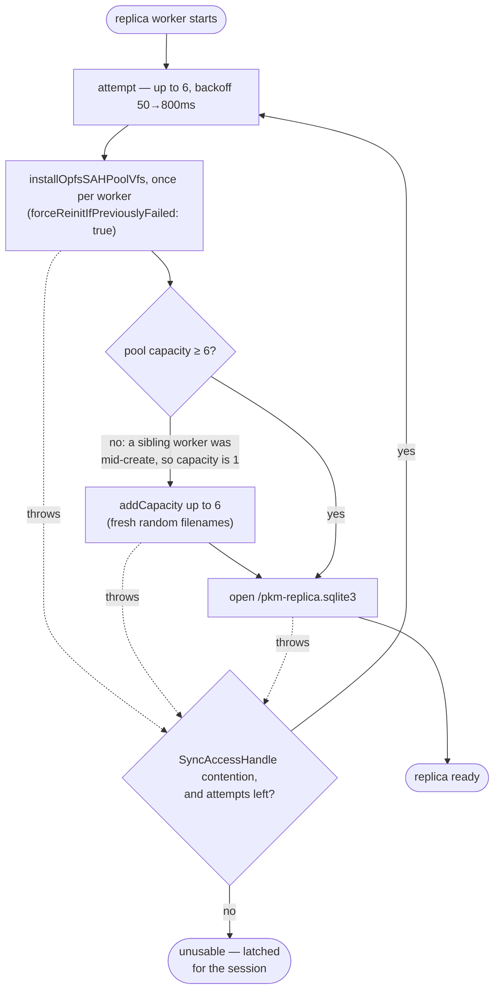
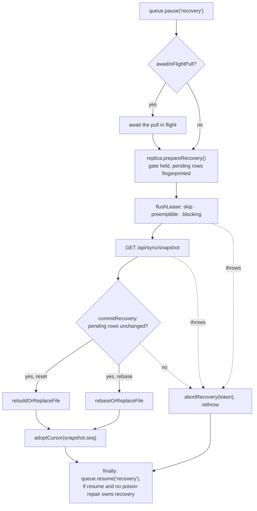

# Sync failure modes and recovery

This doc covers what each guard on the sync path does when something fails:
what detects the failure, what the response is, and which invariant must hold.
The design those guards protect is in [sync-and-offline.md](sync-and-offline.md).
Failures are indexed by what someone would observe in
[troubleshooting.md](../troubleshooting.md).

Every guard here follows from one rule in
[sync-and-offline.md § The replica](sync-and-offline.md#the-replica): the
replica is a cache and the queue is the user's intent.

## Failure modes at a glance

| Failure | Detected by | Response | Must hold | Section |
|---|---|---|---|---|
| A replica write fails: `SQLITE_CANTOPEN`, `IOERR`, a dead worker | `enqueue`'s catch in `opQueue.ts` | Op kept in the in-memory fallback lane | Only `ReplicaError.rejected` drops an op | [A local write fails](#a-local-write-fails) |
| The replica refuses the op itself (title syntax) | `ReplicaError.rejected` | Ticket fails; `onDesync` repairs the outline | The only replica failure that discards | [A local write fails](#a-local-write-fails) |
| Lane entries and durable rows are both waiting | `laneHeadPrecedes` | Ordered by batch identity | Every path that posts durable rows asks the queue first | [The in-memory fallback lane](#the-in-memory-fallback-lane) |
| An enqueue reply is lost after the row persisted | Two copies share one `batch_id` | The second delivery replays | `batch_id` is minted before the RPC | [The in-memory fallback lane](#the-in-memory-fallback-lane) |
| The OPFS file cannot be opened | `openWithRetry`, `ensureMinimumCapacity` | Up to 6 attempts, then `unusable` for the session | `forceReinitIfPreviouslyFailed`; pool top-up before the open | [When the replica cannot be opened](#when-the-replica-cannot-be-opened) |
| The worker RPC breaks | `RpcLifecycleError`, read as `unreachable` | Ops kept; recovery barrier held | `unreachable` never lifts the barrier | [Availability: two values, one owner](#availability-two-values-one-owner) |
| A window was fetched before an ack deleted its pending row | `pendingSetStillCovered` | Applied if the ack's `seq` is covered, else refetched | No window applies without the edits it lacks | [Windows and the pending queue](#windows-and-the-pending-queue) |
| Pending rows change while recovery runs | The fingerprint check in `commitRecovery` | Recovery aborts before anything is destroyed | Every mutating RPC passes the recovery gate | [Recovery never erases intent](#recovery-never-erases-intent) |
| A re-applied pending batch dangles a foreign key | `PRAGMA foreign_key_check` diff in `reapplyPending` | That batch rolls back locally; its row stays | The queue row is never deleted locally | [Recovery never erases intent](#recovery-never-erases-intent) |
| The server answers a terminal 4xx for a durable batch | `isTerminalRejection` returns true | Row poisoned, delivery paused, snapshot repair drops it | Later rows never post ahead of it; the repair never resets | [A batch the server rejects](#a-batch-the-server-rejects) |
| The server answers 401, 403, 408 or 429 | `isTerminalRejection` returns false | Retained under backoff exactly like a 5xx; on a 401, `apiFetch` still redirects to `/login` | A session expiry, a rotated secret or a cleared cookie never poisons or discards a batch | [A batch the server rejects](#a-batch-the-server-rejects) |
| A pull keeps failing | `noteFailure`, counting only `isStallShaped` errors | Backoff retry; `stalled` after `STALL_AFTER_FAILURES` | Network-down and availability failures never count | [A pull that keeps failing](#a-pull-that-keeps-failing) |
| Schema, generation, cursor, FK, title, corruption or repeated window failure | Seven detectors | `reset` or `rebase` from a snapshot | One lifecycle, `runRecovery` | [Rebootstrap triggers](#rebootstrap-triggers) |
| A rebuild or rebase meets page-level file damage | A corruption message from the rebuild | The file is replaced | A rebase commits the queue to the carry before unlinking | [Reset, rebase and file replacement](#reset-rebase-and-file-replacement) |
| `ROLLBACK` fails after SQLite already rolled back | `wrapSqlite`, `rollbackToSavepoint` | The original error is raised | Corruption keeps its own message | [Reset, rebase and file replacement](#reset-rebase-and-file-replacement) |
| An op names a block or parent the server no longer has | `ops_core.classify_missing_target`; `skipsOnMissingTarget` in the replica | Skipped with an ack 200, and skipped in local apply; journal rows fix the replica | Tombstones are journalled before live rows; both sides pass `missing_targets.json` | [Ops on blocks the server no longer has](#ops-on-blocks-the-server-no-longer-has) |
| The same, but the tab has no replica (no feed to tombstone the ghost) | `deliverLaneHead` reads the ack's `skipped` list, only while `unavailable` is latched | Bumps resync; every mounted view's guarded read refetches | Never fires for a replica-backed lane delivery, which gets the tombstone from its feed instead | [Ops on blocks the server no longer has](#ops-on-blocks-the-server-no-longer-has) |
| Another device moved an op's parent, or made its move a cycle | `_context_for` and `classify_missing_target` on the server; `applyOne` and `skipsOnMissingTarget` in the replica | Create and move follow the parent; a cycle move is skipped on both sides | A stale `page_title` is never resolved; a cycle skip journals the moved subtree | [Ops another device's tree edit overtook](#ops-another-devices-tree-edit-overtook) |
| The replica opens, then fails every write | Nothing | Known gap | — | [What the UI shows](#what-the-ui-shows) |

## A local write fails

A failed replica RPC means "could not persist locally right now", the same as
any other local write failure. **`opQueue` keeps the op unless the replica
rejected the op itself.** The rule is a blocklist with one entry,
`ReplicaError.rejected`, not a check on the availability type. A starved pool's
`SQLITE_CANTOPEN` is neither `unusable` nor `unreachable`, so a type check
would let it reach `onDesync`. Its repair wipes the active outline back to the
server's edit-less state. That repair is the outline repair epoch
(`outline/repairEpochs.ts`), owned by
[frontend-editor.md](frontend-editor.md#per-title-outline-sessions); delivery
resumes from its `onStable` callback.

A full disk arrives the same way. The opfs-sahpool VFS reports
`QuotaExceededError` as a bare `SQLITE_IOERR`, so there is no quota signal to
act on, and the op is kept like any other.

Kept ops join an ordered in-memory fallback lane. Once `noteReplicaFailure`
latches `unavailable` from session-fatal evidence (see
[Availability](#availability-two-values-one-owner)), the drain stops calling
`nextBatch()`/`markPoisoned()` and delivers only the lane.

### The in-memory fallback lane

The lane is drained under the same connectivity, backoff and recovery-barrier
policy as durable rows. Two outboxes feed one server, so order is decided by
batch identity in one predicate, `laneHeadPrecedes`, never by a count of
batches ahead:

| Durable batch | Goes |
|---|---|
| persisted by this queue while the lane held entries (a mark in `follows`) | after every lane entry appended before it |
| any other row: a previous session's, the offline shim's `create_page` | ahead of the lane |
| none left (`nextBatch()` returns null) | the lane goes |

**Every path that posts durable rows asks the queue first.** The drain applies
the predicate to each batch `nextBatch()` hands it. The recovery flush
(`flushBatches`) calls `deliverLaneAhead(batch_id)` before each leased batch.
That method only posts; a lane entry's terminal-4xx discard stays the drain's decision.
A new path that posts durable rows without that call can put a move ahead of
the create it depends on. The lane therefore waits for a `nextBatch()` read, so
a failed read delays it through the normal backoff. A duplicate POST of one
head from the drain and the flush is a server replay, and the head leaves the
lane once.

`opQueue.enqueue` mints an entry's `batch_id` *before* the persist RPC, and a
retained entry keeps it. After a lost enqueue reply, a durable row and its lane
copy therefore share one id. Whichever delivers second lands on the server's
`applied_batches` replay instead of a create-collision 400. The two copies can
differ: the worker fills `base_text_hash` and `page_title` into the durable
row, while the lane holds the caller's unfilled ops. `batch_replay_hash`
(`ops_core.py`) ignores both fields, so the second delivery replays instead of
drawing a 409 (see [backend.md § The write path](backend.md#the-write-path)).

Every entry counts towards "N changes pending" and is kept until delivered,
rejected with a terminal 4xx, or the queue is disposed. That terminal 4xx is
the only discard the queue makes on its own; it raises the repair barrier and
calls `onDesync`. A 401, 403, 408 or 429 is not terminal — see
[A batch the server rejects](#a-batch-the-server-rejects) — so it takes the
same retained-under-backoff path as a 5xx instead.

A reload destroys the lane, so `useUnloadGuard` interrupts one. It arms from
`onUnsentInMemory`, the lane's own length, never from "N changes pending",
whose total includes durable rows a reload finds again. The `beforeunload`
listener attaches only while the lane is non-empty, because a permanent one
opts the page out of the back/forward cache. It is a desktop protection: an iOS
standalone PWA honours neither `beforeunload` nor `window.confirm`.

## When the replica cannot be opened

Both failure paths are races between an outgoing worker and its replacement, and
both happen only as a worker starts. The policies are pure modules
(`replica/openRetry.ts`, `replica/poolCapacity.ts`).

`forceReinitIfPreviouslyFailed` must stay in `SAH_POOL_INSTALL_OPTIONS`, because
sqlite-wasm memoises `installOpfsSAHPoolVfs` per VFS name and otherwise
re-awaits the cached rejection. The top-up to `MIN_POOL_CAPACITY` must run
before the open, because nothing grows the pool later and every file SQLite
keeps in the pool claims a slot. Six slots hold `PEAK_POOL_FILES` (`poolCapacity.ts`): the
replica, the carry and their journals, the most a
[file replacement](#reset-rebase-and-file-replacement) holds at once.

### Availability: two values, one owner

**The worker owns the answer and latches it until `close()`.** `db()` in
`workerHandlers.ts` wraps the first `openDb()` failure in a
`ReplicaUnavailableError` and keeps it in `unavailable`. Every later handler
call throws that same object, including an `init()` that would now succeed. Only `close()` re-arms it, because lifting the barrier starts a drain
against a freshly reopened, unexamined database.

`ReplicaAvailability` has two values because its consumers need different
evidence:

| Value | Evidence | Keep the op? | May lift the barrier? |
|---|---|---|---|
| `unusable` | the worker's own `openDb()` failed, so there is no database: a `ReplicaUnavailableError`, on the wire as `unavailable: true` | yes | yes |
| `unreachable` | the RPC broke (`worker-error`, `message-error`, `disposed`, `timeout`), so we could not ask: an `RpcLifecycleError` on the main thread | yes | no |

`unreachable` may not lift the barrier: no answer is not evidence that nothing
is poisoned. Only `unusable` crosses the wire, as a boolean in `rpc.ts`'s
`{message, rejected, unavailable}`. `availabilityOf()` (`replica/errors.ts`)
is where that boolean and the client-side `RpcLifecycleError` become one type.
`isSessionFatal()` answers whether a consumer may latch the state, and says yes
to everything but a bare timeout.

### What the UI shows

Startup raises a `replica-unavailable` problem for an `unusable` replica, and
`OfflineIndicator` renders "Working online only — offline editing is
unavailable for now." Its second sentence depends on connectivity:

| State | Second sentence | Why |
|---|---|---|
| Connected | "Your changes are still being saved to the server." | Raised only for an `unusable` replica, never a `rejected` op, so the queue retains every write |
| Offline, work pending | a warning that N unsent changes exist only in memory and a reload or closed tab discards them | They live only in the fallback lane, and `useUnloadGuard` interrupts a reload only where `beforeunload` is honoured, which an iOS standalone PWA does not |
| Offline, clean queue | none — the first sentence stands alone | Nothing to promise and nothing to lose |

Its action is Reload, not Retry, because the failed open is latched for the
session. It confirms first when ops are pending.

**Known gap:** nothing surfaces a replica that opens and then fails every write.
`availabilityOf` returns `null` for it, so no banner shows, editing stays
enabled, and the user keeps producing writes that live only in memory.

## Windows and the pending queue

`pullLoop` snapshots the pending batch ids before each fetch and passes them to
the worker's `applyChanges`. A window read before batch B committed lacks B. If
B's ack deleted its row in the meantime, applying that window with nothing left
to reapply would drop B's optimistic edit. So the worker compares the snapshot
with the current pending ids (`pendingSetStillCovered` in
`web/src/replica/pendingGuard.ts`):

| Pending ids since the snapshot | Result |
|---|---|
| unchanged | window applied |
| some removed, each deleted on an ack whose `seq` ≤ the window's `latest_seq` | window applied |
| any other removal, an addition, or a reorder | `pending-changed`: `pullLoop` refetches, at most `PENDING_CHANGED_CAP` (20) times, then throws `PullStarvedError` |

The second row is safe because `sync_changes` reads `latest_seq` in the same
read transaction as the window rows. A `latest_seq` at or past B's acked `seq`
means the window and its continuation pages already carry B, which is all a
refetch would add. It is also the common case after every save: the WS nudge
starts a pull while the batch is still pending, and the HTTP ack lands during
the fetch.

The worker holds the acked seqs in memory (`ackedSeqs`), keyed by `pending_ops`
row id. It drops entries outside the latest snapshot on each `applyChanges`,
and clears them all on a schema rebuild, which restarts the AUTOINCREMENT ids.

## Recovery never erases intent

| Guard | Where | What it stops |
|---|---|---|
| Best-effort optimistic apply: an op that cannot apply locally is skipped, never dropped from the queue | `replica/queue.ts::enqueueBatch` | A local failure deleting an edit the server would accept |
| A worker-owned FIFO recovery gate that every database-mutating RPC passes through | `recoveryGate.ts`, `workerHandlers.ts` | An enqueue landing mid-rebuild |
| `prepareRecovery` fingerprints the durable pending rows; `commitRecovery` re-reads them just before the destructive step and aborts if they changed | `workerHandlers.ts` | Recovery erasing an acknowledged enqueue |
| `reapplyPending` re-applies non-poisoned pending batches on top of every snapshot and feed window | `replica/apply.ts` | Later edits capturing stale base hashes |
| `reapplyPending` diffs `PRAGMA foreign_key_check` around each batch and rolls a violating one back to its savepoint | `replica/apply.ts` | A pending block re-created under a row the feed removed failing the whole window at COMMIT |
| Replay (`applyLocalOps` with `reapply`) keeps a create whose row exists, and a move whose block already sits at its target, in place | `replica/localOps.ts::keepSlot` | A pending create failing its whole batch on every window; sibling `order_idx` drifting up per window |
| A rebase that replaces the file commits the queue to a carry database first; every queue handler adopts a leftover carry before serving | `workerHandlers.ts`, `replica/carryStore.ts` | A failed open, schema install or import, or a killed worker, losing the queue during a file replacement |

The FK diff works whatever the enforcement pragmas say, so it also covers the
reset rebuild, which runs under `foreign_keys=OFF`. The rolled-back batch stays
in `pending_ops` and still flushes to the server.

A snapshot wipes before the replay; a window does not. So a windowed replay runs
over the batch's own effects, and the result must still equal window rows plus
every pending batch. A create's existing row is its own, from the enqueue-time
apply or the server's echo. Replaying its insert would hit the PRIMARY KEY, and
replaying a move's sibling shift would push later siblings up again. `keepSlot`
shifts siblings only when one the window re-shipped at its server index shares
the block's slot. At enqueue a create onto an existing uid still fails, as the
server 400s it.

## A batch the server rejects

`isTerminalRejection` (`web/src/sync/rejection.ts`) decides which delivery
failures mean the batch itself is bad, at both delivery sites in `opQueue.ts`
(the lane and the durable drain). It is true only for an `ApiError` whose
status is in `[400, 500)` and is not 401, 403, 408 or 429. Those four can
follow a session expiry, a rotated secret or a cleared cookie, and say nothing
about the batch's content. They take the same retained-under-backoff path as
a 5xx or a dropped fetch, instead of poisoning or discarding anything.
`apiFetch` still redirects to `/login` on a 401 unconditionally; that
redirect is orthogonal to this predicate.

A terminal 4xx on a durable batch marks its row *poisoned* and pauses
delivery. `SyncProvider` then runs the authoritative repair:
`rebaseAuthoritative`, a `rebase` with flush `"skip"`, re-applies the
non-poisoned batches over a fresh snapshot. The provider deletes the poisoned
row by id and resumes delivery.

The repair never escalates to a `reset`, because a reset drops `pending_ops`
and the valid rows behind the poisoned one must stay durable until it is
deleted. It also never posts those rows first. Its way past a damaged file is
the rebase's own file replacement (see
[Reset, rebase and file replacement](#reset-rebase-and-file-replacement)).

Retained mark intents live in `localStorage`, not the replica, so they survive
an unopenable database. A `retryPoisonMarks()` that fails while intents exist
keeps its barrier and a "Saving rejected-change recovery failed: …" Retry
banner. That banner also offers "Discard rejected change"
(`Sync.discardProblem()`), which drops the retained intents and releases the
ownership claim below: at startup it rejoins discovery, mid-session it resumes
delivery. Which recovery a Retry click runs is decided by
`retryPolicy.ts::planRetry`.

`replicaSync`'s `authoritativeRepair` flag is the recovery barrier's ownership
claim. Every exit that can hold it is one of these four:

| Ownership | When |
|---|---|
| Claimed | `rejectDurableBatch` emits `poisonPending`, before the durable mark |
| Released — repaired | A successful `markPoisoned` fires `onPoison`, which runs the repair to success |
| Released — unmatched round | `markRetainedPoison` calls `markPoisoned` and it matches no row (the row vanished between POST and mark); `replicaSync` releases and resumes on its own |
| Released — discarded | `Sync.discardProblem()` drops the retained intents and releases before it resumes |

A mark RPC failure (network or database error, not a match failure) holds the
claim on purpose: the row is still unmarked, so the barrier must stand until a
Retry re-marks it.

## A pull that keeps failing

A pull failure that escapes `pullLoop` reaches `noteFailure`, which retries
from `RETRY_BASE_MS` (1 s) doubling to `RETRY_MAX_MS` (60 s), with no timer
while offline. The reconnect flow restarts the pull when the socket returns.
`isStallShaped` decides whether the failure counts towards
`STALL_AFTER_FAILURES` (3):

| Failure | Counts? | Why |
|---|---|---|
| `ApiError`, `ReplicaError`, `PullStarvedError` | yes | the replica cannot make progress |
| `OfflineError` (status 0, although it extends `ApiError`), a raw `fetch` rejection | no | the offline banner already owns network-down |
| anything `availabilityOf()` classifies | no | a session already known to have no replica is not stalled, and `stalled` would take editing away |

The third counted failure sets mode `stalled`, and the banner reads "Local sync
is stuck" with Reset local data. `WINDOW_STRIKES` equals `STALL_AFTER_FAILURES`
so that a window failing identically rebases before the banner can show.

## Rebootstraps

### Rebootstrap triggers

Seven conditions cause a rebootstrap from `GET /api/sync/snapshot` on their own:

| Trigger | Detected by | Kind |
|---|---|---|
| App deploy changed the client schema | `SCHEMA_VERSION` = sha256(base + client DDL) vs stored value | `reset` (drop and recreate every table) |
| Server DB rebuilt or title activation rotated generation | `generation` token mismatch in any feed payload; a forced WS frame makes metadata-only rotation pull immediately | `rebase` (flush queue, re-snapshot) |
| Cursor ahead of journal | `reset: true` from the feed | `rebase` |
| Window cannot commit: deferred FK check fails (dependency-incomplete feed, e.g. an older server) | `applyChanges` catches the FK failure at COMMIT and returns `needs-bootstrap` | `rebase` |
| A local page or sidebar row holds a title this window gives to another id, and the window neither retitles nor tombstones that row | a row still parked by `parkTakenTitles` after the upserts throws `StaleTitleHolderError`, and `applyChanges` returns `needs-bootstrap` | `rebase` |
| The replica reports corruption (`SQLITE_CORRUPT`, or FTS5's `SQLITE_CORRUPT_VTAB`) applying a window or a rebase snapshot | `isCorruptionError` in `pullLoop` and `recover`, once per session; `replica.diagnostics()` (quick_check, FTS `integrity-check`, row counts, cursor) is posted to `POST /api/client/diagnostics` first | `reset`: a rebase would replay the snapshot through the same FTS triggers over the same corrupt index |
| A window keeps failing for any other reason — a NOT NULL or CHECK violation, a bug in an upsert | `WINDOW_STRIKES` failures of one cursor with one message in `pullLoop`. `isWindowFailure` counts only a `ReplicaError` that is neither corruption nor an availability verdict, so transport failures never count. Posted with `replica.diagnostics()` under kind `window-unappliable`, once per session | `rebase`: nothing says the schema or the FTS index is bad, and a rebase keeps the pending queue's rows |

Two more rebootstraps happen on request: the authoritative repair of a poisoned
batch, and the user's own Reset local data.

### runRecovery

`runRecovery` (`web/src/sync/replicaSync.ts`) is the single lifecycle behind all
of them:

Entrants differ only in the `RecoveryOptions` they pass:

| Option | schema / feed recovery | poison repair | manual reset |
|---|---|---|---|
| `flush` | `"preemptible"`: abandon the run if a poison mark claims recovery mid-flush | `"skip"`: never post later valid rows ahead of a batch the server refused | `"blocking"`: a failed flush raises `ResetBlockedError` and keeps the database. `"skip"` when the user chose to discard pending changes |
| `resume` | yes | no: `SyncProvider` resumes after deleting the durable row | yes |
| `reportReplicaFailure` | yes, mode `recovery-failed` | no, the repair banner owns the report | no, the reset banner owns the report |
| `awaitInFlightPull` | no | yes | yes |
| `forceReadyOnSuccess` | no | no | yes: mode `ready`, pulls re-enabled |

A pull past the pending-id guard must finish before the database is torn down,
or its stale window applies after the fresh snapshot and moves the cursor
backwards. Schema and feed recovery keeps `awaitInFlightPull` false because
`pullLoop` calls it from inside the pull it would await. That entrant runs
through `recover()`, which turns a `rebase` failing on fresh corruption into
the session's one `reset`.

### Reset, rebase and file replacement

A `reset` rebuilds the tables inside the existing file, in one transaction, so
a failure leaves the old database whole. That cannot get past damage to the
file itself: a broken freelist or page map, which `quick_check` reports and the
FTS checks do not. When the rebuild throws a corruption error,
`rebuildOrReplaceFile` (`web/src/replica/workerHandlers.ts`) calls the worker's
`discardDbFile`. That closes the database and unlinks the file and its
`-journal` from the SAH pool, and the rebuild runs again on a fresh file. The
journal goes too: this VFS never rolls a journal back, so one a killed worker
left would otherwise hold a pool slot for good.
Pending rows lose nothing, because a reset drops `pending_ops` anyway and its
caller already holds them from `prepareRecovery`.

A `rebase` meets the same damage when its snapshot apply deletes rows.
`rebaseOrReplaceFile` takes the same escape but keeps the queue. This is how
the rejected-batch repair gets past a damaged file without resetting. **The
queue is committed to the carry database, `/pkm-replica-carry.sqlite3`,
before the damaged file is unlinked.** The rows travel verbatim, ids,
`poisoned` and `error` included, because the provider deletes the poisoned row
by id afterwards.

| Step | Action | If the worker dies here, the rows are intact in |
|---|---|---|
| 1 | `carry.write(rows)` commits them to the carry (`carryStore.ts`) | the damaged file |
| 2 | `discardDbFile` unlinks the damaged file and its journal | the carry |
| 3 | The new file gets `rebuildSchema`, then `importPendingRows` (`INSERT OR IGNORE` by id) | the carry |
| 4 | `carry.discard()` | the new file |
| 5 | The snapshot applies and re-applies pending | the new file |

A commit is not atomic across a worker's death on this VFS. It never rolls
back a journal a killed worker left, so a death inside a commit leaves that
file torn. The carry guarantees that no row is lost at any instant: at every
step, a file that is not being written holds them all. It does not guarantee
that the file being written is readable, and adoption handles that case.

A failed carry write leaves the damaged file untouched and discards the
carry, best effort. Without a carry store a rebase rethrows rather than
replace the file. The carry goes at step
4, not after the snapshot. A carry kept past a failed snapshot would be
adopted on a later open and bring back batches acked or deleted since.

Every queue handler reaches the database through `queueDb`, which imports a
leftover carry and discards it before serving. Adoption cannot wait for
`init`, because an edit can reach a restarted worker first. Its insert would
take the carried ids, and the by-id import would then drop those rows.
`diagnostics` alone uses `db()`, so it never writes and an adoption failure
cannot sink its report.

No handler succeeds while a carry exists, because each adopts first and
fails if it cannot. So neither file's queue changes while a carry exists. A
carry whose write committed holds every pending row the replica held. One
whose write failed or was cut short holds a subset, possibly none, and the
replica it was written from still holds them all. Beyond its queue the
replica is a cache. That makes adoption's two escapes safe:

| Adoption meets | Outcome | Why no row is lost |
|---|---|---|
| A carry that reads as `SQLITE_CORRUPT*` or `SQLITE_NOTADB` (`isUnreadableFileMessage`, `errors.ts`) | The carry is discarded with a warning | Only a death inside step 1 tears it, and step 1 precedes the unlink, so the replica still holds the rows |
| A replica whose `installSchema` or `importPendingRows` throws | The carry's rows are merged by id with every row the old file can still be read for (`mergeCarriedRows`, `carryMerge.ts`; the carry's row wins a clash) and written back to the carry, then `discardDbFile` runs, then the new file imports the merged rows from the carry, which is then discarded | A short carry cannot shed rows only the old file held. Rows are lost only if the carry is short and the old file unreadable, both files damaged at once |
| Any other read error (contention, transient I/O), or a replacement that fails too | The handler fails and the carry is kept | The merged write lands before the old file goes, so the carry is always the rows' sure copy from that point on |

Without the escapes, one torn file would fail every handler for good,
`prepareRecovery` included, and no edit would leave the device again.

A replacement that keeps failing leaves the carry for the next handler, which
replaces the file again. If the new file will not open, `db()` latches the
session unavailable and edits go online through the
[fallback lane](#the-in-memory-fallback-lane). Those new edits can then reach
the server ahead of the carried rows, which the next session delivers. That
changes their order, but loses none of them.

**Corruption must reach `isCorruptionError` with its own message.** SQLite
rolls back the whole transaction by itself on `SQLITE_CORRUPT`, `IOERR` or
`FULL`, and a later `ROLLBACK` or `ROLLBACK TO` then fails with "no transaction
is active" or "no such savepoint". `wrapSqlite`'s `transaction` and
`rollbackToSavepoint` (`web/src/replica/db.ts`) raise the original error
instead. A masked message looks like an unappliable window, which earns a
rebase over the same damaged file.

## Ops on blocks the server no longer has

An op whose block, or create/move parent, is gone never rejects its batch: the
server skips it, lands any lost text on today's daily page, and acks 200 (the
per-op table is in [backend.md § The write path](backend.md#the-write-path)).
The client keeps its optimistic copy of the skipped op. So the server journals
every uid involved in the same commit through `JournalBlock`, and the feed
ships each as a tombstone, or as the block's real row if it exists.

A replica applies tombstones first, and a block tombstone cascades its local
subtree. For a move under a missing parent, the server journals the parent's
tombstone and then every block of the moved subtree. `_plan_missing_target`
emits tombstones before live rows, so a window boundary never puts a tombstone
after the rows that restore what it cascades away. The ghost goes without a
snapshot repair.

The replica's local apply skips the same ops. `skipsOnMissingTarget`
(`replica/missingTarget.ts`) mirrors `classify_missing_target`, and
`shared/fixtures/missing_targets.json` pins the two to one table. So when the
feed removes one op's target, `reapplyPending` keeps the rest of that batch.
Rolling the whole batch back would revert its other edits until the ack. The
next edit to a reverted block would then hash against stale text and draw a
spurious conflict header.

A tab with no replica gets no tombstone. It delivers through the
[fallback lane](#the-in-memory-fallback-lane) and drops its own WS echo, so a
ghost block would stay on screen, and each flush into it would land another
daily-note child. So once `unavailable` is latched, `deliverLaneHead` reads the
ack's `skipped` list, and a non-empty one bumps resync
(`ops-skipped-no-replica` in `syncState.ts`). That is the guarded read every
resync trigger runs, not the outline repair epoch, so pending edits elsewhere
on the page survive. A replica-backed lane delivery does not bump, because its
feed tombstones the ghost.

## Ops another device's tree edit overtook

A create or move under a parent another device moved, and a move that
another device's move turned into a cycle, never reject their batch either.
Each side resolves them the same way, and the feed carries the server's rows:

| Op | Server | Replica local apply | How the replica converges |
|---|---|---|---|
| `create` under a parent now on another page | Created on the parent's page; the stale `page_title` is never resolved | Same; a replayed create also moves to a parent a window re-paged | The insert trigger journals the block, and the feed ships its row |
| `move` whose `page_title` no longer names the parent's page | Moved onto the parent's page | Already follows the parent | The triggers journal the re-paged subtree |
| `move` under the block itself or its descendant | Skipped with a daily-note entry | Skipped: `skipsOnMissingTarget` reads the target's parent chain | The server journals every block of the moved subtree, root first |

The local cycle check matters on a replay over a snapshot or window that
already holds the other device's move. Replaying the move there would put
the block under its own descendant, a loop no page root reaches, and the
subtree would vanish from its page until the ack. A move the replica applied
before that state arrived leaves no loop either. The window with the other
device's move also ships the moved block's row, through the parent closure.
The journalled subtree then restores what else the local move touched:
descendants it re-paged, and the target's children it shifted.
`missing_targets.json` pins the cycle rule on both sides.
