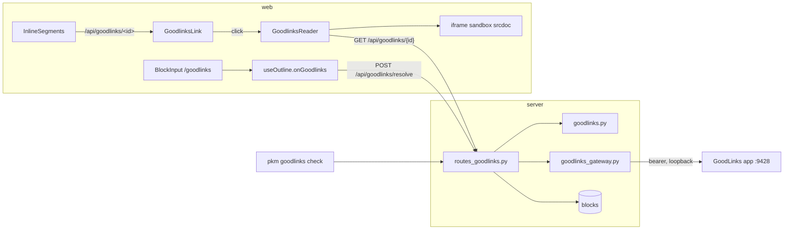

# Goodlinks Links Implementation Plan

> **For agentic workers:** REQUIRED SUB-SKILL: Use superpowers:subagent-driven-development (recommended) or superpowers:executing-plans to implement this plan task-by-task. Steps use checkbox (`- [ ]`) syntax for tracking.

**Goal:** Make `Local copy:: [Goodlinks](/api/goodlinks/<id>)` links open the archived article in a sandboxed full-screen reader, and add a `/goodlinks` slash command that resolves the nearest URL against GoodLinks (saving it there if absent) and inserts that link.

**Architecture:** The pkm server proxies the GoodLinks local HTTP API (bearer token, localhost only) behind three authenticated routes in `routes_goodlinks.py`, with all pure decisions (candidate URLs, search matching, href shapes, the HTML sanitiser allowlist) in `goodlinks.py`. The web app recognises the href prefix in `InlineSegments`, renders a click-to-open button, and mounts a portalled overlay whose body is an `<iframe sandbox srcdoc>` fed only server-sanitised HTML. The slash command rides the existing `/upload` shape: `BlockInput` strips the trigger and blurs, `useOutline` gathers candidate URLs from the tree, calls the resolve route, and splices the attribute through the draft path.

**Tech Stack:** FastAPI + pydantic + httpx2 + nh3 (server), React 18 + TypeScript + vitest + Playwright (web), openapi-typescript for the generated client types.

**Spec:** `docs/superpowers/specs/2026-09-23-goodlinks-links-design.md`

## Global Constraints

- Never write the phrase "load-bearing" anywhere: code comments, docs, tests, commit messages.
- Every new `.py`/`.ts`/`.tsx` module starts with a `# pattern: Functional Core` / `# pattern: Imperative Shell` (or `//` equivalent) header; `pnpm check:fcis` enforces it on the web side.
- Server: ruff `line-length = 120`; `uv run pytest -q` enforces coverage; `uv run pyrefly check` must pass.
- Any route or response-model change: regenerate `web/src/api/openapi.json` with `cd server && uv run python -m pkm.server.openapi_dump > ../web/src/api/openapi.json` then `cd web && pnpm gen-types`, and commit both. `test_openapi_sync.py` fails otherwise.
- Slash commands are appended at the END of `SLASH_COMMANDS` and documented in `docs/keyboard.md` (drift test `help/slashCommandsDocumented.test.ts`). Labels are lowercase.
- Text edits ride the draft or `run()` path in `useOutline`; never mutate the tree directly from a component.
- The sanitiser allowlist and the iframe sandbox are the two barriers between third-party HTML and the app. Neither is widened for convenience; the only innerHTML-equivalent is the iframe `srcDoc`.
- Block form is exactly `Local copy:: [Goodlinks](/api/goodlinks/<32 hex id>)`; the renderer keys on the href, never on the link text.
- Popovers and overlays are portalled to `document.body`.
- Commit messages end with `Co-Authored-By: Claude Fable 5.1 <noreply@anthropic.com>` and never contain a session URL (the repo's commit-msg hook rejects it).

## Review Focus

Inputs the spec implies but which are easy to leave untested. Each has its pinning test in the task named.

1. **A GoodLinks response with `title: null` or no `addedAt`** must not 500; the payload carries `""` for both. Test in Task 5 (`test_article_tolerates_missing_title_and_date`).
2. **A block whose text mentions `/api/goodlinks/` but with a non-hex id** (typo, truncated paste) must render as plain text-or-anchor in the app and count as `invalid` in check, never crash either. Tests in Task 5 (check) and Task 7 (`isGoodlinksHref` table).
3. **Reader opened while offline on the iPad**: the fetch throws `OfflineError` (status 0), not a 5xx; the note must be "Needs the server", not "Couldn't load". Test in Task 8 (`failureNote(0)`).
4. **Article HTML containing a `<base href>` or `<meta http-equiv=refresh>`**: neither is in the allowlist, so nh3 drops them; a test in Task 2 asserts both are gone so a future allowlist edit cannot re-admit them silently.
5. **The `/goodlinks` command picked in a block that already has focus moved elsewhere by the time the resolve returns** (user clicked another block): the splice targets the recorded uid and offset, not the current focus, and does not steal focus back. Test in Task 9 (`splices into the requesting block even when focus has moved`).

---

### Task 1: Config keys for the GoodLinks API

**Files:**
- Modify: `server/src/pkm/server/config.py`
- Modify: `server/tests/conftest.py:44-69` (the `seeded_config` fixture) and `:137-141` (the `_no_ambient_openai_key` autouse fixture)
- Test: `server/tests/test_config.py`

**Interfaces:**
- Produces: `Config.goodlinks_api_key_file: Path` (default `../goodlinks_key`, resolved against `config.json`'s directory) and `Config.goodlinks_api_url: str` (default `http://localhost:9428/api/v1`).

- [ ] **Step 1: Write the failing tests**

Append to `server/tests/test_config.py`:

```python
def test_goodlinks_defaults(tmp_path):
    cfg = load_config(write_config(tmp_path, {}))
    assert cfg.goodlinks_api_key_file == tmp_path / "../goodlinks_key"
    assert cfg.goodlinks_api_url == "http://localhost:9428/api/v1"


def test_goodlinks_keys_are_read(tmp_path):
    cfg = load_config(write_config(tmp_path, {
        "goodlinks_api_key_file": "secrets/gl",
        "goodlinks_api_url": "http://127.0.0.1:9429/api/v1",
    }))
    assert cfg.goodlinks_api_key_file == tmp_path / "secrets/gl"
    assert cfg.goodlinks_api_url == "http://127.0.0.1:9429/api/v1"
```

- [ ] **Step 2: Run to verify they fail**

Run: `cd server && uv run pytest -q tests/test_config.py -k goodlinks`
Expected: FAIL with `AttributeError: 'Config' object has no attribute 'goodlinks_api_key_file'`

- [ ] **Step 3: Add the fields and loader lines**

In `server/src/pkm/server/config.py`, after the `local_docs_root` field:

```python
    # GoodLinks local API (see goodlinks.py / routes_goodlinks.py). Same
    # placement and precedence as the OpenAI key: the file wins over the
    # GOODLINKS_API_KEY env var; no key at all disables the feature.
    goodlinks_api_key_file: Path = Path("../goodlinks_key")
    # Where the GoodLinks app listens. Only the e2e server points this
    # anywhere but the documented localhost port.
    goodlinks_api_url: str = "http://localhost:9428/api/v1"
```

In `load_config`, after the `local_docs_root=` argument:

```python
        goodlinks_api_key_file=base / raw.get("goodlinks_api_key_file", "../goodlinks_key"),
        goodlinks_api_url=str(raw.get("goodlinks_api_url", "http://localhost:9428/api/v1")),
```

- [ ] **Step 4: Point the test fixtures at a non-existent key file and clear the env**

In `server/tests/conftest.py`, inside `seeded_config`'s `Config(...)` call, after `zai_api_key_file=tmp_path / "zai_key",` add:

```python
        goodlinks_api_key_file=tmp_path / "goodlinks_key",
```

In the autouse fixture `_no_ambient_openai_key`, add one line alongside the existing `monkeypatch.delenv` calls:

```python
    monkeypatch.delenv("GOODLINKS_API_KEY", raising=False)
```

- [ ] **Step 5: Run the config tests and the whole suite**

Run: `cd server && uv run pytest -q tests/test_config.py && uv run pytest -q`
Expected: all PASS.

- [ ] **Step 6: Commit**

```bash
git add server/src/pkm/server/config.py server/tests/conftest.py server/tests/test_config.py
git commit -m "config: goodlinks_api_key_file and goodlinks_api_url

Co-Authored-By: Claude Fable 5.1 <noreply@anthropic.com>"
```

---

### Task 2: Pure core `goodlinks.py` (hrefs, candidates, search match, sanitiser)

**Files:**
- Create: `server/src/pkm/goodlinks.py`
- Modify: `server/pyproject.toml` (add `nh3` dependency via `uv add`)
- Test: `server/tests/test_goodlinks.py`

**Interfaces:**
- Produces:
  - `GOODLINKS_PREFIX = "/api/goodlinks/"`
  - `is_link_id(value: str) -> bool` (exactly 32 lowercase hex chars)
  - `goodlinks_href(link_id: str) -> str`
  - `link_id_from_href(href: str) -> str | None` (None unless the href is prefix + valid id)
  - `extract_goodlinks_hrefs(text: str) -> list[str]` (deduplicated, in order)
  - `candidate_urls(url: str) -> list[str]` (as written, then with query and fragment stripped when that differs)
  - `search_match(candidates: list[str], results: list[dict]) -> dict | None` (first candidate for which exactly one result URL starts with it)
  - `sanitize_article(html: str) -> str`

- [ ] **Step 1: Add the dependency**

Run: `cd server && uv add nh3`
Expected: `pyproject.toml` gains `"nh3>=0.3"` (or the resolved floor) under `dependencies`, `uv.lock` updates.

- [ ] **Step 2: Write the failing tests**

Create `server/tests/test_goodlinks.py`:

```python
import pytest

from pkm.goodlinks import (GOODLINKS_PREFIX, candidate_urls, extract_goodlinks_hrefs,
                           goodlinks_href, is_link_id, link_id_from_href,
                           sanitize_article, search_match)

ID = "e4966bb2483b5c78f658398c0ae7b03f"


@pytest.mark.parametrize("value,ok", [
    (ID, True),
    (ID.upper(), False),
    (ID[:-1], False),
    (ID + "0", False),
    ("check", False),
    ("", False),
])
def test_is_link_id(value, ok):
    assert is_link_id(value) is ok


def test_href_round_trip():
    href = goodlinks_href(ID)
    assert href == GOODLINKS_PREFIX + ID
    assert link_id_from_href(href) == ID
    assert link_id_from_href("/api/goodlinks/not-hex") is None
    assert link_id_from_href("/api/local/x.pdf") is None


def test_extract_hrefs_from_links_and_bare_tokens():
    text = (f"Local copy:: [Goodlinks]({goodlinks_href(ID)}) and see {GOODLINKS_PREFIX}abc "
            f"again [dup]({goodlinks_href(ID)})")
    assert extract_goodlinks_hrefs(text) == [goodlinks_href(ID), GOODLINKS_PREFIX + "abc"]


def test_extract_hrefs_ignores_other_prefixes():
    assert extract_goodlinks_hrefs("[x](/api/local/a.pdf) plain text") == []


@pytest.mark.parametrize("url,expected", [
    ("https://a.example/p", ["https://a.example/p"]),
    ("https://a.example/p?utm=1", ["https://a.example/p?utm=1", "https://a.example/p"]),
    ("https://a.example/p#top", ["https://a.example/p#top", "https://a.example/p"]),
    ("https://a.example/p?x=1#top", ["https://a.example/p?x=1#top", "https://a.example/p"]),
])
def test_candidate_urls(url, expected):
    assert candidate_urls(url) == expected


def test_search_match_accepts_exactly_one_prefix_hit():
    results = [{"url": "https://a.example/p?publication_id=1", "id": "1"},
               {"url": "https://b.example/other", "id": "2"}]
    assert search_match(["https://a.example/p?utm=9", "https://a.example/p"], results) == results[0]


def test_search_match_rejects_zero_or_two_hits():
    two = [{"url": "https://a.example/p?x=1"}, {"url": "https://a.example/p?x=2"}]
    assert search_match(["https://a.example/p"], two) is None
    assert search_match(["https://a.example/p"], []) is None
    assert search_match(["https://a.example/p"], [{"url": "https://a.example/q"}]) is None


HOSTILE = """<div dir="auto"><p onclick="x()" style="color:red">Hello <b>bold</b>
<a href="javascript:alert(1)">bad</a> <a href="https://ok.example/x" title="t">good</a></p>
<script>alert(1)</script><style>p{display:none}</style>
<iframe src="https://evil.example"></iframe><form action="/x"><input></form>

<base href="https://evil.example/"><meta http-equiv="refresh" content="0;url=https://evil.example">
<table><tr><td colspan="2">cell</td></tr></table><pre><code>x</code></pre></div>"""


def test_sanitize_strips_hostile_markup_and_keeps_structure():
    out = sanitize_article(HOSTILE)
    for gone in ("<script", "alert(", "<style", "<iframe", "<form", "<input", "onclick", "style=",
                 "javascript:", "data:image", "<base", "<meta", "http-equiv"):
        assert gone not in out, gone
    for kept in ("<p>", "<b>bold</b>", "<td colspan=\"2\">cell</td>", "<pre><code>x</code></pre>",
                 'src="https://ok.example/i.png"', 'alt="i"', 'title="t"'):
        assert kept in out, kept


def test_sanitize_anchors_open_in_new_tab_without_referrer():
    out = sanitize_article('<p><a href="https://ok.example/x">good</a></p>')
    assert 'href="https://ok.example/x"' in out
    assert 'target="_blank"' in out
    assert 'rel="noopener noreferrer"' in out


def test_sanitize_drops_javascript_href_but_keeps_text():
    out = sanitize_article('<p><a href="javascript:alert(1)">bad</a></p>')
    assert "javascript:" not in out
    assert "bad" in out
```

- [ ] **Step 3: Run to verify they fail**

Run: `cd server && uv run pytest -q tests/test_goodlinks.py`
Expected: FAIL with `ModuleNotFoundError: No module named 'pkm.goodlinks'`

- [ ] **Step 4: Write the module**

Create `server/src/pkm/goodlinks.py`:

```python
# pattern: Functional Core
"""Pure decisions behind the /api/goodlinks routes: what a GoodLinks link
href looks like in block text, which URLs to try when resolving a page
against the GoodLinks library, when a search result counts as a match,
and how third-party reader HTML is reduced to an allowlist before the
web app is allowed to render it. No I/O here; routes_goodlinks.py talks
to GoodLinks and calls in.

`sanitize_article` is the first of two barriers between an article's HTML
and the app; the reader's `<iframe sandbox>` is the second. Nothing may
be added to the allowlists for convenience: a tag or attribute that is
not listed is dropped, and that is the intended behaviour."""
from __future__ import annotations

import re
from urllib.parse import urlsplit, urlunsplit

import nh3

GOODLINKS_PREFIX = "/api/goodlinks/"

_ID_RE = re.compile(r"[0-9a-f]{32}")

# `[text](/api/goodlinks/...)` targets and bare `/api/goodlinks/...` tokens,
# the same two shapes local_docs.py extracts for /api/local/.
_HREF_RE = re.compile(r"\]\((/api/goodlinks/[^)\s]+)\)|(?<![\w(])(/api/goodlinks/[^\s)\]]+)")

_ALLOWED_TAGS: set[str] = {
    "p", "h1", "h2", "h3", "h4", "h5", "h6", "ul", "ol", "li", "blockquote",
    "pre", "code", "em", "strong", "b", "i", "a", "img", "figure", "figcaption",
    "table", "thead", "tbody", "tr", "th", "td", "br", "hr", "sup", "sub",
}
_ALLOWED_ATTRIBUTES: dict[str, set[str]] = {
    "a": {"href", "title"},
    "img": {"src", "alt"},
    "td": {"colspan", "rowspan"},
    "th": {"colspan", "rowspan"},
}
_URL_SCHEMES: set[str] = {"http", "https"}


def is_link_id(value: str) -> bool:
    return _ID_RE.fullmatch(value) is not None


def goodlinks_href(link_id: str) -> str:
    return GOODLINKS_PREFIX + link_id


def link_id_from_href(href: str) -> str | None:
    if not href.startswith(GOODLINKS_PREFIX):
        return None
    link_id = href[len(GOODLINKS_PREFIX):]
    return link_id if is_link_id(link_id) else None


def extract_goodlinks_hrefs(text: str) -> list[str]:
    seen: list[str] = []
    for m in _HREF_RE.finditer(text):
        href = m.group(1) or m.group(2)
        if href not in seen:
            seen.append(href)
    return seen


def candidate_urls(url: str) -> list[str]:
    """The URL as written, then without its query string and fragment when
    that changes anything. Tracking parameters are the usual reason an
    exact lookup misses a page GoodLinks does hold."""
    out = [url]
    parts = urlsplit(url)
    stripped = urlunsplit((parts.scheme, parts.netloc, parts.path, "", ""))
    if stripped != url:
        out.append(stripped)
    return out


def search_match(candidates: list[str], results: list[dict]) -> dict | None:
    """A search result counts only when exactly one result's URL starts
    with a candidate. Two hits is ambiguity, zero is a miss; the caller
    never guesses."""
    for candidate in candidates:
        hits = [r for r in results if str(r.get("url", "")).startswith(candidate)]
        if len(hits) == 1:
            return hits[0]
    return None


def sanitize_article(html: str) -> str:
    """Reduce GoodLinks' reader HTML to the allowlist above. Disallowed tags
    are unwrapped (their text survives) except script and style, whose
    content goes too. URLs outside http(s) lose their attribute. Every
    anchor opens in a new tab with no referrer."""
    return nh3.clean(
        html,
        tags=_ALLOWED_TAGS,
        attributes=_ALLOWED_ATTRIBUTES,
        url_schemes=_URL_SCHEMES,
        link_rel="noopener noreferrer",
        set_tag_attribute_values={"a": {"target": "_blank"}},
        strip_comments=True,
    )
```

- [ ] **Step 5: Run the tests**

Run: `cd server && uv run pytest -q tests/test_goodlinks.py`
Expected: all PASS. If `set_tag_attribute_values` is rejected by the installed nh3, check `python -c "import nh3, inspect; print(inspect.signature(nh3.clean))"`; the parameter exists from nh3 0.2.13. Do not fall back to string-appending `target=` after cleaning.

- [ ] **Step 6: Lint and type-check**

Run: `cd server && uv run ruff check && uv run pyrefly check`
Expected: clean. If pyrefly lacks stubs for nh3, add `# pyrefly: ignore` only on the `import nh3` line, nowhere else.

- [ ] **Step 7: Commit**

```bash
git add server/pyproject.toml server/uv.lock server/src/pkm/goodlinks.py server/tests/test_goodlinks.py
git commit -m "goodlinks core: href shapes, candidate URLs, search match, HTML sanitiser

Co-Authored-By: Claude Fable 5.1 <noreply@anthropic.com>"
```

---

### Task 3: Response and request contracts

**Files:**
- Modify: `server/src/pkm/contracts/responses.py` (after `LocalCheckPayload`, line ~249)
- Test: covered by Task 5's route tests and `test_openapi_sync.py`

**Interfaces:**
- Produces (all pydantic `BaseModel`s):
  - `GoodlinksResolveRequest(url: str, save: bool = False)`
  - `GoodlinksLink(id, title, url, added_at: str, created: bool)`
  - `GoodlinksArticle(id, title, url, added_at: str, html: str)`
  - `GoodlinksCheckProblem(uid, page, href, status: Literal["missing", "invalid"])`
  - `GoodlinksCheckPayload(enabled: bool, total: int, ok: int, problems: list[GoodlinksCheckProblem])`

- [ ] **Step 1: Add the models**

Insert after `LocalCheckPayload` in `server/src/pkm/contracts/responses.py` (the file already imports `BaseModel`, `Field` and `Literal`; add `Field` to the import if it is missing):

```python
class GoodlinksResolveRequest(BaseModel):
    """POST /api/goodlinks/resolve body. `save` lets the slash command add
    a page GoodLinks does not have yet; the migration script never sets it."""
    url: str = Field(min_length=1, max_length=2000)
    save: bool = False


class GoodlinksLink(BaseModel):
    """POST /api/goodlinks/resolve: the GoodLinks link a URL resolved to.
    `created` is True when the request saved it just now."""
    id: str
    title: str
    url: str
    added_at: str
    created: bool


class GoodlinksArticle(BaseModel):
    """GET /api/goodlinks/{link_id}: metadata plus the sanitised reader HTML
    in one payload, so the reader overlay makes a single request."""
    id: str
    title: str
    url: str
    added_at: str
    html: str


class GoodlinksCheckProblem(BaseModel):
    uid: str
    page: str
    href: str
    status: Literal["missing", "invalid"]


class GoodlinksCheckPayload(BaseModel):
    """GET /api/goodlinks/check: every /api/goodlinks/ href found in block
    text, checked against the GoodLinks library. `enabled` is False when
    no API key is configured."""
    enabled: bool
    total: int
    ok: int
    problems: list[GoodlinksCheckProblem]
```

- [ ] **Step 2: Import check**

Run: `cd server && uv run python -c "from pkm.contracts.responses import GoodlinksArticle, GoodlinksLink, GoodlinksCheckPayload, GoodlinksResolveRequest; print('ok')"`
Expected: `ok`

- [ ] **Step 3: Commit**

```bash
git add server/src/pkm/contracts/responses.py
git commit -m "contracts: Goodlinks resolve, article and check payloads

Co-Authored-By: Claude Fable 5.1 <noreply@anthropic.com>"
```

---

### Task 4: `GoodlinksGateway` (the HTTP shell over the GoodLinks API)

**Files:**
- Create: `server/src/pkm/server/goodlinks_gateway.py`
- Test: `server/tests/test_goodlinks_gateway.py`

**Interfaces:**
- Produces:
  - `class GoodlinksUnavailable(Exception)`: GoodLinks did not answer, or answered 5xx.
  - `class GoodlinksRejected(Exception)` with `.status: int` and `.detail: str`: GoodLinks refused a save (4xx on POST).
  - `class GoodlinksGateway(base_url: str, token: str, http: httpx2.Client | None = None)` with methods `lookup(url) -> dict | None`, `search(query, limit=5) -> list[dict]`, `save(url) -> dict`, `link(link_id) -> dict | None`, `content(link_id) -> str | None`, `close()`.

- [ ] **Step 1: Write the failing tests**

Create `server/tests/test_goodlinks_gateway.py`:

```python
import json

import httpx2
import pytest

from pkm.server.goodlinks_gateway import (GoodlinksGateway, GoodlinksRejected,
                                          GoodlinksUnavailable)

BASE = "http://goodlinks.test/api/v1"
ID = "e4966bb2483b5c78f658398c0ae7b03f"
LINK = {"id": ID, "url": "https://a.example/p", "title": "A", "addedAt": "2025-02-13T19:51:00Z"}


def gateway(handler) -> GoodlinksGateway:
    http = httpx2.Client(transport=httpx2.MockTransport(handler), base_url=BASE)
    return GoodlinksGateway(BASE, "tok", http=http)


def test_lookup_sends_bearer_and_decodes_hit():
    seen = {}

    def handler(req: httpx2.Request) -> httpx2.Response:
        seen["auth"] = req.headers.get("authorization")
        seen["url"] = str(req.url)
        return httpx2.Response(200, json=LINK)

    assert gateway(handler).lookup("https://a.example/p") == LINK
    assert seen["auth"] == "Bearer tok"
    assert seen["url"] == f"{BASE}/links?url=https%3A%2F%2Fa.example%2Fp"


def test_lookup_404_is_none():
    assert gateway(lambda r: httpx2.Response(404, json={"error": "Not Found"})).lookup("x") is None


def test_search_returns_data_list():
    def handler(req):
        assert req.url.params["search"] == "a.example/p"
        assert req.url.params["limit"] == "5"
        return httpx2.Response(200, json={"data": [LINK], "hasMore": False})

    assert gateway(handler).search("a.example/p") == [LINK]


def test_save_posts_url_read_true_and_returns_link():
    seen = {}

    def handler(req):
        seen["method"] = req.method
        seen["body"] = json.loads(req.content)
        return httpx2.Response(200, json=LINK)

    assert gateway(handler).save("https://a.example/p") == LINK
    assert seen == {"method": "POST", "body": {"url": "https://a.example/p", "read": True}}


def test_save_4xx_raises_rejected_with_detail():
    gw = gateway(lambda r: httpx2.Response(400, json={"error": "Invalid URL"}))
    with pytest.raises(GoodlinksRejected) as e:
        gw.save("nope")
    assert e.value.status == 400
    assert e.value.detail == "Invalid URL"


def test_link_and_content():
    def handler(req):
        if req.url.path.endswith("/content"):
            assert req.url.params["format"] == "html"
            return httpx2.Response(200, text="<p>hi</p>", headers={"content-type": "text/html"})
        return httpx2.Response(200, json=LINK)

    gw = gateway(handler)
    assert gw.link(ID) == LINK
    assert gw.content(ID) == "<p>hi</p>"


def test_link_and_content_404_are_none():
    gw = gateway(lambda r: httpx2.Response(404, json={"error": "Not Found"}))
    assert gw.link(ID) is None
    assert gw.content(ID) is None


def test_transport_error_is_unavailable():
    def handler(req):
        raise httpx2.ConnectError("refused")

    with pytest.raises(GoodlinksUnavailable):
        gateway(handler).lookup("x")


def test_5xx_is_unavailable():
    with pytest.raises(GoodlinksUnavailable):
        gateway(lambda r: httpx2.Response(500, text="boom")).link(ID)
```

- [ ] **Step 2: Run to verify they fail**

Run: `cd server && uv run pytest -q tests/test_goodlinks_gateway.py`
Expected: FAIL with `ModuleNotFoundError`

- [ ] **Step 3: Write the gateway**

Create `server/src/pkm/server/goodlinks_gateway.py`:

```python
# pattern: Imperative Shell
"""The HTTP edge to the GoodLinks app's local API (bearer token, one
port on the host). Every method returns plain dicts or text; the pure
decisions about them live in pkm.goodlinks. Two failure classes matter
to callers: GoodLinks not answering (the app is not running, or it
returned 5xx) and GoodLinks refusing a save (4xx on POST). A 404 on a
read is an ordinary "not there" and comes back as None."""
from __future__ import annotations

import httpx2


class GoodlinksUnavailable(Exception):
    """GoodLinks did not answer, or answered with a server error."""


class GoodlinksRejected(Exception):
    """GoodLinks refused a write (4xx on POST /links)."""

    def __init__(self, status: int, detail: str) -> None:
        super().__init__(f"goodlinks rejected the request: {status} {detail}")
        self.status = status
        self.detail = detail


def _error_detail(r: httpx2.Response) -> str:
    try:
        body = r.json()
    except ValueError:
        return r.text.strip() or f"status {r.status_code}"
    if isinstance(body, dict) and isinstance(body.get("error"), str):
        return body["error"]
    return f"status {r.status_code}"


class GoodlinksGateway:
    def __init__(self, base_url: str, token: str, http: httpx2.Client | None = None) -> None:
        self._http = http if http is not None else httpx2.Client(base_url=base_url, timeout=10.0)
        self._headers = {"Authorization": f"Bearer {token}"}

    def close(self) -> None:
        self._http.close()

    def _request(self, method: str, path: str, **kw) -> httpx2.Response:
        try:
            r = self._http.request(method, path, headers=self._headers, **kw)
        except httpx2.TransportError as e:
            raise GoodlinksUnavailable(str(e)) from e
        if r.status_code >= 500:
            raise GoodlinksUnavailable(f"goodlinks answered {r.status_code}")
        return r

    def _read(self, path: str, **kw) -> httpx2.Response | None:
        r = self._request("GET", path, **kw)
        if r.status_code == 404:
            return None
        if r.status_code >= 400:
            raise GoodlinksUnavailable(f"goodlinks answered {r.status_code}")
        return r

    def lookup(self, url: str) -> dict | None:
        r = self._read("/links", params={"url": url})
        return r.json() if r is not None else None

    def search(self, query: str, limit: int = 5) -> list[dict]:
        r = self._read("/links", params={"search": query, "limit": str(limit)})
        if r is None:
            return []
        data = r.json().get("data", [])
        return data if isinstance(data, list) else []

    def save(self, url: str) -> dict:
        r = self._request("POST", "/links", json={"url": url, "read": True})
        if r.status_code >= 400:
            raise GoodlinksRejected(r.status_code, _error_detail(r))
        return r.json()

    def link(self, link_id: str) -> dict | None:
        r = self._read(f"/links/{link_id}")
        return r.json() if r is not None else None

    def content(self, link_id: str) -> str | None:
        r = self._read(f"/links/{link_id}/content", params={"format": "html"})
        return r.text if r is not None else None
```

- [ ] **Step 4: Run the tests, lint, type-check**

Run: `cd server && uv run pytest -q tests/test_goodlinks_gateway.py && uv run ruff check && uv run pyrefly check`
Expected: all PASS, clean.

- [ ] **Step 5: Commit**

```bash
git add server/src/pkm/server/goodlinks_gateway.py server/tests/test_goodlinks_gateway.py
git commit -m "goodlinks gateway: httpx2 shell over the GoodLinks local API

Co-Authored-By: Claude Fable 5.1 <noreply@anthropic.com>"
```

---

### Task 5: Routes `resolve`, `{link_id}`, `check` and app wiring

**Files:**
- Create: `server/src/pkm/server/routes_goodlinks.py`
- Modify: `server/src/pkm/server/app.py` (`create_app` signature at line 77, router registration after line 132, key resolution next to the zai key at line ~101)
- Modify: `server/tests/conftest.py` (new fixtures at the end)
- Test: `server/tests/test_routes_goodlinks.py`

**Interfaces:**
- Consumes: Task 2 core functions, Task 3 models, Task 4 gateway.
- Produces: `create_app(config, *, ..., goodlinks_gateway: GoodlinksGateway | None = None)`; when None the app builds one from `config.goodlinks_api_key_file` / `GOODLINKS_API_KEY`, or leaves `app.state.goodlinks = None` (feature off). Routes `POST /api/goodlinks/resolve`, `GET /api/goodlinks/check`, `GET /api/goodlinks/{link_id}`.

- [ ] **Step 1: Add test fixtures**

Append to `server/tests/conftest.py`:

```python
class FakeGoodlinks:
    """An in-memory GoodLinks library behind an httpx2.MockTransport. Tests
    seed `links` (id -> link dict) and `html` (id -> reader html), and read
    `requests` afterwards to assert what the routes asked for."""

    def __init__(self) -> None:
        self.links: dict[str, dict] = {}
        self.html: dict[str, str] = {}
        self.requests: list[tuple[str, str]] = []
        self.down = False
        self.reject_save: str | None = None

    def handler(self, req):
        import json as _json
        import httpx2
        self.requests.append((req.method, str(req.url)))
        if self.down:
            raise httpx2.ConnectError("refused")
        path = req.url.path
        if path.endswith("/links") and req.method == "GET":
            url = req.url.params.get("url")
            if url is not None:
                for link in self.links.values():
                    if link["url"] == url:
                        return httpx2.Response(200, json=link)
                return httpx2.Response(404, json={"error": "Not Found"})
            q = req.url.params.get("search", "")
            hits = [l for l in self.links.values() if q in l["url"] or q in l.get("title", "")]
            return httpx2.Response(200, json={"data": hits, "hasMore": False})
        if path.endswith("/links") and req.method == "POST":
            if self.reject_save:
                return httpx2.Response(400, json={"error": self.reject_save})
            body = _json.loads(req.content)
            new_id = ("f" * 32)
            link = {"id": new_id, "url": body["url"], "title": "Saved " + body["url"],
                    "addedAt": "2026-09-23T10:00:00Z", "readAt": "2026-09-23T10:00:00Z"}
            self.links[new_id] = link
            self.requests.append(("POST-BODY", _json.dumps(body, sort_keys=True)))
            return httpx2.Response(200, json=link)
        if path.endswith("/content"):
            link_id = path.rsplit("/", 2)[-2]
            if link_id in self.html:
                return httpx2.Response(200, text=self.html[link_id],
                                       headers={"content-type": "text/html"})
            return httpx2.Response(404, json={"error": "Not Found"})
        link_id = path.rsplit("/", 1)[-1]
        if link_id in self.links:
            return httpx2.Response(200, json=self.links[link_id])
        return httpx2.Response(404, json={"error": "Not Found"})


GL_ID = "e4966bb2483b5c78f658398c0ae7b03f"


@pytest.fixture()
def fake_goodlinks() -> FakeGoodlinks:
    fake = FakeGoodlinks()
    fake.links[GL_ID] = {"id": GL_ID, "url": "https://tratt.net/uml.html", "title": "UML",
                         "addedAt": "2022-10-06T15:07:12Z"}
    fake.html[GL_ID] = '<div><p>Hello <script>alert(1)</script><a href="https://x.example">x</a></p></div>'
    return fake


@pytest.fixture()
def goodlinks_client(seeded_config, fake_goodlinks) -> TestClient:
    import httpx2
    from pkm.server.goodlinks_gateway import GoodlinksGateway

    http = httpx2.Client(transport=httpx2.MockTransport(fake_goodlinks.handler),
                         base_url="http://goodlinks.test/api/v1")
    gw = GoodlinksGateway("http://goodlinks.test/api/v1", "tok", http=http)
    c = TestClient(create_app(seeded_config, goodlinks_gateway=gw))
    r = c.post("/api/login", json={"password": TEST_PASSWORD})
    assert r.status_code == 200
    return c


@pytest.fixture()
def goodlinks_pkm_client(goodlinks_client):
    """`pkm_client`, but against an app with a GoodLinks gateway, so CLI
    tests can drive `pkm goodlinks check` in-process."""
    from pkm.client.api import PkmClient
    from pkm.client.core import CliConfig

    token = goodlinks_client.cookies["pkm_session"]
    goodlinks_client.cookies.clear()
    return PkmClient(CliConfig(url="http://testserver", token=token), http=goodlinks_client)
```

- [ ] **Step 2: Write the failing route tests**

Create `server/tests/test_routes_goodlinks.py`:

```python
import sqlite3

from fastapi.testclient import TestClient

from conftest import GL_ID
from pkm.goodlinks import goodlinks_href
from pkm.server.app import create_app


def resolve(client, url, save=False):
    return client.post("/api/goodlinks/resolve", json={"url": url, "save": save})


def test_resolve_exact_hit(goodlinks_client, fake_goodlinks):
    r = resolve(goodlinks_client, "https://tratt.net/uml.html")
    assert r.status_code == 200
    assert r.json() == {"id": GL_ID, "title": "UML", "url": "https://tratt.net/uml.html",
                        "added_at": "2022-10-06T15:07:12Z", "created": False}
    assert not any(m == "POST" for m, _ in fake_goodlinks.requests)


def test_resolve_hits_after_stripping_query(goodlinks_client):
    r = resolve(goodlinks_client, "https://tratt.net/uml.html?utm_source=x#frag")
    assert r.status_code == 200
    assert r.json()["id"] == GL_ID


def test_resolve_hits_via_single_search_result(goodlinks_client, fake_goodlinks):
    fake_goodlinks.links[GL_ID]["url"] = "https://tratt.net/uml.html?publication_id=7"
    r = resolve(goodlinks_client, "https://tratt.net/uml.html?utm=1")
    assert r.status_code == 200
    assert r.json()["id"] == GL_ID
    assert r.json()["created"] is False


def test_resolve_miss_without_save_is_404_and_never_posts(goodlinks_client, fake_goodlinks):
    r = resolve(goodlinks_client, "https://nowhere.example/p")
    assert r.status_code == 404
    assert r.json() == {"detail": "not in Goodlinks"}
    assert not any(m == "POST" for m, _ in fake_goodlinks.requests)


def test_resolve_miss_with_save_creates_read_link(goodlinks_client, fake_goodlinks):
    r = resolve(goodlinks_client, "https://nowhere.example/p", save=True)
    assert r.status_code == 200
    body = r.json()
    assert body["created"] is True
    assert body["id"] == "f" * 32
    assert ("POST-BODY", '{"read": true, "url": "https://nowhere.example/p"}') in fake_goodlinks.requests


def test_resolve_save_never_bumps_an_existing_link(goodlinks_client, fake_goodlinks):
    r = resolve(goodlinks_client, "https://tratt.net/uml.html", save=True)
    assert r.json()["created"] is False
    assert not any(m == "POST" for m, _ in fake_goodlinks.requests)


def test_resolve_rejected_save_is_422_with_goodlinks_text(goodlinks_client, fake_goodlinks):
    fake_goodlinks.reject_save = "Invalid URL"
    r = resolve(goodlinks_client, "https://nowhere.example/p", save=True)
    assert r.status_code == 422
    assert r.json() == {"detail": "Invalid URL"}


def test_resolve_when_goodlinks_down_is_503(goodlinks_client, fake_goodlinks):
    fake_goodlinks.down = True
    r = resolve(goodlinks_client, "https://tratt.net/uml.html")
    assert r.status_code == 503
    assert r.json() == {"detail": "Goodlinks is not running on the host"}


def test_resolve_rejects_empty_url(goodlinks_client):
    assert resolve(goodlinks_client, "").status_code == 422


def test_article_returns_sanitised_html_and_no_store(goodlinks_client):
    r = goodlinks_client.get(f"/api/goodlinks/{GL_ID}")
    assert r.status_code == 200
    assert r.headers["cache-control"] == "private, no-store"
    body = r.json()
    assert body["id"] == GL_ID
    assert body["title"] == "UML"
    assert body["url"] == "https://tratt.net/uml.html"
    assert body["added_at"] == "2022-10-06T15:07:12Z"
    assert "<script" not in body["html"]
    assert "alert(" not in body["html"]
    assert 'href="https://x.example"' in body["html"]
    assert 'target="_blank"' in body["html"]


def test_article_tolerates_missing_title_and_date(goodlinks_client, fake_goodlinks):
    fake_goodlinks.links[GL_ID] = {"id": GL_ID, "url": "https://tratt.net/uml.html", "title": None}
    r = goodlinks_client.get(f"/api/goodlinks/{GL_ID}")
    assert r.status_code == 200
    assert r.json()["title"] == ""
    assert r.json()["added_at"] == ""


def test_article_unknown_id_is_404(goodlinks_client):
    assert goodlinks_client.get("/api/goodlinks/" + "0" * 32).status_code == 404


def test_article_bad_id_shape_is_404_without_calling_goodlinks(goodlinks_client, fake_goodlinks):
    assert goodlinks_client.get("/api/goodlinks/not-an-id").status_code == 404
    assert goodlinks_client.get("/api/goodlinks/" + GL_ID.upper()).status_code == 404
    assert fake_goodlinks.requests == []


def test_article_when_goodlinks_down_is_503(goodlinks_client, fake_goodlinks):
    fake_goodlinks.down = True
    r = goodlinks_client.get(f"/api/goodlinks/{GL_ID}")
    assert r.status_code == 503


def test_disabled_without_key(client):
    assert client.get(f"/api/goodlinks/{GL_ID}").status_code == 404
    assert client.post("/api/goodlinks/resolve", json={"url": "https://x.example"}).status_code == 404
    r = client.get("/api/goodlinks/check")
    assert r.status_code == 200
    assert r.json() == {"enabled": False, "total": 0, "ok": 0, "problems": []}


def test_requires_auth(seeded_config):
    anon = TestClient(create_app(seeded_config))
    assert anon.get(f"/api/goodlinks/{GL_ID}").status_code == 401
    assert anon.get("/api/goodlinks/check").status_code == 401
    assert anon.post("/api/goodlinks/resolve", json={"url": "x"}).status_code == 401


def _seed_goodlinks_links(db_path):
    con = sqlite3.connect(db_path)
    rows = [
        ("uid_g1", 1, None, 10, f"Local copy:: [Goodlinks]({goodlinks_href(GL_ID)})"),
        ("uid_g2", 1, None, 11, f"Local copy:: [Goodlinks]({goodlinks_href('0' * 32)})"),
        ("uid_g3", 2, None, 10, "see /api/goodlinks/not-hex and [dup](" + goodlinks_href(GL_ID) + ")"),
        ("uid_g4", 2, None, 11, "no goodlinks here"),
    ]
    con.executemany(
        "INSERT INTO blocks(uid, page_id, parent_uid, order_idx, text, heading,"
        " collapsed, created_at, updated_at) VALUES (?,?,?,?,?,NULL,0,NULL,NULL)", rows)
    con.commit()
    con.close()


def test_check_classifies_every_href(goodlinks_client, seeded_config, fake_goodlinks):
    _seed_goodlinks_links(seeded_config.db_path)
    r = goodlinks_client.get("/api/goodlinks/check")
    assert r.status_code == 200
    body = r.json()
    assert body["enabled"] is True
    assert body["total"] == 4
    assert body["ok"] == 2
    assert sorted((p["uid"], p["status"]) for p in body["problems"]) == [
        ("uid_g2", "missing"), ("uid_g3", "invalid")]
    by_uid = {p["uid"]: p for p in body["problems"]}
    assert by_uid["uid_g2"]["page"] == "Machine Learning"
    assert by_uid["uid_g3"]["href"] == "/api/goodlinks/not-hex"
    # the same id appearing twice is asked of GoodLinks once
    gets = [u for m, u in fake_goodlinks.requests if m == "GET" and u.endswith(GL_ID)]
    assert len(gets) == 1


def test_check_when_goodlinks_down_is_503(goodlinks_client, seeded_config, fake_goodlinks):
    _seed_goodlinks_links(seeded_config.db_path)
    fake_goodlinks.down = True
    assert goodlinks_client.get("/api/goodlinks/check").status_code == 503


def test_check_is_not_taken_as_an_id(goodlinks_client, fake_goodlinks):
    assert goodlinks_client.get("/api/goodlinks/check").json()["enabled"] is True
    assert fake_goodlinks.requests == []
```

Note: `from conftest import GL_ID` works because pytest puts `server/tests` on `sys.path` (the existing `from test_routes_local import _seed_local_links` in `test_cli_main_read.py` relies on the same thing). Also confirm `seeded_config`'s page 1 is titled "Machine Learning" by reading `SEED_PAGES` in conftest; adjust the assertion if not.

- [ ] **Step 3: Run to verify they fail**

Run: `cd server && uv run pytest -q tests/test_routes_goodlinks.py`
Expected: FAIL (`create_app() got an unexpected keyword argument 'goodlinks_gateway'`).

- [ ] **Step 4: Write the routes**

Create `server/src/pkm/server/routes_goodlinks.py`:

```python
# pattern: Imperative Shell
"""Proxy the GoodLinks local API for the web app and CLI. GoodLinks only
listens on the host's loopback, so the iPad reaches it through here,
the way /api/local/ fronts the iCloud folder. Every route is behind the
normal session/CLI-token auth. `app.state.goodlinks` is None when no API
key is configured, and then everything here is a 404 except `check`,
which reports `enabled: false`.

GoodLinks not answering (the app is not running) is a 503 with a fixed
detail string the web reader shows verbatim; a GoodLinks 404 passes
through as 404; GoodLinks refusing a save is a 422 carrying its text."""
from __future__ import annotations

import sqlite3

from fastapi import APIRouter, Depends, HTTPException, Request, Response

from pkm.contracts.responses import (GoodlinksArticle, GoodlinksCheckPayload,
                                     GoodlinksCheckProblem, GoodlinksLink,
                                     GoodlinksResolveRequest)
from pkm.goodlinks import (GOODLINKS_PREFIX, candidate_urls, extract_goodlinks_hrefs,
                           is_link_id, link_id_from_href, sanitize_article, search_match)
from pkm.server.auth import require_auth
from pkm.server.db import get_db
from pkm.server.goodlinks_gateway import (GoodlinksGateway, GoodlinksRejected,
                                          GoodlinksUnavailable)

router = APIRouter(dependencies=[Depends(require_auth)])

_NOT_FOUND = HTTPException(status_code=404, detail="not found")
_UNAVAILABLE = HTTPException(status_code=503, detail="Goodlinks is not running on the host")


def get_goodlinks(request: Request) -> GoodlinksGateway:
    gw = request.app.state.goodlinks
    if gw is None:
        raise _NOT_FOUND
    return gw


def _link_payload(raw: dict, created: bool) -> GoodlinksLink:
    return GoodlinksLink(id=str(raw["id"]), title=str(raw.get("title") or ""),
                         url=str(raw["url"]), added_at=str(raw.get("addedAt") or ""),
                         created=created)


@router.post("/api/goodlinks/resolve", response_model=GoodlinksLink)
def resolve_link(body: GoodlinksResolveRequest,
                 gw: GoodlinksGateway = Depends(get_goodlinks)) -> GoodlinksLink:
    candidates = candidate_urls(body.url)
    try:
        for candidate in candidates:
            found = gw.lookup(candidate)
            if found is not None:
                return _link_payload(found, created=False)
        hit = search_match(candidates, gw.search(candidates[-1]))
        if hit is not None:
            return _link_payload(hit, created=False)
        if not body.save:
            raise HTTPException(status_code=404, detail="not in Goodlinks")
        return _link_payload(gw.save(body.url), created=True)
    except GoodlinksUnavailable:
        raise _UNAVAILABLE from None
    except GoodlinksRejected as e:
        raise HTTPException(status_code=422, detail=e.detail) from None


@router.get("/api/goodlinks/check", response_model=GoodlinksCheckPayload)
def check_goodlinks_links(request: Request,
                          db: sqlite3.Connection = Depends(get_db)) -> GoodlinksCheckPayload:
    gw: GoodlinksGateway | None = request.app.state.goodlinks
    if gw is None:
        return GoodlinksCheckPayload(enabled=False, total=0, ok=0, problems=[])
    rows = db.execute(
        "SELECT b.uid, p.title, b.text FROM blocks b JOIN pages p ON p.id = b.page_id"
        " WHERE instr(b.text, ?) > 0 ORDER BY p.title, b.uid", (GOODLINKS_PREFIX,)).fetchall()
    total = ok = 0
    problems: list[GoodlinksCheckProblem] = []
    known: dict[str, bool] = {}
    try:
        for uid, title, text in rows:
            for href in extract_goodlinks_hrefs(text):
                total += 1
                link_id = link_id_from_href(href)
                if link_id is None:
                    problems.append(GoodlinksCheckProblem(uid=uid, page=title, href=href, status="invalid"))
                    continue
                if link_id not in known:
                    known[link_id] = gw.link(link_id) is not None
                if known[link_id]:
                    ok += 1
                else:
                    problems.append(GoodlinksCheckProblem(uid=uid, page=title, href=href, status="missing"))
    except GoodlinksUnavailable:
        raise _UNAVAILABLE from None
    return GoodlinksCheckPayload(enabled=True, total=total, ok=ok, problems=problems)


@router.get("/api/goodlinks/{link_id}", response_model=GoodlinksArticle)
def get_article(link_id: str, response: Response,
                gw: GoodlinksGateway = Depends(get_goodlinks)) -> GoodlinksArticle:
    if not is_link_id(link_id):
        raise _NOT_FOUND
    try:
        meta = gw.link(link_id)
        if meta is None:
            raise _NOT_FOUND
        html = gw.content(link_id)
        if html is None:
            raise _NOT_FOUND
    except GoodlinksUnavailable:
        raise _UNAVAILABLE from None
    # The article can change if it is re-saved, and GoodLinks is local and
    # fast, so nothing is cached.
    response.headers["Cache-Control"] = "private, no-store"
    return GoodlinksArticle(id=link_id, title=str(meta.get("title") or ""), url=str(meta["url"]),
                            added_at=str(meta.get("addedAt") or ""), html=sanitize_article(html))
```

- [ ] **Step 5: Wire the app**

In `server/src/pkm/server/app.py`:

Add imports:

```python
from pkm.server.goodlinks_gateway import GoodlinksGateway
from pkm.server.routes_goodlinks import router as goodlinks_router
```

Add a factory next to `_default_describe_service`:

```python
def _default_goodlinks(config: Config) -> GoodlinksGateway | None:
    """None (feature off) unless a GoodLinks API token is on disk or in the
    environment; the routes then answer 404 and `check` says disabled."""
    token = _resolve_key(config.goodlinks_api_key_file, "GOODLINKS_API_KEY")
    if token is None:
        return None
    return GoodlinksGateway(config.goodlinks_api_url, token)
```

Extend the `create_app` signature:

```python
def create_app(
    config: Config,
    *,
    api_port: int = 8974,
    assistant_engine: AgentEngine | None = None,
    describe_service: DescribeService | None = None,
    goodlinks_gateway: GoodlinksGateway | None = None,
) -> FastAPI:
```

After `app.state.describe = ...` add:

```python
    app.state.goodlinks = (goodlinks_gateway if goodlinks_gateway is not None
                           else _default_goodlinks(config))
```

After `app.include_router(local_router)` add:

```python
    app.include_router(goodlinks_router)
```

- [ ] **Step 6: Run the route tests**

Run: `cd server && uv run pytest -q tests/test_routes_goodlinks.py`
Expected: all PASS. If `test_check_classifies_every_href` fails on the page title, read `SEED_PAGES` in conftest and use the real title of page 1.

- [ ] **Step 7: Regenerate the OpenAPI document and types**

Run:
```bash
cd server && uv run python -m pkm.server.openapi_dump > ../web/src/api/openapi.json
cd ../web && pnpm gen-types
cd ../server && uv run pytest -q tests/test_openapi_sync.py
```
Expected: `test_openapi_sync.py` PASS. The three routes all declare `response_model`, so no `EXEMPT_READ_ROUTES` change.

- [ ] **Step 8: Full server verify**

Run: `cd server && uv run pytest -q && uv run ruff check && uv run pyrefly check`
Expected: PASS, clean, coverage threshold met.

- [ ] **Step 9: Commit**

```bash
git add server/src/pkm/server/routes_goodlinks.py server/src/pkm/server/app.py server/tests/conftest.py server/tests/test_routes_goodlinks.py web/src/api/openapi.json web/src/api/types.d.ts
git commit -m "goodlinks routes: resolve-or-save, sanitised article, link check

Co-Authored-By: Claude Fable 5.1 <noreply@anthropic.com>"
```

---

### Task 6: CLI `pkm goodlinks check`

**Files:**
- Modify: `server/src/pkm/client/api.py` (next to `local_check`, line ~340)
- Modify: `server/src/pkm/render.py` (next to `render_local_check`, line ~142)
- Modify: `server/src/pkm/cli/main.py` (epilog near line 333, command near line 493, parser near line 634, dispatch table near line 661, render import near line 28)
- Modify: `docs/cli.md` (the command list near line 44 and the reading section near line 84)
- Test: `server/tests/test_cli_main_read.py`

**Interfaces:**
- Consumes: `GoodlinksCheckPayload` (Task 3), the `goodlinks_pkm_client` fixture (Task 5).
- Produces: `PkmClient.goodlinks_check() -> GoodlinksCheckPayload`, `render_goodlinks_check(payload) -> str`, `pkm goodlinks check [--json]` exiting 0 clean / 1 problems / 2 not configured.

- [ ] **Step 1: Write the failing tests**

Append to `server/tests/test_cli_main_read.py`:

```python
def test_goodlinks_check_reports_problems_and_exits_1(seeded_config, goodlinks_pkm_client, capsys):
    from test_routes_goodlinks import _seed_goodlinks_links

    _seed_goodlinks_links(seeded_config.db_path)
    code = main(["goodlinks", "check"], make_client=lambda: goodlinks_pkm_client)
    out, err = capsys.readouterr()
    assert code == 1
    assert out.startswith("4 goodlinks link(s), 2 ok, 2 problem(s)\n")
    assert "Machine Learning | missing | /api/goodlinks/" + "0" * 32 + "\n" in out
    assert "| invalid | /api/goodlinks/not-hex\n" in out
    assert err == ""


def test_goodlinks_check_clean_exits_0(goodlinks_pkm_client, capsys):
    code = main(["goodlinks", "check"], make_client=lambda: goodlinks_pkm_client)
    out, _ = capsys.readouterr()
    assert code == 0
    assert out == "0 goodlinks link(s), 0 ok, 0 problem(s)\n"


def test_goodlinks_check_disabled_exits_2(run):
    code, out, err = run("goodlinks", "check")
    assert code == 2
    assert out == ""
    assert "goodlinks_key" in err


def test_goodlinks_check_json(run):
    code, out, _ = run("goodlinks", "check", "--json")
    assert code == 2
    assert json.loads(out) == {"enabled": False, "total": 0, "ok": 0, "problems": []}
```

- [ ] **Step 2: Run to verify they fail**

Run: `cd server && uv run pytest -q tests/test_cli_main_read.py -k goodlinks`
Expected: FAIL (argparse: invalid choice 'goodlinks', exit code 2 from argparse with usage on stderr, so the assertions on `out`/`err` fail).

- [ ] **Step 3: Client method**

In `server/src/pkm/client/api.py`, import `GoodlinksCheckPayload` alongside `LocalCheckPayload` and add after `local_check`:

```python
    def goodlinks_check(self) -> GoodlinksCheckPayload:
        return self._request("GET", "/api/goodlinks/check", GoodlinksCheckPayload)
```

- [ ] **Step 4: Renderer**

In `server/src/pkm/render.py`, import `GoodlinksCheckPayload` and add after `render_local_check`:

```python
def render_goodlinks_check(payload: GoodlinksCheckPayload) -> str:
    """One summary line, then `page | status | href` per problem."""
    lines = [f"{payload.total} goodlinks link(s), {payload.ok} ok,"
             f" {len(payload.problems)} problem(s)"]
    lines += [f"{p.page} | {p.status} | {p.href}" for p in payload.problems]
    return "\n".join(lines)
```

- [ ] **Step 5: CLI verb**

In `server/src/pkm/cli/main.py`:

Add `render_goodlinks_check` to the `from pkm.render import (...)` list.

Add an epilog after `_LOCAL_EPILOG`:

```python
_GOODLINKS_EPILOG = """\
examples:
  # list Local copy:: Goodlinks links whose saved page is gone
  pkm goodlinks check
  pkm goodlinks check --json

exit status: 0 clean, 1 problems found, 2 Goodlinks not configured
"""
```

Add the command after `cmd_local`:

```python
def cmd_goodlinks(args: argparse.Namespace, client: PkmClient) -> int:
    payload = client.goodlinks_check()
    if args.json:
        print(payload.model_dump_json())
    if not payload.enabled:
        print("Goodlinks is not configured on the server"
              " (write the API token to the goodlinks_key file)", file=sys.stderr)
        return 2
    if not args.json:
        print(render_goodlinks_check(payload))
    return 1 if payload.problems else 0
```

Add the parser after the `local` parser block:

```python
    p = _add("goodlinks", "check Local copy:: Goodlinks links against the GoodLinks library",
             _GOODLINKS_EPILOG)
    sub_goodlinks = p.add_subparsers(dest="goodlinks_action", required=True)
    sp = sub_goodlinks.add_parser("check", help="report links GoodLinks no longer has")
    _common(sp)
```

Add `"goodlinks": cmd_goodlinks,` to the dispatch dict next to `"local": cmd_local`.

- [ ] **Step 6: Run the CLI tests and the whole suite**

Run: `cd server && uv run pytest -q tests/test_cli_main_read.py -k goodlinks && uv run pytest -q && uv run ruff check && uv run pyrefly check`
Expected: PASS, clean.

- [ ] **Step 7: Document the verb**

In `docs/cli.md`, after the `pkm local check` line in the command list:

```
    pkm goodlinks check [--json]             # /api/goodlinks/ links GoodLinks no longer has
```

After the `pkm local check` paragraph in the reading section:

```markdown
`pkm goodlinks check` reports every `/api/goodlinks/` link in block text whose
saved page is `missing` from the GoodLinks library or whose href is `invalid`
(not a GoodLinks id). It asks the GoodLinks app on the host, so it exits 1
with a "not running" error when the app is closed. Exit status: `0` clean,
`1` problems found, `2` GoodLinks not configured (no API token file).
```

- [ ] **Step 8: Commit**

```bash
git add server/src/pkm/client/api.py server/src/pkm/render.py server/src/pkm/cli/main.py server/tests/test_cli_main_read.py docs/cli.md
git commit -m "cli: pkm goodlinks check

Co-Authored-By: Claude Fable 5.1 <noreply@anthropic.com>"
```

---

### Task 7: Web: recognise the href and render `GoodlinksLink`

**Files:**
- Create: `web/src/components/goodlinks.ts` (Core: `isGoodlinksHref`, `goodlinksIdFromHref`)
- Create: `web/src/components/GoodlinksLink.tsx` (Shell)
- Modify: `web/src/components/InlineSegments.tsx` (the `link` case, line ~103)
- Modify: `web/src/styles.css` (after `.pdf-open` rules or the `.pdf-embed` block)
- Test: `web/src/components/goodlinks.test.ts`, `web/src/components/InlineSegments.test.tsx`

**Interfaces:**
- Produces: `isGoodlinksHref(href: string): boolean` (exact `/api/goodlinks/` + 32 lowercase hex), `goodlinksIdFromHref(href): string | null`, `<GoodlinksLink href label />` which renders a button and, when open, `<GoodlinksReader>` (Task 8). Until Task 8 lands, `GoodlinksLink` imports a `GoodlinksReader` that this task creates as a stub rendering `null`; Task 8 replaces it.

- [ ] **Step 1: Write the failing tests**

Create `web/src/components/goodlinks.test.ts`:

```ts
import { describe, expect, test } from "vitest";
import { goodlinksIdFromHref, isGoodlinksHref } from "./goodlinks";

const ID = "e4966bb2483b5c78f658398c0ae7b03f";

describe("isGoodlinksHref", () => {
  test.each([
    [`/api/goodlinks/${ID}`, true],
    [`/api/goodlinks/${ID.toUpperCase()}`, false],
    [`/api/goodlinks/${ID.slice(0, 31)}`, false],
    [`/api/goodlinks/${ID}?x=1`, false],
    ["/api/goodlinks/check", false],
    ["/api/local/Papers/a.pdf", false],
    [`https://example.com/api/goodlinks/${ID}`, false],
  ])("%s -> %s", (href, expected) => {
    expect(isGoodlinksHref(href)).toBe(expected);
  });
});

test("goodlinksIdFromHref returns the id or null", () => {
  expect(goodlinksIdFromHref(`/api/goodlinks/${ID}`)).toBe(ID);
  expect(goodlinksIdFromHref("/api/goodlinks/nope")).toBeNull();
});
```

Append to `web/src/components/InlineSegments.test.tsx` (it already imports `fireEvent`, `screen` and `renderText`):

```ts
it("renders a Goodlinks link as an open button that does not bubble its click", () => {
  const id = "e4966bb2483b5c78f658398c0ae7b03f";
  const onOuterClick = vi.fn();
  const { container } = renderText(`Local copy:: [Goodlinks](/api/goodlinks/${id})`);
  container.addEventListener("click", onOuterClick);
  const button = screen.getByRole("button", { name: "Goodlinks" });
  expect(button).toHaveClass("goodlinks-link");
  fireEvent.click(button);
  expect(onOuterClick).not.toHaveBeenCalled();
  expect(screen.getByText("Local copy").closest(".attribute")).not.toBeNull();
});

it("a malformed Goodlinks href stays a plain anchor", () => {
  renderText("[Goodlinks](/api/goodlinks/not-an-id)");
  const a = screen.getByRole("link", { name: "Goodlinks" });
  expect(a).toHaveAttribute("href", "/api/goodlinks/not-an-id");
  expect(screen.queryByRole("button", { name: "Goodlinks" })).toBeNull();
});
```

Add `vi` to that file's vitest import if it is not already imported.

- [ ] **Step 2: Run to verify they fail**

Run: `cd web && pnpm vitest run src/components/goodlinks.test.ts src/components/InlineSegments.test.tsx`
Expected: FAIL (module `./goodlinks` not found; no button rendered).

- [ ] **Step 3: Write the core module**

Create `web/src/components/goodlinks.ts`:

```ts
// pattern: Functional Core
// Which hrefs are GoodLinks copies: exactly the prefix plus a 32-hex link id,
// nothing else. The renderer keys on this, never on the link text, so both
// `Local copy:: [Goodlinks](...)` and an inline `([copy in Goodlinks](...))`
// open the reader. Anything that is not an exact id falls through to the
// ordinary anchor path (a typo must not become a broken button).
const GOODLINKS_HREF_RE = /^\/api\/goodlinks\/([0-9a-f]{32})$/;

export function goodlinksIdFromHref(href: string): string | null {
  const m = GOODLINKS_HREF_RE.exec(href);
  return m ? m[1] : null;
}

export function isGoodlinksHref(href: string): boolean {
  return goodlinksIdFromHref(href) !== null;
}
```

- [ ] **Step 4: Write the link component and a reader stub**

Create `web/src/components/GoodlinksLink.tsx`:

```tsx
// pattern: Imperative Shell
// The resting state of a GoodLinks copy: a link-styled button inside
// `.block-text`. Nothing is fetched until it is clicked; the click is an
// interactive island (stopPropagation) so it does not re-enter block-edit
// mode, then the reader overlay mounts and owns the fetch.
import { useRef, useState } from "react";
import { GoodlinksReader } from "./GoodlinksReader";

export function GoodlinksLink({ href, label }: { href: string; label: string }) {
  const [open, setOpen] = useState(false);
  const triggerRef = useRef<HTMLButtonElement>(null);
  return (
    <>
      <button
        type="button"
        ref={triggerRef}
        className="goodlinks-link"
        onClick={(e) => {
          e.stopPropagation();
          setOpen(true);
        }}
      >
        {label || "Goodlinks"}
      </button>
      {open && (
        <GoodlinksReader href={href} onClose={() => setOpen(false)} triggerRef={triggerRef} />
      )}
    </>
  );
}
```

Create `web/src/components/GoodlinksReader.tsx` as a stub that Task 8 replaces:

```tsx
// pattern: Imperative Shell
// Placeholder until the reader overlay lands (see the Goodlinks plan, Task 8).
import type { RefObject } from "react";

export function GoodlinksReader(_props: {
  href: string;
  onClose: () => void;
  triggerRef?: RefObject<HTMLButtonElement | null>;
}) {
  return null;
}
```

- [ ] **Step 5: Dispatch in InlineSegments**

In `web/src/components/InlineSegments.tsx`, import both:

```ts
import { isGoodlinksHref } from "./goodlinks";
import { GoodlinksLink } from "./GoodlinksLink";
```

In the `case "link":` branch, before the `isPdfHref` test:

```tsx
      if (isGoodlinksHref(seg.href)) return <GoodlinksLink href={seg.href} label={seg.text} />;
```

Update the header comment's list of pure helpers to mention `isGoodlinksHref` lives in `goodlinks.ts`.

- [ ] **Step 6: Style the button like a link**

Append to `web/src/styles.css`, after the `.pdf-open` rule:

```css
/* GoodLinks copies: a link-styled button; the reader overlay opens on click */
.goodlinks-link { background: none; border: 0; padding: 0; margin: 0; font: inherit;
  color: var(--color-link-ext); text-decoration: underline; cursor: pointer; }
.goodlinks-link:focus-visible { outline: 2px solid var(--color-accent); outline-offset: 2px; }
```

- [ ] **Step 7: Run the tests**

Run: `cd web && pnpm vitest run src/components/goodlinks.test.ts src/components/InlineSegments.test.tsx && pnpm typecheck && pnpm lint && pnpm check:fcis`
Expected: PASS, clean.

- [ ] **Step 8: Commit**

```bash
git add web/src/components/goodlinks.ts web/src/components/goodlinks.test.ts web/src/components/GoodlinksLink.tsx web/src/components/GoodlinksReader.tsx web/src/components/InlineSegments.tsx web/src/components/InlineSegments.test.tsx web/src/styles.css
git commit -m "web: Goodlinks hrefs render as an open button

Co-Authored-By: Claude Fable 5.1 <noreply@anthropic.com>"
```

---

### Task 8: Web: the reader overlay

**Files:**
- Create: `web/src/components/goodlinksReader.ts` (Core)
- Create: `web/src/components/useOverlayDismiss.ts` (Shell hook extracted from `ImageOverlay`)
- Modify: `web/src/components/ImageOverlay.tsx:20-48` (use the hook)
- Replace: `web/src/components/GoodlinksReader.tsx` (the Task 7 stub)
- Modify: `web/src/styles.css`
- Test: `web/src/components/goodlinksReader.test.ts`, `web/src/components/GoodlinksReader.test.tsx`

**Interfaces:**
- Consumes: `GoodlinksArticle` type from `web/src/api/payloads.ts` (add `export type GoodlinksArticle = Schemas["GoodlinksArticle"];` and `export type GoodlinksLink = Schemas["GoodlinksLink"];` there), `apiGet` from `web/src/api/typedClient.ts`, `ApiError`/`OfflineError` from `web/src/api/client.ts`, `useEffectiveTheme`.
- Produces:
  - `READER_SANDBOX = "allow-popups allow-popups-to-escape-sandbox"`
  - `failureNote(status: number): string`
  - `formatSaved(iso: string): string` ("saved 13 Feb 2025" or "")
  - `type ReaderPalette = { bg: string; text: string; link: string }`
  - `readerDocument(html: string, palette: ReaderPalette): string`
  - `useOverlayDismiss(closeRef, onClose, triggerRef)`
  - `<GoodlinksReader href onClose triggerRef />`

- [ ] **Step 1: Write the failing core tests**

Create `web/src/components/goodlinksReader.test.ts`:

```ts
import { describe, expect, test } from "vitest";
import { failureNote, formatSaved, READER_SANDBOX, readerDocument } from "./goodlinksReader";

describe("failureNote", () => {
  test.each([
    [503, "Goodlinks is not running on the Mac"],
    [404, "No longer in Goodlinks"],
    [0, "Needs the server"],
    [500, "Couldn't load this article."],
  ])("%s -> %s", (status, note) => {
    expect(failureNote(status)).toBe(note);
  });
});

test("formatSaved renders a short date or nothing", () => {
  expect(formatSaved("2025-02-13T19:51:00Z")).toBe("saved 13 Feb 2025");
  expect(formatSaved("")).toBe("");
  expect(formatSaved("not a date")).toBe("");
});

test("readerDocument wraps the html in a themed document", () => {
  const doc = readerDocument("<p>Hi</p>", { bg: "#111", text: "#eee", link: "#0af" });
  expect(doc.startsWith("<!doctype html>")).toBe(true);
  expect(doc).toContain('<meta charset="utf-8">');
  expect(doc).toContain("background: #111");
  expect(doc).toContain("color: #eee");
  expect(doc).toContain("a { color: #0af");
  expect(doc).toContain("img { max-width: 100%");
  expect(doc).toContain("<body><p>Hi</p></body>");
  expect(doc).not.toContain("<script");
});

test("the sandbox allows popups and nothing else", () => {
  expect(READER_SANDBOX).toBe("allow-popups allow-popups-to-escape-sandbox");
  expect(READER_SANDBOX).not.toContain("allow-scripts");
  expect(READER_SANDBOX).not.toContain("allow-same-origin");
});
```

- [ ] **Step 2: Run to verify they fail**

Run: `cd web && pnpm vitest run src/components/goodlinksReader.test.ts`
Expected: FAIL (module not found).

- [ ] **Step 3: Write the core module**

Create `web/src/components/goodlinksReader.ts`:

```ts
// pattern: Functional Core
// Everything the GoodLinks reader decides without touching the DOM: the
// note for each failure, the saved-date line, and the document the iframe
// renders. `readerDocument` is the only place in the app that assembles
// HTML it did not generate itself, and it only ever receives HTML the
// server has already reduced to its allowlist; the iframe sandbox (no
// scripts, no same-origin) is the second barrier. Do not widen either.
export const READER_SANDBOX = "allow-popups allow-popups-to-escape-sandbox";

export type ReaderPalette = { bg: string; text: string; link: string };

export function failureNote(status: number): string {
  if (status === 503) return "Goodlinks is not running on the Mac";
  if (status === 404) return "No longer in Goodlinks";
  if (status === 0) return "Needs the server";
  return "Couldn't load this article.";
}

const SAVED_FORMAT = new Intl.DateTimeFormat("en-GB", { day: "numeric", month: "short", year: "numeric" });

export function formatSaved(iso: string): string {
  if (!iso) return "";
  const t = Date.parse(iso);
  if (Number.isNaN(t)) return "";
  return `saved ${SAVED_FORMAT.format(new Date(t))}`;
}

export function readerDocument(html: string, palette: ReaderPalette): string {
  const css = [
    `html { background: ${palette.bg}; color: ${palette.text}; }`,
    "body { margin: 0 auto; padding: 24px 20px 64px; max-width: 42rem; font: 17px/1.6 -apple-system, BlinkMacSystemFont, 'Segoe UI', Helvetica, Arial, sans-serif; }",
    `a { color: ${palette.link}; }`,
    "img { max-width: 100%; height: auto; }",
    "pre { overflow-x: auto; padding: 12px; }",
    "table { border-collapse: collapse; max-width: 100%; overflow-x: auto; display: block; }",
    "td, th { border: 1px solid currentColor; padding: 4px 8px; }",
    "blockquote { margin: 0; padding-left: 1em; border-left: 3px solid currentColor; opacity: .85; }",
  ].join("\n");
  return `<!doctype html><html><head><meta charset="utf-8"><style>${css}</style></head><body>${html}</body></html>`;
}
```

- [ ] **Step 4: Run the core tests**

Run: `cd web && pnpm vitest run src/components/goodlinksReader.test.ts`
Expected: PASS.

- [ ] **Step 5: Extract the overlay dismiss hook from ImageOverlay**

Create `web/src/components/useOverlayDismiss.ts`:

```ts
// pattern: Imperative Shell
// Shared modal-overlay behaviour: body scroll lock, Escape closes in the
// capture phase (so hosts that also close on Escape never see it), Tab is
// pinned to the Close button, and focus returns to the trigger on unmount.
// Extracted from ImageOverlay so the GoodLinks reader behaves identically.
import { useEffect, type RefObject } from "react";

export function useOverlayDismiss(
  closeRef: RefObject<HTMLButtonElement | null>,
  onClose: () => void,
  triggerRef?: RefObject<HTMLButtonElement | null>,
): void {
  useEffect(() => {
    const trigger = triggerRef?.current;
    const previousOverflow = document.body.style.overflow;
    document.body.style.overflow = "hidden";
    closeRef.current?.focus();

    const onKeyDown = (event: KeyboardEvent) => {
      if (event.key === "Escape") {
        event.stopPropagation();
        onClose();
        return;
      }
      if (event.key === "Tab") {
        event.preventDefault();
        closeRef.current?.focus();
      }
    };
    window.addEventListener("keydown", onKeyDown, true);
    return () => {
      window.removeEventListener("keydown", onKeyDown, true);
      document.body.style.overflow = previousOverflow;
      if (trigger?.isConnected) trigger.focus();
    };
  }, [closeRef, onClose, triggerRef]);
}
```

In `web/src/components/ImageOverlay.tsx`, replace the whole `useEffect(() => { ... }, [onClose, triggerRef]);` block (lines ~20-48) with:

```ts
  useOverlayDismiss(closeRef, onClose, triggerRef);
```

and add `import { useOverlayDismiss } from "./useOverlayDismiss";` while removing the now-unused `useEffect` import (keep `useRef`).

Run: `cd web && pnpm vitest run src/components/AssetImage.test.tsx src/views` 
Expected: the existing overlay tests (Escape closes, focus restore) still PASS.

- [ ] **Step 6: Write the failing reader component tests**

Create `web/src/components/GoodlinksReader.test.tsx`:

```tsx
import { act, fireEvent, render, screen, waitFor } from "@testing-library/react";
import { afterEach, expect, it, vi } from "vitest";
import { jsonResponse } from "../test-helpers";
import { GoodlinksReader } from "./GoodlinksReader";

const ID = "e4966bb2483b5c78f658398c0ae7b03f";
const HREF = `/api/goodlinks/${ID}`;
const ARTICLE = { id: ID, title: "UML My Part", url: "https://tratt.net/uml.html",
                  added_at: "2022-10-06T15:07:12Z", html: "<p>Archived <b>body</b></p>" };

afterEach(() => vi.unstubAllGlobals());

function stub(response: () => Promise<Response>) {
  const mock = vi.fn(response);
  vi.stubGlobal("fetch", mock);
  return mock;
}

it("fetches the article once and renders bar, meta and a sandboxed iframe", async () => {
  const fetchMock = stub(async () => jsonResponse(ARTICLE));
  render(<GoodlinksReader href={HREF} onClose={vi.fn()} />);
  expect(screen.getByRole("dialog")).toBeInTheDocument();
  expect(screen.getByRole("status")).toHaveTextContent("Loading…");
  await waitFor(() => expect(screen.getByTitle("UML My Part")).toBeInTheDocument());
  expect(fetchMock).toHaveBeenCalledTimes(1);
  expect(String(fetchMock.mock.calls[0][0])).toBe(HREF);
  const frame = screen.getByTitle("UML My Part") as HTMLIFrameElement;
  expect(frame.getAttribute("sandbox")).toBe("allow-popups allow-popups-to-escape-sandbox");
  expect(frame.getAttribute("srcdoc")).toContain("<p>Archived <b>body</b></p>");
  expect(screen.getByRole("link", { name: "original" })).toHaveAttribute("href", ARTICLE.url);
  expect(screen.getByRole("link", { name: "original" })).toHaveAttribute("target", "_blank");
  expect(screen.getByText("saved 6 Oct 2022")).toBeInTheDocument();
  expect(screen.getByRole("dialog")).toHaveAccessibleName("UML My Part");
});

it.each([
  [503, "Goodlinks is not running on the Mac"],
  [404, "No longer in Goodlinks"],
])("status %s shows its note and keeps Close working", async (status, note) => {
  stub(async () => jsonResponse({ detail: "x" }, status));
  const onClose = vi.fn();
  render(<GoodlinksReader href={HREF} onClose={onClose} />);
  await waitFor(() => expect(screen.getByRole("status")).toHaveTextContent(note));
  fireEvent.click(screen.getByRole("button", { name: "Close" }));
  expect(onClose).toHaveBeenCalledTimes(1);
});

it("a network failure reads as needing the server", async () => {
  stub(async () => { throw new TypeError("Failed to fetch"); });
  render(<GoodlinksReader href={HREF} onClose={vi.fn()} />);
  await waitFor(() => expect(screen.getByRole("status")).toHaveTextContent("Needs the server"));
});

it("Escape closes and focus returns to the trigger", async () => {
  stub(async () => jsonResponse(ARTICLE));
  const onClose = vi.fn();
  const trigger = document.createElement("button");
  document.body.appendChild(trigger);
  const ref = { current: trigger };
  const view = render(<GoodlinksReader href={HREF} onClose={onClose} triggerRef={ref} />);
  await waitFor(() => expect(screen.getByRole("button", { name: "Close" })).toHaveFocus());
  await act(async () => { fireEvent.keyDown(window, { key: "Escape" }); });
  expect(onClose).toHaveBeenCalledTimes(1);
  view.unmount();
  expect(document.activeElement).toBe(trigger);
  trigger.remove();
});

it("locks body scroll while mounted", async () => {
  stub(async () => jsonResponse(ARTICLE));
  const view = render(<GoodlinksReader href={HREF} onClose={vi.fn()} />);
  expect(document.body.style.overflow).toBe("hidden");
  view.unmount();
  expect(document.body.style.overflow).toBe("");
});
```

Note on the network-failure test: `apiFetch` only falls back to the offline shim when a gateway is registered; in this test none is, so the `TypeError` propagates and the component maps a non-`ApiError` to status 0. That matches what an offline iPad sees, because there the shim answers "not handled" and `apiFetch` throws `OfflineError` (status 0).

- [ ] **Step 7: Run to verify they fail**

Run: `cd web && pnpm vitest run src/components/GoodlinksReader.test.tsx`
Expected: FAIL (the stub renders null).

- [ ] **Step 8: Write the reader**

Add to `web/src/api/payloads.ts`:

```ts
export type GoodlinksArticle = Schemas["GoodlinksArticle"];
export type GoodlinksLink = Schemas["GoodlinksLink"];
```

Replace `web/src/components/GoodlinksReader.tsx`:

```tsx
// pattern: Imperative Shell
// Full-screen reader for a GoodLinks copy, portalled to body like
// ImageOverlay. One fetch of GET /api/goodlinks/{id} (metadata plus
// server-sanitised HTML), then the article renders inside an
// `<iframe sandbox srcdoc>` with no scripts and no same-origin access. The
// srcdoc is the one innerHTML-equivalent in the app and only ever receives
// that sanitised payload (see goodlinksReader.ts). Every failure state keeps
// Close working and shows the original link when the URL is known.
import { useEffect, useMemo, useRef, useState, type RefObject } from "react";
import { createPortal } from "react-dom";
import { ApiError } from "../api/client";
import type { GoodlinksArticle } from "../api/payloads";
import { apiGet } from "../api/typedClient";
import { useEffectiveTheme } from "../useEffectiveTheme";
import { goodlinksIdFromHref } from "./goodlinks";
import { failureNote, formatSaved, READER_SANDBOX, readerDocument, type ReaderPalette } from "./goodlinksReader";
import { useOverlayDismiss } from "./useOverlayDismiss";

type ReaderState =
  | { status: "loading" }
  | { status: "ok"; article: GoodlinksArticle }
  | { status: "error"; note: string };

function readPalette(): ReaderPalette {
  const style = getComputedStyle(document.documentElement);
  const read = (name: string, fallback: string) => style.getPropertyValue(name).trim() || fallback;
  return {
    bg: read("--color-bg-surface", "#ffffff"),
    text: read("--color-text", "#3f4758"),
    link: read("--color-link-ext", "#7056f2"),
  };
}

export function GoodlinksReader({ href, onClose, triggerRef }: {
  href: string;
  onClose: () => void;
  triggerRef?: RefObject<HTMLButtonElement | null>;
}) {
  const closeRef = useRef<HTMLButtonElement>(null);
  const [state, setState] = useState<ReaderState>({ status: "loading" });
  const theme = useEffectiveTheme();
  // Re-read the tokens whenever the effective theme flips while open.
  const palette = useMemo(readPalette, [theme]);
  useOverlayDismiss(closeRef, onClose, triggerRef);

  useEffect(() => {
    let alive = true;
    const linkId = goodlinksIdFromHref(href);
    if (linkId === null) {
      setState({ status: "error", note: failureNote(404) });
      return;
    }
    apiGet("/api/goodlinks/{link_id}", { path: { link_id: linkId } }).then(
      (article) => { if (alive) setState({ status: "ok", article }); },
      (err: unknown) => {
        if (!alive) return;
        const status = err instanceof ApiError ? err.status : 0;
        setState({ status: "error", note: failureNote(status) });
      },
    );
    return () => { alive = false; };
  }, [href]);

  const article = state.status === "ok" ? state.article : null;
  const title = article?.title || "Saved article";
  const saved = article ? formatSaved(article.added_at) : "";

  return createPortal(
    <div
      className="goodlinks-reader"
      role="dialog"
      aria-modal="true"
      aria-label={title}
      onClick={(event) => event.stopPropagation()}
    >
      <div className="goodlinks-reader-bar">
        <div className="goodlinks-reader-meta">
          <span className="goodlinks-reader-title">{title}</span>
          {article && (
            <a href={article.url} target="_blank" rel="noreferrer">original</a>
          )}
          {saved && <span className="goodlinks-reader-saved">{saved}</span>}
        </div>
        <button type="button" className="btn-secondary" ref={closeRef} onClick={onClose}>
          Close
        </button>
      </div>
      {article ? (
        <iframe
          className="goodlinks-reader-frame"
          title={title}
          sandbox={READER_SANDBOX}
          referrerPolicy="no-referrer"
          srcDoc={readerDocument(article.html, palette)}
        />
      ) : (
        <p className="goodlinks-reader-note" role="status">
          {state.status === "loading" ? "Loading…" : state.note}
        </p>
      )}
    </div>,
    document.body,
  );
}
```

If `apiGet`'s path option is typed differently (check `PathParamsOf` in `typedClient.ts` and the generated `paths["/api/goodlinks/{link_id}"]["get"]["parameters"]["path"]`), match the generated key name; it is `link_id` because the route parameter in Task 5 is `link_id`.

- [ ] **Step 9: Styles**

Append to `web/src/styles.css` after the `.image-overlay-image` rule:

```css
/* GoodLinks reader overlay (see GoodlinksReader.tsx): bar + sandboxed frame */
.goodlinks-reader { position: fixed; inset: 0; z-index: 1000; display: flex;
  flex-direction: column; background: var(--color-bg); }
.goodlinks-reader-bar { display: flex; align-items: center; justify-content: space-between;
  gap: 16px; padding: 8px 16px; padding-top: calc(8px + env(safe-area-inset-top, 0px));
  border-bottom: 1px solid var(--color-border); background: var(--color-bg-surface); }
.goodlinks-reader-meta { display: flex; align-items: baseline; gap: 12px; min-width: 0;
  flex-wrap: wrap; font-size: 14px; color: var(--color-text-muted); }
.goodlinks-reader-title { color: var(--color-text); font-weight: 600; font-size: 15px;
  overflow: hidden; text-overflow: ellipsis; white-space: nowrap; max-width: 60vw; }
.goodlinks-reader-frame { flex: 1; min-height: 0; width: 100%; border: 0;
  background: var(--color-bg-surface); }
.goodlinks-reader-note { margin: 32px auto; color: var(--color-text-muted); }
```

- [ ] **Step 10: Run the tests and checks**

Run: `cd web && pnpm vitest run src/components && pnpm typecheck && pnpm lint && pnpm check:fcis`
Expected: PASS, clean. jsdom does not render iframes but does keep the `srcdoc` and `sandbox` attributes the tests assert on.

- [ ] **Step 11: Commit**

```bash
git add web/src/api/payloads.ts web/src/components/goodlinksReader.ts web/src/components/goodlinksReader.test.ts web/src/components/useOverlayDismiss.ts web/src/components/ImageOverlay.tsx web/src/components/GoodlinksReader.tsx web/src/components/GoodlinksReader.test.tsx web/src/styles.css
git commit -m "web: sandboxed full-screen reader for Goodlinks copies

Co-Authored-By: Claude Fable 5.1 <noreply@anthropic.com>"
```

---

### Task 9: Web: the `/goodlinks` slash command

**Files:**
- Create: `web/src/outline/goodlinks.ts` (Core: candidates, attribute text, notice)
- Modify: `web/src/outline/slashCommands.ts` (append to `SLASH_COMMANDS`)
- Modify: `web/src/outline/handlers.ts` (add `onGoodlinks`)
- Modify: `web/src/outline/useOutline.ts` (implement `onGoodlinks`, expose `goodlinksNotice` and `dismissGoodlinksNotice`)
- Modify: `web/src/components/BlockInput.tsx:148-158` (the pick branch)
- Modify: `web/src/views/EditablePage.tsx:77-84` (render the notice)
- Modify: `web/src/components/BlockInput.test.tsx:11-30`, `web/src/components/EditableBlockTree.test.tsx`, `web/src/components/AutocompletePopup.test.tsx` (add `onGoodlinks: vi.fn()` to each handler stub)
- Modify: `docs/keyboard.md` (row in the slash table)
- Modify: `web/src/styles.css` (`.editor-notice`)
- Test: `web/src/outline/goodlinks.test.ts`, `web/src/outline/slashCommands.test.ts`, `web/src/components/BlockInput.test.tsx`, `web/src/components/EditableBlockTree.goodlinks.test.tsx`

**Interfaces:**
- Consumes: `locate`/`findNode` from `outline/tree.ts`, `spliceUploadedMarkdown` from `outline/outlineState.ts`, `apiPost` from `api/typedClient.ts`, `GoodlinksLink` type from `api/payloads.ts`.
- Produces:
  - `goodlinksCandidates(blocks: BlockNode[], uid: string): string[]`
  - `goodlinksAttribute(id: string): string` = `` `Local copy:: [Goodlinks](/api/goodlinks/${id})` ``
  - `goodlinksNotice(status: number): string`
  - `OutlineHandlers.onGoodlinks(uid: string, at: number): void`
  - `useOutline(...)` returns `goodlinksNotice: string | null` and `dismissGoodlinksNotice(): void`

- [ ] **Step 1: Write the failing core tests**

Create `web/src/outline/goodlinks.test.ts`:

```ts
import { describe, expect, test } from "vitest";
import { block } from "../test-helpers";
import { goodlinksAttribute, goodlinksCandidates, goodlinksNotice } from "./goodlinks";

const ID = "e4966bb2483b5c78f658398c0ae7b03f";

describe("goodlinksCandidates", () => {
  const tree = [
    block("root", "Intro https://root.example/one", { order_idx: 0, children: [
      block("prev", "[A](https://prev.example/a) and https://prev.example/b.", { order_idx: 0 }),
      block("me", "", { order_idx: 1 }),
    ] }),
    block("solo", "Local copy:: [x](/api/local/a.pdf)", { order_idx: 1 }),
  ];

  test("own text first, then parent, then previous sibling, deduplicated", () => {
    const withOwn = [
      block("root", "https://root.example/one", { order_idx: 0, children: [
        block("prev", "https://prev.example/a", { order_idx: 0 }),
        block("me", "see https://me.example/x and https://root.example/one", { order_idx: 1 }),
      ] }),
    ];
    expect(goodlinksCandidates(withOwn, "me")).toEqual([
      "https://me.example/x", "https://root.example/one", "https://prev.example/a"]);
  });

  test("empty child block takes the parent URL before the sibling's", () => {
    expect(goodlinksCandidates(tree, "me")).toEqual([
      "https://root.example/one", "https://prev.example/a", "https://prev.example/b"]);
  });

  test("trailing punctuation and markdown closers are trimmed", () => {
    const t = [block("b", "(https://x.example/p). [y](https://y.example/q)", { order_idx: 0 })];
    expect(goodlinksCandidates(t, "b")).toEqual(["https://x.example/p", "https://y.example/q"]);
  });

  test("site-relative and non-http links are ignored; unknown uid is empty", () => {
    expect(goodlinksCandidates(tree, "solo")).toEqual([]);
    expect(goodlinksCandidates(tree, "nope")).toEqual([]);
  });
});

test("goodlinksAttribute builds the canonical block form", () => {
  expect(goodlinksAttribute(ID)).toBe(`Local copy:: [Goodlinks](/api/goodlinks/${ID})`);
});

test.each([
  [503, "Goodlinks is not running"],
  [422, "Goodlinks refused the URL"],
  [404, "Not in Goodlinks"],
  [0, "Couldn't reach the server"],
  [500, "Couldn't reach Goodlinks"],
])("goodlinksNotice(%s)", (status, text) => {
  expect(goodlinksNotice(status)).toBe(text);
});
```

Append to `web/src/outline/slashCommands.test.ts`:

```ts
test("/goodlinks is the last command and matches by prefix", () => {
  expect(SLASH_COMMANDS[SLASH_COMMANDS.length - 1]).toEqual(
    { name: "goodlinks", label: "link to goodlinks copy" });
  expect(matchSlashCommands("good")).toEqual([{ name: "goodlinks", label: "link to goodlinks copy" }]);
});
```

- [ ] **Step 2: Run to verify they fail**

Run: `cd web && pnpm vitest run src/outline/goodlinks.test.ts src/outline/slashCommands.test.ts`
Expected: FAIL.

- [ ] **Step 3: Write the core module and the command entry**

Create `web/src/outline/goodlinks.ts`:

```ts
// pattern: Functional Core
// The /goodlinks slash command's pure half: which URLs near a block are
// worth asking GoodLinks about (this block, its parent, its previous
// sibling, in that order), the attribute text the command inserts, and the
// notice for each failure. useOutline does the network and the splice.
import type { BlockNode } from "../api/payloads";
import { locate } from "./tree";

const URL_RE = /https?:\/\/[^\s<>()[\]]+/g;

function urlsIn(text: string): string[] {
  return (text.match(URL_RE) ?? []).map((u) => u.replace(/[.,;:!?]+$/, ""));
}

export function goodlinksCandidates(blocks: BlockNode[], uid: string): string[] {
  const loc = locate(blocks, uid);
  if (!loc) return [];
  const previous = loc.index > 0 ? loc.siblings[loc.index - 1] : null;
  const sources = [loc.node.text, loc.parent?.text ?? "", previous?.text ?? ""];
  const out: string[] = [];
  for (const text of sources) {
    for (const url of urlsIn(text)) {
      if (!out.includes(url)) out.push(url);
    }
  }
  return out;
}

export function goodlinksAttribute(id: string): string {
  return `Local copy:: [Goodlinks](/api/goodlinks/${id})`;
}

export function goodlinksNotice(status: number): string {
  if (status === 503) return "Goodlinks is not running";
  if (status === 422) return "Goodlinks refused the URL";
  if (status === 404) return "Not in Goodlinks";
  if (status === 0) return "Couldn't reach the server";
  return "Couldn't reach Goodlinks";
}
```

In `web/src/outline/slashCommands.ts`, append to `SLASH_COMMANDS` after the `date` entry:

```ts
  // "goodlinks" has no text transform: picking it strips the trigger, blurs
  // the block like /upload, and asks useOutline to resolve the nearest URL
  // against GoodLinks (saving it there if absent) and splice the attribute.
  { name: "goodlinks", label: "link to goodlinks copy" },
```

- [ ] **Step 4: Run the core tests**

Run: `cd web && pnpm vitest run src/outline/goodlinks.test.ts src/outline/slashCommands.test.ts`
Expected: PASS. `help/slashCommandsDocumented.test.ts` now FAILS until Step 9 documents the command; that is expected at this point.

- [ ] **Step 5: Handler interface and stubs**

In `web/src/outline/handlers.ts`, after `onFiles(...)`:

```ts
  /** /goodlinks (see outline/goodlinks.ts): resolve the nearest URL against
   * GoodLinks and splice the `Local copy::` attribute at `cursor` in `uid`.
   * The block has already been blurred by the pick, like /upload. */
  onGoodlinks(uid: string, cursor: number): void;
```

Add `onGoodlinks: vi.fn(),` to every handler stub object: the `handlers()` helper in `web/src/components/BlockInput.test.tsx`, and the equivalents in `web/src/components/EditableBlockTree.test.tsx` and `web/src/components/AutocompletePopup.test.tsx` (search each file for `onFiles: vi.fn()` and add the line beside it).

Run: `cd web && pnpm typecheck`
Expected: errors only in `useOutline.ts` (missing `onGoodlinks`), fixed in the next step.

- [ ] **Step 6: Implement in useOutline**

In `web/src/outline/useOutline.ts`:

Imports to add:

```ts
import { apiPost } from "../api/typedClient";
import { ApiError } from "../api/client";
import { goodlinksAttribute, goodlinksCandidates, goodlinksNotice } from "./goodlinks";
```

State, next to `uploadError`:

```ts
  // Outcome of the last /goodlinks pick: "Saved to Goodlinks" or a failure
  // notice. Cleared at the start of the next pick or by dismissGoodlinksNotice.
  const [goodlinksNotice_, setGoodlinksNotice] = useState<string | null>(null);
```

Handler, after `onFiles`:

```ts
    onGoodlinks: (uid, cursor) => {
      setGoodlinksNotice(null);
      const url = goodlinksCandidates(blocksRef.current, uid)[0];
      if (!url) {
        setGoodlinksNotice("No URL nearby");
        return;
      }
      void (async () => {
        let link;
        try {
          link = await apiPost("/api/goodlinks/resolve", { body: { url, save: true } });
        } catch (err) {
          setGoodlinksNotice(goodlinksNotice(err instanceof ApiError ? err.status : 0));
          return;
        }
        run((b) => {
          const node = findNode(b, uid);
          if (!node) return { blocks: b, ops: [], focus: null };
          // Same splice as /upload: at the recorded offset, clamped, and
          // re-focusing only if this block still owns focus (the pick has
          // already blurred it, so normally it does not).
          const spliced = spliceUploadedMarkdown(node.text, cursor, goodlinksAttribute(link.id));
          const ops: BlockOp[] = [{ op: "update_text", uid, text: spliced.text }];
          const focus = focusRef.current?.uid === uid
            ? { uid, cursor: spliced.selStart } : null;
          return { blocks: applyOps(b, ops, pageTitle), ops, focus };
        });
        if (link.created) setGoodlinksNotice("Saved to Goodlinks");
      })();
    },
```

Return value additions, next to `uploadError`:

```ts
    goodlinksNotice: goodlinksNotice_,
    dismissGoodlinksNotice: () => setGoodlinksNotice(null),
```

Also add `goodlinksNotice: string | null;` to the hook's return interface near line 51 where `uploadError` is declared, plus `dismissGoodlinksNotice(): void;`.

Check the typed client's body option name: `BodyPart` in `typedClient.ts` names it `body`. If the generated schema types `save` as optional, `{ url, save: true }` still satisfies it.

- [ ] **Step 7: BlockInput pick branch**

In `web/src/components/BlockInput.tsx`, after the `if (row.command === "date") { ... }` block:

```ts
    // "/goodlinks": strip the trigger and give up the block like /upload,
    // then let the engine resolve the nearest URL and splice the attribute
    // at the recorded offset. The block is blurred first so the inserted
    // link renders (as a button) the moment the splice lands.
    if (row.command === "goodlinks") {
      const at = ctx.start - 1; // where the "/" was
      ac.close();
      setText(text.slice(0, at) + text.slice(caret), at);
      handlers.onBlurBlock(node.uid);
      handlers.onGoodlinks(node.uid, at);
      return;
    }
```

- [ ] **Step 8: Render the notice in EditablePage**

In `web/src/views/EditablePage.tsx`, directly after the `uploadError` paragraph:

```tsx
      {ownsEditor && outline.goodlinksNotice && (
        <p className="editor-notice" role="status">
          {outline.goodlinksNotice}
          <button type="button" className="btn-secondary"
                  onClick={outline.dismissGoodlinksNotice}>
            Dismiss
          </button>
        </p>
      )}
```

Append to `web/src/styles.css` after `.upload-error button`:

```css
.editor-notice { display: flex; align-items: center; gap: 8px; margin: 4px 0 8px;
  color: var(--color-text-secondary); font-size: 14px; }
.editor-notice button { padding: 1px 8px; font-size: 13px; }
```

- [ ] **Step 9: Document the command**

In `docs/keyboard.md`, add a row at the end of the slash-command table, after the `/date` row:

```markdown
| `/goodlinks` | Find the nearest web link (this block, then its parent, then the block above), look it up in GoodLinks, and insert `Local copy:: [Goodlinks](…)`; a page GoodLinks does not have yet is saved there, marked read |
```

- [ ] **Step 10: Write the failing BlockInput test**

Append to `web/src/components/BlockInput.test.tsx` (uses the file's existing `handlers()`, `mount()` and textarea helpers; read lines 1-60 for their names):

```tsx
test("/goodlinks strips the trigger, blurs, and asks the engine with the trigger offset", () => {
  const h = handlers();
  mount(h, 0, false, { ...NODE, text: "" });
  const ta = screen.getByRole("textbox") as HTMLTextAreaElement;
  fireEvent.change(ta, { target: { value: "/good" } });
  ta.setSelectionRange(5, 5);
  fireEvent.keyDown(ta, { key: "Enter" });
  expect(h.onDraftChange).toHaveBeenLastCalledWith(NODE.uid, "", undefined);
  expect(h.onBlurBlock).toHaveBeenCalledWith(NODE.uid);
  expect(h.onGoodlinks).toHaveBeenCalledWith(NODE.uid, 0);
});
```

If `onDraftChange`'s third argument differs in the existing `/upload` test, mirror that test's assertion shape instead.

- [ ] **Step 11: Write the failing tree-level integration test**

Create `web/src/components/EditableBlockTree.goodlinks.test.tsx`:

```tsx
// /goodlinks end to end in the editor: pick resolves the parent's URL and
// splices the attribute into the child block through the draft path.
import { act, fireEvent, render, screen } from "@testing-library/react";
import { MemoryRouter } from "react-router-dom";
import { afterEach, expect, it, vi } from "vitest";
import type { BlockNode } from "../api/payloads";
import { SyncContext } from "../sync/SyncProvider";
import { block, jsonResponse, makeSync } from "../test-helpers";
import { useOutline } from "../outline/useOutline";
import { ROUTER_FUTURE_FLAGS } from "../router";
import { EditableBlockTree } from "./EditableBlockTree";

const ID = "e4966bb2483b5c78f658398c0ae7b03f";
const LINK = { id: ID, title: "UML", url: "https://tratt.net/uml.html", added_at: "", created: false };

function Page({ initial }: { initial: BlockNode[] }) {
  const o = useOutline("Page", initial);
  return (
    <>
      {o.goodlinksNotice && <p role="status">{o.goodlinksNotice}</p>}
      <EditableBlockTree blocks={o.blocks} focus={o.focus} selection={o.selection}
                         handlers={o.handlers} readOnly={o.readOnly} />
    </>
  );
}

async function flush() {
  for (let i = 0; i < 5; i++) await Promise.resolve();
}

afterEach(() => vi.unstubAllGlobals());

function tree() {
  return [block("p1", "[UML](https://tratt.net/uml.html)", { order_idx: 0, children: [
    block("c1", "", { order_idx: 0 }),
  ] })];
}

async function pickGoodlinks() {
  fireEvent.click(screen.getAllByText((_, el) => el?.classList.contains("block-text") ?? false)[1]);
  const ta = screen.getByRole("textbox") as HTMLTextAreaElement;
  fireEvent.change(ta, { target: { value: "/goodlinks" } });
  ta.setSelectionRange(10, 10);
  expect(screen.getByRole("option", { name: "link to goodlinks copy" })).toBeInTheDocument();
  await act(async () => {
    fireEvent.keyDown(ta, { key: "Enter" });
    await flush();
  });
}

it("resolves the parent's URL and splices the attribute into the child", async () => {
  const fetchMock = vi.fn(async (_input: RequestInfo | URL, init?: RequestInit) => {
    expect(JSON.parse(String(init?.body))).toEqual({ url: "https://tratt.net/uml.html", save: true });
    return jsonResponse(LINK);
  });
  vi.stubGlobal("fetch", fetchMock);
  render(
    <SyncContext.Provider value={makeSync()}>
      <MemoryRouter future={ROUTER_FUTURE_FLAGS}>
        <Page initial={tree()} />
      </MemoryRouter>
    </SyncContext.Provider>);

  await pickGoodlinks();
  expect(fetchMock).toHaveBeenCalledTimes(1);
  expect(String(fetchMock.mock.calls[0][0])).toBe("/api/goodlinks/resolve");
  // the block was given up by the pick, so the splice renders, not a textarea
  expect(screen.queryByRole("textbox")).toBeNull();
  expect(screen.getByRole("button", { name: "Goodlinks" })).toBeInTheDocument();
  expect(screen.queryByRole("status")).toBeNull();
});

it("says Saved to Goodlinks when the resolve created the link", async () => {
  vi.stubGlobal("fetch", vi.fn(async () => jsonResponse({ ...LINK, created: true })));
  render(
    <SyncContext.Provider value={makeSync()}>
      <MemoryRouter future={ROUTER_FUTURE_FLAGS}>
        <Page initial={tree()} />
      </MemoryRouter>
    </SyncContext.Provider>);
  await pickGoodlinks();
  expect(screen.getByRole("status")).toHaveTextContent("Saved to Goodlinks");
  expect(screen.getByRole("button", { name: "Goodlinks" })).toBeInTheDocument();
});

it("reports a 503 as Goodlinks not running and inserts nothing", async () => {
  vi.stubGlobal("fetch", vi.fn(async () => jsonResponse({ detail: "down" }, 503)));
  render(
    <SyncContext.Provider value={makeSync()}>
      <MemoryRouter future={ROUTER_FUTURE_FLAGS}>
        <Page initial={tree()} />
      </MemoryRouter>
    </SyncContext.Provider>);
  await pickGoodlinks();
  expect(screen.getByRole("status")).toHaveTextContent("Goodlinks is not running");
  expect(screen.queryByRole("button", { name: "Goodlinks" })).toBeNull();
});

it("says No URL nearby without calling the server when nothing links out", async () => {
  const fetchMock = vi.fn();
  vi.stubGlobal("fetch", fetchMock);
  render(
    <SyncContext.Provider value={makeSync()}>
      <MemoryRouter future={ROUTER_FUTURE_FLAGS}>
        <Page initial={[block("p1", "no links", { order_idx: 0, children: [block("c1", "", { order_idx: 0 })] })]} />
      </MemoryRouter>
    </SyncContext.Provider>);
  await pickGoodlinks();
  expect(fetchMock).not.toHaveBeenCalled();
  expect(screen.getByRole("status")).toHaveTextContent("No URL nearby");
});

it("splices into the requesting block even when focus has moved", async () => {
  let release!: (r: Response) => void;
  vi.stubGlobal("fetch", vi.fn(() => new Promise<Response>((res) => { release = res; })));
  render(
    <SyncContext.Provider value={makeSync()}>
      <MemoryRouter future={ROUTER_FUTURE_FLAGS}>
        <Page initial={tree()} />
      </MemoryRouter>
    </SyncContext.Provider>);
  await pickGoodlinks();
  // user clicks the parent block while the resolve is in flight
  fireEvent.click(screen.getByText(/UML/));
  expect((screen.getByRole("textbox") as HTMLTextAreaElement).value).toContain("[UML]");
  await act(async () => {
    release(jsonResponse(LINK));
    await flush();
  });
  // parent keeps focus and its text; the child received the attribute
  expect((screen.getByRole("textbox") as HTMLTextAreaElement).value).toBe("[UML](https://tratt.net/uml.html)");
  expect(screen.getByRole("button", { name: "Goodlinks" })).toBeInTheDocument();
});
```

The `.block-text` click in `pickGoodlinks` targets the second rendered block (the empty child). If the empty child renders a placeholder instead, click that placeholder; read `EditableBlockTree.tsx` around the `WrapperTag className="block-text"` to confirm what an empty block renders.

- [ ] **Step 12: Run everything**

Run: `cd web && pnpm vitest run && pnpm typecheck && pnpm lint && pnpm check:fcis`
Expected: PASS, including `help/slashCommandsDocumented.test.ts`.

- [ ] **Step 13: Commit**

```bash
git add web/src/outline/goodlinks.ts web/src/outline/goodlinks.test.ts web/src/outline/slashCommands.ts web/src/outline/slashCommands.test.ts web/src/outline/handlers.ts web/src/outline/useOutline.ts web/src/components/BlockInput.tsx web/src/components/BlockInput.test.tsx web/src/components/EditableBlockTree.test.tsx web/src/components/AutocompletePopup.test.tsx web/src/components/EditableBlockTree.goodlinks.test.tsx web/src/views/EditablePage.tsx web/src/styles.css docs/keyboard.md
git commit -m "editor: /goodlinks resolves or saves the nearest URL and inserts the link

Co-Authored-By: Claude Fable 5.1 <noreply@anthropic.com>"
```

---

### Task 10: E2E: stub GoodLinks in the e2e server and one Playwright spec

**Files:**
- Create: `server/tests/fake_goodlinks_server.py`
- Modify: `server/tests/e2e_serve.py:85-110`
- Create: `web/e2e/goodlinks.spec.ts`

**Interfaces:**
- Produces: a stub GoodLinks on `E2E_GOODLINKS_PORT` (default 9429) seeded with one article at `https://example.com/e2e-article`, id `0123456789abcdef0123456789abcdef`, requiring `Authorization: Bearer e2e-goodlinks`.

- [ ] **Step 1: Write the stub server**

Create `server/tests/fake_goodlinks_server.py`:

```python
# pattern: Imperative Shell
"""A minimal stand-in for the GoodLinks local API, for the Playwright run
(web/e2e/goodlinks.spec.ts). Implements exactly what routes_goodlinks.py
calls: GET /links?url= and ?search=, POST /links, GET /links/{id} and
GET /links/{id}/content. Runs in a daemon thread beside the e2e app."""
from __future__ import annotations

import hashlib
import json
import threading
from http.server import BaseHTTPRequestHandler, ThreadingHTTPServer
from urllib.parse import parse_qs, urlsplit

TOKEN = "e2e-goodlinks"
ARTICLE_ID = "0123456789abcdef0123456789abcdef"
ARTICLE_URL = "https://example.com/e2e-article"

LINKS: dict[str, dict] = {
    ARTICLE_ID: {"id": ARTICLE_ID, "url": ARTICLE_URL, "title": "E2E Article",
                 "addedAt": "2025-02-13T19:51:00Z", "readAt": "2025-02-13T19:51:00Z"},
}
HTML: dict[str, str] = {
    ARTICLE_ID: '<div dir="auto"><p>Archived article body for e2e.</p>'
                '<script>document.title="pwned"</script>'
                '<p><a href="https://example.com/next">next</a></p></div>',
}


class Handler(BaseHTTPRequestHandler):
    def log_message(self, *args) -> None:  # keep the Playwright output quiet
        pass

    def _send(self, status: int, body: bytes, ctype: str = "application/json") -> None:
        self.send_response(status)
        self.send_header("Content-Type", ctype)
        self.send_header("Content-Length", str(len(body)))
        self.end_headers()
        self.wfile.write(body)

    def _json(self, status: int, obj) -> None:
        self._send(status, json.dumps(obj).encode())

    def _authed(self) -> bool:
        if self.headers.get("Authorization") == f"Bearer {TOKEN}":
            return True
        self._json(401, {"error": "Unauthorized"})
        return False

    def do_GET(self) -> None:  # noqa: N802 (http.server naming)
        if not self._authed():
            return
        parts = urlsplit(self.path)
        q = parse_qs(parts.query)
        if parts.path == "/api/v1/links":
            if "url" in q:
                for link in LINKS.values():
                    if link["url"] == q["url"][0]:
                        return self._json(200, link)
                return self._json(404, {"error": "Not Found"})
            needle = q.get("search", [""])[0]
            hits = [l for l in LINKS.values() if needle and needle in l["url"]]
            return self._json(200, {"data": hits, "hasMore": False})
        if parts.path.startswith("/api/v1/links/") and parts.path.endswith("/content"):
            link_id = parts.path.split("/")[-2]
            html = HTML.get(link_id)
            if html is None:
                return self._json(404, {"error": "Not Found"})
            return self._send(200, html.encode(), "text/html; charset=utf-8")
        if parts.path.startswith("/api/v1/links/"):
            link = LINKS.get(parts.path.split("/")[-1])
            return self._json(200, link) if link else self._json(404, {"error": "Not Found"})
        self._json(404, {"error": "Not Found"})

    def do_POST(self) -> None:  # noqa: N802
        if not self._authed():
            return
        if urlsplit(self.path).path != "/api/v1/links":
            return self._json(404, {"error": "Not Found"})
        length = int(self.headers.get("Content-Length", "0"))
        body = json.loads(self.rfile.read(length) or b"{}")
        url = body.get("url", "")
        if not url.startswith("http"):
            return self._json(400, {"error": "Invalid URL"})
        link_id = hashlib.md5(url.encode()).hexdigest()
        link = LINKS.setdefault(link_id, {"id": link_id, "url": url, "title": f"Saved {url}",
                                          "addedAt": "2026-09-23T10:00:00Z"})
        if body.get("read"):
            link["readAt"] = "2026-09-23T10:00:00Z"
        HTML.setdefault(link_id, f"<p>Fresh copy of {url}</p>")
        self._json(200, link)


def start(port: int) -> ThreadingHTTPServer:
    server = ThreadingHTTPServer(("127.0.0.1", port), Handler)
    threading.Thread(target=server.serve_forever, daemon=True).start()
    return server
```

- [ ] **Step 2: Wire it into the e2e server**

In `server/tests/e2e_serve.py`, add near the other imports and constants:

```python
import fake_goodlinks_server

GOODLINKS_PORT = int(os.environ.get("E2E_GOODLINKS_PORT", "9429"))
```

After the `local_root` block and before `config = Config(...)`:

```python
    # A stub GoodLinks so web/e2e/goodlinks.spec.ts can resolve, save and
    # read an article without the real app.
    (data / "goodlinks_key").write_text(fake_goodlinks_server.TOKEN, encoding="utf-8")
    goodlinks = fake_goodlinks_server.start(GOODLINKS_PORT)
    atexit.register(goodlinks.shutdown)
```

Add to the `Config(...)` call:

```python
        goodlinks_api_key_file=data / "goodlinks_key",
        goodlinks_api_url=f"http://127.0.0.1:{GOODLINKS_PORT}/api/v1",
```

Smoke it: `cd server && (uv run python tests/e2e_serve.py & sleep 3; curl -s -H "Authorization: Bearer e2e-goodlinks" "http://127.0.0.1:9429/api/v1/links?url=https://example.com/e2e-article"; kill %1)`
Expected: the seeded link JSON. (Port 8975 must be free; never run this against 8974.)

- [ ] **Step 3: Write the spec**

Create `web/e2e/goodlinks.spec.ts`:

```ts
// /goodlinks resolves the parent block's URL against GoodLinks (stubbed by
// server/tests/fake_goodlinks_server.py), inserts the Local copy:: link, and
// clicking that link opens the sandboxed reader. A URL the stub does not
// know is saved there first. Uses its own page and deletes it afterwards
// (the e2e DB is shared across specs).
import { type Page } from "@playwright/test";
import { expect, test } from "./fixtures";

async function login(page: Page) {
  await page.goto("/login");
  await page.fill("#pw", "e2e-pw");
  await page.click("text=log in");
  await page.waitForURL("**/");
  await expect(page.locator(".ws-banner")).toHaveCount(0);
}

const input = (page: Page) => page.locator("textarea.block-input");

async function freshPage(page: Page, prefix: string): Promise<string> {
  const title = `${prefix} ${Date.now()}`;
  const res = await page.request.post("/api/pages", { data: { title } });
  expect(res.ok()).toBeTruthy();
  await page.goto(`/page/${encodeURIComponent(title)}`);
  await page.getByText("Click to start writing…").click();
  return title;
}

async function linkThenChildGoodlinks(page: Page, url: string) {
  await input(page).fill(`[Article](${url})`);
  await input(page).press("Enter");
  await input(page).press("Tab"); // child of the link block
  await input(page).fill("/goodlinks");
  await page.getByRole("option", { name: "link to goodlinks copy" }).click();
}

test("/goodlinks links a saved page and the reader shows the sanitised article", async ({ page }) => {
  await login(page);
  const title = await freshPage(page, "Goodlinks E2E");
  try {
    await linkThenChildGoodlinks(page, "https://example.com/e2e-article");

    const open = page.getByRole("button", { name: "Goodlinks" });
    await expect(open).toBeVisible();
    await expect(page.getByText("Local copy")).toBeVisible();
    // the block was given up by the pick, so no textarea remains
    await expect(input(page)).toHaveCount(0);

    await open.click();
    const dialog = page.getByRole("dialog", { name: "E2E Article" });
    await expect(dialog).toBeVisible();
    await expect(dialog.getByRole("link", { name: "original" }))
      .toHaveAttribute("href", "https://example.com/e2e-article");
    await expect(dialog.getByText("saved 13 Feb 2025")).toBeVisible();

    const frame = dialog.locator("iframe.goodlinks-reader-frame");
    await expect(frame).toHaveAttribute("sandbox", "allow-popups allow-popups-to-escape-sandbox");
    const srcdoc = await frame.getAttribute("srcdoc");
    expect(srcdoc).toContain("Archived article body for e2e.");
    expect(srcdoc).not.toContain("<script");
    await expect(frame.contentFrame().getByText("Archived article body for e2e.")).toBeVisible();
    await expect(page).toHaveTitle(/^(?!pwned)/);

    await page.keyboard.press("Escape");
    await expect(dialog).toHaveCount(0);
    await expect(open).toBeFocused();
  } finally {
    await page.request.delete(`/api/page/${encodeURIComponent(title)}`);
  }
});

test("/goodlinks saves an unknown URL to GoodLinks and reports it", async ({ page }) => {
  await login(page);
  const title = await freshPage(page, "Goodlinks Save E2E");
  try {
    await linkThenChildGoodlinks(page, `https://example.com/new-${Date.now()}`);
    await expect(page.getByRole("status")).toHaveText(/Saved to Goodlinks/);
    await expect(page.getByRole("button", { name: "Goodlinks" })).toBeVisible();
    await page.getByRole("button", { name: "Dismiss" }).click();
    await expect(page.getByRole("status")).toHaveCount(0);
  } finally {
    await page.request.delete(`/api/page/${encodeURIComponent(title)}`);
  }
});

test("the article route rejects a malformed id with 404 and serves no-store", async ({ page }) => {
  await login(page);
  expect((await page.request.get("/api/goodlinks/not-an-id")).status()).toBe(404);
  const ok = await page.request.get("/api/goodlinks/0123456789abcdef0123456789abcdef");
  expect(ok.status()).toBe(200);
  expect(ok.headers()["cache-control"]).toBe("private, no-store");
});
```

- [ ] **Step 4: Run the e2e suite**

Run: `cd web && pnpm build && node tooling/runPlaywright.mjs e2e/goodlinks.spec.ts`
Expected: 3 passed. Then the full run: `cd web && pnpm e2e`. Expected: all pass (known load-sensitive flakes aside; rerun once before treating a failure as new).

- [ ] **Step 5: Commit**

```bash
git add server/tests/fake_goodlinks_server.py server/tests/e2e_serve.py web/e2e/goodlinks.spec.ts
git commit -m "e2e: stub GoodLinks and cover /goodlinks plus the reader

Co-Authored-By: Claude Fable 5.1 <noreply@anthropic.com>"
```

---

### Task 11: Documentation

**Files:**
- Create: `docs/architecture/goodlinks.md`
- Modify: `docs/architecture/overview.md:14-27` (doc table)
- Modify: `docs/architecture/backend.md` (module tree ~line 46, route table ~line 449, config table ~line 518)
- Modify: `docs/architecture/frontend-rendering.md:47` and the PDF section (~line 110)
- Modify: `docs/architecture/frontend-editor.md:225-232` (Slash commands)
- Modify: `docs/architecture/frontend.md:254` (overlay row)
- Modify: `docs/architecture/sync-and-offline.md:476`
- Modify: `docs/architecture/cli-and-mcp.md:34-37`
- Modify: `docs/SECURITY.md` (new subsection under "Additional protections" or after "Browser defence in depth")
- Modify: `.claude/skills/pkm/SKILL.md:101-108` (Local files section)

Load the `architecture-docs` skill before writing `goodlinks.md`; it sets the shape (one area per file, diagram first, no incident stories, no bean ids inline).

- [ ] **Step 1: Write `docs/architecture/goodlinks.md`**

Content, in this order and roughly this depth:

```markdown
# GoodLinks copies

Archived web pages live in GoodLinks, Arthur's read-later app. A block notes
the copy with an ordinary markdown link whose href the app recognises:

    Local copy:: [Goodlinks](/api/goodlinks/e4966bb2483b5c78f658398c0ae7b03f)

The renderer keys on the href (prefix plus a 32-hex GoodLinks id), never on
the link text, so an inline `([copy in Goodlinks](/api/goodlinks/…))` opens
the same reader.



## Why a proxy
(GoodLinks listens on the host's loopback only; the iPad reaches it through the server; the app must be running, which is the 503 case.)

## Routes
(Table: resolve, {link_id}, check. One paragraph on resolve-or-save order: exact, query-stripped, single-result search, then save with read=true only when asked; lookup always precedes save so an existing link's read date is never bumped.)

## Two barriers for third-party HTML
(`sanitize_article` allowlist in goodlinks.py; the reader's `<iframe sandbox="allow-popups allow-popups-to-escape-sandbox" srcdoc>`; srcdoc is the only innerHTML-equivalent in the app and only receives the sanitised payload; neither may be widened. Images remain remote: text is archived, images are not.)

## The reader
(Portalled overlay; shares `useOverlayDismiss` with ImageOverlay; bar shows title, original, saved date; states and their notes as a table matching the failure table.)

## The /goodlinks command
(Pick strips trigger and blurs like /upload; `goodlinksCandidates` order: own text, parent, previous sibling; splice via `spliceUploadedMarkdown` at the recorded offset; notices.)

## Failure table
(As in the spec.)

## Configuration and operations
(`goodlinks_api_key_file`, `goodlinks_api_url`, env fallback, `pkm goodlinks check`, the e2e stub.)
```

The parenthesised lines above are the outline of each section's content, not text to copy: write real prose under each heading covering those points, with no placeholders and without the phrase "load-bearing".

- [ ] **Step 2: Pointers in the other architecture files**

- `overview.md` doc table, after the `frontend-rendering.md` row:
  `| [goodlinks.md](goodlinks.md) | GoodLinks copies: the proxy routes, resolve-or-save, the sanitised reader, the /goodlinks command |`
- `backend.md` module tree, after `local_docs.py`:
  `├── goodlinks.py         Core   href shapes, candidate URLs, search match and the HTML allowlist for /api/goodlinks`
  and in the server package listing add `goodlinks_gateway.py  Shell  httpx2 edge to the GoodLinks local API` and `routes_goodlinks.py` to the routes row.
- `backend.md` route table, after the Local documents rows:
  ```
  | **GoodLinks copies** (`routes_goodlinks.py`, see [goodlinks.md](goodlinks.md)) | | |
  | POST | `/api/goodlinks/resolve` | Resolve a URL to a GoodLinks link (exact, query-stripped, single search hit); with `save` true, save it read-marked when absent |
  | GET | `/api/goodlinks/check` | Every `/api/goodlinks/` href in block text, `ok` / `missing` / `invalid` against the library; `enabled: false` without an API token |
  | GET | `/api/goodlinks/{link_id}` | Metadata plus allowlist-sanitised reader HTML, `no-store`; 404 for a bad id or unknown link, 503 when GoodLinks is not running |
  ```
- `backend.md` config table, after `local_docs_root`:
  `| `goodlinks_api_key_file` | no (default `../goodlinks_key`) | GoodLinks API token; `GOODLINKS_API_KEY` env is the fallback; neither disables the feature |`
  `| `goodlinks_api_url` | no (default `http://localhost:9428/api/v1`) | Where the GoodLinks app listens |`
- `frontend-rendering.md` line 47: prepend to the `link` cell: "`GoodlinksLink` when `isGoodlinksHref` (see [goodlinks.md](goodlinks.md)); else". Add one sentence at the end of the PDF section: "GoodLinks copies take a different route: an `<iframe sandbox>` reader, described in goodlinks.md."
- `frontend-editor.md` Slash commands paragraph: add "`/goodlinks` follows `/upload`'s blur-first shape and hands off to `useOutline.onGoodlinks`; see goodlinks.md."
- `frontend.md` overlay row: change `ConfirmDialog`, `ImageOverlay` to `ConfirmDialog`, `ImageOverlay`, `GoodlinksReader` and the mechanism cell to "hand-rolled via `useOverlayDismiss`: `window` listener, Escape/Tab, scroll lock, focus restore".
- `sync-and-offline.md` after the Local copy PDF row:
  `| A GoodLinks copy (`/api/goodlinks/*`) | the reader opens and shows "Needs the server" with the original link | GoodLinks content is online-only; the replica shim has no route for it |`
- `cli-and-mcp.md` after the `pkm local check` paragraph: "`pkm goodlinks check` is the same shape against the GoodLinks library (`GET /api/goodlinks/check`); it needs the GoodLinks app running on the host."

- [ ] **Step 3: SECURITY.md**

Add after "Browser defence in depth":

```markdown
### Third-party HTML from GoodLinks

`GET /api/goodlinks/{link_id}` is the one route that returns HTML the
application did not write: the reader-view body GoodLinks extracted from a
web page. Two independent barriers stand between that HTML and the app.
The server reduces it to an explicit allowlist of tags and attributes
(`goodlinks.py`, `sanitize_article`), dropping scripts, styles, event
handlers, forms, frames and every URL scheme but http and https. The web
reader then renders only inside `<iframe sandbox="allow-popups
allow-popups-to-escape-sandbox" srcdoc>`, so even HTML that slipped the
allowlist runs no script and has no access to the app's origin or cookies.
Neither barrier may be loosened for convenience; a tag that is not listed
is meant to disappear. Article images still load from their original hosts,
so opening a copy reveals the reader's IP to those hosts, as it does in
GoodLinks itself.
```

- [ ] **Step 4: SKILL.md**

Extend the "Local files" section in `.claude/skills/pkm/SKILL.md`:

```markdown
A web page archived in GoodLinks is linked the same way, keyed on the
GoodLinks link id: `Local copy:: [Goodlinks](/api/goodlinks/<32-hex id>)`.
Sessions should not invent ids; the id comes from `POST /api/goodlinks/resolve`
(or from the user running `/goodlinks` in the editor). `pkm goodlinks check`
reports links whose saved page GoodLinks no longer has; exit 2 means no
GoodLinks token is configured, and a "not running" error means the GoodLinks
app is closed on the host.
```

- [ ] **Step 5: Check the docs**

Run: `grep -rn -i "load-bearing" docs/architecture/goodlinks.md docs/SECURITY.md .claude/skills/pkm/SKILL.md; echo "exit $?"`
Expected: no matches (exit 1). Then run the `check-arch-docs` skill over `docs/architecture/` and fix anything it flags in the files touched here.

Run: `cd web && pnpm vitest run src/help`
Expected: PASS (keyboard.md was updated in Task 9).

- [ ] **Step 6: Commit**

```bash
git add docs/architecture/goodlinks.md docs/architecture/overview.md docs/architecture/backend.md docs/architecture/frontend-rendering.md docs/architecture/frontend-editor.md docs/architecture/frontend.md docs/architecture/sync-and-offline.md docs/architecture/cli-and-mcp.md docs/SECURITY.md .claude/skills/pkm/SKILL.md
git commit -m "docs: GoodLinks copies architecture, security note, skill and pointers

Co-Authored-By: Claude Fable 5.1 <noreply@anthropic.com>"
```

---

### Task 12: Whole-branch verification

**Files:** none new.

- [ ] **Step 1: Server**

Run: `cd server && uv run pytest -q && uv run ruff check && uv run pyrefly check`
Expected: PASS, clean, coverage threshold met.

- [ ] **Step 2: Web**

Run: `cd web && pnpm verify`
Expected: typecheck, lint, fcis, unit coverage, build and Playwright all pass.

- [ ] **Step 3: OpenAPI drift**

Run: `cd server && uv run python -m pkm.server.openapi_dump | diff - ../web/src/api/openapi.json && echo in-sync`
Expected: `in-sync`.

- [ ] **Step 4: Manual smoke against a dev server (never port 8974)**

With GoodLinks running on the Mac and `GOODLINKS_API_KEY` exported, start a dev server on a spare port with a scratch config, open a page, type a real saved URL in one block and `/goodlinks` in a child, confirm the attribute appears and the reader opens with the article. Then quit GoodLinks and click again: "Goodlinks is not running on the Mac".

---

## After merge and deploy (not plan tasks)

1. Write the API token from GoodLinks → Settings → API to `~/.config/pkm/goodlinks_key` (mode 600); no `config.json` change is needed for the defaults. Deploy with `~/.config/pkm/app/deploy/update.sh`.
2. Run the one-off migration described in the spec from a session: DB copy → plan (page, old, new, GoodLinks title) → Arthur confirms → `pkm batch` in chunks → `pkm goodlinks check` reports zero problems. The script resolves with `save: false` and is never committed.
3. Click a copy on the Mac and on the iPad; run `/goodlinks` from the iPad on a fresh link.
