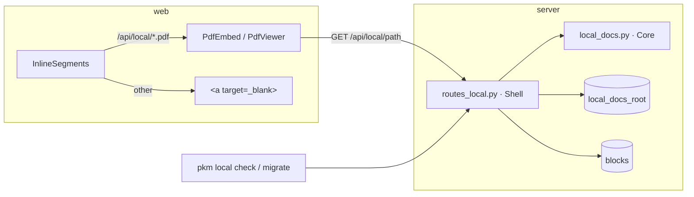

# Local document links: serve `Local copy::` files from disk

**Date:** 2026-09-21 · **Status:** draft for review

## Problem

Several hundred blocks carry a `Local copy::` attribute naming a PDF in the
readdle iCloud Drive folder. After the 2026-09-21 fix-up every such value is a
full path that exists on disk, but it is plain text: nothing in the app can
open it. Arthur wants to click the value and see the PDF, while keeping the
files where they are so the folder stays browseable and annotatable in PDF
Expert. Importing the files as content-addressed assets was considered and
deferred (two copies to keep in sync, annotations would not flow back).

## Decision summary

| Concern | Decision |
|---|---|
| Serve root | One configured directory, `local_docs_root`, pointing at `.../3L68KQB4HG~com~readdle~CommonDocuments/Documents/pkm`. Only `Papers/`, `White Papers/` and `Books/` live there; the rest of the readdle folder is never reachable. |
| Read path | Authenticated `GET /api/local/{path}` serving one regular file under the root. |
| Block text | `Local copy:: [File.pdf](/api/local/Papers/Folder/File.pdf)`. The attribute stays an attribute; the value is an ordinary markdown link whose text is the filename. No grammar change. |
| Viewer | `/api/local/*.pdf` gets the same inline `PdfEmbed` treatment as `/assets/*.pdf`. |
| Not downloaded | A file evicted by iCloud (present only as a `.File.pdf.icloud` stub) returns 503 with a clear message, after a best-effort `brctl download`. |
| Link health | `GET /api/local/check` scans every `/api/local/` link in block text and reports the ones whose file is missing or evicted. Exposed as `pkm local check`. |
| Migration | `GET/POST /api/local/migrate` plans and applies the one-off rewrite of the 563 plain-text values to link form, verifying every target exists first. Exposed as `pkm local migrate [--apply]`. Removed once run. |
| Out of scope | Folder listings, browsing the tree from the PKM, write access, offline (replica) serving of these files, importing into the asset store. |

## Architecture



`local_docs.py` (Functional Core) owns everything that can be decided without
I/O: resolving a URL path to a root-relative path and rejecting escapes,
choosing inline vs attachment by extension, building the link form of a value,
extracting `/api/local/` hrefs from block text, and turning a
`Local copy:: iCloud/Documents/...` value into its post-move relative path.
`routes_local.py` (Imperative Shell) stats files, reads blocks, calls the core,
and emits ops.

## Components

### Config

`Config.local_docs_root: Path | None`, loaded from `local_docs_root` in
`config.json`, resolved relative to `config.json`'s parent like the other
paths; absolute paths pass through. `None` (key absent) disables the feature:
every `/api/local/*` route returns 404 and the check/migrate routes return
`{"enabled": false}`. Documented in `backend.md`'s config table.

### `GET /api/local/{path:path}`

1. Percent-decode `path`; reject with 404 if it contains a NUL, is empty, or
   any segment is `.` or `..` (`local_docs.resolve_relative`).
2. `full = (root / rel).resolve()`; 404 unless `full` is inside
   `root.resolve()` and is a regular file. Symlinks that point outside the
   root fail the containment check and 404. Directories 404.
3. If `full` does not exist but `full.parent / f".{full.name}.icloud"` does:
   run `brctl download <full>` with a short timeout, ignore its outcome, and
   return **503** with body `{"detail": "not downloaded on the host",
   "path": rel}` and `Retry-After: 5`. This is the "keep downloaded" safety
   net; it should be rare once the folder is pinned.
4. Otherwise `FileResponse` with `Content-Disposition: inline` for `.pdf`,
   `.png`, `.jpg`, `.jpeg`, `.gif`, `.webp`, and `attachment` for everything
   else, plus `X-Content-Type-Options: nosniff`. MIME comes from the
   extension (`mimetypes`), never from sniffing the file, so an `.html` or
   `.svg` still downloads. `Cache-Control: private, max-age=0, must-revalidate`
   because the file can change under us, unlike a content-addressed asset.

The route is behind the same session/CLI-token auth as every other `/api/*`
route. It is the only route that reads outside the data dir; the containment
check is the load-bearing line and gets its own tests (see Testing).

`check` and `migrate` are registered before the `{path:path}` catch-all, so a
top-level file literally named `check` or `migrate` is unreachable. Both are
operator endpoints and the root only holds folders, so nothing is lost; a
test pins the ordering.

### `GET /api/local/check`

Reads every block whose text contains `/api/local/`, extracts each href,
resolves it as the file route would, and classifies: `ok`, `missing`,
`evicted`, `invalid` (fails `resolve_relative`). Response:

```json
{"enabled": true, "total": 563, "ok": 560,
 "problems": [{"uid": "…", "page": "…", "href": "/api/local/…", "status": "missing"}]}
```

`pkm local check` renders the problems as `page | status | href` lines and
exits 1 if any exist, so it can sit in the nightly backup launchd job later.

### `GET/POST /api/local/migrate` (one-off)

Plans (`GET`) or applies (`POST`) the rewrite of legacy values.

- Candidate blocks: text matches `^Local copy:: iCloud/Documents/(pkm/)?(.+\.\w+)$`
  (the `pkm/` prefix appears on the seven stray files moved on 2026-09-21).
- Target rel path: group 2. Verified to exist under the root; a block whose
  file is absent is reported and left untouched.
- New text: `Local copy:: [<basename>](/api/local/<percent-encoded rel>)`.
  Encoding uses `urllib.parse.quote(rel, safe="/")`, so spaces become `%20`
  and `'`, `(`, `)` are encoded too. The tokenizer's link rule must accept the
  result; the plan output prints three examples so this is checked before
  apply.
- Apply writes through the same op path as `POST /api/ops` (`update_text`),
  so FTS, `changes`, and sync all see the edits. Chunks of 200.
- Response lists `planned`, `applied`, `skipped_missing`.

Once run in prod and verified with `pkm local check`, the route and verb are
deleted in a follow-up commit. The spec records the format so the deletion is
safe.

### Frontend

`InlineSegments.isPdfAssetHref` becomes `isPdfHref`, true for
`/assets/…pdf` or `/api/local/…pdf` (case-insensitive extension, path only,
no query). Nothing else changes: the `link` segment already renders
`<a target="_blank">` for other hrefs, and `PdfViewer` fetches whatever href it
is given. A 503 from the route surfaces through `PdfViewer`'s existing error
fallback (`PdfFallbackLink` with note); the note text becomes
"Not downloaded on the host" when the response status is 503, "Couldn't
render this PDF." otherwise.

Offline: the replica's local API shim does not know `/api/local/`, so the
fetch fails and the fallback link renders. That is acceptable for this pass
and is stated in `sync-and-offline.md`.

### CLI

New `local` verb group in `cli/main.py` with `check` and `migrate [--apply]`
subcommands, both `--json`-capable, backed by two `PkmClient` methods. No MCP
tool: the assistant has no use for either.

## Data flow of a click

1. Block renders; tokenizer emits `attribute` + `link` segments.
2. `link` href starts with `/api/local/` and ends `.pdf` → `PdfEmbed`.
3. `PdfViewer` fetches the href with the session cookie.
4. Server resolves, contains, stats. 200 streams the file; 404 or 503 → fallback link with note.

## Error handling

| Case | Response |
|---|---|
| Path escapes root, has `..`, NUL, or is a directory | 404 (never 403: don't confirm structure) |
| File absent, no `.icloud` stub | 404 |
| File absent, `.icloud` stub present | 503 + `Retry-After: 5`, `brctl download` fired |
| Feature disabled (`local_docs_root` unset) | 404 for files; `{"enabled": false}` for check/migrate |
| Migrate target missing on disk | Block skipped and listed; nothing else blocked |

## Testing

Server (`pytest`, coverage enforced):
- `local_docs.py` pure functions: relative-path resolution table (`..`,
  encoded `..`, absolute, empty, NUL, unicode, trailing slash), inline vs
  attachment by extension, link building round-trips through
  `extract_local_hrefs`, legacy-value regex including the `pkm/` prefix.
- Route tests with a `tmp_path` root: 200 inline PDF, 200 attachment for
  `.zip`, 404 for traversal via raw and encoded `..`, 404 for a symlink
  pointing outside the root, 404 for a directory, 503 when only a `.icloud`
  stub exists (with `brctl` monkeypatched), 404 when disabled, 401 without
  auth.
- Check route: seeded blocks with ok/missing/evicted/invalid hrefs classify
  correctly.
- Migrate route: plan lists candidates and skips a missing file; apply rewrites
  text and leaves a `changes` row; re-running plans zero.

Web (`pnpm verify`):
- Unit: `isPdfHref` table; `InlineSegments` renders `PdfEmbed` for a
  `/api/local/…pdf` link and a plain anchor for `/api/local/…zip`.
- E2E: one spec that creates a block with a local link against the e2e
  server's temp root, sees the PDF frame, and deletes the block. The e2e
  server (`tests/e2e_serve.py`) gains a temp `local_docs_root` with one tiny
  PDF.

Manual, on prod after deploy: `pkm local migrate` plan, eyeball the three
examples, `pkm local migrate --apply`, `pkm local check` returns 0 problems,
click a paper on the Mac and on the iPad.

## Docs to update in the same branch

- `backend.md`: route table (three routes), config table (`local_docs_root`),
  module tree (`local_docs.py`, `routes_local.py`), and a prose note under
  Assets that this is the one route reading outside the data dir and why the
  containment check must never be loosened.
- `frontend.md`: the PDF-embed rule now covers two prefixes.
- `sync-and-offline.md`: local files are online-only.
- `cli-and-mcp.md`: `pkm local check|migrate`. Grep for any MCP/CLI verb count.
- `.claude/skills/pkm/SKILL.md`: the verbs, and the block format so sessions
  write `Local copy::` links correctly.

## Deployment notes

Add `"local_docs_root": "/Users/arthur/Library/Mobile Documents/3L68KQB4HG~com~readdle~CommonDocuments/Documents/pkm"`
to prod `config.json` before restarting; the server must be able to read that
folder (launchd runs as `arthur`, so it can). Run the migration once, then
check. The `pkm` folder is already marked keep-downloaded on the host.
