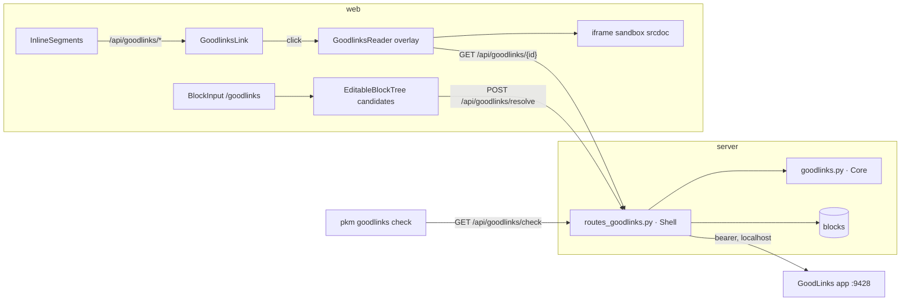

# Goodlinks links: open archived web pages from `Local copy::` notes

**Date:** 2026-09-23 · **Status:** draft for review

## Problem

Around seventy blocks note that a web page has a saved copy in GoodLinks,
Arthur's read-later app. The note is free text and inconsistent ("Local copy
in Goodlinks", "Copy in GoodLinks", "Local copy:: Goodlinks", "Saved in
GoodLinks", "(copy in Goodlinks)" inline). Nothing in the app can open the
copy. The 2026-09-21 local-docs work made `Local copy::` PDFs clickable; this
does the same for archived web pages, and adds a way to save new pages to
GoodLinks from the editor.

GoodLinks exposes a local HTTP API (`http://localhost:9428/api/v1`, bearer
token) while the app is running on the Mac. It looks links up by exact URL,
returns reader-view HTML, markdown or plaintext for a link id, searches the
library, and upserts links by URL. The iPad cannot reach that port, so the pkm
server proxies it, the way `/api/local/` proxies the iCloud folder.

What the data shows (sampled from a prod DB copy on 2026-09-23):

- The note is almost always its own child block under the block that holds
  the link; sometimes the previous sibling; sometimes inline in parentheses.
- Resolving the nearest URL (parent, then previous sibling) by exact match
  found 62 of 68 notes. Misses were a substack URL saved with tracking
  parameters, and pages saved under an archive.is URL rather than the
  original.
- GoodLinks' reader HTML keeps the text but its images still point at the
  original hosts. Text is archived; images are not.

## Decision summary

| Concern | Decision |
|---|---|
| Block text | `Local copy:: [Goodlinks](/api/goodlinks/<id>)`. The attribute stays an attribute; the value is an ordinary markdown link. The renderer keys on the href prefix only, so link text is free and an inline `([copy in Goodlinks](/api/goodlinks/<id>))` works too. No grammar change. |
| Linking new notes | A `/goodlinks` slash command resolves the nearest URL through the server and inserts the attribute. If GoodLinks does not have the URL it saves it, marked read, and links the new id. |
| Viewer | A full-screen reader overlay, like the image overlay: title, original link, saved date, Close, and the article body in a sandboxed iframe. |
| Third-party HTML | Two barriers: the server sanitises with an allowlist (nh3) and the client renders only inside `<iframe sandbox srcdoc>`. |
| Config | Key file `goodlinks_api_key_file` (default `../goodlinks_key`, like the OpenAI key), `GOODLINKS_API_KEY` env as fallback for dev, `goodlinks_api_url` defaulting to the documented localhost port. No key means the feature is off. |
| Link health | `GET /api/goodlinks/check` scans block text for the href prefix and reports ids GoodLinks no longer knows. Exposed as `pkm goodlinks check`. |
| Migration | A throwaway session script (not committed) resolves the existing notes with `save: false`, prints the full plan, and writes through `pkm batch` after Arthur confirms. Unresolved notes are listed for hand fix-up with `/goodlinks`. |
| Docs | A new `docs/architecture/goodlinks.md` holds the mechanism; the other architecture files get one-line pointers, not prose. |
| Out of scope | Highlights, tags, author and word count in the reader; caching article content; offline (replica) serving; browsing the GoodLinks library; opening in the GoodLinks app; rewriting the existing PDF docs. |

## Architecture



`goodlinks.py` (Functional Core) owns everything decidable without I/O:
candidate URLs from one URL, the sanitiser allowlist and anchor rewrite, the
href builder and extractor, and the response payload shapes.
`routes_goodlinks.py` (Imperative Shell) talks to GoodLinks over httpx2,
reads blocks, calls the core, and maps failures to status codes.

## Components

### Config

`Config.goodlinks_api_key_file: Path` (default `../goodlinks_key` relative to
`config.json`, like `openai_api_key_file`) and `Config.goodlinks_api_url: str`
(default `http://localhost:9428/api/v1`). The key is read once at startup:
file first, then `GOODLINKS_API_KEY`, else `None`. `None` disables the
feature: every `/api/goodlinks/*` route returns 404 except check, which
returns `{"enabled": false}`. Documented in `backend.md`'s config table.

### Core: `goodlinks.py`

- `GOODLINKS_PREFIX = "/api/goodlinks/"`, `goodlinks_href(id)`,
  `extract_goodlinks_hrefs(text)` mirroring `local_docs.py`. Ids are 32 hex
  characters; anything else is `invalid`.
- `candidate_urls(url) -> list[str]`: the URL as written, then with the query
  string and fragment stripped if that changes it. Deduplicated, order kept.
- `search_match(candidate, results) -> Link | None`: accepts a search result
  only when exactly one result's URL starts with the candidate. Two or zero
  is a miss; the caller never guesses.
- `sanitize_article(html) -> str`: nh3 with an explicit allowlist: `p`,
  `h1`–`h6`, `ul ol li`, `blockquote`, `pre code`, `em strong b i`, `a`,
  `img`, `figure figcaption`, `table thead tbody tr th td`, `br hr`, `sup
  sub`. Attributes: `a[href title]`, `img[src alt]`, `td/th[colspan
  rowspan]`. URL schemes `http https` only; `javascript:` and `data:` are
  dropped with their attribute. Every anchor gains `target="_blank"
  rel="noreferrer noopener"` after sanitising. The allowlist is the first of
  two barriers between third-party HTML and the app; the iframe sandbox is
  the second. Neither may be widened for convenience.

### `POST /api/goodlinks/resolve`

Body `{"url": str, "save": bool}`. Response `{"id", "title", "url",
"addedAt", "created": bool}`.

1. For each candidate from `candidate_urls`, `GET /links?url=` on GoodLinks.
   First 200 wins, `created: false`.
2. Otherwise `GET /links?search=<url as written>&limit=5` and apply
   `search_match` to the first candidate. A match returns `created: false`.
3. Otherwise, if `save` is false, 404 `{"detail": "not in Goodlinks"}`.
4. Otherwise `POST /links` with `{"url": <as written>, "read": true}` and
   return the created link with `created: true`. Lookup always runs first so
   an existing link never has its read date bumped by the upsert.

GoodLinks rejecting the URL (4xx from its `POST /links`) is a 422 carrying
GoodLinks' error text.

### `GET /api/goodlinks/{id}`

Validates the id shape (404 otherwise), then `GET /links/{id}` and `GET
/links/{id}/content?format=html` on GoodLinks (content download left at its
default, so an article saved seconds ago is fetched now). Response:

```json
{"id": "…", "title": "…", "url": "https://…", "addedAt": "2025-02-13T19:51:00Z",
 "html": "<sanitised reader html>"}
```

`Cache-Control: private, no-store`. GoodLinks is local and fast, and the
article can change if Arthur re-saves it.

### `GET /api/goodlinks/check`

Reads every block whose text contains the prefix, extracts hrefs, and
classifies each: `ok` (GoodLinks returns the link), `missing` (GoodLinks 404),
`invalid` (bad id shape). Same response shape as `/api/local/check`:

```json
{"enabled": true, "total": 68, "ok": 67,
 "problems": [{"uid": "…", "page": "…", "href": "/api/goodlinks/…", "status": "missing"}]}
```

Registered before `{id}` so `check` is never taken as an id (it fails the hex
rule anyway; a test pins the ordering).

`pkm goodlinks check` renders `page | status | href` lines and exits 1 on
problems, matching `pkm local check`. One `PkmClient` method. No MCP tool.

### Failure mapping

| Case | Server | Client |
|---|---|---|
| Feature not configured | 404; check `{"enabled": false}` | link renders as a plain anchor |
| GoodLinks app not running (connection refused, timeout) | 503 `{"detail": "Goodlinks is not running on the host"}` | "Goodlinks is not running on the Mac" |
| Id deleted in GoodLinks | 404 | "No longer in Goodlinks" |
| GoodLinks rejects a save | 422 with its message | "Goodlinks refused the URL" |
| Resolve miss with `save` false | 404 | migration lists it |
| iPad offline (replica shim does not know the route) | fetch fails | "Needs the server" with original link |

Every error state in the reader keeps Close working and shows the original
link when the metadata is known.

### Frontend: link and reader

`InlineSegments`' link case gains a branch beside the PDF one: an href
starting with `/api/goodlinks/` renders `GoodlinksLink`, an anchor-styled
button whose click stops propagation (interactive island inside
`.block-text`, like the deferred PDF Open button) and mounts the reader.
Nothing is fetched until then.

`GoodlinksReader` is a full-screen overlay portalled to body, following
`ImageOverlay`: body scroll lock, Escape closes in the capture phase, Tab
pinned to Close, focus restored to the trigger on unmount. It fetches
`/api/goodlinks/{id}` once and renders:

- Bar: Close, the article title, and a line with "original" (external link,
  `target=_blank rel=noreferrer`) and "saved 13 Feb 2025" from `addedAt`.
- Body: `<iframe sandbox="allow-popups allow-popups-to-escape-sandbox"
  srcdoc=…>`, filling the overlay below the bar and scrolling internally.
  The two flags exist only so the article's own links open in a new tab; no
  scripts, no same-origin, no forms. `srcdoc` is the payload's `html`
  wrapped in a minimal document with an injected stylesheet: readable
  measure, system font stack, `img { max-width: 100% }`, and light or dark
  colours chosen from the app's current theme at mount. This is the one
  place the app renders HTML it did not generate, and it only ever receives
  server-sanitised HTML inside the sandbox. A comment at the top of the
  component says so.

States: loading (bar with title placeholder, spinner), ok, and the error
strings in the failure table.

### Frontend: `/goodlinks` slash command

Appended to `SLASH_COMMANDS` as `{ name: "goodlinks", label: "link to
goodlinks copy" }`, following the `/upload` shape because it needs the tree
and the network:

1. `BlockInput.pick` strips the trigger, records the offset, blurs the block
   (flushing the draft), and calls `onRequestGoodlinks(uid, at)`.
2. `EditableBlockTree` gathers candidate URLs in order from this block's
   text, the parent block, then the previous sibling (`goodlinksCandidates`,
   a pure function in `outline/`). The first URL found is sent; none means
   the notice "No URL nearby".
3. It calls `POST /api/goodlinks/resolve` with `save: true` and splices
   `Local copy:: [Goodlinks](/api/goodlinks/<id>)` at the recorded offset
   through the same draft splice the upload path uses. The edit rides the
   key-edit path, never the tree directly.
4. Notices under the block, dismissed on the next edit: "Saved to Goodlinks"
   when `created`; "Goodlinks is not running"; "Goodlinks refused the URL".

If the block already holds text such as "Local copy in Goodlinks", the
command inserts at the trigger and leaves that text alone. Tidying is the
user's; the command does not guess at rewrites.

### One-off migration (scratchpad script, not committed)

Run once against prod after deploy, from a session, the way the PDF fix-up
was. The script reads a DB copy, plans, prints, and writes through `pkm
batch` in chunks after Arthur confirms. Never writes without confirmation and
never saves to GoodLinks.

- Candidate blocks: text matches `goodlinks` case-insensitively, is not a
  TODO, and does not already contain the prefix.
- URL source: the block's own text, the parent, the previous sibling, in
  that order; resolved with `save: false`.
- Whole-block note (the block is only the phrase, with optional `Local
  copy::`/`Local copy:` prefix and trailing space): new text is `Local copy::
  [Goodlinks](/api/goodlinks/<id>)`.
- Inline phrase in a longer block (`(copy in Goodlinks)`, `(local copy in
  Goodlinks)`, `(saved in GoodLinks)`): only the phrase inside the
  parentheses is replaced by `[copy in Goodlinks](/api/goodlinks/<id>)`; the
  rest of the text is preserved byte for byte.
- The plan prints page, old text, new text, and the matched GoodLinks title
  for every block so a wrong match (an archive.is copy of a different
  article, say) is visible before apply.
- Unresolved and no-URL blocks are listed and left untouched.
- `pkm goodlinks check` must report zero problems afterwards.

## Data flow of a click

1. Block renders; tokenizer emits `attribute` + `link` segments.
2. `link` href starts with `/api/goodlinks/` → `GoodlinksLink` button.
3. Click → `GoodlinksReader` mounts, fetches `/api/goodlinks/{id}`.
4. Server asks GoodLinks for metadata and HTML, sanitises, returns one JSON.
5. Reader shows the bar and fills the sandboxed iframe's `srcdoc`.

## Testing

Server (`pytest`, coverage enforced):
- Core tables: `candidate_urls` (plain, with query, with fragment, both,
  already stripped), `search_match` (one prefix hit, two hits, zero, wrong
  prefix), href build and extract round trip, id shape.
- `sanitize_article` against a hostile fixture: `<script>`, `onerror=`,
  `style=`, `<iframe>`, `<form>`, `javascript:` and `data:` hrefs, an ``
  with a `data:` src, nested allowed markup. Assert each hostile part is gone,
  allowed structure survives, and every anchor carries the new-tab and
  no-referrer attributes.
- Routes with a fake GoodLinks via an httpx2 mock transport: resolve hits on
  exact, on stripped query, on single-result search; saves with `read: true`
  only after a full miss; 404 with `save` false; 422 on GoodLinks rejecting a
  save. Content route returns the combined payload with sanitised HTML.
  Connection refused → 503; GoodLinks 404 → 404; unconfigured → 404 and
  check disabled; unauthenticated → 401. Check classifies seeded blocks,
  and `check` is not routed as an id.

Web (`pnpm verify`):
- Unit: `isGoodlinksHref` table; `InlineSegments` renders `GoodlinksLink` for
  the prefix and a plain anchor for a look-alike; the button stops
  propagation; `GoodlinksReader` renders loading, ok, 503, 404 and network
  failure from mocked fetches; `srcdoc` contains the payload HTML and the
  sandbox attribute is exactly the two popup flags; Escape closes and focus
  returns; `goodlinksCandidates` ordering table; the splice inserts at the
  recorded offset through the draft path.
- E2E: `tests/e2e_serve.py` starts a stub GoodLinks on a spare port seeded
  with one article and points `goodlinks_api_url` at it. One spec types
  `/goodlinks` in a child block under a link, sees the inserted attribute,
  clicks it, sees article text inside the iframe, closes with Escape, and
  deletes the block. A second saves a URL the stub does not know, sees "Saved
  to Goodlinks", and deletes the block.

Manual, on prod after deploy: create the key file, restart, run the
migration plan, eyeball examples, apply, `pkm goodlinks check` returns zero
problems, open an article on the Mac and on the iPad, run `/goodlinks` on a
fresh link from the iPad.

## Docs to update in the same branch

- New `docs/architecture/goodlinks.md`: the mechanism end to end (block
  form, routes, resolve-or-save, sanitiser and sandbox, reader, slash
  command, failure table), with the diagram above. This is where detail
  lives; the files below get one line each pointing here.
- `overview.md`: add the new file to the architecture file table with a
  one-line summary.
- `backend.md`: route table (three routes), config table (two keys), module
  tree (`goodlinks.py`, `routes_goodlinks.py`).
- `frontend-rendering.md`: one line under links: `/api/goodlinks/` hrefs open
  the reader, see `goodlinks.md`.
- `frontend-editor.md` and `docs/keyboard.md`: the slash command, appended at
  the end of the table.
- `sync-and-offline.md`: GoodLinks content is online-only, next to the local
  files line.
- `cli-and-mcp.md` and `docs/cli.md`: `pkm goodlinks check`.
- `.claude/skills/pkm/SKILL.md`: the verb and the block format so sessions
  write `Local copy::` Goodlinks links correctly.
- `SECURITY.md`: the first route serving third-party HTML, the two barriers,
  and that neither may be widened.
- `openapi.json` and generated types regenerate with the new routes.

## Deployment notes

Write the GoodLinks API token (Settings → API in the app) to
`~/.config/pkm/goodlinks_key` before restarting; the launchd service has no
environment variables, so the file is the only source in prod. GoodLinks
must be running on the Mac for any of this to work; when it is not, the app
says so rather than failing silently. Run the migration once, then the check.
