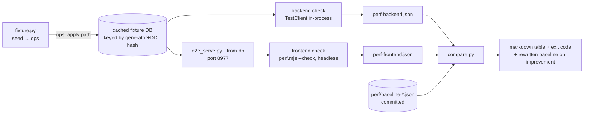

# Performance regression checks — design

Date: 2026-09-26 · Status: approved design, awaiting plan

## Intent

Every change is checked for performance regressions against a committed
baseline before it goes to human review: backend checks after any server, DB
or API change, frontend checks after any `web/` change. A regression is first
reviewed by the session that caused it — read the changed code, look for the
cause, fix it — and only reaches Arthur if it survives that. Improvements
ratchet the baseline down so they can't silently erode later.

What Arthur said vs what this design assumes:

| Said | Assumed (confirmed during brainstorming) |
|---|---|
| Backend check after backend/db/api changes; frontend after frontend changes | Runs locally on this Mac as part of verification, not CI |
| Baseline first | Baselines are committed and move only via the compare rules below |
| Regressions get reviewed — session reviews its changed code and looks for improvements before pushing to human review | A regression flags, it does not hard-block a commit |
| Exact match is too strict; improvements update the baseline | Only worsening is a regression; improvement rewrites the baseline |
| Search is a key place slowdowns creep in | Search gets several scenarios on each side, not one |

## Non-goals

- Not CI, not a git hook, not part of `pytest` or `pnpm verify` (prod-scale
  seeding would slow every run and fight the coverage gate).
- Not a replacement for the investigation harness in `web/tooling/perf/`
  (headed runs, `cpu%`, `ws-probe`, scenarios C/D/E stay as they are).
- Bundle size is not tracked here: `web/tooling/budgets.json` already fails
  the build.

## Shape



## Components

| Unit | Location | Pattern | Does |
|---|---|---|---|
| Fixture generator | `server/tooling/perf/fixture.py` | Functional Core | Pure `generate(seed) -> list[Op]`; deterministic prod-shaped graph |
| Fixture builder | `server/tooling/perf/build_fixture.py` | Imperative Shell | Applies ops through the real ops-apply path into a DB under a gitignored cache dir; reuses it when the hash of generator source + `pkm.schema.DDL` matches |
| Backend check | `server/tooling/perf/check_backend.py` | Imperative Shell | Copies the cached DB, runs the scenario list via `TestClient`, writes `perf-backend.json` |
| Statement counter | `server/tooling/perf/trace.py` | Imperative Shell | Installs `set_trace_callback` on every connection the app opens for the duration of one request; collects distinct statements for `EXPLAIN QUERY PLAN` |
| Frontend check | `web/tooling/perf/perf.mjs --check` | script | Runs the gated scenario subset headless, writes `perf-frontend.json` |
| e2e server option | `server/tests/e2e_serve.py` | Imperative Shell | New option: start from a copy of a given DB instead of an empty one |
| Compare | `perf/compare.py` (core) + `perf/compare_cli.py` (shell) | Core + Shell | Applies the rules below to one result file vs one baseline file; returns a verdict, a table, and the new baseline |
| Entry point | `perf/check.sh [backend\|frontend\|auto]` | script | Picks sides from the diff, builds the SPA when `web/` changed, runs checks, runs compare |
| Baselines | `perf/baseline-backend.json`, `perf/baseline-frontend.json` | data | Committed |

Result and baseline files share one shape:

```json
{
  "commit": "630e4c8",
  "fixture_hash": "…",
  "scenarios": {
    "backlinks/hub": {
      "counts": {"statements": 4, "rows": 212, "bytes": 18433, "full_scans": 0},
      "timings_ms": {"median": 11.2}
    }
  }
}
```

## Fixture

Deterministic from a seed; shaped after prod (2026-09-26: ~56k blocks, 4.4k
pages, largest page 1,222 blocks):

- ~50k blocks over ~4k pages; one ~1,200-block page; a spread of mid-size pages
- 365 journal days
- `[[links]]`, `#tags`, `((block refs))`, TODOs at plausible rates
- a handful of hub pages with hundreds of backlinks
- text vocabulary chosen so search has common terms (hundreds of hits), rare
  terms (a few), prefix-able words, and phrases

No prod content is read or copied; nothing personal enters the repo.

Two different keys, on purpose:

- **Cache key** = hash of generator source + `pkm.schema.DDL`. Decides when
  the cached DB is rebuilt; a schema change rebuilds it.
- **`fixture_hash`** (in result/baseline files) = hash of generator source
  only. Decides whether two runs are comparable. A schema or query change
  keeps the same `fixture_hash`, so it is measured against the baseline —
  which is the point: schema changes are prime regression sources.

## Scenarios

### Backend (in-process, one warm-up then N timed repeats)

| Area | Scenarios |
|---|---|
| Pages | big page, hub page, journal day, journal window |
| Links | backlinks on a hub, unlinked refs, `block-refs` |
| Search | common term, rare term, prefix, phrase, many-hit term, title-heavy match, asset-search filters |
| Lists | titles, todos, changed, query, sidebar |
| Sync | snapshot, changes since N |
| Writes | ops batch: 1 edit, 50-op paste, move subtree; rename a hub page |

Each write scenario runs against a fresh copy of the fixture DB.

Per scenario — counts: SQL statements executed, rows returned, response
bytes, full-table scans (`SCAN <table>` without an index in `EXPLAIN QUERY
PLAN` of any distinct statement). Timing: median wall time.

### Frontend (headless, fixture DB served on 8977)

| Id | Scenario | Counts | Timing |
|---|---|---|---|
| H | cold load, empty replica | requests, bytes fetched, snapshot pages pulled | replica ready |
| H' | warm load (replica + SW warm) | requests, `/api/sync/changes` pulls | first outline paint |
| A/B | idle on big page / journal | timers armed, fetches, WS opens, long tasks | — |
| F | typing on big page | forced layouts, DOM mutations outside the block, fetches (per keystroke) | — |
| J | journal all days mounted, typing | React commits, re-rendered fibers (per keystroke) | — |
| I | journal scroll | `GET /api/page` per day | — |
| K | outline drag on the large page | commits/s, forced layouts | dragover handler time |
| S | top-bar search: type → results → arrow → open | fetches per query, commits per keystroke | keystroke to results rendered |

## Compare rules

| Change vs baseline | Verdict |
|---|---|
| A count goes up | regression |
| A timing more than doubles, and still does on one automatic re-run | regression |
| A metric goes down | improvement: baseline rewritten with that value |
| New scenario or metric | recorded into the baseline |
| Scenario missing from the result | reported as lost coverage (regression) |
| `fixture_hash` differs from baseline | refuse: re-record the baseline at the merge base with the branch's generator (`perf/check.sh --rebaseline`, which runs it in a temporary worktree at the merge base), then compare |

Exit code non-zero on any regression. Output is a markdown table naming
scenario, metric, baseline, now — e.g. `backlinks/hub  statements  4 → 204`.
The doubling threshold lives in `compare.py` as a named constant; prose in
skills and `AGENTS.md` describes the rule qualitatively (a timing that
clearly worsened, not noise), not the number.

## Workflow

```mermaid
flowchart TD
  D[change done, tests green] --> W{perf/check.sh auto}
  W --> C[compare vs committed baseline]
  C -->|no regression| U[commit any baseline improvements with the change] --> Done[review / push]
  C -->|regression| R[self-review: read the diff along the regressed path,<br/>find the cause, fix] --> C2[re-run]
  C2 -->|fixed| U
  C2 -->|still worse| H[stop: table + findings to Arthur]
  H -->|accepted| A[re-record baseline;<br/>reason in commit message] --> Done
  H -->|rejected| R
```



Side selection for `auto` uses `git diff --name-only main`: `server/`,
schema or contracts paths → backend; `web/` → frontend; both when both match.

Wiring:

- `AGENTS.md` Testing section: a short rule — run `perf/check.sh auto` before
  considering a change verified; on regression, review your own change first
  and only then escalate.
- `/verify` skill: a "Performance" section with the recipe and how to read
  the table.
- SDD final whole-branch review: the perf table must be present in the
  review package.
- `web/tooling/perf/README.md`: note check mode and that `baselines/` there
  is investigation history, not the gate.

## Bootstrapping

1. Build the fixture and both check scripts.
2. Record the first baselines at current `main` and commit them.
3. Sanity: run the check twice on the same commit — both must report no
   regression and no improvement (proves the counts are deterministic and
   the timing threshold absorbs noise). Any count that differs between two
   identical runs is not gateable and gets moved to timings or dropped.

## Errors

- Server fails to boot / scenario throws → the check fails loudly naming the
  scenario; it never writes a partial result file.
- Port 8977 in use → fail with the port named; never fall back to 8974/8975.
- Missing baseline file → first run writes it and says so (bootstrap path).

## Testing

- `compare.py` (core): unit tests for every row of the compare-rules table.
- `fixture.py` (core): same seed → identical ops; shape assertions (block
  count range, hub backlink counts, largest page size).
- `trace.py`: a test that a known route's statement count is captured.
- The perf tooling lives outside `server/src`, so it doesn't count toward
  the 95 % coverage gate; its tests run under `server/tests` like the rest.
