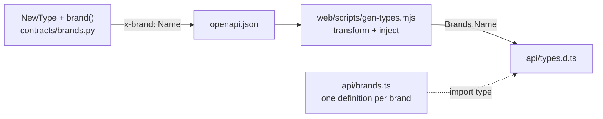

# Server NewTypes reach the web as brands (pkm-85x3)

Approved by Arthur on 2026-10-01, with approach A: the generated types reference hand-written brand definitions.

## Goal

When a server field is a branded `NewType` (`Sha256Hex` now; `BlockUid`, `PageId`, `NormalizedTitle`, `CanonicalTitle` and others later), `web/src/api/types.d.ts` carries the brand without a hand-written alias per field. The aliases this replaces are in `web/src/api/ops.ts`: `Omit<components["schemas"]["UpdateTextOp"], "base_text_hash"> & { base_text_hash?: Sha256Hex | null }`, and the same for `DeleteOp.base_subtree_hash`. pkm-thee builds on this to brand the web.

## Constraints

- A Python `NewType` adds nothing to JSON Schema, so each brand has to put a marker into `openapi.json` on purpose.
- Pydantic validation, field constraints (`min_length`, `pattern`, …) and serialisation must not change.
- `openapi.json` stays the contract that `test_openapi_sync.py` checks. Regeneration is still `openapi_dump` followed by `pnpm gen-types`.
- Subtype brands must work: `CanonicalTitle` can be used where `NormalizedTitle` is expected, but not the reverse.
- At the end, pyrefly, ruff, tsc and the test suites are clean, with no ignore comments.

## Design



### 1. Server marker: `server/src/pkm/contracts/brands.py`

This is a Functional Core module. `brand(nt: object) -> None` attaches two pydantic hooks to the `NewType` object:

- `__get_pydantic_core_schema__` returns `handler(nt.__supertype__)`, so validation is the underlying type's;
- `__get_pydantic_json_schema__` adds `"x-brand": nt.__name__` to the schema the handler returns.

Call sites declare the type normally and tag it in a separate statement. pyrefly stops treating the result as a type when the `NewType(...)` call is wrapped in another call, and it rejects `Annotated[...]` as the `NewType` supertype.

```python
Sha256Hex = NewType("Sha256Hex", str)
brand(Sha256Hex)
```

Fields keep their `Field(...)` constraints. A probe on 2026-10-01 confirmed the following:

- for `X | None`, `x-brand` lands on the non-null branch of the `anyOf`, beside `minLength` and `maxLength`;
- for `list[X]`, it lands on `items`;
- for an `int` NewType, it lands beside `"type": "integer"`;
- constraint and type errors are raised exactly as before;
- pyrefly still rejects a plain `str` where the NewType is expected.

### 2. Generator: `web/scripts/gen-types.mjs`

`pnpm gen-types` runs this script in place of the `openapi-typescript` CLI. The script calls openapi-typescript's Node API (7.13) and writes `src/api/types.d.ts`, with two options:

- `transform(schema)`: when `schema["x-brand"]` is set, return a type reference to `Brands.<name>`;
- `inject`: `import type * as Brands from "./brands";`.

Every other schema object generates exactly as it does now.

The script exits non-zero if an `x-brand` value is not an identifier, or if the schema it sits on has a `type` other than `string` or `integer`. A malformed marker therefore can't generate silently.

### 3. Web definitions: `web/src/api/brands.ts`

This file is the only place a brand is defined:

```ts
export type Sha256Hex = string & { readonly __brand: "Sha256Hex" };
```

`replica/sha256.ts` keeps its runtime helpers and re-exports the type from `api/brands.ts`, so its importers don't change.

Subtype brands use a second key. Two different literal `__brand` values would intersect to `never`:

```ts
export type NormalizedTitle = string & { readonly __brand: "NormalizedTitle" };
export type CanonicalTitle = NormalizedTitle & { readonly __canonical: true };
```

This spike records the pattern in the file's header comment. pkm-1v8b and pkm-thee add the title types.

When the server marks a brand that `brands.ts` doesn't export, the generated `Brands.<name>` reference fails `tsc`. The fix is to add the definition.

### 4. Proof on `Sha256Hex`

- Add `brand(Sha256Hex)` in `contracts/ops.py`, then regenerate `openapi.json` and `types.d.ts`.
- In `api/ops.ts`, `UpdateTextOp` and `DeleteOp` become plain `components["schemas"][…]` aliases, the same as the other ops.
- Other consumers of `Sha256Hex`, such as `batch.py` and the web's hash helpers, keep compiling unchanged.

## Testing

- **Server, schema:** the dumped OpenAPI has `x-brand: "Sha256Hex"` on the string branch of `UpdateTextOp.base_text_hash` and `DeleteOp.base_subtree_hash`, still with `minLength` and `maxLength` 64.
- **Server, `brand()`:** a branded field accepts and rejects exactly what the unbranded one does, `model_dump` is unchanged, and the brand works inside `X | None` and `list[X]`.
- **Generator:** a unit test feeds the transform small schemas, with and without `x-brand`, and a malformed marker, and checks the output and the exit or throw.
- **Web, type-level:** an `@ts-expect-error` probe shows a plain `string` can't be assigned to `UpdateTextOp["base_text_hash"]`, while a `Sha256Hex` can. tsc fails on an unused suppression, so the probe can't silently stop checking anything.
- **Full suites:** `pytest -q`, pyrefly, ruff and `CI=true pnpm verify`, all clean.

## Docs

- `docs/architecture/backend.md` (contracts): how a NewType becomes a web brand, in a short note or a row next to the existing contract material.
- `docs/architecture/frontend.md` (api module): `api/brands.ts` is the one definition site, and `gen-types.mjs` is what generates `types.d.ts`.
- Anywhere that documents `gen-types` or the regen steps: grep for `openapi-typescript` and `gen-types`.

## Out of scope

- Branding any type other than `Sha256Hex`, and minting brands on the web. Those belong to pkm-bvad, pkm-1v8b, pkm-9km9 and pkm-thee.
- Runtime validation of server responses on the web. Values from the server are trusted as branded, as the contract says.

## Order

This work starts after pkm-38w9 merges, because both regenerate `types.d.ts`, and `web/package.json` changes here.
