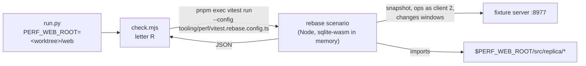

# Perf scenario: feed windows applied over pending batches

Bean: pkm-p5t6. Approved in conversation 2026-10-06 (approach B: a Node
scenario on the frontend side, not a browser scenario with a production hook).

## Goal

`perf/check.sh frontend` measures what one feed window costs the replica when
optimistic batches are pending: `dropAppliedPending`, `rewind("pending")`, the
upserts, `replayPending` (op-by-op replay under savepoints, recording afresh)
and, at the head, `rewind("all")` and `dropStrandedLocalPages`. No current
scenario applies a window over a pending queue, and the frontend gate has no
way to count SQLite work in the replica.

The scenario gates on counts, as the backend scenarios do, so that a later fix
of a known cost (rewind step 1 re-tokenizing FTS for unchanged text; the
unindexed `replay_log.pre_page_id` and `replay_log_refs.target_page_id` reads)
shows as an improvement, and a regression in the rebase path fails the gate.

## Non-goals

- Fixing either known cost. Each is a separate change measured against the
  baseline this one records.
- Any product change. Nothing in `web/src/` changes.
- Timing metrics. Counts say what the rebase does; a timing would add noise
  without adding a decision.

## Shape

### Where it runs

- New scenario letter **R** in `check.mjs`, in its own context group:
  `_CONTEXT_GROUPS` in `run_core.py` gains `"R"`, `LETTERS` and the default
  `--only` list gain `R`. It needs no browser context; `main()` runs it after
  the browser groups.
- For R, `check.mjs` runs a subprocess:
  `pnpm exec vitest run --config tooling/perf/vitest.rebase.config.ts`,
  passing the fixture server's base URL and an output path in the
  environment, and merges the JSON it writes into `scenarios`. A non-zero
  exit fails the frontend run (exit 2, like any scenario error).
- `vitest.rebase.config.ts` stands alone, like `vitest.props.config.ts`
  (node environment, no jsdom setup file, one fork), and includes only the
  scenario file under `web/tooling/perf/`.
- `run.py` passes `PERF_WEB_ROOT=<worktree>/web` to `check.mjs`. The scenario
  imports the replica modules from `$PERF_WEB_ROOT/src`, so a merge-base run
  measures the base's replica code with the branch's harness — the same
  split as the browser scenarios (branch `check.mjs`, base `web/dist`). The
  merge-base worktree already has `node_modules`, since its SPA is built
  there. A base whose handler surface changed incompatibly fails the
  merge-base run loudly rather than counting zero.

### Entry points

The scenario drives the worker's RPC surface, not `apply.ts` directly:
`buildHandlers({ openDb, nowMs, newBatchId })` from `workerHandlers.ts`, with
`openDb` returning a fresh in-memory sqlite-wasm database (wrapped by
`wrapSqlite`, with the worker's pragmas), a fixed `nowMs`, and fixed batch
ids. It calls the handlers `replicaSync` calls: `init`, `applySnapshot`,
`enqueue`, `pendingBatches`, `applyChanges({ feed, expectedPendingIds })`.
This exercises the pending-cover check and `droppable` as in the app, and is
the surface least likely to change between a branch and its merge base.

The scenario initializes its own sqlite-wasm module (from the same
`node_modules` as the imported source) so it can reach `capi` for tracing.

### Data flow

1. `GET /api/sync/snapshot` once (logged in with the e2e password, as
   `harness.mjs` does).
2. Produce three windows, each fetched once. For each: `POST /api/ops` one
   batch as a second client (fixed `client_id` and batch id), then
   `GET /api/sync/changes?since=<cursor>` with no `pending` ids (the pending
   batches never reach the server).
   - **edit**: one text edit of a block the pending queue does not touch.
   - **paste**: about 50 new blocks under one parent.
   - **overlap**: a text edit of a block a pending batch also edits, and a
     move of a block under a parent the pending queue touched.
3. Measurement pass, run twice, each on a fresh in-memory replica:
   `init` → `applySnapshot(snapshot)` → `enqueue` the pending queue →
   for each window in order: `pendingBatches` → `applyChanges`, counting only
   inside the `applyChanges` call.
4. The two passes must agree on every count; otherwise the scenario fails as
   unstable (the backend's `UnstableCountError` rule).

The pending queue is about six batches, built from fixture landmarks on the
big page: block creates, moves, text edits, and a delete of a block with a
subtree of about 20 blocks. Its exact contents are fixed in the scenario
source; the plan names them.

Windows written before the scenario's snapshot (F's typing save) are not in
any window, since every window is fetched from the snapshot's cursor onward.
So R's counts do not depend on which other groups ran first.

### Metrics

One scenario per window: `R/rebase-edit`, `R/rebase-paste`,
`R/rebase-overlap`. Every metric is `exact`.

| Metric | Counts |
|---|---|
| `statements` | top-level statements, from `sqlite3_trace_v2` `SQLITE_TRACE_STMT` |
| `trigger_statements` | trace lines starting `--` (trigger bodies, FTS5 internals), as on the backend |
| `vm_steps_k` | progress-handler ticks, one per `PROGRESS_N` VM instructions |
| `full_scans` | over each distinct traced top-level statement, `EXPLAIN QUERY PLAN` rows `SCAN <table>` with no `USING` on a real table (not a virtual table, CTE or `sqlite_` table) |

`full_scans` uses a small JS port of `sqlplan.full_scans` and its alias
resolution. A traced statement that `EXPLAIN QUERY PLAN` cannot plan fails the
run rather than counting as zero, as on the backend. `PROGRESS_N` matches the
backend's value.

## Testing

- A vitest unit test for the counter module: the trace hook counts top-level
  and trigger statements against a toy schema with a trigger; the progress
  hook ticks; the scan classifier handles `SCAN t`, `SCAN t USING INDEX`,
  aliases, virtual tables and CTEs.
- A mutation check before recording the baseline: drop `idx_replay_log_key`
  from the scenario's replica; `full_scans` or `vm_steps_k` must move.
- `perf/check.sh frontend --bootstrap` on a quiet machine records the
  baseline; five runs agreeing is the stability evidence. The baseline is
  committed with the scenario.

## Docs

- `performance-checks.md`: the frontend scenario table, the context-group
  table, the merge-base "comes from" table (`$PERF_WEB_ROOT/src`), the
  "Extending the gate" row for a frontend scenario, and the determinism
  table (fixed `nowMs`, batch ids, two-pass agreement).
- `web/tooling/perf/README.md`: the new files.
