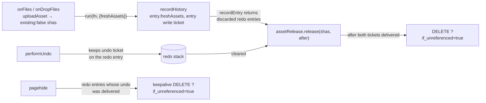

# Undoing an upload deletes the file once redo is gone

> **Superseded (2026-10-08, pkm-qibv).** Arthur reversed the timing: undoing an
> upload now deletes the file as soon as the undo is delivered, and clears the
> redo stack. The server's conditional delete and `freshAssets` survive; the
> redo-clear release, `pagehide` release and per-tab upload clock were removed.

Bean: pkm-w4ts. Approved in conversation 2026-10-07 (approach A: the client
tracks candidates, the server does a conditional delete).

## Goal

Undoing an upload (Cmd-Z) also deletes the uploaded file from the asset store
when nothing references it any more. Today the block text goes but the file
stays, an orphan only the `/files` orphan filter finds.

Every upload path that edits the outline is covered: `/upload`, paste, a file
dropped onto the focused block's textarea (all `useOutline.onFiles`), a
file dragged onto the page (`useOutline.onDropFiles`) and the phone
composer's photo (`Composer` → `useOutline.appendBlock`).

## Non-goals

- Deleting a file when its block is deleted by hand, or by anything other than
  undoing the upload that created it. That still leaves the file, as today.
- Any UI for the deletion: it is silent.
- Guaranteed cleanup. Offline, a failed request or a tab closed before the
  undo reached the server leave the orphan; `/files` still finds it.
- Uploads outside the outline (`/files`, CLI, MCP).

## The rule

A file is a **candidate** exactly while the history entry that created it sits
on the redo stack. Redo replays that entry's text, which still names the file,
so the file must survive as long as redo is possible.

| Moment | Effect on candidates |
|---|---|
| Undo of an entry with fresh assets | they become candidates |
| Redo of that entry | they stop being candidates |
| A new edit clears the redo stack (`recordEntry`) | every discarded entry's candidates are released: conditional delete, after delivery (below) |
| `HISTORY_CAP` trims the undo stack | nothing: undo-stack entries have not been undone, their files are referenced |
| `pagehide` (tab close, reload) | best-effort: keepalive conditional delete for each redo entry whose undo the server already acknowledged |

**Fresh** means the upload response came back `existing: false`: this upload
created the asset row. A dedup hit (`existing: true`) is never a candidate,
even when unreferenced, because it may be a deliberate orphan kept in `/files`.

The server, not the client, decides "last reference": the delete is refused
if any block references the file at the moment it runs.

## Server: conditional delete

`DELETE /api/assets/{sha256}?if_unreferenced=true`

| Case | Status | Effect |
|---|---|---|
| any block references the asset (`referencing_blocks`) | 409 | nothing: no row change, no text stripped |
| unknown sha / malformed | 404 | nothing |
| unreferenced | 200, same body as today's delete (`refs_removed: 0`) | row deleted, commit, then best-effort unlink |

- The reference check and the row delete run in one write transaction, so an
  op batch cannot add a reference between them.
- Without the flag the route behaves exactly as today (strips references,
  deletes emptied childless blocks).
- The route docstring and the new query param change `web/src/api/openapi.json`;
  regenerate per the generated-artifacts table in `backend.md`, and add the
  param to the API reference table there.

## Client

### History (Functional Core, `outline/history.ts`)

- `HistoryEntry` gains `freshAssets: Sha256Hex[]` (empty for every non-upload
  edit).
- `recordEntry` also returns the redo entries it discarded, so the caller can
  release their candidates. `takeUndo`/`takeRedo` are unchanged in shape.

### Recording (`useOutline.run`)

- `run()` takes an optional `{ freshAssets }` and records it on the entry.
  `onFiles` and `onDropFiles` pass the shas of uploads that came back
  `existing: false`; `appendBlock` takes the same optional list so the
  composer can pass its photo's. If `run()` records no entry (nothing invertible), the
  shas are not tracked: the text landed and references the file.
- The edit's write ticket (`sync.enqueue`'s return) is passed to
  `recordHistory`, so a release triggered by this edit can wait for it.

### Undo manager (`outline/undoManager.ts`, Imperative Shell)

- `performUndo` keeps the undo dispatch's write ticket on the entry as it moves
  to the redo stack. `dispatch` returns the ticket (directly for a mounted
  page; via a promise for a dispatch that waited on a page read).
- `recordHistory(entry, write)` collects `freshAssets` from the discarded redo
  entries and hands them to `assetRelease` together with what to wait for:
  each discarded entry's undo ticket and the new edit's ticket.
- A `pagehide` listener walks the redo stack and, for each entry with fresh
  assets whose undo ticket has resolved `delivered`, sends the keepalive
  conditional delete. Delivery state is tracked synchronously (a flag set when
  the ticket's `delivered` resolves) because `pagehide` cannot await.

### Release (`sync/assetRelease.ts`, new, Imperative Shell)

- Waits for `historyIdle()` (queued undo/redo dispatches) and for every ticket
  it was handed to resolve `delivered`. Waiting on the clearing edit's ticket
  is what keeps an undo-then-redrop of the same file safe: the redrop's upload
  is a dedup hit, its block references the file, and the delete gets a 409.
- Any ticket resolving `failed`: give up on those shas, leave the files.
- Then one conditional delete per sha. 200, 404 and 409 are all final; a
  network error is logged and dropped (no retry, no persisted state).

## Testing

- **pytest** (`server/tests/`): conditional delete returns 409 and leaves the
  referencing block's text and the row untouched; 404 for unknown; 200 removes
  the row and the file; without the flag the old behaviour is unchanged; the
  check and delete share one transaction.
- **vitest**:
  - `history.ts`: `recordEntry` returns exactly the discarded redo entries;
    `freshAssets` survives undo/redo moves.
  - `useOutline`: `onFiles`, `onDropFiles` and the composer's `appendBlock`
    tag only `existing: false` uploads; a mixed batch tags only the fresh
    ones.
  - `undoManager`: undo then redo releases nothing; undo then a new edit
    releases the entry's assets with the right tickets; `pagehide` sends only
    for delivered undos.
  - `assetRelease`: waits for every ticket; gives up on `failed`; swallows
    404/409/network errors.
- **Playwright** (own page, `afterEach` cleanup): drop a file, undo, make an
  edit → `GET /assets/<sha>/…` is 404; drop, undo, redo, edit → file served;
  drop, undo, drop the same file elsewhere → file served.
- **Gates**: server pytest + pyrefly + ruff; `pnpm verify`; `proptest/check.sh`
  (undo history changes); `perf/check.sh` both sides.

## Docs

- `files-and-assets.md`: the conditional delete mode, and that undo history is
  its only caller.
- `frontend-editor.md`: undo releasing fresh uploads once redo is gone.
- `backend.md`: API reference row for the new query param.
